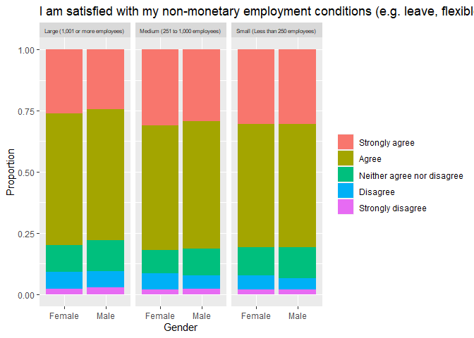

<br>


```r
#Attach packages
library(janitor)
library(dplyr)
library(ggplot2)
library(tidyverse)
```


# Executive Summary
The report finds that overall there are more women in executive and senior executive roles. However, once the proportions of female and male survey responses are taken into account, we find that women are proportionally underrepresented in senior executive and executive positions. This disparity is most evident in older age groups (over 40). The study also finds that women in the APS report more positively on their jobs. This was slightly more  noticeable in large (1,001 or more employees) companies, compared to medium or small companies. The most dramatic gender disparity found was that women are more likely to agree that they are fairly remunerated for the work that they do. The only statement men were noticeably more likely to agree to was “I suggest ideas to improve our way of doing things”. 


# Initial Data Analysis (IDA)
## Purpose
This study aims to investigate the competitiveness of women in the workplace and the differences in job satisfaction between women and men in differing job classifications, company sizes and age. According to the WorkPlace Gender Equality Agency, women hold 14.6% of chair positions and 28.1% of directorships [1]. This reveals an equity imbalance, our investigation aims to shed light on the reasons for such disparities. 

## Stakeholders
The stakeholders for this study are working women and the companies that employ them.

## Data
### Source
The dataset originates from the Australian Public Service (APS) Survey of Employees (2020), where the survey ran between October 12th to November 13th 2020. Participants were randomly sampled from 108085 Australian Public Servants, and the survey includes 66 questions that considered 218 independent variables associated with workplace issues such as job satisfaction, learning and development and leadership.

### Ethical considerations
The identification of the questionnaire to an individual could lead to workplace tensions and data sharing to third parties could cause malicious intent. It is crucial that the data is kept secure before de-identification to prevent an invasion of privacy, which has been maintained by the privacy policy and post-privacy impact study by the APS. Measures such as: data storage with limited access and assessing the privacy risks of releasing the data ensures ethical considerations are upheld to a high standard. 

### Limitations
The response rate was 78% creating non-response bias and spurious correlations. E.g.,, female executives may have less time to answer the survey leading data to form accurate correlations. The dataset has a 5.7% missing value rate for each item on average, reducing how representative the sample is, and the ability to infer accurate correlations. Gender response rates for male respondents was 60% more, leading to a less accurate representation of females to form accurate conclusions.


# Initial Data Cleaning


```r
#To reproduce this report, change the working directory as required,
setwd('C:/Projects')

#Read the data and replace all empty variables with NA
survey = read.csv("2020-aps-employee-census-dataset.csv", na.strings=c("", "NA"), strip.white=TRUE)
```

First, we will investigate the relevant contingency tables:


```r
# Check breakdown by gender
table(survey$q1)
```

```
## 
##                                 Female                                   Male 
##                                  64494                                  39875 
##                      Prefer not to say X (Indeterminate/Intersex/Unspecified) 
##                                   3436                                    280
```

We cannot accurately analyse using the 'X' and 'Prefer not to say' categories. It would be interesting to analyse if we knew which participants identified outside the gender binary, including non-binary and intersex candidates. However the data we have on these participants is very limited, as the 'X' category groups these people with others who simply did not specify gender. As such, for the remainder of this report, when analysing gender we will only look at those who identify as Female and Male.

As gender will be a key focus of the report, it is best to visualise the breakdown:

```r
# Create clean set, with only Male and Female
survey_gender <- survey %>% filter(q1 != "Prefer not to say") %>% filter(q1 != "X (Indeterminate/Intersex/Unspecified)")
```

```r
survey_gender %>%
  group_by(q1) %>%
  summarise(counter=n()) %>%
  ungroup() %>%
  ggplot(aes(fill=q1, x=q1, y=counter))+geom_bar(stat="identity") + xlab("Gender")+ylab("Count")+theme(legend.position = "none") 
```

<!-- -->


Clearly, there are significantly more Female participants than Male participants took part in the study. Therefore, proportionate analysis may be most appropriate for this report.


```r
# Check breakdown by level
table(survey$q5.)
```

```
## 
##                   EL                  SES Trainee/Graduate/APS 
##                32755                 2635                72691
```

Clearly there are 4 null values, which will need to be removed when analysing using this variable. Interestingly, the data has already been split into EL (Executive Level), SES (Senior Executive Service) and Trainee/Graduate/APS.


```r
# Check age
table(survey$q2.)
```

```
## 
##    40 to 54 years 55 years or older    Under 40 years 
##             47638             18899             41544
```
The age variable may be difficult to analyse well. The groups that this data has already been grouped into seem quite random, and are not necessarily very useful for analyse. We need to be careful not to generalise when analysing this variable. We might see a trend changing between the different categories, but it is impossible to identify which actual age group is responsible. For instance, if we saw that people under 40 showed higher rates of another variable, this could be completely explained by one age group (i.e. 30-40) and another group within the under 40 range may show the opposite trend. This is called Simpson's paradox.


```r
# Check company size
table(survey$AS)
```

```
## 
## Large (1,001 or more employees) Medium (251 to 1,000 employees) 
##                           93586                            9998 
## Small (Less than 250 employees) 
##                            4501
```
We can see that the vast majority of companies are classified as "Large". This could possibly mean that trends are more easily identified using the Large companies, as the sample is significantly larger, increasing the likelihood that this sample reflects the overall population. However, this proportion of small comapnies to medium companies to large companies may also just be reflective of the population.


# Research Questions


## Question 1: Gender vs. Classification Level

For this aspect of the report, we want to investigate the relationship between gender (Male vs. Female) and Classification Level. Here, we have the following Classification Levels:


- Trainee/Graduate/APS


- EL = Executive Level


- SEL = Senior Executive Service

Below, we construct a proportionate bar chart, which breaks down each gender by their classification levels:

```r
survey_gender%>%
  group_by(q5.,q1) %>%
  summarise(counter=n()) %>%
  ungroup() %>%
  ggplot(aes(fill=q5.,x=q1, y=counter))+geom_bar(position="fill",stat="identity")+ labs(title = "Classification Level by Gender (Proportionate)", fill = "Classification Level") +xlab("Gender")+ylab("Proportion") 
```

<!-- -->

We can see from the graph above that a larger proportion of Females are at the Trainee/Graduate/APS level compared to Males. There is also a larger proportion of Males in both Executive Level and Senior Executive Level roles. 

These findings are reflective of our domain knowledge, as we are aware that women are less likely to gain executive roles. However, it is important to note that overall there are more women in executive roles, when we look at overall numbers as opposed to proportions. This is explained by the much higher number of women surveyed. This can be seen in the graphs below.


```r
survey_gender%>%
  group_by(q5.,q1) %>%
  summarise(counter=n()) %>%
  ungroup() %>%
  ggplot(aes(fill=q5.,x=q1, y=counter))+geom_bar(position="dodge",stat="identity")+ labs(title = "Classification Level by Gender", fill = "Classification Level (Count)") +xlab("Gender")+ylab("Count")
```

<!-- -->

It is difficult to see from above, due to scale requirements, whether there are more men or women in Senior Executive Service roles. This is investigated in the barchart below:


```r
SES_only <- survey_gender%>% filter(q5. == "SES")
SES_only %>%
  group_by(q1) %>%
  summarise(counter=n()) %>%
  ungroup() %>%
  ggplot(aes(fill=q1,x=q1, y=counter))+geom_bar(stat="identity")+ labs(title = "SES by Gender")+theme(legend.position = "none") +xlab("Gender")+ylab("Count")
```

<!-- -->
As we can see, there are slightly more women in SES roles than men. In fact, we can look at the contingency table and see that the breakdown is as follows:


```r
table(SES_only$q1)
```

```
## 
## Female   Male 
##   1328   1282
```

## Question 2: Gender vs. Classification Level vs. Age

For this question, we investigate the age aspect in the breakdown of classification levels by gender. 


```r
# Filter out NA's from age category
survey_genage <- survey_gender %>% filter(q2. !="")
```


```r
survey_genage%>% mutate(across(q2., factor, levels=c("Under 40 years","40 to 54 years","55 years or older"))) %>%
  group_by(q5.,q1,q2.) %>%
  summarise(counter=n()) %>%
  ungroup() %>%
  ggplot(aes(fill=q5.,x=q1, y=counter))+geom_bar(position="fill",stat="identity")+ labs(title = "Gender vs. Classification by Age", fill="Classification Level") +facet_wrap(~q2.) + xlab("Gender") + ylab("Proportion")
```

<!-- -->
This shows a larger proportion of older men in executive levels, whilst the Female proportions stay relatively stable. This could imply that once people are older than 40 the gender gap worsens. This could be because it is only at this age that most people are beginning to reach the executive level, and clearly female people are not reaching it at the same stage men are. However, we should be cautious of drawing conclusion from this data due to the large groupings.


## Question 3: Gender vs. Job Satisfaction

For this question, we investigated job satisfaction by gender.


```r
question17 <- function(subsquestion, title_parsed){
survey_gender <- survey[c("AS", "q1", subsquestion)]
colnames(survey_gender) <- c("Size", "Gender", "Question")
survey_gender <- survey_gender %>% filter(!is.na(Question), Question!="NA",Gender=="Female"| Gender=="Male") %>% mutate(across(Question, factor, levels=c("Strongly agree","Agree","Neither agree nor disagree","Disagree","Strongly disagree"))) %>%
  group_by(Size,Gender,Question) %>%
  summarise(counter=n()) %>%
  ungroup()
  graph <- ggplot(survey_gender, aes(fill=Question,x=Gender, y=counter))+
            geom_bar(position="fill",stat="identity")+
            labs(title = "Level")+facet_wrap(~Size)+
            xlab("Gender")+ylab("Proportion")+
            labs(title = title_parsed)+
            theme(legend.title = element_blank(), strip.text.x = element_text(size = 6))

  return(graph)
}
graph17a <- question17("q17a", 'I can see a clear connection between my job and my agency’s purpose')
graph17a
```

<!-- -->

```r
graph17b <- question17("q17b", 'The work I do gives me a sense of accomplishment')
graph17b
```

<!-- -->

```r
graph17c <- question17("q17c", 'I am satisfied with the recognition I receive for doing a good job')
graph17c
```

<!-- -->

```r
graph17d <- question17("q17d", 'I am fairly remunerated (e.g. salary, superannuation) for the work that I do')
graph17d
```

<!-- -->

```r
graph17e <- question17("q17e", 'I am satisfied with my non-monetary employment conditions (e.g. leave, flexible work  arrangements, other benefits)')
graph17e
```

<!-- -->

```r
graph17f <- question17("q17f", 'I am satisfied with the stability and security of my job')
graph17f
```

<!-- -->

```r
graph17g <- question17("q17g", 'I suggest ideas to improve our way of doing things')
graph17g
```

<!-- -->

```r
graph17h <- question17("q17h", 'I am happy to go the ‘extra mile’ at work when required')
graph17h
```

<!-- -->

```r
graph17i <- question17("q17i", 'Overall, I am satisfied with my job')
graph17i
```

<!-- -->

```r
graph17j <- question17("q17j", 'I understand how my role contributes to achieving an outcome for the Australian public')
graph17j
```

<!-- -->

```r
graph17k <- question17("q17k", 'My job inspires me')
graph17k
```

<!-- -->

```r
graph17l <- question17("q17l", 'I can see a clear connection between my job and my agency’s purpose')
graph17l
```

<!-- -->

Overall, we see that men are slightly more likely to show job dissatisfaction, responding with neutrality or disagreement where women respond agreeably. This is most evident in large companies, and reduces with company size. It is important to remember that there are significantly more "Large" companies surveyed, so there is a possibility that these values more accurately reflect the wider population.

The most significant disparity in responses is to the statement "I am fairly remunerated for the work that I do". This is interesting to cross-reference with the results from question one, which showed that a greater proportion of women were in junior level roles. Possibly, there could be a connection between women already being satisfied with their remunerations and thus being less likely to directly request a promotion, despite reporting greater tendency to go the 'extra mile'. This reflects studies on female psychology, as women are punished unequally for assertive and/or ambitious behaviours, reducing their tendency to request a promotion or feel that they deserve higher wages [2].

Notably, it seems that the only statement men are more likely to agree to is "I suggest ideas to improve our way of doing things". Below is a table displaying the proportions (as percentages) of males and females with each response to this statement.

```r
survey_gender <- survey_gender %>%mutate(across(q17g, factor, levels=c("Strongly agree","Agree","Neither agree nor disagree","Disagree","Strongly disagree")))
prop.table(table(survey_gender$q17g,survey_gender$q1),margin=2)*100
```

```
##                             
##                                  Female       Male
##   Strongly agree             23.5458367 25.4383072
##   Agree                      61.1783899 60.2618425
##   Neither agree nor disagree 12.7721654 11.6763504
##   Disagree                    2.1647738  2.0932180
##   Strongly disagree           0.3388342  0.5302819
```

This shows that males in the survey agreed (strongly agree and agree combined) slightly more often then females. Interestingly, this could be related to aforementioned female tendency to be less assertive. More research in this area would be required to justify such claims.

Furthermore, we find that the smallest gender disparities were to the statements "I can see a clear connection between my job and my agency's purpose", "I am satisfied with my non-monetary employment conditions" and "I am satisfied with the stability and security of my job". This suggests that these aspects of employment affect men and women relatively equally.

# References
[1] https://www.wgea.gov.au/publications/gender-workplace-statistics-at-a-glance-2021#:~:text=Latest%20results%20from%20the%20Agency's,no%20female%20directors%20%5B20%5D.


[2] https://wappp.hks.harvard.edu/files/wappp/files/social_incentives_for_gender_differences_in_the_propensity_to_initiate_negotiations-_sometimes_it_does_hurt_to_ask_0.pdf
