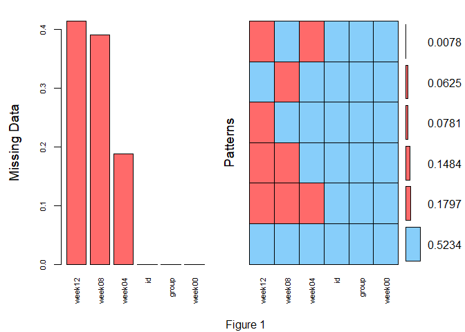
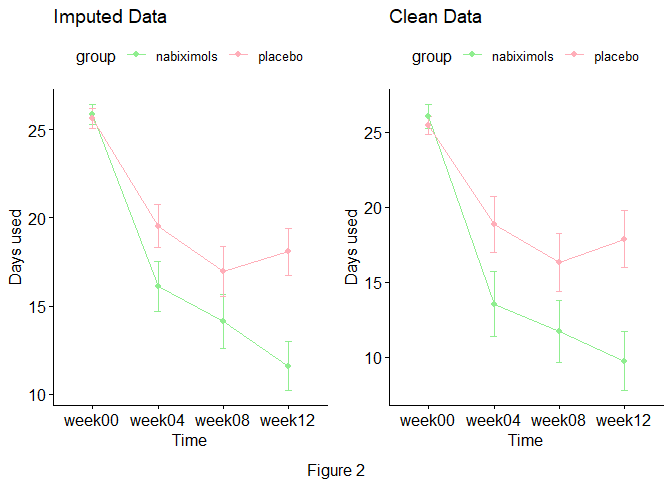
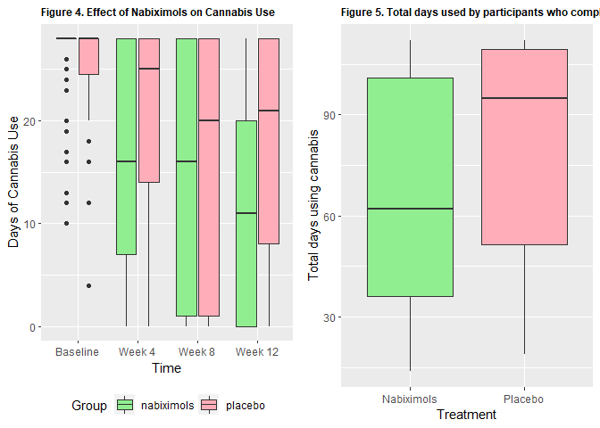
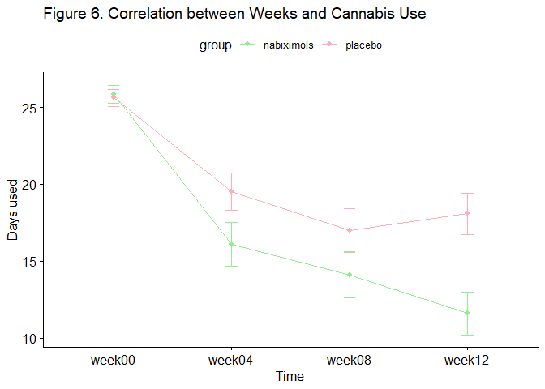
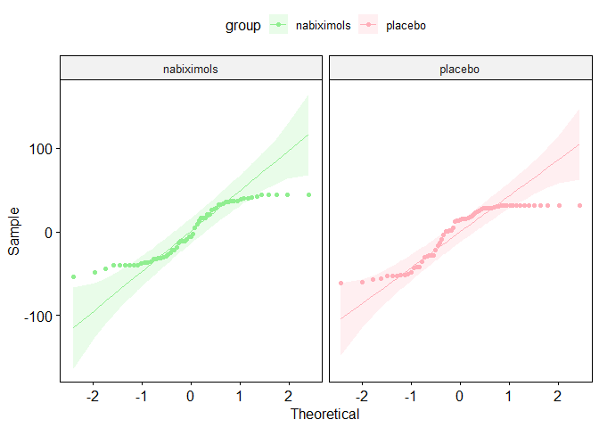
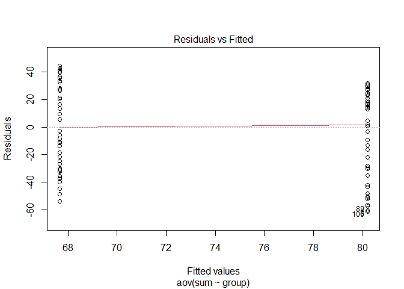

<br>

<font size="6"> **Executive Summary** </font>

This report aims to analyse the effectiveness of nabiximols for treating cannabis use disorder from a randomised controlled trial. Although both placebo and nabiximol groups reduced consumption over the 12-week period, nabiximols are correlated with a decreased consumption of cannabis, measured through the primary outcome of self-reported days cannabis was consumed. 

<br>

<font size="6"> **Full Report** </font> 

<font size="5"> **Research Questions** </font>


<font size="5">**Initial Data Analysis (IDA)**</font>

**Source**

Data is derived from a double-blind randomised controlled trial over 12 weeks, where cannabis-use dependent participants were administered either placebo or nabiximol treatments and had check-ups quad-weekly. 

**Structure**

The given data contains 3 variables. *‘id’* denotes  participant ID. *’group’* is a categorical predictor variable indicating the treatment group: either ‘nabiximols’ or ‘placebo’. *’week’* is a categorical predictor variable with 4 levels: week00, week04, week08 and week12, corresponding to the quad-weekly check-ups. *’cu_total’* is a discrete numerical outcome variable recording the days the participant used cannabis in the preceding 28 days. 


```r
## Initial data cleanup
# Converting character variables to factor
CBS$group <- as.factor(CBS$group)
CBS$week <- as.factor(CBS$week)

# The classification of variables
str(CBS)
```

```
## 'data.frame':	398 obs. of  4 variables:
##  $ id      : int  1 1 1 1 2 2 2 3 3 3 ...
##  $ group   : Factor w/ 2 levels "nabiximols","placebo": 1 1 1 1 1 1 1 1 1 1 ...
##  $ week    : Factor w/ 4 levels "week00","week04",..: 1 2 3 4 1 2 3 1 2 3 ...
##  $ cu_total: int  13 12 12 12 28 0 NA 16 9 2 ...
```

```r
names(CBS)
```

```
## [1] "id"       "group"    "week"     "cu_total"
```

```r
dim(CBS)
```

```
## [1] 398   4
```

**Limitations**


```r
# Transform the raw data (including missing values) so that week becomes a unique column with each of its cu_total values  under it 

filteredCBS <- spread(CBS, 
                      week, 
                      cu_total)

# Create a set with just the placebo data and a set with only nabiximol data
filteredPlacebo <- subset(filteredCBS, 
                           group=="placebo")

filteredNabiximols <- subset(filteredCBS,
                                   group=="nabiximols")

filteredCBS %>%
  rowwise() %>%
  mutate(
    totalDaysUse = sum(c_across(week04:week12),
                       na.rm = T),
    totalObsDays = (3 - sum(is.na(
      c_across(week04:week12)
    ),
    na.rm = T)) * 28,
    completedTrial = factor(
      ifelse(totalObsDays < 84,
             "didNotComplete",
             "completed"),
      levels = c("didNotComplete",
                 "completed")
    )
  ) %>% ungroup() -> filteredCBS1

dropouts <- subset(filteredCBS1, completedTrial == "didNotComplete")
```

**1. Short duration**

This trial lasted 12 weeks. Although a correlation between nabiximols and decreased cannabis intake was suggested, long-term effects/success cannot be derived. Future study should observe cannabis intake over a prolonged period of time.

**2. High drop-out rates**

Out of 128 participants, 61 participants dropped out of the study. Compliance bias means participants compliant to treatment may differ from non-compliant participants, thereby potentially creating confounding. Participants who a) joined the study and b) completed the study likely possess pre-existing willpower to actively decrease cannabis use.

<br>


```r
#Testing for MCAR

daysOnly <- filteredCBS %>% select(3:6)

# library(MissMech)

# TestMCARNormality(daysOnly, 
#                   imputation.method = "Dist.Free",
#                   method = 'Hawkins')


## Histogram of missing values
aggr(filteredCBS, 
     col=c('lightskyblue',
           'indianred1'), 
     numbers=TRUE,
     sortVars=TRUE, 
     labels=names(filteredCBS), 
     cex.axis=.7, 
     gap=3, 
     ylab=c("Missing Data",
            "Patterns"))
```

```
## 
##  Variables sorted by number of missings: 
##  Variable     Count
##    week12 0.4140625
##    week08 0.3906250
##    week04 0.1875000
##        id 0.0000000
##     group 0.0000000
##    week00 0.0000000
```

```r
title(sub = "Figure 1")
```

<!-- -->


```r
#Assigning imputed values to new dataset
impCBS <- complete(temporary, 4)

#Changing the dataset back to long data so that it is more easily visualised
impCBS %>% 
  pivot_longer(cols = starts_with("week"),
             names_to = "week",
             values_to = "cu_total") -> impCBSlong

#Comparing the two plots
impLine <- ggline(impCBSlong, 
       x = "week", 
       y = "cu_total", 
       add = c("mean_se"),
       color = "group", 
       palette = c("lightgreen", "lightpink1"),
       xlab = 'Time',
       ylab = 'Days used',
       title = 'Imputed Data')

# Ommiting participants who dropped out
CBS %>%
  pivot_wider(names_from = week,
              values_from = cu_total) %>%
  na.omit() %>% 
  pivot_longer(cols = starts_with("week"),
             names_to = "week",
             values_to = "cu_total") -> CBSclean

cleanLine <- ggline(CBSclean, 
       x = "week", 
       y = "cu_total", 
       add = c("mean_se"),
       color = "group",
       palette = c("lightgreen", "lightpink1"),
       xlab = 'Time',
       ylab = 'Days used',
       title = 'Clean Data')

temp <- ggarrange(impLine, cleanLine)

annotate_figure(temp,
                bottom = 'Figure 2')
```

<!-- -->

Missing data was then analysed separately. As per Figure 3, a long-term correlation between  Comparing all datasets, nabiximols are suggested to decrease cannabis use.


```r
## Data cleaning

#created a new dataset for nabiximol participants who completed the study
comNabi <- subset(filteredCBS,
                  group == "nabiximols" &
                    !is.na(week04) &
                    !is.na(week08) &
                    !is.na(week12))

# Removing 'group' from dataset
comNabi <- subset(comNabi,
                  select = -c(2))


#Created a new dataset for nabiximols participants who left in week 8 but came back in week 12
w8DpNabi <- subset(filteredCBS,
                   group == "nabiximols" &
                     is.na(week08) &
                     !is.na(week04) &
                     !is.na(week12))

# Removing 'group' from dataset
w8DpNabi <- subset(w8DpNabi,
                   select = -c(2))
```


```r
#created a new dataset for placebo participants who completed the study
comPlac <- subset(filteredCBS,
                  group == "placebo" &
                    !is.na(week04) &
                    !is.na(week08) &
                    !is.na(week12))

# Removing 'group' from dataset
comPlac <- subset(comPlac,
                  select = -c(2))

#Created a new dataset for nabimols participants who left in week 8 but came back in week 12
w8DpPlac <- subset(filteredCBS,
                   group == "placebo" &
                     is.na(week08) &
                     !is.na(week04) &
                     !is.na(week12))

# Removing 'group' from dataset
w8DpPlac <- subset(w8DpPlac,
                   select = -c(2))
```


```r
## Averaging each group

#Averaging drop out nabiximols group
                        
ntemp <- w8DpNabi %>%
  select(2:5)

AvgDpNabi <-
  data.frame(
    "week00" = round(mean(ntemp[["week00"]])),
    "week04" = round(mean(ntemp[["week04"]])),
    "week08" = NA,
    "week12" = round(mean(ntemp[["week12"]]))
  )

AvgDpNabi$group = "Drop Out: Nabiximols"
```


```r
#Averaging drop out placebo group
ptemp <- w8DpPlac %>% select(2:5)

AvgDpPlac <- data.frame("week00" = round(mean(ptemp[["week00"]])), "week04" = round(mean(ptemp[["week04"]])), "week08" = NA, "week12" = round(mean(ptemp[["week12"]])))

AvgDpPlac$group = "Drop Out: Placebo"
```


```r
#Averaging Nabiximol Completed group

comNabi1 <- comNabi %>% select(2:5)

AvgComNabi <-
  data.frame(
    "week00" = round(mean(comNabi1[["week00"]])),
    "week04" = round(mean(comNabi1[["week04"]])),
    "week08" = round(mean(comNabi1[["week08"]])),
    "week12" = round(mean(comNabi1[["week12"]]))
  )

AvgComNabi$group = "Completed: Nabiximol"
```


```r
# Averaging placebo completed group

comPlac1 <- comPlac %>% select(2:5)

AvgComPlac <-
  data.frame(
    "week00" = round(mean(comPlac1[["week00"]])),
    "week04" = round(mean(comPlac1[["week04"]])),
    "week08" = round(mean(comPlac1[["week08"]])),
    "week12" = round(mean(comPlac1[["week12"]]))
  )

AvgComPlac$group = "Completed: Placebo"
```


```r
#Graphing 
total <- rbind(AvgComPlac,
               AvgComNabi,
               AvgDpNabi,
               AvgDpPlac)


total_graph <- total %>% gather(key = week,
                                value = cu_total,
                                week00:week12)
# Converting
total_graph$group = as.factor(total_graph$group)
total_graph$week = as.factor(total_graph$week)
total_graph$cu_total = as.numeric(total_graph$cu_total)

total_graph_scatter <-
  plot_ly(
    total_graph[!is.na(total_graph$cu_total),],
    x = ~ week,
    y = ~ cu_total,
    type = 'scatter',
    name =  ~ group,
    mode = 'lines+markers'
  )

total_graph_scatter %>% layout(
  title = "Figure 3. Nabiximol & Placebo: Drop Out vs Completed",
  yaxis = list(title = "Days using Cannabis"),
  xaxis = list(
    title = "Week",
    tickvals = c('week00',
                 'week04',
                 'week08',
                 'week12'),
    ticktext = c('Baseline',
                 'Week 4',
                 'Week8',
                 'Week 12')
  )
)
```

```{=html}
<div id="htmlwidget-9eceb20dc2a931752ae4" style="width:672px;height:480px;" class="plotly html-widget"></div>
<script type="application/json" data-for="htmlwidget-9eceb20dc2a931752ae4">{"x":{"visdat":{"1084a51438b":["function () ","plotlyVisDat"]},"cur_data":"1084a51438b","attrs":{"1084a51438b":{"x":{},"y":{},"mode":"lines+markers","name":{},"alpha_stroke":1,"sizes":[10,100],"spans":[1,20],"type":"scatter"}},"layout":{"margin":{"b":40,"l":60,"t":25,"r":10},"title":"Figure 3. Nabiximol & Placebo: Drop Out vs Completed","yaxis":{"domain":[0,1],"automargin":true,"title":"Days using Cannabis"},"xaxis":{"domain":[0,1],"automargin":true,"title":"Week","tickvals":["week00","week04","week08","week12"],"ticktext":["Baseline","Week 4","Week8","Week 12"]},"hovermode":"closest","showlegend":true},"source":"A","config":{"modeBarButtonsToAdd":["hoverclosest","hovercompare"],"showSendToCloud":false},"data":[{"x":["week00","week04","week08","week12"],"y":[26,14,12,10],"mode":"lines+markers","name":"Completed: Nabiximol","type":"scatter","marker":{"color":"rgba(31,119,180,1)","line":{"color":"rgba(31,119,180,1)"}},"error_y":{"color":"rgba(31,119,180,1)"},"error_x":{"color":"rgba(31,119,180,1)"},"line":{"color":"rgba(31,119,180,1)"},"xaxis":"x","yaxis":"y","frame":null},{"x":["week00","week04","week08","week12"],"y":[25,19,16,18],"mode":"lines+markers","name":"Completed: Placebo","type":"scatter","marker":{"color":"rgba(255,127,14,1)","line":{"color":"rgba(255,127,14,1)"}},"error_y":{"color":"rgba(255,127,14,1)"},"error_x":{"color":"rgba(255,127,14,1)"},"line":{"color":"rgba(255,127,14,1)"},"xaxis":"x","yaxis":"y","frame":null},{"x":["week00","week04","week12"],"y":[23,20,17],"mode":"lines+markers","name":"Drop Out: Nabiximols","type":"scatter","marker":{"color":"rgba(44,160,44,1)","line":{"color":"rgba(44,160,44,1)"}},"error_y":{"color":"rgba(44,160,44,1)"},"error_x":{"color":"rgba(44,160,44,1)"},"line":{"color":"rgba(44,160,44,1)"},"xaxis":"x","yaxis":"y","frame":null},{"x":["week00","week04","week12"],"y":[28,26,20],"mode":"lines+markers","name":"Drop Out: Placebo","type":"scatter","marker":{"color":"rgba(214,39,40,1)","line":{"color":"rgba(214,39,40,1)"}},"error_y":{"color":"rgba(214,39,40,1)"},"error_x":{"color":"rgba(214,39,40,1)"},"line":{"color":"rgba(214,39,40,1)"},"xaxis":"x","yaxis":"y","frame":null}],"highlight":{"on":"plotly_click","persistent":false,"dynamic":false,"selectize":false,"opacityDim":0.2,"selected":{"opacity":1},"debounce":0},"shinyEvents":["plotly_hover","plotly_click","plotly_selected","plotly_relayout","plotly_brushed","plotly_brushing","plotly_clickannotation","plotly_doubleclick","plotly_deselect","plotly_afterplot","plotly_sunburstclick"],"base_url":"https://plot.ly"},"evals":[],"jsHooks":[]}</script>
```


<font size="7"> **Test whether nabiximols was associated with fewer days of cannabis use than placebo?** </font>


```r
#Data cleanup

#Converting character variables to factor
impCBSlong$group <- as.factor(impCBSlong$group)

#Creating a new variable showing the sums of days using cannabis for participants who completed the study
as.data.frame(impCBSlong) -> impCBSlong

impCBSlong %>%
  pivot_wider(names_from = week,
              values_from = cu_total) %>% mutate(sum = rowSums(.[3:6])) -> CBStotal
```
A one-way ANOVA modeled the correlation between nabiximol / placebo use and total days used per participant. The variable 'sum' was introduced to the dataset, representing total days of cannabis use per participant.

Figure 4, 5 and 6, representing an initial basic visualisation of the data, suggest a correlation between nabiximols and decreased cannabis use.


```r
#Basic box plot of initial clean data
initialBox = ggplot(impCBSlong,
                    aes(x = week,
                        y = cu_total)) +
  geom_boxplot(aes(fill = group)) +
  ggtitle("Figure 4. Effect of Nabiximols on Cannabis Use") +
  labs(x = "Time",
       y = "Days of Cannabis Use") +
  labs(fill = "Group") +
  scale_fill_manual(values = c('lightgreen', 'lightpink1')) +
  scale_x_discrete(
    breaks = c("week00", "week04", "week08", "week12"),
    labels = c("Baseline", "Week 4", "Week 8", "Week 12")
  ) +
  theme(plot.title = element_text(size = 9, face = "bold")) + 
  theme(legend.position="bottom")

#Box plot of total days used
initialSumBox = ggplot(CBStotal,
                       aes(x = group,
                           y = sum)) +
  geom_boxplot(aes(fill = group)) +
  ggtitle("Figure 5. Total days used by participants who completed the study") +
  theme(plot.title = element_text(size = 9, face = "bold")) +
  scale_fill_manual(values = c('lightgreen', 'lightpink1')) +
  labs(x = 'Treatment', y = 'Total days using cannabis') +
  theme(legend.position = "none") +
  scale_x_discrete(labels = c("Nabiximols", "Placebo"))

ggarrange(initialBox, initialSumBox)
```

<!-- -->


```r
CBS.aov <- aov(sum ~ group, 
               data = CBStotal)

summary(CBS.aov)
```

```
##              Df Sum Sq Mean Sq F value Pr(>F)  
## group         1   5020    5020   4.737 0.0314 *
## Residuals   126 133514    1060                 
## ---
## Signif. codes:  0 '***' 0.001 '**' 0.01 '*' 0.05 '.' 0.1 ' ' 1
```

The null hypothesis is that the means between the nabiximol group and the placebo group are identical. An ANOVA test displays 0.0313831 , so P<.05, and the null hypothesis is rejected. Therefore, the mean total days of cannabis use between the placebo and nabiximol group are different.

The F-statistic is 4.7371198, which is also statistically significant and suggests that the variation caused by the predictor variable (nabiximols vs placebo) is not by chance.


```r
ggline(impCBSlong, 
       x = "week", 
       y = "cu_total", 
       add = c("mean_se"),
       color = "group", 
       palette = c("lightgreen", "lightpink1"),
       xlab = 'Time',
       ylab = 'Days used',
       title = 'Figure 6. Correlation between Weeks and Cannabis Use')
```

<!-- -->


```r
nabTotalMean = mean(CBStotal$sum[CBStotal$group =="nabiximols"])

placTotalMean = mean(CBStotal$sum[CBStotal$group =="placebo"])
```
As observed in Figure 6, there is little intrinsic variation between the baseline average of the two groups, but the rate at which cannabis use is much steeper initially and remains low. On average, the nabiximol group used 67.6557377 days, and the placebo group used 80.1940299 days. Therefore, nabiximols resulted in 12.5382921 days overall on average.

<br>

<font size="7"> **Validity of approach** </font>


As we have 1 qualitative predictor variable (group) and 1 quantitative outcome variable (total days), we used a one-way ANOVA.

To ensure this approach was valid, we tested for assumptions:

**1. Variable Type**

Our outcome variable (sum) is discrete quantitative and the predictor variable (group) is qualitative.

**2. Independence**

Due to the randomised, double-blind nature of the trial, sample independence is assumed.

**3. Normality of outcome variable**

 We plot the residuals of the outcome variable on a qqplot:
 

```r
#Adding a column of residuals to the dataframe

CBStotal %>% 
  mutate(resid = residuals(lm(sum ~ group))) -> cbs.resid


#Forming a QQ-plot
ggqqplot(cbs.resid, 
         'resid',
         facet.by = 'group',
         color = 'group',
         palette = c('lightgreen', 'lightpink1'))
```

<!-- -->

As the points mostly fall on the line, the residuals are normal.

**4. Homoscedasticity**


```r
levene_test(sum ~ group, data = CBStotal)
```

```
## # A tibble: 1 × 4
##     df1   df2 statistic     p
##   <int> <int>     <dbl> <dbl>
## 1     1   126     0.497 0.482
```

```r
testcbs = aov(sum ~ group, data = CBStotal)
plot(testcbs, 1)
```

<!-- -->

As P>.05 and no apparent relationship exists between residuals and fitted values, the data is homoscedastic.

As all assumptions are met, we can assume that this model can be analysed reliably.


**Statistical Analyses**

A 1-way ANOVA was used to model data and identify whether the null hypothesis can be rejected. As P<.05, the null hypothesis is rejected, so the means of the two groups (nabiximols & placebo) significantly differs. The F-statistic was also tested and was statistically significant. Assumptions of normality, homoscedasticity, and sample independence were met. 

  We used Little MCAR's test to determine that missing data was not purely random. Due to compliance bias, this was likely Missing Not at Random. We used simple imputation (predictive mean matching) to handle this, and plotted it against a complete case analysis. As missing data made up 41.40625% and 39.06250% of data for Week 12 and 8 respectively, omitting data may overly reduce sample size and reduce statistical efficiency.
  
  Nabiximol use is correlated with decreased cannabis use. Overall, throughout the trial, participants provided with nabiximols resulted in 12.5382921 less days overall on average. Further research should clarify long-term effects.


## Related Articles

Allsop et al. (2014) inferred that while nabiximols showed a greater efficacy in reducing symptoms of cannabis withdrawal, placebo was as effective as nabiximols in promoting long-term reductions in cannabis consumption. This is similar to our findings in that both the placebo and nabiximols groups showed a general downwards trend in cannabis use over the weeks past. However, overall the nabiximols group showed a greater rate of reduction compared to the placebo group. As pointed out by Bhardwaj et al. (2018), the participants’ level of commitment in reducing cannabis consumption may also be a factor that had affected the results. This may possibly be an explanation for the general downwards trend. In that case, a greater rate of reduction may be indicative of a stronger effect of nabiximols on cannabis use than placebo, but to measure the specific efficacy of nabiximols on reducing cannabis consumption may require more data and investigation. 


## References

Allsop, D. J., Copeland, J., Lintzeris, N., Dunlop, A. J., Montebello, M., Sadler, C., Rivas, G. R., Holland, R. M., Muhleisen, P., Norberg, M. M., Booth, J., & McGregor, I. S. (2014). Nabiximols as an Agonist Replacement Therapy During Cannabis Withdrawal: A Randomized Clinical Trial. JAMA Psychiatry, 71(3), 281. https://doi.org/10.1001/jamapsychiatry.2013.3947

Lintzeris, N., Bhardwaj, A., Mills, L., Dunlop, A., Copeland, J., & McGregor, I. et al. (2019). Nabiximols for the Treatment of Cannabis Dependence. JAMA Internal Medicine, 179(9), 1242. https://doi.org/10.1001/jamainternmed.2019.1993

Bhardwaj, A. K., Allsop, D. J., Copeland, J., McGregor, I. S., Dunlop, A., Shanahan, M., Bruno, R., Phung, N., Montebello, M., Sadler, C., Gugusheff, J., Jackson, M., Luksza, J., & Lintzeris, N. (2018). Randomised Controlled Trial (RCT) of cannabinoid replacement therapy (Nabiximols) for the management of treatment-resistant cannabis dependent patients: a study protocol. BMC Psychiatry, 18(1). https://doi.org/10.1186/s12888-018-1682-2

<br>


