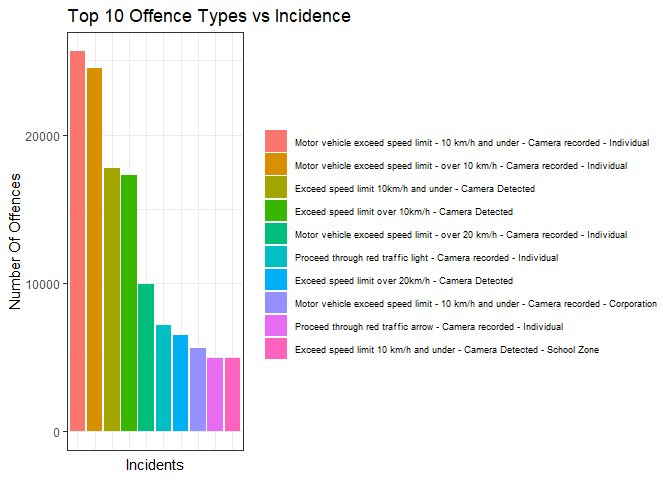
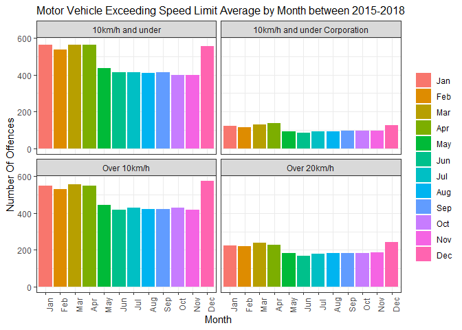
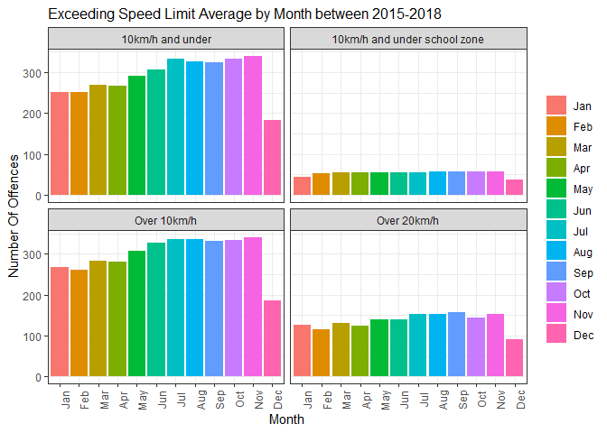
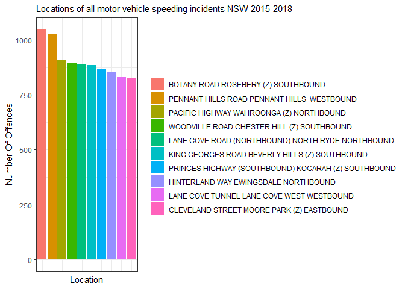
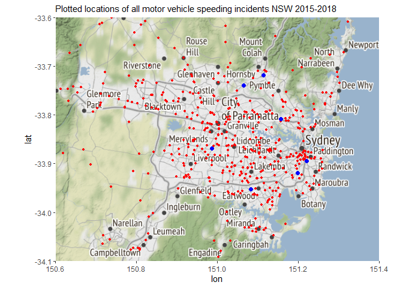

# Executive Summary
This report aims to analyse the most common road offences in NSW, and patterns in these offences. It was found that eight out of the ten the most common road offences between 2015-2018 were speeding related, and these speeding offences increased for motor vehicles during the summer months of December to April. However, for motor vehicles of all classes, speeding incidents increased throughout the year, and dropped in December. Through plotting the locations of the speeding incidents on a map of Sydney, it was found that there was a relatively uniform spread, however, there is a large cluster of speeding incidents around the CBD. 

# Recommendaton
Service NSW wants to know where and when they should increase police patrols in order to reduce speeding offences in NSW.

It is recommended that they increase police radar detectors during the months of December and April. As nine out of the ten most commons speeding locations are in Sydney, it is recommended that the police force increase the number of speed cameras and stationary police officers in:

* Botany Road, Rosebery
* Pennant Hills Road, Pennant Hills
* Pacific Highway, Wahroonga
* Woodville Road, Chester Hill
* Lane Cove Road (Northbound), North Ryde
* King Georges Road, Beverly Hills
* Hitherland Way, Ewingsdale
* Lane COve Tunnel, Lane Cove
* Cleveland Street Moore PARK

# Initial Data Anaysis
## Source
The dataset was obtined from the New South Wales Government and is for road incidents between 2015-2018. Within the data set there are 284,404 rows with 25 columns. 
<br>

## Structure
The following image is obtain from the the penalty data notes (NSW Government Resources, 2019), and outlines the structure of the data set.


## Limitations
Within the column of 'OFFENCE_DESC' it was unclear what the difference between the record 'Motor Vehicle Exceed Speed Limit' and 'Exceed Speed Limit' was. In this report, it was assumed that 'Motor Vehicle Exceed Speed Limit' referred to motor vehicles of Classes A, B and C that fell under rule 20 in the NSW demerit handbook (Road Waterways Transport NSW, n.d.), while 'Exceed Speed Limit' referred to all other motor vehicles and rules in the handbook.

Another limitation was in the mapping of the physical addresses to longitude and latitude coordinates, where some points that were in Sydney could not be found through OpenStreetMap (OpenStreetMap, n.d.). In order to mitigate this in further trials, it is recommended to perform further data cleaning on the location data to yield more accurate results through OpenStreetMap, or to utalise paid API options such as Google Cloud (Cloud Computing, Hosting Services, and APIs |, n.d.). Another way to mitigate this limitation could be to find a document where the meaning the variables in 'LOCATION_CODE' are listed as it is not provided in the data source, and could be used to map incidents to speicifed locations.

## Hypothesis
H(0): The speeding incidents for each month are equally distributed.
<br>
H(1): The speeding incidents for each month are not equally distributed.

# Evidence
Here we graph the top ten most common offences and their incidence rate.

## Top 10 Incidents

```r
#Filter the data to only contain the column of accident types
accidentType <- penalties %>% select(2, 3, 4) #Date, Offence Code, Type

#Create a new data frame to store the number of each type
accidentTypeSum <- aggregate(x = accidentType, by = list(accidentType$OFFENCE_DESC), FUN = length)

#Order the data from the highest to lowest incident and get the top 10 offences
accidentTypeTop <- accidentTypeSum %>% 
    arrange(desc(OFFENCE_DESC)) %>%
    slice(1:10)

#Reorder the Group.1 trace value by the incidents
accidentTypeTop$Group.1 <- reorder(accidentTypeTop$Group.1, X = -accidentTypeTop$OFFENCE_DESC)#Create a plot of the top 10 types of incidents and quantity

#Plot the Top 10 Incidents
ggplot(accidentTypeTop, aes(x = Group.1, y = OFFENCE_DESC, fill=Group.1))+
  geom_bar(stat="identity")+
  theme_bw()+
  theme(axis.text.x=element_blank(),
        axis.ticks.x=element_blank(),
        legend.title = element_blank(),
        legend.text = element_text(size = 6.5))+
  labs(title="Top 10 Offence Types vs Incidence",
        x ="Incidents", 
        y = "Number Of Offences")
```

<!-- -->
<br>
This graph shows that eight out of the ten most common incidents are speeding related.

## Further Anaysis of Top 10 Incidents
Out of the top ten speeding offences, we investigate the months in which motor vehicles exceeded speed limits.
<br>

```r
#Isolate the dates that the speeding occurs for the first and second most common incidents
MVS_1 <- subset(accidentType, OFFENCE_CODE == 83063, select= -c(2:3))
MVS_2 <- subset(accidentType, OFFENCE_CODE == 82950, select= -c(2:3))
MVS_3 <- subset(accidentType, OFFENCE_CODE == 82995, select= -c(2:3))
MVS_4 <- subset(accidentType, OFFENCE_CODE == 33063, select= -c(2:3))

#Sum all of the duplicate months and their quantities
MVSSum_1 <- aggregate(x = MVS_1, by = list(MVS_1$OFFENCE_MONTH), FUN = length)
MVSSum_2 <- aggregate(x = MVS_2, by = list(MVS_2$OFFENCE_MONTH), FUN = length)
MVSSum_3 <- aggregate(x = MVS_3, by = list(MVS_3$OFFENCE_MONTH), FUN = length)
MVSSum_4 <- aggregate(x = MVS_4, by = list(MVS_4$OFFENCE_MONTH), FUN = length)

#Convert the date to month
MVSSum_1$Group.1 <- month(MVSSum_1$Group.1)
MVSSum_2$Group.1 <- month(MVSSum_2$Group.1)
MVSSum_3$Group.1 <- month(MVSSum_3$Group.1)
MVSSum_4$Group.1 <- month(MVSSum_4$Group.1)

#Convert the month coloumn into a factor variable
MVSSum_1$Group.1  <- as.factor(month.abb[MVSSum_1$Group.1])
MVSSum_2$Group.1 <- as.factor(month.abb[MVSSum_2$Group.1])
MVSSum_3$Group.1 <- as.factor(month.abb[MVSSum_3$Group.1])
MVSSum_4$Group.1 <- as.factor(month.abb[MVSSum_4$Group.1])

#Add all of the month points together
datefig_1 <- aggregate(. ~ MVSSum_1$Group.1, data=MVSSum_1, FUN=sum)
datefig_2 <- aggregate(. ~ MVSSum_2$Group.1, data=MVSSum_2, FUN=sum)
datefig_3 <- aggregate(. ~ MVSSum_3$Group.1, data=MVSSum_3, FUN=sum)
datefig_4 <- aggregate(. ~ MVSSum_4$Group.1, data=MVSSum_4, FUN=sum)

#Divide each of the month points by four (2015-2018)
datefig_1 <- datefig_1  %>% mutate(OFFENCE_MONTH = round(OFFENCE_MONTH/4)) %>% subset(select = c(1,3))

#test <- chisq.test(table(datefig_1$datefig_1_month, datefig_1$expected))

#The p value is so small that is rounds to 0, and contradicts the null hypothesis, therefore the alternative is true

datefig_2 <- datefig_2  %>% mutate(OFFENCE_MONTH = round(OFFENCE_MONTH/4)) %>% subset(select = c(3))

datefig_3 <- datefig_3  %>% mutate(OFFENCE_MONTH = round(OFFENCE_MONTH/4)) %>% subset(select = c(3))

datefig_4 <- datefig_4  %>% mutate(OFFENCE_MONTH = round(OFFENCE_MONTH/4)) %>% subset(select = c(3))

#Rename the columns
colnames(datefig_1) <- c('datefig_1_date', 'datefig_1_month')

#Combine all of the datasets
combined_frame <- data.frame(datefig_1$datefig_1_date, datefig_1$datefig_1_month, datefig_2$OFFENCE_MONTH, datefig_3$OFFENCE_MONTH, datefig_4$OFFENCE_MONTH)

#Rename the columns
colnames(combined_frame) <- c('Date', '10km/h and under', 'Over 10km/h', 'Over 20km/h', '10km/h and under Corporation')

#The aggregate function sorts the names alphabetically, so we override it by creating a vector of the order we want.
combined_frame$Date <- factor(combined_frame$Date,levels = c("Jan", "Feb", "Mar", "Apr", "May", "Jun", "Jul", "Aug", "Sep", "Oct", "Nov", "Dec"))

#Order the dataset by these dates
combined_frame_long <- gather(combined_frame, key="measure", value="value", c("10km/h and under", "Over 10km/h", "Over 20km/h", "10km/h and under Corporation"))

#Plot our faceted graph
ggplot(combined_frame_long, aes(x = Date, y = value, fill=Date))+
  theme_bw()+
  geom_bar(stat="identity")+
  facet_wrap(~measure)+
  theme(legend.title = element_blank(), 
        plot.title = element_text(size=12),
        axis.text.x = element_text(angle = 90))+
  labs(title='Motor Vehicle Exceeding Speed Limit Average by Month between 2015-2018',
        x ="Month", 
        y = "Number Of Offences")
```

<!-- -->
<br>
For the speeding related incidents there appears to be a correlation between speeding and the summer months. According to the Independent UK, “A lot of motorists are travelling further distances over summer but with much less caution than in the winter months. Many drivers enjoy the start of the summer months, making the most of longer evenings and sunny weather to get out more often. They might be tempted to go a little faster on the motorways when the weather starts to improve as well. It’s easy to cover lots of miles when you are visiting the beach, going to festivals, or away on holiday over summer, but don’t relax too much." (Hughes, 2018). However, there is no citation in the article to where their information was gathered, and no research papers could be found in relation to this for Australia. Hence, further investigation in the academic community is recommended to validate these findings.

Here we repeat the same analysis for the 'Exceed Speed Limit' incidents.
<br>

```r
#Isolate the dates that the speeding occurs for the first and second most common incidents
MVS_1 <- subset(accidentType, OFFENCE_CODE == 74701, select= -c(2:3))
MVS_2 <- subset(accidentType, OFFENCE_CODE == 74703, select= -c(2:3))
MVS_3 <- subset(accidentType, OFFENCE_CODE == 74705, select= -c(2:3))
MVS_4 <- subset(accidentType, OFFENCE_CODE == 74702, select= -c(2:3))

#Sum all of the duplicate months and their quantities
MVSSum_1 <- aggregate(x = MVS_1, by = list(MVS_1$OFFENCE_MONTH), FUN = length)
MVSSum_2 <- aggregate(x = MVS_2, by = list(MVS_2$OFFENCE_MONTH), FUN = length)
MVSSum_3 <- aggregate(x = MVS_3, by = list(MVS_3$OFFENCE_MONTH), FUN = length)
MVSSum_4 <- aggregate(x = MVS_4, by = list(MVS_4$OFFENCE_MONTH), FUN = length)

#Convert the date to month
MVSSum_1$Group.1 <- month(MVSSum_1$Group.1)
MVSSum_2$Group.1 <- month(MVSSum_2$Group.1)
MVSSum_3$Group.1 <- month(MVSSum_3$Group.1)
MVSSum_4$Group.1 <- month(MVSSum_4$Group.1)

#Conver the months to factors
MVSSum_1$Group.1  <- as.factor(month.abb[MVSSum_1$Group.1])
MVSSum_2$Group.1 <- as.factor(month.abb[MVSSum_2$Group.1])
MVSSum_3$Group.1 <- as.factor(month.abb[MVSSum_3$Group.1])
MVSSum_4$Group.1 <- as.factor(month.abb[MVSSum_4$Group.1])

#Add all of the month points together
datefig_1_speed <- aggregate(. ~ MVSSum_1$Group.1, data=MVSSum_1, FUN=sum)
datefig_2_speed <- aggregate(. ~ MVSSum_2$Group.1, data=MVSSum_2, FUN=sum)
datefig_3_speed <- aggregate(. ~ MVSSum_3$Group.1, data=MVSSum_3, FUN=sum)
datefig_4_speed <- aggregate(. ~ MVSSum_4$Group.1, data=MVSSum_4, FUN=sum)

#Divide each of the month points by four (2015-2018)
datefig_1_speed <- datefig_1_speed  %>% mutate(OFFENCE_MONTH = round(OFFENCE_MONTH/4)) %>% subset(select = c(1,3))

datefig_2_speed <- datefig_2_speed  %>% mutate(OFFENCE_MONTH = round(OFFENCE_MONTH/4)) %>% subset(select = c(3))

datefig_3_speed <- datefig_3_speed  %>% mutate(OFFENCE_MONTH = round(OFFENCE_MONTH/4)) %>% subset(select = c(3))

datefig_4_speed <- datefig_4_speed  %>% mutate(OFFENCE_MONTH = round(OFFENCE_MONTH/4)) %>% subset(select = c(3))

#Rename columns
colnames(datefig_1_speed) <- c('datefig_1_date', 'datefig_1_month')


combined_frame <- data.frame(datefig_1_speed$datefig_1_date, datefig_1_speed$datefig_1_month, datefig_2_speed$OFFENCE_MONTH, datefig_3_speed$OFFENCE_MONTH, datefig_4_speed$OFFENCE_MONTH)

#Rename columns
colnames(combined_frame) <- c('Date', '10km/h and under', 'Over 10km/h', 'Over 20km/h', '10km/h and under school zone')

#The aggregate function sorts the names alphabetically
#We create a vector of the correct date order
combined_frame$Date <- factor(combined_frame$Date,levels = c("Jan", "Feb", "Mar", "Apr", "May", "Jun", "Jul", "Aug", "Sep", "Oct", "Nov", "Dec"))

combined_frame_long <- gather(combined_frame, key="measure", value="value", c("10km/h and under", "Over 10km/h", "Over 20km/h", "10km/h and under school zone"))

#In GGPLOT
ggplot(combined_frame_long, aes(x = Date, y = value, fill=Date))+
  theme_bw()+
  geom_bar(stat="identity")+
  facet_wrap(~measure)+
  theme(legend.title = element_blank(), 
        plot.title = element_text(size=12),
        axis.text.x = element_text(angle = 90))+
  labs(title='Exceeding Speed Limit Average by Month between 2015-2018',
        x ="Month", 
        y = "Number Of Offences")
```

<!-- -->
<br>
For all motor vehicles (based off the assumption that it encapsulates all classes of motor vehicles for all rules), it appears that there is no correlation between summer months and speeding fines. However, it appears that speeding incidents gradually increase throughout the year, and decrease in December. 
This trend could be due to confounding factors, however, further analysis is needed to confirm this.

# Other Evidence 
## Location of Top 10 Incidents
In order for Service NSW to make decisions on where to increase speed cameras and police, a map of where the speeding occurs in Sydney was created, as Sydney contained nine out of the ten top speeding locations.
<br>

```r
#Get the locations of all motor vehicle speeding incidents
motorVehicle <- subset(penalties, OFFENCE_CODE == 83063|82950|82995|33063|74701|74704|74705|74702, select= c(11))

#Sum month and quantity
motorVehicleSum <- aggregate(x = motorVehicle, by = list(motorVehicle$LOCATION_DETAILS), FUN = length)
motorVehicleSum = motorVehicleSum[-1,]

#Create a plot of the top 10 types of incidents and quantity


#All locations where speeding occured
locations <- motorVehicleSum %>% 
    arrange(desc(LOCATION_DETAILS))

#Create a plot of the top 10 types of incidents and quantity

justlocations = locations$Group.1

#Need to remove 'westbound, 'eastbound', 'northbound', 'southbound' and '(Z)' for the query to work when we process it
justlocations <- sub('WESTBOUND', '', justlocations)
justlocations <- sub('NORTHBOUND', '', justlocations)
justlocations <- sub('SOUTHBOUND', '', justlocations)
justlocations <- sub('EASTBOUND', '', justlocations)
justlocations <- sub("(Z)", '', justlocations)
justlocations <- paste(justlocations, ", Sydney", sep = "")

motorVehicleSum <- motorVehicleSum %>% 
    arrange(desc(LOCATION_DETAILS)) %>%
    slice(1:10)

#Reorder the Group.1 trace value by the incidents
motorVehicleSum$Group.1 <- reorder(motorVehicleSum$Group.1, X = -motorVehicleSum$LOCATION_DETAILS)

colnames(motorVehicleSum) = c('location', 'quantity')
#In GGPLOT
ggplot(motorVehicleSum, aes(x = location, y = quantity, fill=location))+
  theme_bw()+
  geom_bar(stat="identity")+
  theme(legend.title = element_blank(), 
        plot.title = element_text(size=11),
        axis.text.x=element_blank(),
        axis.ticks.x=element_blank())+
  labs(title='Locations of all motor vehicle speeding incidents NSW 2015-2018',
        x ="Location", 
        y = "Number Of Offences")
```

<!-- -->
<br>
This graph reveals that nine out of the ten most common speeding locations occurred in Sydney. In order to determine whether these points were random, or part of a cluster, a map of every speeding location in Sydney was created, and points that were in the top ten were plotted in blue (one data point was outside Sydney for the top ten locations, so nine are displayed).
<br>

<br>
Note: Data points that are not in Sydney are removed from the plot.

```r
#Map the points on the graph
ggmap(sydney)+
  geom_point(data = pubs_tmaptools, aes(x = lon, y = lat), colour = "red", size = 1)+
  geom_point(data = topSpeeding, aes(x=lon, y=lat), colour = "blue", size = 2)+
  labs(title='Plotted locations of all motor vehicle speeding incidents NSW 2015-2018')+
  theme(plot.title = element_text(size=11))
```

```
## Warning: Removed 41 rows containing missing values (geom_point).
```

```
## Warning: Removed 2 rows containing missing values (geom_point).
```

<!-- -->
<br>
The graph reveals that there is a relatively uniform distribution of where speeding occurs. We define a cluster as having ten or more points in the suburb's radius. Through manually counting the incidents on the maps there are clusters in:

* Blacktown
* CBD
* Paramatta
* Leichhardt
* Liverpool
* Miranda
  
In addition, one out of the top ten incidents in NSW also occur in Sydney's CBD, which in combination with the cluster, implies that this area has a very high incidence of speeding.

# Hypothesis testing
The data related to speeding incidents does not follow the normal distribution, and qualitative variables are plotted against quantitative variables. For this reason, a Chi-Squared-Test will be performed to test the hypotheses.

Note: for all calculations, the degrees of freedom is taken to be 11 (12 months minus 1).

## Hypothesis test for the motor vehicles

```r
x_squared_fig1 <- sum(((table(datefig_1$datefig_1_month)-(mean(datefig_1$datefig_1_month)))^2)/(mean(datefig_1$datefig_1_month)))
x_squared_fig2 <- sum(((table(datefig_2$OFFENCE_MONTH)-(mean(datefig_2$OFFENCE_MONTH)))^2)/(mean(datefig_2$OFFENCE_MONTH)))
x_squared_fig3 <- sum(((table(datefig_3$OFFENCE_MONTH)-(mean(datefig_3$OFFENCE_MONTH)))^2)/(mean(datefig_3$OFFENCE_MONTH)))
x_squared_fig4 <- sum(((table(datefig_4$OFFENCE_MONTH)-(mean(datefig_4$OFFENCE_MONTH)))^2)/(mean(datefig_4$OFFENCE_MONTH)))
```
The Chi-Square-Value value for 'Motor vehicle exceed speed limit - 10 km/h and under - Camera recorded - Individual' is:

```r
pchisq(x_squared_fig1,11,lower.tail=F)
```

```
## [1] 0
```
The Chi-Square-Value for 'Motor vehicle exceed speed limit - over 20 km/h - Camera recorded - Individual':

```r
pchisq(x_squared_fig2,11,lower.tail=F)
```

```
## [1] 0
```
The Chi-Square-Value for 'Motor vehicle exceed speed limit - over 10 km/h - Camera recorded - Individual' is:

```r
pchisq(x_squared_fig3,11,lower.tail=F)
```

```
## [1] 0
```
The Chi-Square-Value for motor vehicle speeding under 20km/h is:

```r
pchisq(x_squared_fig4,11,lower.tail=F)
```

```
## [1] 8.220203e-219
```
Note: As the Chi-Square-Value is so small, it is rounded down for some points by R to 0.

Due to all data points having a low Chi-Square-Value, it indicates a strong evidence against H(0) for motor incidents. 

## Hypothesis test for all vehicles

```r
x_squared_fig1 <- sum(((table(datefig_1_speed$datefig_1_month)-(mean(datefig_1_speed$datefig_1_month)))^2)/(mean(datefig_1$datefig_1_month)))
x_squared_fig2 <- sum(((table(datefig_2_speed$OFFENCE_MONTH)-(mean(datefig_2_speed$OFFENCE_MONTH)))^2)/(mean(datefig_2$OFFENCE_MONTH)))
x_squared_fig3 <- sum(((table(datefig_3_speed$OFFENCE_MONTH)-(mean(datefig_3_speed$OFFENCE_MONTH)))^2)/(mean(datefig_3$OFFENCE_MONTH)))
x_squared_fig4 <- sum(((table(datefig_4_speed$OFFENCE_MONTH)-(mean(datefig_4_speed$OFFENCE_MONTH)))^2)/(mean(datefig_4$OFFENCE_MONTH)))
```
The Chi-Square-Value for 'Exceed speed limit 10km/h and under - Camera detected' is:

```r
pchisq(x_squared_fig1,11,lower.tail=F)
```

```
## [1] 0
```
The Chi-Square-Value for 'Exceed speed limit over 10km/h - Camera detected' is:

```r
pchisq(x_squared_fig2,11,lower.tail=F)
```

```
## [1] 0
```
The Chi-Square-Value for 'Exceed speed limit over 20km/h - Camera detected' is:

```r
pchisq(x_squared_fig3,11,lower.tail=F)
```

```
## [1] 1.002105e-184
```
The Chi-Square-Value for 'Exceed speed limit under 10km/h - School Zone' is:

```r
pchisq(x_squared_fig3,11,lower.tail=F)
```

```
## [1] 1.002105e-184
```

Note: As the Chi-Square-Value is so small, it is rounded down for some data sets by R to 0.

Due to all data points having a low Chi-Square-Value, it indicates a strong evidence against H(0). 

Therefore, we conclude that H(1) is true, indicating that the spread of speeding incidents are not equally distributed.

# References
Cloud Computing, Hosting Services, and APIs |. (n.d.). Google Cloud. Retrieved May 26, 2021, from https://cloud.google.com/gcp/?utm_source=google&utm_medium=cpc&utm_campaign=japac-AU-all-en-dr-bkws-all-super-trial-b-dr-1009882&utm_content=text-ad-none-none-DEV_c-CRE_498747251990-ADGP_Hybrid%20%7C%20BKWS%20-%20BMM%20%7C%20Txt%20%7E%20GCP%20%7E%20General_Cloud%20-%20cloud.google-KWID_43700029549878267-kwd-302438886879&userloc_1000286-network_g&utm_term=KW_%2Bcloud.google&gclid=Cj0KCQjwwLKFBhDPARIsAPzPi-JkxJPfcmrnaej4QwALl2rzTBtj_qEgTJkXldk5EwRUmNjzz_nYT9gaAqdHEALw_wcB&gclsrc=aw.ds

Hughes, K. (2018, June 10). Summer drivers more likely to speed and be involved in accidents, research finds. The Independent. https://www.independent.co.uk/money/spend-save/summer-drivers-car-insurance-price-increase-speed-accidents-convictions-rate-a8386926.html

NSW Government Resources. (2019, March 14). NSW Government Resources. https://www.revenue.nsw.gov.au/help-centre/resources-library/statistics

OpenStreetMap. (n.d.). OpenStreetMap. Retrieved May 26, 2021, from https://www.openstreetmap.org

Road Waterways Transport NSW. (n.d.). Speeding Offences. https://roads-waterways.transport.nsw.gov.au/documents/roads/safety-rules/demerits-speeding.pdf
