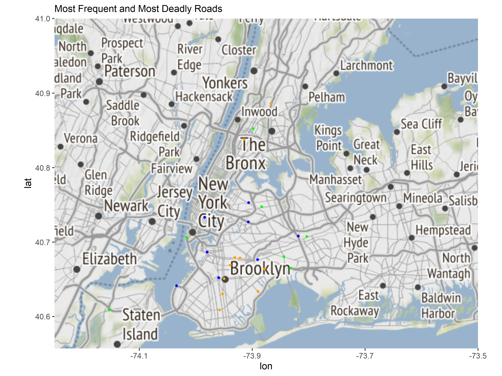

<style>
h2 { /* Header 2 */
    font-size: 22px
}
</style>

<style>
h3 { /* Header 3 */
    font-size: 18px
}
</style>


# Executive Summary

The purpose of this report is to investigate the distribution in the location of the streets with the most crashes, as well as potential reasons why this is the case for the New York State Department of Transportation (NYDP) to improve road safety. It was found that the most incidents occur in the Manhattan and Brooklyn areas, and that the streets with the most incidents also had the highest number of death and injury rates.

In order to reveal the most fatal streets (by death and injuries), death and injury rates were calculated and plotted on a map, revealing that the streets with the most casualties are not the most fatal per capita.

# Initial Data Analysis 

## Background 
The New York State Department of Transportation (NYDT) is looking to investigate the location and fatalities of road accidents in New York in order to improve safety. This report aims to investigate the location of the top accidents by frequency, and the top accidents by their death rate and injury rate. 

## Assessment of Data Provenance
Data Provenance refers to the reliability and reproducibility of the data. In order to assess data provenance, the W3C group’s (Data Provenance, n.d.) requirements were used (shown below). To quantify this measure, the NYC dataset was awarded a score out of 17, using the information provided by the City of New York (Motor Vehicle Collisions - Crashes | NYC Open Data, 2021).


The data originates from the City of New York (Motor Vehicle Collisions - Crashes | NYC Open Data, 2021). When inspecting the website in which the data can be accessed, it was found that 
the data was sourced from the New York Police, however, the data process is not known (how the data was collected and entered into the database, and how it was provided to the City of New York). This represents a limitation in Data Provence as the flow of data cannot be traced. This undermines the reliability of the data as there could be typos in the data transfer from the police department to the database, or incorrect observations recorded. In addition, there is no information provided on how the data changed over time - only that it has been updated. It is assumed that this refers to the addition of new records depending on the month that has most recently passed, however, this is not explicitly stated and could mean that other variables also changed. This could also introduce bias during the modification of the data month to month, however, this remains unknown as the process is unknown. There is also no documentation on why a particular decision relating to the data was made (e.g. if some records changed from version to version) as well as showing how data was derived (e.g. whether a police went to the site straight after a crash to record the results). This reduces the reproducibility of the data (e.g. if the NYT wanted to examine averages across many years), as the methodology in how the data was collected is unknown. It is for these reasons that the data provenance is assessed to be poor (see the assessment above).

Despite this the reliability of the data is high as government organisations aim to provide data that is accurate and credible to inform the public. This means that although there are uncertainties in how the data was collected and traced, significant data collection and processing error/bias is considered to be low, as it was collected by a public institution. 

## Domain Knowledge
As mentioned above, the data has been sourced from the City of New York, and outlines details related to accidents on the road. The data structure is outlined below.


```r
# Glimpse Function [From tidyverse package]
MVC %>% glimpse()
```

```
## Rows: 1,615,800
## Columns: 29
## $ CRASH.DATE                    <chr> "06/20/2019", "07/09/2019", "06/28/2019"…
## $ CRASH.TIME                    <chr> "2:37", "18:00", "21:00", "12:00", "16:3…
## $ BOROUGH                       <chr> "BROOKLYN", NA, "QUEENS", NA, "BROOKLYN"…
## $ ZIP.CODE                      <int> 11223, NA, 11418, NA, 11236, 10019, 1003…
## $ LATITUDE                      <dbl> 40.59792, NA, 40.70757, 40.85667, 40.634…
## $ LONGITUDE                     <dbl> -73.96117, NA, -73.83620, -73.86569, -73…
## $ LOCATION                      <chr> "POINT (-73.961174 40.597916)", NA, "POI…
## $ ON.STREET.NAME                <chr> NA, "NORTHERN BOULEVARD", "METROPOLITAN …
## $ CROSS.STREET.NAME             <chr> NA, "CLEARVIEW EXPRESSWAY", "116 STREET"…
## $ OFF.STREET.NAME               <chr> "2410      CONEY ISLAND AVENUE", NA, NA,…
## $ NUMBER.OF.PERSONS.INJURED     <int> 0, 0, 0, 0, 0, 0, 1, 0, 1, 0, 0, 0, 1, 0…
## $ NUMBER.OF.PERSONS.KILLED      <int> 0, 0, 0, 0, 0, 0, 0, 0, 0, 0, 0, 0, 0, 0…
## $ NUMBER.OF.PEDESTRIANS.INJURED <int> 0, 0, 0, 0, 0, 0, 1, 0, 1, 0, 0, 0, 0, 0…
## $ NUMBER.OF.PEDESTRIANS.KILLED  <int> 0, 0, 0, 0, 0, 0, 0, 0, 0, 0, 0, 0, 0, 0…
## $ NUMBER.OF.CYCLIST.INJURED     <int> 0, 0, 0, 0, 0, 0, 0, 0, 0, 0, 0, 0, 0, 0…
## $ NUMBER.OF.CYCLIST.KILLED      <int> 0, 0, 0, 0, 0, 0, 0, 0, 0, 0, 0, 0, 0, 0…
## $ NUMBER.OF.MOTORIST.INJURED    <int> 0, 0, 0, 0, 0, 0, 0, 0, 0, 0, 0, 0, 1, 0…
## $ NUMBER.OF.MOTORIST.KILLED     <int> 0, 0, 0, 0, 0, 0, 0, 0, 0, 0, 0, 0, 0, 0…
## $ CONTRIBUTING.FACTOR.VEHICLE.1 <chr> "Unspecified", "Following Too Closely", …
## $ CONTRIBUTING.FACTOR.VEHICLE.2 <chr> "Unspecified", "Passing or Lane Usage Im…
## $ CONTRIBUTING.FACTOR.VEHICLE.3 <chr> NA, NA, "Unspecified", NA, NA, NA, NA, N…
## $ CONTRIBUTING.FACTOR.VEHICLE.4 <chr> NA, NA, NA, NA, NA, NA, NA, NA, NA, NA, …
## $ CONTRIBUTING.FACTOR.VEHICLE.5 <chr> NA, NA, NA, NA, NA, NA, NA, NA, NA, NA, …
## $ COLLISION_ID                  <int> 4155032, 4167185, 4161958, 4170995, 4155…
## $ VEHICLE.TYPE.CODE.1           <chr> "Station Wagon/Sport Utility Vehicle", "…
## $ VEHICLE.TYPE.CODE.2           <chr> "Station Wagon/Sport Utility Vehicle", "…
## $ VEHICLE.TYPE.CODE.3           <chr> NA, NA, "Sedan", NA, NA, NA, NA, NA, NA,…
## $ VEHICLE.TYPE.CODE.4           <chr> NA, NA, NA, NA, NA, NA, NA, NA, NA, NA, …
## $ VEHICLE.TYPE.CODE.5           <chr> NA, NA, NA, NA, NA, NA, NA, NA, NA, NA, …
```
Using the glimpse() function from the tidyverse package, we can see that the data has 29 columns with around 1.6 million records. There are also only two types of variables present: ints and chars. This representation also reveals that during the data reading, null values were set to NA as specified, making data wrangling more efficient.

```r
# Skim Function [From skimr package]
 kable(skim(MVC))
```

<table>
 <thead>
  <tr>
   <th style="text-align:left;"> skim_type </th>
   <th style="text-align:left;"> skim_variable </th>
   <th style="text-align:right;"> n_missing </th>
   <th style="text-align:right;"> complete_rate </th>
   <th style="text-align:right;"> character.min </th>
   <th style="text-align:right;"> character.max </th>
   <th style="text-align:right;"> character.empty </th>
   <th style="text-align:right;"> character.n_unique </th>
   <th style="text-align:right;"> character.whitespace </th>
   <th style="text-align:right;"> numeric.mean </th>
   <th style="text-align:right;"> numeric.sd </th>
   <th style="text-align:right;"> numeric.p0 </th>
   <th style="text-align:right;"> numeric.p25 </th>
   <th style="text-align:right;"> numeric.p50 </th>
   <th style="text-align:right;"> numeric.p75 </th>
   <th style="text-align:right;"> numeric.p100 </th>
   <th style="text-align:left;"> numeric.hist </th>
  </tr>
 </thead>
<tbody>
  <tr>
   <td style="text-align:left;"> character </td>
   <td style="text-align:left;"> CRASH.DATE </td>
   <td style="text-align:right;"> 0 </td>
   <td style="text-align:right;"> 1.0000000 </td>
   <td style="text-align:right;"> 10 </td>
   <td style="text-align:right;"> 10 </td>
   <td style="text-align:right;"> 0 </td>
   <td style="text-align:right;"> 2712 </td>
   <td style="text-align:right;"> 0 </td>
   <td style="text-align:right;"> NA </td>
   <td style="text-align:right;"> NA </td>
   <td style="text-align:right;"> NA </td>
   <td style="text-align:right;"> NA </td>
   <td style="text-align:right;"> NA </td>
   <td style="text-align:right;"> NA </td>
   <td style="text-align:right;"> NA </td>
   <td style="text-align:left;"> NA </td>
  </tr>
  <tr>
   <td style="text-align:left;"> character </td>
   <td style="text-align:left;"> CRASH.TIME </td>
   <td style="text-align:right;"> 0 </td>
   <td style="text-align:right;"> 1.0000000 </td>
   <td style="text-align:right;"> 4 </td>
   <td style="text-align:right;"> 5 </td>
   <td style="text-align:right;"> 0 </td>
   <td style="text-align:right;"> 1440 </td>
   <td style="text-align:right;"> 0 </td>
   <td style="text-align:right;"> NA </td>
   <td style="text-align:right;"> NA </td>
   <td style="text-align:right;"> NA </td>
   <td style="text-align:right;"> NA </td>
   <td style="text-align:right;"> NA </td>
   <td style="text-align:right;"> NA </td>
   <td style="text-align:right;"> NA </td>
   <td style="text-align:left;"> NA </td>
  </tr>
  <tr>
   <td style="text-align:left;"> character </td>
   <td style="text-align:left;"> BOROUGH </td>
   <td style="text-align:right;"> 490448 </td>
   <td style="text-align:right;"> 0.6964674 </td>
   <td style="text-align:right;"> 5 </td>
   <td style="text-align:right;"> 13 </td>
   <td style="text-align:right;"> 0 </td>
   <td style="text-align:right;"> 5 </td>
   <td style="text-align:right;"> 0 </td>
   <td style="text-align:right;"> NA </td>
   <td style="text-align:right;"> NA </td>
   <td style="text-align:right;"> NA </td>
   <td style="text-align:right;"> NA </td>
   <td style="text-align:right;"> NA </td>
   <td style="text-align:right;"> NA </td>
   <td style="text-align:right;"> NA </td>
   <td style="text-align:left;"> NA </td>
  </tr>
  <tr>
   <td style="text-align:left;"> character </td>
   <td style="text-align:left;"> LOCATION </td>
   <td style="text-align:right;"> 197179 </td>
   <td style="text-align:right;"> 0.8779682 </td>
   <td style="text-align:right;"> 11 </td>
   <td style="text-align:right;"> 30 </td>
   <td style="text-align:right;"> 0 </td>
   <td style="text-align:right;"> 211054 </td>
   <td style="text-align:right;"> 0 </td>
   <td style="text-align:right;"> NA </td>
   <td style="text-align:right;"> NA </td>
   <td style="text-align:right;"> NA </td>
   <td style="text-align:right;"> NA </td>
   <td style="text-align:right;"> NA </td>
   <td style="text-align:right;"> NA </td>
   <td style="text-align:right;"> NA </td>
   <td style="text-align:left;"> NA </td>
  </tr>
  <tr>
   <td style="text-align:left;"> character </td>
   <td style="text-align:left;"> ON.STREET.NAME </td>
   <td style="text-align:right;"> 317097 </td>
   <td style="text-align:right;"> 0.8037523 </td>
   <td style="text-align:right;"> 2 </td>
   <td style="text-align:right;"> 32 </td>
   <td style="text-align:right;"> 0 </td>
   <td style="text-align:right;"> 11600 </td>
   <td style="text-align:right;"> 0 </td>
   <td style="text-align:right;"> NA </td>
   <td style="text-align:right;"> NA </td>
   <td style="text-align:right;"> NA </td>
   <td style="text-align:right;"> NA </td>
   <td style="text-align:right;"> NA </td>
   <td style="text-align:right;"> NA </td>
   <td style="text-align:right;"> NA </td>
   <td style="text-align:left;"> NA </td>
  </tr>
  <tr>
   <td style="text-align:left;"> character </td>
   <td style="text-align:left;"> CROSS.STREET.NAME </td>
   <td style="text-align:right;"> 542516 </td>
   <td style="text-align:right;"> 0.6642431 </td>
   <td style="text-align:right;"> 1 </td>
   <td style="text-align:right;"> 32 </td>
   <td style="text-align:right;"> 0 </td>
   <td style="text-align:right;"> 11916 </td>
   <td style="text-align:right;"> 0 </td>
   <td style="text-align:right;"> NA </td>
   <td style="text-align:right;"> NA </td>
   <td style="text-align:right;"> NA </td>
   <td style="text-align:right;"> NA </td>
   <td style="text-align:right;"> NA </td>
   <td style="text-align:right;"> NA </td>
   <td style="text-align:right;"> NA </td>
   <td style="text-align:left;"> NA </td>
  </tr>
  <tr>
   <td style="text-align:left;"> character </td>
   <td style="text-align:left;"> OFF.STREET.NAME </td>
   <td style="text-align:right;"> 1391132 </td>
   <td style="text-align:right;"> 0.1390444 </td>
   <td style="text-align:right;"> 3 </td>
   <td style="text-align:right;"> 40 </td>
   <td style="text-align:right;"> 0 </td>
   <td style="text-align:right;"> 141711 </td>
   <td style="text-align:right;"> 0 </td>
   <td style="text-align:right;"> NA </td>
   <td style="text-align:right;"> NA </td>
   <td style="text-align:right;"> NA </td>
   <td style="text-align:right;"> NA </td>
   <td style="text-align:right;"> NA </td>
   <td style="text-align:right;"> NA </td>
   <td style="text-align:right;"> NA </td>
   <td style="text-align:left;"> NA </td>
  </tr>
  <tr>
   <td style="text-align:left;"> character </td>
   <td style="text-align:left;"> CONTRIBUTING.FACTOR.VEHICLE.1 </td>
   <td style="text-align:right;"> 4272 </td>
   <td style="text-align:right;"> 0.9973561 </td>
   <td style="text-align:right;"> 1 </td>
   <td style="text-align:right;"> 53 </td>
   <td style="text-align:right;"> 0 </td>
   <td style="text-align:right;"> 61 </td>
   <td style="text-align:right;"> 0 </td>
   <td style="text-align:right;"> NA </td>
   <td style="text-align:right;"> NA </td>
   <td style="text-align:right;"> NA </td>
   <td style="text-align:right;"> NA </td>
   <td style="text-align:right;"> NA </td>
   <td style="text-align:right;"> NA </td>
   <td style="text-align:right;"> NA </td>
   <td style="text-align:left;"> NA </td>
  </tr>
  <tr>
   <td style="text-align:left;"> character </td>
   <td style="text-align:left;"> CONTRIBUTING.FACTOR.VEHICLE.2 </td>
   <td style="text-align:right;"> 217529 </td>
   <td style="text-align:right;"> 0.8653738 </td>
   <td style="text-align:right;"> 1 </td>
   <td style="text-align:right;"> 53 </td>
   <td style="text-align:right;"> 0 </td>
   <td style="text-align:right;"> 61 </td>
   <td style="text-align:right;"> 0 </td>
   <td style="text-align:right;"> NA </td>
   <td style="text-align:right;"> NA </td>
   <td style="text-align:right;"> NA </td>
   <td style="text-align:right;"> NA </td>
   <td style="text-align:right;"> NA </td>
   <td style="text-align:right;"> NA </td>
   <td style="text-align:right;"> NA </td>
   <td style="text-align:left;"> NA </td>
  </tr>
  <tr>
   <td style="text-align:left;"> character </td>
   <td style="text-align:left;"> CONTRIBUTING.FACTOR.VEHICLE.3 </td>
   <td style="text-align:right;"> 1511295 </td>
   <td style="text-align:right;"> 0.0646769 </td>
   <td style="text-align:right;"> 1 </td>
   <td style="text-align:right;"> 53 </td>
   <td style="text-align:right;"> 0 </td>
   <td style="text-align:right;"> 50 </td>
   <td style="text-align:right;"> 0 </td>
   <td style="text-align:right;"> NA </td>
   <td style="text-align:right;"> NA </td>
   <td style="text-align:right;"> NA </td>
   <td style="text-align:right;"> NA </td>
   <td style="text-align:right;"> NA </td>
   <td style="text-align:right;"> NA </td>
   <td style="text-align:right;"> NA </td>
   <td style="text-align:left;"> NA </td>
  </tr>
  <tr>
   <td style="text-align:left;"> character </td>
   <td style="text-align:left;"> CONTRIBUTING.FACTOR.VEHICLE.4 </td>
   <td style="text-align:right;"> 1594035 </td>
   <td style="text-align:right;"> 0.0134701 </td>
   <td style="text-align:right;"> 5 </td>
   <td style="text-align:right;"> 43 </td>
   <td style="text-align:right;"> 0 </td>
   <td style="text-align:right;"> 39 </td>
   <td style="text-align:right;"> 0 </td>
   <td style="text-align:right;"> NA </td>
   <td style="text-align:right;"> NA </td>
   <td style="text-align:right;"> NA </td>
   <td style="text-align:right;"> NA </td>
   <td style="text-align:right;"> NA </td>
   <td style="text-align:right;"> NA </td>
   <td style="text-align:right;"> NA </td>
   <td style="text-align:left;"> NA </td>
  </tr>
  <tr>
   <td style="text-align:left;"> character </td>
   <td style="text-align:left;"> CONTRIBUTING.FACTOR.VEHICLE.5 </td>
   <td style="text-align:right;"> 1610231 </td>
   <td style="text-align:right;"> 0.0034466 </td>
   <td style="text-align:right;"> 5 </td>
   <td style="text-align:right;"> 43 </td>
   <td style="text-align:right;"> 0 </td>
   <td style="text-align:right;"> 28 </td>
   <td style="text-align:right;"> 0 </td>
   <td style="text-align:right;"> NA </td>
   <td style="text-align:right;"> NA </td>
   <td style="text-align:right;"> NA </td>
   <td style="text-align:right;"> NA </td>
   <td style="text-align:right;"> NA </td>
   <td style="text-align:right;"> NA </td>
   <td style="text-align:right;"> NA </td>
   <td style="text-align:left;"> NA </td>
  </tr>
  <tr>
   <td style="text-align:left;"> character </td>
   <td style="text-align:left;"> VEHICLE.TYPE.CODE.1 </td>
   <td style="text-align:right;"> 5464 </td>
   <td style="text-align:right;"> 0.9966184 </td>
   <td style="text-align:right;"> 1 </td>
   <td style="text-align:right;"> 38 </td>
   <td style="text-align:right;"> 0 </td>
   <td style="text-align:right;"> 699 </td>
   <td style="text-align:right;"> 0 </td>
   <td style="text-align:right;"> NA </td>
   <td style="text-align:right;"> NA </td>
   <td style="text-align:right;"> NA </td>
   <td style="text-align:right;"> NA </td>
   <td style="text-align:right;"> NA </td>
   <td style="text-align:right;"> NA </td>
   <td style="text-align:right;"> NA </td>
   <td style="text-align:left;"> NA </td>
  </tr>
  <tr>
   <td style="text-align:left;"> character </td>
   <td style="text-align:left;"> VEHICLE.TYPE.CODE.2 </td>
   <td style="text-align:right;"> 267012 </td>
   <td style="text-align:right;"> 0.8347494 </td>
   <td style="text-align:right;"> 1 </td>
   <td style="text-align:right;"> 38 </td>
   <td style="text-align:right;"> 0 </td>
   <td style="text-align:right;"> 683 </td>
   <td style="text-align:right;"> 0 </td>
   <td style="text-align:right;"> NA </td>
   <td style="text-align:right;"> NA </td>
   <td style="text-align:right;"> NA </td>
   <td style="text-align:right;"> NA </td>
   <td style="text-align:right;"> NA </td>
   <td style="text-align:right;"> NA </td>
   <td style="text-align:right;"> NA </td>
   <td style="text-align:left;"> NA </td>
  </tr>
  <tr>
   <td style="text-align:left;"> character </td>
   <td style="text-align:left;"> VEHICLE.TYPE.CODE.3 </td>
   <td style="text-align:right;"> 1482244 </td>
   <td style="text-align:right;"> 0.0826563 </td>
   <td style="text-align:right;"> 2 </td>
   <td style="text-align:right;"> 35 </td>
   <td style="text-align:right;"> 0 </td>
   <td style="text-align:right;"> 141 </td>
   <td style="text-align:right;"> 0 </td>
   <td style="text-align:right;"> NA </td>
   <td style="text-align:right;"> NA </td>
   <td style="text-align:right;"> NA </td>
   <td style="text-align:right;"> NA </td>
   <td style="text-align:right;"> NA </td>
   <td style="text-align:right;"> NA </td>
   <td style="text-align:right;"> NA </td>
   <td style="text-align:left;"> NA </td>
  </tr>
  <tr>
   <td style="text-align:left;"> character </td>
   <td style="text-align:left;"> VEHICLE.TYPE.CODE.4 </td>
   <td style="text-align:right;"> 1566258 </td>
   <td style="text-align:right;"> 0.0306610 </td>
   <td style="text-align:right;"> 2 </td>
   <td style="text-align:right;"> 35 </td>
   <td style="text-align:right;"> 0 </td>
   <td style="text-align:right;"> 72 </td>
   <td style="text-align:right;"> 0 </td>
   <td style="text-align:right;"> NA </td>
   <td style="text-align:right;"> NA </td>
   <td style="text-align:right;"> NA </td>
   <td style="text-align:right;"> NA </td>
   <td style="text-align:right;"> NA </td>
   <td style="text-align:right;"> NA </td>
   <td style="text-align:right;"> NA </td>
   <td style="text-align:left;"> NA </td>
  </tr>
  <tr>
   <td style="text-align:left;"> character </td>
   <td style="text-align:left;"> VEHICLE.TYPE.CODE.5 </td>
   <td style="text-align:right;"> 1605138 </td>
   <td style="text-align:right;"> 0.0065986 </td>
   <td style="text-align:right;"> 2 </td>
   <td style="text-align:right;"> 35 </td>
   <td style="text-align:right;"> 0 </td>
   <td style="text-align:right;"> 49 </td>
   <td style="text-align:right;"> 0 </td>
   <td style="text-align:right;"> NA </td>
   <td style="text-align:right;"> NA </td>
   <td style="text-align:right;"> NA </td>
   <td style="text-align:right;"> NA </td>
   <td style="text-align:right;"> NA </td>
   <td style="text-align:right;"> NA </td>
   <td style="text-align:right;"> NA </td>
   <td style="text-align:left;"> NA </td>
  </tr>
  <tr>
   <td style="text-align:left;"> numeric </td>
   <td style="text-align:left;"> ZIP.CODE </td>
   <td style="text-align:right;"> 490687 </td>
   <td style="text-align:right;"> 0.6963195 </td>
   <td style="text-align:right;"> NA </td>
   <td style="text-align:right;"> NA </td>
   <td style="text-align:right;"> NA </td>
   <td style="text-align:right;"> NA </td>
   <td style="text-align:right;"> NA </td>
   <td style="text-align:right;"> 1.082696e+04 </td>
   <td style="text-align:right;"> 5.608464e+02 </td>
   <td style="text-align:right;"> 10000.00 </td>
   <td style="text-align:right;"> 10304.0000 </td>
   <td style="text-align:right;"> 11206.00000 </td>
   <td style="text-align:right;"> 11237.00000 </td>
   <td style="text-align:right;"> 1.169700e+04 </td>
   <td style="text-align:left;"> ▆▃▁▇▅ </td>
  </tr>
  <tr>
   <td style="text-align:left;"> numeric </td>
   <td style="text-align:left;"> LATITUDE </td>
   <td style="text-align:right;"> 197179 </td>
   <td style="text-align:right;"> 0.8779682 </td>
   <td style="text-align:right;"> NA </td>
   <td style="text-align:right;"> NA </td>
   <td style="text-align:right;"> NA </td>
   <td style="text-align:right;"> NA </td>
   <td style="text-align:right;"> NA </td>
   <td style="text-align:right;"> 4.069251e+01 </td>
   <td style="text-align:right;"> 1.133737e+00 </td>
   <td style="text-align:right;"> 0.00 </td>
   <td style="text-align:right;"> 40.6688 </td>
   <td style="text-align:right;"> 40.72257 </td>
   <td style="text-align:right;"> 40.76797 </td>
   <td style="text-align:right;"> 4.334444e+01 </td>
   <td style="text-align:left;"> ▁▁▁▁▇ </td>
  </tr>
  <tr>
   <td style="text-align:left;"> numeric </td>
   <td style="text-align:left;"> LONGITUDE </td>
   <td style="text-align:right;"> 197179 </td>
   <td style="text-align:right;"> 0.8779682 </td>
   <td style="text-align:right;"> NA </td>
   <td style="text-align:right;"> NA </td>
   <td style="text-align:right;"> NA </td>
   <td style="text-align:right;"> NA </td>
   <td style="text-align:right;"> NA </td>
   <td style="text-align:right;"> -7.387337e+01 </td>
   <td style="text-align:right;"> 2.335625e+00 </td>
   <td style="text-align:right;"> -201.36 </td>
   <td style="text-align:right;"> -73.9772 </td>
   <td style="text-align:right;"> -73.92975 </td>
   <td style="text-align:right;"> -73.86690 </td>
   <td style="text-align:right;"> 0.000000e+00 </td>
   <td style="text-align:left;"> ▁▁▁▇▁ </td>
  </tr>
  <tr>
   <td style="text-align:left;"> numeric </td>
   <td style="text-align:left;"> NUMBER.OF.PERSONS.INJURED </td>
   <td style="text-align:right;"> 17 </td>
   <td style="text-align:right;"> 0.9999895 </td>
   <td style="text-align:right;"> NA </td>
   <td style="text-align:right;"> NA </td>
   <td style="text-align:right;"> NA </td>
   <td style="text-align:right;"> NA </td>
   <td style="text-align:right;"> NA </td>
   <td style="text-align:right;"> 2.627803e-01 </td>
   <td style="text-align:right;"> 6.601321e-01 </td>
   <td style="text-align:right;"> 0.00 </td>
   <td style="text-align:right;"> 0.0000 </td>
   <td style="text-align:right;"> 0.00000 </td>
   <td style="text-align:right;"> 0.00000 </td>
   <td style="text-align:right;"> 4.300000e+01 </td>
   <td style="text-align:left;"> ▇▁▁▁▁ </td>
  </tr>
  <tr>
   <td style="text-align:left;"> numeric </td>
   <td style="text-align:left;"> NUMBER.OF.PERSONS.KILLED </td>
   <td style="text-align:right;"> 31 </td>
   <td style="text-align:right;"> 0.9999808 </td>
   <td style="text-align:right;"> NA </td>
   <td style="text-align:right;"> NA </td>
   <td style="text-align:right;"> NA </td>
   <td style="text-align:right;"> NA </td>
   <td style="text-align:right;"> NA </td>
   <td style="text-align:right;"> 1.167200e-03 </td>
   <td style="text-align:right;"> 3.610100e-02 </td>
   <td style="text-align:right;"> 0.00 </td>
   <td style="text-align:right;"> 0.0000 </td>
   <td style="text-align:right;"> 0.00000 </td>
   <td style="text-align:right;"> 0.00000 </td>
   <td style="text-align:right;"> 8.000000e+00 </td>
   <td style="text-align:left;"> ▇▁▁▁▁ </td>
  </tr>
  <tr>
   <td style="text-align:left;"> numeric </td>
   <td style="text-align:left;"> NUMBER.OF.PEDESTRIANS.INJURED </td>
   <td style="text-align:right;"> 0 </td>
   <td style="text-align:right;"> 1.0000000 </td>
   <td style="text-align:right;"> NA </td>
   <td style="text-align:right;"> NA </td>
   <td style="text-align:right;"> NA </td>
   <td style="text-align:right;"> NA </td>
   <td style="text-align:right;"> NA </td>
   <td style="text-align:right;"> 5.062380e-02 </td>
   <td style="text-align:right;"> 2.318163e-01 </td>
   <td style="text-align:right;"> 0.00 </td>
   <td style="text-align:right;"> 0.0000 </td>
   <td style="text-align:right;"> 0.00000 </td>
   <td style="text-align:right;"> 0.00000 </td>
   <td style="text-align:right;"> 2.700000e+01 </td>
   <td style="text-align:left;"> ▇▁▁▁▁ </td>
  </tr>
  <tr>
   <td style="text-align:left;"> numeric </td>
   <td style="text-align:left;"> NUMBER.OF.PEDESTRIANS.KILLED </td>
   <td style="text-align:right;"> 0 </td>
   <td style="text-align:right;"> 1.0000000 </td>
   <td style="text-align:right;"> NA </td>
   <td style="text-align:right;"> NA </td>
   <td style="text-align:right;"> NA </td>
   <td style="text-align:right;"> NA </td>
   <td style="text-align:right;"> NA </td>
   <td style="text-align:right;"> 6.313000e-04 </td>
   <td style="text-align:right;"> 2.570160e-02 </td>
   <td style="text-align:right;"> 0.00 </td>
   <td style="text-align:right;"> 0.0000 </td>
   <td style="text-align:right;"> 0.00000 </td>
   <td style="text-align:right;"> 0.00000 </td>
   <td style="text-align:right;"> 6.000000e+00 </td>
   <td style="text-align:left;"> ▇▁▁▁▁ </td>
  </tr>
  <tr>
   <td style="text-align:left;"> numeric </td>
   <td style="text-align:left;"> NUMBER.OF.CYCLIST.INJURED </td>
   <td style="text-align:right;"> 0 </td>
   <td style="text-align:right;"> 1.0000000 </td>
   <td style="text-align:right;"> NA </td>
   <td style="text-align:right;"> NA </td>
   <td style="text-align:right;"> NA </td>
   <td style="text-align:right;"> NA </td>
   <td style="text-align:right;"> NA </td>
   <td style="text-align:right;"> 2.075810e-02 </td>
   <td style="text-align:right;"> 1.437366e-01 </td>
   <td style="text-align:right;"> 0.00 </td>
   <td style="text-align:right;"> 0.0000 </td>
   <td style="text-align:right;"> 0.00000 </td>
   <td style="text-align:right;"> 0.00000 </td>
   <td style="text-align:right;"> 4.000000e+00 </td>
   <td style="text-align:left;"> ▇▁▁▁▁ </td>
  </tr>
  <tr>
   <td style="text-align:left;"> numeric </td>
   <td style="text-align:left;"> NUMBER.OF.CYCLIST.KILLED </td>
   <td style="text-align:right;"> 0 </td>
   <td style="text-align:right;"> 1.0000000 </td>
   <td style="text-align:right;"> NA </td>
   <td style="text-align:right;"> NA </td>
   <td style="text-align:right;"> NA </td>
   <td style="text-align:right;"> NA </td>
   <td style="text-align:right;"> NA </td>
   <td style="text-align:right;"> 8.420000e-05 </td>
   <td style="text-align:right;"> 9.241200e-03 </td>
   <td style="text-align:right;"> 0.00 </td>
   <td style="text-align:right;"> 0.0000 </td>
   <td style="text-align:right;"> 0.00000 </td>
   <td style="text-align:right;"> 0.00000 </td>
   <td style="text-align:right;"> 2.000000e+00 </td>
   <td style="text-align:left;"> ▇▁▁▁▁ </td>
  </tr>
  <tr>
   <td style="text-align:left;"> numeric </td>
   <td style="text-align:left;"> NUMBER.OF.MOTORIST.INJURED </td>
   <td style="text-align:right;"> 0 </td>
   <td style="text-align:right;"> 1.0000000 </td>
   <td style="text-align:right;"> NA </td>
   <td style="text-align:right;"> NA </td>
   <td style="text-align:right;"> NA </td>
   <td style="text-align:right;"> NA </td>
   <td style="text-align:right;"> NA </td>
   <td style="text-align:right;"> 1.915392e-01 </td>
   <td style="text-align:right;"> 6.224998e-01 </td>
   <td style="text-align:right;"> 0.00 </td>
   <td style="text-align:right;"> 0.0000 </td>
   <td style="text-align:right;"> 0.00000 </td>
   <td style="text-align:right;"> 0.00000 </td>
   <td style="text-align:right;"> 4.300000e+01 </td>
   <td style="text-align:left;"> ▇▁▁▁▁ </td>
  </tr>
  <tr>
   <td style="text-align:left;"> numeric </td>
   <td style="text-align:left;"> NUMBER.OF.MOTORIST.KILLED </td>
   <td style="text-align:right;"> 0 </td>
   <td style="text-align:right;"> 1.0000000 </td>
   <td style="text-align:right;"> NA </td>
   <td style="text-align:right;"> NA </td>
   <td style="text-align:right;"> NA </td>
   <td style="text-align:right;"> NA </td>
   <td style="text-align:right;"> NA </td>
   <td style="text-align:right;"> 4.543000e-04 </td>
   <td style="text-align:right;"> 2.317300e-02 </td>
   <td style="text-align:right;"> 0.00 </td>
   <td style="text-align:right;"> 0.0000 </td>
   <td style="text-align:right;"> 0.00000 </td>
   <td style="text-align:right;"> 0.00000 </td>
   <td style="text-align:right;"> 5.000000e+00 </td>
   <td style="text-align:left;"> ▇▁▁▁▁ </td>
  </tr>
  <tr>
   <td style="text-align:left;"> numeric </td>
   <td style="text-align:left;"> COLLISION_ID </td>
   <td style="text-align:right;"> 0 </td>
   <td style="text-align:right;"> 1.0000000 </td>
   <td style="text-align:right;"> NA </td>
   <td style="text-align:right;"> NA </td>
   <td style="text-align:right;"> NA </td>
   <td style="text-align:right;"> NA </td>
   <td style="text-align:right;"> NA </td>
   <td style="text-align:right;"> 2.783424e+06 </td>
   <td style="text-align:right;"> 1.505268e+06 </td>
   <td style="text-align:right;"> 22.00 </td>
   <td style="text-align:right;"> 1031400.7500 </td>
   <td style="text-align:right;"> 3444024.50000 </td>
   <td style="text-align:right;"> 3848207.25000 </td>
   <td style="text-align:right;"> 4.253044e+06 </td>
   <td style="text-align:left;"> ▃▁▁▃▇ </td>
  </tr>
</tbody>
</table>
The skim() function from the skimr package provides us with summary statistics for the data to be used when formulating our research questions. From this, we can see that there are thousands of missing variables for each column.


```r
# Summary Function [From base package -- preinstalled!]
MVC %>% summary()
```

```
##   CRASH.DATE         CRASH.TIME          BOROUGH             ZIP.CODE     
##  Length:1615800     Length:1615800     Length:1615800     Min.   :10000   
##  Class :character   Class :character   Class :character   1st Qu.:10304   
##  Mode  :character   Mode  :character   Mode  :character   Median :11206   
##                                                           Mean   :10827   
##                                                           3rd Qu.:11237   
##                                                           Max.   :11697   
##                                                           NA's   :490687  
##     LATITUDE        LONGITUDE         LOCATION         ON.STREET.NAME    
##  Min.   : 0.00    Min.   :-201.36   Length:1615800     Length:1615800    
##  1st Qu.:40.67    1st Qu.: -73.98   Class :character   Class :character  
##  Median :40.72    Median : -73.93   Mode  :character   Mode  :character  
##  Mean   :40.69    Mean   : -73.87                                        
##  3rd Qu.:40.77    3rd Qu.: -73.87                                        
##  Max.   :43.34    Max.   :   0.00                                        
##  NA's   :197179   NA's   :197179                                         
##  CROSS.STREET.NAME  OFF.STREET.NAME    NUMBER.OF.PERSONS.INJURED
##  Length:1615800     Length:1615800     Min.   : 0.0000          
##  Class :character   Class :character   1st Qu.: 0.0000          
##  Mode  :character   Mode  :character   Median : 0.0000          
##                                        Mean   : 0.2628          
##                                        3rd Qu.: 0.0000          
##                                        Max.   :43.0000          
##                                        NA's   :17               
##  NUMBER.OF.PERSONS.KILLED NUMBER.OF.PEDESTRIANS.INJURED
##  Min.   :0.000000         Min.   : 0.00000             
##  1st Qu.:0.000000         1st Qu.: 0.00000             
##  Median :0.000000         Median : 0.00000             
##  Mean   :0.001167         Mean   : 0.05062             
##  3rd Qu.:0.000000         3rd Qu.: 0.00000             
##  Max.   :8.000000         Max.   :27.00000             
##  NA's   :31                                            
##  NUMBER.OF.PEDESTRIANS.KILLED NUMBER.OF.CYCLIST.INJURED
##  Min.   :0.000000             Min.   :0.00000          
##  1st Qu.:0.000000             1st Qu.:0.00000          
##  Median :0.000000             Median :0.00000          
##  Mean   :0.000631             Mean   :0.02076          
##  3rd Qu.:0.000000             3rd Qu.:0.00000          
##  Max.   :6.000000             Max.   :4.00000          
##                                                        
##  NUMBER.OF.CYCLIST.KILLED NUMBER.OF.MOTORIST.INJURED NUMBER.OF.MOTORIST.KILLED
##  Min.   :0.00e+00         Min.   : 0.0000            Min.   :0.000000         
##  1st Qu.:0.00e+00         1st Qu.: 0.0000            1st Qu.:0.000000         
##  Median :0.00e+00         Median : 0.0000            Median :0.000000         
##  Mean   :8.42e-05         Mean   : 0.1915            Mean   :0.000454         
##  3rd Qu.:0.00e+00         3rd Qu.: 0.0000            3rd Qu.:0.000000         
##  Max.   :2.00e+00         Max.   :43.0000            Max.   :5.000000         
##                                                                               
##  CONTRIBUTING.FACTOR.VEHICLE.1 CONTRIBUTING.FACTOR.VEHICLE.2
##  Length:1615800                Length:1615800               
##  Class :character              Class :character             
##  Mode  :character              Mode  :character             
##                                                             
##                                                             
##                                                             
##                                                             
##  CONTRIBUTING.FACTOR.VEHICLE.3 CONTRIBUTING.FACTOR.VEHICLE.4
##  Length:1615800                Length:1615800               
##  Class :character              Class :character             
##  Mode  :character              Mode  :character             
##                                                             
##                                                             
##                                                             
##                                                             
##  CONTRIBUTING.FACTOR.VEHICLE.5  COLLISION_ID     VEHICLE.TYPE.CODE.1
##  Length:1615800                Min.   :     22   Length:1615800     
##  Class :character              1st Qu.:1031401   Class :character   
##  Mode  :character              Median :3444024   Mode  :character   
##                                Mean   :2783424                      
##                                3rd Qu.:3848207                      
##                                Max.   :4253044                      
##                                                                     
##  VEHICLE.TYPE.CODE.2 VEHICLE.TYPE.CODE.3 VEHICLE.TYPE.CODE.4
##  Length:1615800      Length:1615800      Length:1615800     
##  Class :character    Class :character    Class :character   
##  Mode  :character    Mode  :character    Mode  :character   
##                                                             
##                                                             
##                                                             
##                                                             
##  VEHICLE.TYPE.CODE.5
##  Length:1615800     
##  Class :character   
##  Mode  :character   
##                     
##                     
##                     
## 
```
The summary() function from the base package in R shows us key information relating to the min and max values of incidents e.g. death rate, injury rate etc, as well as the range of incidents in New York (lat/long summary statistics). This reveals that our research questions should aim to focus on specific areas in New York (as the data seems to be spread across all of New York), and/or the specific crash conditions.

In addition, we can see that the mean of all injury/death values across all types of vehicles rounds to 0. This indicates that the expected value of using a motor vehicle is not to have an accident. In addition, for all the quantifyable data types the IQR is 0 (because Q3 and Q1 are zero), hence, outliers in the injury/death values are those where an injury/death has occurred. This means that when we are investigating death/injury rates, we will be investigating the outliers, which are the least likely to occur on average.

An ethical concern relating to the data is its use by companies for profit. For example, through this data, insurance companies could discover that people who live in a certain area live within roads that have many accidents. Hence, they could increase the premium of people living in these areas. 

The main limitation in the data is missing points, primarily related to the coordinates of the accidents. Initially, the averages of all crash points on a street were calculated in order to mitigate this, however, due to the missing values this reduced the accuracy in the location of the points when plotted on the map. This is because when taking the averages of the latitude and longitude, the points do not lie on the street, and sometimes not on land. An API to return the center-point of an accident street was used instead. However, this does not reveal the general area on the street in which the incidents occurred, meaning that the NYDT is only given the location of the center point on the street in the map.


## Exploration of Missing Data and Outliers
Note: a limit in processing power meant that the vis_miss() function could not be used on the entire dataset, hence, it was used on columns in which the analysis was concerned.


```r
# vis_miss function [From visdat or naniar packages]
# street_name = subset(MVC, select= c(5, 6, 8))
# vis_miss(street_name, warn_large_data = FALSE)
```
Using the vis_miss() function from the naniar package reveals that within the latitude and longitude data 12.2% of the records have no entries. This could impact the plotting of the crashes by street on the map, as not all points are recorded. In addition, 19.62% of street names are missing for a crash, this could mean that some data may be missed when processing the aggregate of all incidents by street name.


```r
# vis_miss function [From visdat or naniar packages]
street_name = subset(MVC, select= c(11:18))
vis_miss(street_name, warn_large_data = FALSE)
```


Using the vis_miss() function on the death and injury data reveals that there almost no missing variables. This is means that analysis on the death and injury data for the accidents will be very reliable as most of the sample population is recorded. Note: the data is a sample of all accidents as not all accidents are reported to the police.

Note: Analysis of outliers is provided under the summary() function explanation in 'Domain Knowledge'.

# Research Question 1 - What are the locations of the most frequent road incidents?
The NYDT is interested in the location of the most frequent road incidents, in order to implement measures to reduce accidents, such as increasing police in these areas to enforce road rules. In order to answer this question, the top 100 crash locations had to be retrieved.

This section of code wrangles the data by calculating the top 100 roads by summing their occurrence in the MVC data-set. We then retrieve the map data of New York from StamenMaps to plot the locations of the incidents.


```r
#Reorder the Street trace value by the incidents. This is because plotly takes the alphabetical order s the default.
street_crash$Street <- reorder(street_crash$Street, X = -street_crash$Accidents)

#In ploy_ly
fig_street <- plot_ly(
  data = street_crash,
  x = street_crash$Street,
  y = street_crash$Accidents,
  type = "bar",
  name = street_crash$Street
)
#Remove the x-axis names as they are large (user's can hover over the bars for the types).
fig_street <- fig_street %>% layout(title = 'Top 100 Streets With The Most Accidents In New York', 
                      xaxis = list(showticklabels = FALSE),
                      yaxis = list(title = "Number Of Offences"),
                      showlegend = FALSE)
fig_street
```

```{=html}
<div id="htmlwidget-5434e3ae95fb35617904" style="width:768px;height:576px;" class="plotly html-widget"></div>
<script type="application/json" data-for="htmlwidget-5434e3ae95fb35617904">{"x":{"visdat":{"5268592b60d2":["function () ","plotlyVisDat"]},"cur_data":"5268592b60d2","attrs":{"5268592b60d2":{"x":["BROADWAY","ATLANTIC AVENUE","3 AVENUE","NORTHERN BOULEVARD","BELT PARKWAY","FLATBUSH AVENUE","QUEENS BOULEVARD","LINDEN BOULEVARD","2 AVENUE","LONG ISLAND EXPRESSWAY","BROOKLYN QUEENS EXPRESSWAY","BRUCKNER BOULEVARD","GRAND CENTRAL PKWY","5 AVENUE","JAMAICA AVENUE","FDR DRIVE","7 AVENUE","HYLAN BOULEVARD","8 AVENUE","1 AVENUE","PARK AVENUE","WOODHAVEN BOULEVARD","NOSTRAND AVENUE","ROCKAWAY BOULEVARD","10 AVENUE","MAJOR DEEGAN EXPRESSWAY","CROSS BRONX EXPY","HILLSIDE AVENUE","EASTERN PARKWAY","CROSS ISLAND PARKWAY","BEDFORD AVENUE","OCEAN PARKWAY","METROPOLITAN AVENUE","LIBERTY AVENUE","VAN WYCK EXPWY","JEROME AVENUE","UTICA AVENUE","CANAL STREET","EAST TREMONT AVENUE","NORTH CONDUIT AVENUE","FULTON STREET","AMSTERDAM AVENUE","KINGS HIGHWAY","9 AVENUE","LEXINGTON AVENUE","4 AVENUE","PENNSYLVANIA AVENUE","WESTCHESTER AVENUE","11 AVENUE","CONEY ISLAND AVENUE","WEST STREET","MYRTLE AVENUE","HORACE HARDING EXPRESSWAY","UNION TURNPIKE","BUSHWICK AVENUE","BOSTON ROAD","WHITE PLAINS ROAD","WEBSTER AVENUE","MAIN STREET","RICHMOND AVENUE","GRAND CONCOURSE","FRANCIS LEWIS BOULEVARD","BRUCKNER EXPRESSWAY","SOUTH CONDUIT AVENUE","MADISON AVENUE","AVENUE OF THE AMERICAS","ASTORIA BOULEVARD","OCEAN AVENUE","65 STREET","EAST GUN HILL ROAD","WEST 42 STREET","MERRICK BOULEVARD","86 STREET","CHURCH AVENUE","6 AVENUE","COLLEGE POINT BOULEVARD","ROOSEVELT AVENUE","FOREST AVENUE","FLUSHING AVENUE","HENRY HUDSON PARKWAY","EAST FORDHAM ROAD","RALPH AVENUE","VICTORY BOULEVARD","BRONX RIVER PARKWAY","CROSS BAY BOULEVARD","21 STREET","SPRINGFIELD BOULEVARD","DELANCEY STREET","EAST HOUSTON STREET","RICHMOND ROAD","FLATLANDS AVENUE","ROCKAWAY PARKWAY","EAST 233 STREET","12 AVENUE","PARSONS BOULEVARD","EAST 138 STREET","EAST 57 STREET","BOWERY","SOUTHERN BOULEVARD","BAY PARKWAY"],"y":[16018,14185,11585,11310,10934,9188,8891,8763,8410,8374,8282,7450,7211,6366,6278,6087,5612,5578,5549,5354,5280,5109,5015,5004,4995,4988,4937,4937,4904,4846,4825,4757,4583,4401,4352,4347,4308,4307,4274,4267,4193,4186,4168,4034,3987,3986,3868,3850,3822,3822,3794,3776,3763,3727,3721,3574,3512,3472,3471,3447,3395,3380,3358,3335,3286,3193,3176,3142,3132,3023,2996,2916,2906,2879,2870,2782,2759,2755,2747,2689,2655,2540,2524,2512,2454,2405,2391,2390,2312,2281,2271,2158,2157,2126,2123,2118,2110,2083,2079,2059],"name":["BROADWAY","ATLANTIC AVENUE","3 AVENUE","NORTHERN BOULEVARD","BELT PARKWAY","FLATBUSH AVENUE","QUEENS BOULEVARD","LINDEN BOULEVARD","2 AVENUE","LONG ISLAND EXPRESSWAY","BROOKLYN QUEENS EXPRESSWAY","BRUCKNER BOULEVARD","GRAND CENTRAL PKWY","5 AVENUE","JAMAICA AVENUE","FDR DRIVE","7 AVENUE","HYLAN BOULEVARD","8 AVENUE","1 AVENUE","PARK AVENUE","WOODHAVEN BOULEVARD","NOSTRAND AVENUE","ROCKAWAY BOULEVARD","10 AVENUE","MAJOR DEEGAN EXPRESSWAY","CROSS BRONX EXPY","HILLSIDE AVENUE","EASTERN PARKWAY","CROSS ISLAND PARKWAY","BEDFORD AVENUE","OCEAN PARKWAY","METROPOLITAN AVENUE","LIBERTY AVENUE","VAN WYCK EXPWY","JEROME AVENUE","UTICA AVENUE","CANAL STREET","EAST TREMONT AVENUE","NORTH CONDUIT AVENUE","FULTON STREET","AMSTERDAM AVENUE","KINGS HIGHWAY","9 AVENUE","LEXINGTON AVENUE","4 AVENUE","PENNSYLVANIA AVENUE","WESTCHESTER AVENUE","11 AVENUE","CONEY ISLAND AVENUE","WEST STREET","MYRTLE AVENUE","HORACE HARDING EXPRESSWAY","UNION TURNPIKE","BUSHWICK AVENUE","BOSTON ROAD","WHITE PLAINS ROAD","WEBSTER AVENUE","MAIN STREET","RICHMOND AVENUE","GRAND CONCOURSE","FRANCIS LEWIS BOULEVARD","BRUCKNER EXPRESSWAY","SOUTH CONDUIT AVENUE","MADISON AVENUE","AVENUE OF THE AMERICAS","ASTORIA BOULEVARD","OCEAN AVENUE","65 STREET","EAST GUN HILL ROAD","WEST 42 STREET","MERRICK BOULEVARD","86 STREET","CHURCH AVENUE","6 AVENUE","COLLEGE POINT BOULEVARD","ROOSEVELT AVENUE","FOREST AVENUE","FLUSHING AVENUE","HENRY HUDSON PARKWAY","EAST FORDHAM ROAD","RALPH AVENUE","VICTORY BOULEVARD","BRONX RIVER PARKWAY","CROSS BAY BOULEVARD","21 STREET","SPRINGFIELD BOULEVARD","DELANCEY STREET","EAST HOUSTON STREET","RICHMOND ROAD","FLATLANDS AVENUE","ROCKAWAY PARKWAY","EAST 233 STREET","12 AVENUE","PARSONS BOULEVARD","EAST 138 STREET","EAST 57 STREET","BOWERY","SOUTHERN BOULEVARD","BAY PARKWAY"],"alpha_stroke":1,"sizes":[10,100],"spans":[1,20],"type":"bar"}},"layout":{"margin":{"b":40,"l":60,"t":25,"r":10},"title":"Top 100 Streets With The Most Accidents In New York","xaxis":{"domain":[0,1],"automargin":true,"showticklabels":false,"title":[],"type":"category","categoryorder":"array","categoryarray":["BROADWAY","ATLANTIC AVENUE","3 AVENUE","NORTHERN BOULEVARD","BELT PARKWAY","FLATBUSH AVENUE","QUEENS BOULEVARD","LINDEN BOULEVARD","2 AVENUE","LONG ISLAND EXPRESSWAY","BROOKLYN QUEENS EXPRESSWAY","BRUCKNER BOULEVARD","GRAND CENTRAL PKWY","5 AVENUE","JAMAICA AVENUE","FDR DRIVE","7 AVENUE","HYLAN BOULEVARD","8 AVENUE","1 AVENUE","PARK AVENUE","WOODHAVEN BOULEVARD","NOSTRAND AVENUE","ROCKAWAY BOULEVARD","10 AVENUE","MAJOR DEEGAN EXPRESSWAY","CROSS BRONX EXPY","HILLSIDE AVENUE","EASTERN PARKWAY","CROSS ISLAND PARKWAY","BEDFORD AVENUE","OCEAN PARKWAY","METROPOLITAN AVENUE","LIBERTY AVENUE","VAN WYCK EXPWY","JEROME AVENUE","UTICA AVENUE","CANAL STREET","EAST TREMONT AVENUE","NORTH CONDUIT AVENUE","FULTON STREET","AMSTERDAM AVENUE","KINGS HIGHWAY","9 AVENUE","LEXINGTON AVENUE","4 AVENUE","PENNSYLVANIA AVENUE","WESTCHESTER AVENUE","11 AVENUE","CONEY ISLAND AVENUE","WEST STREET","MYRTLE AVENUE","HORACE HARDING EXPRESSWAY","UNION TURNPIKE","BUSHWICK AVENUE","BOSTON ROAD","WHITE PLAINS ROAD","WEBSTER AVENUE","MAIN STREET","RICHMOND AVENUE","GRAND CONCOURSE","FRANCIS LEWIS BOULEVARD","BRUCKNER EXPRESSWAY","SOUTH CONDUIT AVENUE","MADISON AVENUE","AVENUE OF THE AMERICAS","ASTORIA BOULEVARD","OCEAN AVENUE","65 STREET","EAST GUN HILL ROAD","WEST 42 STREET","MERRICK BOULEVARD","86 STREET","CHURCH AVENUE","6 AVENUE","COLLEGE POINT BOULEVARD","ROOSEVELT AVENUE","FOREST AVENUE","FLUSHING AVENUE","HENRY HUDSON PARKWAY","EAST FORDHAM ROAD","RALPH AVENUE","VICTORY BOULEVARD","BRONX RIVER PARKWAY","CROSS BAY BOULEVARD","21 STREET","SPRINGFIELD BOULEVARD","DELANCEY STREET","EAST HOUSTON STREET","RICHMOND ROAD","FLATLANDS AVENUE","ROCKAWAY PARKWAY","EAST 233 STREET","12 AVENUE","PARSONS BOULEVARD","EAST 138 STREET","EAST 57 STREET","BOWERY","SOUTHERN BOULEVARD","BAY PARKWAY"]},"yaxis":{"domain":[0,1],"automargin":true,"title":"Number Of Offences"},"showlegend":false,"hovermode":"closest"},"source":"A","config":{"modeBarButtonsToAdd":["hoverclosest","hovercompare"],"showSendToCloud":false},"data":[{"x":["BROADWAY"],"y":[16018],"name":"BROADWAY","type":"bar","marker":{"color":"rgba(31,119,180,1)","line":{"color":"rgba(31,119,180,1)"}},"error_y":{"color":"rgba(31,119,180,1)"},"error_x":{"color":"rgba(31,119,180,1)"},"xaxis":"x","yaxis":"y","frame":null},{"x":["ATLANTIC AVENUE"],"y":[14185],"name":"ATLANTIC AVENUE","type":"bar","marker":{"color":"rgba(255,127,14,1)","line":{"color":"rgba(255,127,14,1)"}},"error_y":{"color":"rgba(255,127,14,1)"},"error_x":{"color":"rgba(255,127,14,1)"},"xaxis":"x","yaxis":"y","frame":null},{"x":["3 AVENUE"],"y":[11585],"name":"3 AVENUE","type":"bar","marker":{"color":"rgba(44,160,44,1)","line":{"color":"rgba(44,160,44,1)"}},"error_y":{"color":"rgba(44,160,44,1)"},"error_x":{"color":"rgba(44,160,44,1)"},"xaxis":"x","yaxis":"y","frame":null},{"x":["NORTHERN BOULEVARD"],"y":[11310],"name":"NORTHERN BOULEVARD","type":"bar","marker":{"color":"rgba(214,39,40,1)","line":{"color":"rgba(214,39,40,1)"}},"error_y":{"color":"rgba(214,39,40,1)"},"error_x":{"color":"rgba(214,39,40,1)"},"xaxis":"x","yaxis":"y","frame":null},{"x":["BELT PARKWAY"],"y":[10934],"name":"BELT PARKWAY","type":"bar","marker":{"color":"rgba(148,103,189,1)","line":{"color":"rgba(148,103,189,1)"}},"error_y":{"color":"rgba(148,103,189,1)"},"error_x":{"color":"rgba(148,103,189,1)"},"xaxis":"x","yaxis":"y","frame":null},{"x":["FLATBUSH AVENUE"],"y":[9188],"name":"FLATBUSH AVENUE","type":"bar","marker":{"color":"rgba(140,86,75,1)","line":{"color":"rgba(140,86,75,1)"}},"error_y":{"color":"rgba(140,86,75,1)"},"error_x":{"color":"rgba(140,86,75,1)"},"xaxis":"x","yaxis":"y","frame":null},{"x":["QUEENS BOULEVARD"],"y":[8891],"name":"QUEENS BOULEVARD","type":"bar","marker":{"color":"rgba(227,119,194,1)","line":{"color":"rgba(227,119,194,1)"}},"error_y":{"color":"rgba(227,119,194,1)"},"error_x":{"color":"rgba(227,119,194,1)"},"xaxis":"x","yaxis":"y","frame":null},{"x":["LINDEN BOULEVARD"],"y":[8763],"name":"LINDEN BOULEVARD","type":"bar","marker":{"color":"rgba(127,127,127,1)","line":{"color":"rgba(127,127,127,1)"}},"error_y":{"color":"rgba(127,127,127,1)"},"error_x":{"color":"rgba(127,127,127,1)"},"xaxis":"x","yaxis":"y","frame":null},{"x":["2 AVENUE"],"y":[8410],"name":"2 AVENUE","type":"bar","marker":{"color":"rgba(188,189,34,1)","line":{"color":"rgba(188,189,34,1)"}},"error_y":{"color":"rgba(188,189,34,1)"},"error_x":{"color":"rgba(188,189,34,1)"},"xaxis":"x","yaxis":"y","frame":null},{"x":["LONG ISLAND EXPRESSWAY"],"y":[8374],"name":"LONG ISLAND EXPRESSWAY","type":"bar","marker":{"color":"rgba(23,190,207,1)","line":{"color":"rgba(23,190,207,1)"}},"error_y":{"color":"rgba(23,190,207,1)"},"error_x":{"color":"rgba(23,190,207,1)"},"xaxis":"x","yaxis":"y","frame":null},{"x":["BROOKLYN QUEENS EXPRESSWAY"],"y":[8282],"name":"BROOKLYN QUEENS EXPRESSWAY","type":"bar","marker":{"color":"rgba(31,119,180,1)","line":{"color":"rgba(31,119,180,1)"}},"error_y":{"color":"rgba(31,119,180,1)"},"error_x":{"color":"rgba(31,119,180,1)"},"xaxis":"x","yaxis":"y","frame":null},{"x":["BRUCKNER BOULEVARD"],"y":[7450],"name":"BRUCKNER BOULEVARD","type":"bar","marker":{"color":"rgba(255,127,14,1)","line":{"color":"rgba(255,127,14,1)"}},"error_y":{"color":"rgba(255,127,14,1)"},"error_x":{"color":"rgba(255,127,14,1)"},"xaxis":"x","yaxis":"y","frame":null},{"x":["GRAND CENTRAL PKWY"],"y":[7211],"name":"GRAND CENTRAL PKWY","type":"bar","marker":{"color":"rgba(44,160,44,1)","line":{"color":"rgba(44,160,44,1)"}},"error_y":{"color":"rgba(44,160,44,1)"},"error_x":{"color":"rgba(44,160,44,1)"},"xaxis":"x","yaxis":"y","frame":null},{"x":["5 AVENUE"],"y":[6366],"name":"5 AVENUE","type":"bar","marker":{"color":"rgba(214,39,40,1)","line":{"color":"rgba(214,39,40,1)"}},"error_y":{"color":"rgba(214,39,40,1)"},"error_x":{"color":"rgba(214,39,40,1)"},"xaxis":"x","yaxis":"y","frame":null},{"x":["JAMAICA AVENUE"],"y":[6278],"name":"JAMAICA AVENUE","type":"bar","marker":{"color":"rgba(148,103,189,1)","line":{"color":"rgba(148,103,189,1)"}},"error_y":{"color":"rgba(148,103,189,1)"},"error_x":{"color":"rgba(148,103,189,1)"},"xaxis":"x","yaxis":"y","frame":null},{"x":["FDR DRIVE"],"y":[6087],"name":"FDR DRIVE","type":"bar","marker":{"color":"rgba(140,86,75,1)","line":{"color":"rgba(140,86,75,1)"}},"error_y":{"color":"rgba(140,86,75,1)"},"error_x":{"color":"rgba(140,86,75,1)"},"xaxis":"x","yaxis":"y","frame":null},{"x":["7 AVENUE"],"y":[5612],"name":"7 AVENUE","type":"bar","marker":{"color":"rgba(227,119,194,1)","line":{"color":"rgba(227,119,194,1)"}},"error_y":{"color":"rgba(227,119,194,1)"},"error_x":{"color":"rgba(227,119,194,1)"},"xaxis":"x","yaxis":"y","frame":null},{"x":["HYLAN BOULEVARD"],"y":[5578],"name":"HYLAN BOULEVARD","type":"bar","marker":{"color":"rgba(127,127,127,1)","line":{"color":"rgba(127,127,127,1)"}},"error_y":{"color":"rgba(127,127,127,1)"},"error_x":{"color":"rgba(127,127,127,1)"},"xaxis":"x","yaxis":"y","frame":null},{"x":["8 AVENUE"],"y":[5549],"name":"8 AVENUE","type":"bar","marker":{"color":"rgba(188,189,34,1)","line":{"color":"rgba(188,189,34,1)"}},"error_y":{"color":"rgba(188,189,34,1)"},"error_x":{"color":"rgba(188,189,34,1)"},"xaxis":"x","yaxis":"y","frame":null},{"x":["1 AVENUE"],"y":[5354],"name":"1 AVENUE","type":"bar","marker":{"color":"rgba(23,190,207,1)","line":{"color":"rgba(23,190,207,1)"}},"error_y":{"color":"rgba(23,190,207,1)"},"error_x":{"color":"rgba(23,190,207,1)"},"xaxis":"x","yaxis":"y","frame":null},{"x":["PARK AVENUE"],"y":[5280],"name":"PARK AVENUE","type":"bar","marker":{"color":"rgba(31,119,180,1)","line":{"color":"rgba(31,119,180,1)"}},"error_y":{"color":"rgba(31,119,180,1)"},"error_x":{"color":"rgba(31,119,180,1)"},"xaxis":"x","yaxis":"y","frame":null},{"x":["WOODHAVEN BOULEVARD"],"y":[5109],"name":"WOODHAVEN BOULEVARD","type":"bar","marker":{"color":"rgba(255,127,14,1)","line":{"color":"rgba(255,127,14,1)"}},"error_y":{"color":"rgba(255,127,14,1)"},"error_x":{"color":"rgba(255,127,14,1)"},"xaxis":"x","yaxis":"y","frame":null},{"x":["NOSTRAND AVENUE"],"y":[5015],"name":"NOSTRAND AVENUE","type":"bar","marker":{"color":"rgba(44,160,44,1)","line":{"color":"rgba(44,160,44,1)"}},"error_y":{"color":"rgba(44,160,44,1)"},"error_x":{"color":"rgba(44,160,44,1)"},"xaxis":"x","yaxis":"y","frame":null},{"x":["ROCKAWAY BOULEVARD"],"y":[5004],"name":"ROCKAWAY BOULEVARD","type":"bar","marker":{"color":"rgba(214,39,40,1)","line":{"color":"rgba(214,39,40,1)"}},"error_y":{"color":"rgba(214,39,40,1)"},"error_x":{"color":"rgba(214,39,40,1)"},"xaxis":"x","yaxis":"y","frame":null},{"x":["10 AVENUE"],"y":[4995],"name":"10 AVENUE","type":"bar","marker":{"color":"rgba(148,103,189,1)","line":{"color":"rgba(148,103,189,1)"}},"error_y":{"color":"rgba(148,103,189,1)"},"error_x":{"color":"rgba(148,103,189,1)"},"xaxis":"x","yaxis":"y","frame":null},{"x":["MAJOR DEEGAN EXPRESSWAY"],"y":[4988],"name":"MAJOR DEEGAN EXPRESSWAY","type":"bar","marker":{"color":"rgba(140,86,75,1)","line":{"color":"rgba(140,86,75,1)"}},"error_y":{"color":"rgba(140,86,75,1)"},"error_x":{"color":"rgba(140,86,75,1)"},"xaxis":"x","yaxis":"y","frame":null},{"x":["CROSS BRONX EXPY"],"y":[4937],"name":"CROSS BRONX EXPY","type":"bar","marker":{"color":"rgba(227,119,194,1)","line":{"color":"rgba(227,119,194,1)"}},"error_y":{"color":"rgba(227,119,194,1)"},"error_x":{"color":"rgba(227,119,194,1)"},"xaxis":"x","yaxis":"y","frame":null},{"x":["HILLSIDE AVENUE"],"y":[4937],"name":"HILLSIDE AVENUE","type":"bar","marker":{"color":"rgba(127,127,127,1)","line":{"color":"rgba(127,127,127,1)"}},"error_y":{"color":"rgba(127,127,127,1)"},"error_x":{"color":"rgba(127,127,127,1)"},"xaxis":"x","yaxis":"y","frame":null},{"x":["EASTERN PARKWAY"],"y":[4904],"name":"EASTERN PARKWAY","type":"bar","marker":{"color":"rgba(188,189,34,1)","line":{"color":"rgba(188,189,34,1)"}},"error_y":{"color":"rgba(188,189,34,1)"},"error_x":{"color":"rgba(188,189,34,1)"},"xaxis":"x","yaxis":"y","frame":null},{"x":["CROSS ISLAND PARKWAY"],"y":[4846],"name":"CROSS ISLAND PARKWAY","type":"bar","marker":{"color":"rgba(23,190,207,1)","line":{"color":"rgba(23,190,207,1)"}},"error_y":{"color":"rgba(23,190,207,1)"},"error_x":{"color":"rgba(23,190,207,1)"},"xaxis":"x","yaxis":"y","frame":null},{"x":["BEDFORD AVENUE"],"y":[4825],"name":"BEDFORD AVENUE","type":"bar","marker":{"color":"rgba(31,119,180,1)","line":{"color":"rgba(31,119,180,1)"}},"error_y":{"color":"rgba(31,119,180,1)"},"error_x":{"color":"rgba(31,119,180,1)"},"xaxis":"x","yaxis":"y","frame":null},{"x":["OCEAN PARKWAY"],"y":[4757],"name":"OCEAN PARKWAY","type":"bar","marker":{"color":"rgba(255,127,14,1)","line":{"color":"rgba(255,127,14,1)"}},"error_y":{"color":"rgba(255,127,14,1)"},"error_x":{"color":"rgba(255,127,14,1)"},"xaxis":"x","yaxis":"y","frame":null},{"x":["METROPOLITAN AVENUE"],"y":[4583],"name":"METROPOLITAN AVENUE","type":"bar","marker":{"color":"rgba(44,160,44,1)","line":{"color":"rgba(44,160,44,1)"}},"error_y":{"color":"rgba(44,160,44,1)"},"error_x":{"color":"rgba(44,160,44,1)"},"xaxis":"x","yaxis":"y","frame":null},{"x":["LIBERTY AVENUE"],"y":[4401],"name":"LIBERTY AVENUE","type":"bar","marker":{"color":"rgba(214,39,40,1)","line":{"color":"rgba(214,39,40,1)"}},"error_y":{"color":"rgba(214,39,40,1)"},"error_x":{"color":"rgba(214,39,40,1)"},"xaxis":"x","yaxis":"y","frame":null},{"x":["VAN WYCK EXPWY"],"y":[4352],"name":"VAN WYCK EXPWY","type":"bar","marker":{"color":"rgba(148,103,189,1)","line":{"color":"rgba(148,103,189,1)"}},"error_y":{"color":"rgba(148,103,189,1)"},"error_x":{"color":"rgba(148,103,189,1)"},"xaxis":"x","yaxis":"y","frame":null},{"x":["JEROME AVENUE"],"y":[4347],"name":"JEROME AVENUE","type":"bar","marker":{"color":"rgba(140,86,75,1)","line":{"color":"rgba(140,86,75,1)"}},"error_y":{"color":"rgba(140,86,75,1)"},"error_x":{"color":"rgba(140,86,75,1)"},"xaxis":"x","yaxis":"y","frame":null},{"x":["UTICA AVENUE"],"y":[4308],"name":"UTICA AVENUE","type":"bar","marker":{"color":"rgba(227,119,194,1)","line":{"color":"rgba(227,119,194,1)"}},"error_y":{"color":"rgba(227,119,194,1)"},"error_x":{"color":"rgba(227,119,194,1)"},"xaxis":"x","yaxis":"y","frame":null},{"x":["CANAL STREET"],"y":[4307],"name":"CANAL STREET","type":"bar","marker":{"color":"rgba(127,127,127,1)","line":{"color":"rgba(127,127,127,1)"}},"error_y":{"color":"rgba(127,127,127,1)"},"error_x":{"color":"rgba(127,127,127,1)"},"xaxis":"x","yaxis":"y","frame":null},{"x":["EAST TREMONT AVENUE"],"y":[4274],"name":"EAST TREMONT AVENUE","type":"bar","marker":{"color":"rgba(188,189,34,1)","line":{"color":"rgba(188,189,34,1)"}},"error_y":{"color":"rgba(188,189,34,1)"},"error_x":{"color":"rgba(188,189,34,1)"},"xaxis":"x","yaxis":"y","frame":null},{"x":["NORTH CONDUIT AVENUE"],"y":[4267],"name":"NORTH CONDUIT AVENUE","type":"bar","marker":{"color":"rgba(23,190,207,1)","line":{"color":"rgba(23,190,207,1)"}},"error_y":{"color":"rgba(23,190,207,1)"},"error_x":{"color":"rgba(23,190,207,1)"},"xaxis":"x","yaxis":"y","frame":null},{"x":["FULTON STREET"],"y":[4193],"name":"FULTON STREET","type":"bar","marker":{"color":"rgba(31,119,180,1)","line":{"color":"rgba(31,119,180,1)"}},"error_y":{"color":"rgba(31,119,180,1)"},"error_x":{"color":"rgba(31,119,180,1)"},"xaxis":"x","yaxis":"y","frame":null},{"x":["AMSTERDAM AVENUE"],"y":[4186],"name":"AMSTERDAM AVENUE","type":"bar","marker":{"color":"rgba(255,127,14,1)","line":{"color":"rgba(255,127,14,1)"}},"error_y":{"color":"rgba(255,127,14,1)"},"error_x":{"color":"rgba(255,127,14,1)"},"xaxis":"x","yaxis":"y","frame":null},{"x":["KINGS HIGHWAY"],"y":[4168],"name":"KINGS HIGHWAY","type":"bar","marker":{"color":"rgba(44,160,44,1)","line":{"color":"rgba(44,160,44,1)"}},"error_y":{"color":"rgba(44,160,44,1)"},"error_x":{"color":"rgba(44,160,44,1)"},"xaxis":"x","yaxis":"y","frame":null},{"x":["9 AVENUE"],"y":[4034],"name":"9 AVENUE","type":"bar","marker":{"color":"rgba(214,39,40,1)","line":{"color":"rgba(214,39,40,1)"}},"error_y":{"color":"rgba(214,39,40,1)"},"error_x":{"color":"rgba(214,39,40,1)"},"xaxis":"x","yaxis":"y","frame":null},{"x":["LEXINGTON AVENUE"],"y":[3987],"name":"LEXINGTON AVENUE","type":"bar","marker":{"color":"rgba(148,103,189,1)","line":{"color":"rgba(148,103,189,1)"}},"error_y":{"color":"rgba(148,103,189,1)"},"error_x":{"color":"rgba(148,103,189,1)"},"xaxis":"x","yaxis":"y","frame":null},{"x":["4 AVENUE"],"y":[3986],"name":"4 AVENUE","type":"bar","marker":{"color":"rgba(140,86,75,1)","line":{"color":"rgba(140,86,75,1)"}},"error_y":{"color":"rgba(140,86,75,1)"},"error_x":{"color":"rgba(140,86,75,1)"},"xaxis":"x","yaxis":"y","frame":null},{"x":["PENNSYLVANIA AVENUE"],"y":[3868],"name":"PENNSYLVANIA AVENUE","type":"bar","marker":{"color":"rgba(227,119,194,1)","line":{"color":"rgba(227,119,194,1)"}},"error_y":{"color":"rgba(227,119,194,1)"},"error_x":{"color":"rgba(227,119,194,1)"},"xaxis":"x","yaxis":"y","frame":null},{"x":["WESTCHESTER AVENUE"],"y":[3850],"name":"WESTCHESTER AVENUE","type":"bar","marker":{"color":"rgba(127,127,127,1)","line":{"color":"rgba(127,127,127,1)"}},"error_y":{"color":"rgba(127,127,127,1)"},"error_x":{"color":"rgba(127,127,127,1)"},"xaxis":"x","yaxis":"y","frame":null},{"x":["11 AVENUE"],"y":[3822],"name":"11 AVENUE","type":"bar","marker":{"color":"rgba(188,189,34,1)","line":{"color":"rgba(188,189,34,1)"}},"error_y":{"color":"rgba(188,189,34,1)"},"error_x":{"color":"rgba(188,189,34,1)"},"xaxis":"x","yaxis":"y","frame":null},{"x":["CONEY ISLAND AVENUE"],"y":[3822],"name":"CONEY ISLAND AVENUE","type":"bar","marker":{"color":"rgba(23,190,207,1)","line":{"color":"rgba(23,190,207,1)"}},"error_y":{"color":"rgba(23,190,207,1)"},"error_x":{"color":"rgba(23,190,207,1)"},"xaxis":"x","yaxis":"y","frame":null},{"x":["WEST STREET"],"y":[3794],"name":"WEST STREET","type":"bar","marker":{"color":"rgba(31,119,180,1)","line":{"color":"rgba(31,119,180,1)"}},"error_y":{"color":"rgba(31,119,180,1)"},"error_x":{"color":"rgba(31,119,180,1)"},"xaxis":"x","yaxis":"y","frame":null},{"x":["MYRTLE AVENUE"],"y":[3776],"name":"MYRTLE AVENUE","type":"bar","marker":{"color":"rgba(255,127,14,1)","line":{"color":"rgba(255,127,14,1)"}},"error_y":{"color":"rgba(255,127,14,1)"},"error_x":{"color":"rgba(255,127,14,1)"},"xaxis":"x","yaxis":"y","frame":null},{"x":["HORACE HARDING EXPRESSWAY"],"y":[3763],"name":"HORACE HARDING EXPRESSWAY","type":"bar","marker":{"color":"rgba(44,160,44,1)","line":{"color":"rgba(44,160,44,1)"}},"error_y":{"color":"rgba(44,160,44,1)"},"error_x":{"color":"rgba(44,160,44,1)"},"xaxis":"x","yaxis":"y","frame":null},{"x":["UNION TURNPIKE"],"y":[3727],"name":"UNION TURNPIKE","type":"bar","marker":{"color":"rgba(214,39,40,1)","line":{"color":"rgba(214,39,40,1)"}},"error_y":{"color":"rgba(214,39,40,1)"},"error_x":{"color":"rgba(214,39,40,1)"},"xaxis":"x","yaxis":"y","frame":null},{"x":["BUSHWICK AVENUE"],"y":[3721],"name":"BUSHWICK AVENUE","type":"bar","marker":{"color":"rgba(148,103,189,1)","line":{"color":"rgba(148,103,189,1)"}},"error_y":{"color":"rgba(148,103,189,1)"},"error_x":{"color":"rgba(148,103,189,1)"},"xaxis":"x","yaxis":"y","frame":null},{"x":["BOSTON ROAD"],"y":[3574],"name":"BOSTON ROAD","type":"bar","marker":{"color":"rgba(140,86,75,1)","line":{"color":"rgba(140,86,75,1)"}},"error_y":{"color":"rgba(140,86,75,1)"},"error_x":{"color":"rgba(140,86,75,1)"},"xaxis":"x","yaxis":"y","frame":null},{"x":["WHITE PLAINS ROAD"],"y":[3512],"name":"WHITE PLAINS ROAD","type":"bar","marker":{"color":"rgba(227,119,194,1)","line":{"color":"rgba(227,119,194,1)"}},"error_y":{"color":"rgba(227,119,194,1)"},"error_x":{"color":"rgba(227,119,194,1)"},"xaxis":"x","yaxis":"y","frame":null},{"x":["WEBSTER AVENUE"],"y":[3472],"name":"WEBSTER AVENUE","type":"bar","marker":{"color":"rgba(127,127,127,1)","line":{"color":"rgba(127,127,127,1)"}},"error_y":{"color":"rgba(127,127,127,1)"},"error_x":{"color":"rgba(127,127,127,1)"},"xaxis":"x","yaxis":"y","frame":null},{"x":["MAIN STREET"],"y":[3471],"name":"MAIN STREET","type":"bar","marker":{"color":"rgba(188,189,34,1)","line":{"color":"rgba(188,189,34,1)"}},"error_y":{"color":"rgba(188,189,34,1)"},"error_x":{"color":"rgba(188,189,34,1)"},"xaxis":"x","yaxis":"y","frame":null},{"x":["RICHMOND AVENUE"],"y":[3447],"name":"RICHMOND AVENUE","type":"bar","marker":{"color":"rgba(23,190,207,1)","line":{"color":"rgba(23,190,207,1)"}},"error_y":{"color":"rgba(23,190,207,1)"},"error_x":{"color":"rgba(23,190,207,1)"},"xaxis":"x","yaxis":"y","frame":null},{"x":["GRAND CONCOURSE"],"y":[3395],"name":"GRAND CONCOURSE","type":"bar","marker":{"color":"rgba(31,119,180,1)","line":{"color":"rgba(31,119,180,1)"}},"error_y":{"color":"rgba(31,119,180,1)"},"error_x":{"color":"rgba(31,119,180,1)"},"xaxis":"x","yaxis":"y","frame":null},{"x":["FRANCIS LEWIS BOULEVARD"],"y":[3380],"name":"FRANCIS LEWIS BOULEVARD","type":"bar","marker":{"color":"rgba(255,127,14,1)","line":{"color":"rgba(255,127,14,1)"}},"error_y":{"color":"rgba(255,127,14,1)"},"error_x":{"color":"rgba(255,127,14,1)"},"xaxis":"x","yaxis":"y","frame":null},{"x":["BRUCKNER EXPRESSWAY"],"y":[3358],"name":"BRUCKNER EXPRESSWAY","type":"bar","marker":{"color":"rgba(44,160,44,1)","line":{"color":"rgba(44,160,44,1)"}},"error_y":{"color":"rgba(44,160,44,1)"},"error_x":{"color":"rgba(44,160,44,1)"},"xaxis":"x","yaxis":"y","frame":null},{"x":["SOUTH CONDUIT AVENUE"],"y":[3335],"name":"SOUTH CONDUIT AVENUE","type":"bar","marker":{"color":"rgba(214,39,40,1)","line":{"color":"rgba(214,39,40,1)"}},"error_y":{"color":"rgba(214,39,40,1)"},"error_x":{"color":"rgba(214,39,40,1)"},"xaxis":"x","yaxis":"y","frame":null},{"x":["MADISON AVENUE"],"y":[3286],"name":"MADISON AVENUE","type":"bar","marker":{"color":"rgba(148,103,189,1)","line":{"color":"rgba(148,103,189,1)"}},"error_y":{"color":"rgba(148,103,189,1)"},"error_x":{"color":"rgba(148,103,189,1)"},"xaxis":"x","yaxis":"y","frame":null},{"x":["AVENUE OF THE AMERICAS"],"y":[3193],"name":"AVENUE OF THE AMERICAS","type":"bar","marker":{"color":"rgba(140,86,75,1)","line":{"color":"rgba(140,86,75,1)"}},"error_y":{"color":"rgba(140,86,75,1)"},"error_x":{"color":"rgba(140,86,75,1)"},"xaxis":"x","yaxis":"y","frame":null},{"x":["ASTORIA BOULEVARD"],"y":[3176],"name":"ASTORIA BOULEVARD","type":"bar","marker":{"color":"rgba(227,119,194,1)","line":{"color":"rgba(227,119,194,1)"}},"error_y":{"color":"rgba(227,119,194,1)"},"error_x":{"color":"rgba(227,119,194,1)"},"xaxis":"x","yaxis":"y","frame":null},{"x":["OCEAN AVENUE"],"y":[3142],"name":"OCEAN AVENUE","type":"bar","marker":{"color":"rgba(127,127,127,1)","line":{"color":"rgba(127,127,127,1)"}},"error_y":{"color":"rgba(127,127,127,1)"},"error_x":{"color":"rgba(127,127,127,1)"},"xaxis":"x","yaxis":"y","frame":null},{"x":["65 STREET"],"y":[3132],"name":"65 STREET","type":"bar","marker":{"color":"rgba(188,189,34,1)","line":{"color":"rgba(188,189,34,1)"}},"error_y":{"color":"rgba(188,189,34,1)"},"error_x":{"color":"rgba(188,189,34,1)"},"xaxis":"x","yaxis":"y","frame":null},{"x":["EAST GUN HILL ROAD"],"y":[3023],"name":"EAST GUN HILL ROAD","type":"bar","marker":{"color":"rgba(23,190,207,1)","line":{"color":"rgba(23,190,207,1)"}},"error_y":{"color":"rgba(23,190,207,1)"},"error_x":{"color":"rgba(23,190,207,1)"},"xaxis":"x","yaxis":"y","frame":null},{"x":["WEST 42 STREET"],"y":[2996],"name":"WEST 42 STREET","type":"bar","marker":{"color":"rgba(31,119,180,1)","line":{"color":"rgba(31,119,180,1)"}},"error_y":{"color":"rgba(31,119,180,1)"},"error_x":{"color":"rgba(31,119,180,1)"},"xaxis":"x","yaxis":"y","frame":null},{"x":["MERRICK BOULEVARD"],"y":[2916],"name":"MERRICK BOULEVARD","type":"bar","marker":{"color":"rgba(255,127,14,1)","line":{"color":"rgba(255,127,14,1)"}},"error_y":{"color":"rgba(255,127,14,1)"},"error_x":{"color":"rgba(255,127,14,1)"},"xaxis":"x","yaxis":"y","frame":null},{"x":["86 STREET"],"y":[2906],"name":"86 STREET","type":"bar","marker":{"color":"rgba(44,160,44,1)","line":{"color":"rgba(44,160,44,1)"}},"error_y":{"color":"rgba(44,160,44,1)"},"error_x":{"color":"rgba(44,160,44,1)"},"xaxis":"x","yaxis":"y","frame":null},{"x":["CHURCH AVENUE"],"y":[2879],"name":"CHURCH AVENUE","type":"bar","marker":{"color":"rgba(214,39,40,1)","line":{"color":"rgba(214,39,40,1)"}},"error_y":{"color":"rgba(214,39,40,1)"},"error_x":{"color":"rgba(214,39,40,1)"},"xaxis":"x","yaxis":"y","frame":null},{"x":["6 AVENUE"],"y":[2870],"name":"6 AVENUE","type":"bar","marker":{"color":"rgba(148,103,189,1)","line":{"color":"rgba(148,103,189,1)"}},"error_y":{"color":"rgba(148,103,189,1)"},"error_x":{"color":"rgba(148,103,189,1)"},"xaxis":"x","yaxis":"y","frame":null},{"x":["COLLEGE POINT BOULEVARD"],"y":[2782],"name":"COLLEGE POINT BOULEVARD","type":"bar","marker":{"color":"rgba(140,86,75,1)","line":{"color":"rgba(140,86,75,1)"}},"error_y":{"color":"rgba(140,86,75,1)"},"error_x":{"color":"rgba(140,86,75,1)"},"xaxis":"x","yaxis":"y","frame":null},{"x":["ROOSEVELT AVENUE"],"y":[2759],"name":"ROOSEVELT AVENUE","type":"bar","marker":{"color":"rgba(227,119,194,1)","line":{"color":"rgba(227,119,194,1)"}},"error_y":{"color":"rgba(227,119,194,1)"},"error_x":{"color":"rgba(227,119,194,1)"},"xaxis":"x","yaxis":"y","frame":null},{"x":["FOREST AVENUE"],"y":[2755],"name":"FOREST AVENUE","type":"bar","marker":{"color":"rgba(127,127,127,1)","line":{"color":"rgba(127,127,127,1)"}},"error_y":{"color":"rgba(127,127,127,1)"},"error_x":{"color":"rgba(127,127,127,1)"},"xaxis":"x","yaxis":"y","frame":null},{"x":["FLUSHING AVENUE"],"y":[2747],"name":"FLUSHING AVENUE","type":"bar","marker":{"color":"rgba(188,189,34,1)","line":{"color":"rgba(188,189,34,1)"}},"error_y":{"color":"rgba(188,189,34,1)"},"error_x":{"color":"rgba(188,189,34,1)"},"xaxis":"x","yaxis":"y","frame":null},{"x":["HENRY HUDSON PARKWAY"],"y":[2689],"name":"HENRY HUDSON PARKWAY","type":"bar","marker":{"color":"rgba(23,190,207,1)","line":{"color":"rgba(23,190,207,1)"}},"error_y":{"color":"rgba(23,190,207,1)"},"error_x":{"color":"rgba(23,190,207,1)"},"xaxis":"x","yaxis":"y","frame":null},{"x":["EAST FORDHAM ROAD"],"y":[2655],"name":"EAST FORDHAM ROAD","type":"bar","marker":{"color":"rgba(31,119,180,1)","line":{"color":"rgba(31,119,180,1)"}},"error_y":{"color":"rgba(31,119,180,1)"},"error_x":{"color":"rgba(31,119,180,1)"},"xaxis":"x","yaxis":"y","frame":null},{"x":["RALPH AVENUE"],"y":[2540],"name":"RALPH AVENUE","type":"bar","marker":{"color":"rgba(255,127,14,1)","line":{"color":"rgba(255,127,14,1)"}},"error_y":{"color":"rgba(255,127,14,1)"},"error_x":{"color":"rgba(255,127,14,1)"},"xaxis":"x","yaxis":"y","frame":null},{"x":["VICTORY BOULEVARD"],"y":[2524],"name":"VICTORY BOULEVARD","type":"bar","marker":{"color":"rgba(44,160,44,1)","line":{"color":"rgba(44,160,44,1)"}},"error_y":{"color":"rgba(44,160,44,1)"},"error_x":{"color":"rgba(44,160,44,1)"},"xaxis":"x","yaxis":"y","frame":null},{"x":["BRONX RIVER PARKWAY"],"y":[2512],"name":"BRONX RIVER PARKWAY","type":"bar","marker":{"color":"rgba(214,39,40,1)","line":{"color":"rgba(214,39,40,1)"}},"error_y":{"color":"rgba(214,39,40,1)"},"error_x":{"color":"rgba(214,39,40,1)"},"xaxis":"x","yaxis":"y","frame":null},{"x":["CROSS BAY BOULEVARD"],"y":[2454],"name":"CROSS BAY BOULEVARD","type":"bar","marker":{"color":"rgba(148,103,189,1)","line":{"color":"rgba(148,103,189,1)"}},"error_y":{"color":"rgba(148,103,189,1)"},"error_x":{"color":"rgba(148,103,189,1)"},"xaxis":"x","yaxis":"y","frame":null},{"x":["21 STREET"],"y":[2405],"name":"21 STREET","type":"bar","marker":{"color":"rgba(140,86,75,1)","line":{"color":"rgba(140,86,75,1)"}},"error_y":{"color":"rgba(140,86,75,1)"},"error_x":{"color":"rgba(140,86,75,1)"},"xaxis":"x","yaxis":"y","frame":null},{"x":["SPRINGFIELD BOULEVARD"],"y":[2391],"name":"SPRINGFIELD BOULEVARD","type":"bar","marker":{"color":"rgba(227,119,194,1)","line":{"color":"rgba(227,119,194,1)"}},"error_y":{"color":"rgba(227,119,194,1)"},"error_x":{"color":"rgba(227,119,194,1)"},"xaxis":"x","yaxis":"y","frame":null},{"x":["DELANCEY STREET"],"y":[2390],"name":"DELANCEY STREET","type":"bar","marker":{"color":"rgba(127,127,127,1)","line":{"color":"rgba(127,127,127,1)"}},"error_y":{"color":"rgba(127,127,127,1)"},"error_x":{"color":"rgba(127,127,127,1)"},"xaxis":"x","yaxis":"y","frame":null},{"x":["EAST HOUSTON STREET"],"y":[2312],"name":"EAST HOUSTON STREET","type":"bar","marker":{"color":"rgba(188,189,34,1)","line":{"color":"rgba(188,189,34,1)"}},"error_y":{"color":"rgba(188,189,34,1)"},"error_x":{"color":"rgba(188,189,34,1)"},"xaxis":"x","yaxis":"y","frame":null},{"x":["RICHMOND ROAD"],"y":[2281],"name":"RICHMOND ROAD","type":"bar","marker":{"color":"rgba(23,190,207,1)","line":{"color":"rgba(23,190,207,1)"}},"error_y":{"color":"rgba(23,190,207,1)"},"error_x":{"color":"rgba(23,190,207,1)"},"xaxis":"x","yaxis":"y","frame":null},{"x":["FLATLANDS AVENUE"],"y":[2271],"name":"FLATLANDS AVENUE","type":"bar","marker":{"color":"rgba(31,119,180,1)","line":{"color":"rgba(31,119,180,1)"}},"error_y":{"color":"rgba(31,119,180,1)"},"error_x":{"color":"rgba(31,119,180,1)"},"xaxis":"x","yaxis":"y","frame":null},{"x":["ROCKAWAY PARKWAY"],"y":[2158],"name":"ROCKAWAY PARKWAY","type":"bar","marker":{"color":"rgba(255,127,14,1)","line":{"color":"rgba(255,127,14,1)"}},"error_y":{"color":"rgba(255,127,14,1)"},"error_x":{"color":"rgba(255,127,14,1)"},"xaxis":"x","yaxis":"y","frame":null},{"x":["EAST 233 STREET"],"y":[2157],"name":"EAST 233 STREET","type":"bar","marker":{"color":"rgba(44,160,44,1)","line":{"color":"rgba(44,160,44,1)"}},"error_y":{"color":"rgba(44,160,44,1)"},"error_x":{"color":"rgba(44,160,44,1)"},"xaxis":"x","yaxis":"y","frame":null},{"x":["12 AVENUE"],"y":[2126],"name":"12 AVENUE","type":"bar","marker":{"color":"rgba(214,39,40,1)","line":{"color":"rgba(214,39,40,1)"}},"error_y":{"color":"rgba(214,39,40,1)"},"error_x":{"color":"rgba(214,39,40,1)"},"xaxis":"x","yaxis":"y","frame":null},{"x":["PARSONS BOULEVARD"],"y":[2123],"name":"PARSONS BOULEVARD","type":"bar","marker":{"color":"rgba(148,103,189,1)","line":{"color":"rgba(148,103,189,1)"}},"error_y":{"color":"rgba(148,103,189,1)"},"error_x":{"color":"rgba(148,103,189,1)"},"xaxis":"x","yaxis":"y","frame":null},{"x":["EAST 138 STREET"],"y":[2118],"name":"EAST 138 STREET","type":"bar","marker":{"color":"rgba(140,86,75,1)","line":{"color":"rgba(140,86,75,1)"}},"error_y":{"color":"rgba(140,86,75,1)"},"error_x":{"color":"rgba(140,86,75,1)"},"xaxis":"x","yaxis":"y","frame":null},{"x":["EAST 57 STREET"],"y":[2110],"name":"EAST 57 STREET","type":"bar","marker":{"color":"rgba(227,119,194,1)","line":{"color":"rgba(227,119,194,1)"}},"error_y":{"color":"rgba(227,119,194,1)"},"error_x":{"color":"rgba(227,119,194,1)"},"xaxis":"x","yaxis":"y","frame":null},{"x":["BOWERY"],"y":[2083],"name":"BOWERY","type":"bar","marker":{"color":"rgba(127,127,127,1)","line":{"color":"rgba(127,127,127,1)"}},"error_y":{"color":"rgba(127,127,127,1)"},"error_x":{"color":"rgba(127,127,127,1)"},"xaxis":"x","yaxis":"y","frame":null},{"x":["SOUTHERN BOULEVARD"],"y":[2079],"name":"SOUTHERN BOULEVARD","type":"bar","marker":{"color":"rgba(188,189,34,1)","line":{"color":"rgba(188,189,34,1)"}},"error_y":{"color":"rgba(188,189,34,1)"},"error_x":{"color":"rgba(188,189,34,1)"},"xaxis":"x","yaxis":"y","frame":null},{"x":["BAY PARKWAY"],"y":[2059],"name":"BAY PARKWAY","type":"bar","marker":{"color":"rgba(23,190,207,1)","line":{"color":"rgba(23,190,207,1)"}},"error_y":{"color":"rgba(23,190,207,1)"},"error_x":{"color":"rgba(23,190,207,1)"},"xaxis":"x","yaxis":"y","frame":null}],"highlight":{"on":"plotly_click","persistent":false,"dynamic":false,"selectize":false,"opacityDim":0.2,"selected":{"opacity":1},"debounce":0},"shinyEvents":["plotly_hover","plotly_click","plotly_selected","plotly_relayout","plotly_brushed","plotly_brushing","plotly_clickannotation","plotly_doubleclick","plotly_deselect","plotly_afterplot","plotly_sunburstclick"],"base_url":"https://plot.ly"},"evals":[],"jsHooks":[]}</script>
```
This graph shows that the most common reason for an accident is due to driver distraction, and that the the top 15 reasons are due to human error, not road issues. In addition, a study conducted by Shuai Yu ,Yuanhua Jia and Dongye Sun (Yu et al., 2019) reveals that the most common reasons for accidents are due to distracted driving, supporting the finds above. Note; we only include the top 15 as beyond these they approach 10k.

```r
#Calculate the top 100 reasons for crashes omitting the unspecified ones.
reasons = subset(MVC, CONTRIBUTING.FACTOR.VEHICLE.1 != 'Unspecified', select = c(19))
reasons = aggregate(x = reasons, by = list(reasons$CONTRIBUTING.FACTOR.VEHICLE.1), FUN = length)
reasons = reasons %>% arrange(desc(CONTRIBUTING.FACTOR.VEHICLE.1)) %>% slice(1:15)

#Reorder trace value by the incidents. This is because plotly takes the alphabetical order s the default.
reasons$Group.1 <- reorder(reasons$Group.1, X = -reasons$CONTRIBUTING.FACTOR.VEHICLE.1)

#In ploy_ly
fig_reasons <- plot_ly(
  data = street_crash,
  x = reasons$Group.1,
  y = reasons$CONTRIBUTING.FACTOR.VEHICLE.1,
  type = "bar",
  name = reasons$Group.1
)
#Remove the x-axis names as they are large (user's can hover over the bars for the types).
fig_reasons <- fig_reasons %>% layout(title = 'The 100 Most Common Cause of a Crash', 
                      xaxis = list(showticklabels = FALSE),
                      yaxis = list(title = "Number Of Offences"),
                      showlegend = FALSE)
fig_reasons
```

```{=html}
<div id="htmlwidget-149e9c43a680efa7afbc" style="width:768px;height:576px;" class="plotly html-widget"></div>
<script type="application/json" data-for="htmlwidget-149e9c43a680efa7afbc">{"x":{"visdat":{"5268d5b7bc0":["function () ","plotlyVisDat"]},"cur_data":"5268d5b7bc0","attrs":{"5268d5b7bc0":{"x":["Driver Inattention/Distraction","Failure to Yield Right-of-Way","Following Too Closely","Backing Unsafely","Other Vehicular","Fatigued/Drowsy","Turning Improperly","Passing or Lane Usage Improper","Passing Too Closely","Unsafe Lane Changing","Traffic Control Disregarded","Driver Inexperience","Lost Consciousness","Pavement Slippery","Prescription Medication"],"y":[301338,91962,80703,61832,51317,46869,41283,38179,34947,30970,24632,23725,19638,15947,15353],"name":["Driver Inattention/Distraction","Failure to Yield Right-of-Way","Following Too Closely","Backing Unsafely","Other Vehicular","Fatigued/Drowsy","Turning Improperly","Passing or Lane Usage Improper","Passing Too Closely","Unsafe Lane Changing","Traffic Control Disregarded","Driver Inexperience","Lost Consciousness","Pavement Slippery","Prescription Medication"],"alpha_stroke":1,"sizes":[10,100],"spans":[1,20],"type":"bar"}},"layout":{"margin":{"b":40,"l":60,"t":25,"r":10},"title":"The 100 Most Common Cause of a Crash","xaxis":{"domain":[0,1],"automargin":true,"showticklabels":false,"title":[],"type":"category","categoryorder":"array","categoryarray":["Driver Inattention/Distraction","Failure to Yield Right-of-Way","Following Too Closely","Backing Unsafely","Other Vehicular","Fatigued/Drowsy","Turning Improperly","Passing or Lane Usage Improper","Passing Too Closely","Unsafe Lane Changing","Traffic Control Disregarded","Driver Inexperience","Lost Consciousness","Pavement Slippery","Prescription Medication"]},"yaxis":{"domain":[0,1],"automargin":true,"title":"Number Of Offences"},"showlegend":false,"hovermode":"closest"},"source":"A","config":{"modeBarButtonsToAdd":["hoverclosest","hovercompare"],"showSendToCloud":false},"data":[{"x":["Driver Inattention/Distraction"],"y":[301338],"name":"Driver Inattention/Distraction","type":"bar","marker":{"color":"rgba(31,119,180,1)","line":{"color":"rgba(31,119,180,1)"}},"error_y":{"color":"rgba(31,119,180,1)"},"error_x":{"color":"rgba(31,119,180,1)"},"xaxis":"x","yaxis":"y","frame":null},{"x":["Failure to Yield Right-of-Way"],"y":[91962],"name":"Failure to Yield Right-of-Way","type":"bar","marker":{"color":"rgba(255,127,14,1)","line":{"color":"rgba(255,127,14,1)"}},"error_y":{"color":"rgba(255,127,14,1)"},"error_x":{"color":"rgba(255,127,14,1)"},"xaxis":"x","yaxis":"y","frame":null},{"x":["Following Too Closely"],"y":[80703],"name":"Following Too Closely","type":"bar","marker":{"color":"rgba(44,160,44,1)","line":{"color":"rgba(44,160,44,1)"}},"error_y":{"color":"rgba(44,160,44,1)"},"error_x":{"color":"rgba(44,160,44,1)"},"xaxis":"x","yaxis":"y","frame":null},{"x":["Backing Unsafely"],"y":[61832],"name":"Backing Unsafely","type":"bar","marker":{"color":"rgba(214,39,40,1)","line":{"color":"rgba(214,39,40,1)"}},"error_y":{"color":"rgba(214,39,40,1)"},"error_x":{"color":"rgba(214,39,40,1)"},"xaxis":"x","yaxis":"y","frame":null},{"x":["Other Vehicular"],"y":[51317],"name":"Other Vehicular","type":"bar","marker":{"color":"rgba(148,103,189,1)","line":{"color":"rgba(148,103,189,1)"}},"error_y":{"color":"rgba(148,103,189,1)"},"error_x":{"color":"rgba(148,103,189,1)"},"xaxis":"x","yaxis":"y","frame":null},{"x":["Fatigued/Drowsy"],"y":[46869],"name":"Fatigued/Drowsy","type":"bar","marker":{"color":"rgba(140,86,75,1)","line":{"color":"rgba(140,86,75,1)"}},"error_y":{"color":"rgba(140,86,75,1)"},"error_x":{"color":"rgba(140,86,75,1)"},"xaxis":"x","yaxis":"y","frame":null},{"x":["Turning Improperly"],"y":[41283],"name":"Turning Improperly","type":"bar","marker":{"color":"rgba(227,119,194,1)","line":{"color":"rgba(227,119,194,1)"}},"error_y":{"color":"rgba(227,119,194,1)"},"error_x":{"color":"rgba(227,119,194,1)"},"xaxis":"x","yaxis":"y","frame":null},{"x":["Passing or Lane Usage Improper"],"y":[38179],"name":"Passing or Lane Usage Improper","type":"bar","marker":{"color":"rgba(127,127,127,1)","line":{"color":"rgba(127,127,127,1)"}},"error_y":{"color":"rgba(127,127,127,1)"},"error_x":{"color":"rgba(127,127,127,1)"},"xaxis":"x","yaxis":"y","frame":null},{"x":["Passing Too Closely"],"y":[34947],"name":"Passing Too Closely","type":"bar","marker":{"color":"rgba(188,189,34,1)","line":{"color":"rgba(188,189,34,1)"}},"error_y":{"color":"rgba(188,189,34,1)"},"error_x":{"color":"rgba(188,189,34,1)"},"xaxis":"x","yaxis":"y","frame":null},{"x":["Unsafe Lane Changing"],"y":[30970],"name":"Unsafe Lane Changing","type":"bar","marker":{"color":"rgba(23,190,207,1)","line":{"color":"rgba(23,190,207,1)"}},"error_y":{"color":"rgba(23,190,207,1)"},"error_x":{"color":"rgba(23,190,207,1)"},"xaxis":"x","yaxis":"y","frame":null},{"x":["Traffic Control Disregarded"],"y":[24632],"name":"Traffic Control Disregarded","type":"bar","marker":{"color":"rgba(31,119,180,1)","line":{"color":"rgba(31,119,180,1)"}},"error_y":{"color":"rgba(31,119,180,1)"},"error_x":{"color":"rgba(31,119,180,1)"},"xaxis":"x","yaxis":"y","frame":null},{"x":["Driver Inexperience"],"y":[23725],"name":"Driver Inexperience","type":"bar","marker":{"color":"rgba(255,127,14,1)","line":{"color":"rgba(255,127,14,1)"}},"error_y":{"color":"rgba(255,127,14,1)"},"error_x":{"color":"rgba(255,127,14,1)"},"xaxis":"x","yaxis":"y","frame":null},{"x":["Lost Consciousness"],"y":[19638],"name":"Lost Consciousness","type":"bar","marker":{"color":"rgba(44,160,44,1)","line":{"color":"rgba(44,160,44,1)"}},"error_y":{"color":"rgba(44,160,44,1)"},"error_x":{"color":"rgba(44,160,44,1)"},"xaxis":"x","yaxis":"y","frame":null},{"x":["Pavement Slippery"],"y":[15947],"name":"Pavement Slippery","type":"bar","marker":{"color":"rgba(214,39,40,1)","line":{"color":"rgba(214,39,40,1)"}},"error_y":{"color":"rgba(214,39,40,1)"},"error_x":{"color":"rgba(214,39,40,1)"},"xaxis":"x","yaxis":"y","frame":null},{"x":["Prescription Medication"],"y":[15353],"name":"Prescription Medication","type":"bar","marker":{"color":"rgba(148,103,189,1)","line":{"color":"rgba(148,103,189,1)"}},"error_y":{"color":"rgba(148,103,189,1)"},"error_x":{"color":"rgba(148,103,189,1)"},"xaxis":"x","yaxis":"y","frame":null}],"highlight":{"on":"plotly_click","persistent":false,"dynamic":false,"selectize":false,"opacityDim":0.2,"selected":{"opacity":1},"debounce":0},"shinyEvents":["plotly_hover","plotly_click","plotly_selected","plotly_relayout","plotly_brushed","plotly_brushing","plotly_clickannotation","plotly_doubleclick","plotly_deselect","plotly_afterplot","plotly_sunburstclick"],"base_url":"https://plot.ly"},"evals":[],"jsHooks":[]}</script>
```


Map of the top 100 accident streets with the top 10 in blue and the rest in red.

```r
top10 = street_crash %>% arrange(desc(Accidents)) %>% slice(1:10)

#Map the top 100 crash sites on the map
ggmap(new_york)+
  geom_point(data = locations_plot, aes(x = lon, y = lat), colour = "red", size = 1)+
  geom_point(data = locations_plot_top_10, aes(x = lon, y = lat), colour = "blue", size = 1)+
  labs(title='Top 100 Locations of Motor Mehicle Incidents New York')+
  theme(plot.title = element_text(size=11))
```


## Conclusion
From the analysis above it reveals that the majority of accidents occur in central New York in the districts of New York City and Brooklyn. From the graph data we can see three main clusters in: Lower Manhattan, The Financial District and Bedford-Stuyvesant.

According to research conducted by Helge Holden and Nils Henrik Risebro on the distribution of traffic in New York (Holden & Risebro, 1995), Manhattan and Brooklyn were found to be some of the most busy areas. In combination with the clusters shown above, this could imply a correlation between the quantity of people on roads and traffic incidents. However, further anaysis is needed to confirm this.

In additon, as the top 15 most common reasons for traffic incidents are related to human error by the driver, the NYDT could increase police enforcement within these areas to reduce accidents.

# Research Question 2 - Are the top accident locations the most deadly?
Based off the results of the first research question, the NYDT would like to know whether the Top 100 roads are the most deadly by death and injury rates.


```r
#This code secion calculates the sum of all injury and deaths for fatal accidents.
#NOTE: The processing time of this block is 50 mins as the data set contains 1.6 million records.

#Function: returns the number of persons injured
calculations <- function(streetName, column) {
  #Get the average of the lat/long for the street
  test = subset(MVC, ON.STREET.NAME == streetName, select = c(column))
  return(sum(test, na.rm = TRUE))
}

death_rate_all = street_crash_all
for (i in 1:nrow(death_rate_all)){
  n = death_rate_all[i, 1]
  death_rate_all$persons.injured[i] = calculations(n, 11)
  death_rate_all$persons.killed[i] = calculations(n, 12)
  death_rate_all$pedestrians.injured[i] = calculations(n, 13)
  death_rate_all$pedestrians.killed[i] = calculations(n, 14)
  death_rate_all$cyclists.injured[i] = calculations(n, 15)
  death_rate_all$cyclists.killed[i] = calculations(n, 16)
  death_rate_all$motorists.injured[i] = calculations(n, 17)
  death_rate_all$motorists.killed[i] = calculations(n, 18)
}


#Sum all of the injured and killed persons.
for (i in 1:nrow(death_rate_all)){
  n = death_rate_all[i, 1]
  death_rate_all$all.killed[i] = (death_rate_all[i, 4] + death_rate_all[i, 6] + death_rate_all[i, 8] + death_rate_all[i, 10])
  death_rate_all$all.injured[i] = (death_rate_all[i, 3] + death_rate_all[i, 5] + death_rate_all[i, 7] + death_rate_all[i, 9])
}


#Reorder the rows by the roads with the most people killed and take the Top 100.
#NOTE: different than the roads with the most incidents
death_rate_all$Group.1 <- reorder(death_rate_all$Group.1, X = -death_rate_all$ON.STREET.NAME)
death_rate_100 = subset(head(death_rate_all, 100), select = c(1, 2, 11, 12))

#Create a graph of the top 100 incidents vs their death rate
fig_100_killed <- plot_ly(
  data = death_rate_100,
  x = death_rate_100$Group.1,
  y = death_rate_100$all.killed,
  #color = ~Street,
  type = "bar",
  name = death_rate_100$Group.1
)

#Remove the x-axis names as they are large (user's can hover over the bars for the types)
fig_100_killed <- fig_100_killed %>% layout(
                      xaxis = list(showticklabels = FALSE),
                      yaxis = list(title = "Deaths"),
                      showlegend = FALSE)

deadly_graph = subset(death_rate_all, select = c(1, 11, 12))
deadly_graph = head(deadly_graph, 100)

#Create a graph of the most deadly roads by death count (not necessarily the roads with the most incidents)
fig_killed <- plot_ly(
  data = deadly_graph,
  x = deadly_graph$Group.1,
  y = ~deadly_graph$all.killed,
  type = "bar",
  name = deadly_graph$Group.1
)

fig_killed <- fig_killed %>% layout(title = "Deaths",
                      xaxis = list(showticklabels = FALSE),
                      yaxis = list(title = "Deaths"),
                      showlegend = FALSE,
                      xaxis = list(categoryorder = "array"))


subplot_both = subplot(fig_100_killed, fig_killed)
subplot_both %>% layout(annotations = list(
 list(x = 0 , y = 1.00, text = "Number of Deaths On The Streets With The Most Incidents", showarrow = F, xref='paper', yref='paper'),
  list(x = 0.9 , y = 1.00, text = "Most Deadly Streets", showarrow = F, xref='paper', yref='paper'))
)
```

```{=html}
<div id="htmlwidget-a212ef2e4794df043cde" style="width:768px;height:576px;" class="plotly html-widget"></div>
<script type="application/json" data-for="htmlwidget-a212ef2e4794df043cde">{"x":{"data":[{"x":["BROADWAY"],"y":[56],"name":"BROADWAY","type":"bar","marker":{"color":"rgba(31,119,180,1)","line":{"color":"rgba(31,119,180,1)"}},"error_y":{"color":"rgba(31,119,180,1)"},"error_x":{"color":"rgba(31,119,180,1)"},"xaxis":"x","yaxis":"y","frame":null},{"x":["ATLANTIC AVENUE"],"y":[46],"name":"ATLANTIC AVENUE","type":"bar","marker":{"color":"rgba(255,127,14,1)","line":{"color":"rgba(255,127,14,1)"}},"error_y":{"color":"rgba(255,127,14,1)"},"error_x":{"color":"rgba(255,127,14,1)"},"xaxis":"x","yaxis":"y","frame":null},{"x":["3 AVENUE"],"y":[42],"name":"3 AVENUE","type":"bar","marker":{"color":"rgba(44,160,44,1)","line":{"color":"rgba(44,160,44,1)"}},"error_y":{"color":"rgba(44,160,44,1)"},"error_x":{"color":"rgba(44,160,44,1)"},"xaxis":"x","yaxis":"y","frame":null},{"x":["NORTHERN BOULEVARD"],"y":[42],"name":"NORTHERN BOULEVARD","type":"bar","marker":{"color":"rgba(214,39,40,1)","line":{"color":"rgba(214,39,40,1)"}},"error_y":{"color":"rgba(214,39,40,1)"},"error_x":{"color":"rgba(214,39,40,1)"},"xaxis":"x","yaxis":"y","frame":null},{"x":["BELT PARKWAY"],"y":[22],"name":"BELT PARKWAY","type":"bar","marker":{"color":"rgba(148,103,189,1)","line":{"color":"rgba(148,103,189,1)"}},"error_y":{"color":"rgba(148,103,189,1)"},"error_x":{"color":"rgba(148,103,189,1)"},"xaxis":"x","yaxis":"y","frame":null},{"x":["FLATBUSH AVENUE"],"y":[36],"name":"FLATBUSH AVENUE","type":"bar","marker":{"color":"rgba(140,86,75,1)","line":{"color":"rgba(140,86,75,1)"}},"error_y":{"color":"rgba(140,86,75,1)"},"error_x":{"color":"rgba(140,86,75,1)"},"xaxis":"x","yaxis":"y","frame":null},{"x":["QUEENS BOULEVARD"],"y":[32],"name":"QUEENS BOULEVARD","type":"bar","marker":{"color":"rgba(227,119,194,1)","line":{"color":"rgba(227,119,194,1)"}},"error_y":{"color":"rgba(227,119,194,1)"},"error_x":{"color":"rgba(227,119,194,1)"},"xaxis":"x","yaxis":"y","frame":null},{"x":["LINDEN BOULEVARD"],"y":[44],"name":"LINDEN BOULEVARD","type":"bar","marker":{"color":"rgba(127,127,127,1)","line":{"color":"rgba(127,127,127,1)"}},"error_y":{"color":"rgba(127,127,127,1)"},"error_x":{"color":"rgba(127,127,127,1)"},"xaxis":"x","yaxis":"y","frame":null},{"x":["2 AVENUE"],"y":[8],"name":"2 AVENUE","type":"bar","marker":{"color":"rgba(188,189,34,1)","line":{"color":"rgba(188,189,34,1)"}},"error_y":{"color":"rgba(188,189,34,1)"},"error_x":{"color":"rgba(188,189,34,1)"},"xaxis":"x","yaxis":"y","frame":null},{"x":["LONG ISLAND EXPRESSWAY"],"y":[16],"name":"LONG ISLAND EXPRESSWAY","type":"bar","marker":{"color":"rgba(23,190,207,1)","line":{"color":"rgba(23,190,207,1)"}},"error_y":{"color":"rgba(23,190,207,1)"},"error_x":{"color":"rgba(23,190,207,1)"},"xaxis":"x","yaxis":"y","frame":null},{"x":["BROOKLYN QUEENS EXPRESSWAY"],"y":[18],"name":"BROOKLYN QUEENS EXPRESSWAY","type":"bar","marker":{"color":"rgba(31,119,180,1)","line":{"color":"rgba(31,119,180,1)"}},"error_y":{"color":"rgba(31,119,180,1)"},"error_x":{"color":"rgba(31,119,180,1)"},"xaxis":"x","yaxis":"y","frame":null},{"x":["BRUCKNER BOULEVARD"],"y":[36],"name":"BRUCKNER BOULEVARD","type":"bar","marker":{"color":"rgba(255,127,14,1)","line":{"color":"rgba(255,127,14,1)"}},"error_y":{"color":"rgba(255,127,14,1)"},"error_x":{"color":"rgba(255,127,14,1)"},"xaxis":"x","yaxis":"y","frame":null},{"x":["GRAND CENTRAL PKWY"],"y":[32],"name":"GRAND CENTRAL PKWY","type":"bar","marker":{"color":"rgba(44,160,44,1)","line":{"color":"rgba(44,160,44,1)"}},"error_y":{"color":"rgba(44,160,44,1)"},"error_x":{"color":"rgba(44,160,44,1)"},"xaxis":"x","yaxis":"y","frame":null},{"x":["5 AVENUE"],"y":[14],"name":"5 AVENUE","type":"bar","marker":{"color":"rgba(214,39,40,1)","line":{"color":"rgba(214,39,40,1)"}},"error_y":{"color":"rgba(214,39,40,1)"},"error_x":{"color":"rgba(214,39,40,1)"},"xaxis":"x","yaxis":"y","frame":null},{"x":["JAMAICA AVENUE"],"y":[26],"name":"JAMAICA AVENUE","type":"bar","marker":{"color":"rgba(148,103,189,1)","line":{"color":"rgba(148,103,189,1)"}},"error_y":{"color":"rgba(148,103,189,1)"},"error_x":{"color":"rgba(148,103,189,1)"},"xaxis":"x","yaxis":"y","frame":null},{"x":["FDR DRIVE"],"y":[12],"name":"FDR DRIVE","type":"bar","marker":{"color":"rgba(140,86,75,1)","line":{"color":"rgba(140,86,75,1)"}},"error_y":{"color":"rgba(140,86,75,1)"},"error_x":{"color":"rgba(140,86,75,1)"},"xaxis":"x","yaxis":"y","frame":null},{"x":["7 AVENUE"],"y":[14],"name":"7 AVENUE","type":"bar","marker":{"color":"rgba(227,119,194,1)","line":{"color":"rgba(227,119,194,1)"}},"error_y":{"color":"rgba(227,119,194,1)"},"error_x":{"color":"rgba(227,119,194,1)"},"xaxis":"x","yaxis":"y","frame":null},{"x":["HYLAN BOULEVARD"],"y":[38],"name":"HYLAN BOULEVARD","type":"bar","marker":{"color":"rgba(127,127,127,1)","line":{"color":"rgba(127,127,127,1)"}},"error_y":{"color":"rgba(127,127,127,1)"},"error_x":{"color":"rgba(127,127,127,1)"},"xaxis":"x","yaxis":"y","frame":null},{"x":["8 AVENUE"],"y":[16],"name":"8 AVENUE","type":"bar","marker":{"color":"rgba(188,189,34,1)","line":{"color":"rgba(188,189,34,1)"}},"error_y":{"color":"rgba(188,189,34,1)"},"error_x":{"color":"rgba(188,189,34,1)"},"xaxis":"x","yaxis":"y","frame":null},{"x":["1 AVENUE"],"y":[10],"name":"1 AVENUE","type":"bar","marker":{"color":"rgba(23,190,207,1)","line":{"color":"rgba(23,190,207,1)"}},"error_y":{"color":"rgba(23,190,207,1)"},"error_x":{"color":"rgba(23,190,207,1)"},"xaxis":"x","yaxis":"y","frame":null},{"x":["PARK AVENUE"],"y":[8],"name":"PARK AVENUE","type":"bar","marker":{"color":"rgba(31,119,180,1)","line":{"color":"rgba(31,119,180,1)"}},"error_y":{"color":"rgba(31,119,180,1)"},"error_x":{"color":"rgba(31,119,180,1)"},"xaxis":"x","yaxis":"y","frame":null},{"x":["WOODHAVEN BOULEVARD"],"y":[24],"name":"WOODHAVEN BOULEVARD","type":"bar","marker":{"color":"rgba(255,127,14,1)","line":{"color":"rgba(255,127,14,1)"}},"error_y":{"color":"rgba(255,127,14,1)"},"error_x":{"color":"rgba(255,127,14,1)"},"xaxis":"x","yaxis":"y","frame":null},{"x":["NOSTRAND AVENUE"],"y":[14],"name":"NOSTRAND AVENUE","type":"bar","marker":{"color":"rgba(44,160,44,1)","line":{"color":"rgba(44,160,44,1)"}},"error_y":{"color":"rgba(44,160,44,1)"},"error_x":{"color":"rgba(44,160,44,1)"},"xaxis":"x","yaxis":"y","frame":null},{"x":["ROCKAWAY BOULEVARD"],"y":[34],"name":"ROCKAWAY BOULEVARD","type":"bar","marker":{"color":"rgba(214,39,40,1)","line":{"color":"rgba(214,39,40,1)"}},"error_y":{"color":"rgba(214,39,40,1)"},"error_x":{"color":"rgba(214,39,40,1)"},"xaxis":"x","yaxis":"y","frame":null},{"x":["10 AVENUE"],"y":[4],"name":"10 AVENUE","type":"bar","marker":{"color":"rgba(148,103,189,1)","line":{"color":"rgba(148,103,189,1)"}},"error_y":{"color":"rgba(148,103,189,1)"},"error_x":{"color":"rgba(148,103,189,1)"},"xaxis":"x","yaxis":"y","frame":null},{"x":["MAJOR DEEGAN EXPRESSWAY"],"y":[26],"name":"MAJOR DEEGAN EXPRESSWAY","type":"bar","marker":{"color":"rgba(140,86,75,1)","line":{"color":"rgba(140,86,75,1)"}},"error_y":{"color":"rgba(140,86,75,1)"},"error_x":{"color":"rgba(140,86,75,1)"},"xaxis":"x","yaxis":"y","frame":null},{"x":["CROSS BRONX EXPY"],"y":[24],"name":"CROSS BRONX EXPY","type":"bar","marker":{"color":"rgba(227,119,194,1)","line":{"color":"rgba(227,119,194,1)"}},"error_y":{"color":"rgba(227,119,194,1)"},"error_x":{"color":"rgba(227,119,194,1)"},"xaxis":"x","yaxis":"y","frame":null},{"x":["HILLSIDE AVENUE"],"y":[14],"name":"HILLSIDE AVENUE","type":"bar","marker":{"color":"rgba(127,127,127,1)","line":{"color":"rgba(127,127,127,1)"}},"error_y":{"color":"rgba(127,127,127,1)"},"error_x":{"color":"rgba(127,127,127,1)"},"xaxis":"x","yaxis":"y","frame":null},{"x":["EASTERN PARKWAY"],"y":[20],"name":"EASTERN PARKWAY","type":"bar","marker":{"color":"rgba(188,189,34,1)","line":{"color":"rgba(188,189,34,1)"}},"error_y":{"color":"rgba(188,189,34,1)"},"error_x":{"color":"rgba(188,189,34,1)"},"xaxis":"x","yaxis":"y","frame":null},{"x":["CROSS ISLAND PARKWAY"],"y":[10],"name":"CROSS ISLAND PARKWAY","type":"bar","marker":{"color":"rgba(23,190,207,1)","line":{"color":"rgba(23,190,207,1)"}},"error_y":{"color":"rgba(23,190,207,1)"},"error_x":{"color":"rgba(23,190,207,1)"},"xaxis":"x","yaxis":"y","frame":null},{"x":["BEDFORD AVENUE"],"y":[16],"name":"BEDFORD AVENUE","type":"bar","marker":{"color":"rgba(31,119,180,1)","line":{"color":"rgba(31,119,180,1)"}},"error_y":{"color":"rgba(31,119,180,1)"},"error_x":{"color":"rgba(31,119,180,1)"},"xaxis":"x","yaxis":"y","frame":null},{"x":["OCEAN PARKWAY"],"y":[20],"name":"OCEAN PARKWAY","type":"bar","marker":{"color":"rgba(255,127,14,1)","line":{"color":"rgba(255,127,14,1)"}},"error_y":{"color":"rgba(255,127,14,1)"},"error_x":{"color":"rgba(255,127,14,1)"},"xaxis":"x","yaxis":"y","frame":null},{"x":["METROPOLITAN AVENUE"],"y":[16],"name":"METROPOLITAN AVENUE","type":"bar","marker":{"color":"rgba(44,160,44,1)","line":{"color":"rgba(44,160,44,1)"}},"error_y":{"color":"rgba(44,160,44,1)"},"error_x":{"color":"rgba(44,160,44,1)"},"xaxis":"x","yaxis":"y","frame":null},{"x":["LIBERTY AVENUE"],"y":[10],"name":"LIBERTY AVENUE","type":"bar","marker":{"color":"rgba(214,39,40,1)","line":{"color":"rgba(214,39,40,1)"}},"error_y":{"color":"rgba(214,39,40,1)"},"error_x":{"color":"rgba(214,39,40,1)"},"xaxis":"x","yaxis":"y","frame":null},{"x":["VAN WYCK EXPWY"],"y":[20],"name":"VAN WYCK EXPWY","type":"bar","marker":{"color":"rgba(148,103,189,1)","line":{"color":"rgba(148,103,189,1)"}},"error_y":{"color":"rgba(148,103,189,1)"},"error_x":{"color":"rgba(148,103,189,1)"},"xaxis":"x","yaxis":"y","frame":null},{"x":["JEROME AVENUE"],"y":[18],"name":"JEROME AVENUE","type":"bar","marker":{"color":"rgba(140,86,75,1)","line":{"color":"rgba(140,86,75,1)"}},"error_y":{"color":"rgba(140,86,75,1)"},"error_x":{"color":"rgba(140,86,75,1)"},"xaxis":"x","yaxis":"y","frame":null},{"x":["UTICA AVENUE"],"y":[6],"name":"UTICA AVENUE","type":"bar","marker":{"color":"rgba(227,119,194,1)","line":{"color":"rgba(227,119,194,1)"}},"error_y":{"color":"rgba(227,119,194,1)"},"error_x":{"color":"rgba(227,119,194,1)"},"xaxis":"x","yaxis":"y","frame":null},{"x":["CANAL STREET"],"y":[14],"name":"CANAL STREET","type":"bar","marker":{"color":"rgba(127,127,127,1)","line":{"color":"rgba(127,127,127,1)"}},"error_y":{"color":"rgba(127,127,127,1)"},"error_x":{"color":"rgba(127,127,127,1)"},"xaxis":"x","yaxis":"y","frame":null},{"x":["EAST TREMONT AVENUE"],"y":[20],"name":"EAST TREMONT AVENUE","type":"bar","marker":{"color":"rgba(188,189,34,1)","line":{"color":"rgba(188,189,34,1)"}},"error_y":{"color":"rgba(188,189,34,1)"},"error_x":{"color":"rgba(188,189,34,1)"},"xaxis":"x","yaxis":"y","frame":null},{"x":["NORTH CONDUIT AVENUE"],"y":[18],"name":"NORTH CONDUIT AVENUE","type":"bar","marker":{"color":"rgba(23,190,207,1)","line":{"color":"rgba(23,190,207,1)"}},"error_y":{"color":"rgba(23,190,207,1)"},"error_x":{"color":"rgba(23,190,207,1)"},"xaxis":"x","yaxis":"y","frame":null},{"x":["FULTON STREET"],"y":[6],"name":"FULTON STREET","type":"bar","marker":{"color":"rgba(31,119,180,1)","line":{"color":"rgba(31,119,180,1)"}},"error_y":{"color":"rgba(31,119,180,1)"},"error_x":{"color":"rgba(31,119,180,1)"},"xaxis":"x","yaxis":"y","frame":null},{"x":["AMSTERDAM AVENUE"],"y":[18],"name":"AMSTERDAM AVENUE","type":"bar","marker":{"color":"rgba(255,127,14,1)","line":{"color":"rgba(255,127,14,1)"}},"error_y":{"color":"rgba(255,127,14,1)"},"error_x":{"color":"rgba(255,127,14,1)"},"xaxis":"x","yaxis":"y","frame":null},{"x":["KINGS HIGHWAY"],"y":[20],"name":"KINGS HIGHWAY","type":"bar","marker":{"color":"rgba(44,160,44,1)","line":{"color":"rgba(44,160,44,1)"}},"error_y":{"color":"rgba(44,160,44,1)"},"error_x":{"color":"rgba(44,160,44,1)"},"xaxis":"x","yaxis":"y","frame":null},{"x":["9 AVENUE"],"y":[6],"name":"9 AVENUE","type":"bar","marker":{"color":"rgba(214,39,40,1)","line":{"color":"rgba(214,39,40,1)"}},"error_y":{"color":"rgba(214,39,40,1)"},"error_x":{"color":"rgba(214,39,40,1)"},"xaxis":"x","yaxis":"y","frame":null},{"x":["LEXINGTON AVENUE"],"y":[6],"name":"LEXINGTON AVENUE","type":"bar","marker":{"color":"rgba(148,103,189,1)","line":{"color":"rgba(148,103,189,1)"}},"error_y":{"color":"rgba(148,103,189,1)"},"error_x":{"color":"rgba(148,103,189,1)"},"xaxis":"x","yaxis":"y","frame":null},{"x":["4 AVENUE"],"y":[8],"name":"4 AVENUE","type":"bar","marker":{"color":"rgba(140,86,75,1)","line":{"color":"rgba(140,86,75,1)"}},"error_y":{"color":"rgba(140,86,75,1)"},"error_x":{"color":"rgba(140,86,75,1)"},"xaxis":"x","yaxis":"y","frame":null},{"x":["PENNSYLVANIA AVENUE"],"y":[10],"name":"PENNSYLVANIA AVENUE","type":"bar","marker":{"color":"rgba(227,119,194,1)","line":{"color":"rgba(227,119,194,1)"}},"error_y":{"color":"rgba(227,119,194,1)"},"error_x":{"color":"rgba(227,119,194,1)"},"xaxis":"x","yaxis":"y","frame":null},{"x":["WESTCHESTER AVENUE"],"y":[16],"name":"WESTCHESTER AVENUE","type":"bar","marker":{"color":"rgba(127,127,127,1)","line":{"color":"rgba(127,127,127,1)"}},"error_y":{"color":"rgba(127,127,127,1)"},"error_x":{"color":"rgba(127,127,127,1)"},"xaxis":"x","yaxis":"y","frame":null},{"x":["11 AVENUE"],"y":[14],"name":"11 AVENUE","type":"bar","marker":{"color":"rgba(188,189,34,1)","line":{"color":"rgba(188,189,34,1)"}},"error_y":{"color":"rgba(188,189,34,1)"},"error_x":{"color":"rgba(188,189,34,1)"},"xaxis":"x","yaxis":"y","frame":null},{"x":["CONEY ISLAND AVENUE"],"y":[8],"name":"CONEY ISLAND AVENUE","type":"bar","marker":{"color":"rgba(23,190,207,1)","line":{"color":"rgba(23,190,207,1)"}},"error_y":{"color":"rgba(23,190,207,1)"},"error_x":{"color":"rgba(23,190,207,1)"},"xaxis":"x","yaxis":"y","frame":null},{"x":["WEST STREET"],"y":[22],"name":"WEST STREET","type":"bar","marker":{"color":"rgba(31,119,180,1)","line":{"color":"rgba(31,119,180,1)"}},"error_y":{"color":"rgba(31,119,180,1)"},"error_x":{"color":"rgba(31,119,180,1)"},"xaxis":"x","yaxis":"y","frame":null},{"x":["MYRTLE AVENUE"],"y":[8],"name":"MYRTLE AVENUE","type":"bar","marker":{"color":"rgba(255,127,14,1)","line":{"color":"rgba(255,127,14,1)"}},"error_y":{"color":"rgba(255,127,14,1)"},"error_x":{"color":"rgba(255,127,14,1)"},"xaxis":"x","yaxis":"y","frame":null},{"x":["HORACE HARDING EXPRESSWAY"],"y":[4],"name":"HORACE HARDING EXPRESSWAY","type":"bar","marker":{"color":"rgba(44,160,44,1)","line":{"color":"rgba(44,160,44,1)"}},"error_y":{"color":"rgba(44,160,44,1)"},"error_x":{"color":"rgba(44,160,44,1)"},"xaxis":"x","yaxis":"y","frame":null},{"x":["UNION TURNPIKE"],"y":[16],"name":"UNION TURNPIKE","type":"bar","marker":{"color":"rgba(214,39,40,1)","line":{"color":"rgba(214,39,40,1)"}},"error_y":{"color":"rgba(214,39,40,1)"},"error_x":{"color":"rgba(214,39,40,1)"},"xaxis":"x","yaxis":"y","frame":null},{"x":["BUSHWICK AVENUE"],"y":[8],"name":"BUSHWICK AVENUE","type":"bar","marker":{"color":"rgba(148,103,189,1)","line":{"color":"rgba(148,103,189,1)"}},"error_y":{"color":"rgba(148,103,189,1)"},"error_x":{"color":"rgba(148,103,189,1)"},"xaxis":"x","yaxis":"y","frame":null},{"x":["BOSTON ROAD"],"y":[18],"name":"BOSTON ROAD","type":"bar","marker":{"color":"rgba(140,86,75,1)","line":{"color":"rgba(140,86,75,1)"}},"error_y":{"color":"rgba(140,86,75,1)"},"error_x":{"color":"rgba(140,86,75,1)"},"xaxis":"x","yaxis":"y","frame":null},{"x":["WHITE PLAINS ROAD"],"y":[12],"name":"WHITE PLAINS ROAD","type":"bar","marker":{"color":"rgba(227,119,194,1)","line":{"color":"rgba(227,119,194,1)"}},"error_y":{"color":"rgba(227,119,194,1)"},"error_x":{"color":"rgba(227,119,194,1)"},"xaxis":"x","yaxis":"y","frame":null},{"x":["WEBSTER AVENUE"],"y":[22],"name":"WEBSTER AVENUE","type":"bar","marker":{"color":"rgba(127,127,127,1)","line":{"color":"rgba(127,127,127,1)"}},"error_y":{"color":"rgba(127,127,127,1)"},"error_x":{"color":"rgba(127,127,127,1)"},"xaxis":"x","yaxis":"y","frame":null},{"x":["MAIN STREET"],"y":[16],"name":"MAIN STREET","type":"bar","marker":{"color":"rgba(188,189,34,1)","line":{"color":"rgba(188,189,34,1)"}},"error_y":{"color":"rgba(188,189,34,1)"},"error_x":{"color":"rgba(188,189,34,1)"},"xaxis":"x","yaxis":"y","frame":null},{"x":["RICHMOND AVENUE"],"y":[10],"name":"RICHMOND AVENUE","type":"bar","marker":{"color":"rgba(23,190,207,1)","line":{"color":"rgba(23,190,207,1)"}},"error_y":{"color":"rgba(23,190,207,1)"},"error_x":{"color":"rgba(23,190,207,1)"},"xaxis":"x","yaxis":"y","frame":null},{"x":["GRAND CONCOURSE"],"y":[26],"name":"GRAND CONCOURSE","type":"bar","marker":{"color":"rgba(31,119,180,1)","line":{"color":"rgba(31,119,180,1)"}},"error_y":{"color":"rgba(31,119,180,1)"},"error_x":{"color":"rgba(31,119,180,1)"},"xaxis":"x","yaxis":"y","frame":null},{"x":["FRANCIS LEWIS BOULEVARD"],"y":[10],"name":"FRANCIS LEWIS BOULEVARD","type":"bar","marker":{"color":"rgba(255,127,14,1)","line":{"color":"rgba(255,127,14,1)"}},"error_y":{"color":"rgba(255,127,14,1)"},"error_x":{"color":"rgba(255,127,14,1)"},"xaxis":"x","yaxis":"y","frame":null},{"x":["BRUCKNER EXPRESSWAY"],"y":[12],"name":"BRUCKNER EXPRESSWAY","type":"bar","marker":{"color":"rgba(44,160,44,1)","line":{"color":"rgba(44,160,44,1)"}},"error_y":{"color":"rgba(44,160,44,1)"},"error_x":{"color":"rgba(44,160,44,1)"},"xaxis":"x","yaxis":"y","frame":null},{"x":["SOUTH CONDUIT AVENUE"],"y":[22],"name":"SOUTH CONDUIT AVENUE","type":"bar","marker":{"color":"rgba(214,39,40,1)","line":{"color":"rgba(214,39,40,1)"}},"error_y":{"color":"rgba(214,39,40,1)"},"error_x":{"color":"rgba(214,39,40,1)"},"xaxis":"x","yaxis":"y","frame":null},{"x":["MADISON AVENUE"],"y":[10],"name":"MADISON AVENUE","type":"bar","marker":{"color":"rgba(148,103,189,1)","line":{"color":"rgba(148,103,189,1)"}},"error_y":{"color":"rgba(148,103,189,1)"},"error_x":{"color":"rgba(148,103,189,1)"},"xaxis":"x","yaxis":"y","frame":null},{"x":["AVENUE OF THE AMERICAS"],"y":[16],"name":"AVENUE OF THE AMERICAS","type":"bar","marker":{"color":"rgba(140,86,75,1)","line":{"color":"rgba(140,86,75,1)"}},"error_y":{"color":"rgba(140,86,75,1)"},"error_x":{"color":"rgba(140,86,75,1)"},"xaxis":"x","yaxis":"y","frame":null},{"x":["ASTORIA BOULEVARD"],"y":[14],"name":"ASTORIA BOULEVARD","type":"bar","marker":{"color":"rgba(227,119,194,1)","line":{"color":"rgba(227,119,194,1)"}},"error_y":{"color":"rgba(227,119,194,1)"},"error_x":{"color":"rgba(227,119,194,1)"},"xaxis":"x","yaxis":"y","frame":null},{"x":["OCEAN AVENUE"],"y":[8],"name":"OCEAN AVENUE","type":"bar","marker":{"color":"rgba(127,127,127,1)","line":{"color":"rgba(127,127,127,1)"}},"error_y":{"color":"rgba(127,127,127,1)"},"error_x":{"color":"rgba(127,127,127,1)"},"xaxis":"x","yaxis":"y","frame":null},{"x":["65 STREET"],"y":[10],"name":"65 STREET","type":"bar","marker":{"color":"rgba(188,189,34,1)","line":{"color":"rgba(188,189,34,1)"}},"error_y":{"color":"rgba(188,189,34,1)"},"error_x":{"color":"rgba(188,189,34,1)"},"xaxis":"x","yaxis":"y","frame":null},{"x":["EAST GUN HILL ROAD"],"y":[2],"name":"EAST GUN HILL ROAD","type":"bar","marker":{"color":"rgba(23,190,207,1)","line":{"color":"rgba(23,190,207,1)"}},"error_y":{"color":"rgba(23,190,207,1)"},"error_x":{"color":"rgba(23,190,207,1)"},"xaxis":"x","yaxis":"y","frame":null},{"x":["WEST 42 STREET"],"y":[0],"name":"WEST 42 STREET","type":"bar","marker":{"color":"rgba(31,119,180,1)","line":{"color":"rgba(31,119,180,1)"}},"error_y":{"color":"rgba(31,119,180,1)"},"error_x":{"color":"rgba(31,119,180,1)"},"xaxis":"x","yaxis":"y","frame":null},{"x":["MERRICK BOULEVARD"],"y":[8],"name":"MERRICK BOULEVARD","type":"bar","marker":{"color":"rgba(255,127,14,1)","line":{"color":"rgba(255,127,14,1)"}},"error_y":{"color":"rgba(255,127,14,1)"},"error_x":{"color":"rgba(255,127,14,1)"},"xaxis":"x","yaxis":"y","frame":null},{"x":["86 STREET"],"y":[6],"name":"86 STREET","type":"bar","marker":{"color":"rgba(44,160,44,1)","line":{"color":"rgba(44,160,44,1)"}},"error_y":{"color":"rgba(44,160,44,1)"},"error_x":{"color":"rgba(44,160,44,1)"},"xaxis":"x","yaxis":"y","frame":null},{"x":["CHURCH AVENUE"],"y":[10],"name":"CHURCH AVENUE","type":"bar","marker":{"color":"rgba(214,39,40,1)","line":{"color":"rgba(214,39,40,1)"}},"error_y":{"color":"rgba(214,39,40,1)"},"error_x":{"color":"rgba(214,39,40,1)"},"xaxis":"x","yaxis":"y","frame":null},{"x":["6 AVENUE"],"y":[8],"name":"6 AVENUE","type":"bar","marker":{"color":"rgba(148,103,189,1)","line":{"color":"rgba(148,103,189,1)"}},"error_y":{"color":"rgba(148,103,189,1)"},"error_x":{"color":"rgba(148,103,189,1)"},"xaxis":"x","yaxis":"y","frame":null},{"x":["COLLEGE POINT BOULEVARD"],"y":[8],"name":"COLLEGE POINT BOULEVARD","type":"bar","marker":{"color":"rgba(140,86,75,1)","line":{"color":"rgba(140,86,75,1)"}},"error_y":{"color":"rgba(140,86,75,1)"},"error_x":{"color":"rgba(140,86,75,1)"},"xaxis":"x","yaxis":"y","frame":null},{"x":["ROOSEVELT AVENUE"],"y":[18],"name":"ROOSEVELT AVENUE","type":"bar","marker":{"color":"rgba(227,119,194,1)","line":{"color":"rgba(227,119,194,1)"}},"error_y":{"color":"rgba(227,119,194,1)"},"error_x":{"color":"rgba(227,119,194,1)"},"xaxis":"x","yaxis":"y","frame":null},{"x":["FOREST AVENUE"],"y":[2],"name":"FOREST AVENUE","type":"bar","marker":{"color":"rgba(127,127,127,1)","line":{"color":"rgba(127,127,127,1)"}},"error_y":{"color":"rgba(127,127,127,1)"},"error_x":{"color":"rgba(127,127,127,1)"},"xaxis":"x","yaxis":"y","frame":null},{"x":["FLUSHING AVENUE"],"y":[8],"name":"FLUSHING AVENUE","type":"bar","marker":{"color":"rgba(188,189,34,1)","line":{"color":"rgba(188,189,34,1)"}},"error_y":{"color":"rgba(188,189,34,1)"},"error_x":{"color":"rgba(188,189,34,1)"},"xaxis":"x","yaxis":"y","frame":null},{"x":["HENRY HUDSON PARKWAY"],"y":[10],"name":"HENRY HUDSON PARKWAY","type":"bar","marker":{"color":"rgba(23,190,207,1)","line":{"color":"rgba(23,190,207,1)"}},"error_y":{"color":"rgba(23,190,207,1)"},"error_x":{"color":"rgba(23,190,207,1)"},"xaxis":"x","yaxis":"y","frame":null},{"x":["EAST FORDHAM ROAD"],"y":[2],"name":"EAST FORDHAM ROAD","type":"bar","marker":{"color":"rgba(31,119,180,1)","line":{"color":"rgba(31,119,180,1)"}},"error_y":{"color":"rgba(31,119,180,1)"},"error_x":{"color":"rgba(31,119,180,1)"},"xaxis":"x","yaxis":"y","frame":null},{"x":["RALPH AVENUE"],"y":[14],"name":"RALPH AVENUE","type":"bar","marker":{"color":"rgba(255,127,14,1)","line":{"color":"rgba(255,127,14,1)"}},"error_y":{"color":"rgba(255,127,14,1)"},"error_x":{"color":"rgba(255,127,14,1)"},"xaxis":"x","yaxis":"y","frame":null},{"x":["VICTORY BOULEVARD"],"y":[14],"name":"VICTORY BOULEVARD","type":"bar","marker":{"color":"rgba(44,160,44,1)","line":{"color":"rgba(44,160,44,1)"}},"error_y":{"color":"rgba(44,160,44,1)"},"error_x":{"color":"rgba(44,160,44,1)"},"xaxis":"x","yaxis":"y","frame":null},{"x":["BRONX RIVER PARKWAY"],"y":[13],"name":"BRONX RIVER PARKWAY","type":"bar","marker":{"color":"rgba(214,39,40,1)","line":{"color":"rgba(214,39,40,1)"}},"error_y":{"color":"rgba(214,39,40,1)"},"error_x":{"color":"rgba(214,39,40,1)"},"xaxis":"x","yaxis":"y","frame":null},{"x":["CROSS BAY BOULEVARD"],"y":[12],"name":"CROSS BAY BOULEVARD","type":"bar","marker":{"color":"rgba(148,103,189,1)","line":{"color":"rgba(148,103,189,1)"}},"error_y":{"color":"rgba(148,103,189,1)"},"error_x":{"color":"rgba(148,103,189,1)"},"xaxis":"x","yaxis":"y","frame":null},{"x":["21 STREET"],"y":[12],"name":"21 STREET","type":"bar","marker":{"color":"rgba(140,86,75,1)","line":{"color":"rgba(140,86,75,1)"}},"error_y":{"color":"rgba(140,86,75,1)"},"error_x":{"color":"rgba(140,86,75,1)"},"xaxis":"x","yaxis":"y","frame":null},{"x":["SPRINGFIELD BOULEVARD"],"y":[8],"name":"SPRINGFIELD BOULEVARD","type":"bar","marker":{"color":"rgba(227,119,194,1)","line":{"color":"rgba(227,119,194,1)"}},"error_y":{"color":"rgba(227,119,194,1)"},"error_x":{"color":"rgba(227,119,194,1)"},"xaxis":"x","yaxis":"y","frame":null},{"x":["DELANCEY STREET"],"y":[2],"name":"DELANCEY STREET","type":"bar","marker":{"color":"rgba(127,127,127,1)","line":{"color":"rgba(127,127,127,1)"}},"error_y":{"color":"rgba(127,127,127,1)"},"error_x":{"color":"rgba(127,127,127,1)"},"xaxis":"x","yaxis":"y","frame":null},{"x":["EAST HOUSTON STREET"],"y":[6],"name":"EAST HOUSTON STREET","type":"bar","marker":{"color":"rgba(188,189,34,1)","line":{"color":"rgba(188,189,34,1)"}},"error_y":{"color":"rgba(188,189,34,1)"},"error_x":{"color":"rgba(188,189,34,1)"},"xaxis":"x","yaxis":"y","frame":null},{"x":["RICHMOND ROAD"],"y":[8],"name":"RICHMOND ROAD","type":"bar","marker":{"color":"rgba(23,190,207,1)","line":{"color":"rgba(23,190,207,1)"}},"error_y":{"color":"rgba(23,190,207,1)"},"error_x":{"color":"rgba(23,190,207,1)"},"xaxis":"x","yaxis":"y","frame":null},{"x":["FLATLANDS AVENUE"],"y":[12],"name":"FLATLANDS AVENUE","type":"bar","marker":{"color":"rgba(31,119,180,1)","line":{"color":"rgba(31,119,180,1)"}},"error_y":{"color":"rgba(31,119,180,1)"},"error_x":{"color":"rgba(31,119,180,1)"},"xaxis":"x","yaxis":"y","frame":null},{"x":["ROCKAWAY PARKWAY"],"y":[14],"name":"ROCKAWAY PARKWAY","type":"bar","marker":{"color":"rgba(255,127,14,1)","line":{"color":"rgba(255,127,14,1)"}},"error_y":{"color":"rgba(255,127,14,1)"},"error_x":{"color":"rgba(255,127,14,1)"},"xaxis":"x","yaxis":"y","frame":null},{"x":["EAST 233 STREET"],"y":[4],"name":"EAST 233 STREET","type":"bar","marker":{"color":"rgba(44,160,44,1)","line":{"color":"rgba(44,160,44,1)"}},"error_y":{"color":"rgba(44,160,44,1)"},"error_x":{"color":"rgba(44,160,44,1)"},"xaxis":"x","yaxis":"y","frame":null},{"x":["12 AVENUE"],"y":[8],"name":"12 AVENUE","type":"bar","marker":{"color":"rgba(214,39,40,1)","line":{"color":"rgba(214,39,40,1)"}},"error_y":{"color":"rgba(214,39,40,1)"},"error_x":{"color":"rgba(214,39,40,1)"},"xaxis":"x","yaxis":"y","frame":null},{"x":["PARSONS BOULEVARD"],"y":[12],"name":"PARSONS BOULEVARD","type":"bar","marker":{"color":"rgba(148,103,189,1)","line":{"color":"rgba(148,103,189,1)"}},"error_y":{"color":"rgba(148,103,189,1)"},"error_x":{"color":"rgba(148,103,189,1)"},"xaxis":"x","yaxis":"y","frame":null},{"x":["EAST 138 STREET"],"y":[4],"name":"EAST 138 STREET","type":"bar","marker":{"color":"rgba(140,86,75,1)","line":{"color":"rgba(140,86,75,1)"}},"error_y":{"color":"rgba(140,86,75,1)"},"error_x":{"color":"rgba(140,86,75,1)"},"xaxis":"x","yaxis":"y","frame":null},{"x":["EAST 57 STREET"],"y":[4],"name":"EAST 57 STREET","type":"bar","marker":{"color":"rgba(227,119,194,1)","line":{"color":"rgba(227,119,194,1)"}},"error_y":{"color":"rgba(227,119,194,1)"},"error_x":{"color":"rgba(227,119,194,1)"},"xaxis":"x","yaxis":"y","frame":null},{"x":["BOWERY"],"y":[6],"name":"BOWERY","type":"bar","marker":{"color":"rgba(127,127,127,1)","line":{"color":"rgba(127,127,127,1)"}},"error_y":{"color":"rgba(127,127,127,1)"},"error_x":{"color":"rgba(127,127,127,1)"},"xaxis":"x","yaxis":"y","frame":null},{"x":["SOUTHERN BOULEVARD"],"y":[10],"name":"SOUTHERN BOULEVARD","type":"bar","marker":{"color":"rgba(188,189,34,1)","line":{"color":"rgba(188,189,34,1)"}},"error_y":{"color":"rgba(188,189,34,1)"},"error_x":{"color":"rgba(188,189,34,1)"},"xaxis":"x","yaxis":"y","frame":null},{"x":["BAY PARKWAY"],"y":[6],"name":"BAY PARKWAY","type":"bar","marker":{"color":"rgba(23,190,207,1)","line":{"color":"rgba(23,190,207,1)"}},"error_y":{"color":"rgba(23,190,207,1)"},"error_x":{"color":"rgba(23,190,207,1)"},"xaxis":"x","yaxis":"y","frame":null},{"x":["BROADWAY"],"y":[56],"name":"BROADWAY","type":"bar","marker":{"color":"rgba(31,119,180,1)","line":{"color":"rgba(31,119,180,1)"}},"error_y":{"color":"rgba(31,119,180,1)"},"error_x":{"color":"rgba(31,119,180,1)"},"xaxis":"x2","yaxis":"y2","frame":null},{"x":["ATLANTIC AVENUE"],"y":[46],"name":"ATLANTIC AVENUE","type":"bar","marker":{"color":"rgba(255,127,14,1)","line":{"color":"rgba(255,127,14,1)"}},"error_y":{"color":"rgba(255,127,14,1)"},"error_x":{"color":"rgba(255,127,14,1)"},"xaxis":"x2","yaxis":"y2","frame":null},{"x":["3 AVENUE"],"y":[42],"name":"3 AVENUE","type":"bar","marker":{"color":"rgba(44,160,44,1)","line":{"color":"rgba(44,160,44,1)"}},"error_y":{"color":"rgba(44,160,44,1)"},"error_x":{"color":"rgba(44,160,44,1)"},"xaxis":"x2","yaxis":"y2","frame":null},{"x":["NORTHERN BOULEVARD"],"y":[42],"name":"NORTHERN BOULEVARD","type":"bar","marker":{"color":"rgba(214,39,40,1)","line":{"color":"rgba(214,39,40,1)"}},"error_y":{"color":"rgba(214,39,40,1)"},"error_x":{"color":"rgba(214,39,40,1)"},"xaxis":"x2","yaxis":"y2","frame":null},{"x":["BELT PARKWAY"],"y":[22],"name":"BELT PARKWAY","type":"bar","marker":{"color":"rgba(148,103,189,1)","line":{"color":"rgba(148,103,189,1)"}},"error_y":{"color":"rgba(148,103,189,1)"},"error_x":{"color":"rgba(148,103,189,1)"},"xaxis":"x2","yaxis":"y2","frame":null},{"x":["FLATBUSH AVENUE"],"y":[36],"name":"FLATBUSH AVENUE","type":"bar","marker":{"color":"rgba(140,86,75,1)","line":{"color":"rgba(140,86,75,1)"}},"error_y":{"color":"rgba(140,86,75,1)"},"error_x":{"color":"rgba(140,86,75,1)"},"xaxis":"x2","yaxis":"y2","frame":null},{"x":["QUEENS BOULEVARD"],"y":[32],"name":"QUEENS BOULEVARD","type":"bar","marker":{"color":"rgba(227,119,194,1)","line":{"color":"rgba(227,119,194,1)"}},"error_y":{"color":"rgba(227,119,194,1)"},"error_x":{"color":"rgba(227,119,194,1)"},"xaxis":"x2","yaxis":"y2","frame":null},{"x":["LINDEN BOULEVARD"],"y":[44],"name":"LINDEN BOULEVARD","type":"bar","marker":{"color":"rgba(127,127,127,1)","line":{"color":"rgba(127,127,127,1)"}},"error_y":{"color":"rgba(127,127,127,1)"},"error_x":{"color":"rgba(127,127,127,1)"},"xaxis":"x2","yaxis":"y2","frame":null},{"x":["2 AVENUE"],"y":[8],"name":"2 AVENUE","type":"bar","marker":{"color":"rgba(188,189,34,1)","line":{"color":"rgba(188,189,34,1)"}},"error_y":{"color":"rgba(188,189,34,1)"},"error_x":{"color":"rgba(188,189,34,1)"},"xaxis":"x2","yaxis":"y2","frame":null},{"x":["LONG ISLAND EXPRESSWAY"],"y":[16],"name":"LONG ISLAND EXPRESSWAY","type":"bar","marker":{"color":"rgba(23,190,207,1)","line":{"color":"rgba(23,190,207,1)"}},"error_y":{"color":"rgba(23,190,207,1)"},"error_x":{"color":"rgba(23,190,207,1)"},"xaxis":"x2","yaxis":"y2","frame":null},{"x":["BROOKLYN QUEENS EXPRESSWAY"],"y":[18],"name":"BROOKLYN QUEENS EXPRESSWAY","type":"bar","marker":{"color":"rgba(31,119,180,1)","line":{"color":"rgba(31,119,180,1)"}},"error_y":{"color":"rgba(31,119,180,1)"},"error_x":{"color":"rgba(31,119,180,1)"},"xaxis":"x2","yaxis":"y2","frame":null},{"x":["BRUCKNER BOULEVARD"],"y":[36],"name":"BRUCKNER BOULEVARD","type":"bar","marker":{"color":"rgba(255,127,14,1)","line":{"color":"rgba(255,127,14,1)"}},"error_y":{"color":"rgba(255,127,14,1)"},"error_x":{"color":"rgba(255,127,14,1)"},"xaxis":"x2","yaxis":"y2","frame":null},{"x":["GRAND CENTRAL PKWY"],"y":[32],"name":"GRAND CENTRAL PKWY","type":"bar","marker":{"color":"rgba(44,160,44,1)","line":{"color":"rgba(44,160,44,1)"}},"error_y":{"color":"rgba(44,160,44,1)"},"error_x":{"color":"rgba(44,160,44,1)"},"xaxis":"x2","yaxis":"y2","frame":null},{"x":["5 AVENUE"],"y":[14],"name":"5 AVENUE","type":"bar","marker":{"color":"rgba(214,39,40,1)","line":{"color":"rgba(214,39,40,1)"}},"error_y":{"color":"rgba(214,39,40,1)"},"error_x":{"color":"rgba(214,39,40,1)"},"xaxis":"x2","yaxis":"y2","frame":null},{"x":["JAMAICA AVENUE"],"y":[26],"name":"JAMAICA AVENUE","type":"bar","marker":{"color":"rgba(148,103,189,1)","line":{"color":"rgba(148,103,189,1)"}},"error_y":{"color":"rgba(148,103,189,1)"},"error_x":{"color":"rgba(148,103,189,1)"},"xaxis":"x2","yaxis":"y2","frame":null},{"x":["FDR DRIVE"],"y":[12],"name":"FDR DRIVE","type":"bar","marker":{"color":"rgba(140,86,75,1)","line":{"color":"rgba(140,86,75,1)"}},"error_y":{"color":"rgba(140,86,75,1)"},"error_x":{"color":"rgba(140,86,75,1)"},"xaxis":"x2","yaxis":"y2","frame":null},{"x":["7 AVENUE"],"y":[14],"name":"7 AVENUE","type":"bar","marker":{"color":"rgba(227,119,194,1)","line":{"color":"rgba(227,119,194,1)"}},"error_y":{"color":"rgba(227,119,194,1)"},"error_x":{"color":"rgba(227,119,194,1)"},"xaxis":"x2","yaxis":"y2","frame":null},{"x":["HYLAN BOULEVARD"],"y":[38],"name":"HYLAN BOULEVARD","type":"bar","marker":{"color":"rgba(127,127,127,1)","line":{"color":"rgba(127,127,127,1)"}},"error_y":{"color":"rgba(127,127,127,1)"},"error_x":{"color":"rgba(127,127,127,1)"},"xaxis":"x2","yaxis":"y2","frame":null},{"x":["8 AVENUE"],"y":[16],"name":"8 AVENUE","type":"bar","marker":{"color":"rgba(188,189,34,1)","line":{"color":"rgba(188,189,34,1)"}},"error_y":{"color":"rgba(188,189,34,1)"},"error_x":{"color":"rgba(188,189,34,1)"},"xaxis":"x2","yaxis":"y2","frame":null},{"x":["1 AVENUE"],"y":[10],"name":"1 AVENUE","type":"bar","marker":{"color":"rgba(23,190,207,1)","line":{"color":"rgba(23,190,207,1)"}},"error_y":{"color":"rgba(23,190,207,1)"},"error_x":{"color":"rgba(23,190,207,1)"},"xaxis":"x2","yaxis":"y2","frame":null},{"x":["PARK AVENUE"],"y":[8],"name":"PARK AVENUE","type":"bar","marker":{"color":"rgba(31,119,180,1)","line":{"color":"rgba(31,119,180,1)"}},"error_y":{"color":"rgba(31,119,180,1)"},"error_x":{"color":"rgba(31,119,180,1)"},"xaxis":"x2","yaxis":"y2","frame":null},{"x":["WOODHAVEN BOULEVARD"],"y":[24],"name":"WOODHAVEN BOULEVARD","type":"bar","marker":{"color":"rgba(255,127,14,1)","line":{"color":"rgba(255,127,14,1)"}},"error_y":{"color":"rgba(255,127,14,1)"},"error_x":{"color":"rgba(255,127,14,1)"},"xaxis":"x2","yaxis":"y2","frame":null},{"x":["NOSTRAND AVENUE"],"y":[14],"name":"NOSTRAND AVENUE","type":"bar","marker":{"color":"rgba(44,160,44,1)","line":{"color":"rgba(44,160,44,1)"}},"error_y":{"color":"rgba(44,160,44,1)"},"error_x":{"color":"rgba(44,160,44,1)"},"xaxis":"x2","yaxis":"y2","frame":null},{"x":["ROCKAWAY BOULEVARD"],"y":[34],"name":"ROCKAWAY BOULEVARD","type":"bar","marker":{"color":"rgba(214,39,40,1)","line":{"color":"rgba(214,39,40,1)"}},"error_y":{"color":"rgba(214,39,40,1)"},"error_x":{"color":"rgba(214,39,40,1)"},"xaxis":"x2","yaxis":"y2","frame":null},{"x":["10 AVENUE"],"y":[4],"name":"10 AVENUE","type":"bar","marker":{"color":"rgba(148,103,189,1)","line":{"color":"rgba(148,103,189,1)"}},"error_y":{"color":"rgba(148,103,189,1)"},"error_x":{"color":"rgba(148,103,189,1)"},"xaxis":"x2","yaxis":"y2","frame":null},{"x":["MAJOR DEEGAN EXPRESSWAY"],"y":[26],"name":"MAJOR DEEGAN EXPRESSWAY","type":"bar","marker":{"color":"rgba(140,86,75,1)","line":{"color":"rgba(140,86,75,1)"}},"error_y":{"color":"rgba(140,86,75,1)"},"error_x":{"color":"rgba(140,86,75,1)"},"xaxis":"x2","yaxis":"y2","frame":null},{"x":["CROSS BRONX EXPY"],"y":[24],"name":"CROSS BRONX EXPY","type":"bar","marker":{"color":"rgba(227,119,194,1)","line":{"color":"rgba(227,119,194,1)"}},"error_y":{"color":"rgba(227,119,194,1)"},"error_x":{"color":"rgba(227,119,194,1)"},"xaxis":"x2","yaxis":"y2","frame":null},{"x":["HILLSIDE AVENUE"],"y":[14],"name":"HILLSIDE AVENUE","type":"bar","marker":{"color":"rgba(127,127,127,1)","line":{"color":"rgba(127,127,127,1)"}},"error_y":{"color":"rgba(127,127,127,1)"},"error_x":{"color":"rgba(127,127,127,1)"},"xaxis":"x2","yaxis":"y2","frame":null},{"x":["EASTERN PARKWAY"],"y":[20],"name":"EASTERN PARKWAY","type":"bar","marker":{"color":"rgba(188,189,34,1)","line":{"color":"rgba(188,189,34,1)"}},"error_y":{"color":"rgba(188,189,34,1)"},"error_x":{"color":"rgba(188,189,34,1)"},"xaxis":"x2","yaxis":"y2","frame":null},{"x":["CROSS ISLAND PARKWAY"],"y":[10],"name":"CROSS ISLAND PARKWAY","type":"bar","marker":{"color":"rgba(23,190,207,1)","line":{"color":"rgba(23,190,207,1)"}},"error_y":{"color":"rgba(23,190,207,1)"},"error_x":{"color":"rgba(23,190,207,1)"},"xaxis":"x2","yaxis":"y2","frame":null},{"x":["BEDFORD AVENUE"],"y":[16],"name":"BEDFORD AVENUE","type":"bar","marker":{"color":"rgba(31,119,180,1)","line":{"color":"rgba(31,119,180,1)"}},"error_y":{"color":"rgba(31,119,180,1)"},"error_x":{"color":"rgba(31,119,180,1)"},"xaxis":"x2","yaxis":"y2","frame":null},{"x":["OCEAN PARKWAY"],"y":[20],"name":"OCEAN PARKWAY","type":"bar","marker":{"color":"rgba(255,127,14,1)","line":{"color":"rgba(255,127,14,1)"}},"error_y":{"color":"rgba(255,127,14,1)"},"error_x":{"color":"rgba(255,127,14,1)"},"xaxis":"x2","yaxis":"y2","frame":null},{"x":["METROPOLITAN AVENUE"],"y":[16],"name":"METROPOLITAN AVENUE","type":"bar","marker":{"color":"rgba(44,160,44,1)","line":{"color":"rgba(44,160,44,1)"}},"error_y":{"color":"rgba(44,160,44,1)"},"error_x":{"color":"rgba(44,160,44,1)"},"xaxis":"x2","yaxis":"y2","frame":null},{"x":["LIBERTY AVENUE"],"y":[10],"name":"LIBERTY AVENUE","type":"bar","marker":{"color":"rgba(214,39,40,1)","line":{"color":"rgba(214,39,40,1)"}},"error_y":{"color":"rgba(214,39,40,1)"},"error_x":{"color":"rgba(214,39,40,1)"},"xaxis":"x2","yaxis":"y2","frame":null},{"x":["VAN WYCK EXPWY"],"y":[20],"name":"VAN WYCK EXPWY","type":"bar","marker":{"color":"rgba(148,103,189,1)","line":{"color":"rgba(148,103,189,1)"}},"error_y":{"color":"rgba(148,103,189,1)"},"error_x":{"color":"rgba(148,103,189,1)"},"xaxis":"x2","yaxis":"y2","frame":null},{"x":["JEROME AVENUE"],"y":[18],"name":"JEROME AVENUE","type":"bar","marker":{"color":"rgba(140,86,75,1)","line":{"color":"rgba(140,86,75,1)"}},"error_y":{"color":"rgba(140,86,75,1)"},"error_x":{"color":"rgba(140,86,75,1)"},"xaxis":"x2","yaxis":"y2","frame":null},{"x":["UTICA AVENUE"],"y":[6],"name":"UTICA AVENUE","type":"bar","marker":{"color":"rgba(227,119,194,1)","line":{"color":"rgba(227,119,194,1)"}},"error_y":{"color":"rgba(227,119,194,1)"},"error_x":{"color":"rgba(227,119,194,1)"},"xaxis":"x2","yaxis":"y2","frame":null},{"x":["CANAL STREET"],"y":[14],"name":"CANAL STREET","type":"bar","marker":{"color":"rgba(127,127,127,1)","line":{"color":"rgba(127,127,127,1)"}},"error_y":{"color":"rgba(127,127,127,1)"},"error_x":{"color":"rgba(127,127,127,1)"},"xaxis":"x2","yaxis":"y2","frame":null},{"x":["EAST TREMONT AVENUE"],"y":[20],"name":"EAST TREMONT AVENUE","type":"bar","marker":{"color":"rgba(188,189,34,1)","line":{"color":"rgba(188,189,34,1)"}},"error_y":{"color":"rgba(188,189,34,1)"},"error_x":{"color":"rgba(188,189,34,1)"},"xaxis":"x2","yaxis":"y2","frame":null},{"x":["NORTH CONDUIT AVENUE"],"y":[18],"name":"NORTH CONDUIT AVENUE","type":"bar","marker":{"color":"rgba(23,190,207,1)","line":{"color":"rgba(23,190,207,1)"}},"error_y":{"color":"rgba(23,190,207,1)"},"error_x":{"color":"rgba(23,190,207,1)"},"xaxis":"x2","yaxis":"y2","frame":null},{"x":["FULTON STREET"],"y":[6],"name":"FULTON STREET","type":"bar","marker":{"color":"rgba(31,119,180,1)","line":{"color":"rgba(31,119,180,1)"}},"error_y":{"color":"rgba(31,119,180,1)"},"error_x":{"color":"rgba(31,119,180,1)"},"xaxis":"x2","yaxis":"y2","frame":null},{"x":["AMSTERDAM AVENUE"],"y":[18],"name":"AMSTERDAM AVENUE","type":"bar","marker":{"color":"rgba(255,127,14,1)","line":{"color":"rgba(255,127,14,1)"}},"error_y":{"color":"rgba(255,127,14,1)"},"error_x":{"color":"rgba(255,127,14,1)"},"xaxis":"x2","yaxis":"y2","frame":null},{"x":["KINGS HIGHWAY"],"y":[20],"name":"KINGS HIGHWAY","type":"bar","marker":{"color":"rgba(44,160,44,1)","line":{"color":"rgba(44,160,44,1)"}},"error_y":{"color":"rgba(44,160,44,1)"},"error_x":{"color":"rgba(44,160,44,1)"},"xaxis":"x2","yaxis":"y2","frame":null},{"x":["9 AVENUE"],"y":[6],"name":"9 AVENUE","type":"bar","marker":{"color":"rgba(214,39,40,1)","line":{"color":"rgba(214,39,40,1)"}},"error_y":{"color":"rgba(214,39,40,1)"},"error_x":{"color":"rgba(214,39,40,1)"},"xaxis":"x2","yaxis":"y2","frame":null},{"x":["LEXINGTON AVENUE"],"y":[6],"name":"LEXINGTON AVENUE","type":"bar","marker":{"color":"rgba(148,103,189,1)","line":{"color":"rgba(148,103,189,1)"}},"error_y":{"color":"rgba(148,103,189,1)"},"error_x":{"color":"rgba(148,103,189,1)"},"xaxis":"x2","yaxis":"y2","frame":null},{"x":["4 AVENUE"],"y":[8],"name":"4 AVENUE","type":"bar","marker":{"color":"rgba(140,86,75,1)","line":{"color":"rgba(140,86,75,1)"}},"error_y":{"color":"rgba(140,86,75,1)"},"error_x":{"color":"rgba(140,86,75,1)"},"xaxis":"x2","yaxis":"y2","frame":null},{"x":["PENNSYLVANIA AVENUE"],"y":[10],"name":"PENNSYLVANIA AVENUE","type":"bar","marker":{"color":"rgba(227,119,194,1)","line":{"color":"rgba(227,119,194,1)"}},"error_y":{"color":"rgba(227,119,194,1)"},"error_x":{"color":"rgba(227,119,194,1)"},"xaxis":"x2","yaxis":"y2","frame":null},{"x":["WESTCHESTER AVENUE"],"y":[16],"name":"WESTCHESTER AVENUE","type":"bar","marker":{"color":"rgba(127,127,127,1)","line":{"color":"rgba(127,127,127,1)"}},"error_y":{"color":"rgba(127,127,127,1)"},"error_x":{"color":"rgba(127,127,127,1)"},"xaxis":"x2","yaxis":"y2","frame":null},{"x":["11 AVENUE"],"y":[14],"name":"11 AVENUE","type":"bar","marker":{"color":"rgba(188,189,34,1)","line":{"color":"rgba(188,189,34,1)"}},"error_y":{"color":"rgba(188,189,34,1)"},"error_x":{"color":"rgba(188,189,34,1)"},"xaxis":"x2","yaxis":"y2","frame":null},{"x":["CONEY ISLAND AVENUE"],"y":[8],"name":"CONEY ISLAND AVENUE","type":"bar","marker":{"color":"rgba(23,190,207,1)","line":{"color":"rgba(23,190,207,1)"}},"error_y":{"color":"rgba(23,190,207,1)"},"error_x":{"color":"rgba(23,190,207,1)"},"xaxis":"x2","yaxis":"y2","frame":null},{"x":["WEST STREET"],"y":[22],"name":"WEST STREET","type":"bar","marker":{"color":"rgba(31,119,180,1)","line":{"color":"rgba(31,119,180,1)"}},"error_y":{"color":"rgba(31,119,180,1)"},"error_x":{"color":"rgba(31,119,180,1)"},"xaxis":"x2","yaxis":"y2","frame":null},{"x":["MYRTLE AVENUE"],"y":[8],"name":"MYRTLE AVENUE","type":"bar","marker":{"color":"rgba(255,127,14,1)","line":{"color":"rgba(255,127,14,1)"}},"error_y":{"color":"rgba(255,127,14,1)"},"error_x":{"color":"rgba(255,127,14,1)"},"xaxis":"x2","yaxis":"y2","frame":null},{"x":["HORACE HARDING EXPRESSWAY"],"y":[4],"name":"HORACE HARDING EXPRESSWAY","type":"bar","marker":{"color":"rgba(44,160,44,1)","line":{"color":"rgba(44,160,44,1)"}},"error_y":{"color":"rgba(44,160,44,1)"},"error_x":{"color":"rgba(44,160,44,1)"},"xaxis":"x2","yaxis":"y2","frame":null},{"x":["UNION TURNPIKE"],"y":[16],"name":"UNION TURNPIKE","type":"bar","marker":{"color":"rgba(214,39,40,1)","line":{"color":"rgba(214,39,40,1)"}},"error_y":{"color":"rgba(214,39,40,1)"},"error_x":{"color":"rgba(214,39,40,1)"},"xaxis":"x2","yaxis":"y2","frame":null},{"x":["BUSHWICK AVENUE"],"y":[8],"name":"BUSHWICK AVENUE","type":"bar","marker":{"color":"rgba(148,103,189,1)","line":{"color":"rgba(148,103,189,1)"}},"error_y":{"color":"rgba(148,103,189,1)"},"error_x":{"color":"rgba(148,103,189,1)"},"xaxis":"x2","yaxis":"y2","frame":null},{"x":["BOSTON ROAD"],"y":[18],"name":"BOSTON ROAD","type":"bar","marker":{"color":"rgba(140,86,75,1)","line":{"color":"rgba(140,86,75,1)"}},"error_y":{"color":"rgba(140,86,75,1)"},"error_x":{"color":"rgba(140,86,75,1)"},"xaxis":"x2","yaxis":"y2","frame":null},{"x":["WHITE PLAINS ROAD"],"y":[12],"name":"WHITE PLAINS ROAD","type":"bar","marker":{"color":"rgba(227,119,194,1)","line":{"color":"rgba(227,119,194,1)"}},"error_y":{"color":"rgba(227,119,194,1)"},"error_x":{"color":"rgba(227,119,194,1)"},"xaxis":"x2","yaxis":"y2","frame":null},{"x":["WEBSTER AVENUE"],"y":[22],"name":"WEBSTER AVENUE","type":"bar","marker":{"color":"rgba(127,127,127,1)","line":{"color":"rgba(127,127,127,1)"}},"error_y":{"color":"rgba(127,127,127,1)"},"error_x":{"color":"rgba(127,127,127,1)"},"xaxis":"x2","yaxis":"y2","frame":null},{"x":["MAIN STREET"],"y":[16],"name":"MAIN STREET","type":"bar","marker":{"color":"rgba(188,189,34,1)","line":{"color":"rgba(188,189,34,1)"}},"error_y":{"color":"rgba(188,189,34,1)"},"error_x":{"color":"rgba(188,189,34,1)"},"xaxis":"x2","yaxis":"y2","frame":null},{"x":["RICHMOND AVENUE"],"y":[10],"name":"RICHMOND AVENUE","type":"bar","marker":{"color":"rgba(23,190,207,1)","line":{"color":"rgba(23,190,207,1)"}},"error_y":{"color":"rgba(23,190,207,1)"},"error_x":{"color":"rgba(23,190,207,1)"},"xaxis":"x2","yaxis":"y2","frame":null},{"x":["GRAND CONCOURSE"],"y":[26],"name":"GRAND CONCOURSE","type":"bar","marker":{"color":"rgba(31,119,180,1)","line":{"color":"rgba(31,119,180,1)"}},"error_y":{"color":"rgba(31,119,180,1)"},"error_x":{"color":"rgba(31,119,180,1)"},"xaxis":"x2","yaxis":"y2","frame":null},{"x":["FRANCIS LEWIS BOULEVARD"],"y":[10],"name":"FRANCIS LEWIS BOULEVARD","type":"bar","marker":{"color":"rgba(255,127,14,1)","line":{"color":"rgba(255,127,14,1)"}},"error_y":{"color":"rgba(255,127,14,1)"},"error_x":{"color":"rgba(255,127,14,1)"},"xaxis":"x2","yaxis":"y2","frame":null},{"x":["BRUCKNER EXPRESSWAY"],"y":[12],"name":"BRUCKNER EXPRESSWAY","type":"bar","marker":{"color":"rgba(44,160,44,1)","line":{"color":"rgba(44,160,44,1)"}},"error_y":{"color":"rgba(44,160,44,1)"},"error_x":{"color":"rgba(44,160,44,1)"},"xaxis":"x2","yaxis":"y2","frame":null},{"x":["SOUTH CONDUIT AVENUE"],"y":[22],"name":"SOUTH CONDUIT AVENUE","type":"bar","marker":{"color":"rgba(214,39,40,1)","line":{"color":"rgba(214,39,40,1)"}},"error_y":{"color":"rgba(214,39,40,1)"},"error_x":{"color":"rgba(214,39,40,1)"},"xaxis":"x2","yaxis":"y2","frame":null},{"x":["MADISON AVENUE"],"y":[10],"name":"MADISON AVENUE","type":"bar","marker":{"color":"rgba(148,103,189,1)","line":{"color":"rgba(148,103,189,1)"}},"error_y":{"color":"rgba(148,103,189,1)"},"error_x":{"color":"rgba(148,103,189,1)"},"xaxis":"x2","yaxis":"y2","frame":null},{"x":["AVENUE OF THE AMERICAS"],"y":[16],"name":"AVENUE OF THE AMERICAS","type":"bar","marker":{"color":"rgba(140,86,75,1)","line":{"color":"rgba(140,86,75,1)"}},"error_y":{"color":"rgba(140,86,75,1)"},"error_x":{"color":"rgba(140,86,75,1)"},"xaxis":"x2","yaxis":"y2","frame":null},{"x":["ASTORIA BOULEVARD"],"y":[14],"name":"ASTORIA BOULEVARD","type":"bar","marker":{"color":"rgba(227,119,194,1)","line":{"color":"rgba(227,119,194,1)"}},"error_y":{"color":"rgba(227,119,194,1)"},"error_x":{"color":"rgba(227,119,194,1)"},"xaxis":"x2","yaxis":"y2","frame":null},{"x":["OCEAN AVENUE"],"y":[8],"name":"OCEAN AVENUE","type":"bar","marker":{"color":"rgba(127,127,127,1)","line":{"color":"rgba(127,127,127,1)"}},"error_y":{"color":"rgba(127,127,127,1)"},"error_x":{"color":"rgba(127,127,127,1)"},"xaxis":"x2","yaxis":"y2","frame":null},{"x":["65 STREET"],"y":[10],"name":"65 STREET","type":"bar","marker":{"color":"rgba(188,189,34,1)","line":{"color":"rgba(188,189,34,1)"}},"error_y":{"color":"rgba(188,189,34,1)"},"error_x":{"color":"rgba(188,189,34,1)"},"xaxis":"x2","yaxis":"y2","frame":null},{"x":["EAST GUN HILL ROAD"],"y":[2],"name":"EAST GUN HILL ROAD","type":"bar","marker":{"color":"rgba(23,190,207,1)","line":{"color":"rgba(23,190,207,1)"}},"error_y":{"color":"rgba(23,190,207,1)"},"error_x":{"color":"rgba(23,190,207,1)"},"xaxis":"x2","yaxis":"y2","frame":null},{"x":["WEST 42 STREET"],"y":[0],"name":"WEST 42 STREET","type":"bar","marker":{"color":"rgba(31,119,180,1)","line":{"color":"rgba(31,119,180,1)"}},"error_y":{"color":"rgba(31,119,180,1)"},"error_x":{"color":"rgba(31,119,180,1)"},"xaxis":"x2","yaxis":"y2","frame":null},{"x":["MERRICK BOULEVARD"],"y":[8],"name":"MERRICK BOULEVARD","type":"bar","marker":{"color":"rgba(255,127,14,1)","line":{"color":"rgba(255,127,14,1)"}},"error_y":{"color":"rgba(255,127,14,1)"},"error_x":{"color":"rgba(255,127,14,1)"},"xaxis":"x2","yaxis":"y2","frame":null},{"x":["86 STREET"],"y":[6],"name":"86 STREET","type":"bar","marker":{"color":"rgba(44,160,44,1)","line":{"color":"rgba(44,160,44,1)"}},"error_y":{"color":"rgba(44,160,44,1)"},"error_x":{"color":"rgba(44,160,44,1)"},"xaxis":"x2","yaxis":"y2","frame":null},{"x":["CHURCH AVENUE"],"y":[10],"name":"CHURCH AVENUE","type":"bar","marker":{"color":"rgba(214,39,40,1)","line":{"color":"rgba(214,39,40,1)"}},"error_y":{"color":"rgba(214,39,40,1)"},"error_x":{"color":"rgba(214,39,40,1)"},"xaxis":"x2","yaxis":"y2","frame":null},{"x":["6 AVENUE"],"y":[8],"name":"6 AVENUE","type":"bar","marker":{"color":"rgba(148,103,189,1)","line":{"color":"rgba(148,103,189,1)"}},"error_y":{"color":"rgba(148,103,189,1)"},"error_x":{"color":"rgba(148,103,189,1)"},"xaxis":"x2","yaxis":"y2","frame":null},{"x":["COLLEGE POINT BOULEVARD"],"y":[8],"name":"COLLEGE POINT BOULEVARD","type":"bar","marker":{"color":"rgba(140,86,75,1)","line":{"color":"rgba(140,86,75,1)"}},"error_y":{"color":"rgba(140,86,75,1)"},"error_x":{"color":"rgba(140,86,75,1)"},"xaxis":"x2","yaxis":"y2","frame":null},{"x":["ROOSEVELT AVENUE"],"y":[18],"name":"ROOSEVELT AVENUE","type":"bar","marker":{"color":"rgba(227,119,194,1)","line":{"color":"rgba(227,119,194,1)"}},"error_y":{"color":"rgba(227,119,194,1)"},"error_x":{"color":"rgba(227,119,194,1)"},"xaxis":"x2","yaxis":"y2","frame":null},{"x":["FOREST AVENUE"],"y":[2],"name":"FOREST AVENUE","type":"bar","marker":{"color":"rgba(127,127,127,1)","line":{"color":"rgba(127,127,127,1)"}},"error_y":{"color":"rgba(127,127,127,1)"},"error_x":{"color":"rgba(127,127,127,1)"},"xaxis":"x2","yaxis":"y2","frame":null},{"x":["FLUSHING AVENUE"],"y":[8],"name":"FLUSHING AVENUE","type":"bar","marker":{"color":"rgba(188,189,34,1)","line":{"color":"rgba(188,189,34,1)"}},"error_y":{"color":"rgba(188,189,34,1)"},"error_x":{"color":"rgba(188,189,34,1)"},"xaxis":"x2","yaxis":"y2","frame":null},{"x":["HENRY HUDSON PARKWAY"],"y":[10],"name":"HENRY HUDSON PARKWAY","type":"bar","marker":{"color":"rgba(23,190,207,1)","line":{"color":"rgba(23,190,207,1)"}},"error_y":{"color":"rgba(23,190,207,1)"},"error_x":{"color":"rgba(23,190,207,1)"},"xaxis":"x2","yaxis":"y2","frame":null},{"x":["EAST FORDHAM ROAD"],"y":[2],"name":"EAST FORDHAM ROAD","type":"bar","marker":{"color":"rgba(31,119,180,1)","line":{"color":"rgba(31,119,180,1)"}},"error_y":{"color":"rgba(31,119,180,1)"},"error_x":{"color":"rgba(31,119,180,1)"},"xaxis":"x2","yaxis":"y2","frame":null},{"x":["RALPH AVENUE"],"y":[14],"name":"RALPH AVENUE","type":"bar","marker":{"color":"rgba(255,127,14,1)","line":{"color":"rgba(255,127,14,1)"}},"error_y":{"color":"rgba(255,127,14,1)"},"error_x":{"color":"rgba(255,127,14,1)"},"xaxis":"x2","yaxis":"y2","frame":null},{"x":["VICTORY BOULEVARD"],"y":[14],"name":"VICTORY BOULEVARD","type":"bar","marker":{"color":"rgba(44,160,44,1)","line":{"color":"rgba(44,160,44,1)"}},"error_y":{"color":"rgba(44,160,44,1)"},"error_x":{"color":"rgba(44,160,44,1)"},"xaxis":"x2","yaxis":"y2","frame":null},{"x":["BRONX RIVER PARKWAY"],"y":[13],"name":"BRONX RIVER PARKWAY","type":"bar","marker":{"color":"rgba(214,39,40,1)","line":{"color":"rgba(214,39,40,1)"}},"error_y":{"color":"rgba(214,39,40,1)"},"error_x":{"color":"rgba(214,39,40,1)"},"xaxis":"x2","yaxis":"y2","frame":null},{"x":["CROSS BAY BOULEVARD"],"y":[12],"name":"CROSS BAY BOULEVARD","type":"bar","marker":{"color":"rgba(148,103,189,1)","line":{"color":"rgba(148,103,189,1)"}},"error_y":{"color":"rgba(148,103,189,1)"},"error_x":{"color":"rgba(148,103,189,1)"},"xaxis":"x2","yaxis":"y2","frame":null},{"x":["21 STREET"],"y":[12],"name":"21 STREET","type":"bar","marker":{"color":"rgba(140,86,75,1)","line":{"color":"rgba(140,86,75,1)"}},"error_y":{"color":"rgba(140,86,75,1)"},"error_x":{"color":"rgba(140,86,75,1)"},"xaxis":"x2","yaxis":"y2","frame":null},{"x":["SPRINGFIELD BOULEVARD"],"y":[8],"name":"SPRINGFIELD BOULEVARD","type":"bar","marker":{"color":"rgba(227,119,194,1)","line":{"color":"rgba(227,119,194,1)"}},"error_y":{"color":"rgba(227,119,194,1)"},"error_x":{"color":"rgba(227,119,194,1)"},"xaxis":"x2","yaxis":"y2","frame":null},{"x":["DELANCEY STREET"],"y":[2],"name":"DELANCEY STREET","type":"bar","marker":{"color":"rgba(127,127,127,1)","line":{"color":"rgba(127,127,127,1)"}},"error_y":{"color":"rgba(127,127,127,1)"},"error_x":{"color":"rgba(127,127,127,1)"},"xaxis":"x2","yaxis":"y2","frame":null},{"x":["EAST HOUSTON STREET"],"y":[6],"name":"EAST HOUSTON STREET","type":"bar","marker":{"color":"rgba(188,189,34,1)","line":{"color":"rgba(188,189,34,1)"}},"error_y":{"color":"rgba(188,189,34,1)"},"error_x":{"color":"rgba(188,189,34,1)"},"xaxis":"x2","yaxis":"y2","frame":null},{"x":["RICHMOND ROAD"],"y":[8],"name":"RICHMOND ROAD","type":"bar","marker":{"color":"rgba(23,190,207,1)","line":{"color":"rgba(23,190,207,1)"}},"error_y":{"color":"rgba(23,190,207,1)"},"error_x":{"color":"rgba(23,190,207,1)"},"xaxis":"x2","yaxis":"y2","frame":null},{"x":["FLATLANDS AVENUE"],"y":[12],"name":"FLATLANDS AVENUE","type":"bar","marker":{"color":"rgba(31,119,180,1)","line":{"color":"rgba(31,119,180,1)"}},"error_y":{"color":"rgba(31,119,180,1)"},"error_x":{"color":"rgba(31,119,180,1)"},"xaxis":"x2","yaxis":"y2","frame":null},{"x":["ROCKAWAY PARKWAY"],"y":[14],"name":"ROCKAWAY PARKWAY","type":"bar","marker":{"color":"rgba(255,127,14,1)","line":{"color":"rgba(255,127,14,1)"}},"error_y":{"color":"rgba(255,127,14,1)"},"error_x":{"color":"rgba(255,127,14,1)"},"xaxis":"x2","yaxis":"y2","frame":null},{"x":["EAST 233 STREET"],"y":[4],"name":"EAST 233 STREET","type":"bar","marker":{"color":"rgba(44,160,44,1)","line":{"color":"rgba(44,160,44,1)"}},"error_y":{"color":"rgba(44,160,44,1)"},"error_x":{"color":"rgba(44,160,44,1)"},"xaxis":"x2","yaxis":"y2","frame":null},{"x":["12 AVENUE"],"y":[8],"name":"12 AVENUE","type":"bar","marker":{"color":"rgba(214,39,40,1)","line":{"color":"rgba(214,39,40,1)"}},"error_y":{"color":"rgba(214,39,40,1)"},"error_x":{"color":"rgba(214,39,40,1)"},"xaxis":"x2","yaxis":"y2","frame":null},{"x":["PARSONS BOULEVARD"],"y":[12],"name":"PARSONS BOULEVARD","type":"bar","marker":{"color":"rgba(148,103,189,1)","line":{"color":"rgba(148,103,189,1)"}},"error_y":{"color":"rgba(148,103,189,1)"},"error_x":{"color":"rgba(148,103,189,1)"},"xaxis":"x2","yaxis":"y2","frame":null},{"x":["EAST 138 STREET"],"y":[4],"name":"EAST 138 STREET","type":"bar","marker":{"color":"rgba(140,86,75,1)","line":{"color":"rgba(140,86,75,1)"}},"error_y":{"color":"rgba(140,86,75,1)"},"error_x":{"color":"rgba(140,86,75,1)"},"xaxis":"x2","yaxis":"y2","frame":null},{"x":["EAST 57 STREET"],"y":[4],"name":"EAST 57 STREET","type":"bar","marker":{"color":"rgba(227,119,194,1)","line":{"color":"rgba(227,119,194,1)"}},"error_y":{"color":"rgba(227,119,194,1)"},"error_x":{"color":"rgba(227,119,194,1)"},"xaxis":"x2","yaxis":"y2","frame":null},{"x":["BOWERY"],"y":[6],"name":"BOWERY","type":"bar","marker":{"color":"rgba(127,127,127,1)","line":{"color":"rgba(127,127,127,1)"}},"error_y":{"color":"rgba(127,127,127,1)"},"error_x":{"color":"rgba(127,127,127,1)"},"xaxis":"x2","yaxis":"y2","frame":null},{"x":["SOUTHERN BOULEVARD"],"y":[10],"name":"SOUTHERN BOULEVARD","type":"bar","marker":{"color":"rgba(188,189,34,1)","line":{"color":"rgba(188,189,34,1)"}},"error_y":{"color":"rgba(188,189,34,1)"},"error_x":{"color":"rgba(188,189,34,1)"},"xaxis":"x2","yaxis":"y2","frame":null},{"x":["BAY PARKWAY"],"y":[6],"name":"BAY PARKWAY","type":"bar","marker":{"color":"rgba(23,190,207,1)","line":{"color":"rgba(23,190,207,1)"}},"error_y":{"color":"rgba(23,190,207,1)"},"error_x":{"color":"rgba(23,190,207,1)"},"xaxis":"x2","yaxis":"y2","frame":null}],"layout":{"xaxis":{"domain":[0,0.48],"automargin":true,"showticklabels":false,"type":"category","categoryorder":"array","categoryarray":["BROADWAY","ATLANTIC AVENUE","3 AVENUE","NORTHERN BOULEVARD","BELT PARKWAY","FLATBUSH AVENUE","QUEENS BOULEVARD","LINDEN BOULEVARD","2 AVENUE","LONG ISLAND EXPRESSWAY","BROOKLYN QUEENS EXPRESSWAY","BRUCKNER BOULEVARD","GRAND CENTRAL PKWY","5 AVENUE","JAMAICA AVENUE","FDR DRIVE","7 AVENUE","HYLAN BOULEVARD","8 AVENUE","1 AVENUE","PARK AVENUE","WOODHAVEN BOULEVARD","NOSTRAND AVENUE","ROCKAWAY BOULEVARD","10 AVENUE","MAJOR DEEGAN EXPRESSWAY","CROSS BRONX EXPY","HILLSIDE AVENUE","EASTERN PARKWAY","CROSS ISLAND PARKWAY","BEDFORD AVENUE","OCEAN PARKWAY","METROPOLITAN AVENUE","LIBERTY AVENUE","VAN WYCK EXPWY","JEROME AVENUE","UTICA AVENUE","CANAL STREET","EAST TREMONT AVENUE","NORTH CONDUIT AVENUE","FULTON STREET","AMSTERDAM AVENUE","KINGS HIGHWAY","9 AVENUE","LEXINGTON AVENUE","4 AVENUE","PENNSYLVANIA AVENUE","WESTCHESTER AVENUE","11 AVENUE","CONEY ISLAND AVENUE","WEST STREET","MYRTLE AVENUE","HORACE HARDING EXPRESSWAY","UNION TURNPIKE","BUSHWICK AVENUE","BOSTON ROAD","WHITE PLAINS ROAD","WEBSTER AVENUE","MAIN STREET","RICHMOND AVENUE","GRAND CONCOURSE","FRANCIS LEWIS BOULEVARD","BRUCKNER EXPRESSWAY","SOUTH CONDUIT AVENUE","MADISON AVENUE","AVENUE OF THE AMERICAS","ASTORIA BOULEVARD","OCEAN AVENUE","65 STREET","EAST GUN HILL ROAD","WEST 42 STREET","MERRICK BOULEVARD","86 STREET","CHURCH AVENUE","6 AVENUE","COLLEGE POINT BOULEVARD","ROOSEVELT AVENUE","FOREST AVENUE","FLUSHING AVENUE","HENRY HUDSON PARKWAY","EAST FORDHAM ROAD","RALPH AVENUE","VICTORY BOULEVARD","BRONX RIVER PARKWAY","CROSS BAY BOULEVARD","21 STREET","SPRINGFIELD BOULEVARD","DELANCEY STREET","EAST HOUSTON STREET","RICHMOND ROAD","FLATLANDS AVENUE","ROCKAWAY PARKWAY","EAST 233 STREET","12 AVENUE","PARSONS BOULEVARD","EAST 138 STREET","EAST 57 STREET","BOWERY","SOUTHERN BOULEVARD","BAY PARKWAY","STATEN ISLAND EXPRESSWAY","HAMILTON AVENUE","FLATBUSH AVENUE EXTENSION","BEACH CHANNEL DRIVE","ROGERS AVENUE","AVENUE U","UNION STREET","37 AVENUE","GRAND STREET","PITKIN AVENUE","JACKIE ROBINSON PKWY","EAST 149 STREET","EAST 59 STREET","TRIBOROUGH BRIDGE","FARMERS BOULEVARD","AMBOY ROAD","WEST FORDHAM ROAD","EAST 34 STREET","COLUMBUS AVENUE","WEST 57 STREET","31 STREET","SUTTER AVENUE","WEST 34 STREET","VANWYCK EXPRESSWAY","EAST 14 STREET","EAST 96 STREET","20 AVENUE","REMSEN AVENUE","WEST 125 STREET","14 AVENUE","WHITESTONE EXPRESSWAY","AVENUE J","FOSTER AVENUE","LAFAYETTE AVENUE","YORK AVENUE","35 AVENUE","EAST 42 STREET","108 STREET","EAST 125 STREET","TILLARY STREET","GRAND AVENUE","VERRAZANO BRIDGE UPPER","18 AVENUE","HUTCHINSON RIVER PARKWAY","WASHINGTON AVENUE","KISSENA BOULEVARD","RIVERSIDE DRIVE","STEINWAY STREET","69 STREET","60 STREET","ROCKAWAY AVENUE","BRONX WHITESTONE BRIDGE","FRANKLIN AVENUE","ARTHUR KILL ROAD","150 STREET","HARLEM RIVER DRIVE","34 AVENUE","NEPTUNE AVENUE","AVENUE P","VANDAM STREET","LEFFERTS BOULEVARD","GRAND CENTRAL PARKWAY","CROPSEY AVENUE","EAST 23 STREET","CLOVE ROAD","MORRIS AVENUE","VARICK STREET","WEST 145 STREET","EAST 37 STREET","BROOKVILLE BOULEVARD","CENTRAL PARK WEST","SUTPHIN BOULEVARD","NEW YORK AVENUE","UNIVERSITY AVENUE","BORDEN AVENUE","CRESCENT STREET","BREWER BOULEVARD","UTOPIA PARKWAY","80 STREET","SEDGWICK AVENUE","WEST 40 STREET","GREENPOINT AVENUE","164 STREET","FORT HAMILTON PARKWAY","CLEARVIEW EXPRESSWAY","MEEKER AVENUE","101 AVENUE","JUNCTION BOULEVARD","BELL BOULEVARD","39 STREET","GLENWOOD ROAD","EAST 135 STREET","EASTCHESTER ROAD","BROOKLYN AVENUE","48 STREET","58 STREET","MC DONALD AVENUE","JACKSON AVENUE","SAINT NICHOLAS AVENUE","EAST 161 STREET","41 AVENUE","BAYCHESTER AVENUE","EAST NEW YORK AVENUE","43 AVENUE","BAY STREET","23 AVENUE","GOWANUS EXPY (BQE)","CYPRESS AVENUE","RICHMOND TERRACE","WEST 14 STREET","DITMARS BOULEVARD","ALBANY AVENUE","94 STREET","WEST SIDE HIGHWAY","31 AVENUE","WEST 41 STREET","SCHENECTADY AVENUE","82 STREET","AVENUE N","EAST 58 STREET","BROOKLYN BRIDGE","EAST 163 STREET","EAST 63 STREET","AVENUE D","WEST 44 STREET","AVENUE M","EAST 35 STREET","32 AVENUE","EAST 53 STREET","EAST 36 STREET","30 AVENUE","SHORE PARKWAY","FARRAGUT ROAD","EAST 60 STREET","WEST 36 STREET","EMPIRE BOULEVARD","WEST 23 STREET","WEST END AVENUE","CASTLE HILL AVENUE","GATES AVENUE","COURT STREET","VANDERBILT AVENUE","MANHATTAN AVENUE","WEST 47 STREET","AVENUE L","WEST 31 STREET","WEST 39 STREET","CLARENDON ROAD","107 AVENUE","DITMAS AVENUE","CENTRAL AVENUE","HUDSON STREET","WEST 37 STREET","13 AVENUE","92 STREET","EAST 62 STREET","HOWARD AVENUE","111 STREET","CLASSON AVENUE","LENOX AVENUE","MARCY AVENUE","AVENUE I","PACIFIC STREET","AVENUE K","CROSS BRONX EXPRESSWAY","EAST 39 STREET","61 STREET","BAISLEY BOULEVARD","BAY RIDGE PARKWAY","PROSPECT AVENUE","LITTLE NECK PARKWAY","JAY STREET","EAST 61 STREET","TROY AVENUE","EAST 49 STREET","43 STREET","188 STREET","HEMPSTEAD AVENUE","WEST 45 STREET","WEST 155 STREET","WEST HOUSTON STREET","EAST 167 STREET","109 AVENUE","CHRYSTIE STREET","EAST 38 STREET","CATON AVENUE","33 STREET","AUSTIN STREET","BEVERLEY ROAD","EAST 51 STREET","WILLIAMSBRIDGE ROAD","WEST 181 STREET","LAFAYETTE STREET","89 AVENUE","EAST 116 STREET","39 AVENUE","EAST 12 STREET","EAST 79 STREET","73 AVENUE","UNION AVENUE","21 AVENUE","47 STREET","ROCKAWAY BEACH BOULEVARD","WEST 48 STREET","15 AVENUE","168 STREET","37 STREET","EAST 174 STREET","STILLWELL AVENUE","PARK AVENUE SOUTH","103 AVENUE","CLINTON STREET","TOMPKINS AVENUE","WALTON AVENUE","WEST 35 STREET","WEST 46 STREET","WILSON AVENUE","SAINT JOHNS PLACE","MORRIS PARK AVENUE","130 STREET","DE KALB AVENUE","64 STREET","AVENUE T","KENT AVENUE","WEST 30 STREET","WEST 38 STREET","77 STREET","YELLOWSTONE BOULEVARD","BROOME STREET","49 STREET","WEST 135 STREET","BARTOW AVENUE","THROGS NECK BRIDGE","LENOX ROAD","BERGEN STREET","WEST 43 STREET","DEAN STREET","LAURELTON PARKWAY","85 STREET","115 AVENUE","BLEECKER STREET","BROOKLYN QUEENS EXPRESSWAY RAMP","WEST 49 STREET","CLARKSON AVENUE","EAST 21 STREET","WYTHE AVENUE","ALLERTON AVENUE","WEST 207 STREET","WEST 33 STREET","EAST 180 STREET","WEST 56 STREET","79 STREET","111 AVENUE","45 AVENUE","84 STREET","EAST 98 STREET","50 STREET","SMITH STREET","59 STREET","COOPER AVENUE","KNICKERBOCKER AVENUE","RIVERDALE AVENUE","WINTHROP STREET","EAST 55 STREET","EAST 56 STREET","EAST 80 STREET","EAST 86 STREET","EAST 52 STREET","PELHAM PARKWAY SOUTH","ROSEDALE AVENUE","CORTELYOU ROAD","38 STREET","EAST 18 STREET","EAST 45 STREET","AVENUE C","95 AVENUE","BAINBRIDGE AVENUE","VERNON BOULEVARD","SNYDER AVENUE","AVENUE S","EAST 54 STREET","AVENUE Z","NEW ENGLAND THRUWAY","116 AVENUE","38 AVENUE","ELIOT AVENUE","16 AVENUE","SARATOGA AVENUE","78 STREET","133 AVENUE","TARGEE STREET","DEKALB AVENUE","47 AVENUE","ARCHER AVENUE","CASTLETON AVENUE","FRESH POND ROAD","45 STREET","CENTRE STREET","PRINCE STREET","QUEENS PLAZA SOUTH","88 STREET","46 STREET","LIVINGSTON STREET","ROCHESTER AVENUE","17 AVENUE","AVENUE O","102 STREET","41 STREET","ARDEN AVENUE","EAST 72 STREET","HICKS STREET","MORGAN AVENUE","160 STREET","48 AVENUE","51 STREET","BLAKE AVENUE","EAST 165 STREET","CHURCH STREET","SANFORD AVENUE","WEST 58 STREET","FOREST HILL ROAD","WATER STREET","MADISON STREET","WEST 54 STREET","NEW UTRECHT AVENUE","VERRAZANO BRIDGE LOWER","EAST 48 STREET","QUENTIN ROAD","STANLEY AVENUE","VALENTINE AVENUE","QUEENS MIDTOWN TUNNEL","WEST 50 STREET","PARK PLACE","SEAVIEW AVENUE","NARROWS ROAD NORTH","149 STREET","EAST 13 STREET","LIVONIA AVENUE","HALSEY STREET","91 AVENUE","PEARL STREET","WEST 29 STREET","74 STREET","ADAMS STREET","GRAHAM AVENUE","76 STREET","81 STREET","EAST 17 STREET","NEW LOTS AVENUE","SKILLMAN AVENUE","HENRY STREET","WEST SHORE EXPRESSWAY","DYER AVENUE","WEST 55 STREET","RANDALL AVENUE","7 AVENUE SOUTH","BRONX RIVER AVENUE","44 STREET","99 STREET","KINGSTON AVENUE","MAJOR DEEGAN EXPRESSWAY RAMP","WEST 96 STREET","56 STREET","SOUTH AVENUE","114 STREET","EAST 92 STREET","SPRING STREET","WEST 230 STREET","EXTERIOR STREET","DYCKMAN STREET","BELMONT AVENUE","71 AVENUE","90 STREET","MARCUS GARVEY BOULEVARD","WEST KINGSBRIDGE ROAD","ESSEX STREET","EAST 46 STREET","53 STREET","162 STREET","36 STREET","WEST 52 STREET","HEGEMAN AVENUE","PARKSIDE AVENUE","JEWEL AVENUE","35 STREET","EAST 65 STREET","EMMONS AVENUE","72 STREET","WEST BROADWAY","EAST 95 STREET","EAST 40 STREET","147 STREET","EAST 16 STREET","BATH AVENUE","19 AVENUE","EAST 94 STREET","ZEREGA AVENUE","46 AVENUE","62 STREET","WYCKOFF AVENUE","HUNTS POINT AVENUE","Belt Pkwy","EAST 29 STREET","WEST 51 STREET","EAST 170 STREET","97 STREET","HUMBOLDT STREET","WEST 165 STREET","11 STREET","MANOR ROAD","55 STREET","THROOP AVENUE","63 STREET","STORY AVENUE","WEST 53 STREET","36 AVENUE","42 STREET","57 STREET","BOYLAND STREET","104 STREET","135 AVENUE","EAST 85 STREET","25 AVENUE","AVENUE V","EAST 66 STREET","57 AVENUE","CONDUIT BOULEVARD","PELHAM PARKWAY","ALLEN STREET","EAST 19 STREET","EAST 4 STREET","GOWANUS RAMP","SEAGIRT BOULEVARD","66 STREET","73 STREET","EAST 169 STREET","NEW DORP LANE","83 STREET","AVENUE H","JOE DIMAGGIO HIGHWAY","AVENUE R","WEST 26 STREET","29 STREET","BUFFALO AVENUE","QUEENS PLAZA NORTH","BROOKLYN BATTERY TUNNEL","54 STREET","AVENUE X","EAST 7 STREET","WEST 28 STREET","SOUTH STREET","THOMSON AVENUE","WEST 79 STREET","EAST 30 STREET","MC GUINNESS BOULEVARD","NASSAU EXPRESSWAY","WEST 110 STREET","WEST 178 STREET","EAST 31 STREET","70 STREET","GREENE AVENUE","112 STREET","WASHINGTON STREET","EAST 32 STREET","REID AVENUE","WILLIS AVENUE","52 STREET","EAST 177 STREET","WILLIAMSBURG BRIDGE OUTER ROADWA","BOOTH MEMORIAL AVENUE","SHORE ROAD","COLUMBIA STREET","GLENMORE AVENUE","212 STREET","EAST 3 STREET","EAST 47 STREET","EAST 97 STREET","GREENWICH STREET","AVENUE Y","BAILEY AVENUE","MURRAY STREET","BRONX PARK EAST","EVERGREEN AVENUE","FORT WASHINGTON AVENUE","90 AVENUE","EAST 173 STREET","EAST 26 STREET","147 AVENUE","GOLD STREET","BROOK AVENUE","LINCOLN AVENUE","EAST 28 STREET","EAST 9 STREET","126 STREET","CORONA AVENUE","EAST 50 STREET","SURF AVENUE","WEST 116 STREET","EAST 102 STREET","GERARD AVENUE","EAST 76 STREET","EAST 222 STREET","EAST 41 STREET","PUTNAM AVENUE","EAST 22 STREET","120 AVENUE","EAST 33 STREET","EAST 10 STREET","EAST 71 STREET","EAST 106 STREET","225 STREET","50 AVENUE","CADMAN PLAZA WEST","EAST 156 STREET","ROCKLAND AVENUE","RUTLAND ROAD","STERLING PLACE","BRONXWOOD AVENUE","28 AVENUE","RIVER AVENUE","SHERMAN AVENUE","LORIMER STREET","SUNRISE HIGHWAY","MOTT AVENUE","MAURICE AVENUE","EAST 43 STREET","PELHAM PARKWAY NORTH","24 AVENUE","23 STREET","EAST 84 STREET","SAINT ANNS AVENUE","67 STREET","71 STREET","EAST 128 STREET","WATSON AVENUE","BRIGHTON BEACH AVENUE","LEWIS AVENUE","RICHMOND HILL ROAD","DRIGGS AVENUE","WOODSIDE AVENUE","KNAPP STREET","WILLOUGHBY AVENUE","KENMARE STREET","138 STREET","MURDOCK AVENUE","97 AVENUE","ROCKAWAY FREEWAY","WEST 16 STREET","75 STREET","FOUNTAIN AVENUE","FOCH BOULEVARD","STONE AVENUE","146 STREET","65 PLACE","CROTONA AVENUE","CENTRAL PARK SOUTH","LACONIA AVENUE","AVENUE W","BARNES AVENUE","DOUGLASTON PARKWAY","PROSPECT PLACE","EAST 124 STREET","EAST 172 STREET","EAST 5 STREET","TODT HILL ROAD","WEST 15 STREET","EAST 83 STREET","EAST 93 STREET","68 STREET","WEST 17 STREET","98 STREET","BRONX BOULEVARD","DUMONT AVENUE","EAST 8 STREET","IRVING AVENUE","BAY RIDGE AVENUE","Grand Central Pkwy","MOTT STREET","PARK LANE SOUTH","GRAND ARMY PLAZA","WARREN STREET","WEST 24 STREET","PRESIDENT STREET","JOHNSON AVENUE","SHERIDAN AVENUE","LEE AVENUE","WEST 97 STREET","34 STREET","127 STREET","EAST 15 STREET","EAST 188 STREET","EAST 2 STREET","HUGUENOT AVENUE","VERRAZANO BRIDGE","26 AVENUE","CHAMBERS STREET","134 STREET","SENECA AVENUE","CAPODANNO BOULEVARD","WEST TREMONT AVENUE","63 DRIVE","EAST 126 STREET","AVENUE B","EAST 64 STREET","EAST 77 STREET","CROSS BRONX EXPY RAMP","WILLIAMSBURG STREET WEST","PROSPECT PARK WEST","HOYT AVENUE NORTH","DAHILL ROAD","EAST 175 STREET","157 STREET","EAST 82 STREET","51 AVENUE","AVENUE A","EAST 183 STREET","WEST 86 STREET","30 STREET","58 AVENUE","89 STREET","40 STREET","EAST 20 STREET","SAINT MARKS AVENUE","VAN SICLEN AVENUE","33 AVENUE","LINDEN PLACE","120 STREET","EAST 70 STREET","TIFFANY STREET","121 STREET","EAST 78 STREET","WEST 126 STREET","148 STREET","56 AVENUE","59 AVENUE","EAST 27 STREET","EAST 89 STREET","9 STREET","95 STREET","EAST 241 STREET","HUNTERS POINT AVENUE","TILDEN AVENUE","EAST 68 STREET","ELIZABETH STREET","169 STREET","CRESTON AVENUE","WEST 25 STREET","GATEWAY DRIVE","223 STREET","ROEBLING STREET","WEST 21 STREET","155 STREET","EAST 187 STREET","MOSHOLU PARKWAY","WEST 170 STREET","Long Island Expy","87 STREET","110 STREET","WILLETS POINT BOULEVARD","104 AVENUE","CROSSBAY BOULEVARD","WEST 141 STREET","HOLLIS AVENUE","137 AVENUE","EAST 168 STREET","EAST 176 STREET","123 STREET","EAST BURNSIDE AVENUE","NEWKIRK AVENUE","64 AVENUE","BENSON AVENUE","WEST 32 STREET","NELSON AVENUE","WEST 27 STREET","EAST 73 STREET","EAST KINGSBRIDGE ROAD","217 STREET","COLUMBUS CIRCLE","EAST 87 STREET","EAST 91 STREET","CARROLL STREET","NARROWS ROAD SOUTH","93 AVENUE","AUDUBON AVENUE","BRADLEY AVENUE","149 AVENUE","WEST 179 STREET","CLAREMONT PARKWAY","EAST 108 STREET","EAST 88 STREET","WEST 72 STREET","FRANKLIN STREET","HERKIMER STREET","JEFFERSON AVENUE","STATE STREET","96 STREET","BOERUM PLACE","118 AVENUE","27 STREET","WEST 66 STREET","WEST BURNSIDE AVENUE","WEST 12 STREET","KINGSLAND AVENUE","BRONXDALE AVENUE","69 AVENUE","HAVEMEYER STREET","EAST 184 STREET","GUY R BREWER BOULEVARD","MONTGOMERY STREET","153 STREET","SCHERMERHORN STREET","118 STREET","EAST 105 STREET","HOOK CREEK BOULEVARD","CLAY AVENUE","COZINE AVENUE","EAST BROADWAY","EAST 67 STREET","19 STREET","DAVIDSON AVENUE","EAST 120 STREET","EAST 69 STREET","CONNER STREET","93 STREET","HOYT AVENUE SOUTH","WEST 13 STREET","130 AVENUE","165 STREET","LINCOLN PLACE","EAST GUNHILL ROAD","WEST 59 STREET","135 STREET","EAST 74 STREET","HANCOCK STREET","EUCLID AVENUE","PATCHEN AVENUE","EAST 117 STREET","WEST 133 STREET","EAST 11 STREET","PAULDING AVENUE","EAST 44 STREET","110 AVENUE","DECATUR STREET","MULBERRY STREET","OGDEN AVENUE","WATTS STREET","167 STREET","172 STREET","CYPRESS HILLS STREET","HENRY HUDSON PARKWAY RAMP","SHELL ROAD","91 STREET","EAST 115 STREET","170 STREET","BERRY STREET","BLOOMINGDALE ROAD","EAST 99 STREET","WEST 9 STREET","161 STREET","WEST 20 STREET","FT HAMILTON PARKWAY","WEST 142 STREET","MARION AVENUE","CLINTON AVENUE","COOP CITY BOULEVARD","EAST 112 STREET","SLOSSON AVENUE","103 STREET","NAGLE AVENUE","HOYT STREET","WEST 22 STREET","DRUMGOOLE ROAD WEST","94 AVENUE","LAUREL HILL BOULEVARD","PROSPECT EXPRESSWAY EAST","143 STREET","BOWNE STREET","EAST 166 STREET","EAST 81 STREET","125 STREET","132 STREET","LONGWOOD AVENUE","WALKER STREET","116 STREET","75 AVENUE","BURKE AVENUE","EAST 179 STREET","MERMAID AVENUE","WORTMAN AVENUE","78 AVENUE","EAST 144 STREET","28 STREET","42 AVENUE","131 STREET","MASPETH AVENUE","VAN BRUNT STREET","WILLIAMSBURG BRIDGE INNER ROADWA","HARRISON AVENUE","COLLEGE AVENUE","WEST 139 STREET","BOND STREET","MCGUINNESS BOULEVARD","ARLINGTON AVENUE","PROSPECT STREET","WEST 6 STREET","222 STREET","BROAD STREET","NORTH GANNON AVENUE","WEST 168 STREET","CEDAR AVENUE","WEST 129 STREET","WEST 158 STREET","WEST 19 STREET","100 STREET","MCDONALD AVENUE","154 STREET","65 AVENUE","EAST 132 STREET","MELROSE AVENUE","69 ROAD","SHORE BOULEVARD","20 STREET","WEST 100 STREET","140 AVENUE","PARK CIRCLE","STUYVESANT AVENUE","WEST 138 STREET","10 STREET","SANDS STREET","WILLIS AVE BRIDGE","32 STREET","88 AVENUE","LEONARD STREET","NEREID AVENUE","117 STREET","WEST 18 STREET","12 STREET","EAST 104 STREET","FRONT STREET","LUDLOW STREET","WEST 144 STREET","62 DRIVE","NASSAU AVENUE","115 STREET","BATTERY PLACE","CITY ISLAND AVENUE","WEST 95 STREET","124 STREET","EAST 181 STREET","119 AVENUE","67 AVENUE","EAST 140 STREET","MANHATTAN BR UPPER","MILLER AVENUE","WEST 231 STREET","WORTH STREET","101 STREET","163 STREET","202 STREET","ARMSTRONG AVENUE","LOGAN STREET","211 STREET","WOODWARD AVENUE","MARATHON PARKWAY","WEST 65 STREET","17 STREET","EAST 6 STREET","WEST 132 STREET","WEST 8 STREET","WEST 177 STREET","CROSS BRONX EXPWY SERVICE ROAD","EAST 75 STREET","WEST 81 STREET","243 STREET","EAST 129 STREET","EAST MOSHOLU PARKWAY NORTH","QUEENSBORO BRIDGE LOWER ROADWAY","219 STREET","DIVISION AVENUE","MORRISON AVENUE","WEST 180 STREET","BRYANT AVENUE","MACE AVENUE","WEST 140 STREET","113 STREET","175 STREET","WEST 10 STREET","WEST 127 STREET","WEST 11 STREET","85 AVENUE","Cross Bronx Expy","ARNOW AVENUE","EAST 101 STREET","WEST 150 STREET","141 STREET","173 STREET","HESTER STREET","HIGHLAND BOULEVARD","218 STREET","55 AVENUE","MACOMBS DAM BRIDGE","QUEENSBORO BRIDGE UPPER ROADWAY","SHEEPSHEAD BAY ROAD","EAST 103 STREET","EAST 25 STREET","129 STREET","221 STREET","NORMAN AVENUE","158 STREET","BEDFORD PARK BOULEVARD","GEORGIA AVENUE","WATERS PLACE","WEST 143 STREET","WEST 183 STREET","WEST 3 STREET","ANTHONY AVENUE","BELT PARKWAY RAMP","VAN WYCK EXPRESSWAY SR WEST","83 AVENUE","BRADDOCK AVENUE","EAST 118 STREET","EDGECOMBE AVENUE","FDR DRIVE RAMP","MAPLE AVENUE","166 STREET","224 STREET","CROWN STREET","DECATUR AVENUE","GERRITSEN AVENUE","FOREST PARK DRIVE","MERCER STREET","14 STREET","CARPENTER AVENUE","EAST 110 STREET","EAST 151 STREET","ALBEMARLE ROAD","WEST 111 STREET","EAST 141 STREET","EAST 182 STREET","HARLEM RIVER DRIVE RAMP","EAST 119 STREET","TILLOTSON AVENUE","DRUMGOOLE ROAD EAST","VETERANS ROAD WEST","GROVE STREET","HOLLAND AVENUE","SAINT MARKS PLACE","18 STREET","49 AVENUE","RIDGEWOOD AVENUE","EAST 90 STREET","WEST 147 STREET","EAST 111 STREET","GRANT AVENUE","VOORHIES AVENUE","139 STREET","144 AVENUE","EAST 198 STREET","POST AVENUE","15 STREET","BEVERLY ROAD","EAST 24 STREET","JEWETT AVENUE","QUEENSBORO BRIDGE LOWER","159 STREET","22 STREET","WEST 176 STREET","ALABAMA AVENUE","EAST 134 STREET","SCHENCK AVENUE","WEST 120 STREET","VANDERVOORT AVENUE","182 STREET","68 AVENUE","EAST 109 STREET","PAGE AVENUE","RYER AVENUE","WEST 151 STREET","BEACH 20 STREET","EAST 153 STREET","VANDUZER STREET","EAST 178 STREET","LILY POND AVENUE","THIRD AVENUE","WEST 136 STREET","WEST 238 STREET","60 AVENUE","70 AVENUE","Bqe","RIDGE BOULEVARD","TRAVIS AVENUE","UNDERHILL AVENUE","WEST 123 STREET","WEST 124 STREET","WEST 4 STREET","WOODROW ROAD","EAST 139 STREET","NEVINS STREET","99 AVENUE","ELDER AVENUE","WILLIAMS AVENUE","196 STREET","MIDLAND AVENUE","ADEE AVENUE","ASHFORD STREET","WEST 5 STREET","107 STREET","205 STREET","QUINCY STREET","204 STREET","WEST 225 STREET","LEFFERTS AVENUE","ONDERDONK AVENUE","SOUTH 5 STREET","VERMONT STREET","133 STREET","40 AVENUE","ASHLAND PLACE","GLEASON AVENUE","LINDEN STREET","MESEROLE STREET","PORT RICHMOND AVENUE","WEST 146 STREET","40 ROAD","64 ROAD","ASTOR AVENUE","BORINQUEN PLACE","CORNAGA AVENUE","EAST 100 STREET","MORNINGSTAR ROAD","PARK ROW","WEST 112 STREET","63 ROAD","BRONX RIVER PARKWAY RAMP","Major Deegan Expy","NAVY STREET","QUEENSBORO BRIDGE UPPER","VAN DAM STREET","201 STREET","72 AVENUE","ELTON STREET","WEST 137 STREET","WHITNEY AVENUE","BALTIC STREET","ANDREWS AVENUE","HOLLIS COURT BOULEVARD","SOUTH 4 STREET","STANHOPE STREET","180 STREET","199 STREET","SEWARD AVENUE","WALLABOUT STREET","WEST 115 STREET","WEST 169 STREET","BEDELL STREET","LOUISIANA AVENUE","WEST 113 STREET","24 STREET","BATHGATE AVENUE","EAST MOSHOLU PARKWAY SOUTH","44 DRIVE","86 AVENUE","RIVINGTON STREET","TYSENS LANE","WEST 149 STREET","WILLIAM STREET","HINSDALE STREET","JEFFERSON STREET","WEST 131 STREET","WEST 134 STREET","76 AVENUE","METRO AVENUE","EAST 150 STREET","REVIEW AVENUE","SOUNDVIEW AVENUE","27 AVENUE","HENDERSON AVENUE","MONROE STREET","WEST 87 STREET","197 STREET","EAST 164 STREET","EDSON AVENUE","ELDRIDGE STREET","WEST 60 STREET","177 STREET","183 STREET","53 AVENUE","CARLTON AVENUE","HART STREET","HENDRIX STREET","MIDLAND PARKWAY","SNEDIKER AVENUE","STEUBEN STREET","WEST 83 STREET","ELDERTS LANE","EAST 123 STREET","MAIDEN LANE","WADSWORTH AVENUE","WEST 93 STREET","EAST 204 STREET","234 STREET","SOUTH GANNON AVENUE","EAST 158 STREET","PITMAN AVENUE","WEST 71 STREET","156 STREET","CROSBY AVENUE","EAST 189 STREET","WEST 204 STREET","150 AVENUE","RHINELANDER AVENUE","WILLOUGHBY STREET","171 STREET","77 AVENUE","GRAVESEND NECK ROAD","EAST 127 STREET","PROSPECT PARK SOUTHWEST","RODNEY STREET","SHERIDAN EXPRESSWAY","THIRD AVE BRIDGE","WEST 77 STREET","194 STREET","FILLMORE AVENUE","HIMROD STREET","WEST 70 STREET","213 STREET","ALDERTON STREET","ARTHUR AVENUE","EAST 122 STREET","LYDIG AVENUE","MENAHAN STREET","METCALF AVENUE","OLMSTEAD AVENUE","WEST 73 STREET","WEST 88 STREET","WEST 90 STREET","JOHN STREET","220 STREET","EAST 211 STREET","CLERMONT AVENUE","NASSAU STREET","UNIONPORT ROAD","PUGSLEY AVENUE","WEST 174 STREET","WEST 74 STREET","145 AVENUE","SOUND VIEW AVENUE","THOMPSON STREET","COURTLANDT AVENUE","GRANT HIGHWAY","WEST 118 STREET","CONVENT AVENUE","Franklin D Roosevelt Dr","157 AVENUE","5 STREET","BRUSH AVENUE","FULTON AVENUE","INTERVALE AVENUE","ALEXANDER AVENUE","CALYER STREET","WARING AVENUE","ANNADALE ROAD","GARRISON AVENUE","PALMETTO STREET","BRIDGE STREET","OVINGTON AVENUE","105 STREET","109 STREET","ERSKINE STREET","GRANDVIEW AVENUE","MCCLEAN AVENUE","260 STREET","87 AVENUE","WEST 172 STREET","WEST 190 STREET","192 STREET","SOUTH ROAD","WEST 119 STREET","WEST 153 STREET","128 STREET","CITY ISLAND ROAD","COOPER STREET","JUNIUS STREET","142 STREET","BAYARD STREET","BEACH AVENUE","CLINTONVILLE STREET","CROCHERON AVENUE","FREEMAN STREET","WEST 148 STREET","WEST 75 STREET","29 AVENUE","JORALEMON STREET","PROSPECT EXPRESSWAY RAMP","VERMONT PLACE","WEST 64 STREET","208 STREET","EAST 196 STREET","EAST 229 STREET","EDGEWATER ROAD","STATEN ISLAND EXPY","56 ROAD","BARCLAY AVENUE","CRUGER AVENUE","NEWPORT STREET","NOBLE AVENUE","156 AVENUE","Cross Island Pkwy","EAST 236 STREET","MORNINGSIDE AVENUE","PERRY AVENUE","WEST 163 STREET","82 AVENUE","BEACH STREET","INWOOD STREET","LEGGETT AVENUE","ANDERSON AVENUE","BARCLAY STREET","BEAVER STREET","FEATHERBED LANE","TELLER AVENUE","WHITE STREET","62 AVENUE","LIBERTY STREET","ASTORIA BOULEVARD NORTH","BAY 8 STREET","CROMWELL AVENUE","JOHNSON STREET","MACDONOUGH STREET","MACOMBS ROAD","OLINVILLE AVENUE","WEST 122 STREET","190 STREET","MONTAGUE STREET","TOWNSEND AVENUE","WEST 152 STREET","181 STREET","198 STREET","249 STREET","30 PLACE","HOMELAWN STREET","LONGFELLOW AVENUE","LOTT AVENUE","WEST 114 STREET","WEST 117 STREET","GUYON AVENUE","LELAND AVENUE","16 STREET","193 STREET","CROSBY STREET","HARMAN STREET","WARWICK STREET","WEST 130 STREET","Brooklyn Queens Expy","HIGHLAND AVENUE","WEST 76 STREET","WEST 82 STREET","106 STREET","241 STREET","CORNELIA STREET","GOULDEN AVENUE","Van Wyck Expy","140 STREET","Bruckner Expy","MONTROSE AVENUE","TROUTMAN STREET","UNDERCLIFF AVENUE","UNION SQUARE EAST","WEST 104 STREET","54 AVENUE","ORCHARD STREET","RESERVOIR AVENUE","TINTON AVENUE","HAVEMEYER AVENUE","HOE AVENUE","WEST 109 STREET","PINE STREET","WEST 175 STREET","210 STREET","81 AVENUE","BARD AVENUE","HUGHES AVENUE","VANNEST AVENUE","WALWORTH STREET","WEST 91 STREET","WHITLOCK AVENUE","WOODYCREST AVENUE","63 AVENUE","CLOVERDALE BOULEVARD","112 AVENUE","EAST 137 STREET","EAST 228 STREET","GIVAN AVENUE","LAIGHT STREET","SAUNDERS STREET","SHEFFIELD AVENUE","144 STREET","41 ROAD","44 AVENUE","CHESTER STREET","ELY AVENUE","MIDDLETOWN ROAD","SAINT JAMES PLACE","WEST 184 STREET","WEST 62 STREET","70 ROAD","MACON STREET","THROGS NECK EXPY","WEST 89 STREET","6 STREET","WEST 94 STREET","113 AVENUE","215 STREET","263 STREET","QUEENSBORO BRIDGE","WEST 84 STREET","NORTH RAILROAD AVENUE","TIEBOUT AVENUE","122 STREET","BOOTH STREET","131 AVENUE","137 STREET","3 STREET","DORCHESTER ROAD","FAIRVIEW AVENUE","STANTON STREET","WEBB AVENUE","WEST 187 STREET","WEST 67 STREET","CASTLEHILL AVENUE","CHERRY AVENUE","HULL AVENUE","MILL AVENUE","SEAMAN AVENUE","TAYLOR AVENUE","VANDERVORT AVENUE","COOPER SQUARE","FARRINGTON STREET","184 STREET","67 ROAD","EAST 194 STREET","EAST 213 STREET","WEST 61 STREET","WOODBINE STREET","58 ROAD","233 STREET","66 AVENUE","CLARKE AVENUE","COLONIAL ROAD","FORSYTH STREET","WEST 108 STREET","WEST 167 STREET","EAST 121 STREET","LINWOOD STREET","MESEROLE AVENUE","SULLIVAN STREET","WEST 85 STREET","WEST GUN HILL ROAD","195 STREET","203 STREET","CHAUNCEY STREET","KOREAN WAR VETS PARKWAY","NEILL AVENUE","POWELL STREET","WEST 128 STREET","FAILE STREET","HAMILTON PLACE","SOUTH 3 STREET","134 AVENUE","BRIELLE AVENUE","EAST BEDFORD PARK BOULEVARD","G.C.P. / LAGUARDIA (CDR)","LACOMBE AVENUE","SHAKESPEARE AVENUE","ATKINS AVENUE","GREENE STREET","WEST 63 STREET","WILLOWBROOK ROAD","108 AVENUE","EAST 224 STREET","MILFORD DRIVE","WEST 162 STREET","57 ROAD","84 AVENUE","HUGH GRANT CIRCLE","JEROME STREET","OAK POINT AVENUE","RUST STREET","65 ROAD","ALEXANDER HAMILTON BRIDGE","BEACH 9 STREET","FOX STREET","LIE OUTER ROADWAY (CDR)","WALL STREET","WEST 164 STREET","WEST 92 STREET","ASTORIA BOULEVARD SOUTH","DIVISION STREET","SHORE FRONT PARKWAY","BARRETTO STREET","BAXTER AVENUE","EAST 162 STREET","168 PLACE","AUTUMN AVENUE","EAST 147 STREET","HEMLOCK STREET","MOORE STREET","SHEPHERD AVENUE","SOUTH RAILROAD AVENUE","COMMONWEALTH BOULEVARD","FOSTER ROAD","MONTGOMERY AVENUE","OCEAN TERRACE","STEWART AVENUE","CHATHAM SQUARE","CLAWSON STREET","FTELEY AVENUE","PIKE STREET","WEST 121 STREET","14 ROAD","EAST 171 STREET","MIDWOOD STREET","SACKETT STREET","WEST 105 STREET","WEST 161 STREET","105 AVENUE","209 STREET","EAST MOUNT EDEN AVENUE","MONROE AVENUE","SOUTH 1 STREET","WEST 68 STREET","72 ROAD","CHRISTOPHER STREET","CLEVELAND PLACE","STOCKHOLM STREET","WEST 106 STREET","BARBEY STREET","Bronx River Pkwy","DUNKIRK STREET","DYRE AVENUE","LORING AVENUE","WEST 107 STREET","BEACH 19 STREET","BOGART STREET","OCEANIA STREET","Staten Island Expy","60 LANE","BAXTER STREET","HALLECK STREET","INDEPENDENCE AVENUE","KINGSBRIDGE AVENUE","BRUCKNER EXPRESSWAY RAMP","GREENWICH AVENUE","HOME LAWN STREET","OCEANVIEW AVENUE","ROSSVILLE AVENUE","VYSE AVENUE","WEST 157 STREET","WINCHESTER BOULEVARD","73 PLACE","BUSSING AVENUE","CROSS BRONX EXTENTION","EAST 237 STREET","GIFFORDS LANE","SCHOLES STREET","ST NICHOLAS AVENUE","25 STREET","BERGEN AVENUE","BRIGGS AVENUE","EAST 242 STREET","FORBELL STREET","Henry Hudson Pkwy","STRATFORD AVENUE","WEST 80 STREET","BEMENT AVENUE","KEAP STREET","STRANG AVENUE","ULMER STREET","200 STREET","CATALPA AVENUE","COLDEN STREET","JERSEY STREET","MACOMBS PLACE","REMINGTON STREET","SPENCER STREET","WEST 160 STREET","207 STREET","8 STREET","CROES AVENUE","ROCHAMBEAU AVENUE","VARICK AVENUE","WHITEPLAINS ROAD","69 PLACE","EDISON AVENUE","FURMAN STREET","HIGHLAND PLACE","INWOOD AVENUE","MELBOURNE AVENUE","WEST 236 STREET","232 STREET","32 PLACE","BOYNTON AVENUE","FINGERBOARD ROAD","HUNTERSPOINT AVENUE","SEGUINE AVENUE","136 STREET","191 STREET","247 STREET","257 STREET","BROOKLYN QNS EXPRESSWAY","EDGEMERE AVENUE","KEW GARDENS ROAD","NEW JERSEY AVENUE","OLD FULTON STREET","SOUTH PORTLAND AVENUE","WEST 182 STREET","WYONA STREET","GUIDER AVENUE","LABURNUM AVENUE","WEST 159 STREET","EAST 234 STREET","HANSON PLACE","WEST 166 STREET","WEST 69 STREET","229 STREET","EAST 152 STREET","EDENWALD AVENUE","MAPLE STREET","SAND LANE","WALLACE AVENUE","176 STREET","31 ROAD","CHARLES STREET","EAST 1 STREET","ELLIS AVENUE","FINDLAY AVENUE","GRACE AVENUE","VIRGINIA AVENUE","178 STREET","CHERRY STREET","GRND CNTRL PARKWAY SR WEST","NEWTOWN AVENUE","231 STREET","71 ROAD","CARY AVENUE","EAST 142 STREET","LAKEWOOD AVENUE","LITTLE CLOVE ROAD","WATERBURY AVENUE","WETHEROLE STREET","189 STREET","CROSS BRONX EXPRESSWAY SVC RD S","EAST 107 STREET","HEATH AVENUE","HUTCHINSON RIVER PARKWAY RAMP","ORCHARD BEACH ROAD","WEST FARMS ROAD","WOOLLEY AVENUE","EAST 225 STREET","PENELOPE AVENUE","STARR STREET","WATERBURY STREET","BRISTOL STREET","HIGHLAWN AVENUE","MARTENSE STREET","NEWBOLD AVENUE","OTIS AVENUE","PROVOST STREET","WEIRFIELD STREET","WEST 232 STREET","WILLIAMSBURG STREET EAST","79 AVENUE","92 AVENUE","ASCAN AVENUE","ORIENTAL BOULEVARD","RUGBY ROAD","THIERIOT AVENUE","WEST MOSHOLU PARKWAY SOUTH","122 AVENUE","13 STREET","56 DRIVE","7 STREET","EAST 148 STREET","GRANT CIRCLE","SOUTH 2 STREET","1 STREET","159 AVENUE","66 ROAD","BRIGHTON 3 STREET","BUEL AVENUE","EDGERTON BOULEVARD","GOETHALS ROAD NORTH","MILES AVENUE","248 STREET","26 STREET","BAINBRIDGE STREET","BEDFORD STREET","BOERUM STREET","PITT STREET","WEST AVENUE","ARGYLE ROAD","HAZEN STREET","Jackie Robinson Pkwy","NOME AVENUE","PULASKI STREET","READE STREET","DREW STREET","EAST 240 STREET","LAMBERTS LANE","NATIONAL STREET","VANDALIA AVENUE","WEST 171 STREET","COYLE STREET","FORT GREENE PLACE","226 STREET","242 STREET","BRADY AVENUE","CHRISTOPHER LANE","EAST 157 STREET","HARDING EXPRESSWAY","MAYFLOWER AVENUE","TRINITY PLACE","WEST 173 STREET","149 PLACE","AQUEDUCT AVENUE","GREELEY AVENUE","HAWTHORNE STREET","NORTH 6 STREET","ROSE AVENUE","YORK STREET","80 ROAD","COMMERCE AVENUE","DRY HARBOR ROAD","GUNTHER AVENUE","LEAVITT STREET","LIVERPOOL STREET","LORRAINE STREET","MACDOUGAL STREET","NORTH 7 STREET","REMSEN STREET","SAYRES AVENUE","SOUTH CONDUIT BOULEVARD","WEST 7 STREET","WHITESTONE EXPRESSWAY E SVC RD","158 AVENUE","179 STREET","BEEKMAN STREET","BOSCOMBE AVENUE","CONCOURSE VILLAGE WEST","CROSS BRONX SERVICE ROAD SOUTH","EAST 231 STREET","NETHERLAND AVENUE","WHEELER AVENUE","227 STREET","52 AVENUE","ALBANY STREET","BRONX PARK AVENUE","DEVOE AVENUE","ECKFORD STREET","IRVING PLACE","NORFOLK STREET","TIBBETT AVENUE","WEST 259 STREET","141 AVENUE","22 AVENUE","256 STREET","CAMPUS ROAD","EAST 130 STREET","EDWARD L GRANT HIGHWAY","ETNA STREET","HORATIO STREET","KINGSBRIDGE TERRACE","LAWRENCE STREET","MANHATTAN BR LOWER","MIDDAGH STREET","WEST 2 STREET","WEST 235 STREET","WESTERVELT AVENUE","145 ROAD","CLEVELAND STREET","EAST 143 STREET","EAST 230 STREET","HAVEN AVENUE","HOLLY AVENUE","MARKET STREET","MATTHEWS AVENUE","NEWPORT AVENUE","WATCHOGUE ROAD","WAVERLY AVENUE","WEST 99 STREET","EAST 219 STREET","EAST 232 STREET","FRESH PD ROAD","NEW HAVEN AVENUE","TAPSCOTT STREET","VESEY STREET","WOODRUFF AVENUE","215 PLACE","EAST END AVENUE","ELDERT STREET","LINCOLN ROAD","UNIVERSITY PLACE","BEACH 116 STREET","CEBRA AVENUE","EAST 210 STREET","EAST 216 STREET","LIE LOWER LEVEL (CDR)","MORNINGSIDE DRIVE","OAK AVENUE","WAVERLY PLACE","WEST DRIVE","160 AVENUE","216 STREET","BENNETT AVENUE","BRADFORD STREET","CLARKSON STREET","RICHARDSON STREET","RIDGE STREET","WEST 102 STREET","145 STREET","61 AVENUE","68 ROAD","JUSTICE AVENUE","MCGRAW AVENUE","MEXICO STREET","PAERDEGAT AVENUE NORTH","SKILLMAN STREET","VAN CORTLANDT PARK SOUTH","WAINWRIGHT AVENUE","WEST 192 STREET","60 PLACE","85 ROAD","BRADHURST AVENUE","CONCOURSE VILLAGE EAST","DUANE STREET","DUFFIELD STREET","HENDRICKSON STREET","WEST 234 STREET","155 AVENUE","BRUNER AVENUE","CEDAR STREET","HUNTER AVENUE","HUNTINGTON STREET","KENNEDY STREET","PHILIP AVENUE","244 STREET","251 STREET","62 ROAD","BROWN PLACE","DECKER AVENUE","EAST 160 STREET","KOSCIUSZKO STREET","LINCOLN TUNNEL APPROACH","WEST 98 STREET","WILDER AVENUE","20 ROAD","BUTLER STREET","CATHERINE STREET","EAST 235 STREET","ELMHURST AVENUE","G.C.P / L.I.E. (CDR)","NEEDHAM AVENUE","RUTLEDGE STREET","WEST 101 STREET","100 AVENUE","139 AVENUE","148 AVENUE","45 ROAD","80 AVENUE","EAST 136 STREET","FISH AVENUE","FORT GEORGE HILL","MANOR AVENUE","SPOFFORD AVENUE","WEST 103 STREET","WEST 239 STREET","WILLIS AVENUE BRIDGE APPROACH","136 AVENUE","2 STREET","255 STREET","68 DRIVE","77 ROAD","CAULDWELL AVENUE","EAST 146 STREET","EAST 208 STREET","EAST 212 STREET","EBBITTS STREET","FRESH MEADOW LANE","HOLLYWOOD AVENUE","KELLY STREET","LEVERETT AVENUE","NORTH END AVENUE","WICKHAM AVENUE","143 AVENUE","253 STREET","BRIGHTWATER COURT","CABRINI BOULEVARD","EAST 145 STREET","EAST 205 STREET","HOOVER AVENUE","PARK HILL AVENUE","STARLING AVENUE","VERNON AVENUE","WEXFORD TERRACE","228 STREET","AMBOY STREET","AVERY AVENUE","EAST 239 STREET","FOREST PARKWAY","GARDNER AVENUE","KATONAH AVENUE","NASHVILLE BOULEVARD","NORTH 11 STREET","PARK DRIVE EAST","VANCORTLANDT PARK SOUTH","WHITEHALL STREET","WYCKOFF STREET","RICHARDS STREET","SOUTH END AVENUE","WILLMOHR STREET","185 STREET","COVERT STREET","EAST MT EDEN AVENUE","FOUR CORNERS ROAD","KEW GARDEN ROAD","MC GUINNESS BLVD SOUTH","MORRIS STREET","PROSPECT EXPRESSWAY","SACKMAN STREET","4 STREET","BANK STREET","BLONDELL AVENUE","BRIGHTON 6 STREET","CROTONA PARK NORTH","EAST 226 STREET","JENNINGS STREET","MONTAUK AVENUE","OLD TOWN ROAD","PROVOST AVENUE","SENATOR STREET","146 AVENUE","230 STREET","EAST 221 STREET","HAMPTON STREET","HOLLERS AVENUE","LAGUARDIA PLACE","MARSH AVENUE","MASON AVENUE","NORTH HENRY STREET","PECK AVENUE","PLATINUM AVENUE","UNION HALL STREET","WALNUT AVENUE","WEST 154 STREET","WEST FINGERBOARD ROAD","138 AVENUE","BOONE AVENUE","CENTER BOULEVARD","CHESTNUT STREET","DE GRAW STREET","EAST 223 STREET","JACKSON STREET","MANIDA STREET","MEMPHIS AVENUE","MILL ROAD","MONITOR STREET","MOUNT HOPE PLACE","REEVES AVENUE","STRICKLAND AVENUE","STUYVESANT PLACE","THROGS NECK EXPRESSWAY","123 AVENUE","44 ROAD","BARKLEY AVENUE","CLIFTON PLACE","DOWNING STREET","EAST 131 STREET","FENIMORE STREET","HAROLD STREET","HOME STREET","KING STREET","MAUJER STREET","MOSHOLU AVENUE","REDFERN AVENUE","STRAUSS STREET","132 AVENUE","ASTORIA BLVD NORTH","BATCHELDER STREET","BAY 25 STREET","EAST 159 STREET","EAST 193 STREET","GATLING PLACE","NEW ENGLAND THRUWAY RAMP","NORTH 8 STREET","NORTH CONDUIT BOULEVARD","SUYDAM STREET","31 PLACE","BEACH 108 STREET","BEACH 54 STREET","BLOSSOM AVENUE","BRIGHTON AVENUE","HOYT AVENUE","LOMBARDY STREET","LONG STREET","MAC DOUGAL STREET","MARGINAL STREET","MCCLELLAN STREET","NORTH 5 STREET","VERMILYEA AVENUE","102 AVENUE","186 STREET","230 PLACE","59 DRIVE","CONWAY STREET","DE WITT AVENUE","HOFFMAN DRIVE","NEWTOWN ROAD","REVERE AVENUE","VAN SIDERIN AVENUE","WEST 188 STREET","WEST 218 STREET","149 ROAD","214 STREET","67 DRIVE","84 DRIVE","ALBANY CRESCENT","BARRY STREET","BERRIMAN STREET","EAST 215 STREET","HAMMERSLEY AVENUE","LOGAN AVENUE","MOSEL AVENUE","NARROWS AVENUE","NORTH 12 STREET","PORTER AVENUE","SAINT LAWRENCE AVENUE","SCHOOL ROAD","ST JOHNS PLACE","WARD AVENUE","WEST 78 STREET","WOOSTER STREET","BROOKHAVEN AVENUE","ELTON AVENUE","MARLBOROUGH ROAD","CONKLIN AVENUE","JUNIPER VALLEY ROAD","LASALLE STREET","MILFORD STREET","ROMBOUTS AVENUE","TRINITY AVENUE","VLEIGH PLACE","WEST 206 STREET","WILKINSON AVENUE","106 AVENUE","153 AVENUE","55 ROAD","AINSLIE STREET","BALCOM AVENUE","BRITTON AVENUE","NEWBURG STREET","SEYMOUR AVENUE","151 AVENUE","245 STREET","259 STREET","86 ROAD","AVENUE F","ERASMUS STREET","GOETHALS AVENUE","PAUL AVENUE","RIVERSIDE BOULEVARD","115 ROAD","174 STREET","267 STREET","BUHRE AVENUE","CALDWELL AVENUE","COLGATE AVENUE","CONCORD STREET","CORLEAR AVENUE","DEREIMER AVENUE","HEYWARD STREET","NASSAU BOULEVARD","NICHOLAS AVENUE","OAKDALE STREET","SAINT NICHOLAS TERRACE","WILLOW AVENUE","WILLOW ROAD EAST","47 ROAD","60 ROAD","ACADEMY STREET","ARLENE STREET","BRIGHTON 4 STREET","CORPORAL KENNEDY STREET","EAST 199 STREET","HAVILAND AVENUE","L.I.E / G.C.P (CDR)","LORING PLACE NORTH","MADISON AVE BRIDGE","NORTH BURGHER AVENUE","TAAFFE PLACE","WEST 195 STREET","WEST MOSHOLU PARKWAY NORTH","246 STREET","BRONX PARK SOUTH","EINSTEIN LOOP","GEORGE STREET","KATAN AVENUE","NORTH MOORE STREET","PIERREPONT STREET","SAINT PAULS PLACE","214 PLACE","87 ROAD","BEACH 94 STREET","DELAWARE AVENUE","DOUGLASS STREET","EAST 197 STREET","G.C.P. / JEWEL (CDR)","GLEN STREET","HONE AVENUE","JESUP AVENUE","ST JAMES PLACE","STATION ROAD","VAN BUREN STREET","WOODHULL AVENUE","82 ROAD","ANN STREET","BEACH 17 STREET","CARTER AVENUE","COMMONWLTH AVENUE","CROSS BRONX SERVICE ROAD NORTH","GUERNSEY STREET","HOOPER STREET","LAMONT AVENUE","MARMION AVENUE","VANCORTLANDT AVENUE WEST","WAYNE AVENUE","114 ROAD","55 DRIVE","76 ROAD","BARLOW AVENUE","CHATTERTON AVENUE","CLARK STREET","DEVOE STREET","EAST 155 STREET","EAST 201 STREET","EDISON STREET","FOWLER AVENUE","LAWRENCE AVENUE","NEW UTRECTH AVENUE","NORTH 10 STREET","VANCORTLANDT AVENUE EAST","VARET STREET","VIELE AVENUE","YATES AVENUE","39 PLACE","ALDUS STREET","COMMONWEALTH AVENUE","DELAFIELD AVENUE","FENTON AVENUE","RECTOR STREET","SAINT RAYMOND AVENUE","WESTWOOD AVENUE","BEECH AVENUE","BRIGHTON 7 STREET","GREAT JONES STREET","NORTH 4 STREET","PENN STREET","PINEHURST AVENUE","PLEASANT AVENUE","POWELL AVENUE","STARR AVENUE","TECH PLACE","WEST 228 STREET","WEST 254 STREET","121 AVENUE","30 ROAD","31 DRIVE","BAY 32 STREET","EAST 133 STREET","EAST 227 STREET","EAST BAY AVENUE","FURMAN AVENUE","GRENFELL STREET","HALE AVENUE","HARROD AVENUE","JARVIS AVENUE","LUQUER STREET","OSGOOD AVENUE","POPHAM AVENUE","WEST 186 STREET","WEST 205 STREET","BEARD STREET","COOLIDGE AVENUE","EAST 207 STREET","LOCUST AVENUE","MANHATTAN COLLEGE PARKWAY","MONTAUK STREET","NORTH PORTLAND AVENUE","OTTO ROAD","PURDY STREET","ROCKAWAY POINT BOULEVARD","RYDER STREET","TIMPSON PLACE","VETERANS ROAD EAST","WEST 185 STREET","12 ROAD","42 ROAD","BETHUNE STREET","DIAMOND STREET","LUCAS STREET","MOUNT EDEN PARKWAY","ROBERT F WAGNER PLACE","SEELEY STREET","STAGG STREET","SYCAMORE STREET","WASHINGTON BRIDGE 181 ST","129 AVENUE","254 STREET","78 ROAD","ADELPHI STREET","BARKER AVENUE","BEACH 21 STREET","CHARLTON STREET","COLEMAN STREET","DAVIS AVENUE","EAST 217 STREET","GALLATIN PLACE","Gowanus Expy","NELSON STREET","NORMAN STREET","PIERCE AVENUE","RADCLIFF AVENUE","STEBBINS AVENUE","WALES AVENUE","WEST 240 STREET","WHIPPLE STREET","ALBERT ROAD","BAYSIDE AVENUE","EAST 220 STREET","GIPSON STREET","GRND CNTRL PARKWAY SR SOUTH","HALL STREET","KENT STREET","MERRIAM AVENUE","NORWOOD AVENUE","PARK LANE","SAULTELL AVENUE","SEIGEL STREET","WEST 215 STREET","119 STREET","152 STREET","30 DRIVE","ASTORIA BLVD SOUTH","BRIGHAM STREET","BURGHER AVENUE","CLAREMONT AVENUE","CODDINGTON AVENUE","COHANCY STREET","COUNTRY CLUB ROAD","EAST 206 STREET","ELLIOT PLACE","HEWES STREET","HOFFMAN STREET","HUTCHINSON RIVER PARKWAY EAST","ISHAM STREET","METROPOLITAN OVAL","QUINTARD STREET","WALTHAM STREET","WEST 156 STREET","WILLIAMSBURG BRIDGE","164 PLACE","ASCH LOOP","BAY 29 STREET","BEADEL STREET","BROOKLYN QUEENS EXPY (CDR)","CALAMUS AVENUE","MARTIN LUTHER KING JR","SAINT PAULS AVENUE","SEAGIRT AVENUE","161 AVENUE","84 ROAD","BEACH 22 STREET","BEACH 59 STREET","BELKNAP STREET","BURNS STREET","CAMBRELENG AVENUE","CASS PLACE","EAST 214 STREET","GARFIELD PLACE","ORLOFF AVENUE","PAYSON AVENUE","RUTGERS STREET","ST MARKS AVENUE","TAYLOR STREET","THAMES STREET","WILSON STREET","ARDEN STREET","BLACKROCK AVENUE","BYRON AVENUE","COLDEN AVENUE","EAST WILLISTON AVENUE","FRANKFORT STREET","HARDING AVENUE","LITTLE WEST 12 STREET","NORTH 9 STREET","PARKINSON AVENUE","PARKSIDE PLACE","RAMONA AVENUE","SAINT CLAIR PLACE","WILLOW ROAD WEST","187 STREET","ABINGDON ROAD","CLYMER STREET","CONTINENTAL AVENUE","FAHY AVENUE","FORLEY STREET","HOMECREST AVENUE","LEGION STREET","LURTING AVENUE","MARTENSE AVENUE","MATILDA AVENUE","PULASKI BRIDGE","RUSSELL STREET","WEST 246 STREET","46 ROAD","BEACH 69 STREET","BECK STREET","BURLING STREET","COOK STREET","CRAIG AVENUE","EASTBURN AVENUE","FLEET STREET","FRISBY AVENUE","GREAVES AVENUE","KAZIMIROFF BOULEVARD","MAGENTA STREET","MARION STREET","OLIVER STREET","PENNYFIELD AVENUE","SCHLEY AVENUE","WEST 197 STREET","WEST 256 STREET","WEST ALLEY ROAD","WOOD AVENUE","2 PLACE","CLEARVIEW EXPRESSWAY E SVC RD","DAHLGREN PLACE","EAST 192 STREET","ELM PLACE","FIELDSTON ROAD","JANE STREET","KAPPOCK STREET","MARBLE HILL AVENUE","MARTLING AVENUE","NORTH 3 STREET","PLIMPTON AVENUE","REON AVENUE","ROBINSON STREET","STERLING STREET","STRATFORD ROAD","VERONICA PLACE","WALDO AVENUE","WEEKS AVENUE","64 PLACE","CONGRESS STREET","CROTONA PARK EAST","DALNY ROAD","DEWEY AVENUE","DOSCHER STREET","FATHER CAPODANNO BOULEVARD","G.C.P. / L.I.E (CDR)","GORDON STREET","HARRISON PLACE","HOOKCREEK BOULEVARD","KOSSUTH AVENUE","MEADOW STREET","MELROSE STREET","MORTON STREET","NEW DORP PLAZA","TIMES PLAZA","WEST BRIGHTON AVENUE","ZULETTE AVENUE","150 PLACE","252 STREET","74 AVENUE","BEACH 67 STREET","BEACH 95 STREET","CASE STREET","CRANFORD AVENUE","CROTONA PARKWAY","DOVER STREET","FOOD CENTER DRIVE","GARRETSON AVENUE","GENESEE AVENUE","GREEN STREET","HOLDEN BOULEVARD","HURON STREET","INGRAHAM STREET","L.I.E / G.C.P CDR","LORING PLACE SOUTH","MAGUIRE AVENUE","MARCY PLACE","OLYMPIA BOULEVARD","PARK LA SOUTH","TRUXTON STREET","WALDRON STREET","WEST 189 STREET","WYTHE PLACE","187 PLACE","235 STREET","CLOSE AVENUE","CRESCENT AVENUE","HULL STREET","INDIA STREET","PARKER STREET","PARKVILLE AVENUE","PLAZA STREET EAST","POMPEY AVENUE","RICHMOND VALLEY ROAD","SIMPSON STREET","Whitestone Expy","110 ROAD","97 PLACE","BOUCK AVENUE","EAST DRIVE","GRASSMERE TERRACE","HARBOR ROAD","HENLEY ROAD","JUDGE STREET","MT EDEN PARKWAY","NAMEOKE STREET","PIDGEON MEADOW ROAD","POLY PLACE","ROCKWELL PLACE","SOUTH 8 STREET","STUART STREET","SULLIVAN PLACE","WEST 202 STREET","85 DRIVE","AVENUE OF AMERICAS","BAY 31 STREET","BAY 50 STREET","BOLTON AVENUE","BRIGHTON 11 STREET","CHRISTIE AVENUE","DALY AVENUE","EAST 114 STREET","EAST 218 STREET","ELLINGTON PARKWAY","ENGERT AVENUE","ERICSSON PLACE","HARWAY AVENUE","Hutchinson River Pkwy","LINCOLN STREET","MARINE AVENUE","MCGUINESS BOULEVARD","PAGE PLACE","PERRY STREET","QUARRY ROAD","SCHAEFER STREET","SCOTT AVENUE","SEABURY STREET","SELWYN AVENUE","SHARROTTS ROAD","TYRELLAN AVENUE","WAKEMAN PLACE","WEST 1 STREET","59 PLACE","ALSTYNE AVENUE","ATTORNEY STREET","BEACH 25 STREET","BOLLER AVENUE","CONCORD AVENUE","FRAME PLACE","HARING STREET","JACKIE ROBINSON PARKWAY SVC RD","KIMBALL STREET","ROBERTS AVENUE","UNION SQUARE WEST","WEST 261 STREET","179 PLACE","61 ROAD","ALMEDA AVENUE","BARROW STREET","CENTREVILLE AVENUE","CONDUIT AVENUE","COSTER STREET","CUMBERLAND STREET","EAGLE AVENUE","FORD STREET","HOBART AVENUE","MOFFAT STREET","OVERING STREET","PALMER AVENUE","RICHARDSON AVENUE","RICHMOND STREET","RIDER AVENUE","SUMMIT AVENUE","VANCORTLANDT PARK WEST","WESTMINSTER ROAD","ARLINGTON PLACE","BEDFORD PARK BOULEVARD EAST","BRAGG STREET","CASANOVA STREET","CORBIN PLACE","EMPIRE AVENUE","GARVEY BOULEVARD","HILL STREET","KELLY BOULEVARD","TRANTOR PLACE","TURNBULL AVENUE","VAN SINDEREN AVENUE","VAN WYCK EXPRESSWAY (CDR)","WEST 193 STREET","1 PLACE","75 ROAD","BRUNSWICK AVENUE","DEBEVOISE STREET","HEBERTON AVENUE","HERZL STREET","HILL AVENUE","MALTA STREET","NORWAY AVENUE","PATTERSON AVENUE","POWERS STREET","SOUTH ELLIOTT PLACE","WINDSOR ROAD","WOODHULL STREET","116 ROAD","145 DRIVE","CRYSTAL AVENUE","DAWSON STREET","ELM AVENUE","GALE AVENUE","GLEANE STREET","JEWEL STREET","KESSEL STREET","LAWTON AVENUE","MARINE PARKWAY","MARSDEN STREET","PARK DRIVE","PEARTREE AVENUE","REGENT PLACE","SAINT NICHOLAS PLACE","TIOGA STREET","WASHINGTON PLACE","WEST 233 STREET","WHITTIER STREET","WITHERS STREET","17 ROAD","72 PLACE","ALBERMARLE ROAD","ARCHER STREET","ASH AVENUE","BAY 52 STREET","EAST 190 STREET","FROST STREET","GRAMERCY PARK NORTH","GREENWOOD AVENUE","MIDDLETON STREET","Ramp","SACKET AVENUE","TOPPING AVENUE","TRANSVERSE ROAD NUMBER ONE","VILLA AVENUE","WOOD STREET","250 STREET","266 STREET","271 STREET","91 PLACE","AMITY PLACE","BAY 22 STREET","BAYVIEW AVENUE","BENEDICT AVENUE","ENGLEWOOD AVENUE","Harlem River Dr","LIGHT STREET","MERRITT AVENUE","SHORE ROAD DRIVE","SLATER BOULEVARD","STEUBEN AVENUE","THOMAS BOYLAND STREET","TWIN PINES DRIVE","54 ROAD","69 LANE","ASTOR PLACE","BANCROFT AVENUE","BOGART AVENUE","CALHOUN AVENUE","CORSA AVENUE","GARDEN STREET","GATEWAY BOULEVARD","HERING AVENUE","IRWIN AVENUE","LAKE AVENUE","LAKE STREET","NAMEOKE AVENUE","PLAZA STREET WEST","QUEENS MIDTOWN TUNNEL EXIT","QUEENS PLAZA","SECOR AVENUE","STEENWICK AVENUE","VAN SICKLEN STREET","WEST 260 STREET","WEST BEDFORD PARK BOULEVARD","127 AVENUE","138 PLACE","147 PLACE","258 STREET","268 STREET","36 ROAD","ARVERNE BOULEVARD","BAY 19 STREET","BRIGHTON 5 STREET","CARMINE STREET","CARROLL PLACE","CONOVER STREET","CYPRESS HILL STREET","EAST 154 STREET","HOWARD STREET","LAUREL HILL TERRACE","LIVERMORE AVENUE","NEILSON STREET","SAINT PETERS AVENUE","SIGNS ROAD","VANCORTLANDT PARK EAST","125 AVENUE","178 PLACE","37 ROAD","78 CRESCENT","BEACH 62 STREET","CATHEDRAL PARKWAY","CHESTER AVENUE","DWIGHT STREET","EAST 185 STREET","HARKNESS AVENUE","HEWLETT STREET","LANDING ROAD","MICKLE AVENUE","NOLL STREET","PARADE PLACE","POPLAR STREET","PRATT AVENUE","SELFRIDGE STREET","SHERIDAN EXPRESSWAY RAMP","SILVER STREET","SOUTH 9 STREET","SUMPTER STREET","TRANSVERSE ROAD NUMBER FOUR","WASHINGTON BRIDGE","WILCOX STREET","WYATT STREET","135 PLACE","148 ROAD","BAY 16 STREET","BEACH 73 STREET","BERKELEY PLACE","CHRISTOPHER AVENUE","CRYSTAL STREET","EAST 203 STREET","FORT INDEPENDENCE STREET","GERRY STREET","GOWANUS EXPRESSWAY","GRAND CENTRAL PARKWAY E SVC RD","JUNIPER BOULEVARD SOUTH","LEFFERTS PLACE","LOTT STREET","MANHATTAN BRIDGE","MANTON STREET","NEWEL STREET","OSBORN STREET","RIEDEL AVENUE","SAINT MARYS STREET","STONE STREET","SURREY PLACE","TIEMANN AVENUE","TOMLINSON AVENUE","WEST 220 STREET","WINANT AVENUE","WINDSOR PLACE","114 AVENUE","128 AVENUE","206 STREET","APOLLO STREET","BENZIGER AVENUE","BRIGHTON 8 STREET","CARSON STREET","Clearview Expy","DEGRAW STREET","EAST 209 STREET","EAST HAMPTON BOULEVARD","ELBERTSON STREET","GLEBE AVENUE","GUERLAIN STREET","Harlem River Dr W","HUDSON PARKWAY","INNIS STREET","JEFFERSON BOULEVARD","KINGSBURY AVENUE","OLD BROADWAY","PELTON AVENUE","THATFORD AVENUE","VANBRUNT STREET","WELLER LANE","240 STREET","4 PLACE","BEACH 129 STREET","BOROUGH PLACE","BRIGHTON 2 STREET","CHELSEA STREET","COLFAX STREET","DUNCAN STREET","ELLERY STREET","FDR Dr","FURMANVILLE AVENUE","GELSTON AVENUE","HAIGHT AVENUE","HERMANY AVENUE","LORILLARD PLACE","MCLAUGHLIN AVENUE","NICHOLS AVENUE","PLAINVIEW AVENUE","SAINT JOHN AVENUE","SKIDMORE AVENUE","SPRUCE STREET","STATEN ISLAND EXPRESSWAY RAMP","TERRACE PLACE","TROTTING COURSE LANE","TRYON AVENUE","VESTRY STREET","WEST SERVICE ROAD","WOODPOINT ROAD","BOSCOBEL PLACE","BRISBIN STREET","BUSH STREET","CAFFREY AVENUE","COFFEY STREET","CROSS BRONX NORTH SERVICE ROAD","ELDERT LANE","EMERSON PLACE","GURLEY AVENUE","HARTMAN LANE","HOR HARDING EXPRESSWAY SR SOUTH","HUXLEY STREET","ILYSSA WAY","ITHACA STREET","KANE STREET","KEW FOREST LANE","KINGSTON PLACE","MANGIN AVENUE","MAPES AVENUE","NORTH 14 STREET","OLIVE STREET","PETTIT AVENUE","POST ROAD","SAULL STREET","SETON PLACE","ST MARKS PLACE","182 PLACE","58 PLACE","84 PLACE","BEACH 38 STREET","DREISER LOOP","ERICSON PLACE","ESPLANADE","GRAFTON STREET","GREYSTONE AVENUE","HARRISON STREET","HUBBARD STREET","JAVA STREET","LAUREL AVENUE","LIEBIG AVENUE","NORTH 1 STREET","NORTH BRIDGE STREET","SUFFOLK STREET","VAN CORTLANDT AVENUE WEST","VAN DUZER STREET","WEST 237 STREET","WOLCOTT STREET","YETMAN AVENUE","3 AVENUE BRIDGE","3 PLACE","34 ROAD","42 PLACE","65 STREET TRANSVERSE","72 DRIVE","BENSON STREET","BRIGHTON 1 STREET","BRIGHTON 12 STREET","CANAL PLACE","CLIFTON AVENUE","DARTMOUTH STREET","ECHO PLACE","ELMWOOD AVENUE","FAIRMOUNT PLACE","FITCHETT STREET","KEEGANS LANE","MAYDA ROAD","MOUNT OLIVET CRESCENT","MULINER AVENUE","NEW STREET","PLATT STREET","RANDOLPH STREET","SCHMIDTS LANE","SHARROTT AVENUE","SUMNER PLACE","SUTTON PLACE","TRANSVERSE ROAD NUMBER THREE","TUNNEL EXIT STREET","VAN PELT AVENUE","WEST 211 STREET","WILKENS AVENUE","Williamsburg Bridge","109 ROAD","162 AVENUE","261 STREET","45 DRIVE","BAY 17 STREET","BAY 23 STREET","BAY 26 STREET","BAY 34 STREET","BAY 35 STREET","BAY 49 STREET","BROWN STREET","BURBANK AVENUE","CORTLANDT STREET","CROSS BRONX EXPRESSWAY EXTENSION","DIXON AVENUE","GARFIELD AVENUE","GRENADA PLACE","HONEYWELL STREET","LEROY STREET","MC GUINNESS BOULEVARD SOUTH","STADIUM AVENUE","SUMMIT STREET","TENBROECK AVENUE","THAYER STREET","TILDEN STREET","WEST 212 STREET","122 PLACE","134 ROAD","25 ROAD","270 STREET","94 ROAD","ASTORIA PARK SOUTH","BAY 20 STREET","BEACH 90 STREET","BEACH 98 STREET","CANARSIE ROAD","CLAFLIN AVENUE","CLEVELAND AVENUE","CORTELYOU AVENUE","DICKENS STREET","DRAPER PLACE","EAST 186 STREET","ELLWOOD STREET","HOPE STREET","HUBERT STREET","LANGDALE STREET","LYNCH STREET","MANSION STREET","MARINE PARKWAY BRIDGE","MCKINLEY AVENUE","OLD SLIP","REEDS MILL LANE","SAINT EDWARDS STREET","SAMPSON AVENUE","SANDFORD STREET","SEABRING STREET","SMEDLEY STREET","THURSBY AVENUE","VINE STREET","WEST 242 STREET","WESTMINISTER ROAD","112 ROAD","114 PLACE","118 ROAD","33 ROAD","BAY 37 STREET","BEACH 92 STREET","CHEVY CHASE STREET","EAST 202 STREET","ELTINGVILLE BOULEVARD","FORT GEORGE AVENUE","HONEYWELL AVENUE","MERRYMOUNT STREET","NURGE AVENUE","POWELLS COVE BOULEVARD","SEABURY AVENUE","SOMERS STREET","WASHINGTON SQUARE SOUTH","YUKON AVENUE","144 PLACE","163 AVENUE","21 ROAD","79 PLACE","BANNER AVENUE","BAY 14 STREET","BAY 28 STREET","BAY 38 STREET","BAY 40 STREET","BAY 7 STREET","BEACH 102 STREET","BEACH 35 STREET","BEACH 84 STREET","BEAUMONT AVENUE","CHARLES AVENUE","CHESTNUT AVENUE","CLIFFORD PLACE","FINK AVENUE","HALL OF FAME TERRACE","HOLLIS HILLS TERRACE","ITTNER PLACE","JERICHO TURNPIKE","JUNO STREET","LAYTON AVENUE","ONEIDA AVENUE","PHELAN PLACE","PINSON STREET","SPENCER AVENUE","TRAFFIC AVENUE","TRANSVERSE ROAD NUMBER TWO","VERONA STREET","VETERANS AVENUE","WEST GUNHILL ROAD","WILLIAMSBURG ST WEST","164 AVENUE","212 PLACE","ALAMEDA AVENUE","BAY 41 STREET","BAY 54 STREET","BAYRIDGE AVENUE","belt parkway","BQE","Bruckner Blvd","CARLTON BOULEVARD","CROSS ISLAND PARKWAY SR SOUTH","G.C.P. / C.I.P. (CDR)","GANSEVOORT STREET","GLENWOOD STREET","GOTHIC DRIVE","HILLMAN AVENUE","HOOKER PLACE","LOWERRE PLACE","MEISNER AVENUE","PILLING STREET","POYER STREET","SEAVER AVENUE","STEPHEN STREET","TEN EYCK STREET","WEST MOUNT EDEN AVENUE","117 ROAD","ALBION AVENUE","AUSTIN PLACE","BAYSWATER AVENUE","BEACH 72 STREET","CARVER LOOP","DAHLIA AVENUE","DEPOT PLACE","DRAKE STREET","DUDLEY AVENUE","DURANT AVENUE","EDGEWOOD AVENUE","ERSKINE PLACE","GRATTAN STREET","GULF AVENUE","HANOVER STREET","LENEVAR AVENUE","LISPENARD STREET","LUTEN AVENUE","MATTHEWSON ROAD","OAKLAND AVENUE","QUINCY AVENUE","RAPELYE STREET","SAINT THERESA AVENUE","SPRAGUE AVENUE","SUTTON STREET","TONSOR STREET","114 DRIVE","65 LANE","88 ROAD","ALBEE AVENUE","AMITY STREET","BELLAMY LOOP","EAGLE STREET","EAST 195 STREET","EDGEWATER STREET","HYATT STREET","JOLINE AVENUE","JUNIPER BOULEVARD NORTH","KENILWORTH PLACE","LAFONTAINE AVENUE","LAMOKA AVENUE","MACDONOUGH PLACE","PALISADE AVENUE","RICHMAN PLAZA","RING ROAD","SMART STREET","VZB","WALTON STREET","WELLER AVENUE","WEST MT EDEN AVENUE","142 AVENUE","49 PLACE","66 PLACE","AMERSFORT PLACE","ANTHONY STREET","AUBURNDALE LANE","BARRETT AVENUE","BEACH 32 STREET","broadway","Broadway","Bronx Whitestone Bridge","BROWVALE LANE","BULOVA AVENUE","CALLOWAY STREET","CRAWFORD AVENUE","DEKALB STREET","DEPOT ROAD","DICKINSON AVENUE","DONGAN AVENUE","DUPONT STREET","GODWIN TERRACE","GUN HILL ROAD","HANNAH STREET","HUNTINGTON AVENUE","KNOLLS CRESCENT","LAGUARDIA AVENUE","LANDER AVENUE","LONG ISLAND EXPRESSWAY (CDR)","MACLAY AVENUE","MC KEEVER PLACE","MONTICELLO AVENUE","MORANI STREET","OCEAN CREST BOULEVARD","OVERLOOK TERRACE","PINEGROVE STREET","PORTAGE AVENUE","PRINCETON STREET","ROSS STREET","SECOND AVENUE","SOUTH 6 STREET","SUMMERFIELD AVENUE","TERRACE VIEW AVENUE","TIEMANN PLACE","VANDERVEER STREET","WEST THAMES STREET","WOOD ROAD","146 TERRACE","217 LANE","262 STREET","43 ROAD","53 ROAD","81 ROAD","BAISLEY AVENUE","BARNETT AVENUE","BROOKLYN QUEENS EXPRESSWAY W/B","BUCHANAN PLACE","CANNON PLACE","CASWELL AVENUE","COMMERCE STREET","DIGNEY AVENUE","DONGAN HILLS AVENUE","EAST 191 STREET","EVELYN PLACE","HASTINGS STREET","JULES DRIVE","KLONDIKE AVENUE","MC KINLEY AVENUE","MILTON STREET","NEWELL STREET","OXFORD AVENUE","PARK TERRACE WEST","RATHBUN AVENUE","ROSS AVENUE","RUTHERFORD PLACE","SANDERS STREET","SOUTH OXFORD STREET","STEPHENS AVENUE","VANCORTLANDT PARK","WEST SHORE EXPRESSWAY RAMP","148 DRIVE","23 ROAD","ALASKA STREET","BAY 13 STREET","BAYRIDGE PARKWAY","BEACH 81 STREET","BENTON AVENUE","BRABANT STREET","Brooklyn Bridge","BURNETT STREET","CORRELL AVENUE","COURT SQUARE","DEBEVOISE AVENUE","DEWITT AVENUE","FALCON AVENUE","FIELDWAY AVENUE","HANCOCK PLACE","HARLEM RIVER DRIVEWAY","HUNT AVENUE","JUMEL PLACE","KENSINGTON AVENUE","MERRILL STREET","MULFORD AVENUE","NICHOLAS STREET","NUGENT AVENUE","PAERDEGAT 1 STREET","PEARSALL AVENUE","RIDGEWOOD PLACE","SETON AVENUE","SHEA ROAD","STOBE AVENUE","TRATMAN AVENUE","WADSWORTH TERRACE","WEST 191 STREET","WEST 203 STREET","WESTCOTT BOULEVARD","WILLETT AVENUE","WOODS OF ARDEN ROAD","115 DRIVE","142 PLACE","218 PLACE","239 STREET","ALLENDALE STREET","ALTER AVENUE","AVENUE OF THE FINEST","BARNARD AVENUE","BARTOW CIRCLE","BASSFORD AVENUE","BAY 11 STREET","BAY 44 STREET","BRIGHTON 13 STREET","BROOK STREET","CONSELYEA STREET","ESSEX DRIVE","FDR","FORT PLACE","GERANIUM AVENUE","HARROW STREET","HARVEST AVENUE","KOSCIUSKO STREET","MELVILLE STREET","MONTEREY AVENUE","NAUGHTON AVENUE","PECK SLIP","SAINT FELIX STREET","SCHROEDERS AVENUE","SICKLES STREET","SUTTON PLACE SOUTH","Throgs Neck Bridge","THWAITES PLACE","VAN CORTLANDT AVENUE EAST","VANBUREN STREET","VANWYCK EXPRESSWAY EXTENSION","WEST 214 STREET","WOOLEY AVENUE","102 ROAD","265 STREET","82 DRIVE","BEACH 105 STREET","BEACH 51 STREET","BEACH 68 STREET","BUSHWICK PLACE","COLON AVENUE","COLONIAL AVENUE","CORBIN AVENUE","CORSON AVENUE","CROOKE AVENUE","EAST 238 STREET","EAST AVENUE","ELLIS STREET","ESTATES LANE","EXETER STREET","FILLMORE STREET","GILDERSLEEVE AVENUE","GROTON STREET","HENSHAW STREET","HERBERT STREET","HILLSIDE TERRACE","KNOX PLACE","LAMPORT BOULEVARD","LASALLE AVENUE","LESLIE ROAD","MAJOR AVENUE","MARTHA AVENUE","MAYFAIR DRIVE SOUTH","PIKE SLIP","PLEASANTVIEW STREET","POPLE AVENUE","PORTAL STREET","QUEEN STREET","RESERVOIR OVAL EAST","RHINE AVENUE","ROME AVENUE","ROWLAND STREET","SAINT NICHOLAS","TEHAMA STREET","VAN CORTLANDT PARK EAST","WARSOFF PLACE","WELDON STREET","111 ROAD","144 ROAD","264 STREET","51 ROAD","57 DRIVE","AGUILAR AVENUE","BASSETT AVENUE","BATTERY AVENUE","BEACH 56 PLACE","BEDFORD PARK BOULEVARD WEST","CADMAN PLAZA EAST","CODY AVENUE","COLUMBIA HEIGHTS","DANIELS STREET","EAST 113 STREET","EGBERT AVENUE","FDR DRIVE EAST SERVICE ROAD","FORCE TUBE AVENUE","HART PLACE","HILLYER STREET","HOGAN PLACE","INGRAM STREET","LOUBET STREET","LOUIS STREET","LYON AVENUE","MAPLE PARKWAY","MARAN PLACE","PENFIELD STREET","PURDY AVENUE","Queens Blvd","queens midtown expressway","QUEENS PLAZA EAST","QUIMBY AVENUE","RYDER AVENUE","ST NICHOLAS TERRACE","STEINWAY AVENUE","TYLER AVENUE","VIRGINIA STREET","WILD AVENUE","WILLOW STREET","WIMAN AVENUE","ZEISER PLACE","119 ROAD","143 ROAD","15 ROAD","186 LANE","25 DRIVE","59 ROAD","90 ROAD","97 STREET TRANSVERSE","ABINGDON AVENUE","ARLO ROAD","atlantic avenue","BAY AVENUE","BELT PKWY","BENHAM STREET","BREVOORT STREET","BRITTON STREET","BUFFALO STREET","COTTER AVENUE","DELANCY STREET","DELAVALL AVENUE","DELMAR AVENUE","DONGAN HILL AVENUE","DUBOIS AVENUE","EXCHANGE PLACE","GANSEVOORT BOULEVARD","GREAT KILLS ROAD","HUNTER STREET","HUSSON STREET","JUSTIN AVENUE","KOSSUTH PLACE","LEWIS STREET","LONG ISLAND EXPRESSWAY S SVC RD","New England Thruway","NORTH STREET","OAKLEY STREET","ODELL STREET","ODER AVENUE","PINEAPPLE STREET","PULASKI AVENUE","QUEENS MIDTOWN EXPRESSWAY","RITTER PLACE","ROFF STREET","ROOSEVELT DRIVE","ROSEWOOD STREET","SAINT JOHNS AVENUE","SAINT MARYS AVENUE","SCHNECTADY AVENUE","SHALER AVENUE","SIDWAY PLACE","VANDERBILT STREET","WASHINGTON SQUARE NORTH","WATKINS STREET","WEST 263 STREET","WRIGHT STREET","YOUNG AVENUE","126 AVENUE","147 ROAD","238 STREET","60 DRIVE","AMBER STREET","AUDLEY STREET","AVON ROAD","BARTHOLDI STREET","BEACH 12 STREET","BEACH 40 STREET","BEACH 58 STREET","BEACH 66 STREET","BEAVER ROAD","BOODY STREET","BRINKERHOFF AVENUE","BROADWAY TERRACE","BULLARD AVENUE","CAMBRIDGE PLACE","CENTERVILLE STREET","DEAN AVENUE","DIVISION PLACE","DIX AVENUE","DORIS STREET","FERRIS PLACE","GATES PLACE","GILES PLACE","GOBLE PLACE","GRND CNTRL PARKWAY SR EAST","HAMDEN AVENUE","HANNIBAL STREET","HASSOCK STREET","HAWTREE CREEK ROAD","HUDSON AVENUE","JORDAN STREET","JUNIPER AVENUE","KERMIT PLACE","LAYTON STREET","PEROT STREET","PERSHING CRESCENT","PLYMOUTH STREET","Queensboro Bridge","QUINCE AVENUE","RYAWA AVENUE","RYERSON STREET","SAXON AVENUE","SCHIEFFELIN AVENUE","SEDDON STREET","SHELDON AVENUE","ST ANNS AVENUE","SUNNYSIDE AVENUE","TENNIS COURT","TOMPKINS STREET","TOTTEN STREET","VICTOR STREET","VIREO AVENUE","WEST 216 STREET","113 ROAD","137 ROAD","15 DRIVE","150 ROAD","151 STREET","184 PLACE","195 LANE","1st Ave","237 STREET","52 ROAD","67 PLACE","79 STREET TRANSVERSE","87 DRIVE","ADRIAN AVENUE","BAY 10 STREET","BEACH 119 STREET","BEACH 44 STREET","BEACH 87 STREET","CATHERINE SLIP","CLAY STREET","CONNOR STREET","CROSS BAY PARKWAY","DELEVAN STREET","DIKEMAN STREET","DITMARS STREET","DORMANS ROAD","FERRIS STREET","FIELD PLACE","FOLIN STREET","GETZ AVENUE","GRANITE AVENUE","GROTE STREET","HANOVER PLACE","HERSCHELL STREET","JACQUES AVENUE","LONGSTREET AVENUE","MALCOM X BOULEVARD","MCKIBBIN STREET","MOTHER GASTON BOULEVARD","MOULTRIE STREET","NOBLE STREET","NOELL AVENUE","OLD AMBOY ROAD","OLD NEW UTRECHT ROAD","PARKCHESTER ROAD","PRESTON COURT","PUTNAM PLACE","RIVER TERRACE","SAINT PAUL AVENUE","SCHIEFELIN AVENUE","SEXTON PLACE","SHORE AVENUE","SUMMERFIELD STREET","TANGLEWOOD DRIVE","THOMAS STREET","UNIVERSITY HEIGHTS BRIDGE","WEST 213 STREET","WESTSIDE AVENUE","WILCOX AVENUE","WOODVALE AVENUE","134 PLACE","177 PLACE","217 PLACE","71 PLACE","92 ROAD","AKRON STREET","BARUCH DRIVE","BEACH 26 STREET","BEACH 77 STREET","BESSEMUND AVENUE","BOUNDARY AVENUE","BOWEN STREET","BOX STREET","CHELSEA ROAD","CROSS BAY BRIDGE","CUTHBERT ROAD","DONIZETTI PLACE","DOUGLAS ROAD","DUNKIRK DRIVE","EAST 243 STREET","ELLWELL CRESCENT","GETTYSBURG STREET","GLOVER STREET","HAWTREE STREET","HETT AVENUE","HILLEL PLACE","IONIA AVENUE","JAY AVENUE","KIMBERLY PLACE","LORTEL AVENUE","LOWELL STREET","MACOMBS DAM BRIDGE APPROACH","MAINE AVENUE","MAROLLA PLACE","MC KIBBIN STREET","MERRILL AVENUE","MONTREAL AVENUE","OSBORNE PLACE","PEARSON STREET","QUEENSBORO BRIDGE OUTER ROADWAY","REED STREET","RIDGECREST AVENUE","ROCKY HILL ROAD","SAINT FELIX AVENUE","SOBEL COURT","SOUTH OAK DRIVE","ST LAWRENCE AVENUE","STANWIX STREET","STRYKER STREET","SYBILLA STREET","THOMPSON AVENUE","TIFFANY PLACE","VINCENT AVENUE","WEST 251 STREET","WHITEHALL TERRACE","WILLIAMSON AVENUE","WORTHEN STREET","208 PLACE","21 DRIVE","220 PLACE","41 DRIVE","53 DRIVE","58 LANE","AUGUSTINA AVENUE","AVON STREET","BAY 43 STREET","BEDELL AVENUE","BENNETT STREET","BIVONA STREET","BOYD AVENUE","BRANDT PLACE","BRIDGEWATER STREET","CITY ISLAND BRIDGE","CLARENCE AVENUE","COLLINS PLACE","CRONSTON AVENUE","DEPPE PLACE","DESARC ROAD","DINSMORE AVENUE","DOUGLAS AVENUE","EAST CLARKE PLACE","ELVERTON AVENUE","EMERSON DRIVE","EVELETH ROAD","FANCHON PLACE","FANNING STREET","FERNDALE AVENUE","FIRST AVENUE","FREEDOM PLACE","GARNET STREET","GOUVERNEUR AVENUE","HANOVER AVENUE","HEALY AVENUE","HOMER AVENUE","JUNIPER BLVD SOUTH","KALMIA AVENUE","KRAMER STREET","LANE AVENUE","LIGHTHOUSE AVENUE","MAHAN AVENUE","MEYER AVENUE","MINNIEFORD AVENUE","MOHEGAN AVENUE","MOSELY AVENUE","MOUNTAINVIEW AVENUE","PILGRIM AVENUE","PIONEER STREET","POPLAR AVENUE","PRENTISS AVENUE","PRESTON AVENUE","QUENCER ROAD","READS LANE","RESERVOIR OVAL WEST","ROBIN ROAD","SAINT ANNS PLACE","SCHURZ AVENUE","SIMONSON AVENUE","SIMONSON STREET","ST CLAIR PLACE","ST JAMES AVENUE","STAFFORD AVENUE","TREADWELL AVENUE","VANNAME AVENUE","VANPELT AVENUE","WEST 229 STREET","WEST 252 STREET","91 ROAD","ABERDEEN STREET","ARBUTUS AVENUE","BACHE AVENUE","BAY 46 STREET","BAY TERRACE","BEACH 101 STREET","BEACH 117 STREET","BRINSMADE AVENUE","BUTLER PLACE","CARLYLE GREEN","CATON PLACE","CENTRAL PARK NORTH","CHRISTOPHER AVE","CITY ISLAND CIRCLE","CLYDE STREET","COLLFIELD AVENUE","CURZON ROAD","ELSMERE PLACE","FAR ROCKAWAY BOULEVARD","FERNSIDE PLACE","FINEST AVENUE","FREEDOM DRIVE","GLASSBORO AVENUE","GRAMERCY PARK SOUTH","GRISWOLD AVENUE","GUNHILL ROAD","GUY BREWER BOULEVARD","HAIGHT STREET","HAMPTON AVENUE","HAMPTON GREEN","HAWTHORNE AVENUE","HEWITT PLACE","Hugh L Carey Tunnel","IMLAY STREET","KENILWORTH AVENUE","KINGDOM AVENUE","LEWIS BOULEVARD","LINDENWOOD ROAD","LITTLENECK PARKWAY","MALCOLM X BOULEVARD","MARYLAND AVENUE","MCBRIDE STREET","MEAD STREET","MONTGOMERY PLACE","Nassau Expy","OXFORD PLACE","PALADINO AVENUE","PELL STREET","PENTON STREET","PIERCE STREET","PINEVILLE LANE","REVIEW PLACE","ROEBLING AVENUE","ROYCE STREET","SACKETT AVENUE","SHARPE AVENUE","SHOREFRONT PARKWAY","SOUTH BRIDGE STREET","STEWART STREET","THROGS NECK BOULEVARD","VANHORN STREET","Verrazano-Narrows Bridge","WATERS AVENUE","WEST 227 STREET","WEST 253 STREET","WHITESTONE EXPRESSWAY SR EAST","WILLETT STREET","WINCHESTER AVENUE","XENIA STREET","133 PLACE","153 PLACE","165 AVENUE","201 PLACE","24 ROAD","68 PLACE","75 PLACE","77 PLACE","AUBURN PLACE","B Q E SERVICE ROAD EAST","BARNWELL AVENUE","BARTLETT STREET","BATES ROAD","BEACH 100 STREET","BEACH 14 STREET","BEACH 28 STREET","BEACH 86 STREET","BEACH 96 STREET","BOGARDUS PLACE","BRIGHTON 10 STREET","BRIGHTON 14 STREET","CENTREVILLE STREET","CLAVER PLACE","COMMERCIAL STREET","CORNISH AVENUE","DEXTER COURT","ELM STREET","FLEET PLACE","HENDRICKS AVENUE","HILBURN AVENUE","JACKIE ROBINSON PARKWAY","JACKSON MILL ROAD","KEARNEY AVENUE","LANSING AVENUE","LEBANON STREET","LIE","LITHONIA AVENUE","LOUIS NINE BOULEVARD","LYNHURST AVENUE","Manhattan Bridge","MANSE STREET","MILL STREET","MUNDY LANE","NEGUNDO AVENUE","NELLIS STREET","NORTHERN BLVD","NORTON AVENUE","OAKLAND PLACE","PETERCA PLACE","Prospect Expy","PUTNAM AVENUE WEST","RARITAN AVENUE","ROGERS PLACE","SAGAMORE STREET","SEBA AVENUE","SEDGEWICK AVENUE","SITKA STREET","THORNHILL AVENUE","TOTTEN ROAD","TUDOR PLACE","VAN DOREN STREET","VAN DYKE STREET","VAN HORN STREET","VAN LOON STREET","WAVE STREET","WESTMORELAND STREET","WILLIAMS PLACE","WOODSTOCK AVENUE","116 DRIVE","16 ROAD","171 PLACE","269 STREET","53 PLACE","57 PLACE","73 ROAD","89 ROAD","98 AVENUE","AINSWORTH AVENUE","AMPERE AVENUE","ARNOLD AVENUE","BABBAGE STREET","BADEN PLACE","BEACH 118 STREET","BEACH 41 STREET","BEACH 56 STREET","BEACH 97 STREET","BOLTON STREET","BRIGHTON 15 STREET","BROOKFIELD AVENUE","CAMBRIDGE AVENUE","CEDAR GROVE AVENUE","CENTER DRIVE","CHISHOLM STREET","CIRCLE LOOP","CRANBERRY STREET","CROSS BRONX EXPRESSWAY SERVICE R","CROTONA PARK SOUTH","DENMAN STREET","DINSMORE PLACE","DORAN AVENUE","EMERALD STREET","EYLANDT STREET","FAIRFIELD AVENUE","FOOTHILL AVENUE","FT GREENE PLACE","FULLER PLACE","HAMPTON PLACE","HARPER AVENUE","HARRINGTON AVENUE","HICKSVILLE ROAD","HOR HARDING EXPRESSWAY S SVC RD","HUGH J GRANT CIRCLE","KENSICO STREET","KINGS COLLEGE PLACE","LAWTON STREET","LLEWELLYN PLACE","LLOYD ROAD","MERIDIAN ROAD","MONROE PLACE","MORLEY AVENUE","N Conduit Ave","NORTH ELLIOTT PLACE","NORTON DRIVE","OLCOTT STREET","PLATTWOOD AVENUE","RENWICK AVENUE","SAGAMORE AVENUE","SHEA STADIUM","SOUTH GREENLEAF AVENUE","STRONGHURST AVENUE","SWINTON AVENUE","WEMPLE STREET","West Shore Expy","WOEHRLE AVENUE","130 PLACE","141 ROAD","153 LANE","169 PLACE","174 PLACE","196 PLACE","22 ROAD","37 DRIVE","79 LANE","86 STREET TRANSVERSE","ALBEE SQUARE","AMETHYST STREET","AUSTELL PLACE","AVENUE OF FINEST","BANKER STREET","BEACH 29 STREET","BEACH 63 STREET","BEACH 80 STREET","BEEKMAN AVENUE","BREVOORT PLACE","BRIAR PLACE","CAMERON PLACE","CAMP ROAD","COLLEGE PLACE","CRANSTON STREET","DANIEL LOW TERRACE","DEWITT PLACE","DIETERLE CRESCENT","DILLON STREET","DOMINICK STREET","DONGAN STREET","DOOLEY STREET","EDGEGROVE AVENUE","EPSOM COURSE","EVERITT PLACE","GARFIELD STREET","GRANITE STREET","LLOYD STREET","LOCKMAN AVENUE","MARKET SLIP","MAZEAU STREET","MCGUINNESS BLVD SOUTH","MINERVA PLACE","MORGAN STREET","MOUNT MORRIS PARK WEST","NANSEN STREET","NEWHALL AVENUE","NIPPON AVENUE","NORTH 13 STREET","Northern Blvd","OLGA PLACE","PALMA DRIVE","PARK HILL LANE","QUEENS BLVD","REWE STREET","RODER AVENUE","ROSE STREET","RUTLEDGE AVENUE","SANFORD STREET","SENGER PLACE","SINCLAIR AVENUE","SLOSSON TERRACE","SPRATT AVENUE","ST PAULS AVENUE","ST RAYMOND AVENUE","THURSTON STREET","VANERVEER STREET","VANLOON STREET","VILLAGE ROAD SOUTH","VISITATION PLACE","WAGNER PLACE","WASHINGTON PARK","WASHINGTON SQUARE WEST","WESTGATE STREET","133 ROAD","205 PLACE","235 COURT","28 ROAD","64 CIRCLE","65 DRIVE","66 DRIVE","83 PLACE","ABERDEEN ROAD","ALLEN AVENUE","AMUNDSON AVENUE","ANDERSON ROAD","ANTIN PLACE","BARKER STREET","BAY VIEW AVENUE","BEACH 13 STREET","BEACH 27 STREET","BEACH 30 STREET","BEACH 6 STREET","BEDFORD PARK BL EAST","BIDWELL AVENUE","bqe","BROWER COURT","CHAPEL STREET","CLAUDE AVENUE","CLIFF STREET","CLINTON PLACE","CORBETT ROAD","CURTIS STREET","DEERFIELD ROAD","DELMAR LOOP","DELONG STREET","E 125th St","EBBITTS AVENUE","EDSALL AVENUE","EDWARD CURRY AVENUE","ELLSWORTH AVENUE","FAYETTE STREET","FDR Dr N","FINLEY AVENUE","GRAND CENTRAL PARKWAY N SVC RD","GRAND VIEW PLACE","GRANDCONCOURSE","GRANGER STREET","GREEN VALLEY ROAD","HALL PLACE","HANOVER SQUARE","HASPEL STREET","HATFIELD PLACE","HERKIMER PLACE","HEYSON ROAD","HIGGINS STREET","HOLLIS CT BOULEVARD","HORATIO PARKWAY","jackie robinson parkway","KOREAN WAR VETS PKWY","LEDYARD PLACE","LEONARD AVENUE","Linden Blvd","LINDEN BLVD","LUTHERAN AVENUE","MADISON AVE","MALLORY AVENUE","MAYVILLE STREET","NORTH CHANNEL BRIDGE","OCCIDENT AVENUE","PAIDGE AVENUE","PARK STREET","PENROD STREET","REEVE PLACE","REGIS DRIVE","RIDGEDALE STREET","RIVINGTON AVENUE","ROBINSON AVENUE","RUSSEK DRIVE","SELOVER ROAD","shea road","SOUTH 11 STREET","SOUTH WILLIAM STREET","ST PAULS PLACE","STATE ROAD","STEPHENS COURT","STRATTON STREET","SUMNER AVENUE","THORNTON PLACE","VERMONT AVENUE","VILLAGE ROAD NORTH","WEST 196 STREET","WESTCHESTER SQUARE","132 ROAD","175 PLACE","195 PLACE","223 PLACE","73 TERRACE","76 DRIVE","98 PLACE","ANDROVETTE AVENUE","ARLINGTON TERRACE","AURELIA COURT","BALTIC AVENUE","BEACH 115 STREET","BEACH 37 STREET","BEACH 45 STREET","BEACH 88 STREET","BEACH 91 STREET","belt pkwy","BODINE STREET","BRADFORD AVENUE","BRISTOW STREET","BUTLER AVENUE","CARLTON STREET","CLAY PIT ROAD","COMSTOCK AVENUE","CROSS ISLAND PARKWAY SR NORTH","CYRUS AVENUE","DARROW PLACE","DASH PLACE","DOVER GREEN","DUNCOMB AVENUE","FREEDOM AVENUE","GADELL PLACE","GENEVA LOOP","GILLESPIE AVENUE","GLEN AVENUE","GOUVERNEUR STREET","GRACE COURT","GRAND CENTRAL PARKWAY S SVC RD","GREENFIELD AVENUE","GREENLEAF AVENUE","HARLEM RIVER PARK BRIDGE","HARROD PLACE","HART BOULEVARD","HILLCREST STREET","HOPKINS AVENUE","HORACE HARDING EXPRESSWAY S SR","HUMPHREYS STREET","JACOBUS PLACE","JEFFERSON PLACE","KEPLER AVENUE","KOSCIUSKO BRIDGE","LAREDO AVENUE","LISK AVENUE","LORING PLACE","LYVERE STREET","MADISON PLACE","MAIN AVENUE","MANN AVENUE","MARGARET CORBIN DRIVE","NICOLLS AVENUE","northern blvd","NORWALK AVENUE","OXFORD STREET","PARK TERRACE EAST","PLAZA DRIVE","POND PLACE","PONTIAC PLACE","QUEENS STREET","RAVENHURST AVENUE","REEDER STREET","RENSSELAER AVENUE","RFK BRIDGE","RIVERSIDE DRIVE WEST","SCHENCK STREET","SEA BREEZE AVENUE","SHERIDAN EXPRESSWAY SERVICE ROAD","SOUND STREET","SOUTH 10 STREET","SPENCER PLACE","STAFF STREET","staten island expressway","STRONG PLACE","SUNBURY ROAD","WARDWELL AVENUE","WATERLOO PLACE","WELLINGTON COURT","WELLMAN AVENUE","WEST 262 STREET","WHYTE AVENUE","WINHAM AVENUE","WIRT AVENUE","102 CROSS DRIVE","144 DRIVE","146 DRIVE","146 ROAD","147 DRIVE","20 LANE","64 LANE","86 DRIVE","93 ROAD","ADA DRIVE","AMADOR STREET","AMSTEL BOULEVARD","ARION PLACE","AUBREY AVENUE","BAKER AVENUE","BAYPORT PLACE","BEACH 128 STREET","BEACH 15 STREET","BEACH 43 STREET","BEACH 47 STREET","BEACH 60 STREET","BEACH 70 STREET","BOYD STREET","BRIGHTON STREET","BUD PLACE","BURR AVENUE","CASSIDY PLACE","CEDARGROVE AVENUE","CENTER STREET","CO-OP CITY BOULEVARD","CORPORAL STONE STREET","CROMMELIN STREET","DEISIUS STREET","DESBROSSES STREET","DEVOE TERRACE","DEY STREET","EGAN STREET","FAME HALL TERRACE","FOAM PLACE","FORREST STREET","GREENWAY SOUTH","HOPKINS STREET","JEROME ROAD","KEESEVILLE AVENUE","KERMIT AVENUE","KILDARE ROAD","KISSEL AVENUE","KOCH BOULEVARD","LAMONT COURT","LANETT AVENUE","LATIMER PLACE","LEWISTON STREET","LOOP ROAD","LYMAN AVENUE","MACOMBS BRIDGE APPROACH","MALBA DRIVE","MARNE PLACE","MEAGHER AVENUE","MERSEREAU AVENUE","MINNA STREET","NEAL DOW AVENUE","NECKAR AVENUE","NEWBERRY AVENUE","OAK STREET","OSWEGO STREET","OVERBROOK STREET","PARK AVE","PLUMB 1 STREET","POPPENHUSEN AVENUE","PRESCOTT AVENUE","QUAY STREET","QUEENS MIDTOWN TUNNEL ENTRANCE","QUINLAN AVENUE","REDDING STREET","ROCKAWAY FWY","ROMA AVENUE","ROYAL OAK ROAD","SAINT RAYMONDS AVENUE","SEMINOLE AVENUE","SNEDEN AVENUE","TILLMAN STREET","TITUS AVENUE","tunnel exit street","TYSEN STREET","URSINA ROAD","VANDOREN STREET","VERVEELEN PLACE","VESPA AVENUE","WALCOTT AVENUE","WHITELAW STREET","WITTEMAN PLACE","145 PLACE","145 ST BRIDGE","1st avenue","2 avenue","236 STREET","39 DRIVE","39 ROAD","ADMIRAL AVENUE","ALDRICH STREET","ARDSLEY LOOP","ARNOW PLACE","AVENUE C LOOP","BAILEY PLACE","BAY 47 STREET","BEACH 49 STREET","BEACH 79 STREET","BEEKMAN PLACE","BENTLEY STREET","BRIGHTON 1 PLACE","CANEY LANE","CHANNING ROAD","CHAPIN PARKWAY","COLBY COURT","COLFAX AVENUE","CONTINENTAL PLACE","DARLINGTON AVENUE","DODWORTH STREET","EAST 60 PLACE","ERICSSON STREET","FABER STREET","FOCH AVENUE","FORDHAM STREET","GELDNER AVENUE","GILLMORE STREET","GOLDSMITH STREET","GRAND CENTRAL PARKWAY EAST SR","HAMILTON TERRACE","HAROLD AVENUE","HUDSON MANOR TERRACE","HUXLEY AVENUE","INDUSTRIAL LOOP","IRVINE STREET","IRWIN PLACE","JORDAN AVENUE","KELL AVENUE","KENILWORTH DRIVE","KING PLACE","KING ROAD","KNEELAND AVENUE","LAKEVIEW BOULEVARD EAST","LATHROP AVENUE","LOCUST STREET","long island expressway","LORETTO STREET","LOUIS PLACE","LOW TERRACE","LUCILLE AVENUE","MARKWOOD ROAD","MARY STREET","MCFARLAND AVENUE","MEADOW LAKE","MINFORD PLACE","MULBERRY AVENUE","MUNDY AVENUE","MUSKET STREET","NEWMAN AVENUE","NORTH OXFORD STREET","PEARSON PLACE","PETRACCA PLACE","POWELL BOULEVARD","PURITAN AVENUE","RADNOR ROAD","REGINA AVENUE","RENE COURT","RICE AVENUE","RIDGE AVENUE","RIVER STREET","RIVERTON STREET","ROCKNE STREET","ROLLING HILL GREEN","ROPES AVENUE","SHERMAN STREET","SIDNEY PLACE","SMITH PLACE","SPENCER COURT","STATEN ISLAND MALL DRIVE","STATION AVENUE","SYLVIA STREET","TALBOT STREET","TIMBER RIDGE DRIVE","TYNDALL AVENUE","VAN CLEEF STREET","VAN NAME AVENUE","VICTORIA ROAD","VIRGIL PLACE","WANAMAKER PLACE","WENNER PLACE","Willis Ave Bridge","WISSMAN AVENUE","WOODS PLACE","113 DRIVE","166 PLACE","210 PLACE","245 PLACE","26 ROAD","3rd Ave","42 street","58 DRIVE","71 CRESCENT","ALBION PLACE","ANDERSON STREET","ANDROS AVENUE","ASKE STREET","Atlantic Ave","BALFOUR PLACE","BARTON AVENUE","BEACH 113 STREET","BEACH 122 STREET","BEACH 18 STREET","BEACH 8 STREET","BEAUMONT STREET","BLAIR AVENUE","BLEEKER STREET","BOYCE AVENUE","BRIGHTON 1 ROAD","Brooklyn Queens Expressway","CANAL AVENUE","CANAL STREET WEST","CANTERBURY AVENUE","CHARLOTTE STREET","CLEARVIEW EXPRESSWAY EAST SR","CLEARVIEW EXPRESSWAY ENTRANCE NB","CLEARVIEW EXPRESSWAY SR EAST","CORTLANDT ALLEY","CRESSKILL PLACE","CROSSFIELD AVENUE","CROYDON ROAD","CULLMAN AVENUE","DANE PLACE","DE SALES PLACE","DENKER PLACE","DOBBIN STREET","DONGAN PLACE","DURYEA PLACE","DUTCH STREET","EAMES PLACE","EAST 1 ROAD","ECKFORD AVENUE","ELGAR PLACE","ELMIRA AVENUE","ELMIRA LOOP","ELMTREE AVENUE","ERIK PLACE","FAIRBANKS AVENUE","FAIRVIEW PLACE","FATHER ZEISER PLACE","FELTON STREET","FISHER AVENUE","FLAGG PLACE","FLATBUSH AVE","FREEPORT LOOP","FRIEL PLACE","GORSLINE STREET","GOUVERNEUR PLACE","GRAMERCY PARK EAST","GRAND CENTRAL PARKWAY SR","GRAVES STREET","GRAVETT ROAD","GREENCROFT AVENUE","GREENWAY NORTH","GROVE AVENUE","HECKER STREET","HENNESSEY PLACE","HOBART STREET","HORNADAY PLACE","HUNGRY HARBOR ROAD","ILION AVENUE","JANET PLACE","JUNIPER BLVD NORTH","KETCHAM STREET","LANDER STREET","LATHAM LANE","LEVERICH STREET","LINDBERGH AVENUE","LITTLE NASSAU STREET","LOCKE AVENUE","MACFARLAND AVENUE","MACY PLACE","Major Deegan Blvd","MANSION AVENUE","MCBAINE AVENUE","MCDONOUGH STREET","MCKEEVER PLACE","MEEHAN AVENUE","MELVINA PLACE","Metropolitan Ave","MONSEY PLACE","MONUMENT WALK","MORELAND STREET","MOSHOLU PARKWAY RAMP","Mosholu Pkwy","NORTH 15 STREET","NORTH ELLIOT PLACE","NORTHFIELD AVENUE","OAK TREE PLACE","old fulton street","OLD MILL ROAD","OLD SOUTH ROAD","OVERBAUGH PLACE","park avenue","PARKHILL AVENUE","PARROTT PLACE","PETER AVENUE","queens blvd","QUEENSBORO BRIDGE APPROACH","REDGRAVE AVENUE","RETFORD AVENUE","RICHLAND AVENUE","ROCKAWAY STREET","ROOSEVELT ISLAND BRIDGE","RUGBY AVENUE","RYE AVENUE","S Conduit Ave","SAGE STREET","SAINT JAMES AVENUE","SAINT OUEN STREET","SAND STREET","SCARBORO AVENUE","SCRIBNER AVENUE","SEABREEZE AVENUE","SEAGATE AVENUE","SHOTWELL AVENUE","SI EXPY WEST EX RAMP","SILVER ROAD","SOMERSET STREET","STOCKTON STREET","STUYVESANT STREET","TIEMAN AVENUE","TIOGA DRIVE","TOTTEN AVENUE","TUCKERTON STREET","VAN NEST AVENUE","VERONA PLACE","WALLOON STREET","WALSH COURT","WARD STREET","WELLBROOK AVENUE","WESER AVENUE","WEST 219 STREET","WESTERN AVENUE","WILLET AVENUE","WINTER AVENUE","WOLVERINE STREET","ZOE STREET","ZOLLER ROAD","1 avenue","103 ROAD","11 PLACE","19 ROAD","3 avenue","69 street","70 DRIVE","96 AVENUE","ADAMS AVENUE","ALCOTT PLACE","ALLISON AVENUE","ASH STREET","BAY 53 STREET","BEACH 127 STREET","BEACH 169 STREET","BEACH 34 STREET","BEACH 39 STREET","BEACH 57 STREET","BEACH 89 STREET","BEACH 99 STREET","BEACH ROAD","BELMONT STREET","BETHEL LOOP","BIRCHALL AVENUE","BLACKSTONE AVENUE","BQE EAST NORTH SERVICE ROAD","BUCK STREET","BURDEN CRESCENT","BYRD STREET","CAESAR PLACE","CANEY ROAD","CAPUCHIN WAY","CARLISLE STREET","CAROLINE STREET","CAYUGA AVENUE","CHANDLER STREET","CHASE COURT","CHESBROUGH AVENUE","CHISUM PLACE","CINCINATUS AVENUE","CIRCLE ROAD","CITY BOULEVARD","CLEARVIEW EXPRESSWAY EXIT SB","COALE AVENUE","COLLIER AVENUE","CONSTANT AVENUE","CRAVEN STREET","CREAMER STREET","CREST ROAD","CROWELL AVENUE","DALTON AVENUE","DAVID PLACE","DAVIS STREET","DEKRUIF PLACE","DOANE AVENUE","DUER LANE","DUNLOP AVENUE","DURYEA AVENUE","EARHART LANE","EAST 53 PLACE","EAST NY AVENUE","ED KOCH BRIDGE","EDWARDS AVENUE","EGAN AVENUE","ELIZABETH AVENUE","ELK DRIVE","ELY STREET","ENRIGHT ROAD","EVERETT AVENUE","FAIRWAY AVENUE","FIFTH AVENUE","FLATLAND AVENUE","GALVIN AVENUE","GEORGIA ROAD","GOLD ROAD","GOODWIN PLACE","GRASMERE AVENUE","GRAYSON STREET","HAUGHWOUT AVENUE","HAUSMAN STREET","henry hudson parkway","HENRY PLACE","HENWOOD PLACE","HOLTEN AVENUE","HOR HARDING EXPRESSWAY NORTH SR","HORACE HARDING EXPRESSWAY SR N","HOWE AVENUE","HUSSON AVENUE","INDUSTRIAL STREET","JACOBUS STREET","JARRETT PLACE","JOSEPH P WARD STREET","KINGSLEY AVENUE","LAKE VIEW PLACE","LAMPORT PLACE","LAURELTON PARKWAY SERVICE ROAD S","LEXINGTON AVE","linden boulevard","LISBON PLACE","LYNDALE AVENUE","MADSEN AVENUE","MANILLA STREET","MCDONOUGH PLACE","MCKIBBEN STREET","MENTONE AVENUE","METROTECH CENTER","MILLER STREET","MINTON STREET","Myrtle Ave","NOEL ROAD","NORTH OAK DRIVE","OBRIEN AVENUE","OCEANSIDE AVENUE","ONTARIO AVENUE","ORANGE STREET","OTSEGO STREET","PACIFIC AVENUE","PARK DRIVE NORTH","PAUW STREET","PETRUS AVENUE","PLYMOUTH AVENUE","PORTER ROAD","POWERS AVENUE","queens boulevard","RAILROAD AVENUE","RAYMOND AVENUE","RAYMOND PLACE","RECTOR PLACE","REMSEN PLACE","RISSE STREET","ROXBURY STREET","ROYCE PLACE","SABLE AVENUE","SAINT PAULS COURT","SEABURY PLACE","SHERADEN AVENUE","SHERIDAN EXPWY SERVICE ROAD","Sheridan Expy","SHIRLEY AVENUE","SILVERLAKE ROAD","SOUTH 5 PLACE","SOUTHERN PARKWAY","SPARKHILL AVENUE","ST PETERS AVENUE","SWAN STREET","SWINNERTON STREET","THERIOT AVENUE","THORNTON STREET","THORNYCROFT AVENUE","TURIN DRIVE","TYNAN STREET","VAN SIDEREN AVENUE","VANDERVEER PLACE","VISTA AVENUE","W 57 STREET","W Fordham Rd","W/B BELT PKWY","WEED AVENUE","WELLING COURT","WESTBOURNE AVENUE","WHITESTONE EXPRESSWAY SR WEST","WHITMAN DRIVE","WILLIAMS COURT","WILLIAMSBURG ST EAST","WINANT STREET","112 PLACE","12 avenue","120 ROAD","135 ROAD","27 ROAD","32 ROAD","35 street","38 street","39 street","6 avenue","65 street","74 PLACE","8 avenue","80 DRIVE","ACADEMY PLACE","AUGUSTA AVENUE","Avenue B","AVIATION ROAD","AZTEC PLACE","BALTIMORE STREET","BARRON STREET","BASCOM AVENUE","BEACH 123 STREET","BEACH 36 STREET","BEACH 46 STREET","BEACH 64 STREET","BEACH 65 STREET","BEACH 74 STREET","BEACH 75 STREET","BEDELL LANE","bedford park blvd","BELMONT PLACE","BENCHLEY PLACE","BERRIAN BOULEVARD","BILLINGSLEY TERRACE","BILLINGSLY TERRACE","BILLIOU STREET","BIONIA AVENUE","BISMARK AVENUE","BREEZY POINT BOULEVARD","BUCHANAN AVENUE","BYRNE AVENUE","CAMPBELL AVENUE","CEDARVIEW AVENUE","CENTRAL ROAD","CHEEVER PLACE","CHESHIRE PLACE","CLEARVIEW EXPRESSWAY EXIT NB","COLONY AVENUE","CONC VILLAGE EAST","CONC VILLAGE WEST","corporal kennedy street","CRABTREE AVENUE","CRAFT AVENUE","CRYDERS LANE","CYRUS PLACE","DEPEW AVENUE","DESMOND COURT","DOGWOOD DRIVE","DUNHAM PLACE","DWIGHT AVENUE","EDDY STREET","EDGECOMB AVENUE","EDGEWOOD STREET","EGGERT PLACE","FALMOUTH STREET","flatbush avenue","FOREST PARK DRIVE EAST","FREEBORN STREET","FULLER STREET","GALE PLACE","GEM STREET","GERARD PLACE","GLENDALE AVENUE","GLENWOOD PLACE","GOLLER PLACE","GOWER STREET","GRAFE STREET","GRAND CENTRAL PARKWAY SERVICE RD","GREENWAY TERRACE","GRND CNTRL PARKWAY SR NORTH","HICKORY AVENUE","HIGH STREET","HOR HARDING EXPRESSWAY N SVC RD","HOXIE STREET","HUMBOLT STREET","IRWIN STREET","ISABELLA AVENUE","KEATING STREET","KIMBERLY LANE","KISWICK STREET","KREISCHER STREET","LANCASTER AVENUE","LIVINGSTON AVENUE","LODOVICK AVENUE","LONG ISLAND EXPRESSWAY N SVC RD","LORETTA ROAD","LOTT PLACE","LOUISA STREET","MADISON AVENUE BRIDGE","MANCHESTER DRIVE","MANHATTAN STREET","MARENGO STREET","MARGARET PLACE","MARGARET STREET","MAYFAIR DRIVE NORTH","MAYFIELD ROAD","MILTON AVENUE","MONAHAN AVENUE","MURDOCK COURT","NATICK STREET","NATIONAL DRIVE","NEW LANE","NIXON COURT","NORTH RAILROAD STREET","Old Fulton Street","ORIENT AVENUE","PARKVIEW AVENUE","PARKVIEW TERRACE","PENN AVENUE","POLHEMUS AVENUE","QUEENS MIDTOWN EXPRESSWAY SERVIC","Queens Midtown Tunnel","QUEENSBORO BRIDGE OUTER","RANGE STREET","RAWLINGS AVENUE","RESERVOIR PLACE","RFK BRIDGE MANHATTAN TOLL PLAZA","RING PLACE","SAINT ALBANS PLACE","SAYBROOK STREET","SCHUYLER STREET","SIGOURNEY STREET","SKYLINE DRIVE","SPRITZ ROAD","ST ANN'S AVENUE","SUFFOLK AVENUE","SZOLD PLACE","TENNYSON DRIVE","VANZANDT AVENUE","VIETOR AVENUE","VINELAND AVENUE","WASHINGTON SQUARE EAST","WAYNE STREET","WEINER STREET","WEST CLARKE PLACE","WEST KINGSBDGE ROAD","Whitestone Expressway Bridge","WILLIS AVENUE BRIDGE","WINDERMERE ROAD","Woodhaven Blvd","ZION STREET","100 DRIVE","104 ROAD","127 PLACE","130 ROAD","161 PLACE","183 PLACE","190 LANE","21 street","234 PLACE","29 ROAD","31 street","52 DRIVE","54 PLACE","83 DRIVE","85 STREET TRANSVERSE","ADELAIDE AVENUE","ARCHER ROAD","ARDMORE AVENUE","ASTER COURT","BAYSIDE LANE","BEACH 104 STREET","BEACH 112 STREET","BEACH 120 STREET","BEACH 132 STREET","BEACH 135 STREET","BEACH 138 STREET","BEACH FRONT ROAD","BEDFORD PARK BLVD","BEECHWOOD AVENUE","Belt Parkway","BELVIDERE STREET","BILLINGS PLACE","BIRCH ROAD","BISHOP STREET","BLACKFORD AVENUE","BOLIVAR STREET","BROOKLYN-QUEENS EXPRESSWAY","BROOKLYN QUEENS EXPRESSWAY E/B","Brooklyn Queens Expy W","BUCKINGHAM ROAD","BURNSIDE AVENUE","CABOT ROAD","CANARSIE VETERANS CIRCLE","CEDARCROFT ROAD","CHANNEL AVENUE","CHESTERTON AVENUE","Columbus Avenue","COLUMBUS PLACE","CORP KENNEDY STREET","CROFT PLACE","CROSS BRONX SERVICE ROAD","DAVENPORT AVENUE","DEHART AVENUE","DELAWARE STREET","DREYER AVENUE","DRIGGS STREET","ELK STREET","ERIKA LOOP","FDR Dr S","FDR Drive","FLETCHER STREET","FLORENCE PLACE","FORDHAM ROAD","FOREST GREEN","FOREST ROAD","FOX HILL TERRACE","FRISCO AVENUE","GARRETT STREET","GASKELL ROAD","George Apen St","GERSON COURT","GIRARD STREET","GRAFF AVENUE","GRAHAM COURT","grand central parkway","GRANT STREET","HALPERIN AVENUE","HAMLIN PLACE","HENRY HUDSON PARKWAY WEST","HLC TUNNEL","HORACE HARDING EXPRESSWAY N SR","HOXIE DRIVE","HUGH L CAREY TUNNEL","INDALE AVENUE","IRELAND STREET","JARDINE AVENUE","JONES STREET","KANE PLACE","KEIBER COURT","KENDRICK PLACE","KILLARNEY STREET","LABAU AVENUE","LADD AVENUE","LAKEVIEW LANE","Laurelton Pkwy","Lexington Ave","LOCUST PLACE","LOIS AVENUE","LUDLUM AVENUE","MAITLAND AVENUE","MANGIN STREET","MAPLETON AVENUE","MARIANNE STREET","MAY AVENUE","MCDONALD STREET","MEREDITH AVENUE","MILBURN STREET","MONACO PLACE","MOSHOLU PARKWAY EXTENSION","NAPIER AVENUE","NEDRA LANE","NEWARK AVENUE","NEWTON STREET","northern boulevard","O'BRIEN AVENUE","OAK TERRACE","OCEAN VIEW AVENUE","OHM AVENUE","OLIVER PLACE","ONSLOW PLACE","PAERDEGAT 2 STREET","PARK HILL COURT","PARKWAY COURT","PEDESTRIAN WAY","PEMBROKE AVENUE","PLATTSBURG STREET","PLEASANT PLAINS AVENUE","PONTON AVENUE","PRESCOTT PLACE","PURCELL STREET","RALPH PLACE","RED HOOK LANE","richmond avenue","ROCKWOOD STREET","ROE STREET","RUBY STREET","SAINT ANDREWS PLACE","SANDALWOOD DRIVE","SCHIEFFELIN PLACE","SCHOFIELD STREET","SENECA STREET","Shea Road","SHILOH AVENUE","SIXTH AVENUE","SLOCUM PLACE","SOUTH GOFF AVENUE","SOUTHERN STATE PARKWAY","SPA PLACE","ST EDWARDS STREET","ST JOHNS AVENUE","STANWICH STREET","SUNSET AVENUE","SYLVATON TERRACE","THOMAS S BOYLAND STREET","Throgs Neck Expy","TOMPKINS PLACE","TORRY AVENUE","TUDOR CITY PLACE","TUDOR ROAD","TUNNEL ENTRANCE STREET","Tunnel Exit Street","TURNER PLACE","VALLES AVENUE","VAN WYCK EXPRESSWAY WEST SR","VANCLEEF STREET","VANSICLEN AVENUE","VELTMAN AVENUE","VERRAZANO NARROWS BRIDGE","WALBROOKE AVENUE","WARWICK AVENUE","WELLS STREET","WENLOCK STREET","WEST 145 ST BRIDGE","WEST 155 STREET BRIDGE","WEST 201 STREET","WEST CEDARVIEW AVENUE","WILLOW LANE","WINANT PLACE","woodhaven blvd","YATES ROAD","YOUNG STREET","119 DRIVE","12 AVE","124 PLACE","126 PLACE","136 ROAD","138 ROAD","139 ROAD","142 ROAD","150 DRIVE","1ST AVENUE","209 PLACE","221 PLACE","34 street","3rd Ave Bridge","41 street","43 street","45 street","48 street","5 avenue","51 street","56 PLACE","5th Ave","69 DRIVE","7th Ave","ABBOT STREET","ADAMS PLACE","ALLENDALE ROAD","AMBOY LANE","ANDROVETTE STREET","ASHBY AVENUE","Atlantic Avenue","BAY 24 STREET","BAY 48 STREET","BEACH 109 STREET","BEACH 110 STREET","BEACH 114 STREET","BEACH 130 STREET","BEACH 134 STREET","BEACH 140 STREET","BEACH 16 STREET","Belt parkway","BERRY AVENUE","BOELSEN CRESCENT","BOURTON STREET","bricktown way","BRIDGETOWN STREET","BROOKLYN QUEENS EXPWY E N SR","Brooklyn Queens Expwy W","BRUCKNER AVENUE","BRYSON AVENUE","BUSH AVENUE","CAMBRIA AVENUE","CANNON BOULEVARD","CEDRIC ROAD","CENTRE MARKET PLACE","CHAMPLAIN AVENUE","CHARLECOTE RIDGE","CHURCH LANE","CLARK AVENUE","CLOVE LAKE PLACE","CLOVER PLACE","CO OP CITY BOULEVARD","CODWISE PLACE","CODY PLACE","COLUMBIA PLACE","CONGER STREET","COOMBS STREET","CORNELIA AVENUE","CORNELL AVENUE","CRIMMINS AVENUE","CROSS STREET","CROTON LOOP","D AVENUE","DEBS PLACE","DOCK STREET","DORSEY STREET","DOTY AVENUE","DUTCH KILLS STREET","DYKER PLACE","E Gun Hill Rd","E L GRANT HIGHWAY","E/B BELT PKWY","EAST BRANDIS AVENUE","EAST LAKE DRIVE","EAST SERVICE ROAD","ELBE AVENUE","ELKHART STREET","ELLINGTON STREET","ELSON COURT","ELSON STREET","ELVIN STREET","EVERITT STREET","EVERTON STREET","FAIRFAX AVENUE","FARRAGUT PLACE","FATHER CAPODANNO BLVD","FERN PLACE","FIELDSTON TERRACE","FINLAY AVENUE","Flatbush Ave","FORT GREEN PLACE","FT INDEPENDENCE STREET","GALWAY AVENUE","GARLAND DRIVE","GIBSON AVENUE","GILBERT PLACE","GRAND CENTRAL PARKWAY NORTH SR","GRANTWOOD AVENUE","GRASMERE DRIVE","GREAVES LANE","HALE STREET","HARDING STREET","HAVENWOOD ROAD","HEMPSTEAD TURNPIKE","Henry Hudson Parkway","HEWLETT AVENUE","HIAWATHA AVENUE","HOLLIS COURT","HOLLY STREET","HOPE AVENUE","HOR HARDING EXPRESSWAY SR NORTH","HORACE HARDING EXPRE","horace harding expressway","HOUSTON STREET","HOWTON AVENUE","HUBBARD PLACE","hugh grant circle","Jerome Ave","JUMEL TERRACE","KINGS PLACE","KIRBY COURT","KRIER PLACE","LANDIS AVENUE","LEEDS ROAD","lie","LONGVIEW ROAD","LOVELACE AVENUE","LOWE COURT","MACKAY PLACE","MACNISH STREET","Macombs Dam Bridge","MALDEN PLACE","MANHATTAN COURT","MAYBERRY PROMENADE","MELBA STREET","MELVIN AVENUE","MERLE PLACE","METCALFE STREET","MINTHORNE STREET","MONTAGUE TERRACE","MONTAUK COURT","MONTIETH STREET","MORTON PLACE","MOUNT CARMEL PLACE","MOWBRAY DRIVE","myrtle avenue","NARRAGANSETT AVENUE","NASH COURT","NEHRING AVENUE","NEW DORP PLAZA SOUTH","NOLAN AVENUE","NORTH MADA AVENUE","OCEANA TERRACE","OCEANCREST BOULEVARD","OCEANVIEW PLACE","OGORMAN AVENUE","PAERDEGAT 3 STREET","PALISADES AVENUE","PARK HILL CIRCLE","PELHAM BRIDGE ROAD","PETERS PLACE","PIAVE AVENUE","PILOT STREET","PITKINS AVENUE","PLAZA ST EAST","POINT BREEZE PLACE","POLHEMAS AVENUE","PONTIAC STREET","POTTER AVENUE","PROSPECT PARK CIRCLE","QUEENS MIDTOWN EXPY","RADDE PLACE","RENEE PLACE","richmond ave","Robert F Kennedy Bridge Approach","ROCHELLE STREET","Rockaway Blvd","roosevelt ave","roosevelt avenue","SAINT FRANCIS PLACE","SAINT PATRICK PLACE","SANDERS PLACE","SANFORD PLACE","SATTERLEE STREET","SCREVIN AVENUE","SEACOAST TERRACE","second avenue","sedgwick avenue","SEDGWICK PLACE","SERRELL AVENUE","SHERIFF STREET","Shore Pkwy","SLOAN STREET","SLOSSEN AVENUE","SNUG HARBOR ROAD","SOUTH RAILROAD STREET","SOUTHGATE PLAZA","SPARTAN AVENUE","ST JUDE PLACE","St Nicholas Ave","ST. NICHOLAS AVENUE","STEVENSON PLACE","Street","STRYKER COURT","SUFFOLK DRIVE","SUMMERFIELD PLACE","SUNNYSIDE TERRACE","SUNRISE TERRACE","SUYDAM PLACE","TARLEE PLACE","THERESA PLACE","third avenue","TIBBET AVENUE","TIER STREET","TODDY AVENUE","TOKEN STREET","TROSSACH ROAD","Union Tpke","van cortlandt park south","VAN STREET","VAN ZANDT AVENUE","VANKLEECK STREET","victory blvd","W 207th St","W 48 STREET","waters place","WESCOTT BOULEVARD","WESTBROOK AVENUE","WHITESTONE BRIDGE","WHITWELL PLACE","WILLIAM AVENUE","1 COURT","108 ROAD","144 TERRACE","149 DRIVE","181 PLACE","194 LANE","211 PLACE","23 TERRACE","246 PLACE","31 st","36 street","37 street","47 street","49 street","5TH AVENUE","82 PLACE","94 DRIVE","99 PLACE","ADLER PLACE","ALBERTA AVENUE","AMORY COURT","ARTHUR STREET","ATLANTIC AVE","AULTMAN AVENUE","Avenue C","AVENUE SAINT JOHN","BANCROFT PLACE","BARTLETT AVENUE","BARUCH PLACE","BEACH 125 STREET","BEACH 126 STREET","BEACH 141 STREET","BEACH 145 STREET","BEACH 219 STREET","BEACH 50 STREET","BEACH 85 STREET","BEACON AVENUE","BEACON COURT","BEAR STREET","BEECH TERRACE","BELFAST AVENUE","BENTON COURT","BERGEN PLACE","BESSEMER STREET","BILLINGS STREET","BIRDSALL AVENUE","BLYTHE PLACE","boat basin place","BOSTON POST ROAD","BOWDOIN STREET","BROOKLYN QUEENS EXPWY W S SVC RD","Brooklyn Queens Expy E","BROOKSIDE STREET","BULWER PLACE","BURNETT PLACE","CAMPBELL DRIVE","CANAL ST WEST","canal street","CARTERET STREET","CARY COURT","CATHEDRAL PLACE","CHAFFEE AVENUE","CHARLESTON AVENUE","CHICAGO AVENUE","CLARA STREET","COLERIDGE STREET","COLES STREET","COLTON STREET","CRANDALL AVENUE","CROMWELL CRESCENT","cross bronx expressway","Cross Bronx Expy Ext","CROTONA PLACE","CUMMING STREET","DAHLIA STREET","DANFORTH STREET","DARK STREET","DARNELL LANE","DEARBORN COURT","DECOSTA AVENUE","DEEMS AVENUE","DENIS STREET","DENTON PLACE","DICKIE AVENUE","Ditmars Blvd","Dr Theodore Kazimiroff Blvd","DRAKE AVENUE","DRAKE PARK SOUTH","DUNTON AVENUE","DUNTON STREET","DUTCHESS AVENUE","DWIGHT PLACE","E Fordham Rd","EAST 59 PLACE","ed koch bridge","EDINBORO ROAD","EL CAMINO LOOP","ETON PLACE","EUNICE PLACE","EVERDELL AVENUE","EVERGREEN STREET","FABIAN STREET","FAIRBURY AVENUE","FAIRMOUNT AVENUE","fdr","FDR DRIVE SERVICE ROAD","FENWAY CIRCLE","FIELD STREET","FIELDS AVENUE","FIGUREA AVENUE","FISKE PLACE","FLEET WALK","FLOYD STREET","FORDHAM PLACE","FOREST PARK DRIVE WEST","FORT HAMILTON AVENUE","FR CAPODANNO BOULEVARD","Fulton St","GEORGE WASHINGTON BRIDGE","GIFFORD AVENUE","GIFFORDS GLEN","GLENN STREET","GRANDVIEW PLACE","GREENPT AVENUE","GROSVENOR LANE","HAMPDEN PLACE","HANFORD STREET","HARLEM DRIVE WEST SERVICE ROAD","HEWITT AVENUE","HILLCREST AVENUE","HITCHCOCK AVENUE","HOLDRIDGE AVENUE","Horace Harding Expy","HOSMER AVENUE","HOUSEMAN AVENUE","HOWARD COURT","hugh j grant circle","HUNTON STREET","INGRAM AVENUE","Jackson Ave","Jamaica Ave","JAMES STREET","JARDINE PLACE","JASMINE AVENUE","JASPER STREET","Jerome Avenue","JESUP PLACE","JODIE COURT","KAHANAMOUK WAY","KATHLEEN COURT","KATHLEEN PLACE","KENSINGTON STREET","Korean War Veterans Pkwy","LAFORGE PLACE","LANGSTON AVENUE","LAURIE AVENUE","LENHART STREET","LEWISTON AVENUE","LEWMAY ROAD","LEX AVENUE","liberty avenue","Linden Boulevard","LINWOOD AVENUE","LISA LANE","LOIS LANE","LONG ISLAND EXPRESSWAY NORTH SR","LORRAINE LOOP","Madison Ave","MALBONE STREET","MARCONI PLACE","MARCONI STREET","MARINA ROAD","MARINE WAY","MARS PLACE","MC KENNY SQUARE","MCARTHUR AVENUE","meridian road","MIDLAND ROAD","MILLS AVENUE","MIRIAM STREET","MOFFETT STREET","MOLINE STREET","MT OLIVET CRESCENT","MURRAY LANE","NAPLES TERRACE","NAUTILUS AVENUE","NEPTUNE STREET","NEVADA AVENUE","New England Throughway","NEW MONTROSE AVENUE","NORTH SAINT AUSTINS PLACE","OAKWOOD AVENUE","Ocean Pkwy","OVERLOOK AVENUE","PAERDEGAT 5 STREET","PALISADE PLACE","PALO ALTO STREET","pelham parkway","Pennsylvania Ave","pennsylvania avenue","Perimeter Rd","PERIMETER ROAD","PIGEON MEADOW ROAD","PITTSVILLE AVENUE","POILLON AVENUE","POULTNEY STREET","PRIMROSE PLACE","PUGLSEY AVENUE","PURVES STREET","Queens Midtown Expressway","Queens Midtown Tunnel Plaza","RADNOR STREET","RED CROSS PLACE","RENWICK STREET","REVERE PLACE","REYNOLDS STREET","RICHARD LANE","RIEGALMAN BOARDWALK WEST","riverside drive","Riverside Drive","ROBARD LANE","Robert F Kennedy Bridge","ROCKWELL AVENUE","ROMAN AVENUE","ROSWELL AVENUE","SAINT GEORGES CRESCENT","SAINT JUDE PLACE","SANDS PLACE","SEGUINE LOOP","SELVIN LOOP","SERVICE ROAD","SHARON STREET","SHORE DRIVE","shore parkway","SIE","SILVER LAKE PARK ROAD","SILVERLAKE PARK ROAD","SIMONSON PLACE","SLEIGHT AVENUE","SOMMER PLACE","south avenue","SPEEDWELL AVENUE","ST ANDREWS PLACE","ST MARYS AVENUE","ST PAUL AVENUE","STICKBALL BOULEVARD","STIEG AVENUE","STONEGATE DRIVE","STORY STREET","STROUD AVENUE","TAHOE STREET","TAXTER PLACE","TELEPORT DRIVE","TOMPKINS CIRCLE","TRIMBLE ROAD","TURNEUR AVENUE","UNIONTURNPIKE","VAIL AVENUE","van dam street","VAN WICKLEN ROAD","VERA STREET","VILLAGE ROAD EAST","VREELAND AVENUE","W 57TH STREET","W 58 STREET","WATERVIEW STREET","WEEKS LANE","west 106 street","WEST 16 ROAD","WEST CASWELL AVENUE","west street","WEST TERRACE","Westchester Avenue","WHEATLEY STREET","WHITAKER PLACE","WHITNEY PLACE","WHITTEMORE AVENUE","WHITTY LANE","WICKLOW PLACE","WILKINS AVENUE","WINDHAM LOOP","WINFIELD AVENUE","WINTHROP PLACE","WOODHAVEN BLVD","YORK TERRACE","11th Ave","12 Avenue","125 street","151 PLACE","17 COURT","190 PLACE","1st ave","1st Avenue","2 Avenue","20 DRIVE","23 street","278","2nd Ave","30 street","44 street","48th Ave","5 AVE","51 DRIVE","52 COURT","56 TERRACE","57th Ave","58 street","6th Ave","6th avenue","7 avenue","7 Avenue","71 DRIVE","78 DRIVE","88 LANE","88 PLACE","8TH AVENUE","9th Ave","ADAM CLAYTON POWELL BOULEVARD","ADMIRALTY LOOP","ALBERT STREET","ALBOURNE AVENUE","ALVERSON AVENUE","ALWICK ROAD","ALYSIA COURT","amboy road","AMHERST STREET","amsterdam avenue","APPLEBY AVENUE","AQUEDUCT LINE","ARDSLEY STREET","ARLENE COURT","ARNOLD STREET","ASHLAND AVENUE","ASHWORTH AVENUE","astoria blvd","astoria blvd south","atlantic ave","AUBURN AVENUE","BABYLON AVENUE","BALSAM PLACE","BANYER PLACE","BARBARA STREET","BATTERY ROAD","BAY PARK PLACE","bay parkway","BAYVIEW PLACE","BEACH 111 STREET","BEACH 121 STREET","BEACH 133 STREET","BEACH 204 STREET","BEACH 208 STREET","BEACH 31 STREET","BEACH 33 STREET","BEACH 42 STREET","BEACH 48 STREET","BEACH 53 STREET","BEACH 61 STREET","Beach Channel Dr","BEACHVIEW AVENUE","Bedford Ave","Bedford Park Boulevard","BELAIR ROAD","BELL AVENUE","BELL STREET","Belmont Ave","BENEDICT ROAD","BENJAMIN PLACE","BERGEN COURT","BKLYN AVENUE","BOKEE COURT","BOTANICAL SQUARE","BOUCK COURT","BOULEVARD","Bowery","BOWERY STREET","BRAISTED AVENUE","BRENTWOOD AVENUE","BRIDGETON STREET","BRIGHTON COURT","BRISTOL AVENUE","BRONX AND PELHAM PARKWAY","brooklyn queens expressway","BROOKLYN ROAD","BROWNELL STREET","BURDEN AVENUE","BURNET PLACE","bushwick ave","CAMERON COURT","CARLTON PLACE","CASALS PLACE","CEDAR LANE","CEDAR LAWN AVENUE","CHAPIN AVENUE","CHARLES PLACE","CHESTER COURT","CINCINNATUS AVENUE","CLAYPIT ROAD","CLEARMONT AVENUE","CLOISTER PLACE","COLIN PLACE","CONYINGHAM AVENUE","COOKE STREET","CORBIN DRIVE","CORPORAL KENNEDY ST","COURTLAND AVENUE","CRAFTON AVENUE","CROMMELIN AVENUE","CROSS BRONX EXPRESSWAY EN EB","CROSS IS PARKWAY ENTRANCE RAMP","CROSS ISLAND PARKWAY S SVC RD","Cross Island Pky Service Rd S","CROSS ISLE PARKWAY S SERVICE RD","CROWN AVENUE","CUBA AVENUE","CULLODEN PLACE","CUNNINGHAM ROAD","CURTIS PLACE","DALEHAM STREET","DAVIDSON STREET","DAYNA DRIVE","DEGROOT PLACE","DEKAY STREET","DELMONICO PLACE","DEMEYER STREET","DERBY COURT","DEWEY PLACE","DINSMORE STREET","DOREEN DRIVE","DOUGHTY STREET","DOUGLAS STREET","DOUGLASS BOULEVARD","DRIPROCK STREET","DRURY AVENUE","DURYEA COURT","E 126th St","E 12th St","E Tremont Ave","EAGAN AVENUE","east 125 street","east 18 street","EAST 20 ROAD","EAST 229 DRIVE SOUTH","EAST 57 PLACE","east tremont avenue","EATON PLACE","EFFINGHAM AVENUE","ELIZABETH PLACE","ELLISON AVENUE","elton street","ELWOOD PLACE","ENDOR AVENUE","ENFIELD PLACE","England Thruway Sr","ERDMAN PLACE","EVAN PLACE","EVERETT PLACE","EVERIT STREET","EVERTON AVENUE","FARRINGTON AVENUE","FAWN LANE","fdr drive","FDR SERVICE ROAD","FERRY TERMINAL DRIVE","FLATLANDS 2 STREET","FLATLANDS 3 STREET","FLORENCE AVENUE","FLORIDA AVENUE","FORDHAM PLAZA","forest avenue","FORSYTHE STREET","FORT TRYON PARK","FOURTH AVENUE","Francis Lewis Blvd","Frederick Douglass Blvd","FREDERICK DOUGLASS CIRCLE","FREMONT STREET","GADSEN PLACE","GAULDY AVENUE","GERALD COURT","GERBER PLACE","GILMORE STREET","GLADWIN AVENUE","GLASCOE AVENUE","Grand Central Parkway","grand concourse","GROSVENOR ROAD","GUNTHER PLACE","hamilton avenue","HARBORVIEW COURT","HARTLAND AVENUE","HAVENS PLACE","HAWKSTONE STREET","HENDRICKSON PLACE","HERRICK AVENUE","HICKS DRIVE","HIGHLAND COURT","HOLCOMB AVENUE","HORACE HARDING EXPRESSWAY NORTH","Horace Harding Expy S","horrace harding exp","HOUSMAN AVENUE","HUNTERFLY PLACE","Hunts Point Ave","HURLEY COURT","HUTCH RIVER PARKWAY EAST","HUTCHINSON AVENUE","HYMEN COURT","INDIAN ROAD","IRVINGTON STREET","jackie robinson pkwy","JACKSON PLACE","JAFFRAY STREET","JAMIE LANE","JANSEN STREET","JEANETTE AVENUE","JOHNSTON TERRACE","KALVER PLACE","KEATING PLACE","KENMORE STREET","KENO AVENUE","KINGHORN STREET","KINSELLA STREET","KISSAM AVENUE","KYLE COURT","LA GUARDIA PLACE","LAKEVIEW PLACE","LANGHAM STREET","LATOURETTE STREET","LATTING STREET","LAX AVENUE","LEASON PLACE","LENOX TERRACE PLACE","LIBBY PLACE","LIBRARY AVENUE","linden blvd","LITTLE LEAGUE PLACE","Little Neck Pkwy","LONGDALE STREET","LOVINGHAM PLACE","LUDWIG LANE","LYMAN PLACE","LYMAN STREET","MAC CRACKEN AVENUE","MACKENZIE STREET","MACOMBS BR APPROACH","madison avenue","MAJOR DEEGAN ENTRANCE NB","MAPLEWOOD AVENUE","marconi street","MARGARETTA COURT","MARISA CIRCLE","MARTIN LUTHER KING JR EXPY","MARTIN LUTHER KING PLACE","MARX STREET","MATHEWS AVENUE","MATHIAS AVENUE","MAYFAIR ROAD","MC CLANCY PLACE","MC GUINNESS BLVD","MEADOW LANE","Meeker ave","MEEKER STREET","MERRY AVENUE","metropolitan avenue","MILFORD AVENUE","MILL LANE","MIMOSA LANE","MLK PLACE","MONTICELLO TERRACE","MOTHER GASTON BLVD","MYRNA LANE","Nostrand Ave","OAKLAND TERRACE","OAKVILLE STREET","OCEAN PROMENADE","OCEANA DRIVE WEST","OCEANIC AVENUE","Old Fulton street","ORMSBY AVENUE","OSTEGO STREET","PAERDEGAT 10 STREET","PAERDEGAT 13 STREET","PAERDEGAT 7 STREET","PALO ALTO AVENUE","PAXTON STREET","PEMBROOK LOOP","PENDALE STREET","PERLMAN PLACE","PERRY PLACE","PINKNEY AVENUE","pitkin avenue","PLAZA ST WEST","PLEASANT PLACE","POLO PLACE","PRESLEY STREET","PRINCETON AVENUE","PURDY PLACE","queens boro bridge","Queens Boulevard","Queens midtown expressway","Queens Midtown Expy","RAILROAD PLACE","RAINBOW AVENUE","ralph avenue","RAMBLEWOOD AVENUE","RANDALLS ISLAND","RAU COURT","REGAN AVENUE","RENO AVENUE","RESEARCH AVENUE","RESERVIOR OVAL EAST","RESERVOIR OVAL","RICO PLACE","RIVER ROAD","ROBERTS DRIVE","ROBERTSON PLACE","RODMAN PLACE","RODMANS NECK ROAD","ROSEWOOD PLACE","ROSITA ROAD","RUSCOE STREET","SABRE STREET","SAINT GEORGE ROAD","SAINT JOSEPHS AVENUE","SAINT JOSEPHS WAY","SCHOHARIE STREET","SCRANTON AVENUE","SHAD CREEK ROAD","SHARROTS ROAD","SHERIDAN PLACE","SI EXPRESSWAY","SKY LANE","SOMMER AVENUE","SOMMERS LANE","south conduit blvd","SOUTH DRIVE","SOUTH MARKET STREET","SOUTH SAINT AUSTINS PLACE","SOUTH SERVICE ROAD","Southern Blvd","SPENCER DRIVE","SPRINGFIELD LANE","ST CLAIRE PLACE","ST FELIX STREET","ST JOHN PLACE","ST JOHNS LANE","st nicholas avenue","ST OUEN STREET","ST THERESA AVENUE","STACK DRIVE","staten island expwy","STEELE AVENUE","STODDARD PLACE","STRONG STREET","SUBURBAN PLACE","SUMMER STREET","SUSSEX AVENUE","SYCAMORE AVENUE","TABOR COURT","TARRYTOWN AVENUE","TERRACE COURT","THROGMORTON AVENUE","THROGS NECK EXPY RAMP","TRIMBLE PLACE","TRINA LANE","UNION 112 TURNPIKE","UNION PORT ROAD","union turnpike","university avenue","VAN CORTLANDT AVENUE","VAN KLEECK STREET","VANDEVOORT AVENUE","VANSINDEREN AVENUE","VANTUYL STREET","VASSAR STREET","veterans road west","VICTORY BLVD","VREELAND STREET","W 55 STREET","W 56 STREET","WALNUT STREET","WALTERS AVENUE","WARWICK CRESCENT","WATJEAN COURT","WATKINS AVENUE","Webster Ave","WEBSTER AVE","WEEHAWKEN STREET","WENTWORTH AVENUE","WEST 10 ROAD","WEST 11 ROAD","WEST 12 ROAD","WEST 15 PLACE","WEST 250 STREET","WEST 255 STREET","west 59 street","WEST 9 ROAD","WEST CASTOR PLACE","WEST END DRIVE","West Side Hwy","WESTBURY COURT","Westchester Ave","WHITE PLACE ROAD","WHITESTONE EXPRESSWAY EAST SR","WHITEWOOD AVENUE","WILLARD AVENUE","WILLOW PLACE","WINSTON STREET","WOLCOTT AVENUE","WOODLAND AVENUE","ZWICKY AVENUE","1 Avenue","10 avenue","10th Ave","12th Ave","153 COURT","159 ROAD","19 DRIVE","20th Ave","213 PLACE","23 DRIVE","233rd street","24 DRIVE","26 AVE","28 street","3 ave","3 AVE","37th Ave","38 DRIVE","3rd ave","3RD AVE","3rd Avenue","4 avenue","46 street","47 ave","48th street","52 street","59 street","59th St Bridge","60 street","61 DRIVE","65 CRESCENT","6TH AVENUE","72 STREET TRANSVERSE","7th AVENUE","8 Avenue","82 street","88 DRIVE","8th Ave","9 avenue","92nd St","96 PLACE","96 street","ACKERMAN STREET","AITKEN PLACE","Alexander Hamilton Bridge","ALICE COURT","ALONZO ROAD","Amsterdam Avenue","AMSTERDAM PLACE","ANACONDA STREET","ANDREWS AVENUE SOUTH","ANDREWS STREET","ANKENER AVENUE","ANNANDALE LANE","APEX PLACE","AREA PLACE","ASPEN KNOLL WAY","ASPINWALL STREET","ASQUITH CRESCENT","ASTORIA BL SOUTH","Astoria Blvd","Astoria Boulevard South","Atlantic ave","Atlantic avenue","ATLANTIC COMMONS","AVENUE ST JOHN","AVISTON STREET","AVON PLACE","BAILSEY BOULEVARD","BARDWELL AVENUE","BAUGHMAN PLACE","Bay Pkwy","BAY RIDGE PLACE","BAYCLUB DRIVE","BEACH 149 STREET","BEACH 83 STREET","bedford ave","bedford avenue","Bedford Park Blvd","BEDFORD PARK BLVD EAST","bedford park boulevard","BEDFORD PLACE","BELFIELD AVENUE","BELLAIRE PLACE","BENNETT PLACE","BENSON PLACE","BENTON STREET","BERTRAM AVENUE","BEVERLY AVENUE","BIJOU AVENUE","BIRCH AVENUE","BLAKE COURT","BLOOMFIELD STREET","BOGOTA STREET","borden avenue","Borinquen Pl","BOYNTON PLACE","BRANDIS AVENUE","BRANTON STREET","BRATTLE AVENUE","BREHAUT AVENUE","BRENTON PLACE","BRICK TOWN WAY","BRIDGE PLAZA COURT","BRIDGEWATER COURT","BRIGHTON 10 PATH","BROADWAY STREET","Brooklyn Ave","Brooklyn Bridge Blvd","BROOKLYN QUEENS EXPWY W S SR","BROOKLYN QUEENS EXPY","BRUCKNER EXPRESSWAY ENTRANCE SB","BRYANT STREET","BURCHELL AVENUE","Bushwick Ave","BUTTRICK AVENUE","CABLE WAY","CAMDEN AVENUE","CAMERON AVENUE","CAMP STREET","CANTON COURT","CARLIN STREET","CARLISLE PLACE","CAROLL STREET","CATHERINE LANE","Central Park West","CHANDLER AVENUE","CHEROKEE PLACE","CHERYL AVENUE","CHESEBROUGH STREET","CHESTER PLACE","CICERO AVENUE","CLEARVIEW EXPRESSWAY ENTRANCE SB","CLEARVIEW EXPY","COENTIES SLIP","COLES LANE","college point boulevard","COLUMBIA AVENUE","columbus avenue","CONNECTICUT STREET","CONNELL PLACE","COOPER ROAD","CORNELL PLACE","COURSEN PLACE","COURTNEY LOOP","COVENTRY ROAD","COVERLY AVENUE","COX PLACE","CRANBERRY COURT","crescent street","CRIST STREET","CROMWELL CIRCLE","cross bronx expressway service r","Cross Bronx Expy N","CROSS ISLAND PARKWAY ENTRANCE","CROSS ISLAND PARKWAY SOUTH SR","CUNARD PLACE","D STREET","DANA COURT","DANIEL STREET","DARCEY AVENUE","DAVENPORT COURT","DAVID STREET","DAVIS COURT","DEBBIE STREET","DEEPDALE AVENUE","DEFOE STREET","Delancey","DELANCEY ST SOUTH","DEMOREST AVENUE","DEVON AVENUE","DEVON LOOP","DEVONSHIRE ROAD","dewitt avenue","DINA COURT","ditmars blvd","DOROTHEA PLACE","DOWNES AVENUE","DOYERS STREET","Dr Martin Luther King Jr Expy","DRYSDALE STREET","DUER AVENUE","DUNNE COURT","E 96th St","E Houston St","EAST 20 STREET LOOP","east 57 street","EAST 6 ROAD","EAST BUCHANAN STREET","east fordham road","EAST MOSHOLU PARKWAY","east tremont","East Tremont Avenue","Ed Koch Bridge","EDGAR STREET","Edward L Grant Highway","EDWARD MORGAN PLACE","ELLSWORTH PLACE","ELMWOOD PARK DRIVE","EMERSON AVENUE","EMILY LANE","erskine street","ESPLANADE AVENUE","ETON STREET","EXCELSIOR AVENUE","FARADAY AVENUE","FDR DRIVE EXIT NB","FIEDLER AVENUE","FILLMORE PLACE","FINLAY STREET","first ave","FIRST PLACE","FISKE AVENUE","FLAGSHIP CIRCLE","Flatbush avenue","FLATLANDS 1 STREET","FLATLANDS 9 STREET","FLEET COURT","FONDA AVENUE","FOOTE AVENUE","fordham road","Fordham Road","FORDHAM UNIVERSITY","FOREST STREET","FRANKLIN LANE","FRANKLIN PLACE","FRAWLEY CIRCLE","FREAN STREET","FREDERICK DOUGLAS BOULEVARD","FREDERICK DOUGLASS BOULEVARD","FREMONT AVENUE","FT WASHINGTON AVENUE","GALLOWAY AVENUE","GARDEN COURT","GARDEN PLACE","GENESEE STREET","GLENWOOD AVENUE","GOFF AVENUE","GOLD AVENUE","GOUVERNEUR SLIP","GOUVERNEUR SLIP EAST","GOVERNOR ROAD","GRAMERCY PARK WEST","GRAND CENTRAL PARKWAY SERVICE RO","GRANDVIEW TERRACE","GRANT PLACE","Granville Payne Ave","GREENE PLACE","GRIMSBY STREET","GRINNELL PLACE","GUILFORD STREET","Hall of fame terrace","HARLEM RIV PARK BRIDGE","harlem river drive","Harlem River Drive","HARMON STREET","HARTFORD STREET","HASKIN STREET","HAVEN ESPLANADE","HAWLEY AVENUE","HAY STREET","HAYWOOD STREET","HEANEY AVENUE","HEENAN AVENUE","HEFFERNAN STREET","HEGNEY PLACE","HELENE COURT","HEMLOCK COURT","Hempstead Ave","HENNESSY PLACE","HENRY HUDSON","HERVEY STREET","HEUSDEN STREET","HIGHLAND ROAD","HILLCREST COURT","HILLCREST TERRACE","HINCKLEY PLACE","HOLT PLACE","HOR HARDING EXPRESSWAY SOUTH SR","Horace Harding Expy N","HORNELL LOOP","horrace harding expressway","HOWARD PLACE","hoyt ave north","HUBBELL STREET","HUNT LANE","HUNTERSPT AVENUE","HURST STREET","Hutchinson River Pkwy E","I-87 S","IDAHO AVENUE","INDEPENDENCE AVE","ISLINGTON STREET","jamaica avenue","jerome ave","jerome avenue","JOSEPHINE STREET","JOURNEAY STREET","JULIANA PLACE","Junction Blvd","KEW GARDEN ROAD WEST","KOREAN WAR VETERANS PKWY","KOREAN WAR VETS PARKWAY RAMP","LANSING STREET","LARKIN AVENUE","LAWN COURT","Lee Ave","lexington avenue","Lexington avenue","Lexington Avenue","LEYDEN AVENUE","LINDEN AVENUE","LITTLEFIELD AVENUE","LOHENGRIN PLACE","LONDON ROAD","LUDLAM PLACE","MACCRACKEN AVENUE","MACE STREET","macombs dam bridge","MACON AVENUE","MADOC AVENUE","Malcolm X Blvd","MANTON PLACE","Marcy Ave","Marginal St","MARVIN ROAD","MASON BOULEVARD","MCCLANCY PLACE","MCINTOSH STREET","MCOWEN AVENUE","MCVEIGH AVENUE","MEADOW AVENUE","MEADOW PLACE","MECHANICS ALLEY","MEDINA STREET","MELHORN ROAD","MERRIMAN AVENUE","METROPOLITAN AVE","MEYERS STREET","MILTON PLACE","MOBILE AVENUE","MONTEREY STREET","MORENCI LANE","MORGAN PLACE","morris avenue","MOSCO STREET","mosholu parkway","mother gaston blvd","MT CARMEL PLACE","MURRAY HULBERT AVENUE","NASHVILLE STREET","NAUTILUS STREET","NEPTUNE PLACE","new lots avenue","NINTH AVENUE","NOEL AVENUE","NORMAL ROAD","NORTH AVENUE","NORTH DRIVE","NOTUS AVENUE","OAKDALE AVENUE","ocean parkway","OCEANA DRIVE EAST","ODIN STREET","OLD BEACH 88 STREET","ORANGE AVENUE","ORCHARD BEACH","OSBORNE AVENUE","OVID PLACE","PAERDEGAT 12 STREET","PAERDEGAT 14 STREET","PAERDEGAT 15 STREET","PAERDEGAT AVENUE SOUTH","PARK LN SOUTH","PARK TERRACE","PARKSIDE COURT","PARKWOOD AVENUE","PARSONS BLVD","PEARE PLACE","PECONIC STREET","PELHAM BAY PARK","Perimeter Road","PINE PLACE","Pine St","PLAZA STREET","POLAR STREET","POUCH TERRACE","POWER ROAD","PRALL AVENUE","PROSPECT COURT","PROVIDENCE STREET","QUEENS MIDTOWN EXPWY","queens plaza east","queensboro bridge","QUINN STREET","RAE STREET","RANSOM STREET","RAWLINS AVENUE","REDWOOD LOOP","RENE DRIVE","REV JAMES POLITE AVENUE","REYNOLDS AVENUE","RIDGE COURT","RIGA STREET","RIGBY AVENUE","RIGIMAR COURT","RIIS PARK","Riverside Dr","RIVERSIDE DRIVE EAST","ROBERTSON STREET","ROBIN COURT","ROBINSON PARKWAY","ROCKAWAY BLVD","Rockaway Freeway","RODMAN STREET","Roosevelt Ave","ROOSEVELT STREET","RUPPERT PLACE","RUSTIC PLACE","S/B FDR","S/B HARLEM RIVER DRIVE","SAINT ANDREWS ROAD","SAINT CHARLES PLACE","saint johns place","SAINT JOHNS ROAD","SAINT MARY STREET","SAINT STEPHEN PLACE","SCOTT PLACE","SEAGRIT AVENUE","seaman avenue","SELDIN AVENUE","SEMINOLE STREET","SHADOW LANE","SHARON AVENUE","SHARROTTS LANE","SHEA RD","SHELLEY AVENUE","SHIRRA AVENUE","Shore Parkway","SHRADY PLACE","SI MALL DRIVE","SIGNAL HILL ROAD","SILVER LAKE ROAD","skillman ave","SLOCUM CRESCENT","SMITHS LANE","SOUTHGATE COURT","SPRINGFIELD AVENUE","ST FELIX AVENUE","ST GEORGE ROAD","ST JOSEPHS AVENUE","ST NICHOLAS PLACE","ST RAYMONDS AVENUE","STATION SQUARE","STEARNS STREET","STECHER STREET","STEDMAN PLACE","STEINWAY PLACE","STERLING AVENUE","STIER PLACE","STRONG AVENUE","summerfield street","SUNNYSIDE COURT","SUNSET BOULEVARD","SUSSEX GREEN","SUTRO STREET","Sutter Avenue","TAFT AVENUE","TAIPEI COURT","TALBOT PLACE","TAUNTON STREET","TERRACE STREET","TEUNISSEN PLACE","THATFORD STREET","THEBES AVENUE","Third avenue","Third Avenue","THOMAS PLACE","THROGGS NECK BOULEVARD","THROGSNECK TOLL PLAZA","TRYON PLACE","TUNNEL APPROACH STREET","TURNER AVENUE","UNION TURNPIKE WEST","URBANA STREET","UTICA AVE","UTOPIA PKWY","VALDEMAR AVENUE","Van Cortlandt Park S","VAN TUYL STREET","van wyck expressway","VAN WYCK EXPRESSWAY","VANALLEN AVENUE","VANCORTLANDT PARK south","vandam street","VANDERVORT PLACE","VANDEVEER STREET","VANWICKLEN ROAD","vanwyck expressway","VEDDER AVENUE","VENICE AVENUE","vernon blvd","VICTOR ROAD","VIRGIL AVENUE","VULCAN STREET","W 135th St","W 46 STREET","W 47 STREET","W 47th St","W 49 STREET","W 49th St","W 50 STREET","W 51 STREET","W 52 STREET","W 57 ST","WALDRON AVENUE","WANDELL AVENUE","WATERSEDGE DRIVE","webster ave","WEBSTER PLACE","WEIHER COURT","WENDY DRIVE","west 145 street","WEST 18 ROAD","WEST 2 PLACE","WEST 247 STREET","WEST 249 STREET","WEST 258 STREET","west 57 street","west fordham road","WEST RALEIGH AVENUE","west shore expressway","WEST SHORE EXPY","West street","WESTBURY AVENUE","westchester avenue","WESTFIELD AVENUE","WHITE PLACE","WHITE PLAINS AVENUE","whitestone expressway","WHITESTONE EXPRESSWAY SERVICE RD","WHITESTONE EXPRESSWAY SERVICE RO","WHITMAN AVENUE","WIEDERER PLACE","WILLIAMSBURGH ST WEST","WILLOW POND ROAD","willow road east","WINDEMERE AVENUE","WINFIELD STREET","WOODCUTTERS LANE","WOODLAWN AVENUE","WREN PLACE","WRIGHT AVENUE","ZEBRA PLACE","1 RANDALL'S ISLAND","10 AVE","101 ROAD","103 avenue","106 ROAD","107 ROAD","108 DRIVE","108 street","108th St","109 DRIVE","10th ave","10TH AVENUE","11 street","111 street","112 street","114 Street","114 TERRACE","117 AVENUE","11th AVE","11th Avenue","120 street","126 st","126 Street","12th ave","12th AVE","12TH AVE","12th AVENUE","137 street","14 PLACE","14 street","141 PLACE","146 PLACE","148 PLACE","149TH STREET","150th St","152 AVENUE","154 PLACE","154 street","16 DRIVE","163 PLACE","164 ROAD","17 street","176 PLACE","18th Ave","2 ave","204 street","208th St","213 street","214 LANE","22 DRIVE","22 street","229 DRIVE NORTH","262 PLACE","2ND AVENUE","30 place","31 AVE","33 street","34th Ave","35 avenue","36TH STREET","37 ave","37 avenue","38 ROAD","39 Street","39th street","40th street","41 avenue","43rd St","44 ave","44 Dr","45 avenue","45th street","46 Street","46TH STREET","48th St","49 LANE","4th Ave","50 street","51 avenue","55 street","56 avenue","56 road","56th street","57 street","57th street","59 avenue","5TH AVE","5th avenue","6 AVE","6 Avenue","63 PLACE","64 street","64th St","65 PL","66 street","68 street","68 Street","69th St","6th ave","70 Street","77 street","79 STREET BOAT BASIN","7TH AVE","7TH AVENUE","81-01 Broadway","82nd St","83 ROAD","84 street","86th St","88 street","8th AVENUE","9 ROAD","90 PLACE","91 Street","94 Street","99 street","9TH AVE","9TH AVENUE","ACACIA AVENUE","ADELE STREET","ALDEN PLACE","ALEX CIRCLE","ALLEGRO STREET","ALLEN PLACE","ALLENTOWN LANE","ALTON PLACE","ALVERSON LOOP","ALVINE AVENUE","AMANDA COURT","amboy street","AMHERST AVENUE","amsterdam ave","Amsterdam ave","Amsterdam Ave","AMSTERDAM AVE","AMY COURT","ANCHORAGE PLACE","ANDES PLACE","ANDREA PLACE","ARC PLACE","ARCADIA PLACE","ARDEN AVE","ARDSLEY AVENUE","ARION ROAD","ARLEIGH ROAD","ARMAND PLACE","ARNPRIOR STREET","ARTHUR KILL","ASH LOOP","ASPEN KNOLLS WAY","Astoria blvd","ASTORIA BLVD","astoria blvd north","astoria boulevard south","AUDOBON AVENUE","AUSTIN AVENUE","AVA PLACE","avenue c","avenue d","Avenue D","Avenue of Puerto Rico","Avenue of the Americas","Avenue of the Finest","AVON GREEN","B 116 STREET","B AVENUE","BACHE STREET","Bailey Ave","BALFOUR STREET","BAMBERGER LANE","BANTAM PLACE","BARB STREET","BARTLETT PLACE","BARTOW STREET","BATHGATE STREET","BATTERY PARK VIADUCT","BAY COURT","BAY PLAZA","BAY SHORE AVENUE","bay street","BAY VIEW PLACE","bayridge parkway","BEACH 11 STREET","BEACH 136 STREET","BEACH 137 STREET","BEACH 139 STREET","BEACH 143 STREET","BEACH 144 STREET","BEACH 147 STREET","BEACH 148 STREET","BEACH 207 STREET","BEACH 209 STREET","BEACH 24 STREET","BEACH 3 STREET","BEACH 5 STREET","BEACH BREEZE PLACE","BEACH CHANNE DRIVE","BEACON PLACE","BEAK STREET","BEDFORD PARK BL WEST","BEDFORD PARK BLVD WEST","BEECHWOOD PLACE","BEHAN COURT","BENJAMIN DRIVE","BENNETT COURT","BERGEN COVE","BERRY AVENUE WEST","BEVY COURT","BIALYSTOKER PLACE","BIRMINGTON PARKWAY","BLEEKER PLACE","BLISS TERRACE","BLOOMFIELD AVENUE","BOAT BASIN PLACE","BOONE STREET","Borden Ave","BORDEN AVE","BORMAN AVENUE","boscombe ave","Boston Rd","Boston road","BOTANICAL SQUARE NORTH","BOTANICAL SQUARE SOUTH","bowery","BOWLES AVENUE","BOYLAN STREET","Bradford St","bradley ave","BRIARWOOD ROAD","BRIGHTON 10 COURT","BRIGHTON 10 TERRACE","BRIGHTON 2 LANE","BRIGHTON 4 TERRACE","BRIGHTON 8 COURT","Broadway Ave","BROCHER ROAD","Bronx Blvd","BRONX BOTANICAL GARDENS","Bronx Park Ave","Bronx River Ave","bronx river parkway","BRONX SHORE ROAD","BROOKLYN QUEENS EXPRESSWAY EAST","brooklyn queens expressway west","BROOKLYN QUEENS EXPWY W N SR","BROOKSIDE AVENUE","BROWN AVENUE","BRUCKNER EXPWY SERVICE ROAD","BRUNO LANE","Brush Ave","Bryant Ave","BUCHANAN STREET","BUELL STREET","BURCHELL ROAD","BURDETTE PLACE","BURTON AVENUE","BUSHWICK AVE","bushwick avenue","BUTTONWOOD ROAD","Buttrick Ave","C AVENUE","CAMBRIDGE ROAD","CAMDEN COURT","CANARSIE LANE","canarsie veterans circle","CANDON AVENUE","CANNON AVENUE","CANTON AVENUE","CARLTON COURT","CARNEGIE AVENUE","CAROL PLACE","CASE AVENUE","CEDAR CROFT ROAD","CEDAR TERRACE","CEDARGROVE COURT","CENTER 109 DRIVE","CENTER AVENUE","CENTER PLACE","CENTERVILLE AVENUE","central avenue","Central Park S","central park west","CENTRAL ROAD NORTH","CHAPPELL STREET","CHARLES GAY LOOP","CHARLES LANE","CHARTER ROAD","CHERRY PLACE","CHERRYWOOD COURT","CHESTNUT CIRCLE","CHICOT ROAD","CHOCTAW PLACE","Church St","CITY LINE","CLARENCE PLACE","Clarkson Avenue","CLASSON AVE","Clearview Expy W","CLEMENTINE STREET","CLIFFSIDE AVENUE","CLIFTON STREET","CLINTON B FISK AVENUE","CLYDE PLACE","COBEK COURT","COLLISTER STREET","COLONEL ROBERT MAGAW PLACE","COMBS AVENUE","COMMODORE DRIVE","COMPTON AVENUE","conduit avenue","Conduit Blvd","conduit boulevard south","Coney Island Ave","Coney Island Avenue","CONFEDERATION PLACE","CONRAD AVENUE","COOK AVENUE","COONLEY COURT","Cooper Ave","cooper avenue","COOPER TERRACE","CORDELIA AVENUE","Corporal Kennedy Street","COTTAGE AVENUE","COTTAGE PLACE","COUNTRY DRIVE EAST","COUNTRY DRIVE WEST","COVINGTON CIRCLE","COWLES COURT","CRANE STREET","CRESKILL PLACE","CROAK AVENUE","cropsey ave","Cross Bay Blvd","Cross Bay Parkway","Cross Bronx Expressway","CROSS BRONX EXPRESSWAY EXIT EB","CROSS BRONX EXPWY SERVICE RD","CROSS BRONX EXWPY SERVICE ROAD","cross bronx service road","cross island parkway","CROSS ISLAND PARKWAY SOUTH","CROSS ISLE PARKWAY SR SOUTH","Crossbay Blvd","crossbronx expressway","CROSSHILL STREET","CROTONA PARK","CULOTTA LANE","CURRY AVENUE","cypress hill street","CYPRESS HILLS","Cypress Hills St","cypress hills street","DAFFODIL COURT","DAKOTA PLACE","DALE AVENUE","DANK COURT","DARE COURT","DARREN DRIVE","DAVIES ROAD","DE SOTA ROAD","DEA COURT","DEEGAN EXPRESSWAY","DEFOE PLACE","Dekalb Avenue","DELAFIELD PLACE","DELANOY AVENUE","DELAWARE PLACE","DELLWOOD ROAD","DELPHINE TERRACE","DENT ROAD","DETROIT AVENUE","DEXTER AVENUE","DILL PLACE","DISOSWAY PLACE","DITMARS BLVD","ditmars boulevard","DOMAIN STREET","DONLEY AVENUE","DORSET STREET","DORVAL PLACE","DOWNEY PLACE","DR KAZIMIROFF BOULEVARD","DR THEODORE KAZIMIROFF BOULEVARD","DUGDALE STREET","DUNBAR STREET","DURGESS STREET","E 106th St","E 116 ST","E 124th St","E 125 STREET","E 3rd St","E 46 STREET","E 57th St","E 57TH STREET","E 58th St","E 75th St","E/B BQE","E99TH ST","EADIE PLACE","east 106 street","EAST 12 ROAD","east 12 street","EAST 135 STREET RAMP","East 138 street","EAST 14 ROAD","east 14 street","East 169 street","East 179 street","East 180 street","EAST 21 ROAD","EAST 34 ST","east 37 street","EAST 4 WALK","east 40 street","EAST 57 ST","EAST 59 ST","east 62 street","EAST 7 ROAD","EAST 9 ROAD","EAST AUGUSTA AVENUE","East fordham road","East Fordham road","EAST GATE PLAZA","east gun hill road","east houston","east houston st","east houston street","EAST KINGSBDGE ROAD","east new york avenue","EAST READING AVENUE","EAST RIVER PARK","EAST SCRANTON AVENUE","EASTCHESTER PLACE","Eastern Pkwy","Eastern Pky Ext","EASTGATE PLAZA","EDGAR TERRACE","EDGEHILL AVENUE","edward curry avenue","EDWARD M MORGAN PLACE","EGBERT PLACE","ELDRIDGE AVENUE","ELEANOR LANE","Elizabeth St","ELKMONT AVENUE","ELLIS ROAD","ELMIRA STREET","ELTINGE STREET","EMERSON COURT","EMMET AVENUE","EMMETT AVENUE","emmons avenue","END PLACE","ERASTINA PLACE","erik place","Essex St","euclid avenue","FAIR STREET","FAIRCHILD AVENUE","FAIRFIELD STREET","FANE COURT","FARRELL COURT","FATHER CAPODANNO","father capodanno blvd","father capodanno boulevard","FATHER CAPODANO BOULEVARD","father zeiser place","FDR DRIVE EAST SR","FDR DRIVE EXIT","FDR DRIVE service road","FDR DRIVE SOUTH","FEARN PLACE","FEDERAL PLACE","FELT AVENUE","FIELDER AVENUE","FIGUERA AVENUE","FINGAL STREET","first avenue","FIRST STREET","Flatbush ave","Flatbush Avenue","FLATLANDS 10 STREET","FLATLANDS 4 STREET","FLATLANDS 5 STREET","FLATLANDS 7 STREET","flatlands avenue","FLETCHER PLACE","FLINT STREET","FLORENCE STREET","flushing ave","Flushing Ave","flushing avenue","fordham rd","Forest Ave","FOREST LANE","forest park drive","FORRESTAL AVENUE","FORT CHARLES PLACE","fountain avenue","FOX HUNT COURT","FRANKLIN D ROOSEVELT DRIVE","FRANKTON STREET","FRASER STREET","FREDRICK DOUGLAS BOULEVARD","freedom place","Fresh Pond Rd","fresh pond road","g.c.p","GALASSO PLACE","GANESVOORT BOULEVARD","GARRETT PLACE","GARY COURT","GCP","GERVIL STREET","GEYSER DRIVE","GLENDALE COURT","GOLF VIEW COURT","GOODALL STREET","GOODWIN AVENUE","GOODWOOD ROAD","GOTHAM AVENUE","GOTHAM ROAD","Goulden Avenue","GOWANUS EXPWY","GRANADA PLACE","Grand Ave","grand avenue","GRAND CENTRAL PARKWAY EB","GRAND CENTRAL PARKWAY NORTH","GRAND CONCOURS","Greenpoint Ave","greenpoint avenue","GREENTREE LANE","GRIDLEY AVENUE","GUINZBURG ROAD","GUION PLACE","GULL COURT","Gunhill Road","GUNTON PLACE","GUY R BREWER BLVD","HAMILTON AVE","Hamilton Avenue","HAMILTON STREET","HAMMELS BOULEVARD","HANSON COURT","HARBOR VIEW COURT","HARDING PARK","HARDY STREET","HARLEM RIVER DRIVE NORTH","HARLEM RIVER DRIVE WEST SR","HARLEM RIVER PARK","HARTFORD AVENUE","HARVARD AVENUE","HATTING PLACE","Havemeyer Ave","HAWTHORN AVENUE","HAWTHORNE DRIVE","HAZEL COURT","HEALEY AVENUE","HEATHCOTE AVENUE","HEINZ AVENUE","HEMSTEAD AVENUE","Henry Hudson parkway","henry hudson parkway west","HERON LANE","Hicks St","hicks street","HIGHLAND BLVD","HIGHVIEW AVENUE","HILLMEYER AVENUE","HIRSCH LANE","HOLBERNT COURT","HOME AVENUE","HOMESTEAD AVENUE","HONEY LANE","HOR HARDING EXPRESSWAY EN EB","HORACE HARDING BOULEVARD","HORACE HARDING EXPRESSWAY SOUTH","HORACE HARDING EXPRESSWAY SR S","horace harding expwy","HORTON AVENUE","hoyt avenue south","HRD","HUDSON WALK","Hugh Grant Circle","Hugh j grant circle","Hugh J Grant Circle","HUGH J. GRANT CIRCLE","HUMPHREY STREET","hunters point ave","HURLBERT STREET","hylan blvd","HYLAN BLVD","I-278","I-278 E","I-478 W","I 278 N/B RFK BRIDGE BRONX TOLL","I278 ROBERT F KENNEDY BRIDGE RDW","ILLION AVENUE","INA STREET","Interborough Pkwy","INTERSTATE ROUTE 95 EAST","INWOOD ROAD","ISERNIA AVENUE","IVY HILL ROAD","J ROBINSON PARKWAY","Jackie Robinson Parkway","JACKIE ROBINSON PARKWAY EN EB","JACKIE ROBINSON PARKWAY EN WB","JAKE COURT","JAMAICA AVE","JAMES PLACE","JEFFREY PLACE","Jerome ave","JEROME AVE","JFK Expy","JILLIAN COURT","Johnson Avenue","JUMEL STREET","KANSAS AVENUE","KEARNEY STREET","KEELEY STREET","KEMBALL AVENUE","Kent Ave","KINGLAND AVENUE","KINGSBRIDGE ROAD","KINGSLAND STREET","KINGSLEY PLACE","knickerbocker avenue","KNOLLWOOD COURT","KOREAN WAR PARKWAY","KOREAN WAR VETERANS PARKWAY","Kosciuszko Bridge","KOSCIUSZKO BRIDGE","KRISSA COURT","L.I.E","LABURNAM AVENUE","lafayette avenue","LAHN STREET","LAKE PLACE","LAKEVIEW STREET","LANARK ROAD","LARUE AVENUE","LEE STREET","LESTER STREET","LEVIT AVENUE","LEWIS PLACE","lexington ave","LEXINGTON LANE","liberty ave","LIBERTY PLACE","LIE SOUTH SERVICE ROAD","LILY POND ROAD","LINCOLN TUNNEL","Linden blvd","LINNAEUS PLACE","LITTLE BAY ROAD","LITTLE NECK BOULEVARD","Livonia Ave","LIVONIA AVE","LOCKWOOD PLACE","LOMBARD COURT","Long Island Expressway","long island expressway (corridor","LONG POND LANE","LOOMIS STREET","LORRAIN AVENUE","LOUIS NINE BLVD","LOVELL AVENUE","LUKE COURT","LUTHER ROAD","LYLE COURT","LYME AVENUE","LYNBROOK AVENUE","MAC DONOUGH PLACE","Madison Avenue","madison street","MAGAW PLACE","Main St","MAJOR DEEGAN ENTRANCE SB","MAJOR DEEGAN EXIT SB","MAJOR DEEGAN EXPRESSWAY EAST","MALONE AVENUE","MALVINE AVENUE","MANHATTAN CLLGE PARKWAY","MANNING STREET","MANOR COURT","maple avenue","MAPLE COURT","MAPLE TERRACE","MAPLEWOOD PLACE","MARBLE STREET","MARGO LOOP","MARGRET CORBIN DRIVE","MARIE STREET","marina rd","marina road","Marina road","Marina Road","MARINE TERMINAL ROAD","MARINERS LANE","MARK STREET","MARKETFIELD STREET","MARKHAM PLACE","MARKWOOD PLACE","MARLBORO ROAD","MARTHA STREET","MARTIN AVENUE","MARVIN STREET","MATHEWSON COURT","MATTHEWS PLACE","maurice ave","MAY PLACE","MAYBURY AVENUE","MC GRAW AVENUE","MC NALLY PLAZA","MCKENNY STREET","MCLAUGHLIN STREET","MCLEAN AVENUE","MEADOW DRIVE","MEAGAN LOOP","MEDFORD ROAD","MERCER PLACE","meridian rd","Meridian road","MERMAID LANE","merrick boulevard","MERRY MOUNT STREET","MERRYMOUNT AVENUE","metropolitian avenue","MIDDLEMAY CIRCLE","MIDTOWN TUNNEL","midwood street","MILBANK ROAD","MILLSTONE COURT","MOHR STREET","MONTELL STREET","MONTVALE PLACE","MOORE PLACE","MORNING STAR ROAD","Morningside Avenue","MORRIS AVE","MORROW STREET","Mosholu Pkwy N","MSGR CAHILL PLACE","MULBERRY CIRCLE","MULLAN PLACE","MULVEY AVENUE","MURIEL COURT","myrtle ave","NANCY LANE","NARAGANSET AVENUE","NASBY PLACE","NEPTON STREET","NEUTRAL AVENUE","NEW BURG STREET","NEW DORP PLAZA NORTH","NEW ENGLAND THRUWY ENTRANCE SB","New Lots Ave","new york ave","NIAGARA STREET","NICOLE LOOP","NICOLOSI DRIVE","NORDEN STREET","north conduit","north conduit boulevard","NORTH OXFORD WALK","NORTHENTRY ROAD","NORTHERN BL NORTH SERVICE ROAD","nothern boulevard","O'GORMAN AVENUE","OAK LANE","OAK PARK DRIVE","OAKLEY PLACE","OBRIEN PLACE","OCEAN COURT","OCEAN PARKWAY SERVICE ROAD","ODONNELL ROAD","old fulton","OLD KINGSBRIDGE ROAD","OLDFIELD STREET","OLEAN STREET","OLIVE WALK","ONEIL PLACE","OPP COURT","ORDELL AVENUE","OSBORNE STREET","OSGOOD STREET","Pacific St","PAERDEGAT 11 STREET","PAERDEGAT 4 STREET","PAERDEGAT 6 STREET","PAERDEGAT 9 STREET","PALERMO STREET","Park Ave","PARKHILL LANE","PARKSIDE AVE","PARROT PLACE","Parsons Blvd","PELHAM BAY PARK WEST","Pelham Pkwy S","PELICAN CIRCLE","PEMBERTON AVENUE","PEMBROKE STREET","pennsylvania","pennsylvania ave","Pennsylvania ave","perimeter road","Perimeter road","PERKIOMEN AVENUE","PHLOX PLACE","PINE TERRACE","PINTO STREET","PITNEY AVENUE","PLEASANT COURT","PLUMB 2 STREET","PLUMB 3 STREET","POINT CRESCENT","POND WAY","POPLAR LANE","PORTLAND PLACE","POST LANE","PRESENTATION CIRCLE","PRINCETON LANE","prospect expressway","PUTMAN AVENUE","PUTNAM STREET","QBB","QNS BOULEVARD","QUEENS BORO BRIDGE","QUEENS BOROUGH BRIDGE","queens midtown expy","RACAL COURT","RALEIGH PLACE","RAMAPO AVENUE","RANDOLPH PLACE","RED CEDAR LANE","RED OAK DRIVE","REGENT CIRCLE","Remsen Ave","RENTAR PLAZA","REV JAMES POLITE","REVERE STREET","REX ROAD","RFK BRIDGE QUEENS TO MANHATTAN R","RICHARD AVENUE","RICHMOND AVE","Richmond avenue","Richmond Avenue","richmond road","richmond terrace","RIDGE ROAD","RIEGELMANN BOARDWALK","RIO DRIVE","riverdale avenue","RIVERSIDE PARK","ROADWAY","ROBERT F. KENNEDY BRIDGE","ROBERTO CLEMENTE STATE PARK BRDG","ROCK STREET","rockaway ave","Rockaway Ave","rockaway freeway","rockaway parkway","ROCKEFELLER PLAZA","ROCKVILLE AVENUE","ROE ROAD","ROME DRIVE","ROMER ROAD","Roosevelt ave","ROOSEVELT AVE","ROOSEVELT COURT","ROOSEVELT PLACE","ROSEBANK PLACE","ROWE STREET","RUMPLER COURT","RUMSON ROAD","RUPERT AVENUE","RUTH STREET","RYAN PLACE","s conduit","s conduit avenue","S CONDUIT AVENUE","S/B PARK AVENUE","SAINT ANDREW PLACE","SAINT AUSTINS PLACE","SAINT JOHNS LANE","SAINT JULIAN PLACE","SAINT LUKES PLACE","SAINT MARY'S STREET","SAINT PAUL PLACE","SAINT PETERS PLACE","SAINT STEPHENS PLACE","SANDRA LANE","SANILAC STREET","SANTA MONIC LANE","SANTIAGO STREET","SAPPHIRE STREET","SAWYER AVENUE","SCHAEFFER STREET","SCHEFFELIN AVENUE","SCHIEFELIN PLACE","SCHORR PLACE","SCOTT GADELL PLACE","SCUDDER AVENUE","SEACREST AVENUE","SEASIDE AVENUE","SEASIDE LANE","SEAVIEW COURT","sedgwick ave","SEDGWICK AVE","SEGUINE PLACE","SEIDMAN AVENUE","SELKIRK STREET","seventh avenue","SEVENTH AVENUE","SHARON LANE","SHAUGHNESSY LANE","SHAWNEE STREET","Shea Rd","SHEA road","SHEPARD AVENUE","SHERLOCK PLACE","SHIEL AVENUE","SHIFT PLACE","SHILOH STREET","sie","SIEGFRIED PLACE","SIMMONS LOOP","SLAIGHT STREET","SLEEPY HOLLOW ROAD","SMYRNA AVENUE","SOREN STREET","south 5th street","south ave","SOUTH ST AUSTINS PLACE","SOUTHERN BLVD","SOUTHGATE STREET","SPARKILL AVENUE","SPERRY PLACE","SPRUCE LANE","ST GEORGE CRESCENT","st james place","ST JOHNS ROAD","ST LAWRENCE AVE","St Nicholas","st nicholas ave","ST NICHOLAS AVE","St Nicholas avenue","St Nicholas Pl","St Nicholas Terrace","ST PATRICKS PLACE","st pauls ave","St. Nicholas Avenue","STAGE LANE","stanley avenue","STANLEY CIRCLE","STARBUCK STREET","STARLIGHT ROAD","STATEN ISLAND BOULEVARD","Staten Island Expressway","STATEN ISLAND EXPWY","staten island expy","STEIG AVENUE","steinway street","STERN COURT","STEWART ROAD","Stillwell Ave","STNICHOLAS AVENUE","STONEHAM STREET","STUDIO LANE","STURGES STREET","SUMMIT PLACE","SUNFIELD AVENUE","SUTHERLAND STREET","SYLVAN TERRACE","TALLMAN STREET","TAPPEN COURT","TARRING STREET","TEMPLE COURT","TEN EYCK WALK","TENEYCK STREET","TENNIS PLACE","TENTH AVENUE","third ave","THOLLEN STREET","Thomas Boyland Street","THOMAS S BOYLAND ST","thomas s boyland street","Thomas S Boyland Street","THOMPSON PLACE","thomson avenue","THROGS NCK EXPRESSWAY EN SB","TIERNEY PLACE","Tillary St","TILSON PLACE","Tompkins Ave","TOMPKINS COURT","TOPPING STREET","TOTTENVILLE PLACE","TRAFALGAR PLACE","TRENTON COURT","Triborough Bridge Approach","TRIST PLACE","TROUTVILLE ROAD","TUCKAHOE AVENUE","TUNNEL EXIT ST","TURF COURT","TYLER AVE","UN PLAZA","UNDERWOOD ROAD","UNION 107 TURNPIKE","UNION PLACE","UNION SQUARE SOUTH","UNION TPKE","University Ave","UNIVERSITY PARK","UTAH STREET","Utica Ave","UTTER AVENUE","UXBRIDGE STREET","VALENCIA AVENUE","VAN CORTLAND PARK SOUTH","van courtlandt park south","VAN COURTLANDT PARK SOUTH","Van Dam St","VAN DAM ST","Van Dam Street","VAN RIPER STREET","van wyck","VAN WYCK EXPRESSWAY SR EAST","Van Wyck Rd","VANCE STREET","VANCORTLANDT AVENUE","VANDERBILT AVE","Vandervoort ave","VANWYCK EXPRESSWAY service road","VARIAN AVENUE","VAUGHAN STREET","VERMONT COURT","vermont place","Vernon Blvd","Vernon Boulevard","VIRGINIA PLACE","W 112th St","W 134th St","W 145th St","W 146th St","W 23rd St","W 35th St","W 42 ST","W 42nd St","W 44 STREET","W 46 ST","W 47TH ST","W 47TH STREET","W 48th St","W 51ST ST","W 53 ST","W 53RD ST","W 54 ST","W 55TH STREET","W 56th St","W 86th St","W 9 STREET","W 9th St","W 9TH STREET","W Gun Hill Rd","W Mosholu Pkwy S","W/B BQE","W/B STATEN ISLAND EXPWY","WAKEFIELD ROAD","WALKER COURT","Washington Bridge","WATERS EDGE DRIVE","WATERSIDE PLAZA","WATERVIEW COURT","webster avenue","WELL DRIVE","west 111 street","WEST 13 ROAD","west 132 street","WEST 14 ROAD","WEST 15 ROAD","WEST 17 ROAD","WEST 244 STREET","west 34 street","west 36 street","west 42 street","west 51 street","WEST 6TH STREET","West 73 Street","west end avenue","WEST LAKE DRIVE","west service road","West Shore Expressway","West St","West Street","westchester ave","WESTCHESTER AVE","Westchester avenue","WESTMORELAND PLACE","WESTPORT STREET","WHEELING AVENUE","WHITEHALL PLACE","WHITESTONE EXPRESSWAY SVC RD E","WHITSON STREET","WILDWOOD LANE","WILL PLACE","WILLCOX STREET","WILLETS STREET","WILLIAM COURT","WILLIAM PLACE","WILLIAMBRIDGE ROAD","WILLIAMSBURG PLACE","WILLOW BROOK ROAD","WILLOWWOOD LANE","WIMAN PLACE","WINDEMERE ROAD","WINEGAR LANE","WINGHAM STREET","WINTHROP AVENUE","WOLF PLACE","WOLKOFF LANE","WOODBINE AVENUE","WOODCREST ROAD","Woodhaven Boulevard","Woodside ave","Woodside Ave","wooley avenue","Wythe Ave","YALE STREET","Yellowstone Blvd","york avenue","estfarms road","1 278 ROBERT F KENNEDY BRIDGE N/","1 900 G ROBERT F KENNEDY BRIDGE","1 AVE","1 BEARD STREET","10 Avenue","10 sreet","10 St","100 ROAD","10031 4 AVENUE","101 street","101 Street","102-01 66th Rd","102 street","103","103 DRIVE","103 street","103rd St","104","104-17 Martense Ave","104th St","105 street","106-07 78 STREET","106-6 Otis Ave","107-01 Continental Ave","107 street","108 avenue","108 st","108 St.","108 Street","109-39 46th Ave","109-49 Horace Harding Expy","109 street","109 Street","1095 BEDFORD AVENUE","109st","10th AVE","10th AVENUE","10th street","11-09 43 Rd","11 AVE","11 avenue","11 hugh j. grant circle","11 st","110 avenue","111st","111th Street","112th St","113 DAHILL ROAD","113 street","113th St","114-05 Farmers Blvd","116th Rd","117 street","119 9 Avenue","119 WEST 145 STREET","119 WEST 40 STREET","1195 EAST 229 STREET","119th","11Th AVE","11TH AVE","11TH AVENUE","11th street","12","12-87 41st Ave","12 Avenue service road","12 STREE","120th St","121 street","123 street","125","125 STREET AND LEXINGTON AVE","125th street","125TH STREET","126","127 Street","1278-W-VERRAZANO BRIDGE","1278 E/B RFK BRIDGE RDWY 4 >1 @","128 ROAD","128 ST","12th avenue","12TH AVENUE","12th avenue & west 52 street","13 ROAD","130 DRIVE","1309 Washington Ave","131-85 Van Wyck Expy","1328 2nd avenue","133 avenue","133 DRIVE","133 street","133rd St","134-17 Atlantic Ave","134-46","138 street","139-94 S Conduit Ave","14 Ave","14 AVE","14 EAST 125 STREET","140-93 S Conduit Ave","140 street","143 PLACE","144th Rd","147 Street","149 street","14th Ave","150 street","150 Street","153-60 Horace Harding Expy S","153 Street","153rd Ave","1542 SAINT NICHOLAS AVENUE","158 street","16 ave","16 street","160 street","163 DRIVE","163 ROAD","163 street","166th street","169 place","169 street","17 ave","17 avenue","17 ELDERT STREET","170 PLACE","170 Street","172nd","175-75 Horace Harding Expy N","175 st","179 street","18 Street","180 street","182-79 N Conduit Ave","183 & University AVENUE","184 Street","185th St","187th St","189 street","19-74 Astoria Blvd","19 avenue","19 LANE","1913 church ave","193 LANE","194 street","196 street","199th street","1OTH AVENUE","1ST AVE","1st AVENUE","2 AV","2 AVE","2 AVE & EAST 95 STREET","2 lincoln square","20-51 27th St","20 ave","20 AVE","20 Street","20 th road and willets point blv","200 east 75","200 WEST 18 STREET","2037 webster avenue","204 Street","206 street","207 street","207th St","208 street","208th street","20ave","20th ave","20th avenue","20th road","21-10 21st Ave","21-17 JACKSON AVENUE","21-36 46th Ave","21-88 Hoyt Ave S","21 ave","21 St","21 STREET AND 31 ROAD","212 BAY STREET","212 SREET","213ST","214 street","214TH STREET","216th st","218 street","21st St","221 street","225 street","225th St","229-54 130th Ave","23-14 51st Ave","23 ave","23 AVE","23 avenue","230 street","230th St","235","237th street","23ave and 26 street","23rd Ave","24 avenue","24 street","246 CRESCENT","247 street","24th Ave","24TH ROAD","25 ave","25 central road","25 sreet","25 street","251 street","2510 VALENTINE AVENUE","260 UNION STREET","2607 Bedford ave","2629 Atlantic ave","266 throop avenue","27-17 200 street","2700 southern boulevard","273 HULL STREET","278 BQE","278/staten island expressway","278I  X2MR  08B1","27th St","28-11","28 avenue","28 sreet","28 street & ditmars","28 stret","280 convent avenue","29 street","2995 botanical square","29st","29STREET","29th steet","2ND AVE","3 aven4e","3 AVENUE BRIDGE RAMP","3 AVENUE EAST 118 STREET","3 COURT","30-54 Thomson Ave","30-62 21st St","30 ave","30 Ave","30 avenue","30 Avenue","30 Street","303 WEST 96 STREET","305 East 88 street","309 WEST 57 STREET","30st","30th Avenue","30th Rd","30TH STREET","31 ave & 30 st","31 Avenue","31 streeet","31street","32-17 49th St","32 AVE","32 AVENUE & 31 STREET","32 pl","32 street","3269 HULL AVE","32nd pl","33 aveune","335 madison ave","338 arlene street","34-58 Borden Ave","34-68 42nd St","34 AAVENUE","34 ave","34 AVE 86 ST","34 avenue","34 Avenue","34 ST.","34 Street","34th Street","34TH street","34TH STREET","35","35-64 Murray St","35 ROAD","35 STREET &VERNON BLVD","35TH AVENUE","35th street","35TH STREET","36 ave","36 avenue","36 sreet","36 street and 2nd avenue","36ave","36th St","37-11 Queens Blvd","37 Ave, 71 street               ","37 Street","37 vavenue","37th","37th street","37TH STREET","38-9 32nd St","38 AVE","38 avenue","38 sreet","38th Avenue","38TH Queens Midtown Tunnel Exit","38th street","39 ave","39 avenue","39 place","39 st","390 tompkins avenue","39TH ROAD","3rd avenue","3RD AVENUE","3RD AVENUE BRIDGE","4-90 Seneca Ave","4 ave","4 Ave","4 COURT","4 ROAD","40 AVE","40 avenue","40 RD","40 road","40 street","40 W 225th STREET","404 E 92 street","40th ROAD","41-18 56th St","41 st","41st Ave","41st St","41st street","42 nd","42 streeet","42 Street","422 east 168 street","42nd Ave","42nd street","42nd Street","42ND STREET","42street","42th street","43 AVE","43 avenue","43 Avenue","43 street & 47 avenue","43RD AVENUE","44  Street","44 DR","44 road","44 Street","443 LIGHT HOUSE AVENUE","44dr","44th Dr","44th St","44th street","44TH STREET","45-6 47th St","45-92 31st St street","45 AVE","450 FLATBUSH AVENUE","46-81 102nd St","46 avenue","46 st","46th AVENUE","46TH AVENUE","46th street","46th Street","47-50 41st St","47 AVE","47 aven4e","47 avenue","47 Avenue","47 road","47 streeet","47 Street","47ave","47AVE","47avenue","47th rd","47th Street","47TH STREET","48 ave","48 avenue","48 sreet","48 st","480 park avenue","482 amsterdam avenue","48th ave","48th Street","48TH STREET","49-65 31st Pl","49 ave","49 street and park ave","495","4TH AVE","4TH AVENUE","5 ave","5 Avenue","50-87 Newtown Rd","50 avenue","50 Street","50 TH STREET","51 AVE","51 street & northern blvd","519 HENRY STREET","52nd street","53 avenue","53 RD","530 WEST 236 STREET","53rd Street","54-55 Vernon Blvd","54 ave","54 Road","545 w 236 st","54th Ave","54th rd","54th street","55-23 Myrtle Ave","55 Street","5500 Broadway","552","55th Ave","55th street","56 drive","56 street","560 OSBORN STREET","56th Ave","56th Rd","57-62 69th Ln","57 ave","571 OCEAN PARKWAY","5740 Broadway","57street","57TH STREET","58 st","58 Street","585 DEKALB AVE","58th Ave","58TH ROAD","58th St","58th street","59-02","59-77 Menahan St","59-81 56th Ave","59 place","59 street bridge","59 street bridge ramp","5935 Shore Parkway","59th avenue","59th place","59th street","5th Avenue","6 ave","60-52 47th Ave","60  street","60 Avenue","60 road","60 ST","60st","60th ave","60th PL","60th street","61-22g Fresh Pond Rd","61-31 Metropolitan Ave","61 avenue","61 st","61 street","61ST STREET","61th st","62 drive","62 st","62 street","63-01 69th St","63-34 Broadway","63 Drive","63 road","63 street","63rd St","64-23 Cooper Ave","64-29 59th Ave","64-8 Broadway","64 avenue","64 Road","64th street","65-13 70th Ave","65 pl","65 Road","65place","65th Ave","66-93 Fresh Pond Rd","66 ave","66 TRANSVERSE ROAD","66TH Street","67 ave","67 dr","67 place","67 road","67 Road","67 STREEET","67 street","67th street","68-45 Fresh Pond Rd","68-82 78th St","68-88 53rd Dr","68th Rd","69-16 Queens Midtown Expy","69 road","69 st","69 ST","6923 5 AVENUE","6th Avenue","6th AVENUE","6th Street Ext","7 ave","7 AVE","7 AVENUE and east 14 street","7 avenue south","70 street","70street","70th street","71 Av","71 avenue","71 st","71 street","71 West 23 Street","71RD","72 CRESCENT","72 Street","725 70 STREET","73 AVE","73 avenue","73 place","73 street","73RD AVE","73th Avenue","74 ave","75-32 Broadway","75 street","76 Avenue","76 street","77 AVE","77 avenue","78-09 Myrtle Ave","78  street","78 street","79 ST TRANSVERSE","79 th street","79th St","7th ave","8 AVE","80-26 Baxter Ave","80-31 Woodhaven Blvd","80-60 Caldwell Ave","80 street","81-31 Baxter Ave","81 JERSEY STREET","81 st","81 street","81st St","82-14 Broadway","8200 SHORE FRONT PARKWAY","825 astor ave","83-9 Woodhaven Blvd","83 street","85 street","86-61 Grand Ave","86-77 Grand Ave","86 st","86 street","87","87-55 Van Wyck Expy","88-73 Myrtle Ave","88th St","89-43 Hollis Court Blvd","89-68 57th Ave","8th ave","8th AVe","8TH AVE","8th avenue","8th Avenue","8th AVENUUE","8th STREET","9 ave","9 AVE","9 Avenue","90-17 48th Ave","90 Avenue","90 COURT","907P","907PX4M11033","90street","92 street","93-68 50th Ave","94 PLACE","940  east 174 street","94th StREET","95 street","951 carroll street","95IX4M11002","95IX4M12013","96-11 37th Ave","96-43 Corona Ave","96 ST","97 street","97th avenue","97th Street","98 Street","98 street and 50 avenue","985 RICHMOND AVENUE","99 Street","99th St","9A","9th AVE","9th avenue","9th AVENUE","ABBOTT STREET","ABLEMARLE ROAD","ABRAHAM E KAZAN STREET","academy park place","ACADEMY PARK PLACE","ACORN STREET","ADAM COURT","admirality loop","ADRIENNE PLACE","AGAR PLACE","AGATE COURT","AGNES PLACE","Ainslie St","alabama ave","ALABAMA PLACE","ALAN LOOP","ALAN PLACE","alantic ave","ALANTIC AVENUE","ALBANY CRES","Albemarle Rd","ALBERT COURT","Albert Rd","ALBOURNE AVENUE EAST","ALLEN COURT","Allen Street","allerton ave","ALLERTON AVE","allerton avenue","ALLEY PARK","ALLISON PLACE","ALMOND STREET","ALMONT ROAD","ALPINE AVENUE","ALPINE COURT","ALTAMONT STREET","ALTAMOUNT STREET","altantic ave","altantic avenue","AMAZON COURT","AMBASSADOR LANE","AMBOY AVENUE","Amboy Road","AMENDOLA PLAZA","ANDREASE STREET","andrews avenue north","ANGELA DRIVE","ANITA STREET","ANJALI LOOP","ANNA COURT","ANNADALE LANE","ANNAPOLIS STREET","ANNFIELD COURT","Anthony j Griffen street","ANTHONY J GRIFFIN","ANTHONY J GRIFFIN PLACE","APPLEGATE COURT","AQUATIC DRIVE","AQUEDUCT RACE TRACK","AQUEDUCT RD","Archer Avenue","arden ave","arden avenue","Arden Avenue","ARKANSAS AVENUE","arlington avenue","ARMOUR PLACE","armstrong ave","Arthur Ave","Arthur Kill Rd","arthur kill road","arthurkill road","Arthurkill road","ARTHURKILL ROAD","ASCOT AVENUE","ASCOTT AVENUE","ASHFORD ST","Ashland place","ASHTON DRIVE","ASHWOOD COURT","ASPEN PLACE","ASSEMBLY ROAD","ASSER LEVY PLACE","ASTER PLACE","ASTORIA","astoria blvd n","astoria blvd N","Astoria Blvd N","ASTORIA BLVD N","Astoria blvd north","astoria blvd s","ASTORIA BLVD S","Astoria Blvd South","astoria boudvard crossover","astoria boulevard","astoria boulevard north","Astoria Boulevard North","ASTORIA BOULEVARD south","atkins avenue","ATLANTIC AVE & PENNSYLVANIA AVE","ATLANTIC AVENUE & GEORGIA AVENUE","Austin St","autumn ave","autumn avenue","autumn lane","AUTUMN LANE","ave I","AVE OF AMERICAS","AVE ST JOHN","AVE Y","avenue i","Avenue J","avenue K","Avenue m","Avenue N","Avenue of Asia","Avenue of discovery","avenue of finest","avenue of the americas","avenue of the finest","avenue of the states","AVENUE OF THE STATES","avenue saint john","avenue st john","AVENUE ST JOHNS","avenue T","avenue u","Avenue U","avenue x","Avenue Y","AVON LANE","AYE COURT","AZALEA COURT","B 17 STREET","B 84 STREET","B 86 STREET","B STREET","b.q.e  , west bound             ","bailey ave","BAILEY AVE","Bainbridge Ave","bainbridge avenue","Bainbridge St","Baisley Blvd","baisley boulevard","BAKER PLACE","BALDWIN STREET","BALLARD AVENUE","baltic street","BANGOR STREET","BANK PLACE","barb street","Barclay Ave","barclay avenue","BARCLAY CIRCLE","Barkley Ave","BARLOW DRIVE","BARLOW DRIVE NORTH","barnett ave","BARON BOULEVARD","BARRETT LANE","BARRINGTON STREET","BARROW PLACE","BARROWS COURT","Bartel-Pritard Square","BARTOW AVE","BASCOM PLACE","Basset avenue","bath ave","bath avenue","Bath Avenue","Bathgate Ave","BATTERY PARK","BATTERY PARK PLAZA","Battery Park Underpass","BAY 25th STREET","BAY 32 PLACE","BAY 35","bay 7 street","BAY CLIFF TERRACE","Bay parkway","Bay Parkway","BAY PKWY","bay plaza boulevard","Bay Plaza Boulevard","BAY PRKWY","BAY PWKY","bay ridge pkwy","Bay Ridge Pkwy","BAY ST LANDING","baychester ave","Baychester Ave","baychester avenue","Baychester Avenue","BAYFIELD AVENUE","BAYPARK PLACE","bayridge avenue","BAYRIDGE PLACE","bayview avenue","BAYVIEW LANE","BBROADWAY","BEACH 103 STREET","BEACH 106 STREET","BEACH 124 STREET","BEACH 142 STREET","BEACH 146 STREET","BEACH 150 STREET","BEACH 18  STREET","Beach 201 street","BEACH 201 STREET","BEACH 203 STREET","BEACH 210 STREET","BEACH 214 STREET","BEACH 216 STREET","BEACH 220 STREET","BEACH 221 STREET","BEACH 222 STREET","BEACH 35","BEACH 82 STREET","Beach channel Drive","Beach Channel Drive","BEACH PLACE","Beaver Avenue","BECKMAN STREET","bedell st","BEdford Park","Bedford Park Blvd E","Bedford Park Blvd east","Bedford park boulevard","BEDROD AVENUE AND DEKALB AVENUE","BEEBE STREET","BEECHKNOLL ROAD","BEEKMAN CIRCLE","BEETHOVEN STREET","bell blvd","Bell Blvd","BELL BLVD","BELL BOULVARD","belt","belt park way","BELT PARKWAY EXIT 1","Belt Parkway exit 5 west bound","belt parkway exit ramp","BELT PARKWAY SERVICE RD","BELT PARKWAY W/B","belt parkway west","BELT PARKWAY WEST","belt parrkway","bennett street","BENTLEY LANE","BENTLEY ROAD","BEOOKLYN QUEENS EXPRESSWAY","BERESFORD AVENUE","BERGAN STREET","Bergen St","BERGEN ST","BERGLUND AVENUE","berriman avenue","berry st","Berry St","Berry street","BERTHA PLACE","Bertram Ave","BETHEL AVENUE","BETTS AVENUE","BEVY PLACE","BILLOP AVENUE","BIRCH LANE","BIRCHARD AVENUE","BKLYN BRIDGE EXIT RAMP","BKLYN QUEENS EXPWY","BKLYN/QNS EXPRESSWAY","BLACKHORSE COURT","blake ave","Bleeker street","Bloomingdale Road","Bloomingdale rod","BLUEBERRY LANE","Boardwalk East","BOARDWALK WEST","BOCCE COURT","Boerum St","BOGERT AVENUE","BOKER COURT","BONNER PLACE","booth street","BORAGE PLACE","Borden ave","Borden Avenue","bordon avenue","Borinquen pl.","BORKEL PLACE","BORO LINE","boscombe avenue","BOSS STREET","boston road","Boston Road","BOSTON ROAD AND BAYCHESTER AVE","BOULDER STREET","BOULEVARD STREET","BOUNDARY NORTH ROAD","BOUTON LANE","BOWDEN STREET","BOWER COURT","BOWERY Street","Bowery Street and E Houston Stre","BOWLING GREEN","BOYLE PLACE","BOYNTON STREET","Bqe E","BQE EAST SR NORTH","BQE EXIT 35 W/B","BQE EXIT NB","BQE SR","BQE WEST NORTH SERVICE ROAD","BQE WEST SOUTH SR","BQE840","Braddock Ave","Bradley Ave","BRADLEY COURT","BRAVO BOULEVARD","BRI 1 STREET","BRIAN CRESCENT","BRIARCLIFF ROAD","brick town way","BRICKTOWN WAY","BRIDGE COURT","Bridge Plz S","brielle avenue","BRIENNA COURT","BRIGHTON 10 LANE","Brighton 13th St","BRIGHTON 2 PLACE","BRIGHTON 3 COURT","BRIGHTON 3 ROAD","BRIGHTON 4 ROAD","brighton 8 th street","Brightwater Court","Bristow street","BROADWAY & WEST 99 STREET","Broadway ave","broadway avenue","Broadway avenue","Broadway Avenue","BROADWAY avenue","broadway street","BROAWAY","BRODWAY","BRONX-WHITESTONE BRIDGE S/B ROAD","BRONX KILL","Bronx Park E","Bronx Queens expressway","BRONX RIVER AVE","BRONX RIVER PARKWAY N/B EXIT RAM","bronx river parkway road","BRONX RIVER PKWY","Bronx Shore Rd","Bronx Shore Road","BRONX WHITESTONE BRIDGE ROADWAY","BRONX/WHITESTONE BRIDGE ROADWAY","Bronxdale Ave","BRONXDALE AVE","bronxwood aveune","BROOKDALE PLAZA","BROOKFELD AVENUE","brookfield ave","Brooklyn Battery Tunnel","BROOKLYN BRIDGE EXIT RAMP","Brooklyn Bridge Promenade","brooklyn qns expy","brooklyn queeens expressway","BROOKLYN QUEEENS EXPRESSWAY","Brooklyn Queens express way","Brooklyn Queens Express way","Brooklyn Queens expressway","brooklyn queens expressway / exi","BROOKLYN QUEENS EXPRESSWAY E/B s","brooklyn queens expressway servi","Brooklyn Queens Expressway Servi","brooklyn queens expy","BROOKVILLE BOULEVARD SOUTH","broom street","Brooms street","BROUN PLACE","BROWNS BOULEVARD","bruckner avenue","bruckner blvd","BRUCKNER BLVD","BRUCKNER BLVD EAST BOUND","BRUCKNER BLVD SERVICE ROAD","Bruckner Boulevard","BRUCKNER BOULEVARD DRAW BRIDGE","BRUCKNER BOULEVARD SERVICE ROAD","BRUCKNER EXP","BRUCKNER EXPRESS WAY SERVICE RD","bruckner expressway","Bruckner Expressway","BRUCKNER EXPRESSWAY ENTRANCE EB","BRUCKNER EXPRESSWAY ENTRANCE NB","Bruckner expwy","BRUCKNER EXPWY","bruckner exway","BURLING SLIP","BURN STREET","Burnside ave","BURTON STREET","Bushwick avenue","BUSSING PLACE","BX PARK EAST","c/o Autumn and Loring avenue","cadman plaza","Cadman Plaza West","CAHILL PLACE","CALDER PLACE","CALDERA PLACE","caldwell avenue","calhoun avenue","CALLAHAN LANE","CALVANICO LANE","CALVIN PLACE","CALVIN STREET","CAMDEN STREET","CANAL PLACE WEST","canal st","Canal St","Canarsie Veterans Cir","Canarsie veterans circle","CANON DRIVE","Capuchin Way","CARDINAL LANE","cardinal spellman pl","CARLY COURT","CARLYLE STREET","CARMEL AVENUE","CARMEL COURT","CAROLYN COURT","Carpenter Ave","CARREAU AVENUE","CASCADE STREET","CASH L 10","CASH L9","castelton avenue","castlehill ave","Castleton Ave","castleton avenue","castor place","CASWELL LANE","CATAMARAN WAY","CATLIN AVENUE","ceawford ave","Cedar Ave","CEDARCLIFF ROAD","CEDARHILL ROAD","CELEBRATION LANE","CELEST COURT","CELTIC AVENUE","CENTER","CENTER BLVD","CENTER MARKET PLACE","CENTER MARKET STREET","Central Ave","central park south","Central park west","CENTRAL RD","CENTRAL ROAD S","CENTRAL ROAD S/B","centre street","Centre Street","CESAR PLACE","CHAMBERS SQUARE","Chambers St","Chambers street","CHANNEL ROAD","CHARLECOTTE RIDGE","CHART LOOP","CHATHAM STREET","CHATMAN SQUARE","chauncey street","CHEROKEE STREET","Cherry street","CHESTERFIELD LANE","CHESTNUT DRIVE NORTH","CHIPPERFIELD COURT","chisholm street","chisolm street","CHITTENDEN AVENUE","CHMBERS STREET","CHRIST STREET","CHRYSTIE ST","chrystie street","church ave","CHURCH ROAD","CHURCHILL AVENUE","City Island","City Island Ave","CITY ISLAND RD","CLAFLIN AVE","CLARADON LANE","CLARAN COURT","claremont parkway","CLAREMONT TERRACE","CLARKSON AVE","clarview expressway","CLASON POINT LANE","classon ave","Classon Ave","Classon Avenue","CLAUDIA COURT","Clay avenue","CLAYBOARD STREET","clearview expressway","Clearview expressway","clearview expressway service rd","clearview expressway service roa","Clearview Expressway Service Roa","CLEARVIEW EXpressway service roa","CLEARVIEW EXPRESSWAY service roa","CLEARVIEW EXPRESSWAY SERVICE ROA","CLEARVIEW EXPRESSWAY SR WEST","Clearview Expy E","CLEARVIEW SERVICE ROAD","clearvoew expressway","CLERMONT PLACE","Cleveland Pl","CLIFF COURT","Clinton ave","Clinton Ave","Clinton B Fiske Ave","CLINTON B FISKE AVENUE","CLINTON B FRISK","Clinton st","CLINTON TERRACE","CLINTOVILLE STREET","CLOVERDALE AVENUE","cloverdale blvd","Cloverdale Blvd","CLOVERDALE BLVD","CLOVERDALE LANE","co op city blvd","COBBLERS LANE","COBECK COURT","COHANCEY STREET","COIIEGE POINT BLBD","colden street","COLDSPRING ROAD","COLEMAN SQUARE","COLGATE PLACE","COLLEGE POINT","college point blvd","College Point Blvd","COLLEGE POINT BLVD","College Point blvd and Whiteston","COLLEGE POINT BLVD.","COLLEGE ROAD","COLLYER AVENUE","COLON STREET","COLUMBUS AVE","columbus Cir","COMMONWELATH BOULEVARD","conduit ave","CONDUIT AVE","Conduit avenue","conduit boulevard","Coney island avenue","coooper ave","COOPER AVE","Cooper Avenue","COOPER AVEUNE","cooper street","Copper Ave","CORAL REEF WAY","CORELL AVENUE","CORNELL STREET","CORNISH STREET","corporal kennedy","corporal kennedy st","Corporal Kennedy St","CORTELYOU PLACE","CORTLAND STREET","CORYN COURT","COTTONWOOD COURT","COUCH PLACE","COUGHLAN AVENUE","COUNTRY LANE","COUNTRY POINT CIRCLE","COUNTRY WOOD LANE","COUNTRY WOODS LANE","COURSEN COURT","Court St","Courtlandt Ave","COURTNEY AVENUE","COVE COURT","COVE LANE","COVENTRY LOOP","COVERLY STREET","COWEN PLACE","cozine avenue","CRABTREE LANE","crescent st","cresent street","CRESTON STREET","CRESTWATER COURT","CRIMI ROAD","CRISPI LANE","Crosby Ave","CROSBY PLACE","cross bay blvd","cross bay boulevard","cross Bay boulevard","CROSS BAY BRIDGE ENTRANCE RAMP","CROSS BAY MEMORIAL BRIDGE","Cross bay parkway","cross bronx","Cross Bronx","CROSS BRONX EXPRESS GWB","Cross Bronx expressway","CROSS BRONX EXPRESSWAY EN WB","CROSS BRONX EXPRESSWAY EXIT RAMP","cross bronx expressway extension","Cross Bronx Expressway Service R","CROSS BRONX EXPRESSWAY SR","CROSS BRONX EXPRESSWAY SVC RD","CROSS BRONX EXPWY AERVICE ROAD","cross bronx expwy service road","Cross bronx EXPWY service road","Cross Bronx EXPWY service road","CROSS BRONX EXPWY service road","Cross bronx Expy","Cross Bronx Expy S","CROSS BRONX EXPY SERVICE ROAD","CROSS BRONX EXWY SERVICE ROAD","Cross Bronx Service Road","CROSS BX EXPWY SERVICE RD","CROSS ISLAND","CROSS ISLAND EXPRESSWAY","Cross Island Expressway N","cross island parkway n/b","CROSS ISLAND PARKWAY SERVICE ROA","CROSS ISLAND PKWY","Cross Island Pky","Cross Island Pky Service Rd","CROSS ISLE PARKWAY SOUTH SR","Cross Street","Crossbay Boulevard","crossbronx exp","CROSSBRONX EXPRESSWAY","CROSSBRONX EXWAY SOUTH","crossfield ave","crotona ave","crotona parkway","crox bronx express and third ave","CUMBERLAND WALK","CUMMINGS STREET","CURTIS COURT","CYLMER STREET","Cypress Ave","CYPRESS COURT","CYPRESS HILLS ROAD","d street","DAFFODIL LANE","DAHILL RD","dahill road","DAHL COURT","DAHLGREEN PLACE","DALEMERE ROAD","DALIAN COURT","DANIELLA COURT","DARTMOUTH LOOP","DAVID SHERIDAN PLAZA","DAVIS PLACE","DAVIT COURT","DAWSON COURT","DAWSON PLACE","DE COSTA AVENUE","DE GROOT PLACE","DE RUYTER PLACE","De Witt Ave","DEAD END","DEAL COURT","DEAN STEET","Dean Street","DEBORAH LOOP","DEEGAN","DEEGAN EXIT NORTHBOUND","DEEGAN EXIT RAMP","Deegan Expressway","Deegan Ln","DEEPDENE ROAD","Dekalb ave","Dekalb Ave","dekalb avenue","delancey","DELANCEY","DELANCEY PLACE","delancey Street","DELL COURT","DELMORE STREET","DELWIT AVENUE","DEMOPOLIS AVENUE","DENNIS STREET","DENNIS TORRICELLI SR STREET","DEPEW PLACE","DESALES PLACE","DESERRE AVENUE","DEWHURST STREET","DEYO STREET","DIANA TRAIL","DIANAS TRAIL","dickinson avenue","DICKSTEIN PLAZA","DICTUM COURT","DIERAUF STREET","ditmars","Ditmars blvd","DITMARTS BLVD","DITSON STREET","DITTMARS","DIVINE STREET","Division Avenue","DIX PLACE","DON COURT","DONCASTER PLACE","DONGAN HILLS","DONNA COURT","DOONE COURT","DORA STREET","DORIAN COURT","DORVAL AVENUE","DOSHER STREET","DOUGLAS COURT","douglaston parkway","DOUGLASTON Parkway","douglaston pkwy","DOUGLASTON PKWY","DOYER STREET","Dr Martin L King Jr Blvd","Dr Wesley McDonald Holder Ave","driggs st","drumgoole rd east","Drumgoole Rd W","drumgoole rd wet","DRUMGOOLE ROAD","drumgoole road east","drumgoole road west","Drumgoole road west","DUKE ELLINGTON CIRCLE","dumont ave","Dumont Avenue","DUNCAN ROAD","DUNHILL LANE","DURANT AVE","Dyckman Ave","dyckman st","DYRE AVE, E 233 ST              ","E 102 STREET","E 108th St","E 118 ST","E 118 STREET","E 11th St","E 120 ST","E 120 STREET","E 121st St","E 124 ST","E 125 ST I/O 2 AVE","E 127TH STREET","E 128 ST","E 135TH ST","E 149th St","E 161 STREET","E 167th St","E 177th St","E 180 StREET","E 180th St","E 184th St","E 189th St","E 20th St","E 21st St","E 227 ST, PAULDING AVE          ","E 22nd St","E 234th St","E 23rd St","E 28th St","E 30 STREET","E 34 Street","E 35th St","E 38th St","E 39th St","E 42 street","E 42nd St","E 45th St","E 45TH STREET","E 47TH STREET","E 48TH ST","E 48TH STREET","e 49 th st","E 49TH ST","E 4th Street","E 5 STREET","E 50 street","E 52ND STREET","E 53rd STREET","E 55 STREET","E 55th St","E 56th St","E 56TH ST","E 57th Street","E 59th St","E 59TH ST","E 6","E 61st St","E 62nd St","e 63 st","E 66th St","E 69th St","E 72 street","E 72nd St","E 75 STREET","E 76th St","E 78th St","E 86th St","E 89th St","E 93rd St","e fordham rd","E fordham rd","e gun hill rd","E GUN HILL RD","E HOUSTON STREET","E NEW YORK AVENUE","E Off Ramp","E TREMONT AVE","E TREMONT AVENUE","E. 119TH ST","E. 125","E. 127","E. Houston & Avenue D","E. Houston street","e/b belt parkway","E/B Belt Pkwy","E/B CROSS BRONX EXPWY SERVICE RD","E/B CROSS BX SERVICE RD","E/B EAST 124 ST","e/b gowanus expwy","E/B GOWANUS EXPWY","e/b park avenue","e/b pelham pkwy","E/B QUEENS PLAZA SOUTH - INNER R","E/B SIE","E/B VERRAZANO NARROWS BRIDGE LL","E100TH ST","E103RD ST","E112th","E114TH ST","E129 STREET","E175 st","E187 STREET","E233RD STREET","E62 street","E97TH STREET","EARLEY PLACE","EARLEY STREET","Earskine","easr 170 street","EAST  177 STREET","EAST  72 STREET","EAST 10 ROAD","EAST 104 street","East 105 street","east 109 street madison avenue","East 110 Street","east 111street and park avenue","EAST 116 STREET & MADISON AVENUE","EAST 116TH ST","East 117 Street","east 118 street","east 121 street","EAST 122 ST","EAST 125 ST.","EAST 125 STREET / 1 AVENUE","EAST 125 STREET AN 2 AVENUE","EAST 125TH STREET","EAST 126 STREET (107 EAST 126 ST","east 128 street","East 13 street","East 137 street","East 138 Street","EAST 138 STREET BRIDGE","EAST 13TH STREET","EAST 149 ST BRIDGE","east 149 street","East 153 street","east 155 street","east 168 street","east 169 street","EAST 169 street","EAST 171 street","East 172 street","EAST 175","east 175 street","EAST 177 ST","east 177 street","EAST 178 street","East 179","EAST 179","East 181 street","East 182","east 183 street","east 184","East 184 Street","East 189 street","east 20 street","East 20 Street","east 218 street","east 22","East 222nd Street","EAST 226 DRIVE","EAST 229 DRIVE NORTH","east 233 st","East 233 Street","East 233 street & carpenter ave","east 25 street","East 30 street","east 31 street","East 31 Street and Lexington Ave","EAST 31ST","EAST 32ND STREET","east 34 street","East 34 street","East 34 Street","east 35 street","EAST 36 ST","east 36 street","EAST 37","EAST 37 ST","East 37 street","East 37 STREET","east 37th st","EAST 38 STREET EXTENSION","east 39 st","east 39 street","East 39 street","EAST 3RD STREET","EAST 4 ROAD","east 40 Street","east 41 street","EAST 42  STREET","EAST 43RD  STREET","East 43rd Street","east 45 street","east 47th","East 49 Street","east 4th and 1st avenue","East 53 street","EAST 53TH STREET","east 58 street","East 58 street","east 58th st","east 59 street","east 6 street","East 61 Street","EAST 63 ST","east 63 street","east 63 street and qbb","East 68 Street","east 69 street","east 71 street","east 72 street","EAST 73rd ST","east 74 street","EAST 79 STREET AND PARK AVE","EAST 79TH STREET","EAST 8 ROAD","east 8 street","East 8 Street","East 80 street","East 81 ST","East 83 street","EAST 88 ST","east 8st","east 93 street","EAST 95TH STREET","EAST 96ST","EAST 96TH ST","east 98 street","EAST BOUND CROSS BRONX SERVICE R","EAST CHESHIRE PLACE","east drive","EAST FIFTH ROAD","EAST FIGUREA AVENUE","EAST FIRST ROAD","East Fordham","east Fordham road","East Fordham Road","East Gun Hill Road","east gunhill rd","EAST HOUSTON ST","EAST HUTCHINSON RIVER PARKWAY FR","EAST LOOP ROAD","east macon avenue","EAST MACON AVENUE","EAST NEW  YORK AVENUE","East New York ave","East New York Avenue","east newyork avenue","EAST PARKWAY","EAST RALEIGH AVENUE","EAST RIVER LANE","EAST RIVER LN","East Road","East Service Road","east sixth street","EAST STROUD AVENUE","East tremont","east tremont ave","East tremont avenue","East tremont Avenue","east williamsburg st east","EAST181 STREET","EASTCHESTER RD","Eastchester Road","EASTENTRY ROAD","eastern parkway","Eastern parkway","Eastern Parkway","eat 57 street","EATON COURT","EBBITS STREET","EBEY LANE","EBONY COURT","EBONY STREET","ECFORD STREET","eculid ave","Ed koch bridge","ED KOCH BRIDGE LOWER","Ed Koch Bridge Lower Level","ED KOCH BRIDGE UPPER LEVEL EXIT","Ed Koch queensboro","Ed Koch Queensboro Brg-Lower Lev","Ed Koch Queensboro Brg-Upper Lev","ED KOCH QUEENSBORO BRIDGE","ED KOCH QUEENSBORO BRIDGE ENTRAN","Ed Koch Queensboro Bridge upper","ED KOCH QUEENSBORO BRIDGE UPPER","Ed Koch Queensborough Bridge","ED KOCH UPPER LEVEL EXIT","ed kock bridge","ed kodch bridge","Edenwald Ave","EDGE STREET","EDGECOMB AVE","EDGEMERE STREET","EDGERTON ROAD","EDGEWATER PLAZA","EDGEWOOD ROAD","edison street","EDMORE AVENUE","EDWARD COURT","Edward elgrant highway","EDWARD L GRANT","Edward L grant highway","EDWARD L. GRANT HIGHWAY","edward m morgan place","EFFINGTON AVENUE","Egan Street","EGMONT PLACE","EIGHTH AVENUE","EINSTEIN LOOP NORTH","elder avenue","Eldert Lane","Eldert Ln","elderts lane","Eldridge St","ELDRIGE AVENUE","ELEANOR PLACE","ELIAS PLACE","ELIE COURT","eliot avenue","ELIZABETH","ELKS ROAD","ELLINGTON BOULEVARD","ellington parkway","ELLIOTT PLACE","ELLIS AVE","ELLIS PLACE","Ellsworth ave","ELMBANK STREET","elmhurst ave","Elmhurst Ave","Elton Street","ELVIRA AVENUE","ELY COURT","EMERIC COURT","EMILY COURT","ENDEAVOR PLACE","ENGERT STREET","ENTRANCE G.W.B.","Entrance Ramp From Erskine Stree","ENTRANCE RAMP RFK BRIDGE","ERIC LANE","ERIC PLACE","erik pl","ERIK PL","Erika Loop","ERIRIK PLACE","ERRINGTON PLACE","ERSKINE ST","Erskine street","esat 77 street","ESCANABA AVENUE","ESPLANADE GARDENS PLAZA","essex street","Essex Street","est 42 street","ET 42 STREET","EXCHANGE ALLEY","EXECUTIVE WAY","exit 10","exit 17","EXIT 19","exit 20","exit 5","EXIT 5","EXIT 7","EXIT 7A","EXIT 9E","EXIT 9P","Exterior St","EXTRA PLACE","eylandt street","Eylandt street","F D R DRIVE EAST SERVICE ROAD","F.D.R DRIVE","F/O 2253 3 AVENUE","F/O 318 PLEASANT AVENUE","FABER TERRACE","FAIRLAWN AVENUE","Fairview Ave","FAIRWAY LANE","FARADAY STREET","farmers blvd","FARNKLIN AVENUE","FARRAGUT AVENUE","FARRAGUT RD","farragut road","FARRAGUT STREET","FARVIEW PLACE","FATBUSH AVE","Father Capadanno","Father Capadano Blvd","Father Capodanno Blvd","Father Capodanno Boulevard","FATHER CAPPADANO BOULEVARD","FATHER CAPPODANNO BLVD","Father Cappodonno Blvd","father zeiser pl","Father Zeiser Pl","Father Zeiser Place","FATHER ZIESER PL","FAYETTE AVENUE","FDR-Roosevelt Drive","FDR dr","FDR DR S","FDR drive","FDR DRIVE & 2 AVENUE/E 128 ST (E","FDR DRIVE ENTRANCE NB","FDR DRIVE ENTRANCE SB","FDR DRIVE S/B","fdr drive service road","FDR Drive Service Road","FDR DRIVE SERVICE ROAD SOUTH","FDR FRIVE SERVICE ROAD","FDR Highway","FDR HWY","fdr north","FDR S/B EAST 127 STREET","FDR SERVICE RD","FDR service road","FDR Service Road","FEDERAL PLAZA","FERGUSON COURT","FERN AVENUE","FERRY TERMINAL VIADUCT","FIELDING STREET","fifth avenue","FILBERT AVENUE","FINE BOULEVARD","FINNLEY WALK","First avenue","FIRWOOD PLACE","fith avenue","FITZGERALD AVENUE","FIVE AVENUE","flatbush ave","flatbush AVE","flatbush ave ext","Flatbush Ave Ext","flatbush avenue extension","FLATBUSH AVENUE N/B SERVICE ROAD","Flatbush Avenue/ avenue V","Flatland Avenue","FLATLANDS 8 STREET","FLATLANDS AVE","Flatlands Avenue","FLINT AVENUE","FLOYD BENNETT FIELD","flushing AVENUE","Foch Blvd","FOLSOM PLACE","Food Center Dr","Foot Bridge Ext","FOOTHILL COURT","forbel street","FORDHAM road","forest av","FOREST AVE","Forest Avenue","Forest hill road","Forest Park Dr","FOREST PLACE","FORT HAMILTON","fort hamilton parkway","fort hamilton parkwway","FORT HILL CIRCLE","FORT TRYON PLACE","fort washington ave","FORTHAMILTON PKWY","Foster Ave","Foster avenue","FOWLER STREET","FOX BEACH AVENUE","FOX LANE","FOXHILL TERRACE","FOXHOLM STREET","fr capodanno blvd","FR Capodanno Blvd","FR CAPODANNO BLVD","frame street","FRANCES LEWIS BLVD","FRANCESCA LANE","FRANCINE COURT","francis lewis blvd","FRANCIS LEWIS BLVD","francis lewis boulevard","Francis Lewis Boulevard","francislewis boulevard","FRANKLIN AVE","FRANKLIN DELENOIR ROOSEVELT SERV","Franklin Roosevelt Drive","Franklin Street","frederick douglas blvd","Frederick Douglass","frederick douglass blvd","FREDERICK DOUGLASS BLVD","frederick douglass boulevard","Frederick Douglass Boulevard","Frederick Douglass Circle","FREDRICK DOUGLASS BOULEVARD","Freedom place","FREEMAN PLACE","freeman street","fresh kills bridge","freshpond road","FRESHPOND ROAD","FRIENDSHIP LANE","FRONT ST","front street","FT CHARLES PLACE","FT GEORGE AVENUE","FT GEORGE HILL","FT HAMILTON PKWY","FT. INDEPENDENCE","FULLER COURT","fulton","FULTON AVE","fulton street","FURNESS PLACE","GAIL COURT","GALVASTON LOOP","GANNON AVENUE NORTH","GANON AVENUE","gansevoort blvd","GARDENIA LANE","GARRETSON LANE","GARRISON AV","GARVEY AVENUE","GARY PLACE","gates ave","Gateway Dr","gateway drive","gawunus expressway","GAY STREET","GAYLORD DRIVE NORTH","GAYLORD DRIVE SOUTH","GAYNOR STREET","GAZEBO ROAD","gcp","GEE AVENUE","GENESSE AVENUE","Georgia Ave","georgia avenue","GIEGERICH PLACE","GILMORE COURT","GIORDAN COURT","GLADWIN STREET","glenmore ave","GLENN WILKINSON WAY","GLENNON PLACE","glenwood avenue","Glenwood Rd","Goethals rd north","goethals road north","Gold St","goulden avenue","Goulden avenue","Gouverneur Ave","GOUVERNEUR LANE","GOUVERNEUR SLIP WEST","Gowans Rd","gowanus exp","GOWANUS EXP","gowanus expy","gowunas expressway","GRACIE SQUARE","Graham Avenue","GRAHAM BOULEVARD","GRAHM AVENUE","Grand Avenue","GRAND CENTAL PARKWAY","grand CENTRAL PARKWAY","Grand central parkway","grand central parkway 9p exit ra","grand central parkway and 82 str","GRAND CENTRAL PARKWAY E/B ENTRAN","grand central parkway service ro","GRAND CENTRAL PARKWAY SR WEST","GRAND CENTRAL PARKWAY W/B","GRAND CENTRAL PARKWAY WB","GRAND CENTRAL PARKWAY WEST SR","GRAND CENTRAL PARKWAYY","grand central parlway","GRAND CENTRAL PKWY SERVICE ROAD","Grand Concourse","GRAND CONCOURSE & E 161ST","GRAND COURSE","Grand street","Grand Street","grandview ave","Grandview Ave","grang central parkway","GRANT HWY","GRANT SQUARE","GRASS HASSOCK","GRAY STREET","Green Ave","Green Point avenue","Greene Ave","Greene St","Greenpoint Avenue","Greenpoint Avenue Bridge","GREENPOINT AVEUNE","GREENPORT STREET","GREENWAY CIRCLE","GREENWAY DRIVE","Greenwich St","GREGG PLACE","GRIFFIN PLACE","GROSVENOR AVENUE","GROSVENOR STREET","GROVE PLACE","GRYMES HILL ROAD","GUINEVERE LANE","gun hill road","gunhill road","Gunhill road","guy r brewer","guy r brewer boulevard","GWENN LOOP","H.H PKWY","HADDON STREET","HALL OF FAME","hall of fame terrace","Hall of Fame Terrace","Hall Of Fame Terrace","HALL of fame terrace","hall of fame terrance","HALL OF FAME TERRANCE","HALLISTER STREET","hallywood avenue","HALPIN AVENUE","halsey street","hamillton place","HAMILTON","hamilton ave","Hamilton Place","HAMMOCK LANE","HANK PLACE","HANLEY WAY","Hanover Square","HANSON PL","HARBOR COURT","HARBOR LOOP","HARDEN STREET","HARLEM RIVER","HARLEM RIVER DR","Harlem River Dr   S/B","Harlem river drive","Harlem river Drive","HARLEM RIVER DRIVE N/B","HARLEM RIVER DRIVE NORTHBOUND","HARLEM RIVER DRIVE S/B E 127 STR","harlem river driveway","HARLEM RV DR","Harman St","harman street","harper street","HARPER STREET","harring street","HART AVENUE","hart pl","hart street","HARVEY AVENUE","HASBROUCK ROAD","havemeyer st","HAVILAND AVNUE","HAYWOOD ROAD","hazen street","HEATHER COURT","HEBERT STREET","Hegeman Ave","HEINZELMAN ROAD","HELL GATE CIRCLE","HEMLOCK LANE","Hempstead Tpke","HENRY HUDSON BRIDGE ROADWAY #3 L","HENRY HUDSON PARKWARY","henry hudson parkway east","HENRY HUDSON PARKWAY EAST","HENRY HUDSON PARKWAY EXIT 14 RAM","henry hudson parkway north","Henry hudson parkway s","HENRY HUDSON PARKWAY SOUTH","henry hudson pkwy","HENRY HUDSON PKWY","Henry Hudson Pkwy & W 79th St","HENRY HUDSON PKWY EAST","henry hudson pkwy n/b","henry HUDSON PKWY NB","henry hudson pkwy service rd","Henry Hudson Pkwy W","HENRY NHUDSON PARKWAY RAMP","henry street","Henry Street","Herberton avenue","herkimer street","HERNY HUDSON PARKWAY RAMP","hero rd","HICKORY COURT","HICKS ST","Hicks street","HIGH BRIDGE","Highland avenue","HIGHLAND BOULEVARD EAST","HIGHLAND PARK","highland place","HILLBROOK COURT","HILLCREST ROAD","HILLIS STREET","Hillside Ave","HILLSIDE AVE","HILLTOP ROAD","HINSDALE AVENUE","HINTON STREET","HLAN BLVD","HLC","HODGES PLACE","HOLGATE STREET","HOLIDAY WAY","Holland avenue","HOLLAND TUNNEL ENTRANCE","HOLLAND TUNNEL EXIT","HOLLEY AVENUE","HOLLIS BOULEVARD","holly ave","Hollywood Ave","HOLSMAN ROAD","HOLTON AVENUE","HOME PLACE","HOMECREST COURT","HOMER STREET","HOOK CREEK","HOOPER AVENUE","hooper street","HOPE LANE","HOPKINSON AVENUE","HOPPING AVENUE","HORACE HARDINDG EXPRESSWAY","horace harding","Horace Harding expressway","Horace Harding Expressway","HORACE HARDING EXPRESSWAY & COLL","HORACE HARDING EXPRESSWAY EXIT","HORACE HARDING EXPWY","HORACE HARDING EXPY","Horace Harding Expy w","HORIZON COURT","HORIZON LANE","Horrace Harding exp","HORRACE HARDING EXPRESSWAY","horraceharding expressway","HORTON STREET","hotye avenue north","Houston","houston street","Howard Ave","HOYT AVE N","Hoyt Ave S","hoyt ave south","HOYT AVE SOUTH","HOYT AVENUE N.","Hoyt Avenue North","hoyte ave s","HOYTE AVENUE NORTH","HUCH J GRANT CIRCLE","HUDSON BLVD EAST","HUDSON BOULEVARD WEST","Hudson St","Hue grant j circle","HUGH CANEY TUNNEL WEST TUBE FAST","HUGH CAREY TUNNEL EAST TUBE","Hugh Grant circle","HUGH GRANT J. CIRCLE","hugh j grant","hugh j grant cir","HUGH J GRANT CIR","HUGH J GRANT CR","Hugh J. Grant Cir","Hugh j. grant circle","Hugh J. Grant Circle","HUGH L CAREY TUNNEL EXIT","HUGH L. CAREY  TUNNEL ENTRANCE","huguenot ave","Huguenot ave","HULBERT AVENUE","Hull Ave","humboldt street","HUNTERS POINT","HUNTS POINT TERMINAL MARKET","HUTCH PARKWAY BRUCK EXPWY RAMP","HUTCH RIVER PARKWAY ENTRANCE SB","HUTCHINSON COURT","HUTCHINSON PARKWAY SOUTH","HUTCHINSON RIVER","HUTCHINSON RIVER EXIT NB","hutchinson river parkway","Hutchinson river parkway","HUTCHINSON RIVER PARKWAY EXTENSI","Hutchinson River Parkway Service","HUTCHINSON RIVER PARKWAY SERVICE","hutchinson river pkwy","hyatt street","HYGEIA PLACE","HYLAN AVENUE","Hylan Blvd","HYLAN BLVD SOUTH","Hylan Boulevard","HYMAN COURT","I-278 - LP #Q1 RDWY 1","I-278 E/B RFK BRIDGE LP Q44 ROAD","I-278 W","I-495 W","I-87 N","I-95 N","I-95 S","I 278 N/B ROBERT F KENNEDY BRDIG","I 278 S/B RFK BRIDGE LP Q64 RWY","I 278 S/B RFK BRIDGE RW 2 & 3 LP","I 278 W/B ENTRANCE RAMP RFK BRID","I 95 N/B","I/F/O 108 EAST 128 STREET","i278","I278 RFK BRIDGE","I278 RFK Bridge Rdwys 3 & 4 LP Q","I278 S/B RFK BRIDGE BX SPAN RDWY","I278 U/L W/B ROADWAY","I278 VERRAZANO BRIDGE EB TOLL PL","I278E","I295","I478 WEST HLC TUNNEL WEST TUBE S","I95","I95 cbx011c","idaho avenue","IDLEASE PLACE","ILYSE COURT","IMPALA COURT","INDIANA AVENUE","innis street","INSIDE 517 E 117 1A PARKING LOT","IONA STREET","IOWA PLACE","IOWA ROAD","IRIS COURT","IRONWOOD STREET","irving ave","IRVINGTON PLACE","Island Rd","ITTNER PL","IVAN COURT","J Robinson Pkwy","Jackie Robinson","jackie robinson expressway","Jackie Robinson Highway","JACKIE ROBINSON ON RAMP","jackson ave","Jackson ave","JACKSON AVE","Jackson Avenue","JACKSONMILL ROAD","JACOB RIIS PARK DRIVEWAY","jacobus street","Jakie Robinson Parkway","jamaca avenue","Jamacia Avenue","JAMACIA AVENUE","jamaica ave","Jamaica avenue","Jamaica Avenue","JAMAICA BAY SHORELINE","JAMES COURT","JAQUES AVENUE","JARVIS COURT","JEANETTE AVE","jefferson avenue","JENNIFER PLACE","Jennings St","Jericho Tpke","Jerome avenue","jerome avenue and east 233 stree","JESSIE COURT","Jewel Ave","jewel avenue","JEWEL MCCOY LANE","JEWELL STREET","jewett ave","Jewett Avenue","JFK ACCESS ROAD","JOAN PLACE","JOEL PLACE","JOHANNA LANE","johnson avenue","johnson street","JOLINE LANE","JONES ALLEY","Jordan St","JORDON STREET","joseph p ward street","JOVAL COURT","Judge Benjamin F Nolan Way","JUDITH COURT","JULIE COURT","junction blvd","Junction boulevard","JUNIPER BL SOUTH","JUNIPER PLACE","Juniper Valley Rd","JUST COURT","JUSTICE AVE","Justice John M Harlan Way","KALTENMEIER LANE","Kappock St","KATHY PLACE","KAUFMAN PLACE","KAZAN STREET","Kearney St","KEEL COURT","KELVIN AVENUE","Kenmare","KENNEDY EXPRESSWAY","KENNELWORTH PARK","kennelworth place","KENNETH PLACE","KENNINGTON STREET","KETCH COURT","KEUNE COURT","KIELY PLACE","KIISSENA BLVD","KILROE STREET","KING AVENUE","KINGS HIGHWAY SOUTH","Kings Hwy","KINGS HWY","KINGSBOROUGH 1 WALK","KINGSBOROUGH 4 WALK","KINGSBOROUGH 7 WALK","Kingsbridge ave","kingsbridge avenue","KINGSBRIDGE RD","kingsbridge road","Kingsbridge Road","Kingsbridge Terrace","KINGSLAND AVE","KINGSLAND PLACE","KINSEY PLACE","KIRKLAND COURT","KIRSHON AVENUE","kissena blvd","Kissena Blvd","Kissena boulevard","KNAPP ST","Knapp street","KNAUTH PLACE","KNEELAND STREET","KNESEL STREET","KNICKERBOCK AVENUE","KNIGHT COURT","KOCH BR","koch bridge","Koch Bridge","KOCH BRIDGE","KOREAN VETS PARKWAY EN RAMP","KOREAN VETS PARKWAY EXIT RAMP","KOREAN WAR EXPRESSWAY","Korean War Memorial Parkway","korean war parkway","KOREAN WAR SERVICE ROAD","korean war vet","KOREAN WAR VET PKWY","korean war vet pkwy n/b","korean war veterans parkway","kosciouzko","kosciuszko bridge","Kosciuszko St","KRAMER AVENUE","KRAMER PLACE","KRUGER ROAD","KRUSER STREET","l.i.e","L.i.e","L.I.E.","LA SALLE AVENUE","la salle street","lafayette","LAFAYETTE","Lafayette Ave","LAFAYETTE AVE","Lafayette avenue","Lafayette St","LAKE VIEW BLVD EAST","LAKEWOOD PLACE","LAKEWOOD ROAD","LAMBERT AVENUE","LAMBERT STREET","LAMBERTS STREET","LAMONT STREET","LAMPED LOOP","LANDIS COURT","lane avenue","LANGERE PLACE","LARKIN STREET","LARRISON LOOP","LATIMER AVENUE","LATOURETTE LANE","LATTIMER PL","laural hill blvd","laurel hill","Laurel Hill Blvd","LAVA STREET","LAW PLACE","leavitt street","LEEDS STREET","LEFFERT BLVD","LEGGETT PLACE","LEGION PLACE","leif ericson dr","Leif Ericson Dr","LEIGH AVENUE","LEITH ROAD","LENARD STREET","Lenevar Ave","LENNOX ROAD","LENORE COURT","Lenox ave","Lenox Ave","Lenox Ave & W 135th St","LEONA STREET","LESLIE AVENUE","LESTER COURT","LEVERETT COURT","LEX AVE","LEXINGTON  AVENUE","LEXINGTON AVE @ EAST 122 ST","LEXINTON AVENUE","Liberty Ave","LIBERTY AVE","Liberty Avenue","LIE E/B","LIE NORTH SERVICE ROAD","Lie on ramp","lie service road","Liebig Ave","LIGHTING PLACE","LILLIE LANE","Lincoln Ave","LINCOLN AVE","Lincoln Blvd","lincoln pl","LINDA AVENUE","LINDA LANE","linden ave","linden avenue","linden blvd and powell street","Linden boulevard","LINDENWOOD PLACE","LINTON PLACE","LISA PLACE","LITTLE NECK PKWY","LITTLE WEST STREET","livingston street","LLOYD COURT","lo JACKSON AVENUE","LOCKE STREET","LOCKMAN STREET","LOCUST COURT","locust point drive","LOCUST POINT DRIVE","locust st","long island exp","LONG ISLAND EXP SERVICE W/B EXIT","Long island expressway","long island expressway corridor","long island expressway entrance","LONG ISLAND EXPRESSWAY S/R","LONG ISLAND EXPRESSWAY SERVICE R","LONG ISLAND EXPRESSWAY SR SOUTH","LONG ISLAND EXPWY","Long Island Expy & Bqe","Long Island Expy Hov Ln","LONG ISLAND EXRESSWAY","long island exwy","LONGISLAND EXPWY","LORI DRIVE","LORING AVE","LORING AVEnue","LORRAINE AVENUE","LORRAINE ST","Lott Ave","LOTT LANE","Louisiana Ave","louisiana avenue","LOVE LANE","Lovonia","Lower Level","LP 172 MN RW3","LUKE PLACE","LUNDSTEN AVENUE","LUX ROAD","LYCEUM COURT","LYNDALE LANE","LYNN STREET","LYNNHAVEN PLACE","M AVENUE","MAADISON AVE","MAC DONOUGH STREET","MACDONALD AVE","MACDONALD AVENUE","macdougal street","macfarland avenue","MACKINTOSH STREET","Macombs dam bridge","MACOMBS RD","MACORMAC PLACE","MADA AVENUE","Madison avenue","Madison St","Madison street","MAGNOLIA AVENUE","MAGNOLIA PLACE","Magor degean","main ave","Main Ave","main st & river rd","mairice ave","maj deegan","MAJ DEEGAN EXPRESSWAY RAMP","maj deegan expy","MAJOR DEEGAAN EXPRESSWAY","MAJOR DEEGAN  ENTRANCE RAMP","major deegan expressway","MAJOR DEEGAN EXPRESSWAY APPROACH","MAJOR DEEGAN EXPRESSWAY ENTRANCE","MAJOR DEEGAN EXPY EXIT 3","MAJOR DEEGAN OVERPASS","MAJOR DEEGAN RAMP","MAJOR DEEGAN SERVICE ROAD","MAJOR DEEGAN SOUTH","MAJOR DEEGAN SOUTH BOUND RAMP","Major William F Deegan Blvd","MajorRoad","MALCOM X AVE","MALCOM X BLVD","MALL BOULEVARD","MALLOW STREET","MAN TOLL PLAZA LN8","MANDY COURT","MANEE AVENUE","MANH COLLEGE PARKWAY","manhattan avenue","MANHATTEN STREET","MANILA PLACE","MANLEY STREET","MAPLE DRIVE","Maple pkwy","Maple St","Maple terrace","marathon parkway","MARBLE LOOP","MARC STREET","Marconi Street","MARCUS GARVEKY PARK","MARCUS GARVEY AVENUE","marcy ave","marcy avenue","margaret corbin drive","MARGINAL ST EAST","MARGINAL ST WEST","marginal street","MARGINAL STREET WEST","MARINE MEMORIAL PARKWAY BRIDGE","MARINE PARKWAY BR APPROACH","Marine Parkway Bridge","Marine Parkway Gil Hodges Memori","Marine Terminal Road","Marisa Cir","MARISA COURT","MARKHAM LANE","MARKHAM ROAD","MARNE AVENUE","marolla place","MARSCHER PLACE","marsh avenue","martian luther king expy","MARTIN GIOVINAZZO JR WAY","Martin L King Pl","MARTIN L KING PLACE","martin luther king","martin luther king expwy","MARTIN LUTHER KING JR BOULEVARD","MARTIN LUTHER KING JR EXPRESSWAY","MARVIN PLACE","MARYLAND LANE","MARYLAND ROAD","MASON STREET","maspeth avenue","Maspeth Avenue","MASSACHUSEtts  STREET","MATTHEW PLACE","MATTHEWS COURT","MAURICE AVE","maurice avenue","Maurice Avenue","MAYFAIR DRIVE","MC CLEAN AVENUE","mc combs dam bridge","MC DONALND AVE","MC GUINESS BOULEVARD","MC GUINNESS BL SOUTH","Mc Kenny Street","MC KENNY STREET","MC OWEN AVENUE","Mccormick place","MCCORMICK PLACE","MCCULLY AVENUE","MCDERMOTT AVENUE","mcdonald avenue","mcguinness blvd","Mcguinness blvd","MCGUINNESS BLVD","MCNALLY PLAZA","mcombs dam bridge","MEADOW COURT","meadow lake dr","MEADOW LAKE DRIVE","meadow lake rd","MEADOW LAKE ROAD EAST","MEADOW ROAD","meeker ave","Meeker Ave","Meeker Avenue","MELISSA STREET","melrose","MELROSE LANE","MELROSE PLACE","Melrose St","MEMO STREET","MEMORIAL DRIVE","Menahan St","MERCURY LANE","MEREROLE AVENUE","meridan road","MERIDIAN BOULEVARD","Meridian rd","MERIDIAN RD","Meridian Road","MERIDIAN Road","mermaid ave","Merrick Blvd","MERRIDAN ROAD","Meserole street","metroplitan","metropolitan ave","Metropolitan avenue","Metropolitan Avenue","metropolitian ave","METROPOLITIAN AVENUE","MEYER LANE","MIAMI COURT","MICHELLE LANE","MICIELI PLACE","MIDDLE LOOP ROAD","Middletown Rd","midland avenue","midtown expresway","midtown tunnel entrance","Midtown Tunnel Exit","midtown tunnel exit street","Midtown tunnel exit street","MIDTOWN TUNNET EXIT","MILDEN AVENUE","MILL RIVER ROAD","MILLER AVE","miller avenue","MINETTA LANE","MINETTA STREET","MINNIFORD AVENUE","MITCHEL LANE","MITCHELL PLACE","MOBILE ROAD","monroe street","MONSIGNOR HALPIN PLACE","montgomery st","MOODY PLACE","MOONLIGHT COURT","Morgan Ave","morgan avenue","MORGAN LANE","morgan strret","MORNINGSIDE AVE","MORNINGSIDE AVEUNE","MORNINGSIDE PARK","morris ave","Morris Ave","Morris St","Morrison Ave","mosholu ave","Mosholu parkway","Mosholu Parkway","MOSHOLU PARKWAY NORTH","MOSLEY AVENUE","MOSS PLACE","mother gaston","Mother Gaston avenue","MOTHER GASTON AVENUE","Mother Gaston blvd","Mother Gaston Blvd","mother gaston boulevard","Mother Gaston boulevard","Mother Gaston Boulevard and Macd","MOTHER GATSON STREET","mothergaston blvd","MOTLEY AVENUE","MOUNT EDEN ave","MSGR CAHILL PL","MT HOPE PLACE","MT MORRIS PARK WEST","MT OLIVER CRESCENT","MULBERRY ST","MULDOON AVENUE","MULLER AVENUE","MURIAL COURT","MURRAY ROAD","Myrtle avenue","Myrtle Avenue","MYRTLE AVENUE AND BEDFORD AVENUE","N 9th St","N BOUNDARY RD","N burgher ave","N CONDUIT AVE","N Gannon Avenue","N. CONDUIT AVENUE","n/a","N/B 1ST AVE BTWN EAST 119 ST AND","N/B 3RD AVE E/B EAST 124 STREET","n/b brooklyn bridge","N/B Brooklyn Bridge","N/B FDR","N/B FDR DRIVE EXIT RAMP","N/B HENRY HUDSON PARKWAY AND 170","N/B RFK BRIDGE BX TOLL PLAZA LAN","N/B RFK BRIDGE R/W 3.LP QM1","N/B RFK BRIDGE R/W# 3, LP 96    ","N/B RFK BRIDGE ROADWAY 1 LP BX 2","N/B RFK BRIDGE, BX TOLL PLZ LANE","n/n flatbush avenue","nagle avenue","NANCY COURT","NARRANGANSETT AVENUE","NARROWS ROAD SERVICE ROAD","nassau expressway","Nassau Expressway","NASSAU PLACE","NATALIE COURT","NATHERLAND AVENUE","NAVESINK PLACE","NAVY WALK","NE CORNER 47 AVENUE","NEALDOW AVENUE","NEPONSIT AVENUE","Neptune Ave","NEPTUNE AVE","neptune avenue","NEPTUNE LANE","NERO AVENUE","NET","NEW DOCK STREET","NEW ENGLAND RIVER ROAD","NEW ENGLAND THRU WAY/HUTCHINSON","New England Thurway","new jersey","new lots ave","New Lots Avenue","New York Ave","NEW YORK AVE","NEW YORK PLACE","NEW YOUR 117","newport st","newtown road","NICKERBOCKER AVE","NIXON AVENUE","NOBLE PLACE","nome avenue","nome aveune","NORMALEE ROAD","NORTH BASIN ROAD","NORTH BOUND WILLIS AVE BRIDGE","North Conduit Avenue","north conduit blvd","NORTH ENTRY ROAD","north gannon ave","north hangar road","NORTH HANGER ROAD","NORTH MARKET STREET","NORTH SERIVCE ROAD","NORTH TREMONT AVENUE","NORTHER BOULEVARD","northern","NORTHERN BL APPROACH","NORTHERN BL SR NORTH","Northern blvd","Northern Boulevard","Northern BOULEVARD","NORTHPORT LANE","NORTHVIEW COURT","NORWICH STREET","NORWOOD COURT","NOSTRAND AVE","NOVA COURT","NUGENT STREET","O'CONNELL COURT","O BRIEN PLACE","OAK DRIVE","Oakley St","OAKTREE PLACE","OBAN STREET","OBERLIN STREET","OCEA TERRACE","Ocean ave","Ocean avenue","OCEAN AVENUE N","OCEAN AVENUE S","OCEAN LANE","Ocean parkway","Ocean Parkway","Ocean Parkway and Avenue Y","OCEAN ROAD","ocean terrece","Ocean View Ave","Oceania St","OCONNELL COURT","OCONNOR AVENUE","OFF BOUND BRONX ROADWAY #1 AT LP","OGDEN STREET","OLD FARMERS LANE","Old Fulton","OLD FULTON","Old Fulton St","Old fulton street","olmstead drive","OLMSTEAD DRIVE","OLMSTED DR","olmsted drive","OLYMPIA ANENUE","Onderdonk ave","onderdonk avenue","ONDERDONK STREET","ONE LIGHTING PLACE","oratory place","Orchard Beach Rd","orchard beach road","Orchard beach road","Orchard Beach Road","Orchard Street","OREGON ROAD","orient avenue","ORMAND PLACE","ORMOND PLACE","OSAGE LANE","OSBORN AVENUE","OSMAN PLACE","OSTEND PLACE","OTSEGO AVENUE","OTTAVIO PROMENADE","OUTERBRIDGE CROSSING","OUTLOOK AVENUE","OVAS COURT","OVERHILL ROAD","OVIS PLACE","OWLS HEAD COURT","Pacific Street","PAERDEGAT 8 STREET","page ave","PAGE AVE","PALADINO AVE","palisade avenue","Palmer Ave","Palmeto street","PALMIERI LANE","PARIS COURT","PARISH AVENUE","park ave","PARK AVE N/B","Park Ave S","PARK AVE SOUTH","Park Avenue","PARK AVENUE & EAST 118 & 119 STR","PARK AVENUE & EAST 183RD ST","park avenue and nostrand avenue","PARK AVENUE S","Park Avenue South","Park Ln","Park Row","PARK SIDE PLACE","PARKHILL CIRCLE","Parkside Ave","Parkside Avenue","Parkside Pl","PARKVIEW LOOP","PARSIFAL PLACE","Parsons Boulevard","PARSONS PLACE","PATRACCA PLACE","paulding street","PAWNEE PLACE","PEACHTREE LANE","Pearl St","pearl street","PEARL STREET EXIT RAMP FROM BROO","PEARSALL STREET","Peck Slip & Pearl St","PED WAY","PELHAM BAY PARK BOUNDARY","Pelham parkway","Pelham Pkwy","PELL PLACE","PENDLETON PLACE","penneyfield avenue","PENNSYLVANIA - WORTMAN HOUSES","Pennsylvania  ave","pennsylvania Ave","Pennsylvania avenue","Pennsylvania Avenue","PERCIVAL PLACE","perimeter rd","Perimeter rd","PERIMETER RD","perry avenue","PERRY TERRACE","PERSHING STREET","PERTH ROAD","PERU STREET","PETER COOPER ROAD","PETER STREET","PETERSONS LANE","PETracca place","pettit Avenue","PHEASANT LANE","PHROANE AVENUE","PIEDMONT AVENUE","PIERPONT PLACE","PIERREPONT PLACE","pike SLIP","PILCHER STREET","PINCHOT PLACE","PINE DRIVE","PINEVILLE AVENUE","Pitkin ave","PLANK ROAD","platinum ave","platinum avenue","plaza drive","PLAZA PLACE","plaza street","PLEASANT VALLEY AVENUE","PLOUGHMANS BUSH","PLUMTREE LANE","POE PLACE","POETS CIRCLE","POINT BREEZE AVENUE","POLAND PLACE","POLHEMUS PLACE","POLICE PLAZA","POMMER AVENUE","POMPEII AVENUE","POWELL COVE BOULEVARD","POWELLS COVE","prince st","Prince St","PRINCE ST","PRINCEWOOD AVENUE","PRITCHARD SQUARE","PROL PLACE","PROSPECK PARKWAY","Prospect Ave","prospect avenue","PROSPECT EXP","prospect expwy","PROSPECT EXPWY","PROSPECT PARK","Prospect Park W","Prospect Park West","PROSPECT PARK WEST DRIVE","PUBLIC SCHOOL 111 BOUNDARY","pugsley avenue","Pulaski Bridge","PURROY PLACE","Putnam Ave W","PUTNAM AVENUE EAST","QBB, LOWER LEVEL                ","QMT","QNS MIDTOWN TUNNEL","QUAIL LANE","Queens blvd","Queens Blvds","queens boro brdg","QUEENS BORO BRIDGE UPPER LEVEL","queens boro brodge","QUEENS BOROUGH BRDG","QUEENS BOROUGH BRIDGE APPROACH S","Queens BOULEVARD","Queens Boulevard Avenue","queens boulvard","QUEENS MIDTOWN EXP","queens midtown express","Queens Midtown expressway","QUEENS MIDTOWN expressway","queens midtown expressway servic","queens midtown expressway south","QUEENS MIDTOWN EXPRESSWAY SR S","queens midtown expwy","Queens Midtown Expy SERVICE ROAD","queens midtown service road","queens midtown tunnel","QUEENS MIDTOWN TUNNEL  EZ PASS L","QUEENS MIDTOWN TUNNEL E/B MANH P","queens midtown tunnel expressway","QUEENS MIDTOWN TUNNEL expressway","Queens Plaza","Queens plaza east","Queens Plaza East","QUEENS PLAZA East","Queens Plaza N","QUEENS PLAZA N","Queens Plaza N & 28 Street","queens plaza north","Queens plaza north","Queens Plaza North & 29 Street","QUEENS PLAZA S","queens plaza south","Queens Plaza South","Queensboro bridge","queensboro bridge approach","QUEENSBORO BRIDGE LOWER LEVEL","QUEENSBORO BRIDGE upper level","QUEENSBORO BRIDGE Upper Level","queensborough bridge roadway","QUEENSDALE STREET","Queenz plaza south","quentin","QUENTIN STREET","quintard st","QUISENBURY DRIVE","R F WAGNER SR PLACE","RACHEL COURT","RADCLIFF ROAD","RADCLIFFE ROAD","RADFORD STREET","RAE AVENUE","RALEIGH STREET","RALPH AVE","Ralph avenue","Ralph Avenue","RAMBLE ROAD","ramona avenue","Ramp Exit 13","Randall Avenue","RANDALL ISLAND","RAY STREET","RDWY # 1 @LPN171MN","RDWY # 4  L/P 69","RDWY 2 U/L LP 45","RDWY 3 LP BX28","REDCEDAR LANE","REDFIELD STREET","REGAL WALK","REINHART ROAD","REISS LANE","REISS PLACE","remsen avenue","RENAISANCE COURT","RENFREW PLACE","Rentar Plaza","RESERVIOR OVAL WEST","RETNER STREET","REV A JAMES POLITE AVE","REV JAMES A POLITE","REV JAMES A POLITE AVENUE","REV JAMES POLITE AVE","rev james polite avenue","REV. JAMES POLITE AVENUE","REVEREND JAMES A POLITE AVENUE","Review ave","REVIEW AVE","review avenue","Review Place","REVILLE STREET","RF Wagner Place","RF WAGNER SR PLACE","RFK BRIDGE-BRONX MAN RAMP LP BM4","RFK BRIDGE BRONX N/B ROADWAY 1 &","RFK BRIDGE BRONX N/B ROADWAY 2&3","RFK BRIDGE BRONX N/B ROADWAY 3 L","RFK BRIDGE BRONX NB ROADWAY 2&3","RFK BRIDGE BRONX S/B ROADWAY 1&2","RFK BRIDGE BRONX S/B ROADWAY 4 L","RFK BRIDGE BRONX TOLL PLAZA EZ P","RFK BRIDGE BRONX TOLL PLAZA LANE","RFK BRIDGE BRONX TOLL PLZ, R/W 2","RFK BRIDGE BRONX W/B ROADWAY 3 L","RFK BRIDGE BX PLAZA CASH L 10","RFK BRIDGE BX PLAZA LANE 10 N/B","RFK BRIDGE BX TOLL PLAZA LANE 11","RFK BRIDGE E/B MANHATTAN TOLL PL","RFK BRIDGE E/B ON THE 125 ST & 1","RFK BRIDGE EAST BOUND L 15/17","RFK BRIDGE FDR RAMP","RFK BRIDGE I278","RFK BRIDGE LANE 7 BX TOLL PLAZA","RFK BRIDGE LP 173 MN RDWY 3","RFK BRIDGE LP BX04 RDWY#2&3","RFK BRIDGE MAN SPAN S R 9000G W/","RFK BRIDGE MANH PLAZA","RFK BRIDGE MANH PLAZA W/B LANE 1","RFK BRIDGE MANHATTAN PLAZA W/B E","RFK BRIDGE MANHATTAN PLAZA/CASH","RFK BRIDGE MANHATTAN SIDE","RFK BRIDGE N/B BRONX PLAZA EZ PA","RFK BRIDGE N/B BRONX TOLL PLAZA","RFK BRIDGE N/B BX PLAZA CASH L 1","RFK BRIDGE N/B R/W 2 & 3, LP Q96","RFK BRIDGE N/B RDWY 2 LP Q86 MAI","RFK BRIDGE N/B ROADWAY 3 & 4 LP","RFK BRIDGE N/B TOLL PLAZA LANE 1","RFK BRIDGE OFF BOUND FDR RDWY @","RFK BRIDGE QNS-MAN RAMP RDWY 1 L","RFK BRIDGE QUEENS SPAN","RFK BRIDGE RANDALLS/QUEENS RAM P","RFK BRIDGE RD 43 L.P. 172","RFK BRIDGE RW 3 LP BX29","RFK BRIDGE S/B RDWY #2 AT LP #24","RFK BRIDGE TOLL PLAZA 50' 1/F/O","RFK BRIDGE W/B 125 ST RAMP RW 3,","RFK BRIDGE W/B 126 STREET RAMP R","RFK BRIDGE W/B MANHATTAN TOLL PL","RFK BRIDGE W/B QUEENS/MANHATTAN","RFK BRIDGE W/B RDWY 1 LP 163 MN","RFK BRIDGE W/B RDWY 2&3 QUEENS/M","RFK BRIDGE W/B RDWYS 2&3 AT L/P","RFK BRIDGE W/B RDY 3 L.P. LN1","RFK BRIDGE W/B TOLL LANE 20","RFK BRIDGE W/B TOLL PLAZA AT LAN","RFK BRIDGE W/B TOLL PLAZA L-10,1","RFK BRIDGTE BRONX N/B ROADWAY 2","RHETT AVENUE","RICARD STREET","RICH AVENUE","RICHARD STREET","RICHE AVENUE","Richmond ave","Richmond Ave","richmond aveune","Richmond hill road","RICHMOND PARKWAY","ridge street","RIDGECREST TERRACE","RIDGEWOOD STREET","RIEGELMAN BOARDWALK","RIEGELMANN STREET","RIIS PARK DRIVEWAY","RIKERS ISLAND BRIDGE","RILEY PLACE","Ring road","RIVER BOULEVARD","RIVERA CORNER","RIVERDALE AVE","Riverside drive","riverside drive and west 165 str","Riverside Park","RIVERVIEW TERRACE","rivington street","Rivington Street","RKF BRIDGE LP77M HRD RAMP ON BOU","ROADWAY #3 AT L/P #28","ROADWAY 1 LP 172MN","ROADWAY 4 & 5 LP QM 1","ROANOKE STREET","ROASEDALE AVE","ROBERT F KENNEDY BRIDGE MAN SPAN","ROBERT F KENNEDY BRIDGE MANHATAN","ROBERT F KENNEDY BRIDGE MANHATTA","ROBERT F KENNEDY BRIDGE RDWY #1","ROBERT F KENNEDY BRIDGE RDWY #2","ROBERT F KENNEDY BRIDGE RDWY 2","ROBERT F KENNEDY BRIDGE ROADWAY","ROBERT F KENNEDY BRIDGE W/B MANH","ROBERT F KENNEDY BRIDGE W/B TOLL","ROBERT F KENNEDY RDWYS 2&3 L/P Q","ROBERT F WAGNER SR PLACE","ROBERT F. KENNEDY BRIDGE N/B RDW","ROBERTO CLEMENTE PLAZA","ROBIN LANE","ROCHAMBEAU AVE","ROCHELLE PLACE","Rock away freeway","ROCK POINT BOULEVARD","rockafeller fountain circle","rockaway avenue","Rockaway Avenue","ROCKAWAY BEACH AVENUE","ROCKAWAY BEACH BLVD","Rockaway Beach Boulevard","ROCKAWAY BEACH DRIVE","rockaway blvd","Rockaway Breezy Boulevard","Rockaway freeway","Rockaway Fwy","Rockaway parkway","Rockaway Parkway","Rockaway PARKWAY","ROCKAWAY POINT BLVD","ROCKAWAY PRKWY","rockland avenue","ROCKWAY BEACH BOULEVARD","RODERICK AVENUE","rodney st","roebling","rogers ave","Rogers Ave","ROHR PLACE","ROKEBY PLACE","roosevelt","ROOSEVELT","Roosevelt avenue","Roosevelt Avenue","roosevelt drive","ROOSEVELT ISLAND","ROOSEVLET AVENUE","ROSE FEISS BOULEVARD","ROSEDALE AVE","ROSELLE STREET","ROSEWOOD","Ross St","rossville ave","ROST PLACE","ROUTE 440 SOUTH","ROW PLACE","ROXBURY BOULEVARD","RT-440","RUBENSTEIN STREET","RUSHMORE AVENUE","RUSHMORE TERRACE","RUSSELL PLACE","RUTGERS SLIP","rutgers street","RUTH PLACE","RUTHERFORD COURT","RUXTON AVENUE","RYAN COURT","RYDERS ALLEY","S 1 STREET","S 2ND STREET","S 3 STREET","S 3rd St","S 4th St","S Avenue B","S Conduit Blvd","S I MALL DRIVE","s portland avenue","S. CONDUIT BLVD","S.Portland Ave","S/B 2 AVENUE","S/B 2ND AVE","S/B 9TH AVE","s/b Ashland pl","S/B Father Capodanno Boulevard","S/B RAMP FROM FDR DRIVE","s/b south portland avenue","s/b waverly avenue","S/B WSE","S4 ST","SAINT ADALBERTS PLACE","SAINT ANN'S AVENUE","SAINT JAMES STREET","SAINT JOHN'S PLACE","SAINT JOSEPH'S WAY","SAINT JOSEPH AVENUE","SAINT JOSEPH WAY","SAINT JUDES PLACE","SAINT LUKES AVENUE","SAINT MARY'S AVENUE","Saint Nicholas Ave","SAINT NICHOLAS AVE","saint nicholas avenue","SAINT PATRICKS PLACE","SAINT PAUL'S AVENUE","SAINT THERESAS AVENUE","SALERNO AVENUE","SAMANTHA LANE","samuel dickstein plaza","SAMUEL DICKSTEIN PLAZA","SAND LANE  W/B","SANDFORD AVENUE","SANDGAP STREET","Sands St","SANDYWOOD LANE","Sanford ave","SANTA MONICA LANE","saratoga avenue","SATURN LANE","saunders street","SAVIN COURT","SAVO LANE","SAVO LOOP","SAVOY STREET","sb wse south ave","SCARBORO STREET","SCARSDALE STREET","SCHEFFIELD AVE","SCHENCK COURT","Schenectady Avenue","Schley Ave & Balcom Ave","School street","SCHOOL STREET","schroeders ave","SCHROEDERS AVE","schroeders avenue","SCHUYLER PLACE","SCHUYLER TERRACE","SCOTT A GADELL PLACE","SCRANTON STREET","SE MOSHOLU PARKWAY","SEAFOAM STREET","SEAGATE COURT","SEAGATE ROAD","Seagirt Avenue","seagirt blvd","Seagirt boulevard","Seaman avenue","Seaman Avenue","SEASONGOOD ROAD","seaview avenue","second ave","Sedgwick ave","Sedgwick Ave","Sedgwick Avenue","seguine avenue","SEIGAL STREET","SELMOFF LANE","seneca avenue","Seventh Avenue","SEWARD AVE","SEWARD PLACE","SGT BEERS LANE","shae rd","SHALE STREET","SHARRETT PLACE","SHARROTTS COURT","shea rd","Shea rd","SHEA Road","SHEFFIELD STREET","Shell Rd","shell road","SHEPHARD AVENUE","SHERIDAN COURT","SHERIDAN EXPRESSWAY SR","SHERWOOD AVENUE","SHEVCHENKO PLACE","shley avenue","SHMIDTS LANE","SHORE BLVD","SHORE COURT","shore parkway w/b","shore pkwy","shore road","Shore Road","SHORT PLACE","SHORTHILL ROAD","SIDEVIEW AVENUE","SIE E/B @ FINGERBOARD RD","SIE West Exit Ramp @ Richmond Av","signs road","SILLER WAY","SILVER BEACH ROAD","SILVER COURT","SILVERLAKE PARK","SIMMONS LANE","SKIDMORE LANE","SKIDMORE PLACE","Skillman ave","Skillman Ave","skillman avenue","Skillman Avenue","skillman street","SKINNER LANE","SLAYTON AVENUE","SLOAN PLACE","smith street","snediker avenue","Snediker avenue","SOUND VIEW ROAD","SOUNDVIEW LANE","SOUNDVIEW ROAD","south 5 st","SOUTH BOUND WOODHAVEN BLVD","SOUTH CONDUIT","south conduit avenue","south conduit boulevard","SOUTH COUNDUIT BLVD","South Elliott Place","SOUTH FIRST STREET","south gannon ave","SOUTH MANN AVENUE","south market street","South market street","South St","SOUTHER BOULEVARD","southern blvd","southern boulevard","southern bvld","Southern State Pkwy","SPARK PLACE","SPAULDING LANE","SPENCER TERRACE","SPRAUGE AVENUE","Springfield boulevard","sreinway street","SS 448, RDWY 1                  ","st anne","St Anns Pl","ST AUSTINS PLACE","ST CHARLES PLACE","St Clair Pl","st clair place","St Clair Place","st claire place","st james ave","st james avenue","St James Avenue","St James pl","St James place","St JAMES PLACE","ST JOHN'S LANE","St John's Place","St Johns Ave","st johns place","ST JOSEPH AVENUE","ST JUDE PL","ST JUDES PLACE","ST JULIAN PLACE","ST LAWRENCE","ST LUKES AVENUE","ST LUKES PLACE","ST MARK PLACE","St Marks Avenue","St Marks Pl","st marks place","ST MARY'S STREET","st marys avenue","ST MARYS STREET","St NICHOLAS","ST NICHOLAS","st Nicholas avenue","St nicholas avenue","St Nicholas Avenue","st nicholas terrace","St Nick Ave","st ouen st","St Ouen St","ST OUEN ST","ST PAUL'S PLACE","ST PAULS AVE","ST PETERS PLACE","St Raymond Ave","st raymonds ave","St raymonds avenue","ST STEPHENS PLACE","st theresa AVE","St. Anns avenue","ST. CLAIR PLACE","ST. LAWRENCE AVENUE","st. nicholas","St. Nicholas Ave","ST. NICHOLAS AVE","st. nicholas avenue","ST. Nicholas Avenue","St. Nicholas street","St. Raymond ave","St.nicholas avenue","ST.NICHOLAS PLACE","STACEY LANE","Stadium Pl N","STADIUM PL N","STADIUM PLACE","STADIUM PLACE NORTH","stadium place south","STADIUM PLACE SOUTH","STANDISH ROAD","stanley ave","Stanley ave","STAR AVENUE","STATE","state street","STATEN ISLAND EXPRESSAY","Staten Island Expwy","Staten Island expy","Staten Island Fry","Station Sq","STEBBINS AV","Steenwick Ave","STEERS STREET","steinway st","Steinway street","Steinway Street","STELL PLACE","STEPHEN LOOP","stewart st","Stickball Blvd","STICKNEY PLACE","STILLWELLS PLACE","STOCKHOLM AVENUE","Stockholm St","Stone Avenue","stone avenuesutter avenue","STONE LANE","STONECREST COURT","STONEHAM ST","Stoneham street","STORER AVENUE","STORY AVE","Stratford Ave","STRAWBERRY LANE","STREET","SULLIVAN ROAD","Summerfield Street","SUMMIT COURT","SUMMIT ROAD","sunken meadow loop","Sunken Meadow Loop","SUNKEN MEADOW LOOP","SUNNYMEAD VILLAGE","Sunrise Hwy","SUNSET TRAIL","surf avenue","SURF CIRCLE","SURF DRIVE","SURF SIDE PLAZA","sutter ave","Sutter Ave","sutter avenue","sutter avenue and sackman street","SWEET BROOK ROAD","SYLVA LANE","SYLVAN AVENUE","SYLVAN COURT","SYLVAN PLACE","SYLVESTER LANE","Synder Avenue","SYNDER AVENUE","SYRINGA PLACE","TACOMA STREET","TAN PLACE","TAPSCOTT AVENUE","Targee St","TARLTON STREET","TATE STREET","TAYLOR COURT","TEAKWOOD COURT","TEASDALE PLACE","Tech Place","TENNEY PLACE","TENTH STREET","THAYER PLACE","THE OVAL","THELONIUS MONK CIRCLE","Third Ave","THIRD AVE","third AVENUE","third avenue bridge","THIRD STREET","Thomas Borland street","THOMAS BOTLAND STREET","THOMAS BOYLAND","Thomas Boyland st","Thomas Boyland St","Thomas boyland street","Thomas Boyland street","thomas s boyland","THOMAS S BOYLAND","Thomas S Boyland St","Thomas s Boyland street","THOMAS S. BOYLAND STREET","THOMPKINS AVENUE","thomson ave","Thomson Ave","THOMSON AVE","THRG NCK EXPRESSWAY SR","THRID AVENUE","THROGGS NECK BRIDGE","Throggs Neck Expy","THROGMORTAN AVENUE","THROGS NECK BDIRGE RW 2 LP","throgs neck bridge","THROGS NECK BRIDGE APPROACH","throgs neck expressway roadway","THROGSNECK BRIDGE","throgsneck expressway","Throop ave","TIANANMEN SQUARE","TIANANMEN SQUARE CORNER","TIDES LANE","tilden avenue","Tillary Street","TIM HENDRICK PLACE","TIOGA WALK","TODT HILL COURT","TODT HLL ROAD","TOLL PLAZA","TOLL PLAZA LN 8","TOLL PLAZA LP # BE","TONY COURT","TOTTEN AVE","Townsend Ave","TRACY AVENUE","TRANS-MANHATTAN EXPRESSWAAY","TRAVERS MEM WAY","TREMONT AVE","tremont avenue","TREMONT AVENUE","TREMONT AVENUE WEST BOUND","TRIBORO BRIDGE & TUNNEL AUTHORIT","TROON ROAD","TROTTING COURS LANE","TRUMBULL PLACE","Tudor City place","TUDOR STREET","TUNNEL APPROACH","tunnel exit","tunnel exit st","Tunnel Exit St","tunnel Exit Street","Tunnel Exit street","TURF ROAD","TWOMBLY AVENUE","TYNAN LANE","TYNDALE STREET","TYRELL STREET","TYRON AVENUE","TYRRELL STREET","TYSEN LANE","UITCA AVENUE","UL RDWY 1 LP87","UNCAS AVENUE","UNION 105 TURNPIKE","UNION 111 TURNPIKE","union avenue","UNION COURT","Union St","Union Street","UNIPN TPKE","United Nations Av S","UNITED NATIONS AVENUE","University Heights Bridge","UNIVERSITY PLAZA","unknown","UPPER LEVEL","UTICA AV","utica avenue","UTICA WALK","utopia parkway","Utopia Parkway","Valentine Ave","valentine avenue","Valentine Avenue","VALHALLA DRIVE","VAM DAM STREET","VAN BRUNT ROAD","van cordtlant avenue","VAN CORLEAR PLACE","Van cortland park south","Van cortlandt park south","Van Cortlandt park south","VAN CORTLANDT SOUTH","van courtland park south","VAN COURTLAND PARK SOUTH","van courtland south","VAN COURTLANDT MANSION","Van Courtlandt Park South","van courtlandt south","van dam","VAN Dam street","van damn street","Van Siclen Avenue","VAN SICLEN STREET","van sinderen","van sinderen avenue","Van wick expressway entrance ram","VAN WYCK","van wyck express way","Van wyck expressway","Van wyck Expressway","Van Wyck Expressway","Van Wyck Expressway Service Road","van wyck expy service road","van wyck service road","VANCORLEAR PLACE","VANCORTLAND PARK SOUTH","VANCORTLANDT  Park South","vancortlandt park","vancortlandt park south","Vancortlandt park south","VanCortlant Park South","vancourtland park south","Vancourtlandt Park South","Vandalia avenue","vandam","Vandam street","Vanderbilt ave","vandervoort AVENUE","VANDERVOORT PLACE","Vandervoort street","VANDUZER STREET EXTENSION","VANDYKE STREET","VANHOSEN AVENUE","VANRIPER STREET","VANSICKLEN STREET","VANSICLEN STREET","vanwyck","VANWYCK AVENUE","VANWYCK EXP.","VANWYCK EXPRESSWAY NORTH SERVICE","VANWYCK EXPRESSWAY service rd","vanwyck expressway service road","VANWYCK EXPRESSWAY SERVICE ROAD","Vanwyxck Expressway","Varick St","Varick street","VARRAZANO BRIDGE V/L RW2, LA190 ","VENICE STREET","VERANDAH PLACE","verick street","Vermont Ave","vermont pl","Vermont Place","VERMONT ST","vernon avenue","VERNON BLVD","vernon boulevard","Verrazanno Bridge","Verrazanno Narrows Bridge","VERRAZANNO NARROWS BRIDGE","verrazano br upper level","Verrazano Bridge","VERRAZANO BRIDGE , L/L SS542    ","VERRAZANO BRIDGE LL EB RW2 SSLP2","verrazano bridge toll","VERRAZANO BRIDGE TOLL PLAZA","VERRAZANO BRIDGE UL EB RW2 LP191","VERRAZANO NARROWS  BRIDGE UPPER","verrazano narrows bridge","Verrazano Narrows Bridge","VERRAZANO NARROWS BRIDGE L/L","VERRAZANO NARROWS BRIDGE W/B TOL","VERRAZANO NARROWS BRIDGE/ SI TOL","VERRAZZANO NARROWS BRIDGE","Verrizano Narrows Bridge/upper l","VERVELEEN PLACE","vicory boulevard","VICTORIA DRIVE","Victory Blvd","victory boulevard","VICTORY BOUVELARD","VIENNA COURT","VILLAGE COURT","VILLAGE LANE","VILLAGE ROAD","VILLANOVA STREET","VNB TOLL PLAZA LANES #25,26 LP#4","Voorhies avenue","VURMANVILLE AV.","Vyse Ave","vyse avenue","VZ BRIDGE W/B RDWY 1","VZB BRIDGE","VZB LL RW 3 SS 108","VZB LL SS31 RDWAY 1","VZB LL/RDWY 2/SS213","VZB TOLL PLAZA","W 10 STREET","W 100 street","W 110 Central Park North","W 110th St","W 111th St","W 113th St","W 114th St","W 116th St","w 12 street","W 120th St","W 123rd St","W 124th St","W 125 STREET","W 125th St","w 129th st","W 13 street","W 138th St","w 144th st","W 148th Street","W 156 St","W 158th St","W 16 STREET","W 17th St","W 181Street","W 183rd St","W 188th St","W 1st St","W 20 street","w 201","W 22nd St","w 230 st","W 230th St","W 231st St","W 232 STREET","W 236th St","w 238","W 238th st","W 239th St","W 246th St","W 259 STREET","W 261st St","W 262 street","W 27th St","W 30th St","W 31 ST","W 31st St","W 32 ST","W 34 ST","W 34 Street","W 34th St","w 36 st","W 37","W 37 ST","W 38 ST","W 39 STREET","W 3rd St","w 4 st","W 40 ST","W 41st St","W 43 St","W 43 ST","W 43 STREET","W 43rd St","W 44th St","W 44TH ST","W 44tth","W 45 ST","W 45th St","W 45TH ST","W 45TH STREET","W 46th St","W 47 street","W 48th Street","W 49 ST","W 49TH ST","W 50 ST","W 50TH ST","W 50TH STREET","W 52ND ST","W 52ND STREET","W 53 STREET","W 53rd St","W 53RD STREET","W 54 STREET","W 55 ST","W 55th STREET","w 56 st","W 56 STREETT","W 56TH ST","W 56TH STREET","w 57 street","W 57th St","W 57TH ST","W 58th st","W 58th St","W 58TH ST","W 58TH STREET","W 59th St","W 59th Street","W 5th St","W 5TH STREET","w 6 st","W 68th St","W 70th St","W 71st","W 79th St","W 81st St","W 85th St","W 88th St","W 94th St","W 9th Street","W Alley Rd","w brighton avenue","w broadway","W END AVENUE","w Gun Hill Road","w houston","W Houston St","W HOUSTON ST","w houston street","w kingsbridge  Road","W Kingsbridge Road","W KINGSRBRIDGE RD","W Sunrise Hwy","W/B 3RD AVENUE BRIDGE","W/B CROSS BRONX EXPRESSWAY SERVI","w/b park avenue","W/B RFK BRIDGE R/W 2&3. LP M48","W/B VERRAZANO NARROWS BRIDGE","w141 street","W178 ST EXIT RAMP","W181 St.","W254","W56TH STREET","waest 75 stret","waker avenue","WALDORF COURT","WALES PLACE","walker st and lake ave","Wallabout St","wallabout street","Wallabout Street","WALTON ROAD","Walworth St","WANDEL AVENUE","WARDS ISLAND","Wards Meadow Loop","WAREHAM PLACE","Warsoff Pl","Warwick street","washington ave","washington avenue","Washington avenue","WATCHAGUE ROAD","waterbury","Waterbury St","waterbury street","WATERBURY STREEY","Waters pl","Waters Pl","waterside plaza","WATSON PLACE","WATT AVENUE","WAVECREST STREET","waverly place","WAYNE PLACE","WB GRAND CENTRAL PARKWAY","WEBSTER","Webster Avenue","Webster AVENUE","WEEST 48 STREET","WELLES COURT","WES 77 STREET","wesr 63 street","west  gunhill road","west 1 street","WEST 10-156 STREET","west 100 street","West 102 street","west 104 street","WEST 104 STREETQ","West 106 Street","WEST 106TH STREET","WEST 110","WEST 113TH STREET","west 118 street","west 122 street","WEST 125TH STREET","WEST 12TH AVENUE","West 130 Street","West 132 Street","WEST 133RD STREET","west 136 street","West 138 STREET","WEST 14 ST","West 14 Street","West 143 street","west 144 street","west 149 street","west 151street","west 153 street","west 155 street","west 157 street","west 170 st","West 177 St","West 178 street","west 197 street","WEST 2 ST","west 204 street","west 21 street","WEST 217 STREET","WEST 22 ROAD","west 230 street","west 235 street","WEST 238th StREET","West 239 street","west 24 street","WEST 245 STREET","WEST 27 DRIVE","west 28 street","west 33 street","West 34 Street","west 35 street","West 35 Street","west 3rd","west 3rd street","west 4 street","WEST 43 ST","west 47 st","west 47 street","West 47th St","west 48 street","WEST 48TH STREET","WEST 5","WEST 5 ROAD","west 5 STREET","West 5 Street","WEST 50 STRET","WEST 52  STREET","west 52nd street","west 53 street","west 54th street","WEST 54TH STREET","WEST 55  STREET","West 57 Street","WEST 58 ST","West 58th Street","WEST 59TH STREET","WEST 6 ROAD","west 6 street","west 62 street","west 63 street","West 6th","west 71 street","west 74 st","west 79th street","WEST 7TH","WEST 8 ROAD","west 8th street","west 92 street","west 96 street","West 96 Street","west 97 street","WEST BOUND BELT PARKWAY","WEST BOUND DR THEODORE KAZIMIROF","West Bound Prospect Expy","WEST BUCHANAN STREET","WEST CLIFFORD PLACE","West End Ave","West End Avenue","WEST ENTRY ROAD","West Fordham Rd","West Kingsbridge Road","WEST LOOP ROAD","West service road","west shore expwy","West shore expy","WEST SHORE PARKWAY","west st","West. 239 Street","WEST17 STREET","WESTCHESTER AVENUE AND  BRONX RI","westend avenue","WESTEND DRIVE","WESTPORT LANE","WHALEN STREET","WHALLEY AVENUE","WHARTON PLACE","WHISTLER AVE","WHITE HALL TERRACE","WHITE OAK COURT","WHITE OAK LANE","White Plains Rd","WHITE PLAINS RD","white plains road","White Plains Road","whitehall street","WHITESONE EXPRESSWAY SERVICE RD","WHITESTEONE BRIDGE","WHITESTONE","WHITESTONE BRIDGE  RDWY 2 LP 16","whitestone exp exit ramp","Whitestone Expressway","whitestone expressway and 20th a","whitestone expressway service ro","WHITESTONE EXPRESSWAY W SVC RD","whitestone expway exit Ramp","WHITESTONE EXPWY","WHITESTONE EXPY","WILBUR STREET","WILDER STREET","WILEY PLACE","Wilkins avenue","willet street","willets point bblvd","williams avenue","Williams avenue","Williams Avenue","williamsburg bridge","WILLIAMSBURG BRIDGE APPROACH","WILLIAMSBURGH BRIDGE","WILLINGTON COURT","Willis Ave","Willoughby Ave","willow road west","WILLOWBROOK COURT","Wilson Ave","wilson avenue","WILSON TERRACE","WINANT LANE","winchester blvd","WINDERMERE AVENUE","WINDMILL COURT","WINDOM AVENUE","WINTERS STREET","Winthrop St","Winthrop street","WOGAN TERRACE","WOOD CUTTERS LANE","WOODBINE STREET and Central Aven","WOODBRIDGE PLACE","Woodhaven Avenue","Woodhaven blvd","WOODHAVEN BLVD.","woodhaven boulevard","WOODHAVEN BOULVARD","WOODHAVEN COURT","woodside ave","woodward avenue","woolley avenue","wortman avenue","wse","WSE","wyckoff ave","WYCLIFF LANE","WYONA AVENUE","WYTHE AVE","YANKEE MALL","yellowstone blvd","Yellowstone BOULEVARD","YESHIVA LANE","York Ave","York Avenue","York St","YUCCA DRIVE","zarega  avuenue","Zerega Ave"],"anchor":"y"},"xaxis2":{"domain":[0.52,1],"automargin":true,"showticklabels":false,"type":"category","categoryorder":"array","categoryarray":["BROADWAY","ATLANTIC AVENUE","3 AVENUE","NORTHERN BOULEVARD","BELT PARKWAY","FLATBUSH AVENUE","QUEENS BOULEVARD","LINDEN BOULEVARD","2 AVENUE","LONG ISLAND EXPRESSWAY","BROOKLYN QUEENS EXPRESSWAY","BRUCKNER BOULEVARD","GRAND CENTRAL PKWY","5 AVENUE","JAMAICA AVENUE","FDR DRIVE","7 AVENUE","HYLAN BOULEVARD","8 AVENUE","1 AVENUE","PARK AVENUE","WOODHAVEN BOULEVARD","NOSTRAND AVENUE","ROCKAWAY BOULEVARD","10 AVENUE","MAJOR DEEGAN EXPRESSWAY","CROSS BRONX EXPY","HILLSIDE AVENUE","EASTERN PARKWAY","CROSS ISLAND PARKWAY","BEDFORD AVENUE","OCEAN PARKWAY","METROPOLITAN AVENUE","LIBERTY AVENUE","VAN WYCK EXPWY","JEROME AVENUE","UTICA AVENUE","CANAL STREET","EAST TREMONT AVENUE","NORTH CONDUIT AVENUE","FULTON STREET","AMSTERDAM AVENUE","KINGS HIGHWAY","9 AVENUE","LEXINGTON AVENUE","4 AVENUE","PENNSYLVANIA AVENUE","WESTCHESTER AVENUE","11 AVENUE","CONEY ISLAND AVENUE","WEST STREET","MYRTLE AVENUE","HORACE HARDING EXPRESSWAY","UNION TURNPIKE","BUSHWICK AVENUE","BOSTON ROAD","WHITE PLAINS ROAD","WEBSTER AVENUE","MAIN STREET","RICHMOND AVENUE","GRAND CONCOURSE","FRANCIS LEWIS BOULEVARD","BRUCKNER EXPRESSWAY","SOUTH CONDUIT AVENUE","MADISON AVENUE","AVENUE OF THE AMERICAS","ASTORIA BOULEVARD","OCEAN AVENUE","65 STREET","EAST GUN HILL ROAD","WEST 42 STREET","MERRICK BOULEVARD","86 STREET","CHURCH AVENUE","6 AVENUE","COLLEGE POINT BOULEVARD","ROOSEVELT AVENUE","FOREST AVENUE","FLUSHING AVENUE","HENRY HUDSON PARKWAY","EAST FORDHAM ROAD","RALPH AVENUE","VICTORY BOULEVARD","BRONX RIVER PARKWAY","CROSS BAY BOULEVARD","21 STREET","SPRINGFIELD BOULEVARD","DELANCEY STREET","EAST HOUSTON STREET","RICHMOND ROAD","FLATLANDS AVENUE","ROCKAWAY PARKWAY","EAST 233 STREET","12 AVENUE","PARSONS BOULEVARD","EAST 138 STREET","EAST 57 STREET","BOWERY","SOUTHERN BOULEVARD","BAY PARKWAY","STATEN ISLAND EXPRESSWAY","HAMILTON AVENUE","FLATBUSH AVENUE EXTENSION","BEACH CHANNEL DRIVE","ROGERS AVENUE","AVENUE U","UNION STREET","37 AVENUE","GRAND STREET","PITKIN AVENUE","JACKIE ROBINSON PKWY","EAST 149 STREET","EAST 59 STREET","TRIBOROUGH BRIDGE","FARMERS BOULEVARD","AMBOY ROAD","WEST FORDHAM ROAD","EAST 34 STREET","COLUMBUS AVENUE","WEST 57 STREET","31 STREET","SUTTER AVENUE","WEST 34 STREET","VANWYCK EXPRESSWAY","EAST 14 STREET","EAST 96 STREET","20 AVENUE","REMSEN AVENUE","WEST 125 STREET","14 AVENUE","WHITESTONE EXPRESSWAY","AVENUE J","FOSTER AVENUE","LAFAYETTE AVENUE","YORK AVENUE","35 AVENUE","EAST 42 STREET","108 STREET","EAST 125 STREET","TILLARY STREET","GRAND AVENUE","VERRAZANO BRIDGE UPPER","18 AVENUE","HUTCHINSON RIVER PARKWAY","WASHINGTON AVENUE","KISSENA BOULEVARD","RIVERSIDE DRIVE","STEINWAY STREET","69 STREET","60 STREET","ROCKAWAY AVENUE","BRONX WHITESTONE BRIDGE","FRANKLIN AVENUE","ARTHUR KILL ROAD","150 STREET","HARLEM RIVER DRIVE","34 AVENUE","NEPTUNE AVENUE","AVENUE P","VANDAM STREET","LEFFERTS BOULEVARD","GRAND CENTRAL PARKWAY","CROPSEY AVENUE","EAST 23 STREET","CLOVE ROAD","MORRIS AVENUE","VARICK STREET","WEST 145 STREET","EAST 37 STREET","BROOKVILLE BOULEVARD","CENTRAL PARK WEST","SUTPHIN BOULEVARD","NEW YORK AVENUE","UNIVERSITY AVENUE","BORDEN AVENUE","CRESCENT STREET","BREWER BOULEVARD","UTOPIA PARKWAY","80 STREET","SEDGWICK AVENUE","WEST 40 STREET","GREENPOINT AVENUE","164 STREET","FORT HAMILTON PARKWAY","CLEARVIEW EXPRESSWAY","MEEKER AVENUE","101 AVENUE","JUNCTION BOULEVARD","BELL BOULEVARD","39 STREET","GLENWOOD ROAD","EAST 135 STREET","EASTCHESTER ROAD","BROOKLYN AVENUE","48 STREET","58 STREET","MC DONALD AVENUE","JACKSON AVENUE","SAINT NICHOLAS AVENUE","EAST 161 STREET","41 AVENUE","BAYCHESTER AVENUE","EAST NEW YORK AVENUE","43 AVENUE","BAY STREET","23 AVENUE","GOWANUS EXPY (BQE)","CYPRESS AVENUE","RICHMOND TERRACE","WEST 14 STREET","DITMARS BOULEVARD","ALBANY AVENUE","94 STREET","WEST SIDE HIGHWAY","31 AVENUE","WEST 41 STREET","SCHENECTADY AVENUE","82 STREET","AVENUE N","EAST 58 STREET","BROOKLYN BRIDGE","EAST 163 STREET","EAST 63 STREET","AVENUE D","WEST 44 STREET","AVENUE M","EAST 35 STREET","32 AVENUE","EAST 53 STREET","EAST 36 STREET","30 AVENUE","SHORE PARKWAY","FARRAGUT ROAD","EAST 60 STREET","WEST 36 STREET","EMPIRE BOULEVARD","WEST 23 STREET","WEST END AVENUE","CASTLE HILL AVENUE","GATES AVENUE","COURT STREET","VANDERBILT AVENUE","MANHATTAN AVENUE","WEST 47 STREET","AVENUE L","WEST 31 STREET","WEST 39 STREET","CLARENDON ROAD","107 AVENUE","DITMAS AVENUE","CENTRAL AVENUE","HUDSON STREET","WEST 37 STREET","13 AVENUE","92 STREET","EAST 62 STREET","HOWARD AVENUE","111 STREET","CLASSON AVENUE","LENOX AVENUE","MARCY AVENUE","AVENUE I","PACIFIC STREET","AVENUE K","CROSS BRONX EXPRESSWAY","EAST 39 STREET","61 STREET","BAISLEY BOULEVARD","BAY RIDGE PARKWAY","PROSPECT AVENUE","LITTLE NECK PARKWAY","JAY STREET","EAST 61 STREET","TROY AVENUE","EAST 49 STREET","43 STREET","188 STREET","HEMPSTEAD AVENUE","WEST 45 STREET","WEST 155 STREET","WEST HOUSTON STREET","EAST 167 STREET","109 AVENUE","CHRYSTIE STREET","EAST 38 STREET","CATON AVENUE","33 STREET","AUSTIN STREET","BEVERLEY ROAD","EAST 51 STREET","WILLIAMSBRIDGE ROAD","WEST 181 STREET","LAFAYETTE STREET","89 AVENUE","EAST 116 STREET","39 AVENUE","EAST 12 STREET","EAST 79 STREET","73 AVENUE","UNION AVENUE","21 AVENUE","47 STREET","ROCKAWAY BEACH BOULEVARD","WEST 48 STREET","15 AVENUE","168 STREET","37 STREET","EAST 174 STREET","STILLWELL AVENUE","PARK AVENUE SOUTH","103 AVENUE","CLINTON STREET","TOMPKINS AVENUE","WALTON AVENUE","WEST 35 STREET","WEST 46 STREET","WILSON AVENUE","SAINT JOHNS PLACE","MORRIS PARK AVENUE","130 STREET","DE KALB AVENUE","64 STREET","AVENUE T","KENT AVENUE","WEST 30 STREET","WEST 38 STREET","77 STREET","YELLOWSTONE BOULEVARD","BROOME STREET","49 STREET","WEST 135 STREET","BARTOW AVENUE","THROGS NECK BRIDGE","LENOX ROAD","BERGEN STREET","WEST 43 STREET","DEAN STREET","LAURELTON PARKWAY","85 STREET","115 AVENUE","BLEECKER STREET","BROOKLYN QUEENS EXPRESSWAY RAMP","WEST 49 STREET","CLARKSON AVENUE","EAST 21 STREET","WYTHE AVENUE","ALLERTON AVENUE","WEST 207 STREET","WEST 33 STREET","EAST 180 STREET","WEST 56 STREET","79 STREET","111 AVENUE","45 AVENUE","84 STREET","EAST 98 STREET","50 STREET","SMITH STREET","59 STREET","COOPER AVENUE","KNICKERBOCKER AVENUE","RIVERDALE AVENUE","WINTHROP STREET","EAST 55 STREET","EAST 56 STREET","EAST 80 STREET","EAST 86 STREET","EAST 52 STREET","PELHAM PARKWAY SOUTH","ROSEDALE AVENUE","CORTELYOU ROAD","38 STREET","EAST 18 STREET","EAST 45 STREET","AVENUE C","95 AVENUE","BAINBRIDGE AVENUE","VERNON BOULEVARD","SNYDER AVENUE","AVENUE S","EAST 54 STREET","AVENUE Z","NEW ENGLAND THRUWAY","116 AVENUE","38 AVENUE","ELIOT AVENUE","16 AVENUE","SARATOGA AVENUE","78 STREET","133 AVENUE","TARGEE STREET","DEKALB AVENUE","47 AVENUE","ARCHER AVENUE","CASTLETON AVENUE","FRESH POND ROAD","45 STREET","CENTRE STREET","PRINCE STREET","QUEENS PLAZA SOUTH","88 STREET","46 STREET","LIVINGSTON STREET","ROCHESTER AVENUE","17 AVENUE","AVENUE O","102 STREET","41 STREET","ARDEN AVENUE","EAST 72 STREET","HICKS STREET","MORGAN AVENUE","160 STREET","48 AVENUE","51 STREET","BLAKE AVENUE","EAST 165 STREET","CHURCH STREET","SANFORD AVENUE","WEST 58 STREET","FOREST HILL ROAD","WATER STREET","MADISON STREET","WEST 54 STREET","NEW UTRECHT AVENUE","VERRAZANO BRIDGE LOWER","EAST 48 STREET","QUENTIN ROAD","STANLEY AVENUE","VALENTINE AVENUE","QUEENS MIDTOWN TUNNEL","WEST 50 STREET","PARK PLACE","SEAVIEW AVENUE","NARROWS ROAD NORTH","149 STREET","EAST 13 STREET","LIVONIA AVENUE","HALSEY STREET","91 AVENUE","PEARL STREET","WEST 29 STREET","74 STREET","ADAMS STREET","GRAHAM AVENUE","76 STREET","81 STREET","EAST 17 STREET","NEW LOTS AVENUE","SKILLMAN AVENUE","HENRY STREET","WEST SHORE EXPRESSWAY","DYER AVENUE","WEST 55 STREET","RANDALL AVENUE","7 AVENUE SOUTH","BRONX RIVER AVENUE","44 STREET","99 STREET","KINGSTON AVENUE","MAJOR DEEGAN EXPRESSWAY RAMP","WEST 96 STREET","56 STREET","SOUTH AVENUE","114 STREET","EAST 92 STREET","SPRING STREET","WEST 230 STREET","EXTERIOR STREET","DYCKMAN STREET","BELMONT AVENUE","71 AVENUE","90 STREET","MARCUS GARVEY BOULEVARD","WEST KINGSBRIDGE ROAD","ESSEX STREET","EAST 46 STREET","53 STREET","162 STREET","36 STREET","WEST 52 STREET","HEGEMAN AVENUE","PARKSIDE AVENUE","JEWEL AVENUE","35 STREET","EAST 65 STREET","EMMONS AVENUE","72 STREET","WEST BROADWAY","EAST 95 STREET","EAST 40 STREET","147 STREET","EAST 16 STREET","BATH AVENUE","19 AVENUE","EAST 94 STREET","ZEREGA AVENUE","46 AVENUE","62 STREET","WYCKOFF AVENUE","HUNTS POINT AVENUE","Belt Pkwy","EAST 29 STREET","WEST 51 STREET","EAST 170 STREET","97 STREET","HUMBOLDT STREET","WEST 165 STREET","11 STREET","MANOR ROAD","55 STREET","THROOP AVENUE","63 STREET","STORY AVENUE","WEST 53 STREET","36 AVENUE","42 STREET","57 STREET","BOYLAND STREET","104 STREET","135 AVENUE","EAST 85 STREET","25 AVENUE","AVENUE V","EAST 66 STREET","57 AVENUE","CONDUIT BOULEVARD","PELHAM PARKWAY","ALLEN STREET","EAST 19 STREET","EAST 4 STREET","GOWANUS RAMP","SEAGIRT BOULEVARD","66 STREET","73 STREET","EAST 169 STREET","NEW DORP LANE","83 STREET","AVENUE H","JOE DIMAGGIO HIGHWAY","AVENUE R","WEST 26 STREET","29 STREET","BUFFALO AVENUE","QUEENS PLAZA NORTH","BROOKLYN BATTERY TUNNEL","54 STREET","AVENUE X","EAST 7 STREET","WEST 28 STREET","SOUTH STREET","THOMSON AVENUE","WEST 79 STREET","EAST 30 STREET","MC GUINNESS BOULEVARD","NASSAU EXPRESSWAY","WEST 110 STREET","WEST 178 STREET","EAST 31 STREET","70 STREET","GREENE AVENUE","112 STREET","WASHINGTON STREET","EAST 32 STREET","REID AVENUE","WILLIS AVENUE","52 STREET","EAST 177 STREET","WILLIAMSBURG BRIDGE OUTER ROADWA","BOOTH MEMORIAL AVENUE","SHORE ROAD","COLUMBIA STREET","GLENMORE AVENUE","212 STREET","EAST 3 STREET","EAST 47 STREET","EAST 97 STREET","GREENWICH STREET","AVENUE Y","BAILEY AVENUE","MURRAY STREET","BRONX PARK EAST","EVERGREEN AVENUE","FORT WASHINGTON AVENUE","90 AVENUE","EAST 173 STREET","EAST 26 STREET","147 AVENUE","GOLD STREET","BROOK AVENUE","LINCOLN AVENUE","EAST 28 STREET","EAST 9 STREET","126 STREET","CORONA AVENUE","EAST 50 STREET","SURF AVENUE","WEST 116 STREET","EAST 102 STREET","GERARD AVENUE","EAST 76 STREET","EAST 222 STREET","EAST 41 STREET","PUTNAM AVENUE","EAST 22 STREET","120 AVENUE","EAST 33 STREET","EAST 10 STREET","EAST 71 STREET","EAST 106 STREET","225 STREET","50 AVENUE","CADMAN PLAZA WEST","EAST 156 STREET","ROCKLAND AVENUE","RUTLAND ROAD","STERLING PLACE","BRONXWOOD AVENUE","28 AVENUE","RIVER AVENUE","SHERMAN AVENUE","LORIMER STREET","SUNRISE HIGHWAY","MOTT AVENUE","MAURICE AVENUE","EAST 43 STREET","PELHAM PARKWAY NORTH","24 AVENUE","23 STREET","EAST 84 STREET","SAINT ANNS AVENUE","67 STREET","71 STREET","EAST 128 STREET","WATSON AVENUE","BRIGHTON BEACH AVENUE","LEWIS AVENUE","RICHMOND HILL ROAD","DRIGGS AVENUE","WOODSIDE AVENUE","KNAPP STREET","WILLOUGHBY AVENUE","KENMARE STREET","138 STREET","MURDOCK AVENUE","97 AVENUE","ROCKAWAY FREEWAY","WEST 16 STREET","75 STREET","FOUNTAIN AVENUE","FOCH BOULEVARD","STONE AVENUE","146 STREET","65 PLACE","CROTONA AVENUE","CENTRAL PARK SOUTH","LACONIA AVENUE","AVENUE W","BARNES AVENUE","DOUGLASTON PARKWAY","PROSPECT PLACE","EAST 124 STREET","EAST 172 STREET","EAST 5 STREET","TODT HILL ROAD","WEST 15 STREET","EAST 83 STREET","EAST 93 STREET","68 STREET","WEST 17 STREET","98 STREET","BRONX BOULEVARD","DUMONT AVENUE","EAST 8 STREET","IRVING AVENUE","BAY RIDGE AVENUE","Grand Central Pkwy","MOTT STREET","PARK LANE SOUTH","GRAND ARMY PLAZA","WARREN STREET","WEST 24 STREET","PRESIDENT STREET","JOHNSON AVENUE","SHERIDAN AVENUE","LEE AVENUE","WEST 97 STREET","34 STREET","127 STREET","EAST 15 STREET","EAST 188 STREET","EAST 2 STREET","HUGUENOT AVENUE","VERRAZANO BRIDGE","26 AVENUE","CHAMBERS STREET","134 STREET","SENECA AVENUE","CAPODANNO BOULEVARD","WEST TREMONT AVENUE","63 DRIVE","EAST 126 STREET","AVENUE B","EAST 64 STREET","EAST 77 STREET","CROSS BRONX EXPY RAMP","WILLIAMSBURG STREET WEST","PROSPECT PARK WEST","HOYT AVENUE NORTH","DAHILL ROAD","EAST 175 STREET","157 STREET","EAST 82 STREET","51 AVENUE","AVENUE A","EAST 183 STREET","WEST 86 STREET","30 STREET","58 AVENUE","89 STREET","40 STREET","EAST 20 STREET","SAINT MARKS AVENUE","VAN SICLEN AVENUE","33 AVENUE","LINDEN PLACE","120 STREET","EAST 70 STREET","TIFFANY STREET","121 STREET","EAST 78 STREET","WEST 126 STREET","148 STREET","56 AVENUE","59 AVENUE","EAST 27 STREET","EAST 89 STREET","9 STREET","95 STREET","EAST 241 STREET","HUNTERS POINT AVENUE","TILDEN AVENUE","EAST 68 STREET","ELIZABETH STREET","169 STREET","CRESTON AVENUE","WEST 25 STREET","GATEWAY DRIVE","223 STREET","ROEBLING STREET","WEST 21 STREET","155 STREET","EAST 187 STREET","MOSHOLU PARKWAY","WEST 170 STREET","Long Island Expy","87 STREET","110 STREET","WILLETS POINT BOULEVARD","104 AVENUE","CROSSBAY BOULEVARD","WEST 141 STREET","HOLLIS AVENUE","137 AVENUE","EAST 168 STREET","EAST 176 STREET","123 STREET","EAST BURNSIDE AVENUE","NEWKIRK AVENUE","64 AVENUE","BENSON AVENUE","WEST 32 STREET","NELSON AVENUE","WEST 27 STREET","EAST 73 STREET","EAST KINGSBRIDGE ROAD","217 STREET","COLUMBUS CIRCLE","EAST 87 STREET","EAST 91 STREET","CARROLL STREET","NARROWS ROAD SOUTH","93 AVENUE","AUDUBON AVENUE","BRADLEY AVENUE","149 AVENUE","WEST 179 STREET","CLAREMONT PARKWAY","EAST 108 STREET","EAST 88 STREET","WEST 72 STREET","FRANKLIN STREET","HERKIMER STREET","JEFFERSON AVENUE","STATE STREET","96 STREET","BOERUM PLACE","118 AVENUE","27 STREET","WEST 66 STREET","WEST BURNSIDE AVENUE","WEST 12 STREET","KINGSLAND AVENUE","BRONXDALE AVENUE","69 AVENUE","HAVEMEYER STREET","EAST 184 STREET","GUY R BREWER BOULEVARD","MONTGOMERY STREET","153 STREET","SCHERMERHORN STREET","118 STREET","EAST 105 STREET","HOOK CREEK BOULEVARD","CLAY AVENUE","COZINE AVENUE","EAST BROADWAY","EAST 67 STREET","19 STREET","DAVIDSON AVENUE","EAST 120 STREET","EAST 69 STREET","CONNER STREET","93 STREET","HOYT AVENUE SOUTH","WEST 13 STREET","130 AVENUE","165 STREET","LINCOLN PLACE","EAST GUNHILL ROAD","WEST 59 STREET","135 STREET","EAST 74 STREET","HANCOCK STREET","EUCLID AVENUE","PATCHEN AVENUE","EAST 117 STREET","WEST 133 STREET","EAST 11 STREET","PAULDING AVENUE","EAST 44 STREET","110 AVENUE","DECATUR STREET","MULBERRY STREET","OGDEN AVENUE","WATTS STREET","167 STREET","172 STREET","CYPRESS HILLS STREET","HENRY HUDSON PARKWAY RAMP","SHELL ROAD","91 STREET","EAST 115 STREET","170 STREET","BERRY STREET","BLOOMINGDALE ROAD","EAST 99 STREET","WEST 9 STREET","161 STREET","WEST 20 STREET","FT HAMILTON PARKWAY","WEST 142 STREET","MARION AVENUE","CLINTON AVENUE","COOP CITY BOULEVARD","EAST 112 STREET","SLOSSON AVENUE","103 STREET","NAGLE AVENUE","HOYT STREET","WEST 22 STREET","DRUMGOOLE ROAD WEST","94 AVENUE","LAUREL HILL BOULEVARD","PROSPECT EXPRESSWAY EAST","143 STREET","BOWNE STREET","EAST 166 STREET","EAST 81 STREET","125 STREET","132 STREET","LONGWOOD AVENUE","WALKER STREET","116 STREET","75 AVENUE","BURKE AVENUE","EAST 179 STREET","MERMAID AVENUE","WORTMAN AVENUE","78 AVENUE","EAST 144 STREET","28 STREET","42 AVENUE","131 STREET","MASPETH AVENUE","VAN BRUNT STREET","WILLIAMSBURG BRIDGE INNER ROADWA","HARRISON AVENUE","COLLEGE AVENUE","WEST 139 STREET","BOND STREET","MCGUINNESS BOULEVARD","ARLINGTON AVENUE","PROSPECT STREET","WEST 6 STREET","222 STREET","BROAD STREET","NORTH GANNON AVENUE","WEST 168 STREET","CEDAR AVENUE","WEST 129 STREET","WEST 158 STREET","WEST 19 STREET","100 STREET","MCDONALD AVENUE","154 STREET","65 AVENUE","EAST 132 STREET","MELROSE AVENUE","69 ROAD","SHORE BOULEVARD","20 STREET","WEST 100 STREET","140 AVENUE","PARK CIRCLE","STUYVESANT AVENUE","WEST 138 STREET","10 STREET","SANDS STREET","WILLIS AVE BRIDGE","32 STREET","88 AVENUE","LEONARD STREET","NEREID AVENUE","117 STREET","WEST 18 STREET","12 STREET","EAST 104 STREET","FRONT STREET","LUDLOW STREET","WEST 144 STREET","62 DRIVE","NASSAU AVENUE","115 STREET","BATTERY PLACE","CITY ISLAND AVENUE","WEST 95 STREET","124 STREET","EAST 181 STREET","119 AVENUE","67 AVENUE","EAST 140 STREET","MANHATTAN BR UPPER","MILLER AVENUE","WEST 231 STREET","WORTH STREET","101 STREET","163 STREET","202 STREET","ARMSTRONG AVENUE","LOGAN STREET","211 STREET","WOODWARD AVENUE","MARATHON PARKWAY","WEST 65 STREET","17 STREET","EAST 6 STREET","WEST 132 STREET","WEST 8 STREET","WEST 177 STREET","CROSS BRONX EXPWY SERVICE ROAD","EAST 75 STREET","WEST 81 STREET","243 STREET","EAST 129 STREET","EAST MOSHOLU PARKWAY NORTH","QUEENSBORO BRIDGE LOWER ROADWAY","219 STREET","DIVISION AVENUE","MORRISON AVENUE","WEST 180 STREET","BRYANT AVENUE","MACE AVENUE","WEST 140 STREET","113 STREET","175 STREET","WEST 10 STREET","WEST 127 STREET","WEST 11 STREET","85 AVENUE","Cross Bronx Expy","ARNOW AVENUE","EAST 101 STREET","WEST 150 STREET","141 STREET","173 STREET","HESTER STREET","HIGHLAND BOULEVARD","218 STREET","55 AVENUE","MACOMBS DAM BRIDGE","QUEENSBORO BRIDGE UPPER ROADWAY","SHEEPSHEAD BAY ROAD","EAST 103 STREET","EAST 25 STREET","129 STREET","221 STREET","NORMAN AVENUE","158 STREET","BEDFORD PARK BOULEVARD","GEORGIA AVENUE","WATERS PLACE","WEST 143 STREET","WEST 183 STREET","WEST 3 STREET","ANTHONY AVENUE","BELT PARKWAY RAMP","VAN WYCK EXPRESSWAY SR WEST","83 AVENUE","BRADDOCK AVENUE","EAST 118 STREET","EDGECOMBE AVENUE","FDR DRIVE RAMP","MAPLE AVENUE","166 STREET","224 STREET","CROWN STREET","DECATUR AVENUE","GERRITSEN AVENUE","FOREST PARK DRIVE","MERCER STREET","14 STREET","CARPENTER AVENUE","EAST 110 STREET","EAST 151 STREET","ALBEMARLE ROAD","WEST 111 STREET","EAST 141 STREET","EAST 182 STREET","HARLEM RIVER DRIVE RAMP","EAST 119 STREET","TILLOTSON AVENUE","DRUMGOOLE ROAD EAST","VETERANS ROAD WEST","GROVE STREET","HOLLAND AVENUE","SAINT MARKS PLACE","18 STREET","49 AVENUE","RIDGEWOOD AVENUE","EAST 90 STREET","WEST 147 STREET","EAST 111 STREET","GRANT AVENUE","VOORHIES AVENUE","139 STREET","144 AVENUE","EAST 198 STREET","POST AVENUE","15 STREET","BEVERLY ROAD","EAST 24 STREET","JEWETT AVENUE","QUEENSBORO BRIDGE LOWER","159 STREET","22 STREET","WEST 176 STREET","ALABAMA AVENUE","EAST 134 STREET","SCHENCK AVENUE","WEST 120 STREET","VANDERVOORT AVENUE","182 STREET","68 AVENUE","EAST 109 STREET","PAGE AVENUE","RYER AVENUE","WEST 151 STREET","BEACH 20 STREET","EAST 153 STREET","VANDUZER STREET","EAST 178 STREET","LILY POND AVENUE","THIRD AVENUE","WEST 136 STREET","WEST 238 STREET","60 AVENUE","70 AVENUE","Bqe","RIDGE BOULEVARD","TRAVIS AVENUE","UNDERHILL AVENUE","WEST 123 STREET","WEST 124 STREET","WEST 4 STREET","WOODROW ROAD","EAST 139 STREET","NEVINS STREET","99 AVENUE","ELDER AVENUE","WILLIAMS AVENUE","196 STREET","MIDLAND AVENUE","ADEE AVENUE","ASHFORD STREET","WEST 5 STREET","107 STREET","205 STREET","QUINCY STREET","204 STREET","WEST 225 STREET","LEFFERTS AVENUE","ONDERDONK AVENUE","SOUTH 5 STREET","VERMONT STREET","133 STREET","40 AVENUE","ASHLAND PLACE","GLEASON AVENUE","LINDEN STREET","MESEROLE STREET","PORT RICHMOND AVENUE","WEST 146 STREET","40 ROAD","64 ROAD","ASTOR AVENUE","BORINQUEN PLACE","CORNAGA AVENUE","EAST 100 STREET","MORNINGSTAR ROAD","PARK ROW","WEST 112 STREET","63 ROAD","BRONX RIVER PARKWAY RAMP","Major Deegan Expy","NAVY STREET","QUEENSBORO BRIDGE UPPER","VAN DAM STREET","201 STREET","72 AVENUE","ELTON STREET","WEST 137 STREET","WHITNEY AVENUE","BALTIC STREET","ANDREWS AVENUE","HOLLIS COURT BOULEVARD","SOUTH 4 STREET","STANHOPE STREET","180 STREET","199 STREET","SEWARD AVENUE","WALLABOUT STREET","WEST 115 STREET","WEST 169 STREET","BEDELL STREET","LOUISIANA AVENUE","WEST 113 STREET","24 STREET","BATHGATE AVENUE","EAST MOSHOLU PARKWAY SOUTH","44 DRIVE","86 AVENUE","RIVINGTON STREET","TYSENS LANE","WEST 149 STREET","WILLIAM STREET","HINSDALE STREET","JEFFERSON STREET","WEST 131 STREET","WEST 134 STREET","76 AVENUE","METRO AVENUE","EAST 150 STREET","REVIEW AVENUE","SOUNDVIEW AVENUE","27 AVENUE","HENDERSON AVENUE","MONROE STREET","WEST 87 STREET","197 STREET","EAST 164 STREET","EDSON AVENUE","ELDRIDGE STREET","WEST 60 STREET","177 STREET","183 STREET","53 AVENUE","CARLTON AVENUE","HART STREET","HENDRIX STREET","MIDLAND PARKWAY","SNEDIKER AVENUE","STEUBEN STREET","WEST 83 STREET","ELDERTS LANE","EAST 123 STREET","MAIDEN LANE","WADSWORTH AVENUE","WEST 93 STREET","EAST 204 STREET","234 STREET","SOUTH GANNON AVENUE","EAST 158 STREET","PITMAN AVENUE","WEST 71 STREET","156 STREET","CROSBY AVENUE","EAST 189 STREET","WEST 204 STREET","150 AVENUE","RHINELANDER AVENUE","WILLOUGHBY STREET","171 STREET","77 AVENUE","GRAVESEND NECK ROAD","EAST 127 STREET","PROSPECT PARK SOUTHWEST","RODNEY STREET","SHERIDAN EXPRESSWAY","THIRD AVE BRIDGE","WEST 77 STREET","194 STREET","FILLMORE AVENUE","HIMROD STREET","WEST 70 STREET","213 STREET","ALDERTON STREET","ARTHUR AVENUE","EAST 122 STREET","LYDIG AVENUE","MENAHAN STREET","METCALF AVENUE","OLMSTEAD AVENUE","WEST 73 STREET","WEST 88 STREET","WEST 90 STREET","JOHN STREET","220 STREET","EAST 211 STREET","CLERMONT AVENUE","NASSAU STREET","UNIONPORT ROAD","PUGSLEY AVENUE","WEST 174 STREET","WEST 74 STREET","145 AVENUE","SOUND VIEW AVENUE","THOMPSON STREET","COURTLANDT AVENUE","GRANT HIGHWAY","WEST 118 STREET","CONVENT AVENUE","Franklin D Roosevelt Dr","157 AVENUE","5 STREET","BRUSH AVENUE","FULTON AVENUE","INTERVALE AVENUE","ALEXANDER AVENUE","CALYER STREET","WARING AVENUE","ANNADALE ROAD","GARRISON AVENUE","PALMETTO STREET","BRIDGE STREET","OVINGTON AVENUE","105 STREET","109 STREET","ERSKINE STREET","GRANDVIEW AVENUE","MCCLEAN AVENUE","260 STREET","87 AVENUE","WEST 172 STREET","WEST 190 STREET","192 STREET","SOUTH ROAD","WEST 119 STREET","WEST 153 STREET","128 STREET","CITY ISLAND ROAD","COOPER STREET","JUNIUS STREET","142 STREET","BAYARD STREET","BEACH AVENUE","CLINTONVILLE STREET","CROCHERON AVENUE","FREEMAN STREET","WEST 148 STREET","WEST 75 STREET","29 AVENUE","JORALEMON STREET","PROSPECT EXPRESSWAY RAMP","VERMONT PLACE","WEST 64 STREET","208 STREET","EAST 196 STREET","EAST 229 STREET","EDGEWATER ROAD","STATEN ISLAND EXPY","56 ROAD","BARCLAY AVENUE","CRUGER AVENUE","NEWPORT STREET","NOBLE AVENUE","156 AVENUE","Cross Island Pkwy","EAST 236 STREET","MORNINGSIDE AVENUE","PERRY AVENUE","WEST 163 STREET","82 AVENUE","BEACH STREET","INWOOD STREET","LEGGETT AVENUE","ANDERSON AVENUE","BARCLAY STREET","BEAVER STREET","FEATHERBED LANE","TELLER AVENUE","WHITE STREET","62 AVENUE","LIBERTY STREET","ASTORIA BOULEVARD NORTH","BAY 8 STREET","CROMWELL AVENUE","JOHNSON STREET","MACDONOUGH STREET","MACOMBS ROAD","OLINVILLE AVENUE","WEST 122 STREET","190 STREET","MONTAGUE STREET","TOWNSEND AVENUE","WEST 152 STREET","181 STREET","198 STREET","249 STREET","30 PLACE","HOMELAWN STREET","LONGFELLOW AVENUE","LOTT AVENUE","WEST 114 STREET","WEST 117 STREET","GUYON AVENUE","LELAND AVENUE","16 STREET","193 STREET","CROSBY STREET","HARMAN STREET","WARWICK STREET","WEST 130 STREET","Brooklyn Queens Expy","HIGHLAND AVENUE","WEST 76 STREET","WEST 82 STREET","106 STREET","241 STREET","CORNELIA STREET","GOULDEN AVENUE","Van Wyck Expy","140 STREET","Bruckner Expy","MONTROSE AVENUE","TROUTMAN STREET","UNDERCLIFF AVENUE","UNION SQUARE EAST","WEST 104 STREET","54 AVENUE","ORCHARD STREET","RESERVOIR AVENUE","TINTON AVENUE","HAVEMEYER AVENUE","HOE AVENUE","WEST 109 STREET","PINE STREET","WEST 175 STREET","210 STREET","81 AVENUE","BARD AVENUE","HUGHES AVENUE","VANNEST AVENUE","WALWORTH STREET","WEST 91 STREET","WHITLOCK AVENUE","WOODYCREST AVENUE","63 AVENUE","CLOVERDALE BOULEVARD","112 AVENUE","EAST 137 STREET","EAST 228 STREET","GIVAN AVENUE","LAIGHT STREET","SAUNDERS STREET","SHEFFIELD AVENUE","144 STREET","41 ROAD","44 AVENUE","CHESTER STREET","ELY AVENUE","MIDDLETOWN ROAD","SAINT JAMES PLACE","WEST 184 STREET","WEST 62 STREET","70 ROAD","MACON STREET","THROGS NECK EXPY","WEST 89 STREET","6 STREET","WEST 94 STREET","113 AVENUE","215 STREET","263 STREET","QUEENSBORO BRIDGE","WEST 84 STREET","NORTH RAILROAD AVENUE","TIEBOUT AVENUE","122 STREET","BOOTH STREET","131 AVENUE","137 STREET","3 STREET","DORCHESTER ROAD","FAIRVIEW AVENUE","STANTON STREET","WEBB AVENUE","WEST 187 STREET","WEST 67 STREET","CASTLEHILL AVENUE","CHERRY AVENUE","HULL AVENUE","MILL AVENUE","SEAMAN AVENUE","TAYLOR AVENUE","VANDERVORT AVENUE","COOPER SQUARE","FARRINGTON STREET","184 STREET","67 ROAD","EAST 194 STREET","EAST 213 STREET","WEST 61 STREET","WOODBINE STREET","58 ROAD","233 STREET","66 AVENUE","CLARKE AVENUE","COLONIAL ROAD","FORSYTH STREET","WEST 108 STREET","WEST 167 STREET","EAST 121 STREET","LINWOOD STREET","MESEROLE AVENUE","SULLIVAN STREET","WEST 85 STREET","WEST GUN HILL ROAD","195 STREET","203 STREET","CHAUNCEY STREET","KOREAN WAR VETS PARKWAY","NEILL AVENUE","POWELL STREET","WEST 128 STREET","FAILE STREET","HAMILTON PLACE","SOUTH 3 STREET","134 AVENUE","BRIELLE AVENUE","EAST BEDFORD PARK BOULEVARD","G.C.P. / LAGUARDIA (CDR)","LACOMBE AVENUE","SHAKESPEARE AVENUE","ATKINS AVENUE","GREENE STREET","WEST 63 STREET","WILLOWBROOK ROAD","108 AVENUE","EAST 224 STREET","MILFORD DRIVE","WEST 162 STREET","57 ROAD","84 AVENUE","HUGH GRANT CIRCLE","JEROME STREET","OAK POINT AVENUE","RUST STREET","65 ROAD","ALEXANDER HAMILTON BRIDGE","BEACH 9 STREET","FOX STREET","LIE OUTER ROADWAY (CDR)","WALL STREET","WEST 164 STREET","WEST 92 STREET","ASTORIA BOULEVARD SOUTH","DIVISION STREET","SHORE FRONT PARKWAY","BARRETTO STREET","BAXTER AVENUE","EAST 162 STREET","168 PLACE","AUTUMN AVENUE","EAST 147 STREET","HEMLOCK STREET","MOORE STREET","SHEPHERD AVENUE","SOUTH RAILROAD AVENUE","COMMONWEALTH BOULEVARD","FOSTER ROAD","MONTGOMERY AVENUE","OCEAN TERRACE","STEWART AVENUE","CHATHAM SQUARE","CLAWSON STREET","FTELEY AVENUE","PIKE STREET","WEST 121 STREET","14 ROAD","EAST 171 STREET","MIDWOOD STREET","SACKETT STREET","WEST 105 STREET","WEST 161 STREET","105 AVENUE","209 STREET","EAST MOUNT EDEN AVENUE","MONROE AVENUE","SOUTH 1 STREET","WEST 68 STREET","72 ROAD","CHRISTOPHER STREET","CLEVELAND PLACE","STOCKHOLM STREET","WEST 106 STREET","BARBEY STREET","Bronx River Pkwy","DUNKIRK STREET","DYRE AVENUE","LORING AVENUE","WEST 107 STREET","BEACH 19 STREET","BOGART STREET","OCEANIA STREET","Staten Island Expy","60 LANE","BAXTER STREET","HALLECK STREET","INDEPENDENCE AVENUE","KINGSBRIDGE AVENUE","BRUCKNER EXPRESSWAY RAMP","GREENWICH AVENUE","HOME LAWN STREET","OCEANVIEW AVENUE","ROSSVILLE AVENUE","VYSE AVENUE","WEST 157 STREET","WINCHESTER BOULEVARD","73 PLACE","BUSSING AVENUE","CROSS BRONX EXTENTION","EAST 237 STREET","GIFFORDS LANE","SCHOLES STREET","ST NICHOLAS AVENUE","25 STREET","BERGEN AVENUE","BRIGGS AVENUE","EAST 242 STREET","FORBELL STREET","Henry Hudson Pkwy","STRATFORD AVENUE","WEST 80 STREET","BEMENT AVENUE","KEAP STREET","STRANG AVENUE","ULMER STREET","200 STREET","CATALPA AVENUE","COLDEN STREET","JERSEY STREET","MACOMBS PLACE","REMINGTON STREET","SPENCER STREET","WEST 160 STREET","207 STREET","8 STREET","CROES AVENUE","ROCHAMBEAU AVENUE","VARICK AVENUE","WHITEPLAINS ROAD","69 PLACE","EDISON AVENUE","FURMAN STREET","HIGHLAND PLACE","INWOOD AVENUE","MELBOURNE AVENUE","WEST 236 STREET","232 STREET","32 PLACE","BOYNTON AVENUE","FINGERBOARD ROAD","HUNTERSPOINT AVENUE","SEGUINE AVENUE","136 STREET","191 STREET","247 STREET","257 STREET","BROOKLYN QNS EXPRESSWAY","EDGEMERE AVENUE","KEW GARDENS ROAD","NEW JERSEY AVENUE","OLD FULTON STREET","SOUTH PORTLAND AVENUE","WEST 182 STREET","WYONA STREET","GUIDER AVENUE","LABURNUM AVENUE","WEST 159 STREET","EAST 234 STREET","HANSON PLACE","WEST 166 STREET","WEST 69 STREET","229 STREET","EAST 152 STREET","EDENWALD AVENUE","MAPLE STREET","SAND LANE","WALLACE AVENUE","176 STREET","31 ROAD","CHARLES STREET","EAST 1 STREET","ELLIS AVENUE","FINDLAY AVENUE","GRACE AVENUE","VIRGINIA AVENUE","178 STREET","CHERRY STREET","GRND CNTRL PARKWAY SR WEST","NEWTOWN AVENUE","231 STREET","71 ROAD","CARY AVENUE","EAST 142 STREET","LAKEWOOD AVENUE","LITTLE CLOVE ROAD","WATERBURY AVENUE","WETHEROLE STREET","189 STREET","CROSS BRONX EXPRESSWAY SVC RD S","EAST 107 STREET","HEATH AVENUE","HUTCHINSON RIVER PARKWAY RAMP","ORCHARD BEACH ROAD","WEST FARMS ROAD","WOOLLEY AVENUE","EAST 225 STREET","PENELOPE AVENUE","STARR STREET","WATERBURY STREET","BRISTOL STREET","HIGHLAWN AVENUE","MARTENSE STREET","NEWBOLD AVENUE","OTIS AVENUE","PROVOST STREET","WEIRFIELD STREET","WEST 232 STREET","WILLIAMSBURG STREET EAST","79 AVENUE","92 AVENUE","ASCAN AVENUE","ORIENTAL BOULEVARD","RUGBY ROAD","THIERIOT AVENUE","WEST MOSHOLU PARKWAY SOUTH","122 AVENUE","13 STREET","56 DRIVE","7 STREET","EAST 148 STREET","GRANT CIRCLE","SOUTH 2 STREET","1 STREET","159 AVENUE","66 ROAD","BRIGHTON 3 STREET","BUEL AVENUE","EDGERTON BOULEVARD","GOETHALS ROAD NORTH","MILES AVENUE","248 STREET","26 STREET","BAINBRIDGE STREET","BEDFORD STREET","BOERUM STREET","PITT STREET","WEST AVENUE","ARGYLE ROAD","HAZEN STREET","Jackie Robinson Pkwy","NOME AVENUE","PULASKI STREET","READE STREET","DREW STREET","EAST 240 STREET","LAMBERTS LANE","NATIONAL STREET","VANDALIA AVENUE","WEST 171 STREET","COYLE STREET","FORT GREENE PLACE","226 STREET","242 STREET","BRADY AVENUE","CHRISTOPHER LANE","EAST 157 STREET","HARDING EXPRESSWAY","MAYFLOWER AVENUE","TRINITY PLACE","WEST 173 STREET","149 PLACE","AQUEDUCT AVENUE","GREELEY AVENUE","HAWTHORNE STREET","NORTH 6 STREET","ROSE AVENUE","YORK STREET","80 ROAD","COMMERCE AVENUE","DRY HARBOR ROAD","GUNTHER AVENUE","LEAVITT STREET","LIVERPOOL STREET","LORRAINE STREET","MACDOUGAL STREET","NORTH 7 STREET","REMSEN STREET","SAYRES AVENUE","SOUTH CONDUIT BOULEVARD","WEST 7 STREET","WHITESTONE EXPRESSWAY E SVC RD","158 AVENUE","179 STREET","BEEKMAN STREET","BOSCOMBE AVENUE","CONCOURSE VILLAGE WEST","CROSS BRONX SERVICE ROAD SOUTH","EAST 231 STREET","NETHERLAND AVENUE","WHEELER AVENUE","227 STREET","52 AVENUE","ALBANY STREET","BRONX PARK AVENUE","DEVOE AVENUE","ECKFORD STREET","IRVING PLACE","NORFOLK STREET","TIBBETT AVENUE","WEST 259 STREET","141 AVENUE","22 AVENUE","256 STREET","CAMPUS ROAD","EAST 130 STREET","EDWARD L GRANT HIGHWAY","ETNA STREET","HORATIO STREET","KINGSBRIDGE TERRACE","LAWRENCE STREET","MANHATTAN BR LOWER","MIDDAGH STREET","WEST 2 STREET","WEST 235 STREET","WESTERVELT AVENUE","145 ROAD","CLEVELAND STREET","EAST 143 STREET","EAST 230 STREET","HAVEN AVENUE","HOLLY AVENUE","MARKET STREET","MATTHEWS AVENUE","NEWPORT AVENUE","WATCHOGUE ROAD","WAVERLY AVENUE","WEST 99 STREET","EAST 219 STREET","EAST 232 STREET","FRESH PD ROAD","NEW HAVEN AVENUE","TAPSCOTT STREET","VESEY STREET","WOODRUFF AVENUE","215 PLACE","EAST END AVENUE","ELDERT STREET","LINCOLN ROAD","UNIVERSITY PLACE","BEACH 116 STREET","CEBRA AVENUE","EAST 210 STREET","EAST 216 STREET","LIE LOWER LEVEL (CDR)","MORNINGSIDE DRIVE","OAK AVENUE","WAVERLY PLACE","WEST DRIVE","160 AVENUE","216 STREET","BENNETT AVENUE","BRADFORD STREET","CLARKSON STREET","RICHARDSON STREET","RIDGE STREET","WEST 102 STREET","145 STREET","61 AVENUE","68 ROAD","JUSTICE AVENUE","MCGRAW AVENUE","MEXICO STREET","PAERDEGAT AVENUE NORTH","SKILLMAN STREET","VAN CORTLANDT PARK SOUTH","WAINWRIGHT AVENUE","WEST 192 STREET","60 PLACE","85 ROAD","BRADHURST AVENUE","CONCOURSE VILLAGE EAST","DUANE STREET","DUFFIELD STREET","HENDRICKSON STREET","WEST 234 STREET","155 AVENUE","BRUNER AVENUE","CEDAR STREET","HUNTER AVENUE","HUNTINGTON STREET","KENNEDY STREET","PHILIP AVENUE","244 STREET","251 STREET","62 ROAD","BROWN PLACE","DECKER AVENUE","EAST 160 STREET","KOSCIUSZKO STREET","LINCOLN TUNNEL APPROACH","WEST 98 STREET","WILDER AVENUE","20 ROAD","BUTLER STREET","CATHERINE STREET","EAST 235 STREET","ELMHURST AVENUE","G.C.P / L.I.E. (CDR)","NEEDHAM AVENUE","RUTLEDGE STREET","WEST 101 STREET","100 AVENUE","139 AVENUE","148 AVENUE","45 ROAD","80 AVENUE","EAST 136 STREET","FISH AVENUE","FORT GEORGE HILL","MANOR AVENUE","SPOFFORD AVENUE","WEST 103 STREET","WEST 239 STREET","WILLIS AVENUE BRIDGE APPROACH","136 AVENUE","2 STREET","255 STREET","68 DRIVE","77 ROAD","CAULDWELL AVENUE","EAST 146 STREET","EAST 208 STREET","EAST 212 STREET","EBBITTS STREET","FRESH MEADOW LANE","HOLLYWOOD AVENUE","KELLY STREET","LEVERETT AVENUE","NORTH END AVENUE","WICKHAM AVENUE","143 AVENUE","253 STREET","BRIGHTWATER COURT","CABRINI BOULEVARD","EAST 145 STREET","EAST 205 STREET","HOOVER AVENUE","PARK HILL AVENUE","STARLING AVENUE","VERNON AVENUE","WEXFORD TERRACE","228 STREET","AMBOY STREET","AVERY AVENUE","EAST 239 STREET","FOREST PARKWAY","GARDNER AVENUE","KATONAH AVENUE","NASHVILLE BOULEVARD","NORTH 11 STREET","PARK DRIVE EAST","VANCORTLANDT PARK SOUTH","WHITEHALL STREET","WYCKOFF STREET","RICHARDS STREET","SOUTH END AVENUE","WILLMOHR STREET","185 STREET","COVERT STREET","EAST MT EDEN AVENUE","FOUR CORNERS ROAD","KEW GARDEN ROAD","MC GUINNESS BLVD SOUTH","MORRIS STREET","PROSPECT EXPRESSWAY","SACKMAN STREET","4 STREET","BANK STREET","BLONDELL AVENUE","BRIGHTON 6 STREET","CROTONA PARK NORTH","EAST 226 STREET","JENNINGS STREET","MONTAUK AVENUE","OLD TOWN ROAD","PROVOST AVENUE","SENATOR STREET","146 AVENUE","230 STREET","EAST 221 STREET","HAMPTON STREET","HOLLERS AVENUE","LAGUARDIA PLACE","MARSH AVENUE","MASON AVENUE","NORTH HENRY STREET","PECK AVENUE","PLATINUM AVENUE","UNION HALL STREET","WALNUT AVENUE","WEST 154 STREET","WEST FINGERBOARD ROAD","138 AVENUE","BOONE AVENUE","CENTER BOULEVARD","CHESTNUT STREET","DE GRAW STREET","EAST 223 STREET","JACKSON STREET","MANIDA STREET","MEMPHIS AVENUE","MILL ROAD","MONITOR STREET","MOUNT HOPE PLACE","REEVES AVENUE","STRICKLAND AVENUE","STUYVESANT PLACE","THROGS NECK EXPRESSWAY","123 AVENUE","44 ROAD","BARKLEY AVENUE","CLIFTON PLACE","DOWNING STREET","EAST 131 STREET","FENIMORE STREET","HAROLD STREET","HOME STREET","KING STREET","MAUJER STREET","MOSHOLU AVENUE","REDFERN AVENUE","STRAUSS STREET","132 AVENUE","ASTORIA BLVD NORTH","BATCHELDER STREET","BAY 25 STREET","EAST 159 STREET","EAST 193 STREET","GATLING PLACE","NEW ENGLAND THRUWAY RAMP","NORTH 8 STREET","NORTH CONDUIT BOULEVARD","SUYDAM STREET","31 PLACE","BEACH 108 STREET","BEACH 54 STREET","BLOSSOM AVENUE","BRIGHTON AVENUE","HOYT AVENUE","LOMBARDY STREET","LONG STREET","MAC DOUGAL STREET","MARGINAL STREET","MCCLELLAN STREET","NORTH 5 STREET","VERMILYEA AVENUE","102 AVENUE","186 STREET","230 PLACE","59 DRIVE","CONWAY STREET","DE WITT AVENUE","HOFFMAN DRIVE","NEWTOWN ROAD","REVERE AVENUE","VAN SIDERIN AVENUE","WEST 188 STREET","WEST 218 STREET","149 ROAD","214 STREET","67 DRIVE","84 DRIVE","ALBANY CRESCENT","BARRY STREET","BERRIMAN STREET","EAST 215 STREET","HAMMERSLEY AVENUE","LOGAN AVENUE","MOSEL AVENUE","NARROWS AVENUE","NORTH 12 STREET","PORTER AVENUE","SAINT LAWRENCE AVENUE","SCHOOL ROAD","ST JOHNS PLACE","WARD AVENUE","WEST 78 STREET","WOOSTER STREET","BROOKHAVEN AVENUE","ELTON AVENUE","MARLBOROUGH ROAD","CONKLIN AVENUE","JUNIPER VALLEY ROAD","LASALLE STREET","MILFORD STREET","ROMBOUTS AVENUE","TRINITY AVENUE","VLEIGH PLACE","WEST 206 STREET","WILKINSON AVENUE","106 AVENUE","153 AVENUE","55 ROAD","AINSLIE STREET","BALCOM AVENUE","BRITTON AVENUE","NEWBURG STREET","SEYMOUR AVENUE","151 AVENUE","245 STREET","259 STREET","86 ROAD","AVENUE F","ERASMUS STREET","GOETHALS AVENUE","PAUL AVENUE","RIVERSIDE BOULEVARD","115 ROAD","174 STREET","267 STREET","BUHRE AVENUE","CALDWELL AVENUE","COLGATE AVENUE","CONCORD STREET","CORLEAR AVENUE","DEREIMER AVENUE","HEYWARD STREET","NASSAU BOULEVARD","NICHOLAS AVENUE","OAKDALE STREET","SAINT NICHOLAS TERRACE","WILLOW AVENUE","WILLOW ROAD EAST","47 ROAD","60 ROAD","ACADEMY STREET","ARLENE STREET","BRIGHTON 4 STREET","CORPORAL KENNEDY STREET","EAST 199 STREET","HAVILAND AVENUE","L.I.E / G.C.P (CDR)","LORING PLACE NORTH","MADISON AVE BRIDGE","NORTH BURGHER AVENUE","TAAFFE PLACE","WEST 195 STREET","WEST MOSHOLU PARKWAY NORTH","246 STREET","BRONX PARK SOUTH","EINSTEIN LOOP","GEORGE STREET","KATAN AVENUE","NORTH MOORE STREET","PIERREPONT STREET","SAINT PAULS PLACE","214 PLACE","87 ROAD","BEACH 94 STREET","DELAWARE AVENUE","DOUGLASS STREET","EAST 197 STREET","G.C.P. / JEWEL (CDR)","GLEN STREET","HONE AVENUE","JESUP AVENUE","ST JAMES PLACE","STATION ROAD","VAN BUREN STREET","WOODHULL AVENUE","82 ROAD","ANN STREET","BEACH 17 STREET","CARTER AVENUE","COMMONWLTH AVENUE","CROSS BRONX SERVICE ROAD NORTH","GUERNSEY STREET","HOOPER STREET","LAMONT AVENUE","MARMION AVENUE","VANCORTLANDT AVENUE WEST","WAYNE AVENUE","114 ROAD","55 DRIVE","76 ROAD","BARLOW AVENUE","CHATTERTON AVENUE","CLARK STREET","DEVOE STREET","EAST 155 STREET","EAST 201 STREET","EDISON STREET","FOWLER AVENUE","LAWRENCE AVENUE","NEW UTRECTH AVENUE","NORTH 10 STREET","VANCORTLANDT AVENUE EAST","VARET STREET","VIELE AVENUE","YATES AVENUE","39 PLACE","ALDUS STREET","COMMONWEALTH AVENUE","DELAFIELD AVENUE","FENTON AVENUE","RECTOR STREET","SAINT RAYMOND AVENUE","WESTWOOD AVENUE","BEECH AVENUE","BRIGHTON 7 STREET","GREAT JONES STREET","NORTH 4 STREET","PENN STREET","PINEHURST AVENUE","PLEASANT AVENUE","POWELL AVENUE","STARR AVENUE","TECH PLACE","WEST 228 STREET","WEST 254 STREET","121 AVENUE","30 ROAD","31 DRIVE","BAY 32 STREET","EAST 133 STREET","EAST 227 STREET","EAST BAY AVENUE","FURMAN AVENUE","GRENFELL STREET","HALE AVENUE","HARROD AVENUE","JARVIS AVENUE","LUQUER STREET","OSGOOD AVENUE","POPHAM AVENUE","WEST 186 STREET","WEST 205 STREET","BEARD STREET","COOLIDGE AVENUE","EAST 207 STREET","LOCUST AVENUE","MANHATTAN COLLEGE PARKWAY","MONTAUK STREET","NORTH PORTLAND AVENUE","OTTO ROAD","PURDY STREET","ROCKAWAY POINT BOULEVARD","RYDER STREET","TIMPSON PLACE","VETERANS ROAD EAST","WEST 185 STREET","12 ROAD","42 ROAD","BETHUNE STREET","DIAMOND STREET","LUCAS STREET","MOUNT EDEN PARKWAY","ROBERT F WAGNER PLACE","SEELEY STREET","STAGG STREET","SYCAMORE STREET","WASHINGTON BRIDGE 181 ST","129 AVENUE","254 STREET","78 ROAD","ADELPHI STREET","BARKER AVENUE","BEACH 21 STREET","CHARLTON STREET","COLEMAN STREET","DAVIS AVENUE","EAST 217 STREET","GALLATIN PLACE","Gowanus Expy","NELSON STREET","NORMAN STREET","PIERCE AVENUE","RADCLIFF AVENUE","STEBBINS AVENUE","WALES AVENUE","WEST 240 STREET","WHIPPLE STREET","ALBERT ROAD","BAYSIDE AVENUE","EAST 220 STREET","GIPSON STREET","GRND CNTRL PARKWAY SR SOUTH","HALL STREET","KENT STREET","MERRIAM AVENUE","NORWOOD AVENUE","PARK LANE","SAULTELL AVENUE","SEIGEL STREET","WEST 215 STREET","119 STREET","152 STREET","30 DRIVE","ASTORIA BLVD SOUTH","BRIGHAM STREET","BURGHER AVENUE","CLAREMONT AVENUE","CODDINGTON AVENUE","COHANCY STREET","COUNTRY CLUB ROAD","EAST 206 STREET","ELLIOT PLACE","HEWES STREET","HOFFMAN STREET","HUTCHINSON RIVER PARKWAY EAST","ISHAM STREET","METROPOLITAN OVAL","QUINTARD STREET","WALTHAM STREET","WEST 156 STREET","WILLIAMSBURG BRIDGE","164 PLACE","ASCH LOOP","BAY 29 STREET","BEADEL STREET","BROOKLYN QUEENS EXPY (CDR)","CALAMUS AVENUE","MARTIN LUTHER KING JR","SAINT PAULS AVENUE","SEAGIRT AVENUE","161 AVENUE","84 ROAD","BEACH 22 STREET","BEACH 59 STREET","BELKNAP STREET","BURNS STREET","CAMBRELENG AVENUE","CASS PLACE","EAST 214 STREET","GARFIELD PLACE","ORLOFF AVENUE","PAYSON AVENUE","RUTGERS STREET","ST MARKS AVENUE","TAYLOR STREET","THAMES STREET","WILSON STREET","ARDEN STREET","BLACKROCK AVENUE","BYRON AVENUE","COLDEN AVENUE","EAST WILLISTON AVENUE","FRANKFORT STREET","HARDING AVENUE","LITTLE WEST 12 STREET","NORTH 9 STREET","PARKINSON AVENUE","PARKSIDE PLACE","RAMONA AVENUE","SAINT CLAIR PLACE","WILLOW ROAD WEST","187 STREET","ABINGDON ROAD","CLYMER STREET","CONTINENTAL AVENUE","FAHY AVENUE","FORLEY STREET","HOMECREST AVENUE","LEGION STREET","LURTING AVENUE","MARTENSE AVENUE","MATILDA AVENUE","PULASKI BRIDGE","RUSSELL STREET","WEST 246 STREET","46 ROAD","BEACH 69 STREET","BECK STREET","BURLING STREET","COOK STREET","CRAIG AVENUE","EASTBURN AVENUE","FLEET STREET","FRISBY AVENUE","GREAVES AVENUE","KAZIMIROFF BOULEVARD","MAGENTA STREET","MARION STREET","OLIVER STREET","PENNYFIELD AVENUE","SCHLEY AVENUE","WEST 197 STREET","WEST 256 STREET","WEST ALLEY ROAD","WOOD AVENUE","2 PLACE","CLEARVIEW EXPRESSWAY E SVC RD","DAHLGREN PLACE","EAST 192 STREET","ELM PLACE","FIELDSTON ROAD","JANE STREET","KAPPOCK STREET","MARBLE HILL AVENUE","MARTLING AVENUE","NORTH 3 STREET","PLIMPTON AVENUE","REON AVENUE","ROBINSON STREET","STERLING STREET","STRATFORD ROAD","VERONICA PLACE","WALDO AVENUE","WEEKS AVENUE","64 PLACE","CONGRESS STREET","CROTONA PARK EAST","DALNY ROAD","DEWEY AVENUE","DOSCHER STREET","FATHER CAPODANNO BOULEVARD","G.C.P. / L.I.E (CDR)","GORDON STREET","HARRISON PLACE","HOOKCREEK BOULEVARD","KOSSUTH AVENUE","MEADOW STREET","MELROSE STREET","MORTON STREET","NEW DORP PLAZA","TIMES PLAZA","WEST BRIGHTON AVENUE","ZULETTE AVENUE","150 PLACE","252 STREET","74 AVENUE","BEACH 67 STREET","BEACH 95 STREET","CASE STREET","CRANFORD AVENUE","CROTONA PARKWAY","DOVER STREET","FOOD CENTER DRIVE","GARRETSON AVENUE","GENESEE AVENUE","GREEN STREET","HOLDEN BOULEVARD","HURON STREET","INGRAHAM STREET","L.I.E / G.C.P CDR","LORING PLACE SOUTH","MAGUIRE AVENUE","MARCY PLACE","OLYMPIA BOULEVARD","PARK LA SOUTH","TRUXTON STREET","WALDRON STREET","WEST 189 STREET","WYTHE PLACE","187 PLACE","235 STREET","CLOSE AVENUE","CRESCENT AVENUE","HULL STREET","INDIA STREET","PARKER STREET","PARKVILLE AVENUE","PLAZA STREET EAST","POMPEY AVENUE","RICHMOND VALLEY ROAD","SIMPSON STREET","Whitestone Expy","110 ROAD","97 PLACE","BOUCK AVENUE","EAST DRIVE","GRASSMERE TERRACE","HARBOR ROAD","HENLEY ROAD","JUDGE STREET","MT EDEN PARKWAY","NAMEOKE STREET","PIDGEON MEADOW ROAD","POLY PLACE","ROCKWELL PLACE","SOUTH 8 STREET","STUART STREET","SULLIVAN PLACE","WEST 202 STREET","85 DRIVE","AVENUE OF AMERICAS","BAY 31 STREET","BAY 50 STREET","BOLTON AVENUE","BRIGHTON 11 STREET","CHRISTIE AVENUE","DALY AVENUE","EAST 114 STREET","EAST 218 STREET","ELLINGTON PARKWAY","ENGERT AVENUE","ERICSSON PLACE","HARWAY AVENUE","Hutchinson River Pkwy","LINCOLN STREET","MARINE AVENUE","MCGUINESS BOULEVARD","PAGE PLACE","PERRY STREET","QUARRY ROAD","SCHAEFER STREET","SCOTT AVENUE","SEABURY STREET","SELWYN AVENUE","SHARROTTS ROAD","TYRELLAN AVENUE","WAKEMAN PLACE","WEST 1 STREET","59 PLACE","ALSTYNE AVENUE","ATTORNEY STREET","BEACH 25 STREET","BOLLER AVENUE","CONCORD AVENUE","FRAME PLACE","HARING STREET","JACKIE ROBINSON PARKWAY SVC RD","KIMBALL STREET","ROBERTS AVENUE","UNION SQUARE WEST","WEST 261 STREET","179 PLACE","61 ROAD","ALMEDA AVENUE","BARROW STREET","CENTREVILLE AVENUE","CONDUIT AVENUE","COSTER STREET","CUMBERLAND STREET","EAGLE AVENUE","FORD STREET","HOBART AVENUE","MOFFAT STREET","OVERING STREET","PALMER AVENUE","RICHARDSON AVENUE","RICHMOND STREET","RIDER AVENUE","SUMMIT AVENUE","VANCORTLANDT PARK WEST","WESTMINSTER ROAD","ARLINGTON PLACE","BEDFORD PARK BOULEVARD EAST","BRAGG STREET","CASANOVA STREET","CORBIN PLACE","EMPIRE AVENUE","GARVEY BOULEVARD","HILL STREET","KELLY BOULEVARD","TRANTOR PLACE","TURNBULL AVENUE","VAN SINDEREN AVENUE","VAN WYCK EXPRESSWAY (CDR)","WEST 193 STREET","1 PLACE","75 ROAD","BRUNSWICK AVENUE","DEBEVOISE STREET","HEBERTON AVENUE","HERZL STREET","HILL AVENUE","MALTA STREET","NORWAY AVENUE","PATTERSON AVENUE","POWERS STREET","SOUTH ELLIOTT PLACE","WINDSOR ROAD","WOODHULL STREET","116 ROAD","145 DRIVE","CRYSTAL AVENUE","DAWSON STREET","ELM AVENUE","GALE AVENUE","GLEANE STREET","JEWEL STREET","KESSEL STREET","LAWTON AVENUE","MARINE PARKWAY","MARSDEN STREET","PARK DRIVE","PEARTREE AVENUE","REGENT PLACE","SAINT NICHOLAS PLACE","TIOGA STREET","WASHINGTON PLACE","WEST 233 STREET","WHITTIER STREET","WITHERS STREET","17 ROAD","72 PLACE","ALBERMARLE ROAD","ARCHER STREET","ASH AVENUE","BAY 52 STREET","EAST 190 STREET","FROST STREET","GRAMERCY PARK NORTH","GREENWOOD AVENUE","MIDDLETON STREET","Ramp","SACKET AVENUE","TOPPING AVENUE","TRANSVERSE ROAD NUMBER ONE","VILLA AVENUE","WOOD STREET","250 STREET","266 STREET","271 STREET","91 PLACE","AMITY PLACE","BAY 22 STREET","BAYVIEW AVENUE","BENEDICT AVENUE","ENGLEWOOD AVENUE","Harlem River Dr","LIGHT STREET","MERRITT AVENUE","SHORE ROAD DRIVE","SLATER BOULEVARD","STEUBEN AVENUE","THOMAS BOYLAND STREET","TWIN PINES DRIVE","54 ROAD","69 LANE","ASTOR PLACE","BANCROFT AVENUE","BOGART AVENUE","CALHOUN AVENUE","CORSA AVENUE","GARDEN STREET","GATEWAY BOULEVARD","HERING AVENUE","IRWIN AVENUE","LAKE AVENUE","LAKE STREET","NAMEOKE AVENUE","PLAZA STREET WEST","QUEENS MIDTOWN TUNNEL EXIT","QUEENS PLAZA","SECOR AVENUE","STEENWICK AVENUE","VAN SICKLEN STREET","WEST 260 STREET","WEST BEDFORD PARK BOULEVARD","127 AVENUE","138 PLACE","147 PLACE","258 STREET","268 STREET","36 ROAD","ARVERNE BOULEVARD","BAY 19 STREET","BRIGHTON 5 STREET","CARMINE STREET","CARROLL PLACE","CONOVER STREET","CYPRESS HILL STREET","EAST 154 STREET","HOWARD STREET","LAUREL HILL TERRACE","LIVERMORE AVENUE","NEILSON STREET","SAINT PETERS AVENUE","SIGNS ROAD","VANCORTLANDT PARK EAST","125 AVENUE","178 PLACE","37 ROAD","78 CRESCENT","BEACH 62 STREET","CATHEDRAL PARKWAY","CHESTER AVENUE","DWIGHT STREET","EAST 185 STREET","HARKNESS AVENUE","HEWLETT STREET","LANDING ROAD","MICKLE AVENUE","NOLL STREET","PARADE PLACE","POPLAR STREET","PRATT AVENUE","SELFRIDGE STREET","SHERIDAN EXPRESSWAY RAMP","SILVER STREET","SOUTH 9 STREET","SUMPTER STREET","TRANSVERSE ROAD NUMBER FOUR","WASHINGTON BRIDGE","WILCOX STREET","WYATT STREET","135 PLACE","148 ROAD","BAY 16 STREET","BEACH 73 STREET","BERKELEY PLACE","CHRISTOPHER AVENUE","CRYSTAL STREET","EAST 203 STREET","FORT INDEPENDENCE STREET","GERRY STREET","GOWANUS EXPRESSWAY","GRAND CENTRAL PARKWAY E SVC RD","JUNIPER BOULEVARD SOUTH","LEFFERTS PLACE","LOTT STREET","MANHATTAN BRIDGE","MANTON STREET","NEWEL STREET","OSBORN STREET","RIEDEL AVENUE","SAINT MARYS STREET","STONE STREET","SURREY PLACE","TIEMANN AVENUE","TOMLINSON AVENUE","WEST 220 STREET","WINANT AVENUE","WINDSOR PLACE","114 AVENUE","128 AVENUE","206 STREET","APOLLO STREET","BENZIGER AVENUE","BRIGHTON 8 STREET","CARSON STREET","Clearview Expy","DEGRAW STREET","EAST 209 STREET","EAST HAMPTON BOULEVARD","ELBERTSON STREET","GLEBE AVENUE","GUERLAIN STREET","Harlem River Dr W","HUDSON PARKWAY","INNIS STREET","JEFFERSON BOULEVARD","KINGSBURY AVENUE","OLD BROADWAY","PELTON AVENUE","THATFORD AVENUE","VANBRUNT STREET","WELLER LANE","240 STREET","4 PLACE","BEACH 129 STREET","BOROUGH PLACE","BRIGHTON 2 STREET","CHELSEA STREET","COLFAX STREET","DUNCAN STREET","ELLERY STREET","FDR Dr","FURMANVILLE AVENUE","GELSTON AVENUE","HAIGHT AVENUE","HERMANY AVENUE","LORILLARD PLACE","MCLAUGHLIN AVENUE","NICHOLS AVENUE","PLAINVIEW AVENUE","SAINT JOHN AVENUE","SKIDMORE AVENUE","SPRUCE STREET","STATEN ISLAND EXPRESSWAY RAMP","TERRACE PLACE","TROTTING COURSE LANE","TRYON AVENUE","VESTRY STREET","WEST SERVICE ROAD","WOODPOINT ROAD","BOSCOBEL PLACE","BRISBIN STREET","BUSH STREET","CAFFREY AVENUE","COFFEY STREET","CROSS BRONX NORTH SERVICE ROAD","ELDERT LANE","EMERSON PLACE","GURLEY AVENUE","HARTMAN LANE","HOR HARDING EXPRESSWAY SR SOUTH","HUXLEY STREET","ILYSSA WAY","ITHACA STREET","KANE STREET","KEW FOREST LANE","KINGSTON PLACE","MANGIN AVENUE","MAPES AVENUE","NORTH 14 STREET","OLIVE STREET","PETTIT AVENUE","POST ROAD","SAULL STREET","SETON PLACE","ST MARKS PLACE","182 PLACE","58 PLACE","84 PLACE","BEACH 38 STREET","DREISER LOOP","ERICSON PLACE","ESPLANADE","GRAFTON STREET","GREYSTONE AVENUE","HARRISON STREET","HUBBARD STREET","JAVA STREET","LAUREL AVENUE","LIEBIG AVENUE","NORTH 1 STREET","NORTH BRIDGE STREET","SUFFOLK STREET","VAN CORTLANDT AVENUE WEST","VAN DUZER STREET","WEST 237 STREET","WOLCOTT STREET","YETMAN AVENUE","3 AVENUE BRIDGE","3 PLACE","34 ROAD","42 PLACE","65 STREET TRANSVERSE","72 DRIVE","BENSON STREET","BRIGHTON 1 STREET","BRIGHTON 12 STREET","CANAL PLACE","CLIFTON AVENUE","DARTMOUTH STREET","ECHO PLACE","ELMWOOD AVENUE","FAIRMOUNT PLACE","FITCHETT STREET","KEEGANS LANE","MAYDA ROAD","MOUNT OLIVET CRESCENT","MULINER AVENUE","NEW STREET","PLATT STREET","RANDOLPH STREET","SCHMIDTS LANE","SHARROTT AVENUE","SUMNER PLACE","SUTTON PLACE","TRANSVERSE ROAD NUMBER THREE","TUNNEL EXIT STREET","VAN PELT AVENUE","WEST 211 STREET","WILKENS AVENUE","Williamsburg Bridge","109 ROAD","162 AVENUE","261 STREET","45 DRIVE","BAY 17 STREET","BAY 23 STREET","BAY 26 STREET","BAY 34 STREET","BAY 35 STREET","BAY 49 STREET","BROWN STREET","BURBANK AVENUE","CORTLANDT STREET","CROSS BRONX EXPRESSWAY EXTENSION","DIXON AVENUE","GARFIELD AVENUE","GRENADA PLACE","HONEYWELL STREET","LEROY STREET","MC GUINNESS BOULEVARD SOUTH","STADIUM AVENUE","SUMMIT STREET","TENBROECK AVENUE","THAYER STREET","TILDEN STREET","WEST 212 STREET","122 PLACE","134 ROAD","25 ROAD","270 STREET","94 ROAD","ASTORIA PARK SOUTH","BAY 20 STREET","BEACH 90 STREET","BEACH 98 STREET","CANARSIE ROAD","CLAFLIN AVENUE","CLEVELAND AVENUE","CORTELYOU AVENUE","DICKENS STREET","DRAPER PLACE","EAST 186 STREET","ELLWOOD STREET","HOPE STREET","HUBERT STREET","LANGDALE STREET","LYNCH STREET","MANSION STREET","MARINE PARKWAY BRIDGE","MCKINLEY AVENUE","OLD SLIP","REEDS MILL LANE","SAINT EDWARDS STREET","SAMPSON AVENUE","SANDFORD STREET","SEABRING STREET","SMEDLEY STREET","THURSBY AVENUE","VINE STREET","WEST 242 STREET","WESTMINISTER ROAD","112 ROAD","114 PLACE","118 ROAD","33 ROAD","BAY 37 STREET","BEACH 92 STREET","CHEVY CHASE STREET","EAST 202 STREET","ELTINGVILLE BOULEVARD","FORT GEORGE AVENUE","HONEYWELL AVENUE","MERRYMOUNT STREET","NURGE AVENUE","POWELLS COVE BOULEVARD","SEABURY AVENUE","SOMERS STREET","WASHINGTON SQUARE SOUTH","YUKON AVENUE","144 PLACE","163 AVENUE","21 ROAD","79 PLACE","BANNER AVENUE","BAY 14 STREET","BAY 28 STREET","BAY 38 STREET","BAY 40 STREET","BAY 7 STREET","BEACH 102 STREET","BEACH 35 STREET","BEACH 84 STREET","BEAUMONT AVENUE","CHARLES AVENUE","CHESTNUT AVENUE","CLIFFORD PLACE","FINK AVENUE","HALL OF FAME TERRACE","HOLLIS HILLS TERRACE","ITTNER PLACE","JERICHO TURNPIKE","JUNO STREET","LAYTON AVENUE","ONEIDA AVENUE","PHELAN PLACE","PINSON STREET","SPENCER AVENUE","TRAFFIC AVENUE","TRANSVERSE ROAD NUMBER TWO","VERONA STREET","VETERANS AVENUE","WEST GUNHILL ROAD","WILLIAMSBURG ST WEST","164 AVENUE","212 PLACE","ALAMEDA AVENUE","BAY 41 STREET","BAY 54 STREET","BAYRIDGE AVENUE","belt parkway","BQE","Bruckner Blvd","CARLTON BOULEVARD","CROSS ISLAND PARKWAY SR SOUTH","G.C.P. / C.I.P. (CDR)","GANSEVOORT STREET","GLENWOOD STREET","GOTHIC DRIVE","HILLMAN AVENUE","HOOKER PLACE","LOWERRE PLACE","MEISNER AVENUE","PILLING STREET","POYER STREET","SEAVER AVENUE","STEPHEN STREET","TEN EYCK STREET","WEST MOUNT EDEN AVENUE","117 ROAD","ALBION AVENUE","AUSTIN PLACE","BAYSWATER AVENUE","BEACH 72 STREET","CARVER LOOP","DAHLIA AVENUE","DEPOT PLACE","DRAKE STREET","DUDLEY AVENUE","DURANT AVENUE","EDGEWOOD AVENUE","ERSKINE PLACE","GRATTAN STREET","GULF AVENUE","HANOVER STREET","LENEVAR AVENUE","LISPENARD STREET","LUTEN AVENUE","MATTHEWSON ROAD","OAKLAND AVENUE","QUINCY AVENUE","RAPELYE STREET","SAINT THERESA AVENUE","SPRAGUE AVENUE","SUTTON STREET","TONSOR STREET","114 DRIVE","65 LANE","88 ROAD","ALBEE AVENUE","AMITY STREET","BELLAMY LOOP","EAGLE STREET","EAST 195 STREET","EDGEWATER STREET","HYATT STREET","JOLINE AVENUE","JUNIPER BOULEVARD NORTH","KENILWORTH PLACE","LAFONTAINE AVENUE","LAMOKA AVENUE","MACDONOUGH PLACE","PALISADE AVENUE","RICHMAN PLAZA","RING ROAD","SMART STREET","VZB","WALTON STREET","WELLER AVENUE","WEST MT EDEN AVENUE","142 AVENUE","49 PLACE","66 PLACE","AMERSFORT PLACE","ANTHONY STREET","AUBURNDALE LANE","BARRETT AVENUE","BEACH 32 STREET","broadway","Broadway","Bronx Whitestone Bridge","BROWVALE LANE","BULOVA AVENUE","CALLOWAY STREET","CRAWFORD AVENUE","DEKALB STREET","DEPOT ROAD","DICKINSON AVENUE","DONGAN AVENUE","DUPONT STREET","GODWIN TERRACE","GUN HILL ROAD","HANNAH STREET","HUNTINGTON AVENUE","KNOLLS CRESCENT","LAGUARDIA AVENUE","LANDER AVENUE","LONG ISLAND EXPRESSWAY (CDR)","MACLAY AVENUE","MC KEEVER PLACE","MONTICELLO AVENUE","MORANI STREET","OCEAN CREST BOULEVARD","OVERLOOK TERRACE","PINEGROVE STREET","PORTAGE AVENUE","PRINCETON STREET","ROSS STREET","SECOND AVENUE","SOUTH 6 STREET","SUMMERFIELD AVENUE","TERRACE VIEW AVENUE","TIEMANN PLACE","VANDERVEER STREET","WEST THAMES STREET","WOOD ROAD","146 TERRACE","217 LANE","262 STREET","43 ROAD","53 ROAD","81 ROAD","BAISLEY AVENUE","BARNETT AVENUE","BROOKLYN QUEENS EXPRESSWAY W/B","BUCHANAN PLACE","CANNON PLACE","CASWELL AVENUE","COMMERCE STREET","DIGNEY AVENUE","DONGAN HILLS AVENUE","EAST 191 STREET","EVELYN PLACE","HASTINGS STREET","JULES DRIVE","KLONDIKE AVENUE","MC KINLEY AVENUE","MILTON STREET","NEWELL STREET","OXFORD AVENUE","PARK TERRACE WEST","RATHBUN AVENUE","ROSS AVENUE","RUTHERFORD PLACE","SANDERS STREET","SOUTH OXFORD STREET","STEPHENS AVENUE","VANCORTLANDT PARK","WEST SHORE EXPRESSWAY RAMP","148 DRIVE","23 ROAD","ALASKA STREET","BAY 13 STREET","BAYRIDGE PARKWAY","BEACH 81 STREET","BENTON AVENUE","BRABANT STREET","Brooklyn Bridge","BURNETT STREET","CORRELL AVENUE","COURT SQUARE","DEBEVOISE AVENUE","DEWITT AVENUE","FALCON AVENUE","FIELDWAY AVENUE","HANCOCK PLACE","HARLEM RIVER DRIVEWAY","HUNT AVENUE","JUMEL PLACE","KENSINGTON AVENUE","MERRILL STREET","MULFORD AVENUE","NICHOLAS STREET","NUGENT AVENUE","PAERDEGAT 1 STREET","PEARSALL AVENUE","RIDGEWOOD PLACE","SETON AVENUE","SHEA ROAD","STOBE AVENUE","TRATMAN AVENUE","WADSWORTH TERRACE","WEST 191 STREET","WEST 203 STREET","WESTCOTT BOULEVARD","WILLETT AVENUE","WOODS OF ARDEN ROAD","115 DRIVE","142 PLACE","218 PLACE","239 STREET","ALLENDALE STREET","ALTER AVENUE","AVENUE OF THE FINEST","BARNARD AVENUE","BARTOW CIRCLE","BASSFORD AVENUE","BAY 11 STREET","BAY 44 STREET","BRIGHTON 13 STREET","BROOK STREET","CONSELYEA STREET","ESSEX DRIVE","FDR","FORT PLACE","GERANIUM AVENUE","HARROW STREET","HARVEST AVENUE","KOSCIUSKO STREET","MELVILLE STREET","MONTEREY AVENUE","NAUGHTON AVENUE","PECK SLIP","SAINT FELIX STREET","SCHROEDERS AVENUE","SICKLES STREET","SUTTON PLACE SOUTH","Throgs Neck Bridge","THWAITES PLACE","VAN CORTLANDT AVENUE EAST","VANBUREN STREET","VANWYCK EXPRESSWAY EXTENSION","WEST 214 STREET","WOOLEY AVENUE","102 ROAD","265 STREET","82 DRIVE","BEACH 105 STREET","BEACH 51 STREET","BEACH 68 STREET","BUSHWICK PLACE","COLON AVENUE","COLONIAL AVENUE","CORBIN AVENUE","CORSON AVENUE","CROOKE AVENUE","EAST 238 STREET","EAST AVENUE","ELLIS STREET","ESTATES LANE","EXETER STREET","FILLMORE STREET","GILDERSLEEVE AVENUE","GROTON STREET","HENSHAW STREET","HERBERT STREET","HILLSIDE TERRACE","KNOX PLACE","LAMPORT BOULEVARD","LASALLE AVENUE","LESLIE ROAD","MAJOR AVENUE","MARTHA AVENUE","MAYFAIR DRIVE SOUTH","PIKE SLIP","PLEASANTVIEW STREET","POPLE AVENUE","PORTAL STREET","QUEEN STREET","RESERVOIR OVAL EAST","RHINE AVENUE","ROME AVENUE","ROWLAND STREET","SAINT NICHOLAS","TEHAMA STREET","VAN CORTLANDT PARK EAST","WARSOFF PLACE","WELDON STREET","111 ROAD","144 ROAD","264 STREET","51 ROAD","57 DRIVE","AGUILAR AVENUE","BASSETT AVENUE","BATTERY AVENUE","BEACH 56 PLACE","BEDFORD PARK BOULEVARD WEST","CADMAN PLAZA EAST","CODY AVENUE","COLUMBIA HEIGHTS","DANIELS STREET","EAST 113 STREET","EGBERT AVENUE","FDR DRIVE EAST SERVICE ROAD","FORCE TUBE AVENUE","HART PLACE","HILLYER STREET","HOGAN PLACE","INGRAM STREET","LOUBET STREET","LOUIS STREET","LYON AVENUE","MAPLE PARKWAY","MARAN PLACE","PENFIELD STREET","PURDY AVENUE","Queens Blvd","queens midtown expressway","QUEENS PLAZA EAST","QUIMBY AVENUE","RYDER AVENUE","ST NICHOLAS TERRACE","STEINWAY AVENUE","TYLER AVENUE","VIRGINIA STREET","WILD AVENUE","WILLOW STREET","WIMAN AVENUE","ZEISER PLACE","119 ROAD","143 ROAD","15 ROAD","186 LANE","25 DRIVE","59 ROAD","90 ROAD","97 STREET TRANSVERSE","ABINGDON AVENUE","ARLO ROAD","atlantic avenue","BAY AVENUE","BELT PKWY","BENHAM STREET","BREVOORT STREET","BRITTON STREET","BUFFALO STREET","COTTER AVENUE","DELANCY STREET","DELAVALL AVENUE","DELMAR AVENUE","DONGAN HILL AVENUE","DUBOIS AVENUE","EXCHANGE PLACE","GANSEVOORT BOULEVARD","GREAT KILLS ROAD","HUNTER STREET","HUSSON STREET","JUSTIN AVENUE","KOSSUTH PLACE","LEWIS STREET","LONG ISLAND EXPRESSWAY S SVC RD","New England Thruway","NORTH STREET","OAKLEY STREET","ODELL STREET","ODER AVENUE","PINEAPPLE STREET","PULASKI AVENUE","QUEENS MIDTOWN EXPRESSWAY","RITTER PLACE","ROFF STREET","ROOSEVELT DRIVE","ROSEWOOD STREET","SAINT JOHNS AVENUE","SAINT MARYS AVENUE","SCHNECTADY AVENUE","SHALER AVENUE","SIDWAY PLACE","VANDERBILT STREET","WASHINGTON SQUARE NORTH","WATKINS STREET","WEST 263 STREET","WRIGHT STREET","YOUNG AVENUE","126 AVENUE","147 ROAD","238 STREET","60 DRIVE","AMBER STREET","AUDLEY STREET","AVON ROAD","BARTHOLDI STREET","BEACH 12 STREET","BEACH 40 STREET","BEACH 58 STREET","BEACH 66 STREET","BEAVER ROAD","BOODY STREET","BRINKERHOFF AVENUE","BROADWAY TERRACE","BULLARD AVENUE","CAMBRIDGE PLACE","CENTERVILLE STREET","DEAN AVENUE","DIVISION PLACE","DIX AVENUE","DORIS STREET","FERRIS PLACE","GATES PLACE","GILES PLACE","GOBLE PLACE","GRND CNTRL PARKWAY SR EAST","HAMDEN AVENUE","HANNIBAL STREET","HASSOCK STREET","HAWTREE CREEK ROAD","HUDSON AVENUE","JORDAN STREET","JUNIPER AVENUE","KERMIT PLACE","LAYTON STREET","PEROT STREET","PERSHING CRESCENT","PLYMOUTH STREET","Queensboro Bridge","QUINCE AVENUE","RYAWA AVENUE","RYERSON STREET","SAXON AVENUE","SCHIEFFELIN AVENUE","SEDDON STREET","SHELDON AVENUE","ST ANNS AVENUE","SUNNYSIDE AVENUE","TENNIS COURT","TOMPKINS STREET","TOTTEN STREET","VICTOR STREET","VIREO AVENUE","WEST 216 STREET","113 ROAD","137 ROAD","15 DRIVE","150 ROAD","151 STREET","184 PLACE","195 LANE","1st Ave","237 STREET","52 ROAD","67 PLACE","79 STREET TRANSVERSE","87 DRIVE","ADRIAN AVENUE","BAY 10 STREET","BEACH 119 STREET","BEACH 44 STREET","BEACH 87 STREET","CATHERINE SLIP","CLAY STREET","CONNOR STREET","CROSS BAY PARKWAY","DELEVAN STREET","DIKEMAN STREET","DITMARS STREET","DORMANS ROAD","FERRIS STREET","FIELD PLACE","FOLIN STREET","GETZ AVENUE","GRANITE AVENUE","GROTE STREET","HANOVER PLACE","HERSCHELL STREET","JACQUES AVENUE","LONGSTREET AVENUE","MALCOM X BOULEVARD","MCKIBBIN STREET","MOTHER GASTON BOULEVARD","MOULTRIE STREET","NOBLE STREET","NOELL AVENUE","OLD AMBOY ROAD","OLD NEW UTRECHT ROAD","PARKCHESTER ROAD","PRESTON COURT","PUTNAM PLACE","RIVER TERRACE","SAINT PAUL AVENUE","SCHIEFELIN AVENUE","SEXTON PLACE","SHORE AVENUE","SUMMERFIELD STREET","TANGLEWOOD DRIVE","THOMAS STREET","UNIVERSITY HEIGHTS BRIDGE","WEST 213 STREET","WESTSIDE AVENUE","WILCOX AVENUE","WOODVALE AVENUE","134 PLACE","177 PLACE","217 PLACE","71 PLACE","92 ROAD","AKRON STREET","BARUCH DRIVE","BEACH 26 STREET","BEACH 77 STREET","BESSEMUND AVENUE","BOUNDARY AVENUE","BOWEN STREET","BOX STREET","CHELSEA ROAD","CROSS BAY BRIDGE","CUTHBERT ROAD","DONIZETTI PLACE","DOUGLAS ROAD","DUNKIRK DRIVE","EAST 243 STREET","ELLWELL CRESCENT","GETTYSBURG STREET","GLOVER STREET","HAWTREE STREET","HETT AVENUE","HILLEL PLACE","IONIA AVENUE","JAY AVENUE","KIMBERLY PLACE","LORTEL AVENUE","LOWELL STREET","MACOMBS DAM BRIDGE APPROACH","MAINE AVENUE","MAROLLA PLACE","MC KIBBIN STREET","MERRILL AVENUE","MONTREAL AVENUE","OSBORNE PLACE","PEARSON STREET","QUEENSBORO BRIDGE OUTER ROADWAY","REED STREET","RIDGECREST AVENUE","ROCKY HILL ROAD","SAINT FELIX AVENUE","SOBEL COURT","SOUTH OAK DRIVE","ST LAWRENCE AVENUE","STANWIX STREET","STRYKER STREET","SYBILLA STREET","THOMPSON AVENUE","TIFFANY PLACE","VINCENT AVENUE","WEST 251 STREET","WHITEHALL TERRACE","WILLIAMSON AVENUE","WORTHEN STREET","208 PLACE","21 DRIVE","220 PLACE","41 DRIVE","53 DRIVE","58 LANE","AUGUSTINA AVENUE","AVON STREET","BAY 43 STREET","BEDELL AVENUE","BENNETT STREET","BIVONA STREET","BOYD AVENUE","BRANDT PLACE","BRIDGEWATER STREET","CITY ISLAND BRIDGE","CLARENCE AVENUE","COLLINS PLACE","CRONSTON AVENUE","DEPPE PLACE","DESARC ROAD","DINSMORE AVENUE","DOUGLAS AVENUE","EAST CLARKE PLACE","ELVERTON AVENUE","EMERSON DRIVE","EVELETH ROAD","FANCHON PLACE","FANNING STREET","FERNDALE AVENUE","FIRST AVENUE","FREEDOM PLACE","GARNET STREET","GOUVERNEUR AVENUE","HANOVER AVENUE","HEALY AVENUE","HOMER AVENUE","JUNIPER BLVD SOUTH","KALMIA AVENUE","KRAMER STREET","LANE AVENUE","LIGHTHOUSE AVENUE","MAHAN AVENUE","MEYER AVENUE","MINNIEFORD AVENUE","MOHEGAN AVENUE","MOSELY AVENUE","MOUNTAINVIEW AVENUE","PILGRIM AVENUE","PIONEER STREET","POPLAR AVENUE","PRENTISS AVENUE","PRESTON AVENUE","QUENCER ROAD","READS LANE","RESERVOIR OVAL WEST","ROBIN ROAD","SAINT ANNS PLACE","SCHURZ AVENUE","SIMONSON AVENUE","SIMONSON STREET","ST CLAIR PLACE","ST JAMES AVENUE","STAFFORD AVENUE","TREADWELL AVENUE","VANNAME AVENUE","VANPELT AVENUE","WEST 229 STREET","WEST 252 STREET","91 ROAD","ABERDEEN STREET","ARBUTUS AVENUE","BACHE AVENUE","BAY 46 STREET","BAY TERRACE","BEACH 101 STREET","BEACH 117 STREET","BRINSMADE AVENUE","BUTLER PLACE","CARLYLE GREEN","CATON PLACE","CENTRAL PARK NORTH","CHRISTOPHER AVE","CITY ISLAND CIRCLE","CLYDE STREET","COLLFIELD AVENUE","CURZON ROAD","ELSMERE PLACE","FAR ROCKAWAY BOULEVARD","FERNSIDE PLACE","FINEST AVENUE","FREEDOM DRIVE","GLASSBORO AVENUE","GRAMERCY PARK SOUTH","GRISWOLD AVENUE","GUNHILL ROAD","GUY BREWER BOULEVARD","HAIGHT STREET","HAMPTON AVENUE","HAMPTON GREEN","HAWTHORNE AVENUE","HEWITT PLACE","Hugh L Carey Tunnel","IMLAY STREET","KENILWORTH AVENUE","KINGDOM AVENUE","LEWIS BOULEVARD","LINDENWOOD ROAD","LITTLENECK PARKWAY","MALCOLM X BOULEVARD","MARYLAND AVENUE","MCBRIDE STREET","MEAD STREET","MONTGOMERY PLACE","Nassau Expy","OXFORD PLACE","PALADINO AVENUE","PELL STREET","PENTON STREET","PIERCE STREET","PINEVILLE LANE","REVIEW PLACE","ROEBLING AVENUE","ROYCE STREET","SACKETT AVENUE","SHARPE AVENUE","SHOREFRONT PARKWAY","SOUTH BRIDGE STREET","STEWART STREET","THROGS NECK BOULEVARD","VANHORN STREET","Verrazano-Narrows Bridge","WATERS AVENUE","WEST 227 STREET","WEST 253 STREET","WHITESTONE EXPRESSWAY SR EAST","WILLETT STREET","WINCHESTER AVENUE","XENIA STREET","133 PLACE","153 PLACE","165 AVENUE","201 PLACE","24 ROAD","68 PLACE","75 PLACE","77 PLACE","AUBURN PLACE","B Q E SERVICE ROAD EAST","BARNWELL AVENUE","BARTLETT STREET","BATES ROAD","BEACH 100 STREET","BEACH 14 STREET","BEACH 28 STREET","BEACH 86 STREET","BEACH 96 STREET","BOGARDUS PLACE","BRIGHTON 10 STREET","BRIGHTON 14 STREET","CENTREVILLE STREET","CLAVER PLACE","COMMERCIAL STREET","CORNISH AVENUE","DEXTER COURT","ELM STREET","FLEET PLACE","HENDRICKS AVENUE","HILBURN AVENUE","JACKIE ROBINSON PARKWAY","JACKSON MILL ROAD","KEARNEY AVENUE","LANSING AVENUE","LEBANON STREET","LIE","LITHONIA AVENUE","LOUIS NINE BOULEVARD","LYNHURST AVENUE","Manhattan Bridge","MANSE STREET","MILL STREET","MUNDY LANE","NEGUNDO AVENUE","NELLIS STREET","NORTHERN BLVD","NORTON AVENUE","OAKLAND PLACE","PETERCA PLACE","Prospect Expy","PUTNAM AVENUE WEST","RARITAN AVENUE","ROGERS PLACE","SAGAMORE STREET","SEBA AVENUE","SEDGEWICK AVENUE","SITKA STREET","THORNHILL AVENUE","TOTTEN ROAD","TUDOR PLACE","VAN DOREN STREET","VAN DYKE STREET","VAN HORN STREET","VAN LOON STREET","WAVE STREET","WESTMORELAND STREET","WILLIAMS PLACE","WOODSTOCK AVENUE","116 DRIVE","16 ROAD","171 PLACE","269 STREET","53 PLACE","57 PLACE","73 ROAD","89 ROAD","98 AVENUE","AINSWORTH AVENUE","AMPERE AVENUE","ARNOLD AVENUE","BABBAGE STREET","BADEN PLACE","BEACH 118 STREET","BEACH 41 STREET","BEACH 56 STREET","BEACH 97 STREET","BOLTON STREET","BRIGHTON 15 STREET","BROOKFIELD AVENUE","CAMBRIDGE AVENUE","CEDAR GROVE AVENUE","CENTER DRIVE","CHISHOLM STREET","CIRCLE LOOP","CRANBERRY STREET","CROSS BRONX EXPRESSWAY SERVICE R","CROTONA PARK SOUTH","DENMAN STREET","DINSMORE PLACE","DORAN AVENUE","EMERALD STREET","EYLANDT STREET","FAIRFIELD AVENUE","FOOTHILL AVENUE","FT GREENE PLACE","FULLER PLACE","HAMPTON PLACE","HARPER AVENUE","HARRINGTON AVENUE","HICKSVILLE ROAD","HOR HARDING EXPRESSWAY S SVC RD","HUGH J GRANT CIRCLE","KENSICO STREET","KINGS COLLEGE PLACE","LAWTON STREET","LLEWELLYN PLACE","LLOYD ROAD","MERIDIAN ROAD","MONROE PLACE","MORLEY AVENUE","N Conduit Ave","NORTH ELLIOTT PLACE","NORTON DRIVE","OLCOTT STREET","PLATTWOOD AVENUE","RENWICK AVENUE","SAGAMORE AVENUE","SHEA STADIUM","SOUTH GREENLEAF AVENUE","STRONGHURST AVENUE","SWINTON AVENUE","WEMPLE STREET","West Shore Expy","WOEHRLE AVENUE","130 PLACE","141 ROAD","153 LANE","169 PLACE","174 PLACE","196 PLACE","22 ROAD","37 DRIVE","79 LANE","86 STREET TRANSVERSE","ALBEE SQUARE","AMETHYST STREET","AUSTELL PLACE","AVENUE OF FINEST","BANKER STREET","BEACH 29 STREET","BEACH 63 STREET","BEACH 80 STREET","BEEKMAN AVENUE","BREVOORT PLACE","BRIAR PLACE","CAMERON PLACE","CAMP ROAD","COLLEGE PLACE","CRANSTON STREET","DANIEL LOW TERRACE","DEWITT PLACE","DIETERLE CRESCENT","DILLON STREET","DOMINICK STREET","DONGAN STREET","DOOLEY STREET","EDGEGROVE AVENUE","EPSOM COURSE","EVERITT PLACE","GARFIELD STREET","GRANITE STREET","LLOYD STREET","LOCKMAN AVENUE","MARKET SLIP","MAZEAU STREET","MCGUINNESS BLVD SOUTH","MINERVA PLACE","MORGAN STREET","MOUNT MORRIS PARK WEST","NANSEN STREET","NEWHALL AVENUE","NIPPON AVENUE","NORTH 13 STREET","Northern Blvd","OLGA PLACE","PALMA DRIVE","PARK HILL LANE","QUEENS BLVD","REWE STREET","RODER AVENUE","ROSE STREET","RUTLEDGE AVENUE","SANFORD STREET","SENGER PLACE","SINCLAIR AVENUE","SLOSSON TERRACE","SPRATT AVENUE","ST PAULS AVENUE","ST RAYMOND AVENUE","THURSTON STREET","VANERVEER STREET","VANLOON STREET","VILLAGE ROAD SOUTH","VISITATION PLACE","WAGNER PLACE","WASHINGTON PARK","WASHINGTON SQUARE WEST","WESTGATE STREET","133 ROAD","205 PLACE","235 COURT","28 ROAD","64 CIRCLE","65 DRIVE","66 DRIVE","83 PLACE","ABERDEEN ROAD","ALLEN AVENUE","AMUNDSON AVENUE","ANDERSON ROAD","ANTIN PLACE","BARKER STREET","BAY VIEW AVENUE","BEACH 13 STREET","BEACH 27 STREET","BEACH 30 STREET","BEACH 6 STREET","BEDFORD PARK BL EAST","BIDWELL AVENUE","bqe","BROWER COURT","CHAPEL STREET","CLAUDE AVENUE","CLIFF STREET","CLINTON PLACE","CORBETT ROAD","CURTIS STREET","DEERFIELD ROAD","DELMAR LOOP","DELONG STREET","E 125th St","EBBITTS AVENUE","EDSALL AVENUE","EDWARD CURRY AVENUE","ELLSWORTH AVENUE","FAYETTE STREET","FDR Dr N","FINLEY AVENUE","GRAND CENTRAL PARKWAY N SVC RD","GRAND VIEW PLACE","GRANDCONCOURSE","GRANGER STREET","GREEN VALLEY ROAD","HALL PLACE","HANOVER SQUARE","HASPEL STREET","HATFIELD PLACE","HERKIMER PLACE","HEYSON ROAD","HIGGINS STREET","HOLLIS CT BOULEVARD","HORATIO PARKWAY","jackie robinson parkway","KOREAN WAR VETS PKWY","LEDYARD PLACE","LEONARD AVENUE","Linden Blvd","LINDEN BLVD","LUTHERAN AVENUE","MADISON AVE","MALLORY AVENUE","MAYVILLE STREET","NORTH CHANNEL BRIDGE","OCCIDENT AVENUE","PAIDGE AVENUE","PARK STREET","PENROD STREET","REEVE PLACE","REGIS DRIVE","RIDGEDALE STREET","RIVINGTON AVENUE","ROBINSON AVENUE","RUSSEK DRIVE","SELOVER ROAD","shea road","SOUTH 11 STREET","SOUTH WILLIAM STREET","ST PAULS PLACE","STATE ROAD","STEPHENS COURT","STRATTON STREET","SUMNER AVENUE","THORNTON PLACE","VERMONT AVENUE","VILLAGE ROAD NORTH","WEST 196 STREET","WESTCHESTER SQUARE","132 ROAD","175 PLACE","195 PLACE","223 PLACE","73 TERRACE","76 DRIVE","98 PLACE","ANDROVETTE AVENUE","ARLINGTON TERRACE","AURELIA COURT","BALTIC AVENUE","BEACH 115 STREET","BEACH 37 STREET","BEACH 45 STREET","BEACH 88 STREET","BEACH 91 STREET","belt pkwy","BODINE STREET","BRADFORD AVENUE","BRISTOW STREET","BUTLER AVENUE","CARLTON STREET","CLAY PIT ROAD","COMSTOCK AVENUE","CROSS ISLAND PARKWAY SR NORTH","CYRUS AVENUE","DARROW PLACE","DASH PLACE","DOVER GREEN","DUNCOMB AVENUE","FREEDOM AVENUE","GADELL PLACE","GENEVA LOOP","GILLESPIE AVENUE","GLEN AVENUE","GOUVERNEUR STREET","GRACE COURT","GRAND CENTRAL PARKWAY S SVC RD","GREENFIELD AVENUE","GREENLEAF AVENUE","HARLEM RIVER PARK BRIDGE","HARROD PLACE","HART BOULEVARD","HILLCREST STREET","HOPKINS AVENUE","HORACE HARDING EXPRESSWAY S SR","HUMPHREYS STREET","JACOBUS PLACE","JEFFERSON PLACE","KEPLER AVENUE","KOSCIUSKO BRIDGE","LAREDO AVENUE","LISK AVENUE","LORING PLACE","LYVERE STREET","MADISON PLACE","MAIN AVENUE","MANN AVENUE","MARGARET CORBIN DRIVE","NICOLLS AVENUE","northern blvd","NORWALK AVENUE","OXFORD STREET","PARK TERRACE EAST","PLAZA DRIVE","POND PLACE","PONTIAC PLACE","QUEENS STREET","RAVENHURST AVENUE","REEDER STREET","RENSSELAER AVENUE","RFK BRIDGE","RIVERSIDE DRIVE WEST","SCHENCK STREET","SEA BREEZE AVENUE","SHERIDAN EXPRESSWAY SERVICE ROAD","SOUND STREET","SOUTH 10 STREET","SPENCER PLACE","STAFF STREET","staten island expressway","STRONG PLACE","SUNBURY ROAD","WARDWELL AVENUE","WATERLOO PLACE","WELLINGTON COURT","WELLMAN AVENUE","WEST 262 STREET","WHYTE AVENUE","WINHAM AVENUE","WIRT AVENUE","102 CROSS DRIVE","144 DRIVE","146 DRIVE","146 ROAD","147 DRIVE","20 LANE","64 LANE","86 DRIVE","93 ROAD","ADA DRIVE","AMADOR STREET","AMSTEL BOULEVARD","ARION PLACE","AUBREY AVENUE","BAKER AVENUE","BAYPORT PLACE","BEACH 128 STREET","BEACH 15 STREET","BEACH 43 STREET","BEACH 47 STREET","BEACH 60 STREET","BEACH 70 STREET","BOYD STREET","BRIGHTON STREET","BUD PLACE","BURR AVENUE","CASSIDY PLACE","CEDARGROVE AVENUE","CENTER STREET","CO-OP CITY BOULEVARD","CORPORAL STONE STREET","CROMMELIN STREET","DEISIUS STREET","DESBROSSES STREET","DEVOE TERRACE","DEY STREET","EGAN STREET","FAME HALL TERRACE","FOAM PLACE","FORREST STREET","GREENWAY SOUTH","HOPKINS STREET","JEROME ROAD","KEESEVILLE AVENUE","KERMIT AVENUE","KILDARE ROAD","KISSEL AVENUE","KOCH BOULEVARD","LAMONT COURT","LANETT AVENUE","LATIMER PLACE","LEWISTON STREET","LOOP ROAD","LYMAN AVENUE","MACOMBS BRIDGE APPROACH","MALBA DRIVE","MARNE PLACE","MEAGHER AVENUE","MERSEREAU AVENUE","MINNA STREET","NEAL DOW AVENUE","NECKAR AVENUE","NEWBERRY AVENUE","OAK STREET","OSWEGO STREET","OVERBROOK STREET","PARK AVE","PLUMB 1 STREET","POPPENHUSEN AVENUE","PRESCOTT AVENUE","QUAY STREET","QUEENS MIDTOWN TUNNEL ENTRANCE","QUINLAN AVENUE","REDDING STREET","ROCKAWAY FWY","ROMA AVENUE","ROYAL OAK ROAD","SAINT RAYMONDS AVENUE","SEMINOLE AVENUE","SNEDEN AVENUE","TILLMAN STREET","TITUS AVENUE","tunnel exit street","TYSEN STREET","URSINA ROAD","VANDOREN STREET","VERVEELEN PLACE","VESPA AVENUE","WALCOTT AVENUE","WHITELAW STREET","WITTEMAN PLACE","145 PLACE","145 ST BRIDGE","1st avenue","2 avenue","236 STREET","39 DRIVE","39 ROAD","ADMIRAL AVENUE","ALDRICH STREET","ARDSLEY LOOP","ARNOW PLACE","AVENUE C LOOP","BAILEY PLACE","BAY 47 STREET","BEACH 49 STREET","BEACH 79 STREET","BEEKMAN PLACE","BENTLEY STREET","BRIGHTON 1 PLACE","CANEY LANE","CHANNING ROAD","CHAPIN PARKWAY","COLBY COURT","COLFAX AVENUE","CONTINENTAL PLACE","DARLINGTON AVENUE","DODWORTH STREET","EAST 60 PLACE","ERICSSON STREET","FABER STREET","FOCH AVENUE","FORDHAM STREET","GELDNER AVENUE","GILLMORE STREET","GOLDSMITH STREET","GRAND CENTRAL PARKWAY EAST SR","HAMILTON TERRACE","HAROLD AVENUE","HUDSON MANOR TERRACE","HUXLEY AVENUE","INDUSTRIAL LOOP","IRVINE STREET","IRWIN PLACE","JORDAN AVENUE","KELL AVENUE","KENILWORTH DRIVE","KING PLACE","KING ROAD","KNEELAND AVENUE","LAKEVIEW BOULEVARD EAST","LATHROP AVENUE","LOCUST STREET","long island expressway","LORETTO STREET","LOUIS PLACE","LOW TERRACE","LUCILLE AVENUE","MARKWOOD ROAD","MARY STREET","MCFARLAND AVENUE","MEADOW LAKE","MINFORD PLACE","MULBERRY AVENUE","MUNDY AVENUE","MUSKET STREET","NEWMAN AVENUE","NORTH OXFORD STREET","PEARSON PLACE","PETRACCA PLACE","POWELL BOULEVARD","PURITAN AVENUE","RADNOR ROAD","REGINA AVENUE","RENE COURT","RICE AVENUE","RIDGE AVENUE","RIVER STREET","RIVERTON STREET","ROCKNE STREET","ROLLING HILL GREEN","ROPES AVENUE","SHERMAN STREET","SIDNEY PLACE","SMITH PLACE","SPENCER COURT","STATEN ISLAND MALL DRIVE","STATION AVENUE","SYLVIA STREET","TALBOT STREET","TIMBER RIDGE DRIVE","TYNDALL AVENUE","VAN CLEEF STREET","VAN NAME AVENUE","VICTORIA ROAD","VIRGIL PLACE","WANAMAKER PLACE","WENNER PLACE","Willis Ave Bridge","WISSMAN AVENUE","WOODS PLACE","113 DRIVE","166 PLACE","210 PLACE","245 PLACE","26 ROAD","3rd Ave","42 street","58 DRIVE","71 CRESCENT","ALBION PLACE","ANDERSON STREET","ANDROS AVENUE","ASKE STREET","Atlantic Ave","BALFOUR PLACE","BARTON AVENUE","BEACH 113 STREET","BEACH 122 STREET","BEACH 18 STREET","BEACH 8 STREET","BEAUMONT STREET","BLAIR AVENUE","BLEEKER STREET","BOYCE AVENUE","BRIGHTON 1 ROAD","Brooklyn Queens Expressway","CANAL AVENUE","CANAL STREET WEST","CANTERBURY AVENUE","CHARLOTTE STREET","CLEARVIEW EXPRESSWAY EAST SR","CLEARVIEW EXPRESSWAY ENTRANCE NB","CLEARVIEW EXPRESSWAY SR EAST","CORTLANDT ALLEY","CRESSKILL PLACE","CROSSFIELD AVENUE","CROYDON ROAD","CULLMAN AVENUE","DANE PLACE","DE SALES PLACE","DENKER PLACE","DOBBIN STREET","DONGAN PLACE","DURYEA PLACE","DUTCH STREET","EAMES PLACE","EAST 1 ROAD","ECKFORD AVENUE","ELGAR PLACE","ELMIRA AVENUE","ELMIRA LOOP","ELMTREE AVENUE","ERIK PLACE","FAIRBANKS AVENUE","FAIRVIEW PLACE","FATHER ZEISER PLACE","FELTON STREET","FISHER AVENUE","FLAGG PLACE","FLATBUSH AVE","FREEPORT LOOP","FRIEL PLACE","GORSLINE STREET","GOUVERNEUR PLACE","GRAMERCY PARK EAST","GRAND CENTRAL PARKWAY SR","GRAVES STREET","GRAVETT ROAD","GREENCROFT AVENUE","GREENWAY NORTH","GROVE AVENUE","HECKER STREET","HENNESSEY PLACE","HOBART STREET","HORNADAY PLACE","HUNGRY HARBOR ROAD","ILION AVENUE","JANET PLACE","JUNIPER BLVD NORTH","KETCHAM STREET","LANDER STREET","LATHAM LANE","LEVERICH STREET","LINDBERGH AVENUE","LITTLE NASSAU STREET","LOCKE AVENUE","MACFARLAND AVENUE","MACY PLACE","Major Deegan Blvd","MANSION AVENUE","MCBAINE AVENUE","MCDONOUGH STREET","MCKEEVER PLACE","MEEHAN AVENUE","MELVINA PLACE","Metropolitan Ave","MONSEY PLACE","MONUMENT WALK","MORELAND STREET","MOSHOLU PARKWAY RAMP","Mosholu Pkwy","NORTH 15 STREET","NORTH ELLIOT PLACE","NORTHFIELD AVENUE","OAK TREE PLACE","old fulton street","OLD MILL ROAD","OLD SOUTH ROAD","OVERBAUGH PLACE","park avenue","PARKHILL AVENUE","PARROTT PLACE","PETER AVENUE","queens blvd","QUEENSBORO BRIDGE APPROACH","REDGRAVE AVENUE","RETFORD AVENUE","RICHLAND AVENUE","ROCKAWAY STREET","ROOSEVELT ISLAND BRIDGE","RUGBY AVENUE","RYE AVENUE","S Conduit Ave","SAGE STREET","SAINT JAMES AVENUE","SAINT OUEN STREET","SAND STREET","SCARBORO AVENUE","SCRIBNER AVENUE","SEABREEZE AVENUE","SEAGATE AVENUE","SHOTWELL AVENUE","SI EXPY WEST EX RAMP","SILVER ROAD","SOMERSET STREET","STOCKTON STREET","STUYVESANT STREET","TIEMAN AVENUE","TIOGA DRIVE","TOTTEN AVENUE","TUCKERTON STREET","VAN NEST AVENUE","VERONA PLACE","WALLOON STREET","WALSH COURT","WARD STREET","WELLBROOK AVENUE","WESER AVENUE","WEST 219 STREET","WESTERN AVENUE","WILLET AVENUE","WINTER AVENUE","WOLVERINE STREET","ZOE STREET","ZOLLER ROAD","1 avenue","103 ROAD","11 PLACE","19 ROAD","3 avenue","69 street","70 DRIVE","96 AVENUE","ADAMS AVENUE","ALCOTT PLACE","ALLISON AVENUE","ASH STREET","BAY 53 STREET","BEACH 127 STREET","BEACH 169 STREET","BEACH 34 STREET","BEACH 39 STREET","BEACH 57 STREET","BEACH 89 STREET","BEACH 99 STREET","BEACH ROAD","BELMONT STREET","BETHEL LOOP","BIRCHALL AVENUE","BLACKSTONE AVENUE","BQE EAST NORTH SERVICE ROAD","BUCK STREET","BURDEN CRESCENT","BYRD STREET","CAESAR PLACE","CANEY ROAD","CAPUCHIN WAY","CARLISLE STREET","CAROLINE STREET","CAYUGA AVENUE","CHANDLER STREET","CHASE COURT","CHESBROUGH AVENUE","CHISUM PLACE","CINCINATUS AVENUE","CIRCLE ROAD","CITY BOULEVARD","CLEARVIEW EXPRESSWAY EXIT SB","COALE AVENUE","COLLIER AVENUE","CONSTANT AVENUE","CRAVEN STREET","CREAMER STREET","CREST ROAD","CROWELL AVENUE","DALTON AVENUE","DAVID PLACE","DAVIS STREET","DEKRUIF PLACE","DOANE AVENUE","DUER LANE","DUNLOP AVENUE","DURYEA AVENUE","EARHART LANE","EAST 53 PLACE","EAST NY AVENUE","ED KOCH BRIDGE","EDWARDS AVENUE","EGAN AVENUE","ELIZABETH AVENUE","ELK DRIVE","ELY STREET","ENRIGHT ROAD","EVERETT AVENUE","FAIRWAY AVENUE","FIFTH AVENUE","FLATLAND AVENUE","GALVIN AVENUE","GEORGIA ROAD","GOLD ROAD","GOODWIN PLACE","GRASMERE AVENUE","GRAYSON STREET","HAUGHWOUT AVENUE","HAUSMAN STREET","henry hudson parkway","HENRY PLACE","HENWOOD PLACE","HOLTEN AVENUE","HOR HARDING EXPRESSWAY NORTH SR","HORACE HARDING EXPRESSWAY SR N","HOWE AVENUE","HUSSON AVENUE","INDUSTRIAL STREET","JACOBUS STREET","JARRETT PLACE","JOSEPH P WARD STREET","KINGSLEY AVENUE","LAKE VIEW PLACE","LAMPORT PLACE","LAURELTON PARKWAY SERVICE ROAD S","LEXINGTON AVE","linden boulevard","LISBON PLACE","LYNDALE AVENUE","MADSEN AVENUE","MANILLA STREET","MCDONOUGH PLACE","MCKIBBEN STREET","MENTONE AVENUE","METROTECH CENTER","MILLER STREET","MINTON STREET","Myrtle Ave","NOEL ROAD","NORTH OAK DRIVE","OBRIEN AVENUE","OCEANSIDE AVENUE","ONTARIO AVENUE","ORANGE STREET","OTSEGO STREET","PACIFIC AVENUE","PARK DRIVE NORTH","PAUW STREET","PETRUS AVENUE","PLYMOUTH AVENUE","PORTER ROAD","POWERS AVENUE","queens boulevard","RAILROAD AVENUE","RAYMOND AVENUE","RAYMOND PLACE","RECTOR PLACE","REMSEN PLACE","RISSE STREET","ROXBURY STREET","ROYCE PLACE","SABLE AVENUE","SAINT PAULS COURT","SEABURY PLACE","SHERADEN AVENUE","SHERIDAN EXPWY SERVICE ROAD","Sheridan Expy","SHIRLEY AVENUE","SILVERLAKE ROAD","SOUTH 5 PLACE","SOUTHERN PARKWAY","SPARKHILL AVENUE","ST PETERS AVENUE","SWAN STREET","SWINNERTON STREET","THERIOT AVENUE","THORNTON STREET","THORNYCROFT AVENUE","TURIN DRIVE","TYNAN STREET","VAN SIDEREN AVENUE","VANDERVEER PLACE","VISTA AVENUE","W 57 STREET","W Fordham Rd","W/B BELT PKWY","WEED AVENUE","WELLING COURT","WESTBOURNE AVENUE","WHITESTONE EXPRESSWAY SR WEST","WHITMAN DRIVE","WILLIAMS COURT","WILLIAMSBURG ST EAST","WINANT STREET","112 PLACE","12 avenue","120 ROAD","135 ROAD","27 ROAD","32 ROAD","35 street","38 street","39 street","6 avenue","65 street","74 PLACE","8 avenue","80 DRIVE","ACADEMY PLACE","AUGUSTA AVENUE","Avenue B","AVIATION ROAD","AZTEC PLACE","BALTIMORE STREET","BARRON STREET","BASCOM AVENUE","BEACH 123 STREET","BEACH 36 STREET","BEACH 46 STREET","BEACH 64 STREET","BEACH 65 STREET","BEACH 74 STREET","BEACH 75 STREET","BEDELL LANE","bedford park blvd","BELMONT PLACE","BENCHLEY PLACE","BERRIAN BOULEVARD","BILLINGSLEY TERRACE","BILLINGSLY TERRACE","BILLIOU STREET","BIONIA AVENUE","BISMARK AVENUE","BREEZY POINT BOULEVARD","BUCHANAN AVENUE","BYRNE AVENUE","CAMPBELL AVENUE","CEDARVIEW AVENUE","CENTRAL ROAD","CHEEVER PLACE","CHESHIRE PLACE","CLEARVIEW EXPRESSWAY EXIT NB","COLONY AVENUE","CONC VILLAGE EAST","CONC VILLAGE WEST","corporal kennedy street","CRABTREE AVENUE","CRAFT AVENUE","CRYDERS LANE","CYRUS PLACE","DEPEW AVENUE","DESMOND COURT","DOGWOOD DRIVE","DUNHAM PLACE","DWIGHT AVENUE","EDDY STREET","EDGECOMB AVENUE","EDGEWOOD STREET","EGGERT PLACE","FALMOUTH STREET","flatbush avenue","FOREST PARK DRIVE EAST","FREEBORN STREET","FULLER STREET","GALE PLACE","GEM STREET","GERARD PLACE","GLENDALE AVENUE","GLENWOOD PLACE","GOLLER PLACE","GOWER STREET","GRAFE STREET","GRAND CENTRAL PARKWAY SERVICE RD","GREENWAY TERRACE","GRND CNTRL PARKWAY SR NORTH","HICKORY AVENUE","HIGH STREET","HOR HARDING EXPRESSWAY N SVC RD","HOXIE STREET","HUMBOLT STREET","IRWIN STREET","ISABELLA AVENUE","KEATING STREET","KIMBERLY LANE","KISWICK STREET","KREISCHER STREET","LANCASTER AVENUE","LIVINGSTON AVENUE","LODOVICK AVENUE","LONG ISLAND EXPRESSWAY N SVC RD","LORETTA ROAD","LOTT PLACE","LOUISA STREET","MADISON AVENUE BRIDGE","MANCHESTER DRIVE","MANHATTAN STREET","MARENGO STREET","MARGARET PLACE","MARGARET STREET","MAYFAIR DRIVE NORTH","MAYFIELD ROAD","MILTON AVENUE","MONAHAN AVENUE","MURDOCK COURT","NATICK STREET","NATIONAL DRIVE","NEW LANE","NIXON COURT","NORTH RAILROAD STREET","Old Fulton Street","ORIENT AVENUE","PARKVIEW AVENUE","PARKVIEW TERRACE","PENN AVENUE","POLHEMUS AVENUE","QUEENS MIDTOWN EXPRESSWAY SERVIC","Queens Midtown Tunnel","QUEENSBORO BRIDGE OUTER","RANGE STREET","RAWLINGS AVENUE","RESERVOIR PLACE","RFK BRIDGE MANHATTAN TOLL PLAZA","RING PLACE","SAINT ALBANS PLACE","SAYBROOK STREET","SCHUYLER STREET","SIGOURNEY STREET","SKYLINE DRIVE","SPRITZ ROAD","ST ANN'S AVENUE","SUFFOLK AVENUE","SZOLD PLACE","TENNYSON DRIVE","VANZANDT AVENUE","VIETOR AVENUE","VINELAND AVENUE","WASHINGTON SQUARE EAST","WAYNE STREET","WEINER STREET","WEST CLARKE PLACE","WEST KINGSBDGE ROAD","Whitestone Expressway Bridge","WILLIS AVENUE BRIDGE","WINDERMERE ROAD","Woodhaven Blvd","ZION STREET","100 DRIVE","104 ROAD","127 PLACE","130 ROAD","161 PLACE","183 PLACE","190 LANE","21 street","234 PLACE","29 ROAD","31 street","52 DRIVE","54 PLACE","83 DRIVE","85 STREET TRANSVERSE","ADELAIDE AVENUE","ARCHER ROAD","ARDMORE AVENUE","ASTER COURT","BAYSIDE LANE","BEACH 104 STREET","BEACH 112 STREET","BEACH 120 STREET","BEACH 132 STREET","BEACH 135 STREET","BEACH 138 STREET","BEACH FRONT ROAD","BEDFORD PARK BLVD","BEECHWOOD AVENUE","Belt Parkway","BELVIDERE STREET","BILLINGS PLACE","BIRCH ROAD","BISHOP STREET","BLACKFORD AVENUE","BOLIVAR STREET","BROOKLYN-QUEENS EXPRESSWAY","BROOKLYN QUEENS EXPRESSWAY E/B","Brooklyn Queens Expy W","BUCKINGHAM ROAD","BURNSIDE AVENUE","CABOT ROAD","CANARSIE VETERANS CIRCLE","CEDARCROFT ROAD","CHANNEL AVENUE","CHESTERTON AVENUE","Columbus Avenue","COLUMBUS PLACE","CORP KENNEDY STREET","CROFT PLACE","CROSS BRONX SERVICE ROAD","DAVENPORT AVENUE","DEHART AVENUE","DELAWARE STREET","DREYER AVENUE","DRIGGS STREET","ELK STREET","ERIKA LOOP","FDR Dr S","FDR Drive","FLETCHER STREET","FLORENCE PLACE","FORDHAM ROAD","FOREST GREEN","FOREST ROAD","FOX HILL TERRACE","FRISCO AVENUE","GARRETT STREET","GASKELL ROAD","George Apen St","GERSON COURT","GIRARD STREET","GRAFF AVENUE","GRAHAM COURT","grand central parkway","GRANT STREET","HALPERIN AVENUE","HAMLIN PLACE","HENRY HUDSON PARKWAY WEST","HLC TUNNEL","HORACE HARDING EXPRESSWAY N SR","HOXIE DRIVE","HUGH L CAREY TUNNEL","INDALE AVENUE","IRELAND STREET","JARDINE AVENUE","JONES STREET","KANE PLACE","KEIBER COURT","KENDRICK PLACE","KILLARNEY STREET","LABAU AVENUE","LADD AVENUE","LAKEVIEW LANE","Laurelton Pkwy","Lexington Ave","LOCUST PLACE","LOIS AVENUE","LUDLUM AVENUE","MAITLAND AVENUE","MANGIN STREET","MAPLETON AVENUE","MARIANNE STREET","MAY AVENUE","MCDONALD STREET","MEREDITH AVENUE","MILBURN STREET","MONACO PLACE","MOSHOLU PARKWAY EXTENSION","NAPIER AVENUE","NEDRA LANE","NEWARK AVENUE","NEWTON STREET","northern boulevard","O'BRIEN AVENUE","OAK TERRACE","OCEAN VIEW AVENUE","OHM AVENUE","OLIVER PLACE","ONSLOW PLACE","PAERDEGAT 2 STREET","PARK HILL COURT","PARKWAY COURT","PEDESTRIAN WAY","PEMBROKE AVENUE","PLATTSBURG STREET","PLEASANT PLAINS AVENUE","PONTON AVENUE","PRESCOTT PLACE","PURCELL STREET","RALPH PLACE","RED HOOK LANE","richmond avenue","ROCKWOOD STREET","ROE STREET","RUBY STREET","SAINT ANDREWS PLACE","SANDALWOOD DRIVE","SCHIEFFELIN PLACE","SCHOFIELD STREET","SENECA STREET","Shea Road","SHILOH AVENUE","SIXTH AVENUE","SLOCUM PLACE","SOUTH GOFF AVENUE","SOUTHERN STATE PARKWAY","SPA PLACE","ST EDWARDS STREET","ST JOHNS AVENUE","STANWICH STREET","SUNSET AVENUE","SYLVATON TERRACE","THOMAS S BOYLAND STREET","Throgs Neck Expy","TOMPKINS PLACE","TORRY AVENUE","TUDOR CITY PLACE","TUDOR ROAD","TUNNEL ENTRANCE STREET","Tunnel Exit Street","TURNER PLACE","VALLES AVENUE","VAN WYCK EXPRESSWAY WEST SR","VANCLEEF STREET","VANSICLEN AVENUE","VELTMAN AVENUE","VERRAZANO NARROWS BRIDGE","WALBROOKE AVENUE","WARWICK AVENUE","WELLS STREET","WENLOCK STREET","WEST 145 ST BRIDGE","WEST 155 STREET BRIDGE","WEST 201 STREET","WEST CEDARVIEW AVENUE","WILLOW LANE","WINANT PLACE","woodhaven blvd","YATES ROAD","YOUNG STREET","119 DRIVE","12 AVE","124 PLACE","126 PLACE","136 ROAD","138 ROAD","139 ROAD","142 ROAD","150 DRIVE","1ST AVENUE","209 PLACE","221 PLACE","34 street","3rd Ave Bridge","41 street","43 street","45 street","48 street","5 avenue","51 street","56 PLACE","5th Ave","69 DRIVE","7th Ave","ABBOT STREET","ADAMS PLACE","ALLENDALE ROAD","AMBOY LANE","ANDROVETTE STREET","ASHBY AVENUE","Atlantic Avenue","BAY 24 STREET","BAY 48 STREET","BEACH 109 STREET","BEACH 110 STREET","BEACH 114 STREET","BEACH 130 STREET","BEACH 134 STREET","BEACH 140 STREET","BEACH 16 STREET","Belt parkway","BERRY AVENUE","BOELSEN CRESCENT","BOURTON STREET","bricktown way","BRIDGETOWN STREET","BROOKLYN QUEENS EXPWY E N SR","Brooklyn Queens Expwy W","BRUCKNER AVENUE","BRYSON AVENUE","BUSH AVENUE","CAMBRIA AVENUE","CANNON BOULEVARD","CEDRIC ROAD","CENTRE MARKET PLACE","CHAMPLAIN AVENUE","CHARLECOTE RIDGE","CHURCH LANE","CLARK AVENUE","CLOVE LAKE PLACE","CLOVER PLACE","CO OP CITY BOULEVARD","CODWISE PLACE","CODY PLACE","COLUMBIA PLACE","CONGER STREET","COOMBS STREET","CORNELIA AVENUE","CORNELL AVENUE","CRIMMINS AVENUE","CROSS STREET","CROTON LOOP","D AVENUE","DEBS PLACE","DOCK STREET","DORSEY STREET","DOTY AVENUE","DUTCH KILLS STREET","DYKER PLACE","E Gun Hill Rd","E L GRANT HIGHWAY","E/B BELT PKWY","EAST BRANDIS AVENUE","EAST LAKE DRIVE","EAST SERVICE ROAD","ELBE AVENUE","ELKHART STREET","ELLINGTON STREET","ELSON COURT","ELSON STREET","ELVIN STREET","EVERITT STREET","EVERTON STREET","FAIRFAX AVENUE","FARRAGUT PLACE","FATHER CAPODANNO BLVD","FERN PLACE","FIELDSTON TERRACE","FINLAY AVENUE","Flatbush Ave","FORT GREEN PLACE","FT INDEPENDENCE STREET","GALWAY AVENUE","GARLAND DRIVE","GIBSON AVENUE","GILBERT PLACE","GRAND CENTRAL PARKWAY NORTH SR","GRANTWOOD AVENUE","GRASMERE DRIVE","GREAVES LANE","HALE STREET","HARDING STREET","HAVENWOOD ROAD","HEMPSTEAD TURNPIKE","Henry Hudson Parkway","HEWLETT AVENUE","HIAWATHA AVENUE","HOLLIS COURT","HOLLY STREET","HOPE AVENUE","HOR HARDING EXPRESSWAY SR NORTH","HORACE HARDING EXPRE","horace harding expressway","HOUSTON STREET","HOWTON AVENUE","HUBBARD PLACE","hugh grant circle","Jerome Ave","JUMEL TERRACE","KINGS PLACE","KIRBY COURT","KRIER PLACE","LANDIS AVENUE","LEEDS ROAD","lie","LONGVIEW ROAD","LOVELACE AVENUE","LOWE COURT","MACKAY PLACE","MACNISH STREET","Macombs Dam Bridge","MALDEN PLACE","MANHATTAN COURT","MAYBERRY PROMENADE","MELBA STREET","MELVIN AVENUE","MERLE PLACE","METCALFE STREET","MINTHORNE STREET","MONTAGUE TERRACE","MONTAUK COURT","MONTIETH STREET","MORTON PLACE","MOUNT CARMEL PLACE","MOWBRAY DRIVE","myrtle avenue","NARRAGANSETT AVENUE","NASH COURT","NEHRING AVENUE","NEW DORP PLAZA SOUTH","NOLAN AVENUE","NORTH MADA AVENUE","OCEANA TERRACE","OCEANCREST BOULEVARD","OCEANVIEW PLACE","OGORMAN AVENUE","PAERDEGAT 3 STREET","PALISADES AVENUE","PARK HILL CIRCLE","PELHAM BRIDGE ROAD","PETERS PLACE","PIAVE AVENUE","PILOT STREET","PITKINS AVENUE","PLAZA ST EAST","POINT BREEZE PLACE","POLHEMAS AVENUE","PONTIAC STREET","POTTER AVENUE","PROSPECT PARK CIRCLE","QUEENS MIDTOWN EXPY","RADDE PLACE","RENEE PLACE","richmond ave","Robert F Kennedy Bridge Approach","ROCHELLE STREET","Rockaway Blvd","roosevelt ave","roosevelt avenue","SAINT FRANCIS PLACE","SAINT PATRICK PLACE","SANDERS PLACE","SANFORD PLACE","SATTERLEE STREET","SCREVIN AVENUE","SEACOAST TERRACE","second avenue","sedgwick avenue","SEDGWICK PLACE","SERRELL AVENUE","SHERIFF STREET","Shore Pkwy","SLOAN STREET","SLOSSEN AVENUE","SNUG HARBOR ROAD","SOUTH RAILROAD STREET","SOUTHGATE PLAZA","SPARTAN AVENUE","ST JUDE PLACE","St Nicholas Ave","ST. NICHOLAS AVENUE","STEVENSON PLACE","Street","STRYKER COURT","SUFFOLK DRIVE","SUMMERFIELD PLACE","SUNNYSIDE TERRACE","SUNRISE TERRACE","SUYDAM PLACE","TARLEE PLACE","THERESA PLACE","third avenue","TIBBET AVENUE","TIER STREET","TODDY AVENUE","TOKEN STREET","TROSSACH ROAD","Union Tpke","van cortlandt park south","VAN STREET","VAN ZANDT AVENUE","VANKLEECK STREET","victory blvd","W 207th St","W 48 STREET","waters place","WESCOTT BOULEVARD","WESTBROOK AVENUE","WHITESTONE BRIDGE","WHITWELL PLACE","WILLIAM AVENUE","1 COURT","108 ROAD","144 TERRACE","149 DRIVE","181 PLACE","194 LANE","211 PLACE","23 TERRACE","246 PLACE","31 st","36 street","37 street","47 street","49 street","5TH AVENUE","82 PLACE","94 DRIVE","99 PLACE","ADLER PLACE","ALBERTA AVENUE","AMORY COURT","ARTHUR STREET","ATLANTIC AVE","AULTMAN AVENUE","Avenue C","AVENUE SAINT JOHN","BANCROFT PLACE","BARTLETT AVENUE","BARUCH PLACE","BEACH 125 STREET","BEACH 126 STREET","BEACH 141 STREET","BEACH 145 STREET","BEACH 219 STREET","BEACH 50 STREET","BEACH 85 STREET","BEACON AVENUE","BEACON COURT","BEAR STREET","BEECH TERRACE","BELFAST AVENUE","BENTON COURT","BERGEN PLACE","BESSEMER STREET","BILLINGS STREET","BIRDSALL AVENUE","BLYTHE PLACE","boat basin place","BOSTON POST ROAD","BOWDOIN STREET","BROOKLYN QUEENS EXPWY W S SVC RD","Brooklyn Queens Expy E","BROOKSIDE STREET","BULWER PLACE","BURNETT PLACE","CAMPBELL DRIVE","CANAL ST WEST","canal street","CARTERET STREET","CARY COURT","CATHEDRAL PLACE","CHAFFEE AVENUE","CHARLESTON AVENUE","CHICAGO AVENUE","CLARA STREET","COLERIDGE STREET","COLES STREET","COLTON STREET","CRANDALL AVENUE","CROMWELL CRESCENT","cross bronx expressway","Cross Bronx Expy Ext","CROTONA PLACE","CUMMING STREET","DAHLIA STREET","DANFORTH STREET","DARK STREET","DARNELL LANE","DEARBORN COURT","DECOSTA AVENUE","DEEMS AVENUE","DENIS STREET","DENTON PLACE","DICKIE AVENUE","Ditmars Blvd","Dr Theodore Kazimiroff Blvd","DRAKE AVENUE","DRAKE PARK SOUTH","DUNTON AVENUE","DUNTON STREET","DUTCHESS AVENUE","DWIGHT PLACE","E Fordham Rd","EAST 59 PLACE","ed koch bridge","EDINBORO ROAD","EL CAMINO LOOP","ETON PLACE","EUNICE PLACE","EVERDELL AVENUE","EVERGREEN STREET","FABIAN STREET","FAIRBURY AVENUE","FAIRMOUNT AVENUE","fdr","FDR DRIVE SERVICE ROAD","FENWAY CIRCLE","FIELD STREET","FIELDS AVENUE","FIGUREA AVENUE","FISKE PLACE","FLEET WALK","FLOYD STREET","FORDHAM PLACE","FOREST PARK DRIVE WEST","FORT HAMILTON AVENUE","FR CAPODANNO BOULEVARD","Fulton St","GEORGE WASHINGTON BRIDGE","GIFFORD AVENUE","GIFFORDS GLEN","GLENN STREET","GRANDVIEW PLACE","GREENPT AVENUE","GROSVENOR LANE","HAMPDEN PLACE","HANFORD STREET","HARLEM DRIVE WEST SERVICE ROAD","HEWITT AVENUE","HILLCREST AVENUE","HITCHCOCK AVENUE","HOLDRIDGE AVENUE","Horace Harding Expy","HOSMER AVENUE","HOUSEMAN AVENUE","HOWARD COURT","hugh j grant circle","HUNTON STREET","INGRAM AVENUE","Jackson Ave","Jamaica Ave","JAMES STREET","JARDINE PLACE","JASMINE AVENUE","JASPER STREET","Jerome Avenue","JESUP PLACE","JODIE COURT","KAHANAMOUK WAY","KATHLEEN COURT","KATHLEEN PLACE","KENSINGTON STREET","Korean War Veterans Pkwy","LAFORGE PLACE","LANGSTON AVENUE","LAURIE AVENUE","LENHART STREET","LEWISTON AVENUE","LEWMAY ROAD","LEX AVENUE","liberty avenue","Linden Boulevard","LINWOOD AVENUE","LISA LANE","LOIS LANE","LONG ISLAND EXPRESSWAY NORTH SR","LORRAINE LOOP","Madison Ave","MALBONE STREET","MARCONI PLACE","MARCONI STREET","MARINA ROAD","MARINE WAY","MARS PLACE","MC KENNY SQUARE","MCARTHUR AVENUE","meridian road","MIDLAND ROAD","MILLS AVENUE","MIRIAM STREET","MOFFETT STREET","MOLINE STREET","MT OLIVET CRESCENT","MURRAY LANE","NAPLES TERRACE","NAUTILUS AVENUE","NEPTUNE STREET","NEVADA AVENUE","New England Throughway","NEW MONTROSE AVENUE","NORTH SAINT AUSTINS PLACE","OAKWOOD AVENUE","Ocean Pkwy","OVERLOOK AVENUE","PAERDEGAT 5 STREET","PALISADE PLACE","PALO ALTO STREET","pelham parkway","Pennsylvania Ave","pennsylvania avenue","Perimeter Rd","PERIMETER ROAD","PIGEON MEADOW ROAD","PITTSVILLE AVENUE","POILLON AVENUE","POULTNEY STREET","PRIMROSE PLACE","PUGLSEY AVENUE","PURVES STREET","Queens Midtown Expressway","Queens Midtown Tunnel Plaza","RADNOR STREET","RED CROSS PLACE","RENWICK STREET","REVERE PLACE","REYNOLDS STREET","RICHARD LANE","RIEGALMAN BOARDWALK WEST","riverside drive","Riverside Drive","ROBARD LANE","Robert F Kennedy Bridge","ROCKWELL AVENUE","ROMAN AVENUE","ROSWELL AVENUE","SAINT GEORGES CRESCENT","SAINT JUDE PLACE","SANDS PLACE","SEGUINE LOOP","SELVIN LOOP","SERVICE ROAD","SHARON STREET","SHORE DRIVE","shore parkway","SIE","SILVER LAKE PARK ROAD","SILVERLAKE PARK ROAD","SIMONSON PLACE","SLEIGHT AVENUE","SOMMER PLACE","south avenue","SPEEDWELL AVENUE","ST ANDREWS PLACE","ST MARYS AVENUE","ST PAUL AVENUE","STICKBALL BOULEVARD","STIEG AVENUE","STONEGATE DRIVE","STORY STREET","STROUD AVENUE","TAHOE STREET","TAXTER PLACE","TELEPORT DRIVE","TOMPKINS CIRCLE","TRIMBLE ROAD","TURNEUR AVENUE","UNIONTURNPIKE","VAIL AVENUE","van dam street","VAN WICKLEN ROAD","VERA STREET","VILLAGE ROAD EAST","VREELAND AVENUE","W 57TH STREET","W 58 STREET","WATERVIEW STREET","WEEKS LANE","west 106 street","WEST 16 ROAD","WEST CASWELL AVENUE","west street","WEST TERRACE","Westchester Avenue","WHEATLEY STREET","WHITAKER PLACE","WHITNEY PLACE","WHITTEMORE AVENUE","WHITTY LANE","WICKLOW PLACE","WILKINS AVENUE","WINDHAM LOOP","WINFIELD AVENUE","WINTHROP PLACE","WOODHAVEN BLVD","YORK TERRACE","11th Ave","12 Avenue","125 street","151 PLACE","17 COURT","190 PLACE","1st ave","1st Avenue","2 Avenue","20 DRIVE","23 street","278","2nd Ave","30 street","44 street","48th Ave","5 AVE","51 DRIVE","52 COURT","56 TERRACE","57th Ave","58 street","6th Ave","6th avenue","7 avenue","7 Avenue","71 DRIVE","78 DRIVE","88 LANE","88 PLACE","8TH AVENUE","9th Ave","ADAM CLAYTON POWELL BOULEVARD","ADMIRALTY LOOP","ALBERT STREET","ALBOURNE AVENUE","ALVERSON AVENUE","ALWICK ROAD","ALYSIA COURT","amboy road","AMHERST STREET","amsterdam avenue","APPLEBY AVENUE","AQUEDUCT LINE","ARDSLEY STREET","ARLENE COURT","ARNOLD STREET","ASHLAND AVENUE","ASHWORTH AVENUE","astoria blvd","astoria blvd south","atlantic ave","AUBURN AVENUE","BABYLON AVENUE","BALSAM PLACE","BANYER PLACE","BARBARA STREET","BATTERY ROAD","BAY PARK PLACE","bay parkway","BAYVIEW PLACE","BEACH 111 STREET","BEACH 121 STREET","BEACH 133 STREET","BEACH 204 STREET","BEACH 208 STREET","BEACH 31 STREET","BEACH 33 STREET","BEACH 42 STREET","BEACH 48 STREET","BEACH 53 STREET","BEACH 61 STREET","Beach Channel Dr","BEACHVIEW AVENUE","Bedford Ave","Bedford Park Boulevard","BELAIR ROAD","BELL AVENUE","BELL STREET","Belmont Ave","BENEDICT ROAD","BENJAMIN PLACE","BERGEN COURT","BKLYN AVENUE","BOKEE COURT","BOTANICAL SQUARE","BOUCK COURT","BOULEVARD","Bowery","BOWERY STREET","BRAISTED AVENUE","BRENTWOOD AVENUE","BRIDGETON STREET","BRIGHTON COURT","BRISTOL AVENUE","BRONX AND PELHAM PARKWAY","brooklyn queens expressway","BROOKLYN ROAD","BROWNELL STREET","BURDEN AVENUE","BURNET PLACE","bushwick ave","CAMERON COURT","CARLTON PLACE","CASALS PLACE","CEDAR LANE","CEDAR LAWN AVENUE","CHAPIN AVENUE","CHARLES PLACE","CHESTER COURT","CINCINNATUS AVENUE","CLAYPIT ROAD","CLEARMONT AVENUE","CLOISTER PLACE","COLIN PLACE","CONYINGHAM AVENUE","COOKE STREET","CORBIN DRIVE","CORPORAL KENNEDY ST","COURTLAND AVENUE","CRAFTON AVENUE","CROMMELIN AVENUE","CROSS BRONX EXPRESSWAY EN EB","CROSS IS PARKWAY ENTRANCE RAMP","CROSS ISLAND PARKWAY S SVC RD","Cross Island Pky Service Rd S","CROSS ISLE PARKWAY S SERVICE RD","CROWN AVENUE","CUBA AVENUE","CULLODEN PLACE","CUNNINGHAM ROAD","CURTIS PLACE","DALEHAM STREET","DAVIDSON STREET","DAYNA DRIVE","DEGROOT PLACE","DEKAY STREET","DELMONICO PLACE","DEMEYER STREET","DERBY COURT","DEWEY PLACE","DINSMORE STREET","DOREEN DRIVE","DOUGHTY STREET","DOUGLAS STREET","DOUGLASS BOULEVARD","DRIPROCK STREET","DRURY AVENUE","DURYEA COURT","E 126th St","E 12th St","E Tremont Ave","EAGAN AVENUE","east 125 street","east 18 street","EAST 20 ROAD","EAST 229 DRIVE SOUTH","EAST 57 PLACE","east tremont avenue","EATON PLACE","EFFINGHAM AVENUE","ELIZABETH PLACE","ELLISON AVENUE","elton street","ELWOOD PLACE","ENDOR AVENUE","ENFIELD PLACE","England Thruway Sr","ERDMAN PLACE","EVAN PLACE","EVERETT PLACE","EVERIT STREET","EVERTON AVENUE","FARRINGTON AVENUE","FAWN LANE","fdr drive","FDR SERVICE ROAD","FERRY TERMINAL DRIVE","FLATLANDS 2 STREET","FLATLANDS 3 STREET","FLORENCE AVENUE","FLORIDA AVENUE","FORDHAM PLAZA","forest avenue","FORSYTHE STREET","FORT TRYON PARK","FOURTH AVENUE","Francis Lewis Blvd","Frederick Douglass Blvd","FREDERICK DOUGLASS CIRCLE","FREMONT STREET","GADSEN PLACE","GAULDY AVENUE","GERALD COURT","GERBER PLACE","GILMORE STREET","GLADWIN AVENUE","GLASCOE AVENUE","Grand Central Parkway","grand concourse","GROSVENOR ROAD","GUNTHER PLACE","hamilton avenue","HARBORVIEW COURT","HARTLAND AVENUE","HAVENS PLACE","HAWKSTONE STREET","HENDRICKSON PLACE","HERRICK AVENUE","HICKS DRIVE","HIGHLAND COURT","HOLCOMB AVENUE","HORACE HARDING EXPRESSWAY NORTH","Horace Harding Expy S","horrace harding exp","HOUSMAN AVENUE","HUNTERFLY PLACE","Hunts Point Ave","HURLEY COURT","HUTCH RIVER PARKWAY EAST","HUTCHINSON AVENUE","HYMEN COURT","INDIAN ROAD","IRVINGTON STREET","jackie robinson pkwy","JACKSON PLACE","JAFFRAY STREET","JAMIE LANE","JANSEN STREET","JEANETTE AVENUE","JOHNSTON TERRACE","KALVER PLACE","KEATING PLACE","KENMORE STREET","KENO AVENUE","KINGHORN STREET","KINSELLA STREET","KISSAM AVENUE","KYLE COURT","LA GUARDIA PLACE","LAKEVIEW PLACE","LANGHAM STREET","LATOURETTE STREET","LATTING STREET","LAX AVENUE","LEASON PLACE","LENOX TERRACE PLACE","LIBBY PLACE","LIBRARY AVENUE","linden blvd","LITTLE LEAGUE PLACE","Little Neck Pkwy","LONGDALE STREET","LOVINGHAM PLACE","LUDWIG LANE","LYMAN PLACE","LYMAN STREET","MAC CRACKEN AVENUE","MACKENZIE STREET","MACOMBS BR APPROACH","madison avenue","MAJOR DEEGAN ENTRANCE NB","MAPLEWOOD AVENUE","marconi street","MARGARETTA COURT","MARISA CIRCLE","MARTIN LUTHER KING JR EXPY","MARTIN LUTHER KING PLACE","MARX STREET","MATHEWS AVENUE","MATHIAS AVENUE","MAYFAIR ROAD","MC CLANCY PLACE","MC GUINNESS BLVD","MEADOW LANE","Meeker ave","MEEKER STREET","MERRY AVENUE","metropolitan avenue","MILFORD AVENUE","MILL LANE","MIMOSA LANE","MLK PLACE","MONTICELLO TERRACE","MOTHER GASTON BLVD","MYRNA LANE","Nostrand Ave","OAKLAND TERRACE","OAKVILLE STREET","OCEAN PROMENADE","OCEANA DRIVE WEST","OCEANIC AVENUE","Old Fulton street","ORMSBY AVENUE","OSTEGO STREET","PAERDEGAT 10 STREET","PAERDEGAT 13 STREET","PAERDEGAT 7 STREET","PALO ALTO AVENUE","PAXTON STREET","PEMBROOK LOOP","PENDALE STREET","PERLMAN PLACE","PERRY PLACE","PINKNEY AVENUE","pitkin avenue","PLAZA ST WEST","PLEASANT PLACE","POLO PLACE","PRESLEY STREET","PRINCETON AVENUE","PURDY PLACE","queens boro bridge","Queens Boulevard","Queens midtown expressway","Queens Midtown Expy","RAILROAD PLACE","RAINBOW AVENUE","ralph avenue","RAMBLEWOOD AVENUE","RANDALLS ISLAND","RAU COURT","REGAN AVENUE","RENO AVENUE","RESEARCH AVENUE","RESERVIOR OVAL EAST","RESERVOIR OVAL","RICO PLACE","RIVER ROAD","ROBERTS DRIVE","ROBERTSON PLACE","RODMAN PLACE","RODMANS NECK ROAD","ROSEWOOD PLACE","ROSITA ROAD","RUSCOE STREET","SABRE STREET","SAINT GEORGE ROAD","SAINT JOSEPHS AVENUE","SAINT JOSEPHS WAY","SCHOHARIE STREET","SCRANTON AVENUE","SHAD CREEK ROAD","SHARROTS ROAD","SHERIDAN PLACE","SI EXPRESSWAY","SKY LANE","SOMMER AVENUE","SOMMERS LANE","south conduit blvd","SOUTH DRIVE","SOUTH MARKET STREET","SOUTH SAINT AUSTINS PLACE","SOUTH SERVICE ROAD","Southern Blvd","SPENCER DRIVE","SPRINGFIELD LANE","ST CLAIRE PLACE","ST FELIX STREET","ST JOHN PLACE","ST JOHNS LANE","st nicholas avenue","ST OUEN STREET","ST THERESA AVENUE","STACK DRIVE","staten island expwy","STEELE AVENUE","STODDARD PLACE","STRONG STREET","SUBURBAN PLACE","SUMMER STREET","SUSSEX AVENUE","SYCAMORE AVENUE","TABOR COURT","TARRYTOWN AVENUE","TERRACE COURT","THROGMORTON AVENUE","THROGS NECK EXPY RAMP","TRIMBLE PLACE","TRINA LANE","UNION 112 TURNPIKE","UNION PORT ROAD","union turnpike","university avenue","VAN CORTLANDT AVENUE","VAN KLEECK STREET","VANDEVOORT AVENUE","VANSINDEREN AVENUE","VANTUYL STREET","VASSAR STREET","veterans road west","VICTORY BLVD","VREELAND STREET","W 55 STREET","W 56 STREET","WALNUT STREET","WALTERS AVENUE","WARWICK CRESCENT","WATJEAN COURT","WATKINS AVENUE","Webster Ave","WEBSTER AVE","WEEHAWKEN STREET","WENTWORTH AVENUE","WEST 10 ROAD","WEST 11 ROAD","WEST 12 ROAD","WEST 15 PLACE","WEST 250 STREET","WEST 255 STREET","west 59 street","WEST 9 ROAD","WEST CASTOR PLACE","WEST END DRIVE","West Side Hwy","WESTBURY COURT","Westchester Ave","WHITE PLACE ROAD","WHITESTONE EXPRESSWAY EAST SR","WHITEWOOD AVENUE","WILLARD AVENUE","WILLOW PLACE","WINSTON STREET","WOLCOTT AVENUE","WOODLAND AVENUE","ZWICKY AVENUE","1 Avenue","10 avenue","10th Ave","12th Ave","153 COURT","159 ROAD","19 DRIVE","20th Ave","213 PLACE","23 DRIVE","233rd street","24 DRIVE","26 AVE","28 street","3 ave","3 AVE","37th Ave","38 DRIVE","3rd ave","3RD AVE","3rd Avenue","4 avenue","46 street","47 ave","48th street","52 street","59 street","59th St Bridge","60 street","61 DRIVE","65 CRESCENT","6TH AVENUE","72 STREET TRANSVERSE","7th AVENUE","8 Avenue","82 street","88 DRIVE","8th Ave","9 avenue","92nd St","96 PLACE","96 street","ACKERMAN STREET","AITKEN PLACE","Alexander Hamilton Bridge","ALICE COURT","ALONZO ROAD","Amsterdam Avenue","AMSTERDAM PLACE","ANACONDA STREET","ANDREWS AVENUE SOUTH","ANDREWS STREET","ANKENER AVENUE","ANNANDALE LANE","APEX PLACE","AREA PLACE","ASPEN KNOLL WAY","ASPINWALL STREET","ASQUITH CRESCENT","ASTORIA BL SOUTH","Astoria Blvd","Astoria Boulevard South","Atlantic ave","Atlantic avenue","ATLANTIC COMMONS","AVENUE ST JOHN","AVISTON STREET","AVON PLACE","BAILSEY BOULEVARD","BARDWELL AVENUE","BAUGHMAN PLACE","Bay Pkwy","BAY RIDGE PLACE","BAYCLUB DRIVE","BEACH 149 STREET","BEACH 83 STREET","bedford ave","bedford avenue","Bedford Park Blvd","BEDFORD PARK BLVD EAST","bedford park boulevard","BEDFORD PLACE","BELFIELD AVENUE","BELLAIRE PLACE","BENNETT PLACE","BENSON PLACE","BENTON STREET","BERTRAM AVENUE","BEVERLY AVENUE","BIJOU AVENUE","BIRCH AVENUE","BLAKE COURT","BLOOMFIELD STREET","BOGOTA STREET","borden avenue","Borinquen Pl","BOYNTON PLACE","BRANDIS AVENUE","BRANTON STREET","BRATTLE AVENUE","BREHAUT AVENUE","BRENTON PLACE","BRICK TOWN WAY","BRIDGE PLAZA COURT","BRIDGEWATER COURT","BRIGHTON 10 PATH","BROADWAY STREET","Brooklyn Ave","Brooklyn Bridge Blvd","BROOKLYN QUEENS EXPWY W S SR","BROOKLYN QUEENS EXPY","BRUCKNER EXPRESSWAY ENTRANCE SB","BRYANT STREET","BURCHELL AVENUE","Bushwick Ave","BUTTRICK AVENUE","CABLE WAY","CAMDEN AVENUE","CAMERON AVENUE","CAMP STREET","CANTON COURT","CARLIN STREET","CARLISLE PLACE","CAROLL STREET","CATHERINE LANE","Central Park West","CHANDLER AVENUE","CHEROKEE PLACE","CHERYL AVENUE","CHESEBROUGH STREET","CHESTER PLACE","CICERO AVENUE","CLEARVIEW EXPRESSWAY ENTRANCE SB","CLEARVIEW EXPY","COENTIES SLIP","COLES LANE","college point boulevard","COLUMBIA AVENUE","columbus avenue","CONNECTICUT STREET","CONNELL PLACE","COOPER ROAD","CORNELL PLACE","COURSEN PLACE","COURTNEY LOOP","COVENTRY ROAD","COVERLY AVENUE","COX PLACE","CRANBERRY COURT","crescent street","CRIST STREET","CROMWELL CIRCLE","cross bronx expressway service r","Cross Bronx Expy N","CROSS ISLAND PARKWAY ENTRANCE","CROSS ISLAND PARKWAY SOUTH SR","CUNARD PLACE","D STREET","DANA COURT","DANIEL STREET","DARCEY AVENUE","DAVENPORT COURT","DAVID STREET","DAVIS COURT","DEBBIE STREET","DEEPDALE AVENUE","DEFOE STREET","Delancey","DELANCEY ST SOUTH","DEMOREST AVENUE","DEVON AVENUE","DEVON LOOP","DEVONSHIRE ROAD","dewitt avenue","DINA COURT","ditmars blvd","DOROTHEA PLACE","DOWNES AVENUE","DOYERS STREET","Dr Martin Luther King Jr Expy","DRYSDALE STREET","DUER AVENUE","DUNNE COURT","E 96th St","E Houston St","EAST 20 STREET LOOP","east 57 street","EAST 6 ROAD","EAST BUCHANAN STREET","east fordham road","EAST MOSHOLU PARKWAY","east tremont","East Tremont Avenue","Ed Koch Bridge","EDGAR STREET","Edward L Grant Highway","EDWARD MORGAN PLACE","ELLSWORTH PLACE","ELMWOOD PARK DRIVE","EMERSON AVENUE","EMILY LANE","erskine street","ESPLANADE AVENUE","ETON STREET","EXCELSIOR AVENUE","FARADAY AVENUE","FDR DRIVE EXIT NB","FIEDLER AVENUE","FILLMORE PLACE","FINLAY STREET","first ave","FIRST PLACE","FISKE AVENUE","FLAGSHIP CIRCLE","Flatbush avenue","FLATLANDS 1 STREET","FLATLANDS 9 STREET","FLEET COURT","FONDA AVENUE","FOOTE AVENUE","fordham road","Fordham Road","FORDHAM UNIVERSITY","FOREST STREET","FRANKLIN LANE","FRANKLIN PLACE","FRAWLEY CIRCLE","FREAN STREET","FREDERICK DOUGLAS BOULEVARD","FREDERICK DOUGLASS BOULEVARD","FREMONT AVENUE","FT WASHINGTON AVENUE","GALLOWAY AVENUE","GARDEN COURT","GARDEN PLACE","GENESEE STREET","GLENWOOD AVENUE","GOFF AVENUE","GOLD AVENUE","GOUVERNEUR SLIP","GOUVERNEUR SLIP EAST","GOVERNOR ROAD","GRAMERCY PARK WEST","GRAND CENTRAL PARKWAY SERVICE RO","GRANDVIEW TERRACE","GRANT PLACE","Granville Payne Ave","GREENE PLACE","GRIMSBY STREET","GRINNELL PLACE","GUILFORD STREET","Hall of fame terrace","HARLEM RIV PARK BRIDGE","harlem river drive","Harlem River Drive","HARMON STREET","HARTFORD STREET","HASKIN STREET","HAVEN ESPLANADE","HAWLEY AVENUE","HAY STREET","HAYWOOD STREET","HEANEY AVENUE","HEENAN AVENUE","HEFFERNAN STREET","HEGNEY PLACE","HELENE COURT","HEMLOCK COURT","Hempstead Ave","HENNESSY PLACE","HENRY HUDSON","HERVEY STREET","HEUSDEN STREET","HIGHLAND ROAD","HILLCREST COURT","HILLCREST TERRACE","HINCKLEY PLACE","HOLT PLACE","HOR HARDING EXPRESSWAY SOUTH SR","Horace Harding Expy N","HORNELL LOOP","horrace harding expressway","HOWARD PLACE","hoyt ave north","HUBBELL STREET","HUNT LANE","HUNTERSPT AVENUE","HURST STREET","Hutchinson River Pkwy E","I-87 S","IDAHO AVENUE","INDEPENDENCE AVE","ISLINGTON STREET","jamaica avenue","jerome ave","jerome avenue","JOSEPHINE STREET","JOURNEAY STREET","JULIANA PLACE","Junction Blvd","KEW GARDEN ROAD WEST","KOREAN WAR VETERANS PKWY","KOREAN WAR VETS PARKWAY RAMP","LANSING STREET","LARKIN AVENUE","LAWN COURT","Lee Ave","lexington avenue","Lexington avenue","Lexington Avenue","LEYDEN AVENUE","LINDEN AVENUE","LITTLEFIELD AVENUE","LOHENGRIN PLACE","LONDON ROAD","LUDLAM PLACE","MACCRACKEN AVENUE","MACE STREET","macombs dam bridge","MACON AVENUE","MADOC AVENUE","Malcolm X Blvd","MANTON PLACE","Marcy Ave","Marginal St","MARVIN ROAD","MASON BOULEVARD","MCCLANCY PLACE","MCINTOSH STREET","MCOWEN AVENUE","MCVEIGH AVENUE","MEADOW AVENUE","MEADOW PLACE","MECHANICS ALLEY","MEDINA STREET","MELHORN ROAD","MERRIMAN AVENUE","METROPOLITAN AVE","MEYERS STREET","MILTON PLACE","MOBILE AVENUE","MONTEREY STREET","MORENCI LANE","MORGAN PLACE","morris avenue","MOSCO STREET","mosholu parkway","mother gaston blvd","MT CARMEL PLACE","MURRAY HULBERT AVENUE","NASHVILLE STREET","NAUTILUS STREET","NEPTUNE PLACE","new lots avenue","NINTH AVENUE","NOEL AVENUE","NORMAL ROAD","NORTH AVENUE","NORTH DRIVE","NOTUS AVENUE","OAKDALE AVENUE","ocean parkway","OCEANA DRIVE EAST","ODIN STREET","OLD BEACH 88 STREET","ORANGE AVENUE","ORCHARD BEACH","OSBORNE AVENUE","OVID PLACE","PAERDEGAT 12 STREET","PAERDEGAT 14 STREET","PAERDEGAT 15 STREET","PAERDEGAT AVENUE SOUTH","PARK LN SOUTH","PARK TERRACE","PARKSIDE COURT","PARKWOOD AVENUE","PARSONS BLVD","PEARE PLACE","PECONIC STREET","PELHAM BAY PARK","Perimeter Road","PINE PLACE","Pine St","PLAZA STREET","POLAR STREET","POUCH TERRACE","POWER ROAD","PRALL AVENUE","PROSPECT COURT","PROVIDENCE STREET","QUEENS MIDTOWN EXPWY","queens plaza east","queensboro bridge","QUINN STREET","RAE STREET","RANSOM STREET","RAWLINS AVENUE","REDWOOD LOOP","RENE DRIVE","REV JAMES POLITE AVENUE","REYNOLDS AVENUE","RIDGE COURT","RIGA STREET","RIGBY AVENUE","RIGIMAR COURT","RIIS PARK","Riverside Dr","RIVERSIDE DRIVE EAST","ROBERTSON STREET","ROBIN COURT","ROBINSON PARKWAY","ROCKAWAY BLVD","Rockaway Freeway","RODMAN STREET","Roosevelt Ave","ROOSEVELT STREET","RUPPERT PLACE","RUSTIC PLACE","S/B FDR","S/B HARLEM RIVER DRIVE","SAINT ANDREWS ROAD","SAINT CHARLES PLACE","saint johns place","SAINT JOHNS ROAD","SAINT MARY STREET","SAINT STEPHEN PLACE","SCOTT PLACE","SEAGRIT AVENUE","seaman avenue","SELDIN AVENUE","SEMINOLE STREET","SHADOW LANE","SHARON AVENUE","SHARROTTS LANE","SHEA RD","SHELLEY AVENUE","SHIRRA AVENUE","Shore Parkway","SHRADY PLACE","SI MALL DRIVE","SIGNAL HILL ROAD","SILVER LAKE ROAD","skillman ave","SLOCUM CRESCENT","SMITHS LANE","SOUTHGATE COURT","SPRINGFIELD AVENUE","ST FELIX AVENUE","ST GEORGE ROAD","ST JOSEPHS AVENUE","ST NICHOLAS PLACE","ST RAYMONDS AVENUE","STATION SQUARE","STEARNS STREET","STECHER STREET","STEDMAN PLACE","STEINWAY PLACE","STERLING AVENUE","STIER PLACE","STRONG AVENUE","summerfield street","SUNNYSIDE COURT","SUNSET BOULEVARD","SUSSEX GREEN","SUTRO STREET","Sutter Avenue","TAFT AVENUE","TAIPEI COURT","TALBOT PLACE","TAUNTON STREET","TERRACE STREET","TEUNISSEN PLACE","THATFORD STREET","THEBES AVENUE","Third avenue","Third Avenue","THOMAS PLACE","THROGGS NECK BOULEVARD","THROGSNECK TOLL PLAZA","TRYON PLACE","TUNNEL APPROACH STREET","TURNER AVENUE","UNION TURNPIKE WEST","URBANA STREET","UTICA AVE","UTOPIA PKWY","VALDEMAR AVENUE","Van Cortlandt Park S","VAN TUYL STREET","van wyck expressway","VAN WYCK EXPRESSWAY","VANALLEN AVENUE","VANCORTLANDT PARK south","vandam street","VANDERVORT PLACE","VANDEVEER STREET","VANWICKLEN ROAD","vanwyck expressway","VEDDER AVENUE","VENICE AVENUE","vernon blvd","VICTOR ROAD","VIRGIL AVENUE","VULCAN STREET","W 135th St","W 46 STREET","W 47 STREET","W 47th St","W 49 STREET","W 49th St","W 50 STREET","W 51 STREET","W 52 STREET","W 57 ST","WALDRON AVENUE","WANDELL AVENUE","WATERSEDGE DRIVE","webster ave","WEBSTER PLACE","WEIHER COURT","WENDY DRIVE","west 145 street","WEST 18 ROAD","WEST 2 PLACE","WEST 247 STREET","WEST 249 STREET","WEST 258 STREET","west 57 street","west fordham road","WEST RALEIGH AVENUE","west shore expressway","WEST SHORE EXPY","West street","WESTBURY AVENUE","westchester avenue","WESTFIELD AVENUE","WHITE PLACE","WHITE PLAINS AVENUE","whitestone expressway","WHITESTONE EXPRESSWAY SERVICE RD","WHITESTONE EXPRESSWAY SERVICE RO","WHITMAN AVENUE","WIEDERER PLACE","WILLIAMSBURGH ST WEST","WILLOW POND ROAD","willow road east","WINDEMERE AVENUE","WINFIELD STREET","WOODCUTTERS LANE","WOODLAWN AVENUE","WREN PLACE","WRIGHT AVENUE","ZEBRA PLACE","1 RANDALL'S ISLAND","10 AVE","101 ROAD","103 avenue","106 ROAD","107 ROAD","108 DRIVE","108 street","108th St","109 DRIVE","10th ave","10TH AVENUE","11 street","111 street","112 street","114 Street","114 TERRACE","117 AVENUE","11th AVE","11th Avenue","120 street","126 st","126 Street","12th ave","12th AVE","12TH AVE","12th AVENUE","137 street","14 PLACE","14 street","141 PLACE","146 PLACE","148 PLACE","149TH STREET","150th St","152 AVENUE","154 PLACE","154 street","16 DRIVE","163 PLACE","164 ROAD","17 street","176 PLACE","18th Ave","2 ave","204 street","208th St","213 street","214 LANE","22 DRIVE","22 street","229 DRIVE NORTH","262 PLACE","2ND AVENUE","30 place","31 AVE","33 street","34th Ave","35 avenue","36TH STREET","37 ave","37 avenue","38 ROAD","39 Street","39th street","40th street","41 avenue","43rd St","44 ave","44 Dr","45 avenue","45th street","46 Street","46TH STREET","48th St","49 LANE","4th Ave","50 street","51 avenue","55 street","56 avenue","56 road","56th street","57 street","57th street","59 avenue","5TH AVE","5th avenue","6 AVE","6 Avenue","63 PLACE","64 street","64th St","65 PL","66 street","68 street","68 Street","69th St","6th ave","70 Street","77 street","79 STREET BOAT BASIN","7TH AVE","7TH AVENUE","81-01 Broadway","82nd St","83 ROAD","84 street","86th St","88 street","8th AVENUE","9 ROAD","90 PLACE","91 Street","94 Street","99 street","9TH AVE","9TH AVENUE","ACACIA AVENUE","ADELE STREET","ALDEN PLACE","ALEX CIRCLE","ALLEGRO STREET","ALLEN PLACE","ALLENTOWN LANE","ALTON PLACE","ALVERSON LOOP","ALVINE AVENUE","AMANDA COURT","amboy street","AMHERST AVENUE","amsterdam ave","Amsterdam ave","Amsterdam Ave","AMSTERDAM AVE","AMY COURT","ANCHORAGE PLACE","ANDES PLACE","ANDREA PLACE","ARC PLACE","ARCADIA PLACE","ARDEN AVE","ARDSLEY AVENUE","ARION ROAD","ARLEIGH ROAD","ARMAND PLACE","ARNPRIOR STREET","ARTHUR KILL","ASH LOOP","ASPEN KNOLLS WAY","Astoria blvd","ASTORIA BLVD","astoria blvd north","astoria boulevard south","AUDOBON AVENUE","AUSTIN AVENUE","AVA PLACE","avenue c","avenue d","Avenue D","Avenue of Puerto Rico","Avenue of the Americas","Avenue of the Finest","AVON GREEN","B 116 STREET","B AVENUE","BACHE STREET","Bailey Ave","BALFOUR STREET","BAMBERGER LANE","BANTAM PLACE","BARB STREET","BARTLETT PLACE","BARTOW STREET","BATHGATE STREET","BATTERY PARK VIADUCT","BAY COURT","BAY PLAZA","BAY SHORE AVENUE","bay street","BAY VIEW PLACE","bayridge parkway","BEACH 11 STREET","BEACH 136 STREET","BEACH 137 STREET","BEACH 139 STREET","BEACH 143 STREET","BEACH 144 STREET","BEACH 147 STREET","BEACH 148 STREET","BEACH 207 STREET","BEACH 209 STREET","BEACH 24 STREET","BEACH 3 STREET","BEACH 5 STREET","BEACH BREEZE PLACE","BEACH CHANNE DRIVE","BEACON PLACE","BEAK STREET","BEDFORD PARK BL WEST","BEDFORD PARK BLVD WEST","BEECHWOOD PLACE","BEHAN COURT","BENJAMIN DRIVE","BENNETT COURT","BERGEN COVE","BERRY AVENUE WEST","BEVY COURT","BIALYSTOKER PLACE","BIRMINGTON PARKWAY","BLEEKER PLACE","BLISS TERRACE","BLOOMFIELD AVENUE","BOAT BASIN PLACE","BOONE STREET","Borden Ave","BORDEN AVE","BORMAN AVENUE","boscombe ave","Boston Rd","Boston road","BOTANICAL SQUARE NORTH","BOTANICAL SQUARE SOUTH","bowery","BOWLES AVENUE","BOYLAN STREET","Bradford St","bradley ave","BRIARWOOD ROAD","BRIGHTON 10 COURT","BRIGHTON 10 TERRACE","BRIGHTON 2 LANE","BRIGHTON 4 TERRACE","BRIGHTON 8 COURT","Broadway Ave","BROCHER ROAD","Bronx Blvd","BRONX BOTANICAL GARDENS","Bronx Park Ave","Bronx River Ave","bronx river parkway","BRONX SHORE ROAD","BROOKLYN QUEENS EXPRESSWAY EAST","brooklyn queens expressway west","BROOKLYN QUEENS EXPWY W N SR","BROOKSIDE AVENUE","BROWN AVENUE","BRUCKNER EXPWY SERVICE ROAD","BRUNO LANE","Brush Ave","Bryant Ave","BUCHANAN STREET","BUELL STREET","BURCHELL ROAD","BURDETTE PLACE","BURTON AVENUE","BUSHWICK AVE","bushwick avenue","BUTTONWOOD ROAD","Buttrick Ave","C AVENUE","CAMBRIDGE ROAD","CAMDEN COURT","CANARSIE LANE","canarsie veterans circle","CANDON AVENUE","CANNON AVENUE","CANTON AVENUE","CARLTON COURT","CARNEGIE AVENUE","CAROL PLACE","CASE AVENUE","CEDAR CROFT ROAD","CEDAR TERRACE","CEDARGROVE COURT","CENTER 109 DRIVE","CENTER AVENUE","CENTER PLACE","CENTERVILLE AVENUE","central avenue","Central Park S","central park west","CENTRAL ROAD NORTH","CHAPPELL STREET","CHARLES GAY LOOP","CHARLES LANE","CHARTER ROAD","CHERRY PLACE","CHERRYWOOD COURT","CHESTNUT CIRCLE","CHICOT ROAD","CHOCTAW PLACE","Church St","CITY LINE","CLARENCE PLACE","Clarkson Avenue","CLASSON AVE","Clearview Expy W","CLEMENTINE STREET","CLIFFSIDE AVENUE","CLIFTON STREET","CLINTON B FISK AVENUE","CLYDE PLACE","COBEK COURT","COLLISTER STREET","COLONEL ROBERT MAGAW PLACE","COMBS AVENUE","COMMODORE DRIVE","COMPTON AVENUE","conduit avenue","Conduit Blvd","conduit boulevard south","Coney Island Ave","Coney Island Avenue","CONFEDERATION PLACE","CONRAD AVENUE","COOK AVENUE","COONLEY COURT","Cooper Ave","cooper avenue","COOPER TERRACE","CORDELIA AVENUE","Corporal Kennedy Street","COTTAGE AVENUE","COTTAGE PLACE","COUNTRY DRIVE EAST","COUNTRY DRIVE WEST","COVINGTON CIRCLE","COWLES COURT","CRANE STREET","CRESKILL PLACE","CROAK AVENUE","cropsey ave","Cross Bay Blvd","Cross Bay Parkway","Cross Bronx Expressway","CROSS BRONX EXPRESSWAY EXIT EB","CROSS BRONX EXPWY SERVICE RD","CROSS BRONX EXWPY SERVICE ROAD","cross bronx service road","cross island parkway","CROSS ISLAND PARKWAY SOUTH","CROSS ISLE PARKWAY SR SOUTH","Crossbay Blvd","crossbronx expressway","CROSSHILL STREET","CROTONA PARK","CULOTTA LANE","CURRY AVENUE","cypress hill street","CYPRESS HILLS","Cypress Hills St","cypress hills street","DAFFODIL COURT","DAKOTA PLACE","DALE AVENUE","DANK COURT","DARE COURT","DARREN DRIVE","DAVIES ROAD","DE SOTA ROAD","DEA COURT","DEEGAN EXPRESSWAY","DEFOE PLACE","Dekalb Avenue","DELAFIELD PLACE","DELANOY AVENUE","DELAWARE PLACE","DELLWOOD ROAD","DELPHINE TERRACE","DENT ROAD","DETROIT AVENUE","DEXTER AVENUE","DILL PLACE","DISOSWAY PLACE","DITMARS BLVD","ditmars boulevard","DOMAIN STREET","DONLEY AVENUE","DORSET STREET","DORVAL PLACE","DOWNEY PLACE","DR KAZIMIROFF BOULEVARD","DR THEODORE KAZIMIROFF BOULEVARD","DUGDALE STREET","DUNBAR STREET","DURGESS STREET","E 106th St","E 116 ST","E 124th St","E 125 STREET","E 3rd St","E 46 STREET","E 57th St","E 57TH STREET","E 58th St","E 75th St","E/B BQE","E99TH ST","EADIE PLACE","east 106 street","EAST 12 ROAD","east 12 street","EAST 135 STREET RAMP","East 138 street","EAST 14 ROAD","east 14 street","East 169 street","East 179 street","East 180 street","EAST 21 ROAD","EAST 34 ST","east 37 street","EAST 4 WALK","east 40 street","EAST 57 ST","EAST 59 ST","east 62 street","EAST 7 ROAD","EAST 9 ROAD","EAST AUGUSTA AVENUE","East fordham road","East Fordham road","EAST GATE PLAZA","east gun hill road","east houston","east houston st","east houston street","EAST KINGSBDGE ROAD","east new york avenue","EAST READING AVENUE","EAST RIVER PARK","EAST SCRANTON AVENUE","EASTCHESTER PLACE","Eastern Pkwy","Eastern Pky Ext","EASTGATE PLAZA","EDGAR TERRACE","EDGEHILL AVENUE","edward curry avenue","EDWARD M MORGAN PLACE","EGBERT PLACE","ELDRIDGE AVENUE","ELEANOR LANE","Elizabeth St","ELKMONT AVENUE","ELLIS ROAD","ELMIRA STREET","ELTINGE STREET","EMERSON COURT","EMMET AVENUE","EMMETT AVENUE","emmons avenue","END PLACE","ERASTINA PLACE","erik place","Essex St","euclid avenue","FAIR STREET","FAIRCHILD AVENUE","FAIRFIELD STREET","FANE COURT","FARRELL COURT","FATHER CAPODANNO","father capodanno blvd","father capodanno boulevard","FATHER CAPODANO BOULEVARD","father zeiser place","FDR DRIVE EAST SR","FDR DRIVE EXIT","FDR DRIVE service road","FDR DRIVE SOUTH","FEARN PLACE","FEDERAL PLACE","FELT AVENUE","FIELDER AVENUE","FIGUERA AVENUE","FINGAL STREET","first avenue","FIRST STREET","Flatbush ave","Flatbush Avenue","FLATLANDS 10 STREET","FLATLANDS 4 STREET","FLATLANDS 5 STREET","FLATLANDS 7 STREET","flatlands avenue","FLETCHER PLACE","FLINT STREET","FLORENCE STREET","flushing ave","Flushing Ave","flushing avenue","fordham rd","Forest Ave","FOREST LANE","forest park drive","FORRESTAL AVENUE","FORT CHARLES PLACE","fountain avenue","FOX HUNT COURT","FRANKLIN D ROOSEVELT DRIVE","FRANKTON STREET","FRASER STREET","FREDRICK DOUGLAS BOULEVARD","freedom place","Fresh Pond Rd","fresh pond road","g.c.p","GALASSO PLACE","GANESVOORT BOULEVARD","GARRETT PLACE","GARY COURT","GCP","GERVIL STREET","GEYSER DRIVE","GLENDALE COURT","GOLF VIEW COURT","GOODALL STREET","GOODWIN AVENUE","GOODWOOD ROAD","GOTHAM AVENUE","GOTHAM ROAD","Goulden Avenue","GOWANUS EXPWY","GRANADA PLACE","Grand Ave","grand avenue","GRAND CENTRAL PARKWAY EB","GRAND CENTRAL PARKWAY NORTH","GRAND CONCOURS","Greenpoint Ave","greenpoint avenue","GREENTREE LANE","GRIDLEY AVENUE","GUINZBURG ROAD","GUION PLACE","GULL COURT","Gunhill Road","GUNTON PLACE","GUY R BREWER BLVD","HAMILTON AVE","Hamilton Avenue","HAMILTON STREET","HAMMELS BOULEVARD","HANSON COURT","HARBOR VIEW COURT","HARDING PARK","HARDY STREET","HARLEM RIVER DRIVE NORTH","HARLEM RIVER DRIVE WEST SR","HARLEM RIVER PARK","HARTFORD AVENUE","HARVARD AVENUE","HATTING PLACE","Havemeyer Ave","HAWTHORN AVENUE","HAWTHORNE DRIVE","HAZEL COURT","HEALEY AVENUE","HEATHCOTE AVENUE","HEINZ AVENUE","HEMSTEAD AVENUE","Henry Hudson parkway","henry hudson parkway west","HERON LANE","Hicks St","hicks street","HIGHLAND BLVD","HIGHVIEW AVENUE","HILLMEYER AVENUE","HIRSCH LANE","HOLBERNT COURT","HOME AVENUE","HOMESTEAD AVENUE","HONEY LANE","HOR HARDING EXPRESSWAY EN EB","HORACE HARDING BOULEVARD","HORACE HARDING EXPRESSWAY SOUTH","HORACE HARDING EXPRESSWAY SR S","horace harding expwy","HORTON AVENUE","hoyt avenue south","HRD","HUDSON WALK","Hugh Grant Circle","Hugh j grant circle","Hugh J Grant Circle","HUGH J. GRANT CIRCLE","HUMPHREY STREET","hunters point ave","HURLBERT STREET","hylan blvd","HYLAN BLVD","I-278","I-278 E","I-478 W","I 278 N/B RFK BRIDGE BRONX TOLL","I278 ROBERT F KENNEDY BRIDGE RDW","ILLION AVENUE","INA STREET","Interborough Pkwy","INTERSTATE ROUTE 95 EAST","INWOOD ROAD","ISERNIA AVENUE","IVY HILL ROAD","J ROBINSON PARKWAY","Jackie Robinson Parkway","JACKIE ROBINSON PARKWAY EN EB","JACKIE ROBINSON PARKWAY EN WB","JAKE COURT","JAMAICA AVE","JAMES PLACE","JEFFREY PLACE","Jerome ave","JEROME AVE","JFK Expy","JILLIAN COURT","Johnson Avenue","JUMEL STREET","KANSAS AVENUE","KEARNEY STREET","KEELEY STREET","KEMBALL AVENUE","Kent Ave","KINGLAND AVENUE","KINGSBRIDGE ROAD","KINGSLAND STREET","KINGSLEY PLACE","knickerbocker avenue","KNOLLWOOD COURT","KOREAN WAR PARKWAY","KOREAN WAR VETERANS PARKWAY","Kosciuszko Bridge","KOSCIUSZKO BRIDGE","KRISSA COURT","L.I.E","LABURNAM AVENUE","lafayette avenue","LAHN STREET","LAKE PLACE","LAKEVIEW STREET","LANARK ROAD","LARUE AVENUE","LEE STREET","LESTER STREET","LEVIT AVENUE","LEWIS PLACE","lexington ave","LEXINGTON LANE","liberty ave","LIBERTY PLACE","LIE SOUTH SERVICE ROAD","LILY POND ROAD","LINCOLN TUNNEL","Linden blvd","LINNAEUS PLACE","LITTLE BAY ROAD","LITTLE NECK BOULEVARD","Livonia Ave","LIVONIA AVE","LOCKWOOD PLACE","LOMBARD COURT","Long Island Expressway","long island expressway (corridor","LONG POND LANE","LOOMIS STREET","LORRAIN AVENUE","LOUIS NINE BLVD","LOVELL AVENUE","LUKE COURT","LUTHER ROAD","LYLE COURT","LYME AVENUE","LYNBROOK AVENUE","MAC DONOUGH PLACE","Madison Avenue","madison street","MAGAW PLACE","Main St","MAJOR DEEGAN ENTRANCE SB","MAJOR DEEGAN EXIT SB","MAJOR DEEGAN EXPRESSWAY EAST","MALONE AVENUE","MALVINE AVENUE","MANHATTAN CLLGE PARKWAY","MANNING STREET","MANOR COURT","maple avenue","MAPLE COURT","MAPLE TERRACE","MAPLEWOOD PLACE","MARBLE STREET","MARGO LOOP","MARGRET CORBIN DRIVE","MARIE STREET","marina rd","marina road","Marina road","Marina Road","MARINE TERMINAL ROAD","MARINERS LANE","MARK STREET","MARKETFIELD STREET","MARKHAM PLACE","MARKWOOD PLACE","MARLBORO ROAD","MARTHA STREET","MARTIN AVENUE","MARVIN STREET","MATHEWSON COURT","MATTHEWS PLACE","maurice ave","MAY PLACE","MAYBURY AVENUE","MC GRAW AVENUE","MC NALLY PLAZA","MCKENNY STREET","MCLAUGHLIN STREET","MCLEAN AVENUE","MEADOW DRIVE","MEAGAN LOOP","MEDFORD ROAD","MERCER PLACE","meridian rd","Meridian road","MERMAID LANE","merrick boulevard","MERRY MOUNT STREET","MERRYMOUNT AVENUE","metropolitian avenue","MIDDLEMAY CIRCLE","MIDTOWN TUNNEL","midwood street","MILBANK ROAD","MILLSTONE COURT","MOHR STREET","MONTELL STREET","MONTVALE PLACE","MOORE PLACE","MORNING STAR ROAD","Morningside Avenue","MORRIS AVE","MORROW STREET","Mosholu Pkwy N","MSGR CAHILL PLACE","MULBERRY CIRCLE","MULLAN PLACE","MULVEY AVENUE","MURIEL COURT","myrtle ave","NANCY LANE","NARAGANSET AVENUE","NASBY PLACE","NEPTON STREET","NEUTRAL AVENUE","NEW BURG STREET","NEW DORP PLAZA NORTH","NEW ENGLAND THRUWY ENTRANCE SB","New Lots Ave","new york ave","NIAGARA STREET","NICOLE LOOP","NICOLOSI DRIVE","NORDEN STREET","north conduit","north conduit boulevard","NORTH OXFORD WALK","NORTHENTRY ROAD","NORTHERN BL NORTH SERVICE ROAD","nothern boulevard","O'GORMAN AVENUE","OAK LANE","OAK PARK DRIVE","OAKLEY PLACE","OBRIEN PLACE","OCEAN COURT","OCEAN PARKWAY SERVICE ROAD","ODONNELL ROAD","old fulton","OLD KINGSBRIDGE ROAD","OLDFIELD STREET","OLEAN STREET","OLIVE WALK","ONEIL PLACE","OPP COURT","ORDELL AVENUE","OSBORNE STREET","OSGOOD STREET","Pacific St","PAERDEGAT 11 STREET","PAERDEGAT 4 STREET","PAERDEGAT 6 STREET","PAERDEGAT 9 STREET","PALERMO STREET","Park Ave","PARKHILL LANE","PARKSIDE AVE","PARROT PLACE","Parsons Blvd","PELHAM BAY PARK WEST","Pelham Pkwy S","PELICAN CIRCLE","PEMBERTON AVENUE","PEMBROKE STREET","pennsylvania","pennsylvania ave","Pennsylvania ave","perimeter road","Perimeter road","PERKIOMEN AVENUE","PHLOX PLACE","PINE TERRACE","PINTO STREET","PITNEY AVENUE","PLEASANT COURT","PLUMB 2 STREET","PLUMB 3 STREET","POINT CRESCENT","POND WAY","POPLAR LANE","PORTLAND PLACE","POST LANE","PRESENTATION CIRCLE","PRINCETON LANE","prospect expressway","PUTMAN AVENUE","PUTNAM STREET","QBB","QNS BOULEVARD","QUEENS BORO BRIDGE","QUEENS BOROUGH BRIDGE","queens midtown expy","RACAL COURT","RALEIGH PLACE","RAMAPO AVENUE","RANDOLPH PLACE","RED CEDAR LANE","RED OAK DRIVE","REGENT CIRCLE","Remsen Ave","RENTAR PLAZA","REV JAMES POLITE","REVERE STREET","REX ROAD","RFK BRIDGE QUEENS TO MANHATTAN R","RICHARD AVENUE","RICHMOND AVE","Richmond avenue","Richmond Avenue","richmond road","richmond terrace","RIDGE ROAD","RIEGELMANN BOARDWALK","RIO DRIVE","riverdale avenue","RIVERSIDE PARK","ROADWAY","ROBERT F. KENNEDY BRIDGE","ROBERTO CLEMENTE STATE PARK BRDG","ROCK STREET","rockaway ave","Rockaway Ave","rockaway freeway","rockaway parkway","ROCKEFELLER PLAZA","ROCKVILLE AVENUE","ROE ROAD","ROME DRIVE","ROMER ROAD","Roosevelt ave","ROOSEVELT AVE","ROOSEVELT COURT","ROOSEVELT PLACE","ROSEBANK PLACE","ROWE STREET","RUMPLER COURT","RUMSON ROAD","RUPERT AVENUE","RUTH STREET","RYAN PLACE","s conduit","s conduit avenue","S CONDUIT AVENUE","S/B PARK AVENUE","SAINT ANDREW PLACE","SAINT AUSTINS PLACE","SAINT JOHNS LANE","SAINT JULIAN PLACE","SAINT LUKES PLACE","SAINT MARY'S STREET","SAINT PAUL PLACE","SAINT PETERS PLACE","SAINT STEPHENS PLACE","SANDRA LANE","SANILAC STREET","SANTA MONIC LANE","SANTIAGO STREET","SAPPHIRE STREET","SAWYER AVENUE","SCHAEFFER STREET","SCHEFFELIN AVENUE","SCHIEFELIN PLACE","SCHORR PLACE","SCOTT GADELL PLACE","SCUDDER AVENUE","SEACREST AVENUE","SEASIDE AVENUE","SEASIDE LANE","SEAVIEW COURT","sedgwick ave","SEDGWICK AVE","SEGUINE PLACE","SEIDMAN AVENUE","SELKIRK STREET","seventh avenue","SEVENTH AVENUE","SHARON LANE","SHAUGHNESSY LANE","SHAWNEE STREET","Shea Rd","SHEA road","SHEPARD AVENUE","SHERLOCK PLACE","SHIEL AVENUE","SHIFT PLACE","SHILOH STREET","sie","SIEGFRIED PLACE","SIMMONS LOOP","SLAIGHT STREET","SLEEPY HOLLOW ROAD","SMYRNA AVENUE","SOREN STREET","south 5th street","south ave","SOUTH ST AUSTINS PLACE","SOUTHERN BLVD","SOUTHGATE STREET","SPARKILL AVENUE","SPERRY PLACE","SPRUCE LANE","ST GEORGE CRESCENT","st james place","ST JOHNS ROAD","ST LAWRENCE AVE","St Nicholas","st nicholas ave","ST NICHOLAS AVE","St Nicholas avenue","St Nicholas Pl","St Nicholas Terrace","ST PATRICKS PLACE","st pauls ave","St. Nicholas Avenue","STAGE LANE","stanley avenue","STANLEY CIRCLE","STARBUCK STREET","STARLIGHT ROAD","STATEN ISLAND BOULEVARD","Staten Island Expressway","STATEN ISLAND EXPWY","staten island expy","STEIG AVENUE","steinway street","STERN COURT","STEWART ROAD","Stillwell Ave","STNICHOLAS AVENUE","STONEHAM STREET","STUDIO LANE","STURGES STREET","SUMMIT PLACE","SUNFIELD AVENUE","SUTHERLAND STREET","SYLVAN TERRACE","TALLMAN STREET","TAPPEN COURT","TARRING STREET","TEMPLE COURT","TEN EYCK WALK","TENEYCK STREET","TENNIS PLACE","TENTH AVENUE","third ave","THOLLEN STREET","Thomas Boyland Street","THOMAS S BOYLAND ST","thomas s boyland street","Thomas S Boyland Street","THOMPSON PLACE","thomson avenue","THROGS NCK EXPRESSWAY EN SB","TIERNEY PLACE","Tillary St","TILSON PLACE","Tompkins Ave","TOMPKINS COURT","TOPPING STREET","TOTTENVILLE PLACE","TRAFALGAR PLACE","TRENTON COURT","Triborough Bridge Approach","TRIST PLACE","TROUTVILLE ROAD","TUCKAHOE AVENUE","TUNNEL EXIT ST","TURF COURT","TYLER AVE","UN PLAZA","UNDERWOOD ROAD","UNION 107 TURNPIKE","UNION PLACE","UNION SQUARE SOUTH","UNION TPKE","University Ave","UNIVERSITY PARK","UTAH STREET","Utica Ave","UTTER AVENUE","UXBRIDGE STREET","VALENCIA AVENUE","VAN CORTLAND PARK SOUTH","van courtlandt park south","VAN COURTLANDT PARK SOUTH","Van Dam St","VAN DAM ST","Van Dam Street","VAN RIPER STREET","van wyck","VAN WYCK EXPRESSWAY SR EAST","Van Wyck Rd","VANCE STREET","VANCORTLANDT AVENUE","VANDERBILT AVE","Vandervoort ave","VANWYCK EXPRESSWAY service road","VARIAN AVENUE","VAUGHAN STREET","VERMONT COURT","vermont place","Vernon Blvd","Vernon Boulevard","VIRGINIA PLACE","W 112th St","W 134th St","W 145th St","W 146th St","W 23rd St","W 35th St","W 42 ST","W 42nd St","W 44 STREET","W 46 ST","W 47TH ST","W 47TH STREET","W 48th St","W 51ST ST","W 53 ST","W 53RD ST","W 54 ST","W 55TH STREET","W 56th St","W 86th St","W 9 STREET","W 9th St","W 9TH STREET","W Gun Hill Rd","W Mosholu Pkwy S","W/B BQE","W/B STATEN ISLAND EXPWY","WAKEFIELD ROAD","WALKER COURT","Washington Bridge","WATERS EDGE DRIVE","WATERSIDE PLAZA","WATERVIEW COURT","webster avenue","WELL DRIVE","west 111 street","WEST 13 ROAD","west 132 street","WEST 14 ROAD","WEST 15 ROAD","WEST 17 ROAD","WEST 244 STREET","west 34 street","west 36 street","west 42 street","west 51 street","WEST 6TH STREET","West 73 Street","west end avenue","WEST LAKE DRIVE","west service road","West Shore Expressway","West St","West Street","westchester ave","WESTCHESTER AVE","Westchester avenue","WESTMORELAND PLACE","WESTPORT STREET","WHEELING AVENUE","WHITEHALL PLACE","WHITESTONE EXPRESSWAY SVC RD E","WHITSON STREET","WILDWOOD LANE","WILL PLACE","WILLCOX STREET","WILLETS STREET","WILLIAM COURT","WILLIAM PLACE","WILLIAMBRIDGE ROAD","WILLIAMSBURG PLACE","WILLOW BROOK ROAD","WILLOWWOOD LANE","WIMAN PLACE","WINDEMERE ROAD","WINEGAR LANE","WINGHAM STREET","WINTHROP AVENUE","WOLF PLACE","WOLKOFF LANE","WOODBINE AVENUE","WOODCREST ROAD","Woodhaven Boulevard","Woodside ave","Woodside Ave","wooley avenue","Wythe Ave","YALE STREET","Yellowstone Blvd","york avenue","estfarms road","1 278 ROBERT F KENNEDY BRIDGE N/","1 900 G ROBERT F KENNEDY BRIDGE","1 AVE","1 BEARD STREET","10 Avenue","10 sreet","10 St","100 ROAD","10031 4 AVENUE","101 street","101 Street","102-01 66th Rd","102 street","103","103 DRIVE","103 street","103rd St","104","104-17 Martense Ave","104th St","105 street","106-07 78 STREET","106-6 Otis Ave","107-01 Continental Ave","107 street","108 avenue","108 st","108 St.","108 Street","109-39 46th Ave","109-49 Horace Harding Expy","109 street","109 Street","1095 BEDFORD AVENUE","109st","10th AVE","10th AVENUE","10th street","11-09 43 Rd","11 AVE","11 avenue","11 hugh j. grant circle","11 st","110 avenue","111st","111th Street","112th St","113 DAHILL ROAD","113 street","113th St","114-05 Farmers Blvd","116th Rd","117 street","119 9 Avenue","119 WEST 145 STREET","119 WEST 40 STREET","1195 EAST 229 STREET","119th","11Th AVE","11TH AVE","11TH AVENUE","11th street","12","12-87 41st Ave","12 Avenue service road","12 STREE","120th St","121 street","123 street","125","125 STREET AND LEXINGTON AVE","125th street","125TH STREET","126","127 Street","1278-W-VERRAZANO BRIDGE","1278 E/B RFK BRIDGE RDWY 4 >1 @","128 ROAD","128 ST","12th avenue","12TH AVENUE","12th avenue & west 52 street","13 ROAD","130 DRIVE","1309 Washington Ave","131-85 Van Wyck Expy","1328 2nd avenue","133 avenue","133 DRIVE","133 street","133rd St","134-17 Atlantic Ave","134-46","138 street","139-94 S Conduit Ave","14 Ave","14 AVE","14 EAST 125 STREET","140-93 S Conduit Ave","140 street","143 PLACE","144th Rd","147 Street","149 street","14th Ave","150 street","150 Street","153-60 Horace Harding Expy S","153 Street","153rd Ave","1542 SAINT NICHOLAS AVENUE","158 street","16 ave","16 street","160 street","163 DRIVE","163 ROAD","163 street","166th street","169 place","169 street","17 ave","17 avenue","17 ELDERT STREET","170 PLACE","170 Street","172nd","175-75 Horace Harding Expy N","175 st","179 street","18 Street","180 street","182-79 N Conduit Ave","183 & University AVENUE","184 Street","185th St","187th St","189 street","19-74 Astoria Blvd","19 avenue","19 LANE","1913 church ave","193 LANE","194 street","196 street","199th street","1OTH AVENUE","1ST AVE","1st AVENUE","2 AV","2 AVE","2 AVE & EAST 95 STREET","2 lincoln square","20-51 27th St","20 ave","20 AVE","20 Street","20 th road and willets point blv","200 east 75","200 WEST 18 STREET","2037 webster avenue","204 Street","206 street","207 street","207th St","208 street","208th street","20ave","20th ave","20th avenue","20th road","21-10 21st Ave","21-17 JACKSON AVENUE","21-36 46th Ave","21-88 Hoyt Ave S","21 ave","21 St","21 STREET AND 31 ROAD","212 BAY STREET","212 SREET","213ST","214 street","214TH STREET","216th st","218 street","21st St","221 street","225 street","225th St","229-54 130th Ave","23-14 51st Ave","23 ave","23 AVE","23 avenue","230 street","230th St","235","237th street","23ave and 26 street","23rd Ave","24 avenue","24 street","246 CRESCENT","247 street","24th Ave","24TH ROAD","25 ave","25 central road","25 sreet","25 street","251 street","2510 VALENTINE AVENUE","260 UNION STREET","2607 Bedford ave","2629 Atlantic ave","266 throop avenue","27-17 200 street","2700 southern boulevard","273 HULL STREET","278 BQE","278/staten island expressway","278I  X2MR  08B1","27th St","28-11","28 avenue","28 sreet","28 street & ditmars","28 stret","280 convent avenue","29 street","2995 botanical square","29st","29STREET","29th steet","2ND AVE","3 aven4e","3 AVENUE BRIDGE RAMP","3 AVENUE EAST 118 STREET","3 COURT","30-54 Thomson Ave","30-62 21st St","30 ave","30 Ave","30 avenue","30 Avenue","30 Street","303 WEST 96 STREET","305 East 88 street","309 WEST 57 STREET","30st","30th Avenue","30th Rd","30TH STREET","31 ave & 30 st","31 Avenue","31 streeet","31street","32-17 49th St","32 AVE","32 AVENUE & 31 STREET","32 pl","32 street","3269 HULL AVE","32nd pl","33 aveune","335 madison ave","338 arlene street","34-58 Borden Ave","34-68 42nd St","34 AAVENUE","34 ave","34 AVE 86 ST","34 avenue","34 Avenue","34 ST.","34 Street","34th Street","34TH street","34TH STREET","35","35-64 Murray St","35 ROAD","35 STREET &VERNON BLVD","35TH AVENUE","35th street","35TH STREET","36 ave","36 avenue","36 sreet","36 street and 2nd avenue","36ave","36th St","37-11 Queens Blvd","37 Ave, 71 street               ","37 Street","37 vavenue","37th","37th street","37TH STREET","38-9 32nd St","38 AVE","38 avenue","38 sreet","38th Avenue","38TH Queens Midtown Tunnel Exit","38th street","39 ave","39 avenue","39 place","39 st","390 tompkins avenue","39TH ROAD","3rd avenue","3RD AVENUE","3RD AVENUE BRIDGE","4-90 Seneca Ave","4 ave","4 Ave","4 COURT","4 ROAD","40 AVE","40 avenue","40 RD","40 road","40 street","40 W 225th STREET","404 E 92 street","40th ROAD","41-18 56th St","41 st","41st Ave","41st St","41st street","42 nd","42 streeet","42 Street","422 east 168 street","42nd Ave","42nd street","42nd Street","42ND STREET","42street","42th street","43 AVE","43 avenue","43 Avenue","43 street & 47 avenue","43RD AVENUE","44  Street","44 DR","44 road","44 Street","443 LIGHT HOUSE AVENUE","44dr","44th Dr","44th St","44th street","44TH STREET","45-6 47th St","45-92 31st St street","45 AVE","450 FLATBUSH AVENUE","46-81 102nd St","46 avenue","46 st","46th AVENUE","46TH AVENUE","46th street","46th Street","47-50 41st St","47 AVE","47 aven4e","47 avenue","47 Avenue","47 road","47 streeet","47 Street","47ave","47AVE","47avenue","47th rd","47th Street","47TH STREET","48 ave","48 avenue","48 sreet","48 st","480 park avenue","482 amsterdam avenue","48th ave","48th Street","48TH STREET","49-65 31st Pl","49 ave","49 street and park ave","495","4TH AVE","4TH AVENUE","5 ave","5 Avenue","50-87 Newtown Rd","50 avenue","50 Street","50 TH STREET","51 AVE","51 street & northern blvd","519 HENRY STREET","52nd street","53 avenue","53 RD","530 WEST 236 STREET","53rd Street","54-55 Vernon Blvd","54 ave","54 Road","545 w 236 st","54th Ave","54th rd","54th street","55-23 Myrtle Ave","55 Street","5500 Broadway","552","55th Ave","55th street","56 drive","56 street","560 OSBORN STREET","56th Ave","56th Rd","57-62 69th Ln","57 ave","571 OCEAN PARKWAY","5740 Broadway","57street","57TH STREET","58 st","58 Street","585 DEKALB AVE","58th Ave","58TH ROAD","58th St","58th street","59-02","59-77 Menahan St","59-81 56th Ave","59 place","59 street bridge","59 street bridge ramp","5935 Shore Parkway","59th avenue","59th place","59th street","5th Avenue","6 ave","60-52 47th Ave","60  street","60 Avenue","60 road","60 ST","60st","60th ave","60th PL","60th street","61-22g Fresh Pond Rd","61-31 Metropolitan Ave","61 avenue","61 st","61 street","61ST STREET","61th st","62 drive","62 st","62 street","63-01 69th St","63-34 Broadway","63 Drive","63 road","63 street","63rd St","64-23 Cooper Ave","64-29 59th Ave","64-8 Broadway","64 avenue","64 Road","64th street","65-13 70th Ave","65 pl","65 Road","65place","65th Ave","66-93 Fresh Pond Rd","66 ave","66 TRANSVERSE ROAD","66TH Street","67 ave","67 dr","67 place","67 road","67 Road","67 STREEET","67 street","67th street","68-45 Fresh Pond Rd","68-82 78th St","68-88 53rd Dr","68th Rd","69-16 Queens Midtown Expy","69 road","69 st","69 ST","6923 5 AVENUE","6th Avenue","6th AVENUE","6th Street Ext","7 ave","7 AVE","7 AVENUE and east 14 street","7 avenue south","70 street","70street","70th street","71 Av","71 avenue","71 st","71 street","71 West 23 Street","71RD","72 CRESCENT","72 Street","725 70 STREET","73 AVE","73 avenue","73 place","73 street","73RD AVE","73th Avenue","74 ave","75-32 Broadway","75 street","76 Avenue","76 street","77 AVE","77 avenue","78-09 Myrtle Ave","78  street","78 street","79 ST TRANSVERSE","79 th street","79th St","7th ave","8 AVE","80-26 Baxter Ave","80-31 Woodhaven Blvd","80-60 Caldwell Ave","80 street","81-31 Baxter Ave","81 JERSEY STREET","81 st","81 street","81st St","82-14 Broadway","8200 SHORE FRONT PARKWAY","825 astor ave","83-9 Woodhaven Blvd","83 street","85 street","86-61 Grand Ave","86-77 Grand Ave","86 st","86 street","87","87-55 Van Wyck Expy","88-73 Myrtle Ave","88th St","89-43 Hollis Court Blvd","89-68 57th Ave","8th ave","8th AVe","8TH AVE","8th avenue","8th Avenue","8th AVENUUE","8th STREET","9 ave","9 AVE","9 Avenue","90-17 48th Ave","90 Avenue","90 COURT","907P","907PX4M11033","90street","92 street","93-68 50th Ave","94 PLACE","940  east 174 street","94th StREET","95 street","951 carroll street","95IX4M11002","95IX4M12013","96-11 37th Ave","96-43 Corona Ave","96 ST","97 street","97th avenue","97th Street","98 Street","98 street and 50 avenue","985 RICHMOND AVENUE","99 Street","99th St","9A","9th AVE","9th avenue","9th AVENUE","ABBOTT STREET","ABLEMARLE ROAD","ABRAHAM E KAZAN STREET","academy park place","ACADEMY PARK PLACE","ACORN STREET","ADAM COURT","admirality loop","ADRIENNE PLACE","AGAR PLACE","AGATE COURT","AGNES PLACE","Ainslie St","alabama ave","ALABAMA PLACE","ALAN LOOP","ALAN PLACE","alantic ave","ALANTIC AVENUE","ALBANY CRES","Albemarle Rd","ALBERT COURT","Albert Rd","ALBOURNE AVENUE EAST","ALLEN COURT","Allen Street","allerton ave","ALLERTON AVE","allerton avenue","ALLEY PARK","ALLISON PLACE","ALMOND STREET","ALMONT ROAD","ALPINE AVENUE","ALPINE COURT","ALTAMONT STREET","ALTAMOUNT STREET","altantic ave","altantic avenue","AMAZON COURT","AMBASSADOR LANE","AMBOY AVENUE","Amboy Road","AMENDOLA PLAZA","ANDREASE STREET","andrews avenue north","ANGELA DRIVE","ANITA STREET","ANJALI LOOP","ANNA COURT","ANNADALE LANE","ANNAPOLIS STREET","ANNFIELD COURT","Anthony j Griffen street","ANTHONY J GRIFFIN","ANTHONY J GRIFFIN PLACE","APPLEGATE COURT","AQUATIC DRIVE","AQUEDUCT RACE TRACK","AQUEDUCT RD","Archer Avenue","arden ave","arden avenue","Arden Avenue","ARKANSAS AVENUE","arlington avenue","ARMOUR PLACE","armstrong ave","Arthur Ave","Arthur Kill Rd","arthur kill road","arthurkill road","Arthurkill road","ARTHURKILL ROAD","ASCOT AVENUE","ASCOTT AVENUE","ASHFORD ST","Ashland place","ASHTON DRIVE","ASHWOOD COURT","ASPEN PLACE","ASSEMBLY ROAD","ASSER LEVY PLACE","ASTER PLACE","ASTORIA","astoria blvd n","astoria blvd N","Astoria Blvd N","ASTORIA BLVD N","Astoria blvd north","astoria blvd s","ASTORIA BLVD S","Astoria Blvd South","astoria boudvard crossover","astoria boulevard","astoria boulevard north","Astoria Boulevard North","ASTORIA BOULEVARD south","atkins avenue","ATLANTIC AVE & PENNSYLVANIA AVE","ATLANTIC AVENUE & GEORGIA AVENUE","Austin St","autumn ave","autumn avenue","autumn lane","AUTUMN LANE","ave I","AVE OF AMERICAS","AVE ST JOHN","AVE Y","avenue i","Avenue J","avenue K","Avenue m","Avenue N","Avenue of Asia","Avenue of discovery","avenue of finest","avenue of the americas","avenue of the finest","avenue of the states","AVENUE OF THE STATES","avenue saint john","avenue st john","AVENUE ST JOHNS","avenue T","avenue u","Avenue U","avenue x","Avenue Y","AVON LANE","AYE COURT","AZALEA COURT","B 17 STREET","B 84 STREET","B 86 STREET","B STREET","b.q.e  , west bound             ","bailey ave","BAILEY AVE","Bainbridge Ave","bainbridge avenue","Bainbridge St","Baisley Blvd","baisley boulevard","BAKER PLACE","BALDWIN STREET","BALLARD AVENUE","baltic street","BANGOR STREET","BANK PLACE","barb street","Barclay Ave","barclay avenue","BARCLAY CIRCLE","Barkley Ave","BARLOW DRIVE","BARLOW DRIVE NORTH","barnett ave","BARON BOULEVARD","BARRETT LANE","BARRINGTON STREET","BARROW PLACE","BARROWS COURT","Bartel-Pritard Square","BARTOW AVE","BASCOM PLACE","Basset avenue","bath ave","bath avenue","Bath Avenue","Bathgate Ave","BATTERY PARK","BATTERY PARK PLAZA","Battery Park Underpass","BAY 25th STREET","BAY 32 PLACE","BAY 35","bay 7 street","BAY CLIFF TERRACE","Bay parkway","Bay Parkway","BAY PKWY","bay plaza boulevard","Bay Plaza Boulevard","BAY PRKWY","BAY PWKY","bay ridge pkwy","Bay Ridge Pkwy","BAY ST LANDING","baychester ave","Baychester Ave","baychester avenue","Baychester Avenue","BAYFIELD AVENUE","BAYPARK PLACE","bayridge avenue","BAYRIDGE PLACE","bayview avenue","BAYVIEW LANE","BBROADWAY","BEACH 103 STREET","BEACH 106 STREET","BEACH 124 STREET","BEACH 142 STREET","BEACH 146 STREET","BEACH 150 STREET","BEACH 18  STREET","Beach 201 street","BEACH 201 STREET","BEACH 203 STREET","BEACH 210 STREET","BEACH 214 STREET","BEACH 216 STREET","BEACH 220 STREET","BEACH 221 STREET","BEACH 222 STREET","BEACH 35","BEACH 82 STREET","Beach channel Drive","Beach Channel Drive","BEACH PLACE","Beaver Avenue","BECKMAN STREET","bedell st","BEdford Park","Bedford Park Blvd E","Bedford Park Blvd east","Bedford park boulevard","BEDROD AVENUE AND DEKALB AVENUE","BEEBE STREET","BEECHKNOLL ROAD","BEEKMAN CIRCLE","BEETHOVEN STREET","bell blvd","Bell Blvd","BELL BLVD","BELL BOULVARD","belt","belt park way","BELT PARKWAY EXIT 1","Belt Parkway exit 5 west bound","belt parkway exit ramp","BELT PARKWAY SERVICE RD","BELT PARKWAY W/B","belt parkway west","BELT PARKWAY WEST","belt parrkway","bennett street","BENTLEY LANE","BENTLEY ROAD","BEOOKLYN QUEENS EXPRESSWAY","BERESFORD AVENUE","BERGAN STREET","Bergen St","BERGEN ST","BERGLUND AVENUE","berriman avenue","berry st","Berry St","Berry street","BERTHA PLACE","Bertram Ave","BETHEL AVENUE","BETTS AVENUE","BEVY PLACE","BILLOP AVENUE","BIRCH LANE","BIRCHARD AVENUE","BKLYN BRIDGE EXIT RAMP","BKLYN QUEENS EXPWY","BKLYN/QNS EXPRESSWAY","BLACKHORSE COURT","blake ave","Bleeker street","Bloomingdale Road","Bloomingdale rod","BLUEBERRY LANE","Boardwalk East","BOARDWALK WEST","BOCCE COURT","Boerum St","BOGERT AVENUE","BOKER COURT","BONNER PLACE","booth street","BORAGE PLACE","Borden ave","Borden Avenue","bordon avenue","Borinquen pl.","BORKEL PLACE","BORO LINE","boscombe avenue","BOSS STREET","boston road","Boston Road","BOSTON ROAD AND BAYCHESTER AVE","BOULDER STREET","BOULEVARD STREET","BOUNDARY NORTH ROAD","BOUTON LANE","BOWDEN STREET","BOWER COURT","BOWERY Street","Bowery Street and E Houston Stre","BOWLING GREEN","BOYLE PLACE","BOYNTON STREET","Bqe E","BQE EAST SR NORTH","BQE EXIT 35 W/B","BQE EXIT NB","BQE SR","BQE WEST NORTH SERVICE ROAD","BQE WEST SOUTH SR","BQE840","Braddock Ave","Bradley Ave","BRADLEY COURT","BRAVO BOULEVARD","BRI 1 STREET","BRIAN CRESCENT","BRIARCLIFF ROAD","brick town way","BRICKTOWN WAY","BRIDGE COURT","Bridge Plz S","brielle avenue","BRIENNA COURT","BRIGHTON 10 LANE","Brighton 13th St","BRIGHTON 2 PLACE","BRIGHTON 3 COURT","BRIGHTON 3 ROAD","BRIGHTON 4 ROAD","brighton 8 th street","Brightwater Court","Bristow street","BROADWAY & WEST 99 STREET","Broadway ave","broadway avenue","Broadway avenue","Broadway Avenue","BROADWAY avenue","broadway street","BROAWAY","BRODWAY","BRONX-WHITESTONE BRIDGE S/B ROAD","BRONX KILL","Bronx Park E","Bronx Queens expressway","BRONX RIVER AVE","BRONX RIVER PARKWAY N/B EXIT RAM","bronx river parkway road","BRONX RIVER PKWY","Bronx Shore Rd","Bronx Shore Road","BRONX WHITESTONE BRIDGE ROADWAY","BRONX/WHITESTONE BRIDGE ROADWAY","Bronxdale Ave","BRONXDALE AVE","bronxwood aveune","BROOKDALE PLAZA","BROOKFELD AVENUE","brookfield ave","Brooklyn Battery Tunnel","BROOKLYN BRIDGE EXIT RAMP","Brooklyn Bridge Promenade","brooklyn qns expy","brooklyn queeens expressway","BROOKLYN QUEEENS EXPRESSWAY","Brooklyn Queens express way","Brooklyn Queens Express way","Brooklyn Queens expressway","brooklyn queens expressway / exi","BROOKLYN QUEENS EXPRESSWAY E/B s","brooklyn queens expressway servi","Brooklyn Queens Expressway Servi","brooklyn queens expy","BROOKVILLE BOULEVARD SOUTH","broom street","Brooms street","BROUN PLACE","BROWNS BOULEVARD","bruckner avenue","bruckner blvd","BRUCKNER BLVD","BRUCKNER BLVD EAST BOUND","BRUCKNER BLVD SERVICE ROAD","Bruckner Boulevard","BRUCKNER BOULEVARD DRAW BRIDGE","BRUCKNER BOULEVARD SERVICE ROAD","BRUCKNER EXP","BRUCKNER EXPRESS WAY SERVICE RD","bruckner expressway","Bruckner Expressway","BRUCKNER EXPRESSWAY ENTRANCE EB","BRUCKNER EXPRESSWAY ENTRANCE NB","Bruckner expwy","BRUCKNER EXPWY","bruckner exway","BURLING SLIP","BURN STREET","Burnside ave","BURTON STREET","Bushwick avenue","BUSSING PLACE","BX PARK EAST","c/o Autumn and Loring avenue","cadman plaza","Cadman Plaza West","CAHILL PLACE","CALDER PLACE","CALDERA PLACE","caldwell avenue","calhoun avenue","CALLAHAN LANE","CALVANICO LANE","CALVIN PLACE","CALVIN STREET","CAMDEN STREET","CANAL PLACE WEST","canal st","Canal St","Canarsie Veterans Cir","Canarsie veterans circle","CANON DRIVE","Capuchin Way","CARDINAL LANE","cardinal spellman pl","CARLY COURT","CARLYLE STREET","CARMEL AVENUE","CARMEL COURT","CAROLYN COURT","Carpenter Ave","CARREAU AVENUE","CASCADE STREET","CASH L 10","CASH L9","castelton avenue","castlehill ave","Castleton Ave","castleton avenue","castor place","CASWELL LANE","CATAMARAN WAY","CATLIN AVENUE","ceawford ave","Cedar Ave","CEDARCLIFF ROAD","CEDARHILL ROAD","CELEBRATION LANE","CELEST COURT","CELTIC AVENUE","CENTER","CENTER BLVD","CENTER MARKET PLACE","CENTER MARKET STREET","Central Ave","central park south","Central park west","CENTRAL RD","CENTRAL ROAD S","CENTRAL ROAD S/B","centre street","Centre Street","CESAR PLACE","CHAMBERS SQUARE","Chambers St","Chambers street","CHANNEL ROAD","CHARLECOTTE RIDGE","CHART LOOP","CHATHAM STREET","CHATMAN SQUARE","chauncey street","CHEROKEE STREET","Cherry street","CHESTERFIELD LANE","CHESTNUT DRIVE NORTH","CHIPPERFIELD COURT","chisholm street","chisolm street","CHITTENDEN AVENUE","CHMBERS STREET","CHRIST STREET","CHRYSTIE ST","chrystie street","church ave","CHURCH ROAD","CHURCHILL AVENUE","City Island","City Island Ave","CITY ISLAND RD","CLAFLIN AVE","CLARADON LANE","CLARAN COURT","claremont parkway","CLAREMONT TERRACE","CLARKSON AVE","clarview expressway","CLASON POINT LANE","classon ave","Classon Ave","Classon Avenue","CLAUDIA COURT","Clay avenue","CLAYBOARD STREET","clearview expressway","Clearview expressway","clearview expressway service rd","clearview expressway service roa","Clearview Expressway Service Roa","CLEARVIEW EXpressway service roa","CLEARVIEW EXPRESSWAY service roa","CLEARVIEW EXPRESSWAY SERVICE ROA","CLEARVIEW EXPRESSWAY SR WEST","Clearview Expy E","CLEARVIEW SERVICE ROAD","clearvoew expressway","CLERMONT PLACE","Cleveland Pl","CLIFF COURT","Clinton ave","Clinton Ave","Clinton B Fiske Ave","CLINTON B FISKE AVENUE","CLINTON B FRISK","Clinton st","CLINTON TERRACE","CLINTOVILLE STREET","CLOVERDALE AVENUE","cloverdale blvd","Cloverdale Blvd","CLOVERDALE BLVD","CLOVERDALE LANE","co op city blvd","COBBLERS LANE","COBECK COURT","COHANCEY STREET","COIIEGE POINT BLBD","colden street","COLDSPRING ROAD","COLEMAN SQUARE","COLGATE PLACE","COLLEGE POINT","college point blvd","College Point Blvd","COLLEGE POINT BLVD","College Point blvd and Whiteston","COLLEGE POINT BLVD.","COLLEGE ROAD","COLLYER AVENUE","COLON STREET","COLUMBUS AVE","columbus Cir","COMMONWELATH BOULEVARD","conduit ave","CONDUIT AVE","Conduit avenue","conduit boulevard","Coney island avenue","coooper ave","COOPER AVE","Cooper Avenue","COOPER AVEUNE","cooper street","Copper Ave","CORAL REEF WAY","CORELL AVENUE","CORNELL STREET","CORNISH STREET","corporal kennedy","corporal kennedy st","Corporal Kennedy St","CORTELYOU PLACE","CORTLAND STREET","CORYN COURT","COTTONWOOD COURT","COUCH PLACE","COUGHLAN AVENUE","COUNTRY LANE","COUNTRY POINT CIRCLE","COUNTRY WOOD LANE","COUNTRY WOODS LANE","COURSEN COURT","Court St","Courtlandt Ave","COURTNEY AVENUE","COVE COURT","COVE LANE","COVENTRY LOOP","COVERLY STREET","COWEN PLACE","cozine avenue","CRABTREE LANE","crescent st","cresent street","CRESTON STREET","CRESTWATER COURT","CRIMI ROAD","CRISPI LANE","Crosby Ave","CROSBY PLACE","cross bay blvd","cross bay boulevard","cross Bay boulevard","CROSS BAY BRIDGE ENTRANCE RAMP","CROSS BAY MEMORIAL BRIDGE","Cross bay parkway","cross bronx","Cross Bronx","CROSS BRONX EXPRESS GWB","Cross Bronx expressway","CROSS BRONX EXPRESSWAY EN WB","CROSS BRONX EXPRESSWAY EXIT RAMP","cross bronx expressway extension","Cross Bronx Expressway Service R","CROSS BRONX EXPRESSWAY SR","CROSS BRONX EXPRESSWAY SVC RD","CROSS BRONX EXPWY AERVICE ROAD","cross bronx expwy service road","Cross bronx EXPWY service road","Cross Bronx EXPWY service road","CROSS BRONX EXPWY service road","Cross bronx Expy","Cross Bronx Expy S","CROSS BRONX EXPY SERVICE ROAD","CROSS BRONX EXWY SERVICE ROAD","Cross Bronx Service Road","CROSS BX EXPWY SERVICE RD","CROSS ISLAND","CROSS ISLAND EXPRESSWAY","Cross Island Expressway N","cross island parkway n/b","CROSS ISLAND PARKWAY SERVICE ROA","CROSS ISLAND PKWY","Cross Island Pky","Cross Island Pky Service Rd","CROSS ISLE PARKWAY SOUTH SR","Cross Street","Crossbay Boulevard","crossbronx exp","CROSSBRONX EXPRESSWAY","CROSSBRONX EXWAY SOUTH","crossfield ave","crotona ave","crotona parkway","crox bronx express and third ave","CUMBERLAND WALK","CUMMINGS STREET","CURTIS COURT","CYLMER STREET","Cypress Ave","CYPRESS COURT","CYPRESS HILLS ROAD","d street","DAFFODIL LANE","DAHILL RD","dahill road","DAHL COURT","DAHLGREEN PLACE","DALEMERE ROAD","DALIAN COURT","DANIELLA COURT","DARTMOUTH LOOP","DAVID SHERIDAN PLAZA","DAVIS PLACE","DAVIT COURT","DAWSON COURT","DAWSON PLACE","DE COSTA AVENUE","DE GROOT PLACE","DE RUYTER PLACE","De Witt Ave","DEAD END","DEAL COURT","DEAN STEET","Dean Street","DEBORAH LOOP","DEEGAN","DEEGAN EXIT NORTHBOUND","DEEGAN EXIT RAMP","Deegan Expressway","Deegan Ln","DEEPDENE ROAD","Dekalb ave","Dekalb Ave","dekalb avenue","delancey","DELANCEY","DELANCEY PLACE","delancey Street","DELL COURT","DELMORE STREET","DELWIT AVENUE","DEMOPOLIS AVENUE","DENNIS STREET","DENNIS TORRICELLI SR STREET","DEPEW PLACE","DESALES PLACE","DESERRE AVENUE","DEWHURST STREET","DEYO STREET","DIANA TRAIL","DIANAS TRAIL","dickinson avenue","DICKSTEIN PLAZA","DICTUM COURT","DIERAUF STREET","ditmars","Ditmars blvd","DITMARTS BLVD","DITSON STREET","DITTMARS","DIVINE STREET","Division Avenue","DIX PLACE","DON COURT","DONCASTER PLACE","DONGAN HILLS","DONNA COURT","DOONE COURT","DORA STREET","DORIAN COURT","DORVAL AVENUE","DOSHER STREET","DOUGLAS COURT","douglaston parkway","DOUGLASTON Parkway","douglaston pkwy","DOUGLASTON PKWY","DOYER STREET","Dr Martin L King Jr Blvd","Dr Wesley McDonald Holder Ave","driggs st","drumgoole rd east","Drumgoole Rd W","drumgoole rd wet","DRUMGOOLE ROAD","drumgoole road east","drumgoole road west","Drumgoole road west","DUKE ELLINGTON CIRCLE","dumont ave","Dumont Avenue","DUNCAN ROAD","DUNHILL LANE","DURANT AVE","Dyckman Ave","dyckman st","DYRE AVE, E 233 ST              ","E 102 STREET","E 108th St","E 118 ST","E 118 STREET","E 11th St","E 120 ST","E 120 STREET","E 121st St","E 124 ST","E 125 ST I/O 2 AVE","E 127TH STREET","E 128 ST","E 135TH ST","E 149th St","E 161 STREET","E 167th St","E 177th St","E 180 StREET","E 180th St","E 184th St","E 189th St","E 20th St","E 21st St","E 227 ST, PAULDING AVE          ","E 22nd St","E 234th St","E 23rd St","E 28th St","E 30 STREET","E 34 Street","E 35th St","E 38th St","E 39th St","E 42 street","E 42nd St","E 45th St","E 45TH STREET","E 47TH STREET","E 48TH ST","E 48TH STREET","e 49 th st","E 49TH ST","E 4th Street","E 5 STREET","E 50 street","E 52ND STREET","E 53rd STREET","E 55 STREET","E 55th St","E 56th St","E 56TH ST","E 57th Street","E 59th St","E 59TH ST","E 6","E 61st St","E 62nd St","e 63 st","E 66th St","E 69th St","E 72 street","E 72nd St","E 75 STREET","E 76th St","E 78th St","E 86th St","E 89th St","E 93rd St","e fordham rd","E fordham rd","e gun hill rd","E GUN HILL RD","E HOUSTON STREET","E NEW YORK AVENUE","E Off Ramp","E TREMONT AVE","E TREMONT AVENUE","E. 119TH ST","E. 125","E. 127","E. Houston & Avenue D","E. Houston street","e/b belt parkway","E/B Belt Pkwy","E/B CROSS BRONX EXPWY SERVICE RD","E/B CROSS BX SERVICE RD","E/B EAST 124 ST","e/b gowanus expwy","E/B GOWANUS EXPWY","e/b park avenue","e/b pelham pkwy","E/B QUEENS PLAZA SOUTH - INNER R","E/B SIE","E/B VERRAZANO NARROWS BRIDGE LL","E100TH ST","E103RD ST","E112th","E114TH ST","E129 STREET","E175 st","E187 STREET","E233RD STREET","E62 street","E97TH STREET","EARLEY PLACE","EARLEY STREET","Earskine","easr 170 street","EAST  177 STREET","EAST  72 STREET","EAST 10 ROAD","EAST 104 street","East 105 street","east 109 street madison avenue","East 110 Street","east 111street and park avenue","EAST 116 STREET & MADISON AVENUE","EAST 116TH ST","East 117 Street","east 118 street","east 121 street","EAST 122 ST","EAST 125 ST.","EAST 125 STREET / 1 AVENUE","EAST 125 STREET AN 2 AVENUE","EAST 125TH STREET","EAST 126 STREET (107 EAST 126 ST","east 128 street","East 13 street","East 137 street","East 138 Street","EAST 138 STREET BRIDGE","EAST 13TH STREET","EAST 149 ST BRIDGE","east 149 street","East 153 street","east 155 street","east 168 street","east 169 street","EAST 169 street","EAST 171 street","East 172 street","EAST 175","east 175 street","EAST 177 ST","east 177 street","EAST 178 street","East 179","EAST 179","East 181 street","East 182","east 183 street","east 184","East 184 Street","East 189 street","east 20 street","East 20 Street","east 218 street","east 22","East 222nd Street","EAST 226 DRIVE","EAST 229 DRIVE NORTH","east 233 st","East 233 Street","East 233 street & carpenter ave","east 25 street","East 30 street","east 31 street","East 31 Street and Lexington Ave","EAST 31ST","EAST 32ND STREET","east 34 street","East 34 street","East 34 Street","east 35 street","EAST 36 ST","east 36 street","EAST 37","EAST 37 ST","East 37 street","East 37 STREET","east 37th st","EAST 38 STREET EXTENSION","east 39 st","east 39 street","East 39 street","EAST 3RD STREET","EAST 4 ROAD","east 40 Street","east 41 street","EAST 42  STREET","EAST 43RD  STREET","East 43rd Street","east 45 street","east 47th","East 49 Street","east 4th and 1st avenue","East 53 street","EAST 53TH STREET","east 58 street","East 58 street","east 58th st","east 59 street","east 6 street","East 61 Street","EAST 63 ST","east 63 street","east 63 street and qbb","East 68 Street","east 69 street","east 71 street","east 72 street","EAST 73rd ST","east 74 street","EAST 79 STREET AND PARK AVE","EAST 79TH STREET","EAST 8 ROAD","east 8 street","East 8 Street","East 80 street","East 81 ST","East 83 street","EAST 88 ST","east 8st","east 93 street","EAST 95TH STREET","EAST 96ST","EAST 96TH ST","east 98 street","EAST BOUND CROSS BRONX SERVICE R","EAST CHESHIRE PLACE","east drive","EAST FIFTH ROAD","EAST FIGUREA AVENUE","EAST FIRST ROAD","East Fordham","east Fordham road","East Fordham Road","East Gun Hill Road","east gunhill rd","EAST HOUSTON ST","EAST HUTCHINSON RIVER PARKWAY FR","EAST LOOP ROAD","east macon avenue","EAST MACON AVENUE","EAST NEW  YORK AVENUE","East New York ave","East New York Avenue","east newyork avenue","EAST PARKWAY","EAST RALEIGH AVENUE","EAST RIVER LANE","EAST RIVER LN","East Road","East Service Road","east sixth street","EAST STROUD AVENUE","East tremont","east tremont ave","East tremont avenue","East tremont Avenue","east williamsburg st east","EAST181 STREET","EASTCHESTER RD","Eastchester Road","EASTENTRY ROAD","eastern parkway","Eastern parkway","Eastern Parkway","eat 57 street","EATON COURT","EBBITS STREET","EBEY LANE","EBONY COURT","EBONY STREET","ECFORD STREET","eculid ave","Ed koch bridge","ED KOCH BRIDGE LOWER","Ed Koch Bridge Lower Level","ED KOCH BRIDGE UPPER LEVEL EXIT","Ed Koch queensboro","Ed Koch Queensboro Brg-Lower Lev","Ed Koch Queensboro Brg-Upper Lev","ED KOCH QUEENSBORO BRIDGE","ED KOCH QUEENSBORO BRIDGE ENTRAN","Ed Koch Queensboro Bridge upper","ED KOCH QUEENSBORO BRIDGE UPPER","Ed Koch Queensborough Bridge","ED KOCH UPPER LEVEL EXIT","ed kock bridge","ed kodch bridge","Edenwald Ave","EDGE STREET","EDGECOMB AVE","EDGEMERE STREET","EDGERTON ROAD","EDGEWATER PLAZA","EDGEWOOD ROAD","edison street","EDMORE AVENUE","EDWARD COURT","Edward elgrant highway","EDWARD L GRANT","Edward L grant highway","EDWARD L. GRANT HIGHWAY","edward m morgan place","EFFINGTON AVENUE","Egan Street","EGMONT PLACE","EIGHTH AVENUE","EINSTEIN LOOP NORTH","elder avenue","Eldert Lane","Eldert Ln","elderts lane","Eldridge St","ELDRIGE AVENUE","ELEANOR PLACE","ELIAS PLACE","ELIE COURT","eliot avenue","ELIZABETH","ELKS ROAD","ELLINGTON BOULEVARD","ellington parkway","ELLIOTT PLACE","ELLIS AVE","ELLIS PLACE","Ellsworth ave","ELMBANK STREET","elmhurst ave","Elmhurst Ave","Elton Street","ELVIRA AVENUE","ELY COURT","EMERIC COURT","EMILY COURT","ENDEAVOR PLACE","ENGERT STREET","ENTRANCE G.W.B.","Entrance Ramp From Erskine Stree","ENTRANCE RAMP RFK BRIDGE","ERIC LANE","ERIC PLACE","erik pl","ERIK PL","Erika Loop","ERIRIK PLACE","ERRINGTON PLACE","ERSKINE ST","Erskine street","esat 77 street","ESCANABA AVENUE","ESPLANADE GARDENS PLAZA","essex street","Essex Street","est 42 street","ET 42 STREET","EXCHANGE ALLEY","EXECUTIVE WAY","exit 10","exit 17","EXIT 19","exit 20","exit 5","EXIT 5","EXIT 7","EXIT 7A","EXIT 9E","EXIT 9P","Exterior St","EXTRA PLACE","eylandt street","Eylandt street","F D R DRIVE EAST SERVICE ROAD","F.D.R DRIVE","F/O 2253 3 AVENUE","F/O 318 PLEASANT AVENUE","FABER TERRACE","FAIRLAWN AVENUE","Fairview Ave","FAIRWAY LANE","FARADAY STREET","farmers blvd","FARNKLIN AVENUE","FARRAGUT AVENUE","FARRAGUT RD","farragut road","FARRAGUT STREET","FARVIEW PLACE","FATBUSH AVE","Father Capadanno","Father Capadano Blvd","Father Capodanno Blvd","Father Capodanno Boulevard","FATHER CAPPADANO BOULEVARD","FATHER CAPPODANNO BLVD","Father Cappodonno Blvd","father zeiser pl","Father Zeiser Pl","Father Zeiser Place","FATHER ZIESER PL","FAYETTE AVENUE","FDR-Roosevelt Drive","FDR dr","FDR DR S","FDR drive","FDR DRIVE & 2 AVENUE/E 128 ST (E","FDR DRIVE ENTRANCE NB","FDR DRIVE ENTRANCE SB","FDR DRIVE S/B","fdr drive service road","FDR Drive Service Road","FDR DRIVE SERVICE ROAD SOUTH","FDR FRIVE SERVICE ROAD","FDR Highway","FDR HWY","fdr north","FDR S/B EAST 127 STREET","FDR SERVICE RD","FDR service road","FDR Service Road","FEDERAL PLAZA","FERGUSON COURT","FERN AVENUE","FERRY TERMINAL VIADUCT","FIELDING STREET","fifth avenue","FILBERT AVENUE","FINE BOULEVARD","FINNLEY WALK","First avenue","FIRWOOD PLACE","fith avenue","FITZGERALD AVENUE","FIVE AVENUE","flatbush ave","flatbush AVE","flatbush ave ext","Flatbush Ave Ext","flatbush avenue extension","FLATBUSH AVENUE N/B SERVICE ROAD","Flatbush Avenue/ avenue V","Flatland Avenue","FLATLANDS 8 STREET","FLATLANDS AVE","Flatlands Avenue","FLINT AVENUE","FLOYD BENNETT FIELD","flushing AVENUE","Foch Blvd","FOLSOM PLACE","Food Center Dr","Foot Bridge Ext","FOOTHILL COURT","forbel street","FORDHAM road","forest av","FOREST AVE","Forest Avenue","Forest hill road","Forest Park Dr","FOREST PLACE","FORT HAMILTON","fort hamilton parkway","fort hamilton parkwway","FORT HILL CIRCLE","FORT TRYON PLACE","fort washington ave","FORTHAMILTON PKWY","Foster Ave","Foster avenue","FOWLER STREET","FOX BEACH AVENUE","FOX LANE","FOXHILL TERRACE","FOXHOLM STREET","fr capodanno blvd","FR Capodanno Blvd","FR CAPODANNO BLVD","frame street","FRANCES LEWIS BLVD","FRANCESCA LANE","FRANCINE COURT","francis lewis blvd","FRANCIS LEWIS BLVD","francis lewis boulevard","Francis Lewis Boulevard","francislewis boulevard","FRANKLIN AVE","FRANKLIN DELENOIR ROOSEVELT SERV","Franklin Roosevelt Drive","Franklin Street","frederick douglas blvd","Frederick Douglass","frederick douglass blvd","FREDERICK DOUGLASS BLVD","frederick douglass boulevard","Frederick Douglass Boulevard","Frederick Douglass Circle","FREDRICK DOUGLASS BOULEVARD","Freedom place","FREEMAN PLACE","freeman street","fresh kills bridge","freshpond road","FRESHPOND ROAD","FRIENDSHIP LANE","FRONT ST","front street","FT CHARLES PLACE","FT GEORGE AVENUE","FT GEORGE HILL","FT HAMILTON PKWY","FT. INDEPENDENCE","FULLER COURT","fulton","FULTON AVE","fulton street","FURNESS PLACE","GAIL COURT","GALVASTON LOOP","GANNON AVENUE NORTH","GANON AVENUE","gansevoort blvd","GARDENIA LANE","GARRETSON LANE","GARRISON AV","GARVEY AVENUE","GARY PLACE","gates ave","Gateway Dr","gateway drive","gawunus expressway","GAY STREET","GAYLORD DRIVE NORTH","GAYLORD DRIVE SOUTH","GAYNOR STREET","GAZEBO ROAD","gcp","GEE AVENUE","GENESSE AVENUE","Georgia Ave","georgia avenue","GIEGERICH PLACE","GILMORE COURT","GIORDAN COURT","GLADWIN STREET","glenmore ave","GLENN WILKINSON WAY","GLENNON PLACE","glenwood avenue","Glenwood Rd","Goethals rd north","goethals road north","Gold St","goulden avenue","Goulden avenue","Gouverneur Ave","GOUVERNEUR LANE","GOUVERNEUR SLIP WEST","Gowans Rd","gowanus exp","GOWANUS EXP","gowanus expy","gowunas expressway","GRACIE SQUARE","Graham Avenue","GRAHAM BOULEVARD","GRAHM AVENUE","Grand Avenue","GRAND CENTAL PARKWAY","grand CENTRAL PARKWAY","Grand central parkway","grand central parkway 9p exit ra","grand central parkway and 82 str","GRAND CENTRAL PARKWAY E/B ENTRAN","grand central parkway service ro","GRAND CENTRAL PARKWAY SR WEST","GRAND CENTRAL PARKWAY W/B","GRAND CENTRAL PARKWAY WB","GRAND CENTRAL PARKWAY WEST SR","GRAND CENTRAL PARKWAYY","grand central parlway","GRAND CENTRAL PKWY SERVICE ROAD","Grand Concourse","GRAND CONCOURSE & E 161ST","GRAND COURSE","Grand street","Grand Street","grandview ave","Grandview Ave","grang central parkway","GRANT HWY","GRANT SQUARE","GRASS HASSOCK","GRAY STREET","Green Ave","Green Point avenue","Greene Ave","Greene St","Greenpoint Avenue","Greenpoint Avenue Bridge","GREENPOINT AVEUNE","GREENPORT STREET","GREENWAY CIRCLE","GREENWAY DRIVE","Greenwich St","GREGG PLACE","GRIFFIN PLACE","GROSVENOR AVENUE","GROSVENOR STREET","GROVE PLACE","GRYMES HILL ROAD","GUINEVERE LANE","gun hill road","gunhill road","Gunhill road","guy r brewer","guy r brewer boulevard","GWENN LOOP","H.H PKWY","HADDON STREET","HALL OF FAME","hall of fame terrace","Hall of Fame Terrace","Hall Of Fame Terrace","HALL of fame terrace","hall of fame terrance","HALL OF FAME TERRANCE","HALLISTER STREET","hallywood avenue","HALPIN AVENUE","halsey street","hamillton place","HAMILTON","hamilton ave","Hamilton Place","HAMMOCK LANE","HANK PLACE","HANLEY WAY","Hanover Square","HANSON PL","HARBOR COURT","HARBOR LOOP","HARDEN STREET","HARLEM RIVER","HARLEM RIVER DR","Harlem River Dr   S/B","Harlem river drive","Harlem river Drive","HARLEM RIVER DRIVE N/B","HARLEM RIVER DRIVE NORTHBOUND","HARLEM RIVER DRIVE S/B E 127 STR","harlem river driveway","HARLEM RV DR","Harman St","harman street","harper street","HARPER STREET","harring street","HART AVENUE","hart pl","hart street","HARVEY AVENUE","HASBROUCK ROAD","havemeyer st","HAVILAND AVNUE","HAYWOOD ROAD","hazen street","HEATHER COURT","HEBERT STREET","Hegeman Ave","HEINZELMAN ROAD","HELL GATE CIRCLE","HEMLOCK LANE","Hempstead Tpke","HENRY HUDSON BRIDGE ROADWAY #3 L","HENRY HUDSON PARKWARY","henry hudson parkway east","HENRY HUDSON PARKWAY EAST","HENRY HUDSON PARKWAY EXIT 14 RAM","henry hudson parkway north","Henry hudson parkway s","HENRY HUDSON PARKWAY SOUTH","henry hudson pkwy","HENRY HUDSON PKWY","Henry Hudson Pkwy & W 79th St","HENRY HUDSON PKWY EAST","henry hudson pkwy n/b","henry HUDSON PKWY NB","henry hudson pkwy service rd","Henry Hudson Pkwy W","HENRY NHUDSON PARKWAY RAMP","henry street","Henry Street","Herberton avenue","herkimer street","HERNY HUDSON PARKWAY RAMP","hero rd","HICKORY COURT","HICKS ST","Hicks street","HIGH BRIDGE","Highland avenue","HIGHLAND BOULEVARD EAST","HIGHLAND PARK","highland place","HILLBROOK COURT","HILLCREST ROAD","HILLIS STREET","Hillside Ave","HILLSIDE AVE","HILLTOP ROAD","HINSDALE AVENUE","HINTON STREET","HLAN BLVD","HLC","HODGES PLACE","HOLGATE STREET","HOLIDAY WAY","Holland avenue","HOLLAND TUNNEL ENTRANCE","HOLLAND TUNNEL EXIT","HOLLEY AVENUE","HOLLIS BOULEVARD","holly ave","Hollywood Ave","HOLSMAN ROAD","HOLTON AVENUE","HOME PLACE","HOMECREST COURT","HOMER STREET","HOOK CREEK","HOOPER AVENUE","hooper street","HOPE LANE","HOPKINSON AVENUE","HOPPING AVENUE","HORACE HARDINDG EXPRESSWAY","horace harding","Horace Harding expressway","Horace Harding Expressway","HORACE HARDING EXPRESSWAY & COLL","HORACE HARDING EXPRESSWAY EXIT","HORACE HARDING EXPWY","HORACE HARDING EXPY","Horace Harding Expy w","HORIZON COURT","HORIZON LANE","Horrace Harding exp","HORRACE HARDING EXPRESSWAY","horraceharding expressway","HORTON STREET","hotye avenue north","Houston","houston street","Howard Ave","HOYT AVE N","Hoyt Ave S","hoyt ave south","HOYT AVE SOUTH","HOYT AVENUE N.","Hoyt Avenue North","hoyte ave s","HOYTE AVENUE NORTH","HUCH J GRANT CIRCLE","HUDSON BLVD EAST","HUDSON BOULEVARD WEST","Hudson St","Hue grant j circle","HUGH CANEY TUNNEL WEST TUBE FAST","HUGH CAREY TUNNEL EAST TUBE","Hugh Grant circle","HUGH GRANT J. CIRCLE","hugh j grant","hugh j grant cir","HUGH J GRANT CIR","HUGH J GRANT CR","Hugh J. Grant Cir","Hugh j. grant circle","Hugh J. Grant Circle","HUGH L CAREY TUNNEL EXIT","HUGH L. CAREY  TUNNEL ENTRANCE","huguenot ave","Huguenot ave","HULBERT AVENUE","Hull Ave","humboldt street","HUNTERS POINT","HUNTS POINT TERMINAL MARKET","HUTCH PARKWAY BRUCK EXPWY RAMP","HUTCH RIVER PARKWAY ENTRANCE SB","HUTCHINSON COURT","HUTCHINSON PARKWAY SOUTH","HUTCHINSON RIVER","HUTCHINSON RIVER EXIT NB","hutchinson river parkway","Hutchinson river parkway","HUTCHINSON RIVER PARKWAY EXTENSI","Hutchinson River Parkway Service","HUTCHINSON RIVER PARKWAY SERVICE","hutchinson river pkwy","hyatt street","HYGEIA PLACE","HYLAN AVENUE","Hylan Blvd","HYLAN BLVD SOUTH","Hylan Boulevard","HYMAN COURT","I-278 - LP #Q1 RDWY 1","I-278 E/B RFK BRIDGE LP Q44 ROAD","I-278 W","I-495 W","I-87 N","I-95 N","I-95 S","I 278 N/B ROBERT F KENNEDY BRDIG","I 278 S/B RFK BRIDGE LP Q64 RWY","I 278 S/B RFK BRIDGE RW 2 & 3 LP","I 278 W/B ENTRANCE RAMP RFK BRID","I 95 N/B","I/F/O 108 EAST 128 STREET","i278","I278 RFK BRIDGE","I278 RFK Bridge Rdwys 3 & 4 LP Q","I278 S/B RFK BRIDGE BX SPAN RDWY","I278 U/L W/B ROADWAY","I278 VERRAZANO BRIDGE EB TOLL PL","I278E","I295","I478 WEST HLC TUNNEL WEST TUBE S","I95","I95 cbx011c","idaho avenue","IDLEASE PLACE","ILYSE COURT","IMPALA COURT","INDIANA AVENUE","innis street","INSIDE 517 E 117 1A PARKING LOT","IONA STREET","IOWA PLACE","IOWA ROAD","IRIS COURT","IRONWOOD STREET","irving ave","IRVINGTON PLACE","Island Rd","ITTNER PL","IVAN COURT","J Robinson Pkwy","Jackie Robinson","jackie robinson expressway","Jackie Robinson Highway","JACKIE ROBINSON ON RAMP","jackson ave","Jackson ave","JACKSON AVE","Jackson Avenue","JACKSONMILL ROAD","JACOB RIIS PARK DRIVEWAY","jacobus street","Jakie Robinson Parkway","jamaca avenue","Jamacia Avenue","JAMACIA AVENUE","jamaica ave","Jamaica avenue","Jamaica Avenue","JAMAICA BAY SHORELINE","JAMES COURT","JAQUES AVENUE","JARVIS COURT","JEANETTE AVE","jefferson avenue","JENNIFER PLACE","Jennings St","Jericho Tpke","Jerome avenue","jerome avenue and east 233 stree","JESSIE COURT","Jewel Ave","jewel avenue","JEWEL MCCOY LANE","JEWELL STREET","jewett ave","Jewett Avenue","JFK ACCESS ROAD","JOAN PLACE","JOEL PLACE","JOHANNA LANE","johnson avenue","johnson street","JOLINE LANE","JONES ALLEY","Jordan St","JORDON STREET","joseph p ward street","JOVAL COURT","Judge Benjamin F Nolan Way","JUDITH COURT","JULIE COURT","junction blvd","Junction boulevard","JUNIPER BL SOUTH","JUNIPER PLACE","Juniper Valley Rd","JUST COURT","JUSTICE AVE","Justice John M Harlan Way","KALTENMEIER LANE","Kappock St","KATHY PLACE","KAUFMAN PLACE","KAZAN STREET","Kearney St","KEEL COURT","KELVIN AVENUE","Kenmare","KENNEDY EXPRESSWAY","KENNELWORTH PARK","kennelworth place","KENNETH PLACE","KENNINGTON STREET","KETCH COURT","KEUNE COURT","KIELY PLACE","KIISSENA BLVD","KILROE STREET","KING AVENUE","KINGS HIGHWAY SOUTH","Kings Hwy","KINGS HWY","KINGSBOROUGH 1 WALK","KINGSBOROUGH 4 WALK","KINGSBOROUGH 7 WALK","Kingsbridge ave","kingsbridge avenue","KINGSBRIDGE RD","kingsbridge road","Kingsbridge Road","Kingsbridge Terrace","KINGSLAND AVE","KINGSLAND PLACE","KINSEY PLACE","KIRKLAND COURT","KIRSHON AVENUE","kissena blvd","Kissena Blvd","Kissena boulevard","KNAPP ST","Knapp street","KNAUTH PLACE","KNEELAND STREET","KNESEL STREET","KNICKERBOCK AVENUE","KNIGHT COURT","KOCH BR","koch bridge","Koch Bridge","KOCH BRIDGE","KOREAN VETS PARKWAY EN RAMP","KOREAN VETS PARKWAY EXIT RAMP","KOREAN WAR EXPRESSWAY","Korean War Memorial Parkway","korean war parkway","KOREAN WAR SERVICE ROAD","korean war vet","KOREAN WAR VET PKWY","korean war vet pkwy n/b","korean war veterans parkway","kosciouzko","kosciuszko bridge","Kosciuszko St","KRAMER AVENUE","KRAMER PLACE","KRUGER ROAD","KRUSER STREET","l.i.e","L.i.e","L.I.E.","LA SALLE AVENUE","la salle street","lafayette","LAFAYETTE","Lafayette Ave","LAFAYETTE AVE","Lafayette avenue","Lafayette St","LAKE VIEW BLVD EAST","LAKEWOOD PLACE","LAKEWOOD ROAD","LAMBERT AVENUE","LAMBERT STREET","LAMBERTS STREET","LAMONT STREET","LAMPED LOOP","LANDIS COURT","lane avenue","LANGERE PLACE","LARKIN STREET","LARRISON LOOP","LATIMER AVENUE","LATOURETTE LANE","LATTIMER PL","laural hill blvd","laurel hill","Laurel Hill Blvd","LAVA STREET","LAW PLACE","leavitt street","LEEDS STREET","LEFFERT BLVD","LEGGETT PLACE","LEGION PLACE","leif ericson dr","Leif Ericson Dr","LEIGH AVENUE","LEITH ROAD","LENARD STREET","Lenevar Ave","LENNOX ROAD","LENORE COURT","Lenox ave","Lenox Ave","Lenox Ave & W 135th St","LEONA STREET","LESLIE AVENUE","LESTER COURT","LEVERETT COURT","LEX AVE","LEXINGTON  AVENUE","LEXINGTON AVE @ EAST 122 ST","LEXINTON AVENUE","Liberty Ave","LIBERTY AVE","Liberty Avenue","LIE E/B","LIE NORTH SERVICE ROAD","Lie on ramp","lie service road","Liebig Ave","LIGHTING PLACE","LILLIE LANE","Lincoln Ave","LINCOLN AVE","Lincoln Blvd","lincoln pl","LINDA AVENUE","LINDA LANE","linden ave","linden avenue","linden blvd and powell street","Linden boulevard","LINDENWOOD PLACE","LINTON PLACE","LISA PLACE","LITTLE NECK PKWY","LITTLE WEST STREET","livingston street","LLOYD COURT","lo JACKSON AVENUE","LOCKE STREET","LOCKMAN STREET","LOCUST COURT","locust point drive","LOCUST POINT DRIVE","locust st","long island exp","LONG ISLAND EXP SERVICE W/B EXIT","Long island expressway","long island expressway corridor","long island expressway entrance","LONG ISLAND EXPRESSWAY S/R","LONG ISLAND EXPRESSWAY SERVICE R","LONG ISLAND EXPRESSWAY SR SOUTH","LONG ISLAND EXPWY","Long Island Expy & Bqe","Long Island Expy Hov Ln","LONG ISLAND EXRESSWAY","long island exwy","LONGISLAND EXPWY","LORI DRIVE","LORING AVE","LORING AVEnue","LORRAINE AVENUE","LORRAINE ST","Lott Ave","LOTT LANE","Louisiana Ave","louisiana avenue","LOVE LANE","Lovonia","Lower Level","LP 172 MN RW3","LUKE PLACE","LUNDSTEN AVENUE","LUX ROAD","LYCEUM COURT","LYNDALE LANE","LYNN STREET","LYNNHAVEN PLACE","M AVENUE","MAADISON AVE","MAC DONOUGH STREET","MACDONALD AVE","MACDONALD AVENUE","macdougal street","macfarland avenue","MACKINTOSH STREET","Macombs dam bridge","MACOMBS RD","MACORMAC PLACE","MADA AVENUE","Madison avenue","Madison St","Madison street","MAGNOLIA AVENUE","MAGNOLIA PLACE","Magor degean","main ave","Main Ave","main st & river rd","mairice ave","maj deegan","MAJ DEEGAN EXPRESSWAY RAMP","maj deegan expy","MAJOR DEEGAAN EXPRESSWAY","MAJOR DEEGAN  ENTRANCE RAMP","major deegan expressway","MAJOR DEEGAN EXPRESSWAY APPROACH","MAJOR DEEGAN EXPRESSWAY ENTRANCE","MAJOR DEEGAN EXPY EXIT 3","MAJOR DEEGAN OVERPASS","MAJOR DEEGAN RAMP","MAJOR DEEGAN SERVICE ROAD","MAJOR DEEGAN SOUTH","MAJOR DEEGAN SOUTH BOUND RAMP","Major William F Deegan Blvd","MajorRoad","MALCOM X AVE","MALCOM X BLVD","MALL BOULEVARD","MALLOW STREET","MAN TOLL PLAZA LN8","MANDY COURT","MANEE AVENUE","MANH COLLEGE PARKWAY","manhattan avenue","MANHATTEN STREET","MANILA PLACE","MANLEY STREET","MAPLE DRIVE","Maple pkwy","Maple St","Maple terrace","marathon parkway","MARBLE LOOP","MARC STREET","Marconi Street","MARCUS GARVEKY PARK","MARCUS GARVEY AVENUE","marcy ave","marcy avenue","margaret corbin drive","MARGINAL ST EAST","MARGINAL ST WEST","marginal street","MARGINAL STREET WEST","MARINE MEMORIAL PARKWAY BRIDGE","MARINE PARKWAY BR APPROACH","Marine Parkway Bridge","Marine Parkway Gil Hodges Memori","Marine Terminal Road","Marisa Cir","MARISA COURT","MARKHAM LANE","MARKHAM ROAD","MARNE AVENUE","marolla place","MARSCHER PLACE","marsh avenue","martian luther king expy","MARTIN GIOVINAZZO JR WAY","Martin L King Pl","MARTIN L KING PLACE","martin luther king","martin luther king expwy","MARTIN LUTHER KING JR BOULEVARD","MARTIN LUTHER KING JR EXPRESSWAY","MARVIN PLACE","MARYLAND LANE","MARYLAND ROAD","MASON STREET","maspeth avenue","Maspeth Avenue","MASSACHUSEtts  STREET","MATTHEW PLACE","MATTHEWS COURT","MAURICE AVE","maurice avenue","Maurice Avenue","MAYFAIR DRIVE","MC CLEAN AVENUE","mc combs dam bridge","MC DONALND AVE","MC GUINESS BOULEVARD","MC GUINNESS BL SOUTH","Mc Kenny Street","MC KENNY STREET","MC OWEN AVENUE","Mccormick place","MCCORMICK PLACE","MCCULLY AVENUE","MCDERMOTT AVENUE","mcdonald avenue","mcguinness blvd","Mcguinness blvd","MCGUINNESS BLVD","MCNALLY PLAZA","mcombs dam bridge","MEADOW COURT","meadow lake dr","MEADOW LAKE DRIVE","meadow lake rd","MEADOW LAKE ROAD EAST","MEADOW ROAD","meeker ave","Meeker Ave","Meeker Avenue","MELISSA STREET","melrose","MELROSE LANE","MELROSE PLACE","Melrose St","MEMO STREET","MEMORIAL DRIVE","Menahan St","MERCURY LANE","MEREROLE AVENUE","meridan road","MERIDIAN BOULEVARD","Meridian rd","MERIDIAN RD","Meridian Road","MERIDIAN Road","mermaid ave","Merrick Blvd","MERRIDAN ROAD","Meserole street","metroplitan","metropolitan ave","Metropolitan avenue","Metropolitan Avenue","metropolitian ave","METROPOLITIAN AVENUE","MEYER LANE","MIAMI COURT","MICHELLE LANE","MICIELI PLACE","MIDDLE LOOP ROAD","Middletown Rd","midland avenue","midtown expresway","midtown tunnel entrance","Midtown Tunnel Exit","midtown tunnel exit street","Midtown tunnel exit street","MIDTOWN TUNNET EXIT","MILDEN AVENUE","MILL RIVER ROAD","MILLER AVE","miller avenue","MINETTA LANE","MINETTA STREET","MINNIFORD AVENUE","MITCHEL LANE","MITCHELL PLACE","MOBILE ROAD","monroe street","MONSIGNOR HALPIN PLACE","montgomery st","MOODY PLACE","MOONLIGHT COURT","Morgan Ave","morgan avenue","MORGAN LANE","morgan strret","MORNINGSIDE AVE","MORNINGSIDE AVEUNE","MORNINGSIDE PARK","morris ave","Morris Ave","Morris St","Morrison Ave","mosholu ave","Mosholu parkway","Mosholu Parkway","MOSHOLU PARKWAY NORTH","MOSLEY AVENUE","MOSS PLACE","mother gaston","Mother Gaston avenue","MOTHER GASTON AVENUE","Mother Gaston blvd","Mother Gaston Blvd","mother gaston boulevard","Mother Gaston boulevard","Mother Gaston Boulevard and Macd","MOTHER GATSON STREET","mothergaston blvd","MOTLEY AVENUE","MOUNT EDEN ave","MSGR CAHILL PL","MT HOPE PLACE","MT MORRIS PARK WEST","MT OLIVER CRESCENT","MULBERRY ST","MULDOON AVENUE","MULLER AVENUE","MURIAL COURT","MURRAY ROAD","Myrtle avenue","Myrtle Avenue","MYRTLE AVENUE AND BEDFORD AVENUE","N 9th St","N BOUNDARY RD","N burgher ave","N CONDUIT AVE","N Gannon Avenue","N. CONDUIT AVENUE","n/a","N/B 1ST AVE BTWN EAST 119 ST AND","N/B 3RD AVE E/B EAST 124 STREET","n/b brooklyn bridge","N/B Brooklyn Bridge","N/B FDR","N/B FDR DRIVE EXIT RAMP","N/B HENRY HUDSON PARKWAY AND 170","N/B RFK BRIDGE BX TOLL PLAZA LAN","N/B RFK BRIDGE R/W 3.LP QM1","N/B RFK BRIDGE R/W# 3, LP 96    ","N/B RFK BRIDGE ROADWAY 1 LP BX 2","N/B RFK BRIDGE, BX TOLL PLZ LANE","n/n flatbush avenue","nagle avenue","NANCY COURT","NARRANGANSETT AVENUE","NARROWS ROAD SERVICE ROAD","nassau expressway","Nassau Expressway","NASSAU PLACE","NATALIE COURT","NATHERLAND AVENUE","NAVESINK PLACE","NAVY WALK","NE CORNER 47 AVENUE","NEALDOW AVENUE","NEPONSIT AVENUE","Neptune Ave","NEPTUNE AVE","neptune avenue","NEPTUNE LANE","NERO AVENUE","NET","NEW DOCK STREET","NEW ENGLAND RIVER ROAD","NEW ENGLAND THRU WAY/HUTCHINSON","New England Thurway","new jersey","new lots ave","New Lots Avenue","New York Ave","NEW YORK AVE","NEW YORK PLACE","NEW YOUR 117","newport st","newtown road","NICKERBOCKER AVE","NIXON AVENUE","NOBLE PLACE","nome avenue","nome aveune","NORMALEE ROAD","NORTH BASIN ROAD","NORTH BOUND WILLIS AVE BRIDGE","North Conduit Avenue","north conduit blvd","NORTH ENTRY ROAD","north gannon ave","north hangar road","NORTH HANGER ROAD","NORTH MARKET STREET","NORTH SERIVCE ROAD","NORTH TREMONT AVENUE","NORTHER BOULEVARD","northern","NORTHERN BL APPROACH","NORTHERN BL SR NORTH","Northern blvd","Northern Boulevard","Northern BOULEVARD","NORTHPORT LANE","NORTHVIEW COURT","NORWICH STREET","NORWOOD COURT","NOSTRAND AVE","NOVA COURT","NUGENT STREET","O'CONNELL COURT","O BRIEN PLACE","OAK DRIVE","Oakley St","OAKTREE PLACE","OBAN STREET","OBERLIN STREET","OCEA TERRACE","Ocean ave","Ocean avenue","OCEAN AVENUE N","OCEAN AVENUE S","OCEAN LANE","Ocean parkway","Ocean Parkway","Ocean Parkway and Avenue Y","OCEAN ROAD","ocean terrece","Ocean View Ave","Oceania St","OCONNELL COURT","OCONNOR AVENUE","OFF BOUND BRONX ROADWAY #1 AT LP","OGDEN STREET","OLD FARMERS LANE","Old Fulton","OLD FULTON","Old Fulton St","Old fulton street","olmstead drive","OLMSTEAD DRIVE","OLMSTED DR","olmsted drive","OLYMPIA ANENUE","Onderdonk ave","onderdonk avenue","ONDERDONK STREET","ONE LIGHTING PLACE","oratory place","Orchard Beach Rd","orchard beach road","Orchard beach road","Orchard Beach Road","Orchard Street","OREGON ROAD","orient avenue","ORMAND PLACE","ORMOND PLACE","OSAGE LANE","OSBORN AVENUE","OSMAN PLACE","OSTEND PLACE","OTSEGO AVENUE","OTTAVIO PROMENADE","OUTERBRIDGE CROSSING","OUTLOOK AVENUE","OVAS COURT","OVERHILL ROAD","OVIS PLACE","OWLS HEAD COURT","Pacific Street","PAERDEGAT 8 STREET","page ave","PAGE AVE","PALADINO AVE","palisade avenue","Palmer Ave","Palmeto street","PALMIERI LANE","PARIS COURT","PARISH AVENUE","park ave","PARK AVE N/B","Park Ave S","PARK AVE SOUTH","Park Avenue","PARK AVENUE & EAST 118 & 119 STR","PARK AVENUE & EAST 183RD ST","park avenue and nostrand avenue","PARK AVENUE S","Park Avenue South","Park Ln","Park Row","PARK SIDE PLACE","PARKHILL CIRCLE","Parkside Ave","Parkside Avenue","Parkside Pl","PARKVIEW LOOP","PARSIFAL PLACE","Parsons Boulevard","PARSONS PLACE","PATRACCA PLACE","paulding street","PAWNEE PLACE","PEACHTREE LANE","Pearl St","pearl street","PEARL STREET EXIT RAMP FROM BROO","PEARSALL STREET","Peck Slip & Pearl St","PED WAY","PELHAM BAY PARK BOUNDARY","Pelham parkway","Pelham Pkwy","PELL PLACE","PENDLETON PLACE","penneyfield avenue","PENNSYLVANIA - WORTMAN HOUSES","Pennsylvania  ave","pennsylvania Ave","Pennsylvania avenue","Pennsylvania Avenue","PERCIVAL PLACE","perimeter rd","Perimeter rd","PERIMETER RD","perry avenue","PERRY TERRACE","PERSHING STREET","PERTH ROAD","PERU STREET","PETER COOPER ROAD","PETER STREET","PETERSONS LANE","PETracca place","pettit Avenue","PHEASANT LANE","PHROANE AVENUE","PIEDMONT AVENUE","PIERPONT PLACE","PIERREPONT PLACE","pike SLIP","PILCHER STREET","PINCHOT PLACE","PINE DRIVE","PINEVILLE AVENUE","Pitkin ave","PLANK ROAD","platinum ave","platinum avenue","plaza drive","PLAZA PLACE","plaza street","PLEASANT VALLEY AVENUE","PLOUGHMANS BUSH","PLUMTREE LANE","POE PLACE","POETS CIRCLE","POINT BREEZE AVENUE","POLAND PLACE","POLHEMUS PLACE","POLICE PLAZA","POMMER AVENUE","POMPEII AVENUE","POWELL COVE BOULEVARD","POWELLS COVE","prince st","Prince St","PRINCE ST","PRINCEWOOD AVENUE","PRITCHARD SQUARE","PROL PLACE","PROSPECK PARKWAY","Prospect Ave","prospect avenue","PROSPECT EXP","prospect expwy","PROSPECT EXPWY","PROSPECT PARK","Prospect Park W","Prospect Park West","PROSPECT PARK WEST DRIVE","PUBLIC SCHOOL 111 BOUNDARY","pugsley avenue","Pulaski Bridge","PURROY PLACE","Putnam Ave W","PUTNAM AVENUE EAST","QBB, LOWER LEVEL                ","QMT","QNS MIDTOWN TUNNEL","QUAIL LANE","Queens blvd","Queens Blvds","queens boro brdg","QUEENS BORO BRIDGE UPPER LEVEL","queens boro brodge","QUEENS BOROUGH BRDG","QUEENS BOROUGH BRIDGE APPROACH S","Queens BOULEVARD","Queens Boulevard Avenue","queens boulvard","QUEENS MIDTOWN EXP","queens midtown express","Queens Midtown expressway","QUEENS MIDTOWN expressway","queens midtown expressway servic","queens midtown expressway south","QUEENS MIDTOWN EXPRESSWAY SR S","queens midtown expwy","Queens Midtown Expy SERVICE ROAD","queens midtown service road","queens midtown tunnel","QUEENS MIDTOWN TUNNEL  EZ PASS L","QUEENS MIDTOWN TUNNEL E/B MANH P","queens midtown tunnel expressway","QUEENS MIDTOWN TUNNEL expressway","Queens Plaza","Queens plaza east","Queens Plaza East","QUEENS PLAZA East","Queens Plaza N","QUEENS PLAZA N","Queens Plaza N & 28 Street","queens plaza north","Queens plaza north","Queens Plaza North & 29 Street","QUEENS PLAZA S","queens plaza south","Queens Plaza South","Queensboro bridge","queensboro bridge approach","QUEENSBORO BRIDGE LOWER LEVEL","QUEENSBORO BRIDGE upper level","QUEENSBORO BRIDGE Upper Level","queensborough bridge roadway","QUEENSDALE STREET","Queenz plaza south","quentin","QUENTIN STREET","quintard st","QUISENBURY DRIVE","R F WAGNER SR PLACE","RACHEL COURT","RADCLIFF ROAD","RADCLIFFE ROAD","RADFORD STREET","RAE AVENUE","RALEIGH STREET","RALPH AVE","Ralph avenue","Ralph Avenue","RAMBLE ROAD","ramona avenue","Ramp Exit 13","Randall Avenue","RANDALL ISLAND","RAY STREET","RDWY # 1 @LPN171MN","RDWY # 4  L/P 69","RDWY 2 U/L LP 45","RDWY 3 LP BX28","REDCEDAR LANE","REDFIELD STREET","REGAL WALK","REINHART ROAD","REISS LANE","REISS PLACE","remsen avenue","RENAISANCE COURT","RENFREW PLACE","Rentar Plaza","RESERVIOR OVAL WEST","RETNER STREET","REV A JAMES POLITE AVE","REV JAMES A POLITE","REV JAMES A POLITE AVENUE","REV JAMES POLITE AVE","rev james polite avenue","REV. JAMES POLITE AVENUE","REVEREND JAMES A POLITE AVENUE","Review ave","REVIEW AVE","review avenue","Review Place","REVILLE STREET","RF Wagner Place","RF WAGNER SR PLACE","RFK BRIDGE-BRONX MAN RAMP LP BM4","RFK BRIDGE BRONX N/B ROADWAY 1 &","RFK BRIDGE BRONX N/B ROADWAY 2&3","RFK BRIDGE BRONX N/B ROADWAY 3 L","RFK BRIDGE BRONX NB ROADWAY 2&3","RFK BRIDGE BRONX S/B ROADWAY 1&2","RFK BRIDGE BRONX S/B ROADWAY 4 L","RFK BRIDGE BRONX TOLL PLAZA EZ P","RFK BRIDGE BRONX TOLL PLAZA LANE","RFK BRIDGE BRONX TOLL PLZ, R/W 2","RFK BRIDGE BRONX W/B ROADWAY 3 L","RFK BRIDGE BX PLAZA CASH L 10","RFK BRIDGE BX PLAZA LANE 10 N/B","RFK BRIDGE BX TOLL PLAZA LANE 11","RFK BRIDGE E/B MANHATTAN TOLL PL","RFK BRIDGE E/B ON THE 125 ST & 1","RFK BRIDGE EAST BOUND L 15/17","RFK BRIDGE FDR RAMP","RFK BRIDGE I278","RFK BRIDGE LANE 7 BX TOLL PLAZA","RFK BRIDGE LP 173 MN RDWY 3","RFK BRIDGE LP BX04 RDWY#2&3","RFK BRIDGE MAN SPAN S R 9000G W/","RFK BRIDGE MANH PLAZA","RFK BRIDGE MANH PLAZA W/B LANE 1","RFK BRIDGE MANHATTAN PLAZA W/B E","RFK BRIDGE MANHATTAN PLAZA/CASH","RFK BRIDGE MANHATTAN SIDE","RFK BRIDGE N/B BRONX PLAZA EZ PA","RFK BRIDGE N/B BRONX TOLL PLAZA","RFK BRIDGE N/B BX PLAZA CASH L 1","RFK BRIDGE N/B R/W 2 & 3, LP Q96","RFK BRIDGE N/B RDWY 2 LP Q86 MAI","RFK BRIDGE N/B ROADWAY 3 & 4 LP","RFK BRIDGE N/B TOLL PLAZA LANE 1","RFK BRIDGE OFF BOUND FDR RDWY @","RFK BRIDGE QNS-MAN RAMP RDWY 1 L","RFK BRIDGE QUEENS SPAN","RFK BRIDGE RANDALLS/QUEENS RAM P","RFK BRIDGE RD 43 L.P. 172","RFK BRIDGE RW 3 LP BX29","RFK BRIDGE S/B RDWY #2 AT LP #24","RFK BRIDGE TOLL PLAZA 50' 1/F/O","RFK BRIDGE W/B 125 ST RAMP RW 3,","RFK BRIDGE W/B 126 STREET RAMP R","RFK BRIDGE W/B MANHATTAN TOLL PL","RFK BRIDGE W/B QUEENS/MANHATTAN","RFK BRIDGE W/B RDWY 1 LP 163 MN","RFK BRIDGE W/B RDWY 2&3 QUEENS/M","RFK BRIDGE W/B RDWYS 2&3 AT L/P","RFK BRIDGE W/B RDY 3 L.P. LN1","RFK BRIDGE W/B TOLL LANE 20","RFK BRIDGE W/B TOLL PLAZA AT LAN","RFK BRIDGE W/B TOLL PLAZA L-10,1","RFK BRIDGTE BRONX N/B ROADWAY 2","RHETT AVENUE","RICARD STREET","RICH AVENUE","RICHARD STREET","RICHE AVENUE","Richmond ave","Richmond Ave","richmond aveune","Richmond hill road","RICHMOND PARKWAY","ridge street","RIDGECREST TERRACE","RIDGEWOOD STREET","RIEGELMAN BOARDWALK","RIEGELMANN STREET","RIIS PARK DRIVEWAY","RIKERS ISLAND BRIDGE","RILEY PLACE","Ring road","RIVER BOULEVARD","RIVERA CORNER","RIVERDALE AVE","Riverside drive","riverside drive and west 165 str","Riverside Park","RIVERVIEW TERRACE","rivington street","Rivington Street","RKF BRIDGE LP77M HRD RAMP ON BOU","ROADWAY #3 AT L/P #28","ROADWAY 1 LP 172MN","ROADWAY 4 & 5 LP QM 1","ROANOKE STREET","ROASEDALE AVE","ROBERT F KENNEDY BRIDGE MAN SPAN","ROBERT F KENNEDY BRIDGE MANHATAN","ROBERT F KENNEDY BRIDGE MANHATTA","ROBERT F KENNEDY BRIDGE RDWY #1","ROBERT F KENNEDY BRIDGE RDWY #2","ROBERT F KENNEDY BRIDGE RDWY 2","ROBERT F KENNEDY BRIDGE ROADWAY","ROBERT F KENNEDY BRIDGE W/B MANH","ROBERT F KENNEDY BRIDGE W/B TOLL","ROBERT F KENNEDY RDWYS 2&3 L/P Q","ROBERT F WAGNER SR PLACE","ROBERT F. KENNEDY BRIDGE N/B RDW","ROBERTO CLEMENTE PLAZA","ROBIN LANE","ROCHAMBEAU AVE","ROCHELLE PLACE","Rock away freeway","ROCK POINT BOULEVARD","rockafeller fountain circle","rockaway avenue","Rockaway Avenue","ROCKAWAY BEACH AVENUE","ROCKAWAY BEACH BLVD","Rockaway Beach Boulevard","ROCKAWAY BEACH DRIVE","rockaway blvd","Rockaway Breezy Boulevard","Rockaway freeway","Rockaway Fwy","Rockaway parkway","Rockaway Parkway","Rockaway PARKWAY","ROCKAWAY POINT BLVD","ROCKAWAY PRKWY","rockland avenue","ROCKWAY BEACH BOULEVARD","RODERICK AVENUE","rodney st","roebling","rogers ave","Rogers Ave","ROHR PLACE","ROKEBY PLACE","roosevelt","ROOSEVELT","Roosevelt avenue","Roosevelt Avenue","roosevelt drive","ROOSEVELT ISLAND","ROOSEVLET AVENUE","ROSE FEISS BOULEVARD","ROSEDALE AVE","ROSELLE STREET","ROSEWOOD","Ross St","rossville ave","ROST PLACE","ROUTE 440 SOUTH","ROW PLACE","ROXBURY BOULEVARD","RT-440","RUBENSTEIN STREET","RUSHMORE AVENUE","RUSHMORE TERRACE","RUSSELL PLACE","RUTGERS SLIP","rutgers street","RUTH PLACE","RUTHERFORD COURT","RUXTON AVENUE","RYAN COURT","RYDERS ALLEY","S 1 STREET","S 2ND STREET","S 3 STREET","S 3rd St","S 4th St","S Avenue B","S Conduit Blvd","S I MALL DRIVE","s portland avenue","S. CONDUIT BLVD","S.Portland Ave","S/B 2 AVENUE","S/B 2ND AVE","S/B 9TH AVE","s/b Ashland pl","S/B Father Capodanno Boulevard","S/B RAMP FROM FDR DRIVE","s/b south portland avenue","s/b waverly avenue","S/B WSE","S4 ST","SAINT ADALBERTS PLACE","SAINT ANN'S AVENUE","SAINT JAMES STREET","SAINT JOHN'S PLACE","SAINT JOSEPH'S WAY","SAINT JOSEPH AVENUE","SAINT JOSEPH WAY","SAINT JUDES PLACE","SAINT LUKES AVENUE","SAINT MARY'S AVENUE","Saint Nicholas Ave","SAINT NICHOLAS AVE","saint nicholas avenue","SAINT PATRICKS PLACE","SAINT PAUL'S AVENUE","SAINT THERESAS AVENUE","SALERNO AVENUE","SAMANTHA LANE","samuel dickstein plaza","SAMUEL DICKSTEIN PLAZA","SAND LANE  W/B","SANDFORD AVENUE","SANDGAP STREET","Sands St","SANDYWOOD LANE","Sanford ave","SANTA MONICA LANE","saratoga avenue","SATURN LANE","saunders street","SAVIN COURT","SAVO LANE","SAVO LOOP","SAVOY STREET","sb wse south ave","SCARBORO STREET","SCARSDALE STREET","SCHEFFIELD AVE","SCHENCK COURT","Schenectady Avenue","Schley Ave & Balcom Ave","School street","SCHOOL STREET","schroeders ave","SCHROEDERS AVE","schroeders avenue","SCHUYLER PLACE","SCHUYLER TERRACE","SCOTT A GADELL PLACE","SCRANTON STREET","SE MOSHOLU PARKWAY","SEAFOAM STREET","SEAGATE COURT","SEAGATE ROAD","Seagirt Avenue","seagirt blvd","Seagirt boulevard","Seaman avenue","Seaman Avenue","SEASONGOOD ROAD","seaview avenue","second ave","Sedgwick ave","Sedgwick Ave","Sedgwick Avenue","seguine avenue","SEIGAL STREET","SELMOFF LANE","seneca avenue","Seventh Avenue","SEWARD AVE","SEWARD PLACE","SGT BEERS LANE","shae rd","SHALE STREET","SHARRETT PLACE","SHARROTTS COURT","shea rd","Shea rd","SHEA Road","SHEFFIELD STREET","Shell Rd","shell road","SHEPHARD AVENUE","SHERIDAN COURT","SHERIDAN EXPRESSWAY SR","SHERWOOD AVENUE","SHEVCHENKO PLACE","shley avenue","SHMIDTS LANE","SHORE BLVD","SHORE COURT","shore parkway w/b","shore pkwy","shore road","Shore Road","SHORT PLACE","SHORTHILL ROAD","SIDEVIEW AVENUE","SIE E/B @ FINGERBOARD RD","SIE West Exit Ramp @ Richmond Av","signs road","SILLER WAY","SILVER BEACH ROAD","SILVER COURT","SILVERLAKE PARK","SIMMONS LANE","SKIDMORE LANE","SKIDMORE PLACE","Skillman ave","Skillman Ave","skillman avenue","Skillman Avenue","skillman street","SKINNER LANE","SLAYTON AVENUE","SLOAN PLACE","smith street","snediker avenue","Snediker avenue","SOUND VIEW ROAD","SOUNDVIEW LANE","SOUNDVIEW ROAD","south 5 st","SOUTH BOUND WOODHAVEN BLVD","SOUTH CONDUIT","south conduit avenue","south conduit boulevard","SOUTH COUNDUIT BLVD","South Elliott Place","SOUTH FIRST STREET","south gannon ave","SOUTH MANN AVENUE","south market street","South market street","South St","SOUTHER BOULEVARD","southern blvd","southern boulevard","southern bvld","Southern State Pkwy","SPARK PLACE","SPAULDING LANE","SPENCER TERRACE","SPRAUGE AVENUE","Springfield boulevard","sreinway street","SS 448, RDWY 1                  ","st anne","St Anns Pl","ST AUSTINS PLACE","ST CHARLES PLACE","St Clair Pl","st clair place","St Clair Place","st claire place","st james ave","st james avenue","St James Avenue","St James pl","St James place","St JAMES PLACE","ST JOHN'S LANE","St John's Place","St Johns Ave","st johns place","ST JOSEPH AVENUE","ST JUDE PL","ST JUDES PLACE","ST JULIAN PLACE","ST LAWRENCE","ST LUKES AVENUE","ST LUKES PLACE","ST MARK PLACE","St Marks Avenue","St Marks Pl","st marks place","ST MARY'S STREET","st marys avenue","ST MARYS STREET","St NICHOLAS","ST NICHOLAS","st Nicholas avenue","St nicholas avenue","St Nicholas Avenue","st nicholas terrace","St Nick Ave","st ouen st","St Ouen St","ST OUEN ST","ST PAUL'S PLACE","ST PAULS AVE","ST PETERS PLACE","St Raymond Ave","st raymonds ave","St raymonds avenue","ST STEPHENS PLACE","st theresa AVE","St. Anns avenue","ST. CLAIR PLACE","ST. LAWRENCE AVENUE","st. nicholas","St. Nicholas Ave","ST. NICHOLAS AVE","st. nicholas avenue","ST. Nicholas Avenue","St. Nicholas street","St. Raymond ave","St.nicholas avenue","ST.NICHOLAS PLACE","STACEY LANE","Stadium Pl N","STADIUM PL N","STADIUM PLACE","STADIUM PLACE NORTH","stadium place south","STADIUM PLACE SOUTH","STANDISH ROAD","stanley ave","Stanley ave","STAR AVENUE","STATE","state street","STATEN ISLAND EXPRESSAY","Staten Island Expwy","Staten Island expy","Staten Island Fry","Station Sq","STEBBINS AV","Steenwick Ave","STEERS STREET","steinway st","Steinway street","Steinway Street","STELL PLACE","STEPHEN LOOP","stewart st","Stickball Blvd","STICKNEY PLACE","STILLWELLS PLACE","STOCKHOLM AVENUE","Stockholm St","Stone Avenue","stone avenuesutter avenue","STONE LANE","STONECREST COURT","STONEHAM ST","Stoneham street","STORER AVENUE","STORY AVE","Stratford Ave","STRAWBERRY LANE","STREET","SULLIVAN ROAD","Summerfield Street","SUMMIT COURT","SUMMIT ROAD","sunken meadow loop","Sunken Meadow Loop","SUNKEN MEADOW LOOP","SUNNYMEAD VILLAGE","Sunrise Hwy","SUNSET TRAIL","surf avenue","SURF CIRCLE","SURF DRIVE","SURF SIDE PLAZA","sutter ave","Sutter Ave","sutter avenue","sutter avenue and sackman street","SWEET BROOK ROAD","SYLVA LANE","SYLVAN AVENUE","SYLVAN COURT","SYLVAN PLACE","SYLVESTER LANE","Synder Avenue","SYNDER AVENUE","SYRINGA PLACE","TACOMA STREET","TAN PLACE","TAPSCOTT AVENUE","Targee St","TARLTON STREET","TATE STREET","TAYLOR COURT","TEAKWOOD COURT","TEASDALE PLACE","Tech Place","TENNEY PLACE","TENTH STREET","THAYER PLACE","THE OVAL","THELONIUS MONK CIRCLE","Third Ave","THIRD AVE","third AVENUE","third avenue bridge","THIRD STREET","Thomas Borland street","THOMAS BOTLAND STREET","THOMAS BOYLAND","Thomas Boyland st","Thomas Boyland St","Thomas boyland street","Thomas Boyland street","thomas s boyland","THOMAS S BOYLAND","Thomas S Boyland St","Thomas s Boyland street","THOMAS S. BOYLAND STREET","THOMPKINS AVENUE","thomson ave","Thomson Ave","THOMSON AVE","THRG NCK EXPRESSWAY SR","THRID AVENUE","THROGGS NECK BRIDGE","Throggs Neck Expy","THROGMORTAN AVENUE","THROGS NECK BDIRGE RW 2 LP","throgs neck bridge","THROGS NECK BRIDGE APPROACH","throgs neck expressway roadway","THROGSNECK BRIDGE","throgsneck expressway","Throop ave","TIANANMEN SQUARE","TIANANMEN SQUARE CORNER","TIDES LANE","tilden avenue","Tillary Street","TIM HENDRICK PLACE","TIOGA WALK","TODT HILL COURT","TODT HLL ROAD","TOLL PLAZA","TOLL PLAZA LN 8","TOLL PLAZA LP # BE","TONY COURT","TOTTEN AVE","Townsend Ave","TRACY AVENUE","TRANS-MANHATTAN EXPRESSWAAY","TRAVERS MEM WAY","TREMONT AVE","tremont avenue","TREMONT AVENUE","TREMONT AVENUE WEST BOUND","TRIBORO BRIDGE & TUNNEL AUTHORIT","TROON ROAD","TROTTING COURS LANE","TRUMBULL PLACE","Tudor City place","TUDOR STREET","TUNNEL APPROACH","tunnel exit","tunnel exit st","Tunnel Exit St","tunnel Exit Street","Tunnel Exit street","TURF ROAD","TWOMBLY AVENUE","TYNAN LANE","TYNDALE STREET","TYRELL STREET","TYRON AVENUE","TYRRELL STREET","TYSEN LANE","UITCA AVENUE","UL RDWY 1 LP87","UNCAS AVENUE","UNION 105 TURNPIKE","UNION 111 TURNPIKE","union avenue","UNION COURT","Union St","Union Street","UNIPN TPKE","United Nations Av S","UNITED NATIONS AVENUE","University Heights Bridge","UNIVERSITY PLAZA","unknown","UPPER LEVEL","UTICA AV","utica avenue","UTICA WALK","utopia parkway","Utopia Parkway","Valentine Ave","valentine avenue","Valentine Avenue","VALHALLA DRIVE","VAM DAM STREET","VAN BRUNT ROAD","van cordtlant avenue","VAN CORLEAR PLACE","Van cortland park south","Van cortlandt park south","Van Cortlandt park south","VAN CORTLANDT SOUTH","van courtland park south","VAN COURTLAND PARK SOUTH","van courtland south","VAN COURTLANDT MANSION","Van Courtlandt Park South","van courtlandt south","van dam","VAN Dam street","van damn street","Van Siclen Avenue","VAN SICLEN STREET","van sinderen","van sinderen avenue","Van wick expressway entrance ram","VAN WYCK","van wyck express way","Van wyck expressway","Van wyck Expressway","Van Wyck Expressway","Van Wyck Expressway Service Road","van wyck expy service road","van wyck service road","VANCORLEAR PLACE","VANCORTLAND PARK SOUTH","VANCORTLANDT  Park South","vancortlandt park","vancortlandt park south","Vancortlandt park south","VanCortlant Park South","vancourtland park south","Vancourtlandt Park South","Vandalia avenue","vandam","Vandam street","Vanderbilt ave","vandervoort AVENUE","VANDERVOORT PLACE","Vandervoort street","VANDUZER STREET EXTENSION","VANDYKE STREET","VANHOSEN AVENUE","VANRIPER STREET","VANSICKLEN STREET","VANSICLEN STREET","vanwyck","VANWYCK AVENUE","VANWYCK EXP.","VANWYCK EXPRESSWAY NORTH SERVICE","VANWYCK EXPRESSWAY service rd","vanwyck expressway service road","VANWYCK EXPRESSWAY SERVICE ROAD","Vanwyxck Expressway","Varick St","Varick street","VARRAZANO BRIDGE V/L RW2, LA190 ","VENICE STREET","VERANDAH PLACE","verick street","Vermont Ave","vermont pl","Vermont Place","VERMONT ST","vernon avenue","VERNON BLVD","vernon boulevard","Verrazanno Bridge","Verrazanno Narrows Bridge","VERRAZANNO NARROWS BRIDGE","verrazano br upper level","Verrazano Bridge","VERRAZANO BRIDGE , L/L SS542    ","VERRAZANO BRIDGE LL EB RW2 SSLP2","verrazano bridge toll","VERRAZANO BRIDGE TOLL PLAZA","VERRAZANO BRIDGE UL EB RW2 LP191","VERRAZANO NARROWS  BRIDGE UPPER","verrazano narrows bridge","Verrazano Narrows Bridge","VERRAZANO NARROWS BRIDGE L/L","VERRAZANO NARROWS BRIDGE W/B TOL","VERRAZANO NARROWS BRIDGE/ SI TOL","VERRAZZANO NARROWS BRIDGE","Verrizano Narrows Bridge/upper l","VERVELEEN PLACE","vicory boulevard","VICTORIA DRIVE","Victory Blvd","victory boulevard","VICTORY BOUVELARD","VIENNA COURT","VILLAGE COURT","VILLAGE LANE","VILLAGE ROAD","VILLANOVA STREET","VNB TOLL PLAZA LANES #25,26 LP#4","Voorhies avenue","VURMANVILLE AV.","Vyse Ave","vyse avenue","VZ BRIDGE W/B RDWY 1","VZB BRIDGE","VZB LL RW 3 SS 108","VZB LL SS31 RDWAY 1","VZB LL/RDWY 2/SS213","VZB TOLL PLAZA","W 10 STREET","W 100 street","W 110 Central Park North","W 110th St","W 111th St","W 113th St","W 114th St","W 116th St","w 12 street","W 120th St","W 123rd St","W 124th St","W 125 STREET","W 125th St","w 129th st","W 13 street","W 138th St","w 144th st","W 148th Street","W 156 St","W 158th St","W 16 STREET","W 17th St","W 181Street","W 183rd St","W 188th St","W 1st St","W 20 street","w 201","W 22nd St","w 230 st","W 230th St","W 231st St","W 232 STREET","W 236th St","w 238","W 238th st","W 239th St","W 246th St","W 259 STREET","W 261st St","W 262 street","W 27th St","W 30th St","W 31 ST","W 31st St","W 32 ST","W 34 ST","W 34 Street","W 34th St","w 36 st","W 37","W 37 ST","W 38 ST","W 39 STREET","W 3rd St","w 4 st","W 40 ST","W 41st St","W 43 St","W 43 ST","W 43 STREET","W 43rd St","W 44th St","W 44TH ST","W 44tth","W 45 ST","W 45th St","W 45TH ST","W 45TH STREET","W 46th St","W 47 street","W 48th Street","W 49 ST","W 49TH ST","W 50 ST","W 50TH ST","W 50TH STREET","W 52ND ST","W 52ND STREET","W 53 STREET","W 53rd St","W 53RD STREET","W 54 STREET","W 55 ST","W 55th STREET","w 56 st","W 56 STREETT","W 56TH ST","W 56TH STREET","w 57 street","W 57th St","W 57TH ST","W 58th st","W 58th St","W 58TH ST","W 58TH STREET","W 59th St","W 59th Street","W 5th St","W 5TH STREET","w 6 st","W 68th St","W 70th St","W 71st","W 79th St","W 81st St","W 85th St","W 88th St","W 94th St","W 9th Street","W Alley Rd","w brighton avenue","w broadway","W END AVENUE","w Gun Hill Road","w houston","W Houston St","W HOUSTON ST","w houston street","w kingsbridge  Road","W Kingsbridge Road","W KINGSRBRIDGE RD","W Sunrise Hwy","W/B 3RD AVENUE BRIDGE","W/B CROSS BRONX EXPRESSWAY SERVI","w/b park avenue","W/B RFK BRIDGE R/W 2&3. LP M48","W/B VERRAZANO NARROWS BRIDGE","w141 street","W178 ST EXIT RAMP","W181 St.","W254","W56TH STREET","waest 75 stret","waker avenue","WALDORF COURT","WALES PLACE","walker st and lake ave","Wallabout St","wallabout street","Wallabout Street","WALTON ROAD","Walworth St","WANDEL AVENUE","WARDS ISLAND","Wards Meadow Loop","WAREHAM PLACE","Warsoff Pl","Warwick street","washington ave","washington avenue","Washington avenue","WATCHAGUE ROAD","waterbury","Waterbury St","waterbury street","WATERBURY STREEY","Waters pl","Waters Pl","waterside plaza","WATSON PLACE","WATT AVENUE","WAVECREST STREET","waverly place","WAYNE PLACE","WB GRAND CENTRAL PARKWAY","WEBSTER","Webster Avenue","Webster AVENUE","WEEST 48 STREET","WELLES COURT","WES 77 STREET","wesr 63 street","west  gunhill road","west 1 street","WEST 10-156 STREET","west 100 street","West 102 street","west 104 street","WEST 104 STREETQ","West 106 Street","WEST 106TH STREET","WEST 110","WEST 113TH STREET","west 118 street","west 122 street","WEST 125TH STREET","WEST 12TH AVENUE","West 130 Street","West 132 Street","WEST 133RD STREET","west 136 street","West 138 STREET","WEST 14 ST","West 14 Street","West 143 street","west 144 street","west 149 street","west 151street","west 153 street","west 155 street","west 157 street","west 170 st","West 177 St","West 178 street","west 197 street","WEST 2 ST","west 204 street","west 21 street","WEST 217 STREET","WEST 22 ROAD","west 230 street","west 235 street","WEST 238th StREET","West 239 street","west 24 street","WEST 245 STREET","WEST 27 DRIVE","west 28 street","west 33 street","West 34 Street","west 35 street","West 35 Street","west 3rd","west 3rd street","west 4 street","WEST 43 ST","west 47 st","west 47 street","West 47th St","west 48 street","WEST 48TH STREET","WEST 5","WEST 5 ROAD","west 5 STREET","West 5 Street","WEST 50 STRET","WEST 52  STREET","west 52nd street","west 53 street","west 54th street","WEST 54TH STREET","WEST 55  STREET","West 57 Street","WEST 58 ST","West 58th Street","WEST 59TH STREET","WEST 6 ROAD","west 6 street","west 62 street","west 63 street","West 6th","west 71 street","west 74 st","west 79th street","WEST 7TH","WEST 8 ROAD","west 8th street","west 92 street","west 96 street","West 96 Street","west 97 street","WEST BOUND BELT PARKWAY","WEST BOUND DR THEODORE KAZIMIROF","West Bound Prospect Expy","WEST BUCHANAN STREET","WEST CLIFFORD PLACE","West End Ave","West End Avenue","WEST ENTRY ROAD","West Fordham Rd","West Kingsbridge Road","WEST LOOP ROAD","West service road","west shore expwy","West shore expy","WEST SHORE PARKWAY","west st","West. 239 Street","WEST17 STREET","WESTCHESTER AVENUE AND  BRONX RI","westend avenue","WESTEND DRIVE","WESTPORT LANE","WHALEN STREET","WHALLEY AVENUE","WHARTON PLACE","WHISTLER AVE","WHITE HALL TERRACE","WHITE OAK COURT","WHITE OAK LANE","White Plains Rd","WHITE PLAINS RD","white plains road","White Plains Road","whitehall street","WHITESONE EXPRESSWAY SERVICE RD","WHITESTEONE BRIDGE","WHITESTONE","WHITESTONE BRIDGE  RDWY 2 LP 16","whitestone exp exit ramp","Whitestone Expressway","whitestone expressway and 20th a","whitestone expressway service ro","WHITESTONE EXPRESSWAY W SVC RD","whitestone expway exit Ramp","WHITESTONE EXPWY","WHITESTONE EXPY","WILBUR STREET","WILDER STREET","WILEY PLACE","Wilkins avenue","willet street","willets point bblvd","williams avenue","Williams avenue","Williams Avenue","williamsburg bridge","WILLIAMSBURG BRIDGE APPROACH","WILLIAMSBURGH BRIDGE","WILLINGTON COURT","Willis Ave","Willoughby Ave","willow road west","WILLOWBROOK COURT","Wilson Ave","wilson avenue","WILSON TERRACE","WINANT LANE","winchester blvd","WINDERMERE AVENUE","WINDMILL COURT","WINDOM AVENUE","WINTERS STREET","Winthrop St","Winthrop street","WOGAN TERRACE","WOOD CUTTERS LANE","WOODBINE STREET and Central Aven","WOODBRIDGE PLACE","Woodhaven Avenue","Woodhaven blvd","WOODHAVEN BLVD.","woodhaven boulevard","WOODHAVEN BOULVARD","WOODHAVEN COURT","woodside ave","woodward avenue","woolley avenue","wortman avenue","wse","WSE","wyckoff ave","WYCLIFF LANE","WYONA AVENUE","WYTHE AVE","YANKEE MALL","yellowstone blvd","Yellowstone BOULEVARD","YESHIVA LANE","York Ave","York Avenue","York St","YUCCA DRIVE","zarega  avuenue","Zerega Ave"],"anchor":"y2"},"yaxis2":{"domain":[0,1],"automargin":true,"anchor":"x2"},"yaxis":{"domain":[0,1],"automargin":true,"anchor":"x"},"annotations":[{"x":0,"y":1,"text":"Number of Deaths On The Streets With The Most Incidents","showarrow":false,"xref":"paper","yref":"paper"},{"x":0.9,"y":1,"text":"Most Deadly Streets","showarrow":false,"xref":"paper","yref":"paper"}],"shapes":[],"images":[],"margin":{"b":40,"l":60,"t":25,"r":10},"showlegend":false,"hovermode":"closest","title":"Deaths"},"attrs":{"52682e9b716f":{"x":["BROADWAY","ATLANTIC AVENUE","3 AVENUE","NORTHERN BOULEVARD","BELT PARKWAY","FLATBUSH AVENUE","QUEENS BOULEVARD","LINDEN BOULEVARD","2 AVENUE","LONG ISLAND EXPRESSWAY","BROOKLYN QUEENS EXPRESSWAY","BRUCKNER BOULEVARD","GRAND CENTRAL PKWY","5 AVENUE","JAMAICA AVENUE","FDR DRIVE","7 AVENUE","HYLAN BOULEVARD","8 AVENUE","1 AVENUE","PARK AVENUE","WOODHAVEN BOULEVARD","NOSTRAND AVENUE","ROCKAWAY BOULEVARD","10 AVENUE","MAJOR DEEGAN EXPRESSWAY","CROSS BRONX EXPY","HILLSIDE AVENUE","EASTERN PARKWAY","CROSS ISLAND PARKWAY","BEDFORD AVENUE","OCEAN PARKWAY","METROPOLITAN AVENUE","LIBERTY AVENUE","VAN WYCK EXPWY","JEROME AVENUE","UTICA AVENUE","CANAL STREET","EAST TREMONT AVENUE","NORTH CONDUIT AVENUE","FULTON STREET","AMSTERDAM AVENUE","KINGS HIGHWAY","9 AVENUE","LEXINGTON AVENUE","4 AVENUE","PENNSYLVANIA AVENUE","WESTCHESTER AVENUE","11 AVENUE","CONEY ISLAND AVENUE","WEST STREET","MYRTLE AVENUE","HORACE HARDING EXPRESSWAY","UNION TURNPIKE","BUSHWICK AVENUE","BOSTON ROAD","WHITE PLAINS ROAD","WEBSTER AVENUE","MAIN STREET","RICHMOND AVENUE","GRAND CONCOURSE","FRANCIS LEWIS BOULEVARD","BRUCKNER EXPRESSWAY","SOUTH CONDUIT AVENUE","MADISON AVENUE","AVENUE OF THE AMERICAS","ASTORIA BOULEVARD","OCEAN AVENUE","65 STREET","EAST GUN HILL ROAD","WEST 42 STREET","MERRICK BOULEVARD","86 STREET","CHURCH AVENUE","6 AVENUE","COLLEGE POINT BOULEVARD","ROOSEVELT AVENUE","FOREST AVENUE","FLUSHING AVENUE","HENRY HUDSON PARKWAY","EAST FORDHAM ROAD","RALPH AVENUE","VICTORY BOULEVARD","BRONX RIVER PARKWAY","CROSS BAY BOULEVARD","21 STREET","SPRINGFIELD BOULEVARD","DELANCEY STREET","EAST HOUSTON STREET","RICHMOND ROAD","FLATLANDS AVENUE","ROCKAWAY PARKWAY","EAST 233 STREET","12 AVENUE","PARSONS BOULEVARD","EAST 138 STREET","EAST 57 STREET","BOWERY","SOUTHERN BOULEVARD","BAY PARKWAY"],"y":[56,46,42,42,22,36,32,44,8,16,18,36,32,14,26,12,14,38,16,10,8,24,14,34,4,26,24,14,20,10,16,20,16,10,20,18,6,14,20,18,6,18,20,6,6,8,10,16,14,8,22,8,4,16,8,18,12,22,16,10,26,10,12,22,10,16,14,8,10,2,0,8,6,10,8,8,18,2,8,10,2,14,14,13,12,12,8,2,6,8,12,14,4,8,12,4,4,6,10,6],"name":["BROADWAY","ATLANTIC AVENUE","3 AVENUE","NORTHERN BOULEVARD","BELT PARKWAY","FLATBUSH AVENUE","QUEENS BOULEVARD","LINDEN BOULEVARD","2 AVENUE","LONG ISLAND EXPRESSWAY","BROOKLYN QUEENS EXPRESSWAY","BRUCKNER BOULEVARD","GRAND CENTRAL PKWY","5 AVENUE","JAMAICA AVENUE","FDR DRIVE","7 AVENUE","HYLAN BOULEVARD","8 AVENUE","1 AVENUE","PARK AVENUE","WOODHAVEN BOULEVARD","NOSTRAND AVENUE","ROCKAWAY BOULEVARD","10 AVENUE","MAJOR DEEGAN EXPRESSWAY","CROSS BRONX EXPY","HILLSIDE AVENUE","EASTERN PARKWAY","CROSS ISLAND PARKWAY","BEDFORD AVENUE","OCEAN PARKWAY","METROPOLITAN AVENUE","LIBERTY AVENUE","VAN WYCK EXPWY","JEROME AVENUE","UTICA AVENUE","CANAL STREET","EAST TREMONT AVENUE","NORTH CONDUIT AVENUE","FULTON STREET","AMSTERDAM AVENUE","KINGS HIGHWAY","9 AVENUE","LEXINGTON AVENUE","4 AVENUE","PENNSYLVANIA AVENUE","WESTCHESTER AVENUE","11 AVENUE","CONEY ISLAND AVENUE","WEST STREET","MYRTLE AVENUE","HORACE HARDING EXPRESSWAY","UNION TURNPIKE","BUSHWICK AVENUE","BOSTON ROAD","WHITE PLAINS ROAD","WEBSTER AVENUE","MAIN STREET","RICHMOND AVENUE","GRAND CONCOURSE","FRANCIS LEWIS BOULEVARD","BRUCKNER EXPRESSWAY","SOUTH CONDUIT AVENUE","MADISON AVENUE","AVENUE OF THE AMERICAS","ASTORIA BOULEVARD","OCEAN AVENUE","65 STREET","EAST GUN HILL ROAD","WEST 42 STREET","MERRICK BOULEVARD","86 STREET","CHURCH AVENUE","6 AVENUE","COLLEGE POINT BOULEVARD","ROOSEVELT AVENUE","FOREST AVENUE","FLUSHING AVENUE","HENRY HUDSON PARKWAY","EAST FORDHAM ROAD","RALPH AVENUE","VICTORY BOULEVARD","BRONX RIVER PARKWAY","CROSS BAY BOULEVARD","21 STREET","SPRINGFIELD BOULEVARD","DELANCEY STREET","EAST HOUSTON STREET","RICHMOND ROAD","FLATLANDS AVENUE","ROCKAWAY PARKWAY","EAST 233 STREET","12 AVENUE","PARSONS BOULEVARD","EAST 138 STREET","EAST 57 STREET","BOWERY","SOUTHERN BOULEVARD","BAY PARKWAY"],"alpha_stroke":1,"sizes":[10,100],"spans":[1,20],"type":"bar"},"526887446c3":{"x":["BROADWAY","ATLANTIC AVENUE","3 AVENUE","NORTHERN BOULEVARD","BELT PARKWAY","FLATBUSH AVENUE","QUEENS BOULEVARD","LINDEN BOULEVARD","2 AVENUE","LONG ISLAND EXPRESSWAY","BROOKLYN QUEENS EXPRESSWAY","BRUCKNER BOULEVARD","GRAND CENTRAL PKWY","5 AVENUE","JAMAICA AVENUE","FDR DRIVE","7 AVENUE","HYLAN BOULEVARD","8 AVENUE","1 AVENUE","PARK AVENUE","WOODHAVEN BOULEVARD","NOSTRAND AVENUE","ROCKAWAY BOULEVARD","10 AVENUE","MAJOR DEEGAN EXPRESSWAY","CROSS BRONX EXPY","HILLSIDE AVENUE","EASTERN PARKWAY","CROSS ISLAND PARKWAY","BEDFORD AVENUE","OCEAN PARKWAY","METROPOLITAN AVENUE","LIBERTY AVENUE","VAN WYCK EXPWY","JEROME AVENUE","UTICA AVENUE","CANAL STREET","EAST TREMONT AVENUE","NORTH CONDUIT AVENUE","FULTON STREET","AMSTERDAM AVENUE","KINGS HIGHWAY","9 AVENUE","LEXINGTON AVENUE","4 AVENUE","PENNSYLVANIA AVENUE","WESTCHESTER AVENUE","11 AVENUE","CONEY ISLAND AVENUE","WEST STREET","MYRTLE AVENUE","HORACE HARDING EXPRESSWAY","UNION TURNPIKE","BUSHWICK AVENUE","BOSTON ROAD","WHITE PLAINS ROAD","WEBSTER AVENUE","MAIN STREET","RICHMOND AVENUE","GRAND CONCOURSE","FRANCIS LEWIS BOULEVARD","BRUCKNER EXPRESSWAY","SOUTH CONDUIT AVENUE","MADISON AVENUE","AVENUE OF THE AMERICAS","ASTORIA BOULEVARD","OCEAN AVENUE","65 STREET","EAST GUN HILL ROAD","WEST 42 STREET","MERRICK BOULEVARD","86 STREET","CHURCH AVENUE","6 AVENUE","COLLEGE POINT BOULEVARD","ROOSEVELT AVENUE","FOREST AVENUE","FLUSHING AVENUE","HENRY HUDSON PARKWAY","EAST FORDHAM ROAD","RALPH AVENUE","VICTORY BOULEVARD","BRONX RIVER PARKWAY","CROSS BAY BOULEVARD","21 STREET","SPRINGFIELD BOULEVARD","DELANCEY STREET","EAST HOUSTON STREET","RICHMOND ROAD","FLATLANDS AVENUE","ROCKAWAY PARKWAY","EAST 233 STREET","12 AVENUE","PARSONS BOULEVARD","EAST 138 STREET","EAST 57 STREET","BOWERY","SOUTHERN BOULEVARD","BAY PARKWAY"],"y":{},"name":["BROADWAY","ATLANTIC AVENUE","3 AVENUE","NORTHERN BOULEVARD","BELT PARKWAY","FLATBUSH AVENUE","QUEENS BOULEVARD","LINDEN BOULEVARD","2 AVENUE","LONG ISLAND EXPRESSWAY","BROOKLYN QUEENS EXPRESSWAY","BRUCKNER BOULEVARD","GRAND CENTRAL PKWY","5 AVENUE","JAMAICA AVENUE","FDR DRIVE","7 AVENUE","HYLAN BOULEVARD","8 AVENUE","1 AVENUE","PARK AVENUE","WOODHAVEN BOULEVARD","NOSTRAND AVENUE","ROCKAWAY BOULEVARD","10 AVENUE","MAJOR DEEGAN EXPRESSWAY","CROSS BRONX EXPY","HILLSIDE AVENUE","EASTERN PARKWAY","CROSS ISLAND PARKWAY","BEDFORD AVENUE","OCEAN PARKWAY","METROPOLITAN AVENUE","LIBERTY AVENUE","VAN WYCK EXPWY","JEROME AVENUE","UTICA AVENUE","CANAL STREET","EAST TREMONT AVENUE","NORTH CONDUIT AVENUE","FULTON STREET","AMSTERDAM AVENUE","KINGS HIGHWAY","9 AVENUE","LEXINGTON AVENUE","4 AVENUE","PENNSYLVANIA AVENUE","WESTCHESTER AVENUE","11 AVENUE","CONEY ISLAND AVENUE","WEST STREET","MYRTLE AVENUE","HORACE HARDING EXPRESSWAY","UNION TURNPIKE","BUSHWICK AVENUE","BOSTON ROAD","WHITE PLAINS ROAD","WEBSTER AVENUE","MAIN STREET","RICHMOND AVENUE","GRAND CONCOURSE","FRANCIS LEWIS BOULEVARD","BRUCKNER EXPRESSWAY","SOUTH CONDUIT AVENUE","MADISON AVENUE","AVENUE OF THE AMERICAS","ASTORIA BOULEVARD","OCEAN AVENUE","65 STREET","EAST GUN HILL ROAD","WEST 42 STREET","MERRICK BOULEVARD","86 STREET","CHURCH AVENUE","6 AVENUE","COLLEGE POINT BOULEVARD","ROOSEVELT AVENUE","FOREST AVENUE","FLUSHING AVENUE","HENRY HUDSON PARKWAY","EAST FORDHAM ROAD","RALPH AVENUE","VICTORY BOULEVARD","BRONX RIVER PARKWAY","CROSS BAY BOULEVARD","21 STREET","SPRINGFIELD BOULEVARD","DELANCEY STREET","EAST HOUSTON STREET","RICHMOND ROAD","FLATLANDS AVENUE","ROCKAWAY PARKWAY","EAST 233 STREET","12 AVENUE","PARSONS BOULEVARD","EAST 138 STREET","EAST 57 STREET","BOWERY","SOUTHERN BOULEVARD","BAY PARKWAY"],"alpha_stroke":1,"sizes":[10,100],"spans":[1,20],"type":"bar"}},"source":"A","config":{"modeBarButtonsToAdd":["hoverclosest","hovercompare"],"showSendToCloud":false},"highlight":{"on":"plotly_click","persistent":false,"dynamic":false,"selectize":false,"opacityDim":0.2,"selected":{"opacity":1},"debounce":0},"subplot":true,"shinyEvents":["plotly_hover","plotly_click","plotly_selected","plotly_relayout","plotly_brushed","plotly_brushing","plotly_clickannotation","plotly_doubleclick","plotly_deselect","plotly_afterplot","plotly_sunburstclick"],"base_url":"https://plot.ly"},"evals":[],"jsHooks":[]}</script>
```
The graphs are exactly the same, showing that the most deadly roads by persons killed are the roads which have the most accidents.

The graph below is the same as the above but for the persons injured.

```r
fig_100_injured <- plot_ly(
  data = death_rate_100,
  x = death_rate_100$Group.1,
  y = death_rate_100$all.injured,
  #color = ~Street,
  type = "bar",
  name = death_rate_100$Group.1
)

#Remove the x-axis names as they are large (user's can hover over the bars for the types)
fig_100_injured <- fig_100_injured %>% layout(
                      xaxis = list(showticklabels = FALSE),
                      yaxis = list(title = "Deaths"),
                      showlegend = FALSE)

deadly_graph = subset(death_rate_all, select = c(1, 11, 12))
deadly_graph = head(deadly_graph, 100)

fig_injured <- plot_ly(
  data = deadly_graph,
  x = deadly_graph$Group.1,
  y = ~deadly_graph$all.injured, 
  type = "bar",
  name = deadly_graph$Group.1
)

fig_injured <- fig_injured %>% layout(title = "Injuries",
                      xaxis = list(showticklabels = FALSE),
                      yaxis = list(title = "Injuries"),
                      showlegend = FALSE,
                      xaxis = list(categoryorder = "array"))


subplot_both = subplot(fig_100_injured, fig_injured)
subplot_both %>% layout(annotations = list(
 list(x = 0 , y = 1.025, text = "Number of Injuries On The Streets With The Most Incidents.", showarrow = F, xref='paper', yref='paper'),
  list(x = 0.9 , y = 1.025, text = "Streets With The Most Injuries", showarrow = F, xref='paper', yref='paper'))
)
```

```{=html}
<div id="htmlwidget-0638b741c9e09c75f7c8" style="width:768px;height:576px;" class="plotly html-widget"></div>
<script type="application/json" data-for="htmlwidget-0638b741c9e09c75f7c8">{"x":{"data":[{"x":["BROADWAY"],"y":[9124],"name":"BROADWAY","type":"bar","marker":{"color":"rgba(31,119,180,1)","line":{"color":"rgba(31,119,180,1)"}},"error_y":{"color":"rgba(31,119,180,1)"},"error_x":{"color":"rgba(31,119,180,1)"},"xaxis":"x","yaxis":"y","frame":null},{"x":["ATLANTIC AVENUE"],"y":[9174],"name":"ATLANTIC AVENUE","type":"bar","marker":{"color":"rgba(255,127,14,1)","line":{"color":"rgba(255,127,14,1)"}},"error_y":{"color":"rgba(255,127,14,1)"},"error_x":{"color":"rgba(255,127,14,1)"},"xaxis":"x","yaxis":"y","frame":null},{"x":["3 AVENUE"],"y":[5869],"name":"3 AVENUE","type":"bar","marker":{"color":"rgba(44,160,44,1)","line":{"color":"rgba(44,160,44,1)"}},"error_y":{"color":"rgba(44,160,44,1)"},"error_x":{"color":"rgba(44,160,44,1)"},"xaxis":"x","yaxis":"y","frame":null},{"x":["NORTHERN BOULEVARD"],"y":[5528],"name":"NORTHERN BOULEVARD","type":"bar","marker":{"color":"rgba(214,39,40,1)","line":{"color":"rgba(214,39,40,1)"}},"error_y":{"color":"rgba(214,39,40,1)"},"error_x":{"color":"rgba(214,39,40,1)"},"xaxis":"x","yaxis":"y","frame":null},{"x":["BELT PARKWAY"],"y":[8477],"name":"BELT PARKWAY","type":"bar","marker":{"color":"rgba(148,103,189,1)","line":{"color":"rgba(148,103,189,1)"}},"error_y":{"color":"rgba(148,103,189,1)"},"error_x":{"color":"rgba(148,103,189,1)"},"xaxis":"x","yaxis":"y","frame":null},{"x":["FLATBUSH AVENUE"],"y":[5452],"name":"FLATBUSH AVENUE","type":"bar","marker":{"color":"rgba(140,86,75,1)","line":{"color":"rgba(140,86,75,1)"}},"error_y":{"color":"rgba(140,86,75,1)"},"error_x":{"color":"rgba(140,86,75,1)"},"xaxis":"x","yaxis":"y","frame":null},{"x":["QUEENS BOULEVARD"],"y":[4402],"name":"QUEENS BOULEVARD","type":"bar","marker":{"color":"rgba(227,119,194,1)","line":{"color":"rgba(227,119,194,1)"}},"error_y":{"color":"rgba(227,119,194,1)"},"error_x":{"color":"rgba(227,119,194,1)"},"xaxis":"x","yaxis":"y","frame":null},{"x":["LINDEN BOULEVARD"],"y":[7978],"name":"LINDEN BOULEVARD","type":"bar","marker":{"color":"rgba(127,127,127,1)","line":{"color":"rgba(127,127,127,1)"}},"error_y":{"color":"rgba(127,127,127,1)"},"error_x":{"color":"rgba(127,127,127,1)"},"xaxis":"x","yaxis":"y","frame":null},{"x":["2 AVENUE"],"y":[3036],"name":"2 AVENUE","type":"bar","marker":{"color":"rgba(188,189,34,1)","line":{"color":"rgba(188,189,34,1)"}},"error_y":{"color":"rgba(188,189,34,1)"},"error_x":{"color":"rgba(188,189,34,1)"},"xaxis":"x","yaxis":"y","frame":null},{"x":["LONG ISLAND EXPRESSWAY"],"y":[5524],"name":"LONG ISLAND EXPRESSWAY","type":"bar","marker":{"color":"rgba(23,190,207,1)","line":{"color":"rgba(23,190,207,1)"}},"error_y":{"color":"rgba(23,190,207,1)"},"error_x":{"color":"rgba(23,190,207,1)"},"xaxis":"x","yaxis":"y","frame":null},{"x":["BROOKLYN QUEENS EXPRESSWAY"],"y":[4922],"name":"BROOKLYN QUEENS EXPRESSWAY","type":"bar","marker":{"color":"rgba(31,119,180,1)","line":{"color":"rgba(31,119,180,1)"}},"error_y":{"color":"rgba(31,119,180,1)"},"error_x":{"color":"rgba(31,119,180,1)"},"xaxis":"x","yaxis":"y","frame":null},{"x":["BRUCKNER BOULEVARD"],"y":[3870],"name":"BRUCKNER BOULEVARD","type":"bar","marker":{"color":"rgba(255,127,14,1)","line":{"color":"rgba(255,127,14,1)"}},"error_y":{"color":"rgba(255,127,14,1)"},"error_x":{"color":"rgba(255,127,14,1)"},"xaxis":"x","yaxis":"y","frame":null},{"x":["GRAND CENTRAL PKWY"],"y":[5417],"name":"GRAND CENTRAL PKWY","type":"bar","marker":{"color":"rgba(44,160,44,1)","line":{"color":"rgba(44,160,44,1)"}},"error_y":{"color":"rgba(44,160,44,1)"},"error_x":{"color":"rgba(44,160,44,1)"},"xaxis":"x","yaxis":"y","frame":null},{"x":["5 AVENUE"],"y":[3052],"name":"5 AVENUE","type":"bar","marker":{"color":"rgba(214,39,40,1)","line":{"color":"rgba(214,39,40,1)"}},"error_y":{"color":"rgba(214,39,40,1)"},"error_x":{"color":"rgba(214,39,40,1)"},"xaxis":"x","yaxis":"y","frame":null},{"x":["JAMAICA AVENUE"],"y":[4645],"name":"JAMAICA AVENUE","type":"bar","marker":{"color":"rgba(148,103,189,1)","line":{"color":"rgba(148,103,189,1)"}},"error_y":{"color":"rgba(148,103,189,1)"},"error_x":{"color":"rgba(148,103,189,1)"},"xaxis":"x","yaxis":"y","frame":null},{"x":["FDR DRIVE"],"y":[3917],"name":"FDR DRIVE","type":"bar","marker":{"color":"rgba(140,86,75,1)","line":{"color":"rgba(140,86,75,1)"}},"error_y":{"color":"rgba(140,86,75,1)"},"error_x":{"color":"rgba(140,86,75,1)"},"xaxis":"x","yaxis":"y","frame":null},{"x":["7 AVENUE"],"y":[2476],"name":"7 AVENUE","type":"bar","marker":{"color":"rgba(227,119,194,1)","line":{"color":"rgba(227,119,194,1)"}},"error_y":{"color":"rgba(227,119,194,1)"},"error_x":{"color":"rgba(227,119,194,1)"},"xaxis":"x","yaxis":"y","frame":null},{"x":["HYLAN BOULEVARD"],"y":[3742],"name":"HYLAN BOULEVARD","type":"bar","marker":{"color":"rgba(127,127,127,1)","line":{"color":"rgba(127,127,127,1)"}},"error_y":{"color":"rgba(127,127,127,1)"},"error_x":{"color":"rgba(127,127,127,1)"},"xaxis":"x","yaxis":"y","frame":null},{"x":["8 AVENUE"],"y":[2129],"name":"8 AVENUE","type":"bar","marker":{"color":"rgba(188,189,34,1)","line":{"color":"rgba(188,189,34,1)"}},"error_y":{"color":"rgba(188,189,34,1)"},"error_x":{"color":"rgba(188,189,34,1)"},"xaxis":"x","yaxis":"y","frame":null},{"x":["1 AVENUE"],"y":[2665],"name":"1 AVENUE","type":"bar","marker":{"color":"rgba(23,190,207,1)","line":{"color":"rgba(23,190,207,1)"}},"error_y":{"color":"rgba(23,190,207,1)"},"error_x":{"color":"rgba(23,190,207,1)"},"xaxis":"x","yaxis":"y","frame":null},{"x":["PARK AVENUE"],"y":[2776],"name":"PARK AVENUE","type":"bar","marker":{"color":"rgba(31,119,180,1)","line":{"color":"rgba(31,119,180,1)"}},"error_y":{"color":"rgba(31,119,180,1)"},"error_x":{"color":"rgba(31,119,180,1)"},"xaxis":"x","yaxis":"y","frame":null},{"x":["WOODHAVEN BOULEVARD"],"y":[3217],"name":"WOODHAVEN BOULEVARD","type":"bar","marker":{"color":"rgba(255,127,14,1)","line":{"color":"rgba(255,127,14,1)"}},"error_y":{"color":"rgba(255,127,14,1)"},"error_x":{"color":"rgba(255,127,14,1)"},"xaxis":"x","yaxis":"y","frame":null},{"x":["NOSTRAND AVENUE"],"y":[3628],"name":"NOSTRAND AVENUE","type":"bar","marker":{"color":"rgba(44,160,44,1)","line":{"color":"rgba(44,160,44,1)"}},"error_y":{"color":"rgba(44,160,44,1)"},"error_x":{"color":"rgba(44,160,44,1)"},"xaxis":"x","yaxis":"y","frame":null},{"x":["ROCKAWAY BOULEVARD"],"y":[3859],"name":"ROCKAWAY BOULEVARD","type":"bar","marker":{"color":"rgba(214,39,40,1)","line":{"color":"rgba(214,39,40,1)"}},"error_y":{"color":"rgba(214,39,40,1)"},"error_x":{"color":"rgba(214,39,40,1)"},"xaxis":"x","yaxis":"y","frame":null},{"x":["10 AVENUE"],"y":[1417],"name":"10 AVENUE","type":"bar","marker":{"color":"rgba(148,103,189,1)","line":{"color":"rgba(148,103,189,1)"}},"error_y":{"color":"rgba(148,103,189,1)"},"error_x":{"color":"rgba(148,103,189,1)"},"xaxis":"x","yaxis":"y","frame":null},{"x":["MAJOR DEEGAN EXPRESSWAY"],"y":[3936],"name":"MAJOR DEEGAN EXPRESSWAY","type":"bar","marker":{"color":"rgba(140,86,75,1)","line":{"color":"rgba(140,86,75,1)"}},"error_y":{"color":"rgba(140,86,75,1)"},"error_x":{"color":"rgba(140,86,75,1)"},"xaxis":"x","yaxis":"y","frame":null},{"x":["CROSS BRONX EXPY"],"y":[2740],"name":"CROSS BRONX EXPY","type":"bar","marker":{"color":"rgba(227,119,194,1)","line":{"color":"rgba(227,119,194,1)"}},"error_y":{"color":"rgba(227,119,194,1)"},"error_x":{"color":"rgba(227,119,194,1)"},"xaxis":"x","yaxis":"y","frame":null},{"x":["HILLSIDE AVENUE"],"y":[3322],"name":"HILLSIDE AVENUE","type":"bar","marker":{"color":"rgba(127,127,127,1)","line":{"color":"rgba(127,127,127,1)"}},"error_y":{"color":"rgba(127,127,127,1)"},"error_x":{"color":"rgba(127,127,127,1)"},"xaxis":"x","yaxis":"y","frame":null},{"x":["EASTERN PARKWAY"],"y":[4035],"name":"EASTERN PARKWAY","type":"bar","marker":{"color":"rgba(188,189,34,1)","line":{"color":"rgba(188,189,34,1)"}},"error_y":{"color":"rgba(188,189,34,1)"},"error_x":{"color":"rgba(188,189,34,1)"},"xaxis":"x","yaxis":"y","frame":null},{"x":["CROSS ISLAND PARKWAY"],"y":[3108],"name":"CROSS ISLAND PARKWAY","type":"bar","marker":{"color":"rgba(23,190,207,1)","line":{"color":"rgba(23,190,207,1)"}},"error_y":{"color":"rgba(23,190,207,1)"},"error_x":{"color":"rgba(23,190,207,1)"},"xaxis":"x","yaxis":"y","frame":null},{"x":["BEDFORD AVENUE"],"y":[3989],"name":"BEDFORD AVENUE","type":"bar","marker":{"color":"rgba(31,119,180,1)","line":{"color":"rgba(31,119,180,1)"}},"error_y":{"color":"rgba(31,119,180,1)"},"error_x":{"color":"rgba(31,119,180,1)"},"xaxis":"x","yaxis":"y","frame":null},{"x":["OCEAN PARKWAY"],"y":[3100],"name":"OCEAN PARKWAY","type":"bar","marker":{"color":"rgba(255,127,14,1)","line":{"color":"rgba(255,127,14,1)"}},"error_y":{"color":"rgba(255,127,14,1)"},"error_x":{"color":"rgba(255,127,14,1)"},"xaxis":"x","yaxis":"y","frame":null},{"x":["METROPOLITAN AVENUE"],"y":[2390],"name":"METROPOLITAN AVENUE","type":"bar","marker":{"color":"rgba(44,160,44,1)","line":{"color":"rgba(44,160,44,1)"}},"error_y":{"color":"rgba(44,160,44,1)"},"error_x":{"color":"rgba(44,160,44,1)"},"xaxis":"x","yaxis":"y","frame":null},{"x":["LIBERTY AVENUE"],"y":[3150],"name":"LIBERTY AVENUE","type":"bar","marker":{"color":"rgba(214,39,40,1)","line":{"color":"rgba(214,39,40,1)"}},"error_y":{"color":"rgba(214,39,40,1)"},"error_x":{"color":"rgba(214,39,40,1)"},"xaxis":"x","yaxis":"y","frame":null},{"x":["VAN WYCK EXPWY"],"y":[2944],"name":"VAN WYCK EXPWY","type":"bar","marker":{"color":"rgba(148,103,189,1)","line":{"color":"rgba(148,103,189,1)"}},"error_y":{"color":"rgba(148,103,189,1)"},"error_x":{"color":"rgba(148,103,189,1)"},"xaxis":"x","yaxis":"y","frame":null},{"x":["JEROME AVENUE"],"y":[3044],"name":"JEROME AVENUE","type":"bar","marker":{"color":"rgba(140,86,75,1)","line":{"color":"rgba(140,86,75,1)"}},"error_y":{"color":"rgba(140,86,75,1)"},"error_x":{"color":"rgba(140,86,75,1)"},"xaxis":"x","yaxis":"y","frame":null},{"x":["UTICA AVENUE"],"y":[3671],"name":"UTICA AVENUE","type":"bar","marker":{"color":"rgba(227,119,194,1)","line":{"color":"rgba(227,119,194,1)"}},"error_y":{"color":"rgba(227,119,194,1)"},"error_x":{"color":"rgba(227,119,194,1)"},"xaxis":"x","yaxis":"y","frame":null},{"x":["CANAL STREET"],"y":[1311],"name":"CANAL STREET","type":"bar","marker":{"color":"rgba(127,127,127,1)","line":{"color":"rgba(127,127,127,1)"}},"error_y":{"color":"rgba(127,127,127,1)"},"error_x":{"color":"rgba(127,127,127,1)"},"xaxis":"x","yaxis":"y","frame":null},{"x":["EAST TREMONT AVENUE"],"y":[3013],"name":"EAST TREMONT AVENUE","type":"bar","marker":{"color":"rgba(188,189,34,1)","line":{"color":"rgba(188,189,34,1)"}},"error_y":{"color":"rgba(188,189,34,1)"},"error_x":{"color":"rgba(188,189,34,1)"},"xaxis":"x","yaxis":"y","frame":null},{"x":["NORTH CONDUIT AVENUE"],"y":[2452],"name":"NORTH CONDUIT AVENUE","type":"bar","marker":{"color":"rgba(23,190,207,1)","line":{"color":"rgba(23,190,207,1)"}},"error_y":{"color":"rgba(23,190,207,1)"},"error_x":{"color":"rgba(23,190,207,1)"},"xaxis":"x","yaxis":"y","frame":null},{"x":["FULTON STREET"],"y":[3047],"name":"FULTON STREET","type":"bar","marker":{"color":"rgba(31,119,180,1)","line":{"color":"rgba(31,119,180,1)"}},"error_y":{"color":"rgba(31,119,180,1)"},"error_x":{"color":"rgba(31,119,180,1)"},"xaxis":"x","yaxis":"y","frame":null},{"x":["AMSTERDAM AVENUE"],"y":[1885],"name":"AMSTERDAM AVENUE","type":"bar","marker":{"color":"rgba(255,127,14,1)","line":{"color":"rgba(255,127,14,1)"}},"error_y":{"color":"rgba(255,127,14,1)"},"error_x":{"color":"rgba(255,127,14,1)"},"xaxis":"x","yaxis":"y","frame":null},{"x":["KINGS HIGHWAY"],"y":[3354],"name":"KINGS HIGHWAY","type":"bar","marker":{"color":"rgba(44,160,44,1)","line":{"color":"rgba(44,160,44,1)"}},"error_y":{"color":"rgba(44,160,44,1)"},"error_x":{"color":"rgba(44,160,44,1)"},"xaxis":"x","yaxis":"y","frame":null},{"x":["9 AVENUE"],"y":[1119],"name":"9 AVENUE","type":"bar","marker":{"color":"rgba(214,39,40,1)","line":{"color":"rgba(214,39,40,1)"}},"error_y":{"color":"rgba(214,39,40,1)"},"error_x":{"color":"rgba(214,39,40,1)"},"xaxis":"x","yaxis":"y","frame":null},{"x":["LEXINGTON AVENUE"],"y":[1558],"name":"LEXINGTON AVENUE","type":"bar","marker":{"color":"rgba(148,103,189,1)","line":{"color":"rgba(148,103,189,1)"}},"error_y":{"color":"rgba(148,103,189,1)"},"error_x":{"color":"rgba(148,103,189,1)"},"xaxis":"x","yaxis":"y","frame":null},{"x":["4 AVENUE"],"y":[2454],"name":"4 AVENUE","type":"bar","marker":{"color":"rgba(140,86,75,1)","line":{"color":"rgba(140,86,75,1)"}},"error_y":{"color":"rgba(140,86,75,1)"},"error_x":{"color":"rgba(140,86,75,1)"},"xaxis":"x","yaxis":"y","frame":null},{"x":["PENNSYLVANIA AVENUE"],"y":[2778],"name":"PENNSYLVANIA AVENUE","type":"bar","marker":{"color":"rgba(227,119,194,1)","line":{"color":"rgba(227,119,194,1)"}},"error_y":{"color":"rgba(227,119,194,1)"},"error_x":{"color":"rgba(227,119,194,1)"},"xaxis":"x","yaxis":"y","frame":null},{"x":["WESTCHESTER AVENUE"],"y":[2446],"name":"WESTCHESTER AVENUE","type":"bar","marker":{"color":"rgba(127,127,127,1)","line":{"color":"rgba(127,127,127,1)"}},"error_y":{"color":"rgba(127,127,127,1)"},"error_x":{"color":"rgba(127,127,127,1)"},"xaxis":"x","yaxis":"y","frame":null},{"x":["11 AVENUE"],"y":[1216],"name":"11 AVENUE","type":"bar","marker":{"color":"rgba(188,189,34,1)","line":{"color":"rgba(188,189,34,1)"}},"error_y":{"color":"rgba(188,189,34,1)"},"error_x":{"color":"rgba(188,189,34,1)"},"xaxis":"x","yaxis":"y","frame":null},{"x":["CONEY ISLAND AVENUE"],"y":[2237],"name":"CONEY ISLAND AVENUE","type":"bar","marker":{"color":"rgba(23,190,207,1)","line":{"color":"rgba(23,190,207,1)"}},"error_y":{"color":"rgba(23,190,207,1)"},"error_x":{"color":"rgba(23,190,207,1)"},"xaxis":"x","yaxis":"y","frame":null},{"x":["WEST STREET"],"y":[1531],"name":"WEST STREET","type":"bar","marker":{"color":"rgba(31,119,180,1)","line":{"color":"rgba(31,119,180,1)"}},"error_y":{"color":"rgba(31,119,180,1)"},"error_x":{"color":"rgba(31,119,180,1)"},"xaxis":"x","yaxis":"y","frame":null},{"x":["MYRTLE AVENUE"],"y":[2422],"name":"MYRTLE AVENUE","type":"bar","marker":{"color":"rgba(255,127,14,1)","line":{"color":"rgba(255,127,14,1)"}},"error_y":{"color":"rgba(255,127,14,1)"},"error_x":{"color":"rgba(255,127,14,1)"},"xaxis":"x","yaxis":"y","frame":null},{"x":["HORACE HARDING EXPRESSWAY"],"y":[1340],"name":"HORACE HARDING EXPRESSWAY","type":"bar","marker":{"color":"rgba(44,160,44,1)","line":{"color":"rgba(44,160,44,1)"}},"error_y":{"color":"rgba(44,160,44,1)"},"error_x":{"color":"rgba(44,160,44,1)"},"xaxis":"x","yaxis":"y","frame":null},{"x":["UNION TURNPIKE"],"y":[1987],"name":"UNION TURNPIKE","type":"bar","marker":{"color":"rgba(214,39,40,1)","line":{"color":"rgba(214,39,40,1)"}},"error_y":{"color":"rgba(214,39,40,1)"},"error_x":{"color":"rgba(214,39,40,1)"},"xaxis":"x","yaxis":"y","frame":null},{"x":["BUSHWICK AVENUE"],"y":[2783],"name":"BUSHWICK AVENUE","type":"bar","marker":{"color":"rgba(148,103,189,1)","line":{"color":"rgba(148,103,189,1)"}},"error_y":{"color":"rgba(148,103,189,1)"},"error_x":{"color":"rgba(148,103,189,1)"},"xaxis":"x","yaxis":"y","frame":null},{"x":["BOSTON ROAD"],"y":[2535],"name":"BOSTON ROAD","type":"bar","marker":{"color":"rgba(140,86,75,1)","line":{"color":"rgba(140,86,75,1)"}},"error_y":{"color":"rgba(140,86,75,1)"},"error_x":{"color":"rgba(140,86,75,1)"},"xaxis":"x","yaxis":"y","frame":null},{"x":["WHITE PLAINS ROAD"],"y":[2402],"name":"WHITE PLAINS ROAD","type":"bar","marker":{"color":"rgba(227,119,194,1)","line":{"color":"rgba(227,119,194,1)"}},"error_y":{"color":"rgba(227,119,194,1)"},"error_x":{"color":"rgba(227,119,194,1)"},"xaxis":"x","yaxis":"y","frame":null},{"x":["WEBSTER AVENUE"],"y":[2672],"name":"WEBSTER AVENUE","type":"bar","marker":{"color":"rgba(127,127,127,1)","line":{"color":"rgba(127,127,127,1)"}},"error_y":{"color":"rgba(127,127,127,1)"},"error_x":{"color":"rgba(127,127,127,1)"},"xaxis":"x","yaxis":"y","frame":null},{"x":["MAIN STREET"],"y":[1632],"name":"MAIN STREET","type":"bar","marker":{"color":"rgba(188,189,34,1)","line":{"color":"rgba(188,189,34,1)"}},"error_y":{"color":"rgba(188,189,34,1)"},"error_x":{"color":"rgba(188,189,34,1)"},"xaxis":"x","yaxis":"y","frame":null},{"x":["RICHMOND AVENUE"],"y":[2037],"name":"RICHMOND AVENUE","type":"bar","marker":{"color":"rgba(23,190,207,1)","line":{"color":"rgba(23,190,207,1)"}},"error_y":{"color":"rgba(23,190,207,1)"},"error_x":{"color":"rgba(23,190,207,1)"},"xaxis":"x","yaxis":"y","frame":null},{"x":["GRAND CONCOURSE"],"y":[3168],"name":"GRAND CONCOURSE","type":"bar","marker":{"color":"rgba(31,119,180,1)","line":{"color":"rgba(31,119,180,1)"}},"error_y":{"color":"rgba(31,119,180,1)"},"error_x":{"color":"rgba(31,119,180,1)"},"xaxis":"x","yaxis":"y","frame":null},{"x":["FRANCIS LEWIS BOULEVARD"],"y":[2344],"name":"FRANCIS LEWIS BOULEVARD","type":"bar","marker":{"color":"rgba(255,127,14,1)","line":{"color":"rgba(255,127,14,1)"}},"error_y":{"color":"rgba(255,127,14,1)"},"error_x":{"color":"rgba(255,127,14,1)"},"xaxis":"x","yaxis":"y","frame":null},{"x":["BRUCKNER EXPRESSWAY"],"y":[2648],"name":"BRUCKNER EXPRESSWAY","type":"bar","marker":{"color":"rgba(44,160,44,1)","line":{"color":"rgba(44,160,44,1)"}},"error_y":{"color":"rgba(44,160,44,1)"},"error_x":{"color":"rgba(44,160,44,1)"},"xaxis":"x","yaxis":"y","frame":null},{"x":["SOUTH CONDUIT AVENUE"],"y":[2431],"name":"SOUTH CONDUIT AVENUE","type":"bar","marker":{"color":"rgba(214,39,40,1)","line":{"color":"rgba(214,39,40,1)"}},"error_y":{"color":"rgba(214,39,40,1)"},"error_x":{"color":"rgba(214,39,40,1)"},"xaxis":"x","yaxis":"y","frame":null},{"x":["MADISON AVENUE"],"y":[1177],"name":"MADISON AVENUE","type":"bar","marker":{"color":"rgba(148,103,189,1)","line":{"color":"rgba(148,103,189,1)"}},"error_y":{"color":"rgba(148,103,189,1)"},"error_x":{"color":"rgba(148,103,189,1)"},"xaxis":"x","yaxis":"y","frame":null},{"x":["AVENUE OF THE AMERICAS"],"y":[1163],"name":"AVENUE OF THE AMERICAS","type":"bar","marker":{"color":"rgba(140,86,75,1)","line":{"color":"rgba(140,86,75,1)"}},"error_y":{"color":"rgba(140,86,75,1)"},"error_x":{"color":"rgba(140,86,75,1)"},"xaxis":"x","yaxis":"y","frame":null},{"x":["ASTORIA BOULEVARD"],"y":[1650],"name":"ASTORIA BOULEVARD","type":"bar","marker":{"color":"rgba(227,119,194,1)","line":{"color":"rgba(227,119,194,1)"}},"error_y":{"color":"rgba(227,119,194,1)"},"error_x":{"color":"rgba(227,119,194,1)"},"xaxis":"x","yaxis":"y","frame":null},{"x":["OCEAN AVENUE"],"y":[2340],"name":"OCEAN AVENUE","type":"bar","marker":{"color":"rgba(127,127,127,1)","line":{"color":"rgba(127,127,127,1)"}},"error_y":{"color":"rgba(127,127,127,1)"},"error_x":{"color":"rgba(127,127,127,1)"},"xaxis":"x","yaxis":"y","frame":null},{"x":["65 STREET"],"y":[1510],"name":"65 STREET","type":"bar","marker":{"color":"rgba(188,189,34,1)","line":{"color":"rgba(188,189,34,1)"}},"error_y":{"color":"rgba(188,189,34,1)"},"error_x":{"color":"rgba(188,189,34,1)"},"xaxis":"x","yaxis":"y","frame":null},{"x":["EAST GUN HILL ROAD"],"y":[2076],"name":"EAST GUN HILL ROAD","type":"bar","marker":{"color":"rgba(23,190,207,1)","line":{"color":"rgba(23,190,207,1)"}},"error_y":{"color":"rgba(23,190,207,1)"},"error_x":{"color":"rgba(23,190,207,1)"},"xaxis":"x","yaxis":"y","frame":null},{"x":["WEST 42 STREET"],"y":[842],"name":"WEST 42 STREET","type":"bar","marker":{"color":"rgba(31,119,180,1)","line":{"color":"rgba(31,119,180,1)"}},"error_y":{"color":"rgba(31,119,180,1)"},"error_x":{"color":"rgba(31,119,180,1)"},"xaxis":"x","yaxis":"y","frame":null},{"x":["MERRICK BOULEVARD"],"y":[2094],"name":"MERRICK BOULEVARD","type":"bar","marker":{"color":"rgba(255,127,14,1)","line":{"color":"rgba(255,127,14,1)"}},"error_y":{"color":"rgba(255,127,14,1)"},"error_x":{"color":"rgba(255,127,14,1)"},"xaxis":"x","yaxis":"y","frame":null},{"x":["86 STREET"],"y":[1596],"name":"86 STREET","type":"bar","marker":{"color":"rgba(44,160,44,1)","line":{"color":"rgba(44,160,44,1)"}},"error_y":{"color":"rgba(44,160,44,1)"},"error_x":{"color":"rgba(44,160,44,1)"},"xaxis":"x","yaxis":"y","frame":null},{"x":["CHURCH AVENUE"],"y":[2314],"name":"CHURCH AVENUE","type":"bar","marker":{"color":"rgba(214,39,40,1)","line":{"color":"rgba(214,39,40,1)"}},"error_y":{"color":"rgba(214,39,40,1)"},"error_x":{"color":"rgba(214,39,40,1)"},"xaxis":"x","yaxis":"y","frame":null},{"x":["6 AVENUE"],"y":[1330],"name":"6 AVENUE","type":"bar","marker":{"color":"rgba(148,103,189,1)","line":{"color":"rgba(148,103,189,1)"}},"error_y":{"color":"rgba(148,103,189,1)"},"error_x":{"color":"rgba(148,103,189,1)"},"xaxis":"x","yaxis":"y","frame":null},{"x":["COLLEGE POINT BOULEVARD"],"y":[1202],"name":"COLLEGE POINT BOULEVARD","type":"bar","marker":{"color":"rgba(140,86,75,1)","line":{"color":"rgba(140,86,75,1)"}},"error_y":{"color":"rgba(140,86,75,1)"},"error_x":{"color":"rgba(140,86,75,1)"},"xaxis":"x","yaxis":"y","frame":null},{"x":["ROOSEVELT AVENUE"],"y":[1846],"name":"ROOSEVELT AVENUE","type":"bar","marker":{"color":"rgba(227,119,194,1)","line":{"color":"rgba(227,119,194,1)"}},"error_y":{"color":"rgba(227,119,194,1)"},"error_x":{"color":"rgba(227,119,194,1)"},"xaxis":"x","yaxis":"y","frame":null},{"x":["FOREST AVENUE"],"y":[1706],"name":"FOREST AVENUE","type":"bar","marker":{"color":"rgba(127,127,127,1)","line":{"color":"rgba(127,127,127,1)"}},"error_y":{"color":"rgba(127,127,127,1)"},"error_x":{"color":"rgba(127,127,127,1)"},"xaxis":"x","yaxis":"y","frame":null},{"x":["FLUSHING AVENUE"],"y":[1730],"name":"FLUSHING AVENUE","type":"bar","marker":{"color":"rgba(188,189,34,1)","line":{"color":"rgba(188,189,34,1)"}},"error_y":{"color":"rgba(188,189,34,1)"},"error_x":{"color":"rgba(188,189,34,1)"},"xaxis":"x","yaxis":"y","frame":null},{"x":["HENRY HUDSON PARKWAY"],"y":[1761],"name":"HENRY HUDSON PARKWAY","type":"bar","marker":{"color":"rgba(23,190,207,1)","line":{"color":"rgba(23,190,207,1)"}},"error_y":{"color":"rgba(23,190,207,1)"},"error_x":{"color":"rgba(23,190,207,1)"},"xaxis":"x","yaxis":"y","frame":null},{"x":["EAST FORDHAM ROAD"],"y":[1672],"name":"EAST FORDHAM ROAD","type":"bar","marker":{"color":"rgba(31,119,180,1)","line":{"color":"rgba(31,119,180,1)"}},"error_y":{"color":"rgba(31,119,180,1)"},"error_x":{"color":"rgba(31,119,180,1)"},"xaxis":"x","yaxis":"y","frame":null},{"x":["RALPH AVENUE"],"y":[2022],"name":"RALPH AVENUE","type":"bar","marker":{"color":"rgba(255,127,14,1)","line":{"color":"rgba(255,127,14,1)"}},"error_y":{"color":"rgba(255,127,14,1)"},"error_x":{"color":"rgba(255,127,14,1)"},"xaxis":"x","yaxis":"y","frame":null},{"x":["VICTORY BOULEVARD"],"y":[1508],"name":"VICTORY BOULEVARD","type":"bar","marker":{"color":"rgba(44,160,44,1)","line":{"color":"rgba(44,160,44,1)"}},"error_y":{"color":"rgba(44,160,44,1)"},"error_x":{"color":"rgba(44,160,44,1)"},"xaxis":"x","yaxis":"y","frame":null},{"x":["BRONX RIVER PARKWAY"],"y":[2359],"name":"BRONX RIVER PARKWAY","type":"bar","marker":{"color":"rgba(214,39,40,1)","line":{"color":"rgba(214,39,40,1)"}},"error_y":{"color":"rgba(214,39,40,1)"},"error_x":{"color":"rgba(214,39,40,1)"},"xaxis":"x","yaxis":"y","frame":null},{"x":["CROSS BAY BOULEVARD"],"y":[1598],"name":"CROSS BAY BOULEVARD","type":"bar","marker":{"color":"rgba(148,103,189,1)","line":{"color":"rgba(148,103,189,1)"}},"error_y":{"color":"rgba(148,103,189,1)"},"error_x":{"color":"rgba(148,103,189,1)"},"xaxis":"x","yaxis":"y","frame":null},{"x":["21 STREET"],"y":[1430],"name":"21 STREET","type":"bar","marker":{"color":"rgba(140,86,75,1)","line":{"color":"rgba(140,86,75,1)"}},"error_y":{"color":"rgba(140,86,75,1)"},"error_x":{"color":"rgba(140,86,75,1)"},"xaxis":"x","yaxis":"y","frame":null},{"x":["SPRINGFIELD BOULEVARD"],"y":[1619],"name":"SPRINGFIELD BOULEVARD","type":"bar","marker":{"color":"rgba(227,119,194,1)","line":{"color":"rgba(227,119,194,1)"}},"error_y":{"color":"rgba(227,119,194,1)"},"error_x":{"color":"rgba(227,119,194,1)"},"xaxis":"x","yaxis":"y","frame":null},{"x":["DELANCEY STREET"],"y":[943],"name":"DELANCEY STREET","type":"bar","marker":{"color":"rgba(127,127,127,1)","line":{"color":"rgba(127,127,127,1)"}},"error_y":{"color":"rgba(127,127,127,1)"},"error_x":{"color":"rgba(127,127,127,1)"},"xaxis":"x","yaxis":"y","frame":null},{"x":["EAST HOUSTON STREET"],"y":[1198],"name":"EAST HOUSTON STREET","type":"bar","marker":{"color":"rgba(188,189,34,1)","line":{"color":"rgba(188,189,34,1)"}},"error_y":{"color":"rgba(188,189,34,1)"},"error_x":{"color":"rgba(188,189,34,1)"},"xaxis":"x","yaxis":"y","frame":null},{"x":["RICHMOND ROAD"],"y":[1266],"name":"RICHMOND ROAD","type":"bar","marker":{"color":"rgba(23,190,207,1)","line":{"color":"rgba(23,190,207,1)"}},"error_y":{"color":"rgba(23,190,207,1)"},"error_x":{"color":"rgba(23,190,207,1)"},"xaxis":"x","yaxis":"y","frame":null},{"x":["FLATLANDS AVENUE"],"y":[1670],"name":"FLATLANDS AVENUE","type":"bar","marker":{"color":"rgba(31,119,180,1)","line":{"color":"rgba(31,119,180,1)"}},"error_y":{"color":"rgba(31,119,180,1)"},"error_x":{"color":"rgba(31,119,180,1)"},"xaxis":"x","yaxis":"y","frame":null},{"x":["ROCKAWAY PARKWAY"],"y":[1704],"name":"ROCKAWAY PARKWAY","type":"bar","marker":{"color":"rgba(255,127,14,1)","line":{"color":"rgba(255,127,14,1)"}},"error_y":{"color":"rgba(255,127,14,1)"},"error_x":{"color":"rgba(255,127,14,1)"},"xaxis":"x","yaxis":"y","frame":null},{"x":["EAST 233 STREET"],"y":[1418],"name":"EAST 233 STREET","type":"bar","marker":{"color":"rgba(44,160,44,1)","line":{"color":"rgba(44,160,44,1)"}},"error_y":{"color":"rgba(44,160,44,1)"},"error_x":{"color":"rgba(44,160,44,1)"},"xaxis":"x","yaxis":"y","frame":null},{"x":["12 AVENUE"],"y":[907],"name":"12 AVENUE","type":"bar","marker":{"color":"rgba(214,39,40,1)","line":{"color":"rgba(214,39,40,1)"}},"error_y":{"color":"rgba(214,39,40,1)"},"error_x":{"color":"rgba(214,39,40,1)"},"xaxis":"x","yaxis":"y","frame":null},{"x":["PARSONS BOULEVARD"],"y":[1346],"name":"PARSONS BOULEVARD","type":"bar","marker":{"color":"rgba(148,103,189,1)","line":{"color":"rgba(148,103,189,1)"}},"error_y":{"color":"rgba(148,103,189,1)"},"error_x":{"color":"rgba(148,103,189,1)"},"xaxis":"x","yaxis":"y","frame":null},{"x":["EAST 138 STREET"],"y":[1340],"name":"EAST 138 STREET","type":"bar","marker":{"color":"rgba(140,86,75,1)","line":{"color":"rgba(140,86,75,1)"}},"error_y":{"color":"rgba(140,86,75,1)"},"error_x":{"color":"rgba(140,86,75,1)"},"xaxis":"x","yaxis":"y","frame":null},{"x":["EAST 57 STREET"],"y":[499],"name":"EAST 57 STREET","type":"bar","marker":{"color":"rgba(227,119,194,1)","line":{"color":"rgba(227,119,194,1)"}},"error_y":{"color":"rgba(227,119,194,1)"},"error_x":{"color":"rgba(227,119,194,1)"},"xaxis":"x","yaxis":"y","frame":null},{"x":["BOWERY"],"y":[718],"name":"BOWERY","type":"bar","marker":{"color":"rgba(127,127,127,1)","line":{"color":"rgba(127,127,127,1)"}},"error_y":{"color":"rgba(127,127,127,1)"},"error_x":{"color":"rgba(127,127,127,1)"},"xaxis":"x","yaxis":"y","frame":null},{"x":["SOUTHERN BOULEVARD"],"y":[1534],"name":"SOUTHERN BOULEVARD","type":"bar","marker":{"color":"rgba(188,189,34,1)","line":{"color":"rgba(188,189,34,1)"}},"error_y":{"color":"rgba(188,189,34,1)"},"error_x":{"color":"rgba(188,189,34,1)"},"xaxis":"x","yaxis":"y","frame":null},{"x":["BAY PARKWAY"],"y":[1124],"name":"BAY PARKWAY","type":"bar","marker":{"color":"rgba(23,190,207,1)","line":{"color":"rgba(23,190,207,1)"}},"error_y":{"color":"rgba(23,190,207,1)"},"error_x":{"color":"rgba(23,190,207,1)"},"xaxis":"x","yaxis":"y","frame":null},{"x":["BROADWAY"],"y":[9124],"name":"BROADWAY","type":"bar","marker":{"color":"rgba(31,119,180,1)","line":{"color":"rgba(31,119,180,1)"}},"error_y":{"color":"rgba(31,119,180,1)"},"error_x":{"color":"rgba(31,119,180,1)"},"xaxis":"x2","yaxis":"y2","frame":null},{"x":["ATLANTIC AVENUE"],"y":[9174],"name":"ATLANTIC AVENUE","type":"bar","marker":{"color":"rgba(255,127,14,1)","line":{"color":"rgba(255,127,14,1)"}},"error_y":{"color":"rgba(255,127,14,1)"},"error_x":{"color":"rgba(255,127,14,1)"},"xaxis":"x2","yaxis":"y2","frame":null},{"x":["3 AVENUE"],"y":[5869],"name":"3 AVENUE","type":"bar","marker":{"color":"rgba(44,160,44,1)","line":{"color":"rgba(44,160,44,1)"}},"error_y":{"color":"rgba(44,160,44,1)"},"error_x":{"color":"rgba(44,160,44,1)"},"xaxis":"x2","yaxis":"y2","frame":null},{"x":["NORTHERN BOULEVARD"],"y":[5528],"name":"NORTHERN BOULEVARD","type":"bar","marker":{"color":"rgba(214,39,40,1)","line":{"color":"rgba(214,39,40,1)"}},"error_y":{"color":"rgba(214,39,40,1)"},"error_x":{"color":"rgba(214,39,40,1)"},"xaxis":"x2","yaxis":"y2","frame":null},{"x":["BELT PARKWAY"],"y":[8477],"name":"BELT PARKWAY","type":"bar","marker":{"color":"rgba(148,103,189,1)","line":{"color":"rgba(148,103,189,1)"}},"error_y":{"color":"rgba(148,103,189,1)"},"error_x":{"color":"rgba(148,103,189,1)"},"xaxis":"x2","yaxis":"y2","frame":null},{"x":["FLATBUSH AVENUE"],"y":[5452],"name":"FLATBUSH AVENUE","type":"bar","marker":{"color":"rgba(140,86,75,1)","line":{"color":"rgba(140,86,75,1)"}},"error_y":{"color":"rgba(140,86,75,1)"},"error_x":{"color":"rgba(140,86,75,1)"},"xaxis":"x2","yaxis":"y2","frame":null},{"x":["QUEENS BOULEVARD"],"y":[4402],"name":"QUEENS BOULEVARD","type":"bar","marker":{"color":"rgba(227,119,194,1)","line":{"color":"rgba(227,119,194,1)"}},"error_y":{"color":"rgba(227,119,194,1)"},"error_x":{"color":"rgba(227,119,194,1)"},"xaxis":"x2","yaxis":"y2","frame":null},{"x":["LINDEN BOULEVARD"],"y":[7978],"name":"LINDEN BOULEVARD","type":"bar","marker":{"color":"rgba(127,127,127,1)","line":{"color":"rgba(127,127,127,1)"}},"error_y":{"color":"rgba(127,127,127,1)"},"error_x":{"color":"rgba(127,127,127,1)"},"xaxis":"x2","yaxis":"y2","frame":null},{"x":["2 AVENUE"],"y":[3036],"name":"2 AVENUE","type":"bar","marker":{"color":"rgba(188,189,34,1)","line":{"color":"rgba(188,189,34,1)"}},"error_y":{"color":"rgba(188,189,34,1)"},"error_x":{"color":"rgba(188,189,34,1)"},"xaxis":"x2","yaxis":"y2","frame":null},{"x":["LONG ISLAND EXPRESSWAY"],"y":[5524],"name":"LONG ISLAND EXPRESSWAY","type":"bar","marker":{"color":"rgba(23,190,207,1)","line":{"color":"rgba(23,190,207,1)"}},"error_y":{"color":"rgba(23,190,207,1)"},"error_x":{"color":"rgba(23,190,207,1)"},"xaxis":"x2","yaxis":"y2","frame":null},{"x":["BROOKLYN QUEENS EXPRESSWAY"],"y":[4922],"name":"BROOKLYN QUEENS EXPRESSWAY","type":"bar","marker":{"color":"rgba(31,119,180,1)","line":{"color":"rgba(31,119,180,1)"}},"error_y":{"color":"rgba(31,119,180,1)"},"error_x":{"color":"rgba(31,119,180,1)"},"xaxis":"x2","yaxis":"y2","frame":null},{"x":["BRUCKNER BOULEVARD"],"y":[3870],"name":"BRUCKNER BOULEVARD","type":"bar","marker":{"color":"rgba(255,127,14,1)","line":{"color":"rgba(255,127,14,1)"}},"error_y":{"color":"rgba(255,127,14,1)"},"error_x":{"color":"rgba(255,127,14,1)"},"xaxis":"x2","yaxis":"y2","frame":null},{"x":["GRAND CENTRAL PKWY"],"y":[5417],"name":"GRAND CENTRAL PKWY","type":"bar","marker":{"color":"rgba(44,160,44,1)","line":{"color":"rgba(44,160,44,1)"}},"error_y":{"color":"rgba(44,160,44,1)"},"error_x":{"color":"rgba(44,160,44,1)"},"xaxis":"x2","yaxis":"y2","frame":null},{"x":["5 AVENUE"],"y":[3052],"name":"5 AVENUE","type":"bar","marker":{"color":"rgba(214,39,40,1)","line":{"color":"rgba(214,39,40,1)"}},"error_y":{"color":"rgba(214,39,40,1)"},"error_x":{"color":"rgba(214,39,40,1)"},"xaxis":"x2","yaxis":"y2","frame":null},{"x":["JAMAICA AVENUE"],"y":[4645],"name":"JAMAICA AVENUE","type":"bar","marker":{"color":"rgba(148,103,189,1)","line":{"color":"rgba(148,103,189,1)"}},"error_y":{"color":"rgba(148,103,189,1)"},"error_x":{"color":"rgba(148,103,189,1)"},"xaxis":"x2","yaxis":"y2","frame":null},{"x":["FDR DRIVE"],"y":[3917],"name":"FDR DRIVE","type":"bar","marker":{"color":"rgba(140,86,75,1)","line":{"color":"rgba(140,86,75,1)"}},"error_y":{"color":"rgba(140,86,75,1)"},"error_x":{"color":"rgba(140,86,75,1)"},"xaxis":"x2","yaxis":"y2","frame":null},{"x":["7 AVENUE"],"y":[2476],"name":"7 AVENUE","type":"bar","marker":{"color":"rgba(227,119,194,1)","line":{"color":"rgba(227,119,194,1)"}},"error_y":{"color":"rgba(227,119,194,1)"},"error_x":{"color":"rgba(227,119,194,1)"},"xaxis":"x2","yaxis":"y2","frame":null},{"x":["HYLAN BOULEVARD"],"y":[3742],"name":"HYLAN BOULEVARD","type":"bar","marker":{"color":"rgba(127,127,127,1)","line":{"color":"rgba(127,127,127,1)"}},"error_y":{"color":"rgba(127,127,127,1)"},"error_x":{"color":"rgba(127,127,127,1)"},"xaxis":"x2","yaxis":"y2","frame":null},{"x":["8 AVENUE"],"y":[2129],"name":"8 AVENUE","type":"bar","marker":{"color":"rgba(188,189,34,1)","line":{"color":"rgba(188,189,34,1)"}},"error_y":{"color":"rgba(188,189,34,1)"},"error_x":{"color":"rgba(188,189,34,1)"},"xaxis":"x2","yaxis":"y2","frame":null},{"x":["1 AVENUE"],"y":[2665],"name":"1 AVENUE","type":"bar","marker":{"color":"rgba(23,190,207,1)","line":{"color":"rgba(23,190,207,1)"}},"error_y":{"color":"rgba(23,190,207,1)"},"error_x":{"color":"rgba(23,190,207,1)"},"xaxis":"x2","yaxis":"y2","frame":null},{"x":["PARK AVENUE"],"y":[2776],"name":"PARK AVENUE","type":"bar","marker":{"color":"rgba(31,119,180,1)","line":{"color":"rgba(31,119,180,1)"}},"error_y":{"color":"rgba(31,119,180,1)"},"error_x":{"color":"rgba(31,119,180,1)"},"xaxis":"x2","yaxis":"y2","frame":null},{"x":["WOODHAVEN BOULEVARD"],"y":[3217],"name":"WOODHAVEN BOULEVARD","type":"bar","marker":{"color":"rgba(255,127,14,1)","line":{"color":"rgba(255,127,14,1)"}},"error_y":{"color":"rgba(255,127,14,1)"},"error_x":{"color":"rgba(255,127,14,1)"},"xaxis":"x2","yaxis":"y2","frame":null},{"x":["NOSTRAND AVENUE"],"y":[3628],"name":"NOSTRAND AVENUE","type":"bar","marker":{"color":"rgba(44,160,44,1)","line":{"color":"rgba(44,160,44,1)"}},"error_y":{"color":"rgba(44,160,44,1)"},"error_x":{"color":"rgba(44,160,44,1)"},"xaxis":"x2","yaxis":"y2","frame":null},{"x":["ROCKAWAY BOULEVARD"],"y":[3859],"name":"ROCKAWAY BOULEVARD","type":"bar","marker":{"color":"rgba(214,39,40,1)","line":{"color":"rgba(214,39,40,1)"}},"error_y":{"color":"rgba(214,39,40,1)"},"error_x":{"color":"rgba(214,39,40,1)"},"xaxis":"x2","yaxis":"y2","frame":null},{"x":["10 AVENUE"],"y":[1417],"name":"10 AVENUE","type":"bar","marker":{"color":"rgba(148,103,189,1)","line":{"color":"rgba(148,103,189,1)"}},"error_y":{"color":"rgba(148,103,189,1)"},"error_x":{"color":"rgba(148,103,189,1)"},"xaxis":"x2","yaxis":"y2","frame":null},{"x":["MAJOR DEEGAN EXPRESSWAY"],"y":[3936],"name":"MAJOR DEEGAN EXPRESSWAY","type":"bar","marker":{"color":"rgba(140,86,75,1)","line":{"color":"rgba(140,86,75,1)"}},"error_y":{"color":"rgba(140,86,75,1)"},"error_x":{"color":"rgba(140,86,75,1)"},"xaxis":"x2","yaxis":"y2","frame":null},{"x":["CROSS BRONX EXPY"],"y":[2740],"name":"CROSS BRONX EXPY","type":"bar","marker":{"color":"rgba(227,119,194,1)","line":{"color":"rgba(227,119,194,1)"}},"error_y":{"color":"rgba(227,119,194,1)"},"error_x":{"color":"rgba(227,119,194,1)"},"xaxis":"x2","yaxis":"y2","frame":null},{"x":["HILLSIDE AVENUE"],"y":[3322],"name":"HILLSIDE AVENUE","type":"bar","marker":{"color":"rgba(127,127,127,1)","line":{"color":"rgba(127,127,127,1)"}},"error_y":{"color":"rgba(127,127,127,1)"},"error_x":{"color":"rgba(127,127,127,1)"},"xaxis":"x2","yaxis":"y2","frame":null},{"x":["EASTERN PARKWAY"],"y":[4035],"name":"EASTERN PARKWAY","type":"bar","marker":{"color":"rgba(188,189,34,1)","line":{"color":"rgba(188,189,34,1)"}},"error_y":{"color":"rgba(188,189,34,1)"},"error_x":{"color":"rgba(188,189,34,1)"},"xaxis":"x2","yaxis":"y2","frame":null},{"x":["CROSS ISLAND PARKWAY"],"y":[3108],"name":"CROSS ISLAND PARKWAY","type":"bar","marker":{"color":"rgba(23,190,207,1)","line":{"color":"rgba(23,190,207,1)"}},"error_y":{"color":"rgba(23,190,207,1)"},"error_x":{"color":"rgba(23,190,207,1)"},"xaxis":"x2","yaxis":"y2","frame":null},{"x":["BEDFORD AVENUE"],"y":[3989],"name":"BEDFORD AVENUE","type":"bar","marker":{"color":"rgba(31,119,180,1)","line":{"color":"rgba(31,119,180,1)"}},"error_y":{"color":"rgba(31,119,180,1)"},"error_x":{"color":"rgba(31,119,180,1)"},"xaxis":"x2","yaxis":"y2","frame":null},{"x":["OCEAN PARKWAY"],"y":[3100],"name":"OCEAN PARKWAY","type":"bar","marker":{"color":"rgba(255,127,14,1)","line":{"color":"rgba(255,127,14,1)"}},"error_y":{"color":"rgba(255,127,14,1)"},"error_x":{"color":"rgba(255,127,14,1)"},"xaxis":"x2","yaxis":"y2","frame":null},{"x":["METROPOLITAN AVENUE"],"y":[2390],"name":"METROPOLITAN AVENUE","type":"bar","marker":{"color":"rgba(44,160,44,1)","line":{"color":"rgba(44,160,44,1)"}},"error_y":{"color":"rgba(44,160,44,1)"},"error_x":{"color":"rgba(44,160,44,1)"},"xaxis":"x2","yaxis":"y2","frame":null},{"x":["LIBERTY AVENUE"],"y":[3150],"name":"LIBERTY AVENUE","type":"bar","marker":{"color":"rgba(214,39,40,1)","line":{"color":"rgba(214,39,40,1)"}},"error_y":{"color":"rgba(214,39,40,1)"},"error_x":{"color":"rgba(214,39,40,1)"},"xaxis":"x2","yaxis":"y2","frame":null},{"x":["VAN WYCK EXPWY"],"y":[2944],"name":"VAN WYCK EXPWY","type":"bar","marker":{"color":"rgba(148,103,189,1)","line":{"color":"rgba(148,103,189,1)"}},"error_y":{"color":"rgba(148,103,189,1)"},"error_x":{"color":"rgba(148,103,189,1)"},"xaxis":"x2","yaxis":"y2","frame":null},{"x":["JEROME AVENUE"],"y":[3044],"name":"JEROME AVENUE","type":"bar","marker":{"color":"rgba(140,86,75,1)","line":{"color":"rgba(140,86,75,1)"}},"error_y":{"color":"rgba(140,86,75,1)"},"error_x":{"color":"rgba(140,86,75,1)"},"xaxis":"x2","yaxis":"y2","frame":null},{"x":["UTICA AVENUE"],"y":[3671],"name":"UTICA AVENUE","type":"bar","marker":{"color":"rgba(227,119,194,1)","line":{"color":"rgba(227,119,194,1)"}},"error_y":{"color":"rgba(227,119,194,1)"},"error_x":{"color":"rgba(227,119,194,1)"},"xaxis":"x2","yaxis":"y2","frame":null},{"x":["CANAL STREET"],"y":[1311],"name":"CANAL STREET","type":"bar","marker":{"color":"rgba(127,127,127,1)","line":{"color":"rgba(127,127,127,1)"}},"error_y":{"color":"rgba(127,127,127,1)"},"error_x":{"color":"rgba(127,127,127,1)"},"xaxis":"x2","yaxis":"y2","frame":null},{"x":["EAST TREMONT AVENUE"],"y":[3013],"name":"EAST TREMONT AVENUE","type":"bar","marker":{"color":"rgba(188,189,34,1)","line":{"color":"rgba(188,189,34,1)"}},"error_y":{"color":"rgba(188,189,34,1)"},"error_x":{"color":"rgba(188,189,34,1)"},"xaxis":"x2","yaxis":"y2","frame":null},{"x":["NORTH CONDUIT AVENUE"],"y":[2452],"name":"NORTH CONDUIT AVENUE","type":"bar","marker":{"color":"rgba(23,190,207,1)","line":{"color":"rgba(23,190,207,1)"}},"error_y":{"color":"rgba(23,190,207,1)"},"error_x":{"color":"rgba(23,190,207,1)"},"xaxis":"x2","yaxis":"y2","frame":null},{"x":["FULTON STREET"],"y":[3047],"name":"FULTON STREET","type":"bar","marker":{"color":"rgba(31,119,180,1)","line":{"color":"rgba(31,119,180,1)"}},"error_y":{"color":"rgba(31,119,180,1)"},"error_x":{"color":"rgba(31,119,180,1)"},"xaxis":"x2","yaxis":"y2","frame":null},{"x":["AMSTERDAM AVENUE"],"y":[1885],"name":"AMSTERDAM AVENUE","type":"bar","marker":{"color":"rgba(255,127,14,1)","line":{"color":"rgba(255,127,14,1)"}},"error_y":{"color":"rgba(255,127,14,1)"},"error_x":{"color":"rgba(255,127,14,1)"},"xaxis":"x2","yaxis":"y2","frame":null},{"x":["KINGS HIGHWAY"],"y":[3354],"name":"KINGS HIGHWAY","type":"bar","marker":{"color":"rgba(44,160,44,1)","line":{"color":"rgba(44,160,44,1)"}},"error_y":{"color":"rgba(44,160,44,1)"},"error_x":{"color":"rgba(44,160,44,1)"},"xaxis":"x2","yaxis":"y2","frame":null},{"x":["9 AVENUE"],"y":[1119],"name":"9 AVENUE","type":"bar","marker":{"color":"rgba(214,39,40,1)","line":{"color":"rgba(214,39,40,1)"}},"error_y":{"color":"rgba(214,39,40,1)"},"error_x":{"color":"rgba(214,39,40,1)"},"xaxis":"x2","yaxis":"y2","frame":null},{"x":["LEXINGTON AVENUE"],"y":[1558],"name":"LEXINGTON AVENUE","type":"bar","marker":{"color":"rgba(148,103,189,1)","line":{"color":"rgba(148,103,189,1)"}},"error_y":{"color":"rgba(148,103,189,1)"},"error_x":{"color":"rgba(148,103,189,1)"},"xaxis":"x2","yaxis":"y2","frame":null},{"x":["4 AVENUE"],"y":[2454],"name":"4 AVENUE","type":"bar","marker":{"color":"rgba(140,86,75,1)","line":{"color":"rgba(140,86,75,1)"}},"error_y":{"color":"rgba(140,86,75,1)"},"error_x":{"color":"rgba(140,86,75,1)"},"xaxis":"x2","yaxis":"y2","frame":null},{"x":["PENNSYLVANIA AVENUE"],"y":[2778],"name":"PENNSYLVANIA AVENUE","type":"bar","marker":{"color":"rgba(227,119,194,1)","line":{"color":"rgba(227,119,194,1)"}},"error_y":{"color":"rgba(227,119,194,1)"},"error_x":{"color":"rgba(227,119,194,1)"},"xaxis":"x2","yaxis":"y2","frame":null},{"x":["WESTCHESTER AVENUE"],"y":[2446],"name":"WESTCHESTER AVENUE","type":"bar","marker":{"color":"rgba(127,127,127,1)","line":{"color":"rgba(127,127,127,1)"}},"error_y":{"color":"rgba(127,127,127,1)"},"error_x":{"color":"rgba(127,127,127,1)"},"xaxis":"x2","yaxis":"y2","frame":null},{"x":["11 AVENUE"],"y":[1216],"name":"11 AVENUE","type":"bar","marker":{"color":"rgba(188,189,34,1)","line":{"color":"rgba(188,189,34,1)"}},"error_y":{"color":"rgba(188,189,34,1)"},"error_x":{"color":"rgba(188,189,34,1)"},"xaxis":"x2","yaxis":"y2","frame":null},{"x":["CONEY ISLAND AVENUE"],"y":[2237],"name":"CONEY ISLAND AVENUE","type":"bar","marker":{"color":"rgba(23,190,207,1)","line":{"color":"rgba(23,190,207,1)"}},"error_y":{"color":"rgba(23,190,207,1)"},"error_x":{"color":"rgba(23,190,207,1)"},"xaxis":"x2","yaxis":"y2","frame":null},{"x":["WEST STREET"],"y":[1531],"name":"WEST STREET","type":"bar","marker":{"color":"rgba(31,119,180,1)","line":{"color":"rgba(31,119,180,1)"}},"error_y":{"color":"rgba(31,119,180,1)"},"error_x":{"color":"rgba(31,119,180,1)"},"xaxis":"x2","yaxis":"y2","frame":null},{"x":["MYRTLE AVENUE"],"y":[2422],"name":"MYRTLE AVENUE","type":"bar","marker":{"color":"rgba(255,127,14,1)","line":{"color":"rgba(255,127,14,1)"}},"error_y":{"color":"rgba(255,127,14,1)"},"error_x":{"color":"rgba(255,127,14,1)"},"xaxis":"x2","yaxis":"y2","frame":null},{"x":["HORACE HARDING EXPRESSWAY"],"y":[1340],"name":"HORACE HARDING EXPRESSWAY","type":"bar","marker":{"color":"rgba(44,160,44,1)","line":{"color":"rgba(44,160,44,1)"}},"error_y":{"color":"rgba(44,160,44,1)"},"error_x":{"color":"rgba(44,160,44,1)"},"xaxis":"x2","yaxis":"y2","frame":null},{"x":["UNION TURNPIKE"],"y":[1987],"name":"UNION TURNPIKE","type":"bar","marker":{"color":"rgba(214,39,40,1)","line":{"color":"rgba(214,39,40,1)"}},"error_y":{"color":"rgba(214,39,40,1)"},"error_x":{"color":"rgba(214,39,40,1)"},"xaxis":"x2","yaxis":"y2","frame":null},{"x":["BUSHWICK AVENUE"],"y":[2783],"name":"BUSHWICK AVENUE","type":"bar","marker":{"color":"rgba(148,103,189,1)","line":{"color":"rgba(148,103,189,1)"}},"error_y":{"color":"rgba(148,103,189,1)"},"error_x":{"color":"rgba(148,103,189,1)"},"xaxis":"x2","yaxis":"y2","frame":null},{"x":["BOSTON ROAD"],"y":[2535],"name":"BOSTON ROAD","type":"bar","marker":{"color":"rgba(140,86,75,1)","line":{"color":"rgba(140,86,75,1)"}},"error_y":{"color":"rgba(140,86,75,1)"},"error_x":{"color":"rgba(140,86,75,1)"},"xaxis":"x2","yaxis":"y2","frame":null},{"x":["WHITE PLAINS ROAD"],"y":[2402],"name":"WHITE PLAINS ROAD","type":"bar","marker":{"color":"rgba(227,119,194,1)","line":{"color":"rgba(227,119,194,1)"}},"error_y":{"color":"rgba(227,119,194,1)"},"error_x":{"color":"rgba(227,119,194,1)"},"xaxis":"x2","yaxis":"y2","frame":null},{"x":["WEBSTER AVENUE"],"y":[2672],"name":"WEBSTER AVENUE","type":"bar","marker":{"color":"rgba(127,127,127,1)","line":{"color":"rgba(127,127,127,1)"}},"error_y":{"color":"rgba(127,127,127,1)"},"error_x":{"color":"rgba(127,127,127,1)"},"xaxis":"x2","yaxis":"y2","frame":null},{"x":["MAIN STREET"],"y":[1632],"name":"MAIN STREET","type":"bar","marker":{"color":"rgba(188,189,34,1)","line":{"color":"rgba(188,189,34,1)"}},"error_y":{"color":"rgba(188,189,34,1)"},"error_x":{"color":"rgba(188,189,34,1)"},"xaxis":"x2","yaxis":"y2","frame":null},{"x":["RICHMOND AVENUE"],"y":[2037],"name":"RICHMOND AVENUE","type":"bar","marker":{"color":"rgba(23,190,207,1)","line":{"color":"rgba(23,190,207,1)"}},"error_y":{"color":"rgba(23,190,207,1)"},"error_x":{"color":"rgba(23,190,207,1)"},"xaxis":"x2","yaxis":"y2","frame":null},{"x":["GRAND CONCOURSE"],"y":[3168],"name":"GRAND CONCOURSE","type":"bar","marker":{"color":"rgba(31,119,180,1)","line":{"color":"rgba(31,119,180,1)"}},"error_y":{"color":"rgba(31,119,180,1)"},"error_x":{"color":"rgba(31,119,180,1)"},"xaxis":"x2","yaxis":"y2","frame":null},{"x":["FRANCIS LEWIS BOULEVARD"],"y":[2344],"name":"FRANCIS LEWIS BOULEVARD","type":"bar","marker":{"color":"rgba(255,127,14,1)","line":{"color":"rgba(255,127,14,1)"}},"error_y":{"color":"rgba(255,127,14,1)"},"error_x":{"color":"rgba(255,127,14,1)"},"xaxis":"x2","yaxis":"y2","frame":null},{"x":["BRUCKNER EXPRESSWAY"],"y":[2648],"name":"BRUCKNER EXPRESSWAY","type":"bar","marker":{"color":"rgba(44,160,44,1)","line":{"color":"rgba(44,160,44,1)"}},"error_y":{"color":"rgba(44,160,44,1)"},"error_x":{"color":"rgba(44,160,44,1)"},"xaxis":"x2","yaxis":"y2","frame":null},{"x":["SOUTH CONDUIT AVENUE"],"y":[2431],"name":"SOUTH CONDUIT AVENUE","type":"bar","marker":{"color":"rgba(214,39,40,1)","line":{"color":"rgba(214,39,40,1)"}},"error_y":{"color":"rgba(214,39,40,1)"},"error_x":{"color":"rgba(214,39,40,1)"},"xaxis":"x2","yaxis":"y2","frame":null},{"x":["MADISON AVENUE"],"y":[1177],"name":"MADISON AVENUE","type":"bar","marker":{"color":"rgba(148,103,189,1)","line":{"color":"rgba(148,103,189,1)"}},"error_y":{"color":"rgba(148,103,189,1)"},"error_x":{"color":"rgba(148,103,189,1)"},"xaxis":"x2","yaxis":"y2","frame":null},{"x":["AVENUE OF THE AMERICAS"],"y":[1163],"name":"AVENUE OF THE AMERICAS","type":"bar","marker":{"color":"rgba(140,86,75,1)","line":{"color":"rgba(140,86,75,1)"}},"error_y":{"color":"rgba(140,86,75,1)"},"error_x":{"color":"rgba(140,86,75,1)"},"xaxis":"x2","yaxis":"y2","frame":null},{"x":["ASTORIA BOULEVARD"],"y":[1650],"name":"ASTORIA BOULEVARD","type":"bar","marker":{"color":"rgba(227,119,194,1)","line":{"color":"rgba(227,119,194,1)"}},"error_y":{"color":"rgba(227,119,194,1)"},"error_x":{"color":"rgba(227,119,194,1)"},"xaxis":"x2","yaxis":"y2","frame":null},{"x":["OCEAN AVENUE"],"y":[2340],"name":"OCEAN AVENUE","type":"bar","marker":{"color":"rgba(127,127,127,1)","line":{"color":"rgba(127,127,127,1)"}},"error_y":{"color":"rgba(127,127,127,1)"},"error_x":{"color":"rgba(127,127,127,1)"},"xaxis":"x2","yaxis":"y2","frame":null},{"x":["65 STREET"],"y":[1510],"name":"65 STREET","type":"bar","marker":{"color":"rgba(188,189,34,1)","line":{"color":"rgba(188,189,34,1)"}},"error_y":{"color":"rgba(188,189,34,1)"},"error_x":{"color":"rgba(188,189,34,1)"},"xaxis":"x2","yaxis":"y2","frame":null},{"x":["EAST GUN HILL ROAD"],"y":[2076],"name":"EAST GUN HILL ROAD","type":"bar","marker":{"color":"rgba(23,190,207,1)","line":{"color":"rgba(23,190,207,1)"}},"error_y":{"color":"rgba(23,190,207,1)"},"error_x":{"color":"rgba(23,190,207,1)"},"xaxis":"x2","yaxis":"y2","frame":null},{"x":["WEST 42 STREET"],"y":[842],"name":"WEST 42 STREET","type":"bar","marker":{"color":"rgba(31,119,180,1)","line":{"color":"rgba(31,119,180,1)"}},"error_y":{"color":"rgba(31,119,180,1)"},"error_x":{"color":"rgba(31,119,180,1)"},"xaxis":"x2","yaxis":"y2","frame":null},{"x":["MERRICK BOULEVARD"],"y":[2094],"name":"MERRICK BOULEVARD","type":"bar","marker":{"color":"rgba(255,127,14,1)","line":{"color":"rgba(255,127,14,1)"}},"error_y":{"color":"rgba(255,127,14,1)"},"error_x":{"color":"rgba(255,127,14,1)"},"xaxis":"x2","yaxis":"y2","frame":null},{"x":["86 STREET"],"y":[1596],"name":"86 STREET","type":"bar","marker":{"color":"rgba(44,160,44,1)","line":{"color":"rgba(44,160,44,1)"}},"error_y":{"color":"rgba(44,160,44,1)"},"error_x":{"color":"rgba(44,160,44,1)"},"xaxis":"x2","yaxis":"y2","frame":null},{"x":["CHURCH AVENUE"],"y":[2314],"name":"CHURCH AVENUE","type":"bar","marker":{"color":"rgba(214,39,40,1)","line":{"color":"rgba(214,39,40,1)"}},"error_y":{"color":"rgba(214,39,40,1)"},"error_x":{"color":"rgba(214,39,40,1)"},"xaxis":"x2","yaxis":"y2","frame":null},{"x":["6 AVENUE"],"y":[1330],"name":"6 AVENUE","type":"bar","marker":{"color":"rgba(148,103,189,1)","line":{"color":"rgba(148,103,189,1)"}},"error_y":{"color":"rgba(148,103,189,1)"},"error_x":{"color":"rgba(148,103,189,1)"},"xaxis":"x2","yaxis":"y2","frame":null},{"x":["COLLEGE POINT BOULEVARD"],"y":[1202],"name":"COLLEGE POINT BOULEVARD","type":"bar","marker":{"color":"rgba(140,86,75,1)","line":{"color":"rgba(140,86,75,1)"}},"error_y":{"color":"rgba(140,86,75,1)"},"error_x":{"color":"rgba(140,86,75,1)"},"xaxis":"x2","yaxis":"y2","frame":null},{"x":["ROOSEVELT AVENUE"],"y":[1846],"name":"ROOSEVELT AVENUE","type":"bar","marker":{"color":"rgba(227,119,194,1)","line":{"color":"rgba(227,119,194,1)"}},"error_y":{"color":"rgba(227,119,194,1)"},"error_x":{"color":"rgba(227,119,194,1)"},"xaxis":"x2","yaxis":"y2","frame":null},{"x":["FOREST AVENUE"],"y":[1706],"name":"FOREST AVENUE","type":"bar","marker":{"color":"rgba(127,127,127,1)","line":{"color":"rgba(127,127,127,1)"}},"error_y":{"color":"rgba(127,127,127,1)"},"error_x":{"color":"rgba(127,127,127,1)"},"xaxis":"x2","yaxis":"y2","frame":null},{"x":["FLUSHING AVENUE"],"y":[1730],"name":"FLUSHING AVENUE","type":"bar","marker":{"color":"rgba(188,189,34,1)","line":{"color":"rgba(188,189,34,1)"}},"error_y":{"color":"rgba(188,189,34,1)"},"error_x":{"color":"rgba(188,189,34,1)"},"xaxis":"x2","yaxis":"y2","frame":null},{"x":["HENRY HUDSON PARKWAY"],"y":[1761],"name":"HENRY HUDSON PARKWAY","type":"bar","marker":{"color":"rgba(23,190,207,1)","line":{"color":"rgba(23,190,207,1)"}},"error_y":{"color":"rgba(23,190,207,1)"},"error_x":{"color":"rgba(23,190,207,1)"},"xaxis":"x2","yaxis":"y2","frame":null},{"x":["EAST FORDHAM ROAD"],"y":[1672],"name":"EAST FORDHAM ROAD","type":"bar","marker":{"color":"rgba(31,119,180,1)","line":{"color":"rgba(31,119,180,1)"}},"error_y":{"color":"rgba(31,119,180,1)"},"error_x":{"color":"rgba(31,119,180,1)"},"xaxis":"x2","yaxis":"y2","frame":null},{"x":["RALPH AVENUE"],"y":[2022],"name":"RALPH AVENUE","type":"bar","marker":{"color":"rgba(255,127,14,1)","line":{"color":"rgba(255,127,14,1)"}},"error_y":{"color":"rgba(255,127,14,1)"},"error_x":{"color":"rgba(255,127,14,1)"},"xaxis":"x2","yaxis":"y2","frame":null},{"x":["VICTORY BOULEVARD"],"y":[1508],"name":"VICTORY BOULEVARD","type":"bar","marker":{"color":"rgba(44,160,44,1)","line":{"color":"rgba(44,160,44,1)"}},"error_y":{"color":"rgba(44,160,44,1)"},"error_x":{"color":"rgba(44,160,44,1)"},"xaxis":"x2","yaxis":"y2","frame":null},{"x":["BRONX RIVER PARKWAY"],"y":[2359],"name":"BRONX RIVER PARKWAY","type":"bar","marker":{"color":"rgba(214,39,40,1)","line":{"color":"rgba(214,39,40,1)"}},"error_y":{"color":"rgba(214,39,40,1)"},"error_x":{"color":"rgba(214,39,40,1)"},"xaxis":"x2","yaxis":"y2","frame":null},{"x":["CROSS BAY BOULEVARD"],"y":[1598],"name":"CROSS BAY BOULEVARD","type":"bar","marker":{"color":"rgba(148,103,189,1)","line":{"color":"rgba(148,103,189,1)"}},"error_y":{"color":"rgba(148,103,189,1)"},"error_x":{"color":"rgba(148,103,189,1)"},"xaxis":"x2","yaxis":"y2","frame":null},{"x":["21 STREET"],"y":[1430],"name":"21 STREET","type":"bar","marker":{"color":"rgba(140,86,75,1)","line":{"color":"rgba(140,86,75,1)"}},"error_y":{"color":"rgba(140,86,75,1)"},"error_x":{"color":"rgba(140,86,75,1)"},"xaxis":"x2","yaxis":"y2","frame":null},{"x":["SPRINGFIELD BOULEVARD"],"y":[1619],"name":"SPRINGFIELD BOULEVARD","type":"bar","marker":{"color":"rgba(227,119,194,1)","line":{"color":"rgba(227,119,194,1)"}},"error_y":{"color":"rgba(227,119,194,1)"},"error_x":{"color":"rgba(227,119,194,1)"},"xaxis":"x2","yaxis":"y2","frame":null},{"x":["DELANCEY STREET"],"y":[943],"name":"DELANCEY STREET","type":"bar","marker":{"color":"rgba(127,127,127,1)","line":{"color":"rgba(127,127,127,1)"}},"error_y":{"color":"rgba(127,127,127,1)"},"error_x":{"color":"rgba(127,127,127,1)"},"xaxis":"x2","yaxis":"y2","frame":null},{"x":["EAST HOUSTON STREET"],"y":[1198],"name":"EAST HOUSTON STREET","type":"bar","marker":{"color":"rgba(188,189,34,1)","line":{"color":"rgba(188,189,34,1)"}},"error_y":{"color":"rgba(188,189,34,1)"},"error_x":{"color":"rgba(188,189,34,1)"},"xaxis":"x2","yaxis":"y2","frame":null},{"x":["RICHMOND ROAD"],"y":[1266],"name":"RICHMOND ROAD","type":"bar","marker":{"color":"rgba(23,190,207,1)","line":{"color":"rgba(23,190,207,1)"}},"error_y":{"color":"rgba(23,190,207,1)"},"error_x":{"color":"rgba(23,190,207,1)"},"xaxis":"x2","yaxis":"y2","frame":null},{"x":["FLATLANDS AVENUE"],"y":[1670],"name":"FLATLANDS AVENUE","type":"bar","marker":{"color":"rgba(31,119,180,1)","line":{"color":"rgba(31,119,180,1)"}},"error_y":{"color":"rgba(31,119,180,1)"},"error_x":{"color":"rgba(31,119,180,1)"},"xaxis":"x2","yaxis":"y2","frame":null},{"x":["ROCKAWAY PARKWAY"],"y":[1704],"name":"ROCKAWAY PARKWAY","type":"bar","marker":{"color":"rgba(255,127,14,1)","line":{"color":"rgba(255,127,14,1)"}},"error_y":{"color":"rgba(255,127,14,1)"},"error_x":{"color":"rgba(255,127,14,1)"},"xaxis":"x2","yaxis":"y2","frame":null},{"x":["EAST 233 STREET"],"y":[1418],"name":"EAST 233 STREET","type":"bar","marker":{"color":"rgba(44,160,44,1)","line":{"color":"rgba(44,160,44,1)"}},"error_y":{"color":"rgba(44,160,44,1)"},"error_x":{"color":"rgba(44,160,44,1)"},"xaxis":"x2","yaxis":"y2","frame":null},{"x":["12 AVENUE"],"y":[907],"name":"12 AVENUE","type":"bar","marker":{"color":"rgba(214,39,40,1)","line":{"color":"rgba(214,39,40,1)"}},"error_y":{"color":"rgba(214,39,40,1)"},"error_x":{"color":"rgba(214,39,40,1)"},"xaxis":"x2","yaxis":"y2","frame":null},{"x":["PARSONS BOULEVARD"],"y":[1346],"name":"PARSONS BOULEVARD","type":"bar","marker":{"color":"rgba(148,103,189,1)","line":{"color":"rgba(148,103,189,1)"}},"error_y":{"color":"rgba(148,103,189,1)"},"error_x":{"color":"rgba(148,103,189,1)"},"xaxis":"x2","yaxis":"y2","frame":null},{"x":["EAST 138 STREET"],"y":[1340],"name":"EAST 138 STREET","type":"bar","marker":{"color":"rgba(140,86,75,1)","line":{"color":"rgba(140,86,75,1)"}},"error_y":{"color":"rgba(140,86,75,1)"},"error_x":{"color":"rgba(140,86,75,1)"},"xaxis":"x2","yaxis":"y2","frame":null},{"x":["EAST 57 STREET"],"y":[499],"name":"EAST 57 STREET","type":"bar","marker":{"color":"rgba(227,119,194,1)","line":{"color":"rgba(227,119,194,1)"}},"error_y":{"color":"rgba(227,119,194,1)"},"error_x":{"color":"rgba(227,119,194,1)"},"xaxis":"x2","yaxis":"y2","frame":null},{"x":["BOWERY"],"y":[718],"name":"BOWERY","type":"bar","marker":{"color":"rgba(127,127,127,1)","line":{"color":"rgba(127,127,127,1)"}},"error_y":{"color":"rgba(127,127,127,1)"},"error_x":{"color":"rgba(127,127,127,1)"},"xaxis":"x2","yaxis":"y2","frame":null},{"x":["SOUTHERN BOULEVARD"],"y":[1534],"name":"SOUTHERN BOULEVARD","type":"bar","marker":{"color":"rgba(188,189,34,1)","line":{"color":"rgba(188,189,34,1)"}},"error_y":{"color":"rgba(188,189,34,1)"},"error_x":{"color":"rgba(188,189,34,1)"},"xaxis":"x2","yaxis":"y2","frame":null},{"x":["BAY PARKWAY"],"y":[1124],"name":"BAY PARKWAY","type":"bar","marker":{"color":"rgba(23,190,207,1)","line":{"color":"rgba(23,190,207,1)"}},"error_y":{"color":"rgba(23,190,207,1)"},"error_x":{"color":"rgba(23,190,207,1)"},"xaxis":"x2","yaxis":"y2","frame":null}],"layout":{"xaxis":{"domain":[0,0.48],"automargin":true,"showticklabels":false,"type":"category","categoryorder":"array","categoryarray":["BROADWAY","ATLANTIC AVENUE","3 AVENUE","NORTHERN BOULEVARD","BELT PARKWAY","FLATBUSH AVENUE","QUEENS BOULEVARD","LINDEN BOULEVARD","2 AVENUE","LONG ISLAND EXPRESSWAY","BROOKLYN QUEENS EXPRESSWAY","BRUCKNER BOULEVARD","GRAND CENTRAL PKWY","5 AVENUE","JAMAICA AVENUE","FDR DRIVE","7 AVENUE","HYLAN BOULEVARD","8 AVENUE","1 AVENUE","PARK AVENUE","WOODHAVEN BOULEVARD","NOSTRAND AVENUE","ROCKAWAY BOULEVARD","10 AVENUE","MAJOR DEEGAN EXPRESSWAY","CROSS BRONX EXPY","HILLSIDE AVENUE","EASTERN PARKWAY","CROSS ISLAND PARKWAY","BEDFORD AVENUE","OCEAN PARKWAY","METROPOLITAN AVENUE","LIBERTY AVENUE","VAN WYCK EXPWY","JEROME AVENUE","UTICA AVENUE","CANAL STREET","EAST TREMONT AVENUE","NORTH CONDUIT AVENUE","FULTON STREET","AMSTERDAM AVENUE","KINGS HIGHWAY","9 AVENUE","LEXINGTON AVENUE","4 AVENUE","PENNSYLVANIA AVENUE","WESTCHESTER AVENUE","11 AVENUE","CONEY ISLAND AVENUE","WEST STREET","MYRTLE AVENUE","HORACE HARDING EXPRESSWAY","UNION TURNPIKE","BUSHWICK AVENUE","BOSTON ROAD","WHITE PLAINS ROAD","WEBSTER AVENUE","MAIN STREET","RICHMOND AVENUE","GRAND CONCOURSE","FRANCIS LEWIS BOULEVARD","BRUCKNER EXPRESSWAY","SOUTH CONDUIT AVENUE","MADISON AVENUE","AVENUE OF THE AMERICAS","ASTORIA BOULEVARD","OCEAN AVENUE","65 STREET","EAST GUN HILL ROAD","WEST 42 STREET","MERRICK BOULEVARD","86 STREET","CHURCH AVENUE","6 AVENUE","COLLEGE POINT BOULEVARD","ROOSEVELT AVENUE","FOREST AVENUE","FLUSHING AVENUE","HENRY HUDSON PARKWAY","EAST FORDHAM ROAD","RALPH AVENUE","VICTORY BOULEVARD","BRONX RIVER PARKWAY","CROSS BAY BOULEVARD","21 STREET","SPRINGFIELD BOULEVARD","DELANCEY STREET","EAST HOUSTON STREET","RICHMOND ROAD","FLATLANDS AVENUE","ROCKAWAY PARKWAY","EAST 233 STREET","12 AVENUE","PARSONS BOULEVARD","EAST 138 STREET","EAST 57 STREET","BOWERY","SOUTHERN BOULEVARD","BAY PARKWAY","STATEN ISLAND EXPRESSWAY","HAMILTON AVENUE","FLATBUSH AVENUE EXTENSION","BEACH CHANNEL DRIVE","ROGERS AVENUE","AVENUE U","UNION STREET","37 AVENUE","GRAND STREET","PITKIN AVENUE","JACKIE ROBINSON PKWY","EAST 149 STREET","EAST 59 STREET","TRIBOROUGH BRIDGE","FARMERS BOULEVARD","AMBOY ROAD","WEST FORDHAM ROAD","EAST 34 STREET","COLUMBUS AVENUE","WEST 57 STREET","31 STREET","SUTTER AVENUE","WEST 34 STREET","VANWYCK EXPRESSWAY","EAST 14 STREET","EAST 96 STREET","20 AVENUE","REMSEN AVENUE","WEST 125 STREET","14 AVENUE","WHITESTONE EXPRESSWAY","AVENUE J","FOSTER AVENUE","LAFAYETTE AVENUE","YORK AVENUE","35 AVENUE","EAST 42 STREET","108 STREET","EAST 125 STREET","TILLARY STREET","GRAND AVENUE","VERRAZANO BRIDGE UPPER","18 AVENUE","HUTCHINSON RIVER PARKWAY","WASHINGTON AVENUE","KISSENA BOULEVARD","RIVERSIDE DRIVE","STEINWAY STREET","69 STREET","60 STREET","ROCKAWAY AVENUE","BRONX WHITESTONE BRIDGE","FRANKLIN AVENUE","ARTHUR KILL ROAD","150 STREET","HARLEM RIVER DRIVE","34 AVENUE","NEPTUNE AVENUE","AVENUE P","VANDAM STREET","LEFFERTS BOULEVARD","GRAND CENTRAL PARKWAY","CROPSEY AVENUE","EAST 23 STREET","CLOVE ROAD","MORRIS AVENUE","VARICK STREET","WEST 145 STREET","EAST 37 STREET","BROOKVILLE BOULEVARD","CENTRAL PARK WEST","SUTPHIN BOULEVARD","NEW YORK AVENUE","UNIVERSITY AVENUE","BORDEN AVENUE","CRESCENT STREET","BREWER BOULEVARD","UTOPIA PARKWAY","80 STREET","SEDGWICK AVENUE","WEST 40 STREET","GREENPOINT AVENUE","164 STREET","FORT HAMILTON PARKWAY","CLEARVIEW EXPRESSWAY","MEEKER AVENUE","101 AVENUE","JUNCTION BOULEVARD","BELL BOULEVARD","39 STREET","GLENWOOD ROAD","EAST 135 STREET","EASTCHESTER ROAD","BROOKLYN AVENUE","48 STREET","58 STREET","MC DONALD AVENUE","JACKSON AVENUE","SAINT NICHOLAS AVENUE","EAST 161 STREET","41 AVENUE","BAYCHESTER AVENUE","EAST NEW YORK AVENUE","43 AVENUE","BAY STREET","23 AVENUE","GOWANUS EXPY (BQE)","CYPRESS AVENUE","RICHMOND TERRACE","WEST 14 STREET","DITMARS BOULEVARD","ALBANY AVENUE","94 STREET","WEST SIDE HIGHWAY","31 AVENUE","WEST 41 STREET","SCHENECTADY AVENUE","82 STREET","AVENUE N","EAST 58 STREET","BROOKLYN BRIDGE","EAST 163 STREET","EAST 63 STREET","AVENUE D","WEST 44 STREET","AVENUE M","EAST 35 STREET","32 AVENUE","EAST 53 STREET","EAST 36 STREET","30 AVENUE","SHORE PARKWAY","FARRAGUT ROAD","EAST 60 STREET","WEST 36 STREET","EMPIRE BOULEVARD","WEST 23 STREET","WEST END AVENUE","CASTLE HILL AVENUE","GATES AVENUE","COURT STREET","VANDERBILT AVENUE","MANHATTAN AVENUE","WEST 47 STREET","AVENUE L","WEST 31 STREET","WEST 39 STREET","CLARENDON ROAD","107 AVENUE","DITMAS AVENUE","CENTRAL AVENUE","HUDSON STREET","WEST 37 STREET","13 AVENUE","92 STREET","EAST 62 STREET","HOWARD AVENUE","111 STREET","CLASSON AVENUE","LENOX AVENUE","MARCY AVENUE","AVENUE I","PACIFIC STREET","AVENUE K","CROSS BRONX EXPRESSWAY","EAST 39 STREET","61 STREET","BAISLEY BOULEVARD","BAY RIDGE PARKWAY","PROSPECT AVENUE","LITTLE NECK PARKWAY","JAY STREET","EAST 61 STREET","TROY AVENUE","EAST 49 STREET","43 STREET","188 STREET","HEMPSTEAD AVENUE","WEST 45 STREET","WEST 155 STREET","WEST HOUSTON STREET","EAST 167 STREET","109 AVENUE","CHRYSTIE STREET","EAST 38 STREET","CATON AVENUE","33 STREET","AUSTIN STREET","BEVERLEY ROAD","EAST 51 STREET","WILLIAMSBRIDGE ROAD","WEST 181 STREET","LAFAYETTE STREET","89 AVENUE","EAST 116 STREET","39 AVENUE","EAST 12 STREET","EAST 79 STREET","73 AVENUE","UNION AVENUE","21 AVENUE","47 STREET","ROCKAWAY BEACH BOULEVARD","WEST 48 STREET","15 AVENUE","168 STREET","37 STREET","EAST 174 STREET","STILLWELL AVENUE","PARK AVENUE SOUTH","103 AVENUE","CLINTON STREET","TOMPKINS AVENUE","WALTON AVENUE","WEST 35 STREET","WEST 46 STREET","WILSON AVENUE","SAINT JOHNS PLACE","MORRIS PARK AVENUE","130 STREET","DE KALB AVENUE","64 STREET","AVENUE T","KENT AVENUE","WEST 30 STREET","WEST 38 STREET","77 STREET","YELLOWSTONE BOULEVARD","BROOME STREET","49 STREET","WEST 135 STREET","BARTOW AVENUE","THROGS NECK BRIDGE","LENOX ROAD","BERGEN STREET","WEST 43 STREET","DEAN STREET","LAURELTON PARKWAY","85 STREET","115 AVENUE","BLEECKER STREET","BROOKLYN QUEENS EXPRESSWAY RAMP","WEST 49 STREET","CLARKSON AVENUE","EAST 21 STREET","WYTHE AVENUE","ALLERTON AVENUE","WEST 207 STREET","WEST 33 STREET","EAST 180 STREET","WEST 56 STREET","79 STREET","111 AVENUE","45 AVENUE","84 STREET","EAST 98 STREET","50 STREET","SMITH STREET","59 STREET","COOPER AVENUE","KNICKERBOCKER AVENUE","RIVERDALE AVENUE","WINTHROP STREET","EAST 55 STREET","EAST 56 STREET","EAST 80 STREET","EAST 86 STREET","EAST 52 STREET","PELHAM PARKWAY SOUTH","ROSEDALE AVENUE","CORTELYOU ROAD","38 STREET","EAST 18 STREET","EAST 45 STREET","AVENUE C","95 AVENUE","BAINBRIDGE AVENUE","VERNON BOULEVARD","SNYDER AVENUE","AVENUE S","EAST 54 STREET","AVENUE Z","NEW ENGLAND THRUWAY","116 AVENUE","38 AVENUE","ELIOT AVENUE","16 AVENUE","SARATOGA AVENUE","78 STREET","133 AVENUE","TARGEE STREET","DEKALB AVENUE","47 AVENUE","ARCHER AVENUE","CASTLETON AVENUE","FRESH POND ROAD","45 STREET","CENTRE STREET","PRINCE STREET","QUEENS PLAZA SOUTH","88 STREET","46 STREET","LIVINGSTON STREET","ROCHESTER AVENUE","17 AVENUE","AVENUE O","102 STREET","41 STREET","ARDEN AVENUE","EAST 72 STREET","HICKS STREET","MORGAN AVENUE","160 STREET","48 AVENUE","51 STREET","BLAKE AVENUE","EAST 165 STREET","CHURCH STREET","SANFORD AVENUE","WEST 58 STREET","FOREST HILL ROAD","WATER STREET","MADISON STREET","WEST 54 STREET","NEW UTRECHT AVENUE","VERRAZANO BRIDGE LOWER","EAST 48 STREET","QUENTIN ROAD","STANLEY AVENUE","VALENTINE AVENUE","QUEENS MIDTOWN TUNNEL","WEST 50 STREET","PARK PLACE","SEAVIEW AVENUE","NARROWS ROAD NORTH","149 STREET","EAST 13 STREET","LIVONIA AVENUE","HALSEY STREET","91 AVENUE","PEARL STREET","WEST 29 STREET","74 STREET","ADAMS STREET","GRAHAM AVENUE","76 STREET","81 STREET","EAST 17 STREET","NEW LOTS AVENUE","SKILLMAN AVENUE","HENRY STREET","WEST SHORE EXPRESSWAY","DYER AVENUE","WEST 55 STREET","RANDALL AVENUE","7 AVENUE SOUTH","BRONX RIVER AVENUE","44 STREET","99 STREET","KINGSTON AVENUE","MAJOR DEEGAN EXPRESSWAY RAMP","WEST 96 STREET","56 STREET","SOUTH AVENUE","114 STREET","EAST 92 STREET","SPRING STREET","WEST 230 STREET","EXTERIOR STREET","DYCKMAN STREET","BELMONT AVENUE","71 AVENUE","90 STREET","MARCUS GARVEY BOULEVARD","WEST KINGSBRIDGE ROAD","ESSEX STREET","EAST 46 STREET","53 STREET","162 STREET","36 STREET","WEST 52 STREET","HEGEMAN AVENUE","PARKSIDE AVENUE","JEWEL AVENUE","35 STREET","EAST 65 STREET","EMMONS AVENUE","72 STREET","WEST BROADWAY","EAST 95 STREET","EAST 40 STREET","147 STREET","EAST 16 STREET","BATH AVENUE","19 AVENUE","EAST 94 STREET","ZEREGA AVENUE","46 AVENUE","62 STREET","WYCKOFF AVENUE","HUNTS POINT AVENUE","Belt Pkwy","EAST 29 STREET","WEST 51 STREET","EAST 170 STREET","97 STREET","HUMBOLDT STREET","WEST 165 STREET","11 STREET","MANOR ROAD","55 STREET","THROOP AVENUE","63 STREET","STORY AVENUE","WEST 53 STREET","36 AVENUE","42 STREET","57 STREET","BOYLAND STREET","104 STREET","135 AVENUE","EAST 85 STREET","25 AVENUE","AVENUE V","EAST 66 STREET","57 AVENUE","CONDUIT BOULEVARD","PELHAM PARKWAY","ALLEN STREET","EAST 19 STREET","EAST 4 STREET","GOWANUS RAMP","SEAGIRT BOULEVARD","66 STREET","73 STREET","EAST 169 STREET","NEW DORP LANE","83 STREET","AVENUE H","JOE DIMAGGIO HIGHWAY","AVENUE R","WEST 26 STREET","29 STREET","BUFFALO AVENUE","QUEENS PLAZA NORTH","BROOKLYN BATTERY TUNNEL","54 STREET","AVENUE X","EAST 7 STREET","WEST 28 STREET","SOUTH STREET","THOMSON AVENUE","WEST 79 STREET","EAST 30 STREET","MC GUINNESS BOULEVARD","NASSAU EXPRESSWAY","WEST 110 STREET","WEST 178 STREET","EAST 31 STREET","70 STREET","GREENE AVENUE","112 STREET","WASHINGTON STREET","EAST 32 STREET","REID AVENUE","WILLIS AVENUE","52 STREET","EAST 177 STREET","WILLIAMSBURG BRIDGE OUTER ROADWA","BOOTH MEMORIAL AVENUE","SHORE ROAD","COLUMBIA STREET","GLENMORE AVENUE","212 STREET","EAST 3 STREET","EAST 47 STREET","EAST 97 STREET","GREENWICH STREET","AVENUE Y","BAILEY AVENUE","MURRAY STREET","BRONX PARK EAST","EVERGREEN AVENUE","FORT WASHINGTON AVENUE","90 AVENUE","EAST 173 STREET","EAST 26 STREET","147 AVENUE","GOLD STREET","BROOK AVENUE","LINCOLN AVENUE","EAST 28 STREET","EAST 9 STREET","126 STREET","CORONA AVENUE","EAST 50 STREET","SURF AVENUE","WEST 116 STREET","EAST 102 STREET","GERARD AVENUE","EAST 76 STREET","EAST 222 STREET","EAST 41 STREET","PUTNAM AVENUE","EAST 22 STREET","120 AVENUE","EAST 33 STREET","EAST 10 STREET","EAST 71 STREET","EAST 106 STREET","225 STREET","50 AVENUE","CADMAN PLAZA WEST","EAST 156 STREET","ROCKLAND AVENUE","RUTLAND ROAD","STERLING PLACE","BRONXWOOD AVENUE","28 AVENUE","RIVER AVENUE","SHERMAN AVENUE","LORIMER STREET","SUNRISE HIGHWAY","MOTT AVENUE","MAURICE AVENUE","EAST 43 STREET","PELHAM PARKWAY NORTH","24 AVENUE","23 STREET","EAST 84 STREET","SAINT ANNS AVENUE","67 STREET","71 STREET","EAST 128 STREET","WATSON AVENUE","BRIGHTON BEACH AVENUE","LEWIS AVENUE","RICHMOND HILL ROAD","DRIGGS AVENUE","WOODSIDE AVENUE","KNAPP STREET","WILLOUGHBY AVENUE","KENMARE STREET","138 STREET","MURDOCK AVENUE","97 AVENUE","ROCKAWAY FREEWAY","WEST 16 STREET","75 STREET","FOUNTAIN AVENUE","FOCH BOULEVARD","STONE AVENUE","146 STREET","65 PLACE","CROTONA AVENUE","CENTRAL PARK SOUTH","LACONIA AVENUE","AVENUE W","BARNES AVENUE","DOUGLASTON PARKWAY","PROSPECT PLACE","EAST 124 STREET","EAST 172 STREET","EAST 5 STREET","TODT HILL ROAD","WEST 15 STREET","EAST 83 STREET","EAST 93 STREET","68 STREET","WEST 17 STREET","98 STREET","BRONX BOULEVARD","DUMONT AVENUE","EAST 8 STREET","IRVING AVENUE","BAY RIDGE AVENUE","Grand Central Pkwy","MOTT STREET","PARK LANE SOUTH","GRAND ARMY PLAZA","WARREN STREET","WEST 24 STREET","PRESIDENT STREET","JOHNSON AVENUE","SHERIDAN AVENUE","LEE AVENUE","WEST 97 STREET","34 STREET","127 STREET","EAST 15 STREET","EAST 188 STREET","EAST 2 STREET","HUGUENOT AVENUE","VERRAZANO BRIDGE","26 AVENUE","CHAMBERS STREET","134 STREET","SENECA AVENUE","CAPODANNO BOULEVARD","WEST TREMONT AVENUE","63 DRIVE","EAST 126 STREET","AVENUE B","EAST 64 STREET","EAST 77 STREET","CROSS BRONX EXPY RAMP","WILLIAMSBURG STREET WEST","PROSPECT PARK WEST","HOYT AVENUE NORTH","DAHILL ROAD","EAST 175 STREET","157 STREET","EAST 82 STREET","51 AVENUE","AVENUE A","EAST 183 STREET","WEST 86 STREET","30 STREET","58 AVENUE","89 STREET","40 STREET","EAST 20 STREET","SAINT MARKS AVENUE","VAN SICLEN AVENUE","33 AVENUE","LINDEN PLACE","120 STREET","EAST 70 STREET","TIFFANY STREET","121 STREET","EAST 78 STREET","WEST 126 STREET","148 STREET","56 AVENUE","59 AVENUE","EAST 27 STREET","EAST 89 STREET","9 STREET","95 STREET","EAST 241 STREET","HUNTERS POINT AVENUE","TILDEN AVENUE","EAST 68 STREET","ELIZABETH STREET","169 STREET","CRESTON AVENUE","WEST 25 STREET","GATEWAY DRIVE","223 STREET","ROEBLING STREET","WEST 21 STREET","155 STREET","EAST 187 STREET","MOSHOLU PARKWAY","WEST 170 STREET","Long Island Expy","87 STREET","110 STREET","WILLETS POINT BOULEVARD","104 AVENUE","CROSSBAY BOULEVARD","WEST 141 STREET","HOLLIS AVENUE","137 AVENUE","EAST 168 STREET","EAST 176 STREET","123 STREET","EAST BURNSIDE AVENUE","NEWKIRK AVENUE","64 AVENUE","BENSON AVENUE","WEST 32 STREET","NELSON AVENUE","WEST 27 STREET","EAST 73 STREET","EAST KINGSBRIDGE ROAD","217 STREET","COLUMBUS CIRCLE","EAST 87 STREET","EAST 91 STREET","CARROLL STREET","NARROWS ROAD SOUTH","93 AVENUE","AUDUBON AVENUE","BRADLEY AVENUE","149 AVENUE","WEST 179 STREET","CLAREMONT PARKWAY","EAST 108 STREET","EAST 88 STREET","WEST 72 STREET","FRANKLIN STREET","HERKIMER STREET","JEFFERSON AVENUE","STATE STREET","96 STREET","BOERUM PLACE","118 AVENUE","27 STREET","WEST 66 STREET","WEST BURNSIDE AVENUE","WEST 12 STREET","KINGSLAND AVENUE","BRONXDALE AVENUE","69 AVENUE","HAVEMEYER STREET","EAST 184 STREET","GUY R BREWER BOULEVARD","MONTGOMERY STREET","153 STREET","SCHERMERHORN STREET","118 STREET","EAST 105 STREET","HOOK CREEK BOULEVARD","CLAY AVENUE","COZINE AVENUE","EAST BROADWAY","EAST 67 STREET","19 STREET","DAVIDSON AVENUE","EAST 120 STREET","EAST 69 STREET","CONNER STREET","93 STREET","HOYT AVENUE SOUTH","WEST 13 STREET","130 AVENUE","165 STREET","LINCOLN PLACE","EAST GUNHILL ROAD","WEST 59 STREET","135 STREET","EAST 74 STREET","HANCOCK STREET","EUCLID AVENUE","PATCHEN AVENUE","EAST 117 STREET","WEST 133 STREET","EAST 11 STREET","PAULDING AVENUE","EAST 44 STREET","110 AVENUE","DECATUR STREET","MULBERRY STREET","OGDEN AVENUE","WATTS STREET","167 STREET","172 STREET","CYPRESS HILLS STREET","HENRY HUDSON PARKWAY RAMP","SHELL ROAD","91 STREET","EAST 115 STREET","170 STREET","BERRY STREET","BLOOMINGDALE ROAD","EAST 99 STREET","WEST 9 STREET","161 STREET","WEST 20 STREET","FT HAMILTON PARKWAY","WEST 142 STREET","MARION AVENUE","CLINTON AVENUE","COOP CITY BOULEVARD","EAST 112 STREET","SLOSSON AVENUE","103 STREET","NAGLE AVENUE","HOYT STREET","WEST 22 STREET","DRUMGOOLE ROAD WEST","94 AVENUE","LAUREL HILL BOULEVARD","PROSPECT EXPRESSWAY EAST","143 STREET","BOWNE STREET","EAST 166 STREET","EAST 81 STREET","125 STREET","132 STREET","LONGWOOD AVENUE","WALKER STREET","116 STREET","75 AVENUE","BURKE AVENUE","EAST 179 STREET","MERMAID AVENUE","WORTMAN AVENUE","78 AVENUE","EAST 144 STREET","28 STREET","42 AVENUE","131 STREET","MASPETH AVENUE","VAN BRUNT STREET","WILLIAMSBURG BRIDGE INNER ROADWA","HARRISON AVENUE","COLLEGE AVENUE","WEST 139 STREET","BOND STREET","MCGUINNESS BOULEVARD","ARLINGTON AVENUE","PROSPECT STREET","WEST 6 STREET","222 STREET","BROAD STREET","NORTH GANNON AVENUE","WEST 168 STREET","CEDAR AVENUE","WEST 129 STREET","WEST 158 STREET","WEST 19 STREET","100 STREET","MCDONALD AVENUE","154 STREET","65 AVENUE","EAST 132 STREET","MELROSE AVENUE","69 ROAD","SHORE BOULEVARD","20 STREET","WEST 100 STREET","140 AVENUE","PARK CIRCLE","STUYVESANT AVENUE","WEST 138 STREET","10 STREET","SANDS STREET","WILLIS AVE BRIDGE","32 STREET","88 AVENUE","LEONARD STREET","NEREID AVENUE","117 STREET","WEST 18 STREET","12 STREET","EAST 104 STREET","FRONT STREET","LUDLOW STREET","WEST 144 STREET","62 DRIVE","NASSAU AVENUE","115 STREET","BATTERY PLACE","CITY ISLAND AVENUE","WEST 95 STREET","124 STREET","EAST 181 STREET","119 AVENUE","67 AVENUE","EAST 140 STREET","MANHATTAN BR UPPER","MILLER AVENUE","WEST 231 STREET","WORTH STREET","101 STREET","163 STREET","202 STREET","ARMSTRONG AVENUE","LOGAN STREET","211 STREET","WOODWARD AVENUE","MARATHON PARKWAY","WEST 65 STREET","17 STREET","EAST 6 STREET","WEST 132 STREET","WEST 8 STREET","WEST 177 STREET","CROSS BRONX EXPWY SERVICE ROAD","EAST 75 STREET","WEST 81 STREET","243 STREET","EAST 129 STREET","EAST MOSHOLU PARKWAY NORTH","QUEENSBORO BRIDGE LOWER ROADWAY","219 STREET","DIVISION AVENUE","MORRISON AVENUE","WEST 180 STREET","BRYANT AVENUE","MACE AVENUE","WEST 140 STREET","113 STREET","175 STREET","WEST 10 STREET","WEST 127 STREET","WEST 11 STREET","85 AVENUE","Cross Bronx Expy","ARNOW AVENUE","EAST 101 STREET","WEST 150 STREET","141 STREET","173 STREET","HESTER STREET","HIGHLAND BOULEVARD","218 STREET","55 AVENUE","MACOMBS DAM BRIDGE","QUEENSBORO BRIDGE UPPER ROADWAY","SHEEPSHEAD BAY ROAD","EAST 103 STREET","EAST 25 STREET","129 STREET","221 STREET","NORMAN AVENUE","158 STREET","BEDFORD PARK BOULEVARD","GEORGIA AVENUE","WATERS PLACE","WEST 143 STREET","WEST 183 STREET","WEST 3 STREET","ANTHONY AVENUE","BELT PARKWAY RAMP","VAN WYCK EXPRESSWAY SR WEST","83 AVENUE","BRADDOCK AVENUE","EAST 118 STREET","EDGECOMBE AVENUE","FDR DRIVE RAMP","MAPLE AVENUE","166 STREET","224 STREET","CROWN STREET","DECATUR AVENUE","GERRITSEN AVENUE","FOREST PARK DRIVE","MERCER STREET","14 STREET","CARPENTER AVENUE","EAST 110 STREET","EAST 151 STREET","ALBEMARLE ROAD","WEST 111 STREET","EAST 141 STREET","EAST 182 STREET","HARLEM RIVER DRIVE RAMP","EAST 119 STREET","TILLOTSON AVENUE","DRUMGOOLE ROAD EAST","VETERANS ROAD WEST","GROVE STREET","HOLLAND AVENUE","SAINT MARKS PLACE","18 STREET","49 AVENUE","RIDGEWOOD AVENUE","EAST 90 STREET","WEST 147 STREET","EAST 111 STREET","GRANT AVENUE","VOORHIES AVENUE","139 STREET","144 AVENUE","EAST 198 STREET","POST AVENUE","15 STREET","BEVERLY ROAD","EAST 24 STREET","JEWETT AVENUE","QUEENSBORO BRIDGE LOWER","159 STREET","22 STREET","WEST 176 STREET","ALABAMA AVENUE","EAST 134 STREET","SCHENCK AVENUE","WEST 120 STREET","VANDERVOORT AVENUE","182 STREET","68 AVENUE","EAST 109 STREET","PAGE AVENUE","RYER AVENUE","WEST 151 STREET","BEACH 20 STREET","EAST 153 STREET","VANDUZER STREET","EAST 178 STREET","LILY POND AVENUE","THIRD AVENUE","WEST 136 STREET","WEST 238 STREET","60 AVENUE","70 AVENUE","Bqe","RIDGE BOULEVARD","TRAVIS AVENUE","UNDERHILL AVENUE","WEST 123 STREET","WEST 124 STREET","WEST 4 STREET","WOODROW ROAD","EAST 139 STREET","NEVINS STREET","99 AVENUE","ELDER AVENUE","WILLIAMS AVENUE","196 STREET","MIDLAND AVENUE","ADEE AVENUE","ASHFORD STREET","WEST 5 STREET","107 STREET","205 STREET","QUINCY STREET","204 STREET","WEST 225 STREET","LEFFERTS AVENUE","ONDERDONK AVENUE","SOUTH 5 STREET","VERMONT STREET","133 STREET","40 AVENUE","ASHLAND PLACE","GLEASON AVENUE","LINDEN STREET","MESEROLE STREET","PORT RICHMOND AVENUE","WEST 146 STREET","40 ROAD","64 ROAD","ASTOR AVENUE","BORINQUEN PLACE","CORNAGA AVENUE","EAST 100 STREET","MORNINGSTAR ROAD","PARK ROW","WEST 112 STREET","63 ROAD","BRONX RIVER PARKWAY RAMP","Major Deegan Expy","NAVY STREET","QUEENSBORO BRIDGE UPPER","VAN DAM STREET","201 STREET","72 AVENUE","ELTON STREET","WEST 137 STREET","WHITNEY AVENUE","BALTIC STREET","ANDREWS AVENUE","HOLLIS COURT BOULEVARD","SOUTH 4 STREET","STANHOPE STREET","180 STREET","199 STREET","SEWARD AVENUE","WALLABOUT STREET","WEST 115 STREET","WEST 169 STREET","BEDELL STREET","LOUISIANA AVENUE","WEST 113 STREET","24 STREET","BATHGATE AVENUE","EAST MOSHOLU PARKWAY SOUTH","44 DRIVE","86 AVENUE","RIVINGTON STREET","TYSENS LANE","WEST 149 STREET","WILLIAM STREET","HINSDALE STREET","JEFFERSON STREET","WEST 131 STREET","WEST 134 STREET","76 AVENUE","METRO AVENUE","EAST 150 STREET","REVIEW AVENUE","SOUNDVIEW AVENUE","27 AVENUE","HENDERSON AVENUE","MONROE STREET","WEST 87 STREET","197 STREET","EAST 164 STREET","EDSON AVENUE","ELDRIDGE STREET","WEST 60 STREET","177 STREET","183 STREET","53 AVENUE","CARLTON AVENUE","HART STREET","HENDRIX STREET","MIDLAND PARKWAY","SNEDIKER AVENUE","STEUBEN STREET","WEST 83 STREET","ELDERTS LANE","EAST 123 STREET","MAIDEN LANE","WADSWORTH AVENUE","WEST 93 STREET","EAST 204 STREET","234 STREET","SOUTH GANNON AVENUE","EAST 158 STREET","PITMAN AVENUE","WEST 71 STREET","156 STREET","CROSBY AVENUE","EAST 189 STREET","WEST 204 STREET","150 AVENUE","RHINELANDER AVENUE","WILLOUGHBY STREET","171 STREET","77 AVENUE","GRAVESEND NECK ROAD","EAST 127 STREET","PROSPECT PARK SOUTHWEST","RODNEY STREET","SHERIDAN EXPRESSWAY","THIRD AVE BRIDGE","WEST 77 STREET","194 STREET","FILLMORE AVENUE","HIMROD STREET","WEST 70 STREET","213 STREET","ALDERTON STREET","ARTHUR AVENUE","EAST 122 STREET","LYDIG AVENUE","MENAHAN STREET","METCALF AVENUE","OLMSTEAD AVENUE","WEST 73 STREET","WEST 88 STREET","WEST 90 STREET","JOHN STREET","220 STREET","EAST 211 STREET","CLERMONT AVENUE","NASSAU STREET","UNIONPORT ROAD","PUGSLEY AVENUE","WEST 174 STREET","WEST 74 STREET","145 AVENUE","SOUND VIEW AVENUE","THOMPSON STREET","COURTLANDT AVENUE","GRANT HIGHWAY","WEST 118 STREET","CONVENT AVENUE","Franklin D Roosevelt Dr","157 AVENUE","5 STREET","BRUSH AVENUE","FULTON AVENUE","INTERVALE AVENUE","ALEXANDER AVENUE","CALYER STREET","WARING AVENUE","ANNADALE ROAD","GARRISON AVENUE","PALMETTO STREET","BRIDGE STREET","OVINGTON AVENUE","105 STREET","109 STREET","ERSKINE STREET","GRANDVIEW AVENUE","MCCLEAN AVENUE","260 STREET","87 AVENUE","WEST 172 STREET","WEST 190 STREET","192 STREET","SOUTH ROAD","WEST 119 STREET","WEST 153 STREET","128 STREET","CITY ISLAND ROAD","COOPER STREET","JUNIUS STREET","142 STREET","BAYARD STREET","BEACH AVENUE","CLINTONVILLE STREET","CROCHERON AVENUE","FREEMAN STREET","WEST 148 STREET","WEST 75 STREET","29 AVENUE","JORALEMON STREET","PROSPECT EXPRESSWAY RAMP","VERMONT PLACE","WEST 64 STREET","208 STREET","EAST 196 STREET","EAST 229 STREET","EDGEWATER ROAD","STATEN ISLAND EXPY","56 ROAD","BARCLAY AVENUE","CRUGER AVENUE","NEWPORT STREET","NOBLE AVENUE","156 AVENUE","Cross Island Pkwy","EAST 236 STREET","MORNINGSIDE AVENUE","PERRY AVENUE","WEST 163 STREET","82 AVENUE","BEACH STREET","INWOOD STREET","LEGGETT AVENUE","ANDERSON AVENUE","BARCLAY STREET","BEAVER STREET","FEATHERBED LANE","TELLER AVENUE","WHITE STREET","62 AVENUE","LIBERTY STREET","ASTORIA BOULEVARD NORTH","BAY 8 STREET","CROMWELL AVENUE","JOHNSON STREET","MACDONOUGH STREET","MACOMBS ROAD","OLINVILLE AVENUE","WEST 122 STREET","190 STREET","MONTAGUE STREET","TOWNSEND AVENUE","WEST 152 STREET","181 STREET","198 STREET","249 STREET","30 PLACE","HOMELAWN STREET","LONGFELLOW AVENUE","LOTT AVENUE","WEST 114 STREET","WEST 117 STREET","GUYON AVENUE","LELAND AVENUE","16 STREET","193 STREET","CROSBY STREET","HARMAN STREET","WARWICK STREET","WEST 130 STREET","Brooklyn Queens Expy","HIGHLAND AVENUE","WEST 76 STREET","WEST 82 STREET","106 STREET","241 STREET","CORNELIA STREET","GOULDEN AVENUE","Van Wyck Expy","140 STREET","Bruckner Expy","MONTROSE AVENUE","TROUTMAN STREET","UNDERCLIFF AVENUE","UNION SQUARE EAST","WEST 104 STREET","54 AVENUE","ORCHARD STREET","RESERVOIR AVENUE","TINTON AVENUE","HAVEMEYER AVENUE","HOE AVENUE","WEST 109 STREET","PINE STREET","WEST 175 STREET","210 STREET","81 AVENUE","BARD AVENUE","HUGHES AVENUE","VANNEST AVENUE","WALWORTH STREET","WEST 91 STREET","WHITLOCK AVENUE","WOODYCREST AVENUE","63 AVENUE","CLOVERDALE BOULEVARD","112 AVENUE","EAST 137 STREET","EAST 228 STREET","GIVAN AVENUE","LAIGHT STREET","SAUNDERS STREET","SHEFFIELD AVENUE","144 STREET","41 ROAD","44 AVENUE","CHESTER STREET","ELY AVENUE","MIDDLETOWN ROAD","SAINT JAMES PLACE","WEST 184 STREET","WEST 62 STREET","70 ROAD","MACON STREET","THROGS NECK EXPY","WEST 89 STREET","6 STREET","WEST 94 STREET","113 AVENUE","215 STREET","263 STREET","QUEENSBORO BRIDGE","WEST 84 STREET","NORTH RAILROAD AVENUE","TIEBOUT AVENUE","122 STREET","BOOTH STREET","131 AVENUE","137 STREET","3 STREET","DORCHESTER ROAD","FAIRVIEW AVENUE","STANTON STREET","WEBB AVENUE","WEST 187 STREET","WEST 67 STREET","CASTLEHILL AVENUE","CHERRY AVENUE","HULL AVENUE","MILL AVENUE","SEAMAN AVENUE","TAYLOR AVENUE","VANDERVORT AVENUE","COOPER SQUARE","FARRINGTON STREET","184 STREET","67 ROAD","EAST 194 STREET","EAST 213 STREET","WEST 61 STREET","WOODBINE STREET","58 ROAD","233 STREET","66 AVENUE","CLARKE AVENUE","COLONIAL ROAD","FORSYTH STREET","WEST 108 STREET","WEST 167 STREET","EAST 121 STREET","LINWOOD STREET","MESEROLE AVENUE","SULLIVAN STREET","WEST 85 STREET","WEST GUN HILL ROAD","195 STREET","203 STREET","CHAUNCEY STREET","KOREAN WAR VETS PARKWAY","NEILL AVENUE","POWELL STREET","WEST 128 STREET","FAILE STREET","HAMILTON PLACE","SOUTH 3 STREET","134 AVENUE","BRIELLE AVENUE","EAST BEDFORD PARK BOULEVARD","G.C.P. / LAGUARDIA (CDR)","LACOMBE AVENUE","SHAKESPEARE AVENUE","ATKINS AVENUE","GREENE STREET","WEST 63 STREET","WILLOWBROOK ROAD","108 AVENUE","EAST 224 STREET","MILFORD DRIVE","WEST 162 STREET","57 ROAD","84 AVENUE","HUGH GRANT CIRCLE","JEROME STREET","OAK POINT AVENUE","RUST STREET","65 ROAD","ALEXANDER HAMILTON BRIDGE","BEACH 9 STREET","FOX STREET","LIE OUTER ROADWAY (CDR)","WALL STREET","WEST 164 STREET","WEST 92 STREET","ASTORIA BOULEVARD SOUTH","DIVISION STREET","SHORE FRONT PARKWAY","BARRETTO STREET","BAXTER AVENUE","EAST 162 STREET","168 PLACE","AUTUMN AVENUE","EAST 147 STREET","HEMLOCK STREET","MOORE STREET","SHEPHERD AVENUE","SOUTH RAILROAD AVENUE","COMMONWEALTH BOULEVARD","FOSTER ROAD","MONTGOMERY AVENUE","OCEAN TERRACE","STEWART AVENUE","CHATHAM SQUARE","CLAWSON STREET","FTELEY AVENUE","PIKE STREET","WEST 121 STREET","14 ROAD","EAST 171 STREET","MIDWOOD STREET","SACKETT STREET","WEST 105 STREET","WEST 161 STREET","105 AVENUE","209 STREET","EAST MOUNT EDEN AVENUE","MONROE AVENUE","SOUTH 1 STREET","WEST 68 STREET","72 ROAD","CHRISTOPHER STREET","CLEVELAND PLACE","STOCKHOLM STREET","WEST 106 STREET","BARBEY STREET","Bronx River Pkwy","DUNKIRK STREET","DYRE AVENUE","LORING AVENUE","WEST 107 STREET","BEACH 19 STREET","BOGART STREET","OCEANIA STREET","Staten Island Expy","60 LANE","BAXTER STREET","HALLECK STREET","INDEPENDENCE AVENUE","KINGSBRIDGE AVENUE","BRUCKNER EXPRESSWAY RAMP","GREENWICH AVENUE","HOME LAWN STREET","OCEANVIEW AVENUE","ROSSVILLE AVENUE","VYSE AVENUE","WEST 157 STREET","WINCHESTER BOULEVARD","73 PLACE","BUSSING AVENUE","CROSS BRONX EXTENTION","EAST 237 STREET","GIFFORDS LANE","SCHOLES STREET","ST NICHOLAS AVENUE","25 STREET","BERGEN AVENUE","BRIGGS AVENUE","EAST 242 STREET","FORBELL STREET","Henry Hudson Pkwy","STRATFORD AVENUE","WEST 80 STREET","BEMENT AVENUE","KEAP STREET","STRANG AVENUE","ULMER STREET","200 STREET","CATALPA AVENUE","COLDEN STREET","JERSEY STREET","MACOMBS PLACE","REMINGTON STREET","SPENCER STREET","WEST 160 STREET","207 STREET","8 STREET","CROES AVENUE","ROCHAMBEAU AVENUE","VARICK AVENUE","WHITEPLAINS ROAD","69 PLACE","EDISON AVENUE","FURMAN STREET","HIGHLAND PLACE","INWOOD AVENUE","MELBOURNE AVENUE","WEST 236 STREET","232 STREET","32 PLACE","BOYNTON AVENUE","FINGERBOARD ROAD","HUNTERSPOINT AVENUE","SEGUINE AVENUE","136 STREET","191 STREET","247 STREET","257 STREET","BROOKLYN QNS EXPRESSWAY","EDGEMERE AVENUE","KEW GARDENS ROAD","NEW JERSEY AVENUE","OLD FULTON STREET","SOUTH PORTLAND AVENUE","WEST 182 STREET","WYONA STREET","GUIDER AVENUE","LABURNUM AVENUE","WEST 159 STREET","EAST 234 STREET","HANSON PLACE","WEST 166 STREET","WEST 69 STREET","229 STREET","EAST 152 STREET","EDENWALD AVENUE","MAPLE STREET","SAND LANE","WALLACE AVENUE","176 STREET","31 ROAD","CHARLES STREET","EAST 1 STREET","ELLIS AVENUE","FINDLAY AVENUE","GRACE AVENUE","VIRGINIA AVENUE","178 STREET","CHERRY STREET","GRND CNTRL PARKWAY SR WEST","NEWTOWN AVENUE","231 STREET","71 ROAD","CARY AVENUE","EAST 142 STREET","LAKEWOOD AVENUE","LITTLE CLOVE ROAD","WATERBURY AVENUE","WETHEROLE STREET","189 STREET","CROSS BRONX EXPRESSWAY SVC RD S","EAST 107 STREET","HEATH AVENUE","HUTCHINSON RIVER PARKWAY RAMP","ORCHARD BEACH ROAD","WEST FARMS ROAD","WOOLLEY AVENUE","EAST 225 STREET","PENELOPE AVENUE","STARR STREET","WATERBURY STREET","BRISTOL STREET","HIGHLAWN AVENUE","MARTENSE STREET","NEWBOLD AVENUE","OTIS AVENUE","PROVOST STREET","WEIRFIELD STREET","WEST 232 STREET","WILLIAMSBURG STREET EAST","79 AVENUE","92 AVENUE","ASCAN AVENUE","ORIENTAL BOULEVARD","RUGBY ROAD","THIERIOT AVENUE","WEST MOSHOLU PARKWAY SOUTH","122 AVENUE","13 STREET","56 DRIVE","7 STREET","EAST 148 STREET","GRANT CIRCLE","SOUTH 2 STREET","1 STREET","159 AVENUE","66 ROAD","BRIGHTON 3 STREET","BUEL AVENUE","EDGERTON BOULEVARD","GOETHALS ROAD NORTH","MILES AVENUE","248 STREET","26 STREET","BAINBRIDGE STREET","BEDFORD STREET","BOERUM STREET","PITT STREET","WEST AVENUE","ARGYLE ROAD","HAZEN STREET","Jackie Robinson Pkwy","NOME AVENUE","PULASKI STREET","READE STREET","DREW STREET","EAST 240 STREET","LAMBERTS LANE","NATIONAL STREET","VANDALIA AVENUE","WEST 171 STREET","COYLE STREET","FORT GREENE PLACE","226 STREET","242 STREET","BRADY AVENUE","CHRISTOPHER LANE","EAST 157 STREET","HARDING EXPRESSWAY","MAYFLOWER AVENUE","TRINITY PLACE","WEST 173 STREET","149 PLACE","AQUEDUCT AVENUE","GREELEY AVENUE","HAWTHORNE STREET","NORTH 6 STREET","ROSE AVENUE","YORK STREET","80 ROAD","COMMERCE AVENUE","DRY HARBOR ROAD","GUNTHER AVENUE","LEAVITT STREET","LIVERPOOL STREET","LORRAINE STREET","MACDOUGAL STREET","NORTH 7 STREET","REMSEN STREET","SAYRES AVENUE","SOUTH CONDUIT BOULEVARD","WEST 7 STREET","WHITESTONE EXPRESSWAY E SVC RD","158 AVENUE","179 STREET","BEEKMAN STREET","BOSCOMBE AVENUE","CONCOURSE VILLAGE WEST","CROSS BRONX SERVICE ROAD SOUTH","EAST 231 STREET","NETHERLAND AVENUE","WHEELER AVENUE","227 STREET","52 AVENUE","ALBANY STREET","BRONX PARK AVENUE","DEVOE AVENUE","ECKFORD STREET","IRVING PLACE","NORFOLK STREET","TIBBETT AVENUE","WEST 259 STREET","141 AVENUE","22 AVENUE","256 STREET","CAMPUS ROAD","EAST 130 STREET","EDWARD L GRANT HIGHWAY","ETNA STREET","HORATIO STREET","KINGSBRIDGE TERRACE","LAWRENCE STREET","MANHATTAN BR LOWER","MIDDAGH STREET","WEST 2 STREET","WEST 235 STREET","WESTERVELT AVENUE","145 ROAD","CLEVELAND STREET","EAST 143 STREET","EAST 230 STREET","HAVEN AVENUE","HOLLY AVENUE","MARKET STREET","MATTHEWS AVENUE","NEWPORT AVENUE","WATCHOGUE ROAD","WAVERLY AVENUE","WEST 99 STREET","EAST 219 STREET","EAST 232 STREET","FRESH PD ROAD","NEW HAVEN AVENUE","TAPSCOTT STREET","VESEY STREET","WOODRUFF AVENUE","215 PLACE","EAST END AVENUE","ELDERT STREET","LINCOLN ROAD","UNIVERSITY PLACE","BEACH 116 STREET","CEBRA AVENUE","EAST 210 STREET","EAST 216 STREET","LIE LOWER LEVEL (CDR)","MORNINGSIDE DRIVE","OAK AVENUE","WAVERLY PLACE","WEST DRIVE","160 AVENUE","216 STREET","BENNETT AVENUE","BRADFORD STREET","CLARKSON STREET","RICHARDSON STREET","RIDGE STREET","WEST 102 STREET","145 STREET","61 AVENUE","68 ROAD","JUSTICE AVENUE","MCGRAW AVENUE","MEXICO STREET","PAERDEGAT AVENUE NORTH","SKILLMAN STREET","VAN CORTLANDT PARK SOUTH","WAINWRIGHT AVENUE","WEST 192 STREET","60 PLACE","85 ROAD","BRADHURST AVENUE","CONCOURSE VILLAGE EAST","DUANE STREET","DUFFIELD STREET","HENDRICKSON STREET","WEST 234 STREET","155 AVENUE","BRUNER AVENUE","CEDAR STREET","HUNTER AVENUE","HUNTINGTON STREET","KENNEDY STREET","PHILIP AVENUE","244 STREET","251 STREET","62 ROAD","BROWN PLACE","DECKER AVENUE","EAST 160 STREET","KOSCIUSZKO STREET","LINCOLN TUNNEL APPROACH","WEST 98 STREET","WILDER AVENUE","20 ROAD","BUTLER STREET","CATHERINE STREET","EAST 235 STREET","ELMHURST AVENUE","G.C.P / L.I.E. (CDR)","NEEDHAM AVENUE","RUTLEDGE STREET","WEST 101 STREET","100 AVENUE","139 AVENUE","148 AVENUE","45 ROAD","80 AVENUE","EAST 136 STREET","FISH AVENUE","FORT GEORGE HILL","MANOR AVENUE","SPOFFORD AVENUE","WEST 103 STREET","WEST 239 STREET","WILLIS AVENUE BRIDGE APPROACH","136 AVENUE","2 STREET","255 STREET","68 DRIVE","77 ROAD","CAULDWELL AVENUE","EAST 146 STREET","EAST 208 STREET","EAST 212 STREET","EBBITTS STREET","FRESH MEADOW LANE","HOLLYWOOD AVENUE","KELLY STREET","LEVERETT AVENUE","NORTH END AVENUE","WICKHAM AVENUE","143 AVENUE","253 STREET","BRIGHTWATER COURT","CABRINI BOULEVARD","EAST 145 STREET","EAST 205 STREET","HOOVER AVENUE","PARK HILL AVENUE","STARLING AVENUE","VERNON AVENUE","WEXFORD TERRACE","228 STREET","AMBOY STREET","AVERY AVENUE","EAST 239 STREET","FOREST PARKWAY","GARDNER AVENUE","KATONAH AVENUE","NASHVILLE BOULEVARD","NORTH 11 STREET","PARK DRIVE EAST","VANCORTLANDT PARK SOUTH","WHITEHALL STREET","WYCKOFF STREET","RICHARDS STREET","SOUTH END AVENUE","WILLMOHR STREET","185 STREET","COVERT STREET","EAST MT EDEN AVENUE","FOUR CORNERS ROAD","KEW GARDEN ROAD","MC GUINNESS BLVD SOUTH","MORRIS STREET","PROSPECT EXPRESSWAY","SACKMAN STREET","4 STREET","BANK STREET","BLONDELL AVENUE","BRIGHTON 6 STREET","CROTONA PARK NORTH","EAST 226 STREET","JENNINGS STREET","MONTAUK AVENUE","OLD TOWN ROAD","PROVOST AVENUE","SENATOR STREET","146 AVENUE","230 STREET","EAST 221 STREET","HAMPTON STREET","HOLLERS AVENUE","LAGUARDIA PLACE","MARSH AVENUE","MASON AVENUE","NORTH HENRY STREET","PECK AVENUE","PLATINUM AVENUE","UNION HALL STREET","WALNUT AVENUE","WEST 154 STREET","WEST FINGERBOARD ROAD","138 AVENUE","BOONE AVENUE","CENTER BOULEVARD","CHESTNUT STREET","DE GRAW STREET","EAST 223 STREET","JACKSON STREET","MANIDA STREET","MEMPHIS AVENUE","MILL ROAD","MONITOR STREET","MOUNT HOPE PLACE","REEVES AVENUE","STRICKLAND AVENUE","STUYVESANT PLACE","THROGS NECK EXPRESSWAY","123 AVENUE","44 ROAD","BARKLEY AVENUE","CLIFTON PLACE","DOWNING STREET","EAST 131 STREET","FENIMORE STREET","HAROLD STREET","HOME STREET","KING STREET","MAUJER STREET","MOSHOLU AVENUE","REDFERN AVENUE","STRAUSS STREET","132 AVENUE","ASTORIA BLVD NORTH","BATCHELDER STREET","BAY 25 STREET","EAST 159 STREET","EAST 193 STREET","GATLING PLACE","NEW ENGLAND THRUWAY RAMP","NORTH 8 STREET","NORTH CONDUIT BOULEVARD","SUYDAM STREET","31 PLACE","BEACH 108 STREET","BEACH 54 STREET","BLOSSOM AVENUE","BRIGHTON AVENUE","HOYT AVENUE","LOMBARDY STREET","LONG STREET","MAC DOUGAL STREET","MARGINAL STREET","MCCLELLAN STREET","NORTH 5 STREET","VERMILYEA AVENUE","102 AVENUE","186 STREET","230 PLACE","59 DRIVE","CONWAY STREET","DE WITT AVENUE","HOFFMAN DRIVE","NEWTOWN ROAD","REVERE AVENUE","VAN SIDERIN AVENUE","WEST 188 STREET","WEST 218 STREET","149 ROAD","214 STREET","67 DRIVE","84 DRIVE","ALBANY CRESCENT","BARRY STREET","BERRIMAN STREET","EAST 215 STREET","HAMMERSLEY AVENUE","LOGAN AVENUE","MOSEL AVENUE","NARROWS AVENUE","NORTH 12 STREET","PORTER AVENUE","SAINT LAWRENCE AVENUE","SCHOOL ROAD","ST JOHNS PLACE","WARD AVENUE","WEST 78 STREET","WOOSTER STREET","BROOKHAVEN AVENUE","ELTON AVENUE","MARLBOROUGH ROAD","CONKLIN AVENUE","JUNIPER VALLEY ROAD","LASALLE STREET","MILFORD STREET","ROMBOUTS AVENUE","TRINITY AVENUE","VLEIGH PLACE","WEST 206 STREET","WILKINSON AVENUE","106 AVENUE","153 AVENUE","55 ROAD","AINSLIE STREET","BALCOM AVENUE","BRITTON AVENUE","NEWBURG STREET","SEYMOUR AVENUE","151 AVENUE","245 STREET","259 STREET","86 ROAD","AVENUE F","ERASMUS STREET","GOETHALS AVENUE","PAUL AVENUE","RIVERSIDE BOULEVARD","115 ROAD","174 STREET","267 STREET","BUHRE AVENUE","CALDWELL AVENUE","COLGATE AVENUE","CONCORD STREET","CORLEAR AVENUE","DEREIMER AVENUE","HEYWARD STREET","NASSAU BOULEVARD","NICHOLAS AVENUE","OAKDALE STREET","SAINT NICHOLAS TERRACE","WILLOW AVENUE","WILLOW ROAD EAST","47 ROAD","60 ROAD","ACADEMY STREET","ARLENE STREET","BRIGHTON 4 STREET","CORPORAL KENNEDY STREET","EAST 199 STREET","HAVILAND AVENUE","L.I.E / G.C.P (CDR)","LORING PLACE NORTH","MADISON AVE BRIDGE","NORTH BURGHER AVENUE","TAAFFE PLACE","WEST 195 STREET","WEST MOSHOLU PARKWAY NORTH","246 STREET","BRONX PARK SOUTH","EINSTEIN LOOP","GEORGE STREET","KATAN AVENUE","NORTH MOORE STREET","PIERREPONT STREET","SAINT PAULS PLACE","214 PLACE","87 ROAD","BEACH 94 STREET","DELAWARE AVENUE","DOUGLASS STREET","EAST 197 STREET","G.C.P. / JEWEL (CDR)","GLEN STREET","HONE AVENUE","JESUP AVENUE","ST JAMES PLACE","STATION ROAD","VAN BUREN STREET","WOODHULL AVENUE","82 ROAD","ANN STREET","BEACH 17 STREET","CARTER AVENUE","COMMONWLTH AVENUE","CROSS BRONX SERVICE ROAD NORTH","GUERNSEY STREET","HOOPER STREET","LAMONT AVENUE","MARMION AVENUE","VANCORTLANDT AVENUE WEST","WAYNE AVENUE","114 ROAD","55 DRIVE","76 ROAD","BARLOW AVENUE","CHATTERTON AVENUE","CLARK STREET","DEVOE STREET","EAST 155 STREET","EAST 201 STREET","EDISON STREET","FOWLER AVENUE","LAWRENCE AVENUE","NEW UTRECTH AVENUE","NORTH 10 STREET","VANCORTLANDT AVENUE EAST","VARET STREET","VIELE AVENUE","YATES AVENUE","39 PLACE","ALDUS STREET","COMMONWEALTH AVENUE","DELAFIELD AVENUE","FENTON AVENUE","RECTOR STREET","SAINT RAYMOND AVENUE","WESTWOOD AVENUE","BEECH AVENUE","BRIGHTON 7 STREET","GREAT JONES STREET","NORTH 4 STREET","PENN STREET","PINEHURST AVENUE","PLEASANT AVENUE","POWELL AVENUE","STARR AVENUE","TECH PLACE","WEST 228 STREET","WEST 254 STREET","121 AVENUE","30 ROAD","31 DRIVE","BAY 32 STREET","EAST 133 STREET","EAST 227 STREET","EAST BAY AVENUE","FURMAN AVENUE","GRENFELL STREET","HALE AVENUE","HARROD AVENUE","JARVIS AVENUE","LUQUER STREET","OSGOOD AVENUE","POPHAM AVENUE","WEST 186 STREET","WEST 205 STREET","BEARD STREET","COOLIDGE AVENUE","EAST 207 STREET","LOCUST AVENUE","MANHATTAN COLLEGE PARKWAY","MONTAUK STREET","NORTH PORTLAND AVENUE","OTTO ROAD","PURDY STREET","ROCKAWAY POINT BOULEVARD","RYDER STREET","TIMPSON PLACE","VETERANS ROAD EAST","WEST 185 STREET","12 ROAD","42 ROAD","BETHUNE STREET","DIAMOND STREET","LUCAS STREET","MOUNT EDEN PARKWAY","ROBERT F WAGNER PLACE","SEELEY STREET","STAGG STREET","SYCAMORE STREET","WASHINGTON BRIDGE 181 ST","129 AVENUE","254 STREET","78 ROAD","ADELPHI STREET","BARKER AVENUE","BEACH 21 STREET","CHARLTON STREET","COLEMAN STREET","DAVIS AVENUE","EAST 217 STREET","GALLATIN PLACE","Gowanus Expy","NELSON STREET","NORMAN STREET","PIERCE AVENUE","RADCLIFF AVENUE","STEBBINS AVENUE","WALES AVENUE","WEST 240 STREET","WHIPPLE STREET","ALBERT ROAD","BAYSIDE AVENUE","EAST 220 STREET","GIPSON STREET","GRND CNTRL PARKWAY SR SOUTH","HALL STREET","KENT STREET","MERRIAM AVENUE","NORWOOD AVENUE","PARK LANE","SAULTELL AVENUE","SEIGEL STREET","WEST 215 STREET","119 STREET","152 STREET","30 DRIVE","ASTORIA BLVD SOUTH","BRIGHAM STREET","BURGHER AVENUE","CLAREMONT AVENUE","CODDINGTON AVENUE","COHANCY STREET","COUNTRY CLUB ROAD","EAST 206 STREET","ELLIOT PLACE","HEWES STREET","HOFFMAN STREET","HUTCHINSON RIVER PARKWAY EAST","ISHAM STREET","METROPOLITAN OVAL","QUINTARD STREET","WALTHAM STREET","WEST 156 STREET","WILLIAMSBURG BRIDGE","164 PLACE","ASCH LOOP","BAY 29 STREET","BEADEL STREET","BROOKLYN QUEENS EXPY (CDR)","CALAMUS AVENUE","MARTIN LUTHER KING JR","SAINT PAULS AVENUE","SEAGIRT AVENUE","161 AVENUE","84 ROAD","BEACH 22 STREET","BEACH 59 STREET","BELKNAP STREET","BURNS STREET","CAMBRELENG AVENUE","CASS PLACE","EAST 214 STREET","GARFIELD PLACE","ORLOFF AVENUE","PAYSON AVENUE","RUTGERS STREET","ST MARKS AVENUE","TAYLOR STREET","THAMES STREET","WILSON STREET","ARDEN STREET","BLACKROCK AVENUE","BYRON AVENUE","COLDEN AVENUE","EAST WILLISTON AVENUE","FRANKFORT STREET","HARDING AVENUE","LITTLE WEST 12 STREET","NORTH 9 STREET","PARKINSON AVENUE","PARKSIDE PLACE","RAMONA AVENUE","SAINT CLAIR PLACE","WILLOW ROAD WEST","187 STREET","ABINGDON ROAD","CLYMER STREET","CONTINENTAL AVENUE","FAHY AVENUE","FORLEY STREET","HOMECREST AVENUE","LEGION STREET","LURTING AVENUE","MARTENSE AVENUE","MATILDA AVENUE","PULASKI BRIDGE","RUSSELL STREET","WEST 246 STREET","46 ROAD","BEACH 69 STREET","BECK STREET","BURLING STREET","COOK STREET","CRAIG AVENUE","EASTBURN AVENUE","FLEET STREET","FRISBY AVENUE","GREAVES AVENUE","KAZIMIROFF BOULEVARD","MAGENTA STREET","MARION STREET","OLIVER STREET","PENNYFIELD AVENUE","SCHLEY AVENUE","WEST 197 STREET","WEST 256 STREET","WEST ALLEY ROAD","WOOD AVENUE","2 PLACE","CLEARVIEW EXPRESSWAY E SVC RD","DAHLGREN PLACE","EAST 192 STREET","ELM PLACE","FIELDSTON ROAD","JANE STREET","KAPPOCK STREET","MARBLE HILL AVENUE","MARTLING AVENUE","NORTH 3 STREET","PLIMPTON AVENUE","REON AVENUE","ROBINSON STREET","STERLING STREET","STRATFORD ROAD","VERONICA PLACE","WALDO AVENUE","WEEKS AVENUE","64 PLACE","CONGRESS STREET","CROTONA PARK EAST","DALNY ROAD","DEWEY AVENUE","DOSCHER STREET","FATHER CAPODANNO BOULEVARD","G.C.P. / L.I.E (CDR)","GORDON STREET","HARRISON PLACE","HOOKCREEK BOULEVARD","KOSSUTH AVENUE","MEADOW STREET","MELROSE STREET","MORTON STREET","NEW DORP PLAZA","TIMES PLAZA","WEST BRIGHTON AVENUE","ZULETTE AVENUE","150 PLACE","252 STREET","74 AVENUE","BEACH 67 STREET","BEACH 95 STREET","CASE STREET","CRANFORD AVENUE","CROTONA PARKWAY","DOVER STREET","FOOD CENTER DRIVE","GARRETSON AVENUE","GENESEE AVENUE","GREEN STREET","HOLDEN BOULEVARD","HURON STREET","INGRAHAM STREET","L.I.E / G.C.P CDR","LORING PLACE SOUTH","MAGUIRE AVENUE","MARCY PLACE","OLYMPIA BOULEVARD","PARK LA SOUTH","TRUXTON STREET","WALDRON STREET","WEST 189 STREET","WYTHE PLACE","187 PLACE","235 STREET","CLOSE AVENUE","CRESCENT AVENUE","HULL STREET","INDIA STREET","PARKER STREET","PARKVILLE AVENUE","PLAZA STREET EAST","POMPEY AVENUE","RICHMOND VALLEY ROAD","SIMPSON STREET","Whitestone Expy","110 ROAD","97 PLACE","BOUCK AVENUE","EAST DRIVE","GRASSMERE TERRACE","HARBOR ROAD","HENLEY ROAD","JUDGE STREET","MT EDEN PARKWAY","NAMEOKE STREET","PIDGEON MEADOW ROAD","POLY PLACE","ROCKWELL PLACE","SOUTH 8 STREET","STUART STREET","SULLIVAN PLACE","WEST 202 STREET","85 DRIVE","AVENUE OF AMERICAS","BAY 31 STREET","BAY 50 STREET","BOLTON AVENUE","BRIGHTON 11 STREET","CHRISTIE AVENUE","DALY AVENUE","EAST 114 STREET","EAST 218 STREET","ELLINGTON PARKWAY","ENGERT AVENUE","ERICSSON PLACE","HARWAY AVENUE","Hutchinson River Pkwy","LINCOLN STREET","MARINE AVENUE","MCGUINESS BOULEVARD","PAGE PLACE","PERRY STREET","QUARRY ROAD","SCHAEFER STREET","SCOTT AVENUE","SEABURY STREET","SELWYN AVENUE","SHARROTTS ROAD","TYRELLAN AVENUE","WAKEMAN PLACE","WEST 1 STREET","59 PLACE","ALSTYNE AVENUE","ATTORNEY STREET","BEACH 25 STREET","BOLLER AVENUE","CONCORD AVENUE","FRAME PLACE","HARING STREET","JACKIE ROBINSON PARKWAY SVC RD","KIMBALL STREET","ROBERTS AVENUE","UNION SQUARE WEST","WEST 261 STREET","179 PLACE","61 ROAD","ALMEDA AVENUE","BARROW STREET","CENTREVILLE AVENUE","CONDUIT AVENUE","COSTER STREET","CUMBERLAND STREET","EAGLE AVENUE","FORD STREET","HOBART AVENUE","MOFFAT STREET","OVERING STREET","PALMER AVENUE","RICHARDSON AVENUE","RICHMOND STREET","RIDER AVENUE","SUMMIT AVENUE","VANCORTLANDT PARK WEST","WESTMINSTER ROAD","ARLINGTON PLACE","BEDFORD PARK BOULEVARD EAST","BRAGG STREET","CASANOVA STREET","CORBIN PLACE","EMPIRE AVENUE","GARVEY BOULEVARD","HILL STREET","KELLY BOULEVARD","TRANTOR PLACE","TURNBULL AVENUE","VAN SINDEREN AVENUE","VAN WYCK EXPRESSWAY (CDR)","WEST 193 STREET","1 PLACE","75 ROAD","BRUNSWICK AVENUE","DEBEVOISE STREET","HEBERTON AVENUE","HERZL STREET","HILL AVENUE","MALTA STREET","NORWAY AVENUE","PATTERSON AVENUE","POWERS STREET","SOUTH ELLIOTT PLACE","WINDSOR ROAD","WOODHULL STREET","116 ROAD","145 DRIVE","CRYSTAL AVENUE","DAWSON STREET","ELM AVENUE","GALE AVENUE","GLEANE STREET","JEWEL STREET","KESSEL STREET","LAWTON AVENUE","MARINE PARKWAY","MARSDEN STREET","PARK DRIVE","PEARTREE AVENUE","REGENT PLACE","SAINT NICHOLAS PLACE","TIOGA STREET","WASHINGTON PLACE","WEST 233 STREET","WHITTIER STREET","WITHERS STREET","17 ROAD","72 PLACE","ALBERMARLE ROAD","ARCHER STREET","ASH AVENUE","BAY 52 STREET","EAST 190 STREET","FROST STREET","GRAMERCY PARK NORTH","GREENWOOD AVENUE","MIDDLETON STREET","Ramp","SACKET AVENUE","TOPPING AVENUE","TRANSVERSE ROAD NUMBER ONE","VILLA AVENUE","WOOD STREET","250 STREET","266 STREET","271 STREET","91 PLACE","AMITY PLACE","BAY 22 STREET","BAYVIEW AVENUE","BENEDICT AVENUE","ENGLEWOOD AVENUE","Harlem River Dr","LIGHT STREET","MERRITT AVENUE","SHORE ROAD DRIVE","SLATER BOULEVARD","STEUBEN AVENUE","THOMAS BOYLAND STREET","TWIN PINES DRIVE","54 ROAD","69 LANE","ASTOR PLACE","BANCROFT AVENUE","BOGART AVENUE","CALHOUN AVENUE","CORSA AVENUE","GARDEN STREET","GATEWAY BOULEVARD","HERING AVENUE","IRWIN AVENUE","LAKE AVENUE","LAKE STREET","NAMEOKE AVENUE","PLAZA STREET WEST","QUEENS MIDTOWN TUNNEL EXIT","QUEENS PLAZA","SECOR AVENUE","STEENWICK AVENUE","VAN SICKLEN STREET","WEST 260 STREET","WEST BEDFORD PARK BOULEVARD","127 AVENUE","138 PLACE","147 PLACE","258 STREET","268 STREET","36 ROAD","ARVERNE BOULEVARD","BAY 19 STREET","BRIGHTON 5 STREET","CARMINE STREET","CARROLL PLACE","CONOVER STREET","CYPRESS HILL STREET","EAST 154 STREET","HOWARD STREET","LAUREL HILL TERRACE","LIVERMORE AVENUE","NEILSON STREET","SAINT PETERS AVENUE","SIGNS ROAD","VANCORTLANDT PARK EAST","125 AVENUE","178 PLACE","37 ROAD","78 CRESCENT","BEACH 62 STREET","CATHEDRAL PARKWAY","CHESTER AVENUE","DWIGHT STREET","EAST 185 STREET","HARKNESS AVENUE","HEWLETT STREET","LANDING ROAD","MICKLE AVENUE","NOLL STREET","PARADE PLACE","POPLAR STREET","PRATT AVENUE","SELFRIDGE STREET","SHERIDAN EXPRESSWAY RAMP","SILVER STREET","SOUTH 9 STREET","SUMPTER STREET","TRANSVERSE ROAD NUMBER FOUR","WASHINGTON BRIDGE","WILCOX STREET","WYATT STREET","135 PLACE","148 ROAD","BAY 16 STREET","BEACH 73 STREET","BERKELEY PLACE","CHRISTOPHER AVENUE","CRYSTAL STREET","EAST 203 STREET","FORT INDEPENDENCE STREET","GERRY STREET","GOWANUS EXPRESSWAY","GRAND CENTRAL PARKWAY E SVC RD","JUNIPER BOULEVARD SOUTH","LEFFERTS PLACE","LOTT STREET","MANHATTAN BRIDGE","MANTON STREET","NEWEL STREET","OSBORN STREET","RIEDEL AVENUE","SAINT MARYS STREET","STONE STREET","SURREY PLACE","TIEMANN AVENUE","TOMLINSON AVENUE","WEST 220 STREET","WINANT AVENUE","WINDSOR PLACE","114 AVENUE","128 AVENUE","206 STREET","APOLLO STREET","BENZIGER AVENUE","BRIGHTON 8 STREET","CARSON STREET","Clearview Expy","DEGRAW STREET","EAST 209 STREET","EAST HAMPTON BOULEVARD","ELBERTSON STREET","GLEBE AVENUE","GUERLAIN STREET","Harlem River Dr W","HUDSON PARKWAY","INNIS STREET","JEFFERSON BOULEVARD","KINGSBURY AVENUE","OLD BROADWAY","PELTON AVENUE","THATFORD AVENUE","VANBRUNT STREET","WELLER LANE","240 STREET","4 PLACE","BEACH 129 STREET","BOROUGH PLACE","BRIGHTON 2 STREET","CHELSEA STREET","COLFAX STREET","DUNCAN STREET","ELLERY STREET","FDR Dr","FURMANVILLE AVENUE","GELSTON AVENUE","HAIGHT AVENUE","HERMANY AVENUE","LORILLARD PLACE","MCLAUGHLIN AVENUE","NICHOLS AVENUE","PLAINVIEW AVENUE","SAINT JOHN AVENUE","SKIDMORE AVENUE","SPRUCE STREET","STATEN ISLAND EXPRESSWAY RAMP","TERRACE PLACE","TROTTING COURSE LANE","TRYON AVENUE","VESTRY STREET","WEST SERVICE ROAD","WOODPOINT ROAD","BOSCOBEL PLACE","BRISBIN STREET","BUSH STREET","CAFFREY AVENUE","COFFEY STREET","CROSS BRONX NORTH SERVICE ROAD","ELDERT LANE","EMERSON PLACE","GURLEY AVENUE","HARTMAN LANE","HOR HARDING EXPRESSWAY SR SOUTH","HUXLEY STREET","ILYSSA WAY","ITHACA STREET","KANE STREET","KEW FOREST LANE","KINGSTON PLACE","MANGIN AVENUE","MAPES AVENUE","NORTH 14 STREET","OLIVE STREET","PETTIT AVENUE","POST ROAD","SAULL STREET","SETON PLACE","ST MARKS PLACE","182 PLACE","58 PLACE","84 PLACE","BEACH 38 STREET","DREISER LOOP","ERICSON PLACE","ESPLANADE","GRAFTON STREET","GREYSTONE AVENUE","HARRISON STREET","HUBBARD STREET","JAVA STREET","LAUREL AVENUE","LIEBIG AVENUE","NORTH 1 STREET","NORTH BRIDGE STREET","SUFFOLK STREET","VAN CORTLANDT AVENUE WEST","VAN DUZER STREET","WEST 237 STREET","WOLCOTT STREET","YETMAN AVENUE","3 AVENUE BRIDGE","3 PLACE","34 ROAD","42 PLACE","65 STREET TRANSVERSE","72 DRIVE","BENSON STREET","BRIGHTON 1 STREET","BRIGHTON 12 STREET","CANAL PLACE","CLIFTON AVENUE","DARTMOUTH STREET","ECHO PLACE","ELMWOOD AVENUE","FAIRMOUNT PLACE","FITCHETT STREET","KEEGANS LANE","MAYDA ROAD","MOUNT OLIVET CRESCENT","MULINER AVENUE","NEW STREET","PLATT STREET","RANDOLPH STREET","SCHMIDTS LANE","SHARROTT AVENUE","SUMNER PLACE","SUTTON PLACE","TRANSVERSE ROAD NUMBER THREE","TUNNEL EXIT STREET","VAN PELT AVENUE","WEST 211 STREET","WILKENS AVENUE","Williamsburg Bridge","109 ROAD","162 AVENUE","261 STREET","45 DRIVE","BAY 17 STREET","BAY 23 STREET","BAY 26 STREET","BAY 34 STREET","BAY 35 STREET","BAY 49 STREET","BROWN STREET","BURBANK AVENUE","CORTLANDT STREET","CROSS BRONX EXPRESSWAY EXTENSION","DIXON AVENUE","GARFIELD AVENUE","GRENADA PLACE","HONEYWELL STREET","LEROY STREET","MC GUINNESS BOULEVARD SOUTH","STADIUM AVENUE","SUMMIT STREET","TENBROECK AVENUE","THAYER STREET","TILDEN STREET","WEST 212 STREET","122 PLACE","134 ROAD","25 ROAD","270 STREET","94 ROAD","ASTORIA PARK SOUTH","BAY 20 STREET","BEACH 90 STREET","BEACH 98 STREET","CANARSIE ROAD","CLAFLIN AVENUE","CLEVELAND AVENUE","CORTELYOU AVENUE","DICKENS STREET","DRAPER PLACE","EAST 186 STREET","ELLWOOD STREET","HOPE STREET","HUBERT STREET","LANGDALE STREET","LYNCH STREET","MANSION STREET","MARINE PARKWAY BRIDGE","MCKINLEY AVENUE","OLD SLIP","REEDS MILL LANE","SAINT EDWARDS STREET","SAMPSON AVENUE","SANDFORD STREET","SEABRING STREET","SMEDLEY STREET","THURSBY AVENUE","VINE STREET","WEST 242 STREET","WESTMINISTER ROAD","112 ROAD","114 PLACE","118 ROAD","33 ROAD","BAY 37 STREET","BEACH 92 STREET","CHEVY CHASE STREET","EAST 202 STREET","ELTINGVILLE BOULEVARD","FORT GEORGE AVENUE","HONEYWELL AVENUE","MERRYMOUNT STREET","NURGE AVENUE","POWELLS COVE BOULEVARD","SEABURY AVENUE","SOMERS STREET","WASHINGTON SQUARE SOUTH","YUKON AVENUE","144 PLACE","163 AVENUE","21 ROAD","79 PLACE","BANNER AVENUE","BAY 14 STREET","BAY 28 STREET","BAY 38 STREET","BAY 40 STREET","BAY 7 STREET","BEACH 102 STREET","BEACH 35 STREET","BEACH 84 STREET","BEAUMONT AVENUE","CHARLES AVENUE","CHESTNUT AVENUE","CLIFFORD PLACE","FINK AVENUE","HALL OF FAME TERRACE","HOLLIS HILLS TERRACE","ITTNER PLACE","JERICHO TURNPIKE","JUNO STREET","LAYTON AVENUE","ONEIDA AVENUE","PHELAN PLACE","PINSON STREET","SPENCER AVENUE","TRAFFIC AVENUE","TRANSVERSE ROAD NUMBER TWO","VERONA STREET","VETERANS AVENUE","WEST GUNHILL ROAD","WILLIAMSBURG ST WEST","164 AVENUE","212 PLACE","ALAMEDA AVENUE","BAY 41 STREET","BAY 54 STREET","BAYRIDGE AVENUE","belt parkway","BQE","Bruckner Blvd","CARLTON BOULEVARD","CROSS ISLAND PARKWAY SR SOUTH","G.C.P. / C.I.P. (CDR)","GANSEVOORT STREET","GLENWOOD STREET","GOTHIC DRIVE","HILLMAN AVENUE","HOOKER PLACE","LOWERRE PLACE","MEISNER AVENUE","PILLING STREET","POYER STREET","SEAVER AVENUE","STEPHEN STREET","TEN EYCK STREET","WEST MOUNT EDEN AVENUE","117 ROAD","ALBION AVENUE","AUSTIN PLACE","BAYSWATER AVENUE","BEACH 72 STREET","CARVER LOOP","DAHLIA AVENUE","DEPOT PLACE","DRAKE STREET","DUDLEY AVENUE","DURANT AVENUE","EDGEWOOD AVENUE","ERSKINE PLACE","GRATTAN STREET","GULF AVENUE","HANOVER STREET","LENEVAR AVENUE","LISPENARD STREET","LUTEN AVENUE","MATTHEWSON ROAD","OAKLAND AVENUE","QUINCY AVENUE","RAPELYE STREET","SAINT THERESA AVENUE","SPRAGUE AVENUE","SUTTON STREET","TONSOR STREET","114 DRIVE","65 LANE","88 ROAD","ALBEE AVENUE","AMITY STREET","BELLAMY LOOP","EAGLE STREET","EAST 195 STREET","EDGEWATER STREET","HYATT STREET","JOLINE AVENUE","JUNIPER BOULEVARD NORTH","KENILWORTH PLACE","LAFONTAINE AVENUE","LAMOKA AVENUE","MACDONOUGH PLACE","PALISADE AVENUE","RICHMAN PLAZA","RING ROAD","SMART STREET","VZB","WALTON STREET","WELLER AVENUE","WEST MT EDEN AVENUE","142 AVENUE","49 PLACE","66 PLACE","AMERSFORT PLACE","ANTHONY STREET","AUBURNDALE LANE","BARRETT AVENUE","BEACH 32 STREET","broadway","Broadway","Bronx Whitestone Bridge","BROWVALE LANE","BULOVA AVENUE","CALLOWAY STREET","CRAWFORD AVENUE","DEKALB STREET","DEPOT ROAD","DICKINSON AVENUE","DONGAN AVENUE","DUPONT STREET","GODWIN TERRACE","GUN HILL ROAD","HANNAH STREET","HUNTINGTON AVENUE","KNOLLS CRESCENT","LAGUARDIA AVENUE","LANDER AVENUE","LONG ISLAND EXPRESSWAY (CDR)","MACLAY AVENUE","MC KEEVER PLACE","MONTICELLO AVENUE","MORANI STREET","OCEAN CREST BOULEVARD","OVERLOOK TERRACE","PINEGROVE STREET","PORTAGE AVENUE","PRINCETON STREET","ROSS STREET","SECOND AVENUE","SOUTH 6 STREET","SUMMERFIELD AVENUE","TERRACE VIEW AVENUE","TIEMANN PLACE","VANDERVEER STREET","WEST THAMES STREET","WOOD ROAD","146 TERRACE","217 LANE","262 STREET","43 ROAD","53 ROAD","81 ROAD","BAISLEY AVENUE","BARNETT AVENUE","BROOKLYN QUEENS EXPRESSWAY W/B","BUCHANAN PLACE","CANNON PLACE","CASWELL AVENUE","COMMERCE STREET","DIGNEY AVENUE","DONGAN HILLS AVENUE","EAST 191 STREET","EVELYN PLACE","HASTINGS STREET","JULES DRIVE","KLONDIKE AVENUE","MC KINLEY AVENUE","MILTON STREET","NEWELL STREET","OXFORD AVENUE","PARK TERRACE WEST","RATHBUN AVENUE","ROSS AVENUE","RUTHERFORD PLACE","SANDERS STREET","SOUTH OXFORD STREET","STEPHENS AVENUE","VANCORTLANDT PARK","WEST SHORE EXPRESSWAY RAMP","148 DRIVE","23 ROAD","ALASKA STREET","BAY 13 STREET","BAYRIDGE PARKWAY","BEACH 81 STREET","BENTON AVENUE","BRABANT STREET","Brooklyn Bridge","BURNETT STREET","CORRELL AVENUE","COURT SQUARE","DEBEVOISE AVENUE","DEWITT AVENUE","FALCON AVENUE","FIELDWAY AVENUE","HANCOCK PLACE","HARLEM RIVER DRIVEWAY","HUNT AVENUE","JUMEL PLACE","KENSINGTON AVENUE","MERRILL STREET","MULFORD AVENUE","NICHOLAS STREET","NUGENT AVENUE","PAERDEGAT 1 STREET","PEARSALL AVENUE","RIDGEWOOD PLACE","SETON AVENUE","SHEA ROAD","STOBE AVENUE","TRATMAN AVENUE","WADSWORTH TERRACE","WEST 191 STREET","WEST 203 STREET","WESTCOTT BOULEVARD","WILLETT AVENUE","WOODS OF ARDEN ROAD","115 DRIVE","142 PLACE","218 PLACE","239 STREET","ALLENDALE STREET","ALTER AVENUE","AVENUE OF THE FINEST","BARNARD AVENUE","BARTOW CIRCLE","BASSFORD AVENUE","BAY 11 STREET","BAY 44 STREET","BRIGHTON 13 STREET","BROOK STREET","CONSELYEA STREET","ESSEX DRIVE","FDR","FORT PLACE","GERANIUM AVENUE","HARROW STREET","HARVEST AVENUE","KOSCIUSKO STREET","MELVILLE STREET","MONTEREY AVENUE","NAUGHTON AVENUE","PECK SLIP","SAINT FELIX STREET","SCHROEDERS AVENUE","SICKLES STREET","SUTTON PLACE SOUTH","Throgs Neck Bridge","THWAITES PLACE","VAN CORTLANDT AVENUE EAST","VANBUREN STREET","VANWYCK EXPRESSWAY EXTENSION","WEST 214 STREET","WOOLEY AVENUE","102 ROAD","265 STREET","82 DRIVE","BEACH 105 STREET","BEACH 51 STREET","BEACH 68 STREET","BUSHWICK PLACE","COLON AVENUE","COLONIAL AVENUE","CORBIN AVENUE","CORSON AVENUE","CROOKE AVENUE","EAST 238 STREET","EAST AVENUE","ELLIS STREET","ESTATES LANE","EXETER STREET","FILLMORE STREET","GILDERSLEEVE AVENUE","GROTON STREET","HENSHAW STREET","HERBERT STREET","HILLSIDE TERRACE","KNOX PLACE","LAMPORT BOULEVARD","LASALLE AVENUE","LESLIE ROAD","MAJOR AVENUE","MARTHA AVENUE","MAYFAIR DRIVE SOUTH","PIKE SLIP","PLEASANTVIEW STREET","POPLE AVENUE","PORTAL STREET","QUEEN STREET","RESERVOIR OVAL EAST","RHINE AVENUE","ROME AVENUE","ROWLAND STREET","SAINT NICHOLAS","TEHAMA STREET","VAN CORTLANDT PARK EAST","WARSOFF PLACE","WELDON STREET","111 ROAD","144 ROAD","264 STREET","51 ROAD","57 DRIVE","AGUILAR AVENUE","BASSETT AVENUE","BATTERY AVENUE","BEACH 56 PLACE","BEDFORD PARK BOULEVARD WEST","CADMAN PLAZA EAST","CODY AVENUE","COLUMBIA HEIGHTS","DANIELS STREET","EAST 113 STREET","EGBERT AVENUE","FDR DRIVE EAST SERVICE ROAD","FORCE TUBE AVENUE","HART PLACE","HILLYER STREET","HOGAN PLACE","INGRAM STREET","LOUBET STREET","LOUIS STREET","LYON AVENUE","MAPLE PARKWAY","MARAN PLACE","PENFIELD STREET","PURDY AVENUE","Queens Blvd","queens midtown expressway","QUEENS PLAZA EAST","QUIMBY AVENUE","RYDER AVENUE","ST NICHOLAS TERRACE","STEINWAY AVENUE","TYLER AVENUE","VIRGINIA STREET","WILD AVENUE","WILLOW STREET","WIMAN AVENUE","ZEISER PLACE","119 ROAD","143 ROAD","15 ROAD","186 LANE","25 DRIVE","59 ROAD","90 ROAD","97 STREET TRANSVERSE","ABINGDON AVENUE","ARLO ROAD","atlantic avenue","BAY AVENUE","BELT PKWY","BENHAM STREET","BREVOORT STREET","BRITTON STREET","BUFFALO STREET","COTTER AVENUE","DELANCY STREET","DELAVALL AVENUE","DELMAR AVENUE","DONGAN HILL AVENUE","DUBOIS AVENUE","EXCHANGE PLACE","GANSEVOORT BOULEVARD","GREAT KILLS ROAD","HUNTER STREET","HUSSON STREET","JUSTIN AVENUE","KOSSUTH PLACE","LEWIS STREET","LONG ISLAND EXPRESSWAY S SVC RD","New England Thruway","NORTH STREET","OAKLEY STREET","ODELL STREET","ODER AVENUE","PINEAPPLE STREET","PULASKI AVENUE","QUEENS MIDTOWN EXPRESSWAY","RITTER PLACE","ROFF STREET","ROOSEVELT DRIVE","ROSEWOOD STREET","SAINT JOHNS AVENUE","SAINT MARYS AVENUE","SCHNECTADY AVENUE","SHALER AVENUE","SIDWAY PLACE","VANDERBILT STREET","WASHINGTON SQUARE NORTH","WATKINS STREET","WEST 263 STREET","WRIGHT STREET","YOUNG AVENUE","126 AVENUE","147 ROAD","238 STREET","60 DRIVE","AMBER STREET","AUDLEY STREET","AVON ROAD","BARTHOLDI STREET","BEACH 12 STREET","BEACH 40 STREET","BEACH 58 STREET","BEACH 66 STREET","BEAVER ROAD","BOODY STREET","BRINKERHOFF AVENUE","BROADWAY TERRACE","BULLARD AVENUE","CAMBRIDGE PLACE","CENTERVILLE STREET","DEAN AVENUE","DIVISION PLACE","DIX AVENUE","DORIS STREET","FERRIS PLACE","GATES PLACE","GILES PLACE","GOBLE PLACE","GRND CNTRL PARKWAY SR EAST","HAMDEN AVENUE","HANNIBAL STREET","HASSOCK STREET","HAWTREE CREEK ROAD","HUDSON AVENUE","JORDAN STREET","JUNIPER AVENUE","KERMIT PLACE","LAYTON STREET","PEROT STREET","PERSHING CRESCENT","PLYMOUTH STREET","Queensboro Bridge","QUINCE AVENUE","RYAWA AVENUE","RYERSON STREET","SAXON AVENUE","SCHIEFFELIN AVENUE","SEDDON STREET","SHELDON AVENUE","ST ANNS AVENUE","SUNNYSIDE AVENUE","TENNIS COURT","TOMPKINS STREET","TOTTEN STREET","VICTOR STREET","VIREO AVENUE","WEST 216 STREET","113 ROAD","137 ROAD","15 DRIVE","150 ROAD","151 STREET","184 PLACE","195 LANE","1st Ave","237 STREET","52 ROAD","67 PLACE","79 STREET TRANSVERSE","87 DRIVE","ADRIAN AVENUE","BAY 10 STREET","BEACH 119 STREET","BEACH 44 STREET","BEACH 87 STREET","CATHERINE SLIP","CLAY STREET","CONNOR STREET","CROSS BAY PARKWAY","DELEVAN STREET","DIKEMAN STREET","DITMARS STREET","DORMANS ROAD","FERRIS STREET","FIELD PLACE","FOLIN STREET","GETZ AVENUE","GRANITE AVENUE","GROTE STREET","HANOVER PLACE","HERSCHELL STREET","JACQUES AVENUE","LONGSTREET AVENUE","MALCOM X BOULEVARD","MCKIBBIN STREET","MOTHER GASTON BOULEVARD","MOULTRIE STREET","NOBLE STREET","NOELL AVENUE","OLD AMBOY ROAD","OLD NEW UTRECHT ROAD","PARKCHESTER ROAD","PRESTON COURT","PUTNAM PLACE","RIVER TERRACE","SAINT PAUL AVENUE","SCHIEFELIN AVENUE","SEXTON PLACE","SHORE AVENUE","SUMMERFIELD STREET","TANGLEWOOD DRIVE","THOMAS STREET","UNIVERSITY HEIGHTS BRIDGE","WEST 213 STREET","WESTSIDE AVENUE","WILCOX AVENUE","WOODVALE AVENUE","134 PLACE","177 PLACE","217 PLACE","71 PLACE","92 ROAD","AKRON STREET","BARUCH DRIVE","BEACH 26 STREET","BEACH 77 STREET","BESSEMUND AVENUE","BOUNDARY AVENUE","BOWEN STREET","BOX STREET","CHELSEA ROAD","CROSS BAY BRIDGE","CUTHBERT ROAD","DONIZETTI PLACE","DOUGLAS ROAD","DUNKIRK DRIVE","EAST 243 STREET","ELLWELL CRESCENT","GETTYSBURG STREET","GLOVER STREET","HAWTREE STREET","HETT AVENUE","HILLEL PLACE","IONIA AVENUE","JAY AVENUE","KIMBERLY PLACE","LORTEL AVENUE","LOWELL STREET","MACOMBS DAM BRIDGE APPROACH","MAINE AVENUE","MAROLLA PLACE","MC KIBBIN STREET","MERRILL AVENUE","MONTREAL AVENUE","OSBORNE PLACE","PEARSON STREET","QUEENSBORO BRIDGE OUTER ROADWAY","REED STREET","RIDGECREST AVENUE","ROCKY HILL ROAD","SAINT FELIX AVENUE","SOBEL COURT","SOUTH OAK DRIVE","ST LAWRENCE AVENUE","STANWIX STREET","STRYKER STREET","SYBILLA STREET","THOMPSON AVENUE","TIFFANY PLACE","VINCENT AVENUE","WEST 251 STREET","WHITEHALL TERRACE","WILLIAMSON AVENUE","WORTHEN STREET","208 PLACE","21 DRIVE","220 PLACE","41 DRIVE","53 DRIVE","58 LANE","AUGUSTINA AVENUE","AVON STREET","BAY 43 STREET","BEDELL AVENUE","BENNETT STREET","BIVONA STREET","BOYD AVENUE","BRANDT PLACE","BRIDGEWATER STREET","CITY ISLAND BRIDGE","CLARENCE AVENUE","COLLINS PLACE","CRONSTON AVENUE","DEPPE PLACE","DESARC ROAD","DINSMORE AVENUE","DOUGLAS AVENUE","EAST CLARKE PLACE","ELVERTON AVENUE","EMERSON DRIVE","EVELETH ROAD","FANCHON PLACE","FANNING STREET","FERNDALE AVENUE","FIRST AVENUE","FREEDOM PLACE","GARNET STREET","GOUVERNEUR AVENUE","HANOVER AVENUE","HEALY AVENUE","HOMER AVENUE","JUNIPER BLVD SOUTH","KALMIA AVENUE","KRAMER STREET","LANE AVENUE","LIGHTHOUSE AVENUE","MAHAN AVENUE","MEYER AVENUE","MINNIEFORD AVENUE","MOHEGAN AVENUE","MOSELY AVENUE","MOUNTAINVIEW AVENUE","PILGRIM AVENUE","PIONEER STREET","POPLAR AVENUE","PRENTISS AVENUE","PRESTON AVENUE","QUENCER ROAD","READS LANE","RESERVOIR OVAL WEST","ROBIN ROAD","SAINT ANNS PLACE","SCHURZ AVENUE","SIMONSON AVENUE","SIMONSON STREET","ST CLAIR PLACE","ST JAMES AVENUE","STAFFORD AVENUE","TREADWELL AVENUE","VANNAME AVENUE","VANPELT AVENUE","WEST 229 STREET","WEST 252 STREET","91 ROAD","ABERDEEN STREET","ARBUTUS AVENUE","BACHE AVENUE","BAY 46 STREET","BAY TERRACE","BEACH 101 STREET","BEACH 117 STREET","BRINSMADE AVENUE","BUTLER PLACE","CARLYLE GREEN","CATON PLACE","CENTRAL PARK NORTH","CHRISTOPHER AVE","CITY ISLAND CIRCLE","CLYDE STREET","COLLFIELD AVENUE","CURZON ROAD","ELSMERE PLACE","FAR ROCKAWAY BOULEVARD","FERNSIDE PLACE","FINEST AVENUE","FREEDOM DRIVE","GLASSBORO AVENUE","GRAMERCY PARK SOUTH","GRISWOLD AVENUE","GUNHILL ROAD","GUY BREWER BOULEVARD","HAIGHT STREET","HAMPTON AVENUE","HAMPTON GREEN","HAWTHORNE AVENUE","HEWITT PLACE","Hugh L Carey Tunnel","IMLAY STREET","KENILWORTH AVENUE","KINGDOM AVENUE","LEWIS BOULEVARD","LINDENWOOD ROAD","LITTLENECK PARKWAY","MALCOLM X BOULEVARD","MARYLAND AVENUE","MCBRIDE STREET","MEAD STREET","MONTGOMERY PLACE","Nassau Expy","OXFORD PLACE","PALADINO AVENUE","PELL STREET","PENTON STREET","PIERCE STREET","PINEVILLE LANE","REVIEW PLACE","ROEBLING AVENUE","ROYCE STREET","SACKETT AVENUE","SHARPE AVENUE","SHOREFRONT PARKWAY","SOUTH BRIDGE STREET","STEWART STREET","THROGS NECK BOULEVARD","VANHORN STREET","Verrazano-Narrows Bridge","WATERS AVENUE","WEST 227 STREET","WEST 253 STREET","WHITESTONE EXPRESSWAY SR EAST","WILLETT STREET","WINCHESTER AVENUE","XENIA STREET","133 PLACE","153 PLACE","165 AVENUE","201 PLACE","24 ROAD","68 PLACE","75 PLACE","77 PLACE","AUBURN PLACE","B Q E SERVICE ROAD EAST","BARNWELL AVENUE","BARTLETT STREET","BATES ROAD","BEACH 100 STREET","BEACH 14 STREET","BEACH 28 STREET","BEACH 86 STREET","BEACH 96 STREET","BOGARDUS PLACE","BRIGHTON 10 STREET","BRIGHTON 14 STREET","CENTREVILLE STREET","CLAVER PLACE","COMMERCIAL STREET","CORNISH AVENUE","DEXTER COURT","ELM STREET","FLEET PLACE","HENDRICKS AVENUE","HILBURN AVENUE","JACKIE ROBINSON PARKWAY","JACKSON MILL ROAD","KEARNEY AVENUE","LANSING AVENUE","LEBANON STREET","LIE","LITHONIA AVENUE","LOUIS NINE BOULEVARD","LYNHURST AVENUE","Manhattan Bridge","MANSE STREET","MILL STREET","MUNDY LANE","NEGUNDO AVENUE","NELLIS STREET","NORTHERN BLVD","NORTON AVENUE","OAKLAND PLACE","PETERCA PLACE","Prospect Expy","PUTNAM AVENUE WEST","RARITAN AVENUE","ROGERS PLACE","SAGAMORE STREET","SEBA AVENUE","SEDGEWICK AVENUE","SITKA STREET","THORNHILL AVENUE","TOTTEN ROAD","TUDOR PLACE","VAN DOREN STREET","VAN DYKE STREET","VAN HORN STREET","VAN LOON STREET","WAVE STREET","WESTMORELAND STREET","WILLIAMS PLACE","WOODSTOCK AVENUE","116 DRIVE","16 ROAD","171 PLACE","269 STREET","53 PLACE","57 PLACE","73 ROAD","89 ROAD","98 AVENUE","AINSWORTH AVENUE","AMPERE AVENUE","ARNOLD AVENUE","BABBAGE STREET","BADEN PLACE","BEACH 118 STREET","BEACH 41 STREET","BEACH 56 STREET","BEACH 97 STREET","BOLTON STREET","BRIGHTON 15 STREET","BROOKFIELD AVENUE","CAMBRIDGE AVENUE","CEDAR GROVE AVENUE","CENTER DRIVE","CHISHOLM STREET","CIRCLE LOOP","CRANBERRY STREET","CROSS BRONX EXPRESSWAY SERVICE R","CROTONA PARK SOUTH","DENMAN STREET","DINSMORE PLACE","DORAN AVENUE","EMERALD STREET","EYLANDT STREET","FAIRFIELD AVENUE","FOOTHILL AVENUE","FT GREENE PLACE","FULLER PLACE","HAMPTON PLACE","HARPER AVENUE","HARRINGTON AVENUE","HICKSVILLE ROAD","HOR HARDING EXPRESSWAY S SVC RD","HUGH J GRANT CIRCLE","KENSICO STREET","KINGS COLLEGE PLACE","LAWTON STREET","LLEWELLYN PLACE","LLOYD ROAD","MERIDIAN ROAD","MONROE PLACE","MORLEY AVENUE","N Conduit Ave","NORTH ELLIOTT PLACE","NORTON DRIVE","OLCOTT STREET","PLATTWOOD AVENUE","RENWICK AVENUE","SAGAMORE AVENUE","SHEA STADIUM","SOUTH GREENLEAF AVENUE","STRONGHURST AVENUE","SWINTON AVENUE","WEMPLE STREET","West Shore Expy","WOEHRLE AVENUE","130 PLACE","141 ROAD","153 LANE","169 PLACE","174 PLACE","196 PLACE","22 ROAD","37 DRIVE","79 LANE","86 STREET TRANSVERSE","ALBEE SQUARE","AMETHYST STREET","AUSTELL PLACE","AVENUE OF FINEST","BANKER STREET","BEACH 29 STREET","BEACH 63 STREET","BEACH 80 STREET","BEEKMAN AVENUE","BREVOORT PLACE","BRIAR PLACE","CAMERON PLACE","CAMP ROAD","COLLEGE PLACE","CRANSTON STREET","DANIEL LOW TERRACE","DEWITT PLACE","DIETERLE CRESCENT","DILLON STREET","DOMINICK STREET","DONGAN STREET","DOOLEY STREET","EDGEGROVE AVENUE","EPSOM COURSE","EVERITT PLACE","GARFIELD STREET","GRANITE STREET","LLOYD STREET","LOCKMAN AVENUE","MARKET SLIP","MAZEAU STREET","MCGUINNESS BLVD SOUTH","MINERVA PLACE","MORGAN STREET","MOUNT MORRIS PARK WEST","NANSEN STREET","NEWHALL AVENUE","NIPPON AVENUE","NORTH 13 STREET","Northern Blvd","OLGA PLACE","PALMA DRIVE","PARK HILL LANE","QUEENS BLVD","REWE STREET","RODER AVENUE","ROSE STREET","RUTLEDGE AVENUE","SANFORD STREET","SENGER PLACE","SINCLAIR AVENUE","SLOSSON TERRACE","SPRATT AVENUE","ST PAULS AVENUE","ST RAYMOND AVENUE","THURSTON STREET","VANERVEER STREET","VANLOON STREET","VILLAGE ROAD SOUTH","VISITATION PLACE","WAGNER PLACE","WASHINGTON PARK","WASHINGTON SQUARE WEST","WESTGATE STREET","133 ROAD","205 PLACE","235 COURT","28 ROAD","64 CIRCLE","65 DRIVE","66 DRIVE","83 PLACE","ABERDEEN ROAD","ALLEN AVENUE","AMUNDSON AVENUE","ANDERSON ROAD","ANTIN PLACE","BARKER STREET","BAY VIEW AVENUE","BEACH 13 STREET","BEACH 27 STREET","BEACH 30 STREET","BEACH 6 STREET","BEDFORD PARK BL EAST","BIDWELL AVENUE","bqe","BROWER COURT","CHAPEL STREET","CLAUDE AVENUE","CLIFF STREET","CLINTON PLACE","CORBETT ROAD","CURTIS STREET","DEERFIELD ROAD","DELMAR LOOP","DELONG STREET","E 125th St","EBBITTS AVENUE","EDSALL AVENUE","EDWARD CURRY AVENUE","ELLSWORTH AVENUE","FAYETTE STREET","FDR Dr N","FINLEY AVENUE","GRAND CENTRAL PARKWAY N SVC RD","GRAND VIEW PLACE","GRANDCONCOURSE","GRANGER STREET","GREEN VALLEY ROAD","HALL PLACE","HANOVER SQUARE","HASPEL STREET","HATFIELD PLACE","HERKIMER PLACE","HEYSON ROAD","HIGGINS STREET","HOLLIS CT BOULEVARD","HORATIO PARKWAY","jackie robinson parkway","KOREAN WAR VETS PKWY","LEDYARD PLACE","LEONARD AVENUE","Linden Blvd","LINDEN BLVD","LUTHERAN AVENUE","MADISON AVE","MALLORY AVENUE","MAYVILLE STREET","NORTH CHANNEL BRIDGE","OCCIDENT AVENUE","PAIDGE AVENUE","PARK STREET","PENROD STREET","REEVE PLACE","REGIS DRIVE","RIDGEDALE STREET","RIVINGTON AVENUE","ROBINSON AVENUE","RUSSEK DRIVE","SELOVER ROAD","shea road","SOUTH 11 STREET","SOUTH WILLIAM STREET","ST PAULS PLACE","STATE ROAD","STEPHENS COURT","STRATTON STREET","SUMNER AVENUE","THORNTON PLACE","VERMONT AVENUE","VILLAGE ROAD NORTH","WEST 196 STREET","WESTCHESTER SQUARE","132 ROAD","175 PLACE","195 PLACE","223 PLACE","73 TERRACE","76 DRIVE","98 PLACE","ANDROVETTE AVENUE","ARLINGTON TERRACE","AURELIA COURT","BALTIC AVENUE","BEACH 115 STREET","BEACH 37 STREET","BEACH 45 STREET","BEACH 88 STREET","BEACH 91 STREET","belt pkwy","BODINE STREET","BRADFORD AVENUE","BRISTOW STREET","BUTLER AVENUE","CARLTON STREET","CLAY PIT ROAD","COMSTOCK AVENUE","CROSS ISLAND PARKWAY SR NORTH","CYRUS AVENUE","DARROW PLACE","DASH PLACE","DOVER GREEN","DUNCOMB AVENUE","FREEDOM AVENUE","GADELL PLACE","GENEVA LOOP","GILLESPIE AVENUE","GLEN AVENUE","GOUVERNEUR STREET","GRACE COURT","GRAND CENTRAL PARKWAY S SVC RD","GREENFIELD AVENUE","GREENLEAF AVENUE","HARLEM RIVER PARK BRIDGE","HARROD PLACE","HART BOULEVARD","HILLCREST STREET","HOPKINS AVENUE","HORACE HARDING EXPRESSWAY S SR","HUMPHREYS STREET","JACOBUS PLACE","JEFFERSON PLACE","KEPLER AVENUE","KOSCIUSKO BRIDGE","LAREDO AVENUE","LISK AVENUE","LORING PLACE","LYVERE STREET","MADISON PLACE","MAIN AVENUE","MANN AVENUE","MARGARET CORBIN DRIVE","NICOLLS AVENUE","northern blvd","NORWALK AVENUE","OXFORD STREET","PARK TERRACE EAST","PLAZA DRIVE","POND PLACE","PONTIAC PLACE","QUEENS STREET","RAVENHURST AVENUE","REEDER STREET","RENSSELAER AVENUE","RFK BRIDGE","RIVERSIDE DRIVE WEST","SCHENCK STREET","SEA BREEZE AVENUE","SHERIDAN EXPRESSWAY SERVICE ROAD","SOUND STREET","SOUTH 10 STREET","SPENCER PLACE","STAFF STREET","staten island expressway","STRONG PLACE","SUNBURY ROAD","WARDWELL AVENUE","WATERLOO PLACE","WELLINGTON COURT","WELLMAN AVENUE","WEST 262 STREET","WHYTE AVENUE","WINHAM AVENUE","WIRT AVENUE","102 CROSS DRIVE","144 DRIVE","146 DRIVE","146 ROAD","147 DRIVE","20 LANE","64 LANE","86 DRIVE","93 ROAD","ADA DRIVE","AMADOR STREET","AMSTEL BOULEVARD","ARION PLACE","AUBREY AVENUE","BAKER AVENUE","BAYPORT PLACE","BEACH 128 STREET","BEACH 15 STREET","BEACH 43 STREET","BEACH 47 STREET","BEACH 60 STREET","BEACH 70 STREET","BOYD STREET","BRIGHTON STREET","BUD PLACE","BURR AVENUE","CASSIDY PLACE","CEDARGROVE AVENUE","CENTER STREET","CO-OP CITY BOULEVARD","CORPORAL STONE STREET","CROMMELIN STREET","DEISIUS STREET","DESBROSSES STREET","DEVOE TERRACE","DEY STREET","EGAN STREET","FAME HALL TERRACE","FOAM PLACE","FORREST STREET","GREENWAY SOUTH","HOPKINS STREET","JEROME ROAD","KEESEVILLE AVENUE","KERMIT AVENUE","KILDARE ROAD","KISSEL AVENUE","KOCH BOULEVARD","LAMONT COURT","LANETT AVENUE","LATIMER PLACE","LEWISTON STREET","LOOP ROAD","LYMAN AVENUE","MACOMBS BRIDGE APPROACH","MALBA DRIVE","MARNE PLACE","MEAGHER AVENUE","MERSEREAU AVENUE","MINNA STREET","NEAL DOW AVENUE","NECKAR AVENUE","NEWBERRY AVENUE","OAK STREET","OSWEGO STREET","OVERBROOK STREET","PARK AVE","PLUMB 1 STREET","POPPENHUSEN AVENUE","PRESCOTT AVENUE","QUAY STREET","QUEENS MIDTOWN TUNNEL ENTRANCE","QUINLAN AVENUE","REDDING STREET","ROCKAWAY FWY","ROMA AVENUE","ROYAL OAK ROAD","SAINT RAYMONDS AVENUE","SEMINOLE AVENUE","SNEDEN AVENUE","TILLMAN STREET","TITUS AVENUE","tunnel exit street","TYSEN STREET","URSINA ROAD","VANDOREN STREET","VERVEELEN PLACE","VESPA AVENUE","WALCOTT AVENUE","WHITELAW STREET","WITTEMAN PLACE","145 PLACE","145 ST BRIDGE","1st avenue","2 avenue","236 STREET","39 DRIVE","39 ROAD","ADMIRAL AVENUE","ALDRICH STREET","ARDSLEY LOOP","ARNOW PLACE","AVENUE C LOOP","BAILEY PLACE","BAY 47 STREET","BEACH 49 STREET","BEACH 79 STREET","BEEKMAN PLACE","BENTLEY STREET","BRIGHTON 1 PLACE","CANEY LANE","CHANNING ROAD","CHAPIN PARKWAY","COLBY COURT","COLFAX AVENUE","CONTINENTAL PLACE","DARLINGTON AVENUE","DODWORTH STREET","EAST 60 PLACE","ERICSSON STREET","FABER STREET","FOCH AVENUE","FORDHAM STREET","GELDNER AVENUE","GILLMORE STREET","GOLDSMITH STREET","GRAND CENTRAL PARKWAY EAST SR","HAMILTON TERRACE","HAROLD AVENUE","HUDSON MANOR TERRACE","HUXLEY AVENUE","INDUSTRIAL LOOP","IRVINE STREET","IRWIN PLACE","JORDAN AVENUE","KELL AVENUE","KENILWORTH DRIVE","KING PLACE","KING ROAD","KNEELAND AVENUE","LAKEVIEW BOULEVARD EAST","LATHROP AVENUE","LOCUST STREET","long island expressway","LORETTO STREET","LOUIS PLACE","LOW TERRACE","LUCILLE AVENUE","MARKWOOD ROAD","MARY STREET","MCFARLAND AVENUE","MEADOW LAKE","MINFORD PLACE","MULBERRY AVENUE","MUNDY AVENUE","MUSKET STREET","NEWMAN AVENUE","NORTH OXFORD STREET","PEARSON PLACE","PETRACCA PLACE","POWELL BOULEVARD","PURITAN AVENUE","RADNOR ROAD","REGINA AVENUE","RENE COURT","RICE AVENUE","RIDGE AVENUE","RIVER STREET","RIVERTON STREET","ROCKNE STREET","ROLLING HILL GREEN","ROPES AVENUE","SHERMAN STREET","SIDNEY PLACE","SMITH PLACE","SPENCER COURT","STATEN ISLAND MALL DRIVE","STATION AVENUE","SYLVIA STREET","TALBOT STREET","TIMBER RIDGE DRIVE","TYNDALL AVENUE","VAN CLEEF STREET","VAN NAME AVENUE","VICTORIA ROAD","VIRGIL PLACE","WANAMAKER PLACE","WENNER PLACE","Willis Ave Bridge","WISSMAN AVENUE","WOODS PLACE","113 DRIVE","166 PLACE","210 PLACE","245 PLACE","26 ROAD","3rd Ave","42 street","58 DRIVE","71 CRESCENT","ALBION PLACE","ANDERSON STREET","ANDROS AVENUE","ASKE STREET","Atlantic Ave","BALFOUR PLACE","BARTON AVENUE","BEACH 113 STREET","BEACH 122 STREET","BEACH 18 STREET","BEACH 8 STREET","BEAUMONT STREET","BLAIR AVENUE","BLEEKER STREET","BOYCE AVENUE","BRIGHTON 1 ROAD","Brooklyn Queens Expressway","CANAL AVENUE","CANAL STREET WEST","CANTERBURY AVENUE","CHARLOTTE STREET","CLEARVIEW EXPRESSWAY EAST SR","CLEARVIEW EXPRESSWAY ENTRANCE NB","CLEARVIEW EXPRESSWAY SR EAST","CORTLANDT ALLEY","CRESSKILL PLACE","CROSSFIELD AVENUE","CROYDON ROAD","CULLMAN AVENUE","DANE PLACE","DE SALES PLACE","DENKER PLACE","DOBBIN STREET","DONGAN PLACE","DURYEA PLACE","DUTCH STREET","EAMES PLACE","EAST 1 ROAD","ECKFORD AVENUE","ELGAR PLACE","ELMIRA AVENUE","ELMIRA LOOP","ELMTREE AVENUE","ERIK PLACE","FAIRBANKS AVENUE","FAIRVIEW PLACE","FATHER ZEISER PLACE","FELTON STREET","FISHER AVENUE","FLAGG PLACE","FLATBUSH AVE","FREEPORT LOOP","FRIEL PLACE","GORSLINE STREET","GOUVERNEUR PLACE","GRAMERCY PARK EAST","GRAND CENTRAL PARKWAY SR","GRAVES STREET","GRAVETT ROAD","GREENCROFT AVENUE","GREENWAY NORTH","GROVE AVENUE","HECKER STREET","HENNESSEY PLACE","HOBART STREET","HORNADAY PLACE","HUNGRY HARBOR ROAD","ILION AVENUE","JANET PLACE","JUNIPER BLVD NORTH","KETCHAM STREET","LANDER STREET","LATHAM LANE","LEVERICH STREET","LINDBERGH AVENUE","LITTLE NASSAU STREET","LOCKE AVENUE","MACFARLAND AVENUE","MACY PLACE","Major Deegan Blvd","MANSION AVENUE","MCBAINE AVENUE","MCDONOUGH STREET","MCKEEVER PLACE","MEEHAN AVENUE","MELVINA PLACE","Metropolitan Ave","MONSEY PLACE","MONUMENT WALK","MORELAND STREET","MOSHOLU PARKWAY RAMP","Mosholu Pkwy","NORTH 15 STREET","NORTH ELLIOT PLACE","NORTHFIELD AVENUE","OAK TREE PLACE","old fulton street","OLD MILL ROAD","OLD SOUTH ROAD","OVERBAUGH PLACE","park avenue","PARKHILL AVENUE","PARROTT PLACE","PETER AVENUE","queens blvd","QUEENSBORO BRIDGE APPROACH","REDGRAVE AVENUE","RETFORD AVENUE","RICHLAND AVENUE","ROCKAWAY STREET","ROOSEVELT ISLAND BRIDGE","RUGBY AVENUE","RYE AVENUE","S Conduit Ave","SAGE STREET","SAINT JAMES AVENUE","SAINT OUEN STREET","SAND STREET","SCARBORO AVENUE","SCRIBNER AVENUE","SEABREEZE AVENUE","SEAGATE AVENUE","SHOTWELL AVENUE","SI EXPY WEST EX RAMP","SILVER ROAD","SOMERSET STREET","STOCKTON STREET","STUYVESANT STREET","TIEMAN AVENUE","TIOGA DRIVE","TOTTEN AVENUE","TUCKERTON STREET","VAN NEST AVENUE","VERONA PLACE","WALLOON STREET","WALSH COURT","WARD STREET","WELLBROOK AVENUE","WESER AVENUE","WEST 219 STREET","WESTERN AVENUE","WILLET AVENUE","WINTER AVENUE","WOLVERINE STREET","ZOE STREET","ZOLLER ROAD","1 avenue","103 ROAD","11 PLACE","19 ROAD","3 avenue","69 street","70 DRIVE","96 AVENUE","ADAMS AVENUE","ALCOTT PLACE","ALLISON AVENUE","ASH STREET","BAY 53 STREET","BEACH 127 STREET","BEACH 169 STREET","BEACH 34 STREET","BEACH 39 STREET","BEACH 57 STREET","BEACH 89 STREET","BEACH 99 STREET","BEACH ROAD","BELMONT STREET","BETHEL LOOP","BIRCHALL AVENUE","BLACKSTONE AVENUE","BQE EAST NORTH SERVICE ROAD","BUCK STREET","BURDEN CRESCENT","BYRD STREET","CAESAR PLACE","CANEY ROAD","CAPUCHIN WAY","CARLISLE STREET","CAROLINE STREET","CAYUGA AVENUE","CHANDLER STREET","CHASE COURT","CHESBROUGH AVENUE","CHISUM PLACE","CINCINATUS AVENUE","CIRCLE ROAD","CITY BOULEVARD","CLEARVIEW EXPRESSWAY EXIT SB","COALE AVENUE","COLLIER AVENUE","CONSTANT AVENUE","CRAVEN STREET","CREAMER STREET","CREST ROAD","CROWELL AVENUE","DALTON AVENUE","DAVID PLACE","DAVIS STREET","DEKRUIF PLACE","DOANE AVENUE","DUER LANE","DUNLOP AVENUE","DURYEA AVENUE","EARHART LANE","EAST 53 PLACE","EAST NY AVENUE","ED KOCH BRIDGE","EDWARDS AVENUE","EGAN AVENUE","ELIZABETH AVENUE","ELK DRIVE","ELY STREET","ENRIGHT ROAD","EVERETT AVENUE","FAIRWAY AVENUE","FIFTH AVENUE","FLATLAND AVENUE","GALVIN AVENUE","GEORGIA ROAD","GOLD ROAD","GOODWIN PLACE","GRASMERE AVENUE","GRAYSON STREET","HAUGHWOUT AVENUE","HAUSMAN STREET","henry hudson parkway","HENRY PLACE","HENWOOD PLACE","HOLTEN AVENUE","HOR HARDING EXPRESSWAY NORTH SR","HORACE HARDING EXPRESSWAY SR N","HOWE AVENUE","HUSSON AVENUE","INDUSTRIAL STREET","JACOBUS STREET","JARRETT PLACE","JOSEPH P WARD STREET","KINGSLEY AVENUE","LAKE VIEW PLACE","LAMPORT PLACE","LAURELTON PARKWAY SERVICE ROAD S","LEXINGTON AVE","linden boulevard","LISBON PLACE","LYNDALE AVENUE","MADSEN AVENUE","MANILLA STREET","MCDONOUGH PLACE","MCKIBBEN STREET","MENTONE AVENUE","METROTECH CENTER","MILLER STREET","MINTON STREET","Myrtle Ave","NOEL ROAD","NORTH OAK DRIVE","OBRIEN AVENUE","OCEANSIDE AVENUE","ONTARIO AVENUE","ORANGE STREET","OTSEGO STREET","PACIFIC AVENUE","PARK DRIVE NORTH","PAUW STREET","PETRUS AVENUE","PLYMOUTH AVENUE","PORTER ROAD","POWERS AVENUE","queens boulevard","RAILROAD AVENUE","RAYMOND AVENUE","RAYMOND PLACE","RECTOR PLACE","REMSEN PLACE","RISSE STREET","ROXBURY STREET","ROYCE PLACE","SABLE AVENUE","SAINT PAULS COURT","SEABURY PLACE","SHERADEN AVENUE","SHERIDAN EXPWY SERVICE ROAD","Sheridan Expy","SHIRLEY AVENUE","SILVERLAKE ROAD","SOUTH 5 PLACE","SOUTHERN PARKWAY","SPARKHILL AVENUE","ST PETERS AVENUE","SWAN STREET","SWINNERTON STREET","THERIOT AVENUE","THORNTON STREET","THORNYCROFT AVENUE","TURIN DRIVE","TYNAN STREET","VAN SIDEREN AVENUE","VANDERVEER PLACE","VISTA AVENUE","W 57 STREET","W Fordham Rd","W/B BELT PKWY","WEED AVENUE","WELLING COURT","WESTBOURNE AVENUE","WHITESTONE EXPRESSWAY SR WEST","WHITMAN DRIVE","WILLIAMS COURT","WILLIAMSBURG ST EAST","WINANT STREET","112 PLACE","12 avenue","120 ROAD","135 ROAD","27 ROAD","32 ROAD","35 street","38 street","39 street","6 avenue","65 street","74 PLACE","8 avenue","80 DRIVE","ACADEMY PLACE","AUGUSTA AVENUE","Avenue B","AVIATION ROAD","AZTEC PLACE","BALTIMORE STREET","BARRON STREET","BASCOM AVENUE","BEACH 123 STREET","BEACH 36 STREET","BEACH 46 STREET","BEACH 64 STREET","BEACH 65 STREET","BEACH 74 STREET","BEACH 75 STREET","BEDELL LANE","bedford park blvd","BELMONT PLACE","BENCHLEY PLACE","BERRIAN BOULEVARD","BILLINGSLEY TERRACE","BILLINGSLY TERRACE","BILLIOU STREET","BIONIA AVENUE","BISMARK AVENUE","BREEZY POINT BOULEVARD","BUCHANAN AVENUE","BYRNE AVENUE","CAMPBELL AVENUE","CEDARVIEW AVENUE","CENTRAL ROAD","CHEEVER PLACE","CHESHIRE PLACE","CLEARVIEW EXPRESSWAY EXIT NB","COLONY AVENUE","CONC VILLAGE EAST","CONC VILLAGE WEST","corporal kennedy street","CRABTREE AVENUE","CRAFT AVENUE","CRYDERS LANE","CYRUS PLACE","DEPEW AVENUE","DESMOND COURT","DOGWOOD DRIVE","DUNHAM PLACE","DWIGHT AVENUE","EDDY STREET","EDGECOMB AVENUE","EDGEWOOD STREET","EGGERT PLACE","FALMOUTH STREET","flatbush avenue","FOREST PARK DRIVE EAST","FREEBORN STREET","FULLER STREET","GALE PLACE","GEM STREET","GERARD PLACE","GLENDALE AVENUE","GLENWOOD PLACE","GOLLER PLACE","GOWER STREET","GRAFE STREET","GRAND CENTRAL PARKWAY SERVICE RD","GREENWAY TERRACE","GRND CNTRL PARKWAY SR NORTH","HICKORY AVENUE","HIGH STREET","HOR HARDING EXPRESSWAY N SVC RD","HOXIE STREET","HUMBOLT STREET","IRWIN STREET","ISABELLA AVENUE","KEATING STREET","KIMBERLY LANE","KISWICK STREET","KREISCHER STREET","LANCASTER AVENUE","LIVINGSTON AVENUE","LODOVICK AVENUE","LONG ISLAND EXPRESSWAY N SVC RD","LORETTA ROAD","LOTT PLACE","LOUISA STREET","MADISON AVENUE BRIDGE","MANCHESTER DRIVE","MANHATTAN STREET","MARENGO STREET","MARGARET PLACE","MARGARET STREET","MAYFAIR DRIVE NORTH","MAYFIELD ROAD","MILTON AVENUE","MONAHAN AVENUE","MURDOCK COURT","NATICK STREET","NATIONAL DRIVE","NEW LANE","NIXON COURT","NORTH RAILROAD STREET","Old Fulton Street","ORIENT AVENUE","PARKVIEW AVENUE","PARKVIEW TERRACE","PENN AVENUE","POLHEMUS AVENUE","QUEENS MIDTOWN EXPRESSWAY SERVIC","Queens Midtown Tunnel","QUEENSBORO BRIDGE OUTER","RANGE STREET","RAWLINGS AVENUE","RESERVOIR PLACE","RFK BRIDGE MANHATTAN TOLL PLAZA","RING PLACE","SAINT ALBANS PLACE","SAYBROOK STREET","SCHUYLER STREET","SIGOURNEY STREET","SKYLINE DRIVE","SPRITZ ROAD","ST ANN'S AVENUE","SUFFOLK AVENUE","SZOLD PLACE","TENNYSON DRIVE","VANZANDT AVENUE","VIETOR AVENUE","VINELAND AVENUE","WASHINGTON SQUARE EAST","WAYNE STREET","WEINER STREET","WEST CLARKE PLACE","WEST KINGSBDGE ROAD","Whitestone Expressway Bridge","WILLIS AVENUE BRIDGE","WINDERMERE ROAD","Woodhaven Blvd","ZION STREET","100 DRIVE","104 ROAD","127 PLACE","130 ROAD","161 PLACE","183 PLACE","190 LANE","21 street","234 PLACE","29 ROAD","31 street","52 DRIVE","54 PLACE","83 DRIVE","85 STREET TRANSVERSE","ADELAIDE AVENUE","ARCHER ROAD","ARDMORE AVENUE","ASTER COURT","BAYSIDE LANE","BEACH 104 STREET","BEACH 112 STREET","BEACH 120 STREET","BEACH 132 STREET","BEACH 135 STREET","BEACH 138 STREET","BEACH FRONT ROAD","BEDFORD PARK BLVD","BEECHWOOD AVENUE","Belt Parkway","BELVIDERE STREET","BILLINGS PLACE","BIRCH ROAD","BISHOP STREET","BLACKFORD AVENUE","BOLIVAR STREET","BROOKLYN-QUEENS EXPRESSWAY","BROOKLYN QUEENS EXPRESSWAY E/B","Brooklyn Queens Expy W","BUCKINGHAM ROAD","BURNSIDE AVENUE","CABOT ROAD","CANARSIE VETERANS CIRCLE","CEDARCROFT ROAD","CHANNEL AVENUE","CHESTERTON AVENUE","Columbus Avenue","COLUMBUS PLACE","CORP KENNEDY STREET","CROFT PLACE","CROSS BRONX SERVICE ROAD","DAVENPORT AVENUE","DEHART AVENUE","DELAWARE STREET","DREYER AVENUE","DRIGGS STREET","ELK STREET","ERIKA LOOP","FDR Dr S","FDR Drive","FLETCHER STREET","FLORENCE PLACE","FORDHAM ROAD","FOREST GREEN","FOREST ROAD","FOX HILL TERRACE","FRISCO AVENUE","GARRETT STREET","GASKELL ROAD","George Apen St","GERSON COURT","GIRARD STREET","GRAFF AVENUE","GRAHAM COURT","grand central parkway","GRANT STREET","HALPERIN AVENUE","HAMLIN PLACE","HENRY HUDSON PARKWAY WEST","HLC TUNNEL","HORACE HARDING EXPRESSWAY N SR","HOXIE DRIVE","HUGH L CAREY TUNNEL","INDALE AVENUE","IRELAND STREET","JARDINE AVENUE","JONES STREET","KANE PLACE","KEIBER COURT","KENDRICK PLACE","KILLARNEY STREET","LABAU AVENUE","LADD AVENUE","LAKEVIEW LANE","Laurelton Pkwy","Lexington Ave","LOCUST PLACE","LOIS AVENUE","LUDLUM AVENUE","MAITLAND AVENUE","MANGIN STREET","MAPLETON AVENUE","MARIANNE STREET","MAY AVENUE","MCDONALD STREET","MEREDITH AVENUE","MILBURN STREET","MONACO PLACE","MOSHOLU PARKWAY EXTENSION","NAPIER AVENUE","NEDRA LANE","NEWARK AVENUE","NEWTON STREET","northern boulevard","O'BRIEN AVENUE","OAK TERRACE","OCEAN VIEW AVENUE","OHM AVENUE","OLIVER PLACE","ONSLOW PLACE","PAERDEGAT 2 STREET","PARK HILL COURT","PARKWAY COURT","PEDESTRIAN WAY","PEMBROKE AVENUE","PLATTSBURG STREET","PLEASANT PLAINS AVENUE","PONTON AVENUE","PRESCOTT PLACE","PURCELL STREET","RALPH PLACE","RED HOOK LANE","richmond avenue","ROCKWOOD STREET","ROE STREET","RUBY STREET","SAINT ANDREWS PLACE","SANDALWOOD DRIVE","SCHIEFFELIN PLACE","SCHOFIELD STREET","SENECA STREET","Shea Road","SHILOH AVENUE","SIXTH AVENUE","SLOCUM PLACE","SOUTH GOFF AVENUE","SOUTHERN STATE PARKWAY","SPA PLACE","ST EDWARDS STREET","ST JOHNS AVENUE","STANWICH STREET","SUNSET AVENUE","SYLVATON TERRACE","THOMAS S BOYLAND STREET","Throgs Neck Expy","TOMPKINS PLACE","TORRY AVENUE","TUDOR CITY PLACE","TUDOR ROAD","TUNNEL ENTRANCE STREET","Tunnel Exit Street","TURNER PLACE","VALLES AVENUE","VAN WYCK EXPRESSWAY WEST SR","VANCLEEF STREET","VANSICLEN AVENUE","VELTMAN AVENUE","VERRAZANO NARROWS BRIDGE","WALBROOKE AVENUE","WARWICK AVENUE","WELLS STREET","WENLOCK STREET","WEST 145 ST BRIDGE","WEST 155 STREET BRIDGE","WEST 201 STREET","WEST CEDARVIEW AVENUE","WILLOW LANE","WINANT PLACE","woodhaven blvd","YATES ROAD","YOUNG STREET","119 DRIVE","12 AVE","124 PLACE","126 PLACE","136 ROAD","138 ROAD","139 ROAD","142 ROAD","150 DRIVE","1ST AVENUE","209 PLACE","221 PLACE","34 street","3rd Ave Bridge","41 street","43 street","45 street","48 street","5 avenue","51 street","56 PLACE","5th Ave","69 DRIVE","7th Ave","ABBOT STREET","ADAMS PLACE","ALLENDALE ROAD","AMBOY LANE","ANDROVETTE STREET","ASHBY AVENUE","Atlantic Avenue","BAY 24 STREET","BAY 48 STREET","BEACH 109 STREET","BEACH 110 STREET","BEACH 114 STREET","BEACH 130 STREET","BEACH 134 STREET","BEACH 140 STREET","BEACH 16 STREET","Belt parkway","BERRY AVENUE","BOELSEN CRESCENT","BOURTON STREET","bricktown way","BRIDGETOWN STREET","BROOKLYN QUEENS EXPWY E N SR","Brooklyn Queens Expwy W","BRUCKNER AVENUE","BRYSON AVENUE","BUSH AVENUE","CAMBRIA AVENUE","CANNON BOULEVARD","CEDRIC ROAD","CENTRE MARKET PLACE","CHAMPLAIN AVENUE","CHARLECOTE RIDGE","CHURCH LANE","CLARK AVENUE","CLOVE LAKE PLACE","CLOVER PLACE","CO OP CITY BOULEVARD","CODWISE PLACE","CODY PLACE","COLUMBIA PLACE","CONGER STREET","COOMBS STREET","CORNELIA AVENUE","CORNELL AVENUE","CRIMMINS AVENUE","CROSS STREET","CROTON LOOP","D AVENUE","DEBS PLACE","DOCK STREET","DORSEY STREET","DOTY AVENUE","DUTCH KILLS STREET","DYKER PLACE","E Gun Hill Rd","E L GRANT HIGHWAY","E/B BELT PKWY","EAST BRANDIS AVENUE","EAST LAKE DRIVE","EAST SERVICE ROAD","ELBE AVENUE","ELKHART STREET","ELLINGTON STREET","ELSON COURT","ELSON STREET","ELVIN STREET","EVERITT STREET","EVERTON STREET","FAIRFAX AVENUE","FARRAGUT PLACE","FATHER CAPODANNO BLVD","FERN PLACE","FIELDSTON TERRACE","FINLAY AVENUE","Flatbush Ave","FORT GREEN PLACE","FT INDEPENDENCE STREET","GALWAY AVENUE","GARLAND DRIVE","GIBSON AVENUE","GILBERT PLACE","GRAND CENTRAL PARKWAY NORTH SR","GRANTWOOD AVENUE","GRASMERE DRIVE","GREAVES LANE","HALE STREET","HARDING STREET","HAVENWOOD ROAD","HEMPSTEAD TURNPIKE","Henry Hudson Parkway","HEWLETT AVENUE","HIAWATHA AVENUE","HOLLIS COURT","HOLLY STREET","HOPE AVENUE","HOR HARDING EXPRESSWAY SR NORTH","HORACE HARDING EXPRE","horace harding expressway","HOUSTON STREET","HOWTON AVENUE","HUBBARD PLACE","hugh grant circle","Jerome Ave","JUMEL TERRACE","KINGS PLACE","KIRBY COURT","KRIER PLACE","LANDIS AVENUE","LEEDS ROAD","lie","LONGVIEW ROAD","LOVELACE AVENUE","LOWE COURT","MACKAY PLACE","MACNISH STREET","Macombs Dam Bridge","MALDEN PLACE","MANHATTAN COURT","MAYBERRY PROMENADE","MELBA STREET","MELVIN AVENUE","MERLE PLACE","METCALFE STREET","MINTHORNE STREET","MONTAGUE TERRACE","MONTAUK COURT","MONTIETH STREET","MORTON PLACE","MOUNT CARMEL PLACE","MOWBRAY DRIVE","myrtle avenue","NARRAGANSETT AVENUE","NASH COURT","NEHRING AVENUE","NEW DORP PLAZA SOUTH","NOLAN AVENUE","NORTH MADA AVENUE","OCEANA TERRACE","OCEANCREST BOULEVARD","OCEANVIEW PLACE","OGORMAN AVENUE","PAERDEGAT 3 STREET","PALISADES AVENUE","PARK HILL CIRCLE","PELHAM BRIDGE ROAD","PETERS PLACE","PIAVE AVENUE","PILOT STREET","PITKINS AVENUE","PLAZA ST EAST","POINT BREEZE PLACE","POLHEMAS AVENUE","PONTIAC STREET","POTTER AVENUE","PROSPECT PARK CIRCLE","QUEENS MIDTOWN EXPY","RADDE PLACE","RENEE PLACE","richmond ave","Robert F Kennedy Bridge Approach","ROCHELLE STREET","Rockaway Blvd","roosevelt ave","roosevelt avenue","SAINT FRANCIS PLACE","SAINT PATRICK PLACE","SANDERS PLACE","SANFORD PLACE","SATTERLEE STREET","SCREVIN AVENUE","SEACOAST TERRACE","second avenue","sedgwick avenue","SEDGWICK PLACE","SERRELL AVENUE","SHERIFF STREET","Shore Pkwy","SLOAN STREET","SLOSSEN AVENUE","SNUG HARBOR ROAD","SOUTH RAILROAD STREET","SOUTHGATE PLAZA","SPARTAN AVENUE","ST JUDE PLACE","St Nicholas Ave","ST. NICHOLAS AVENUE","STEVENSON PLACE","Street","STRYKER COURT","SUFFOLK DRIVE","SUMMERFIELD PLACE","SUNNYSIDE TERRACE","SUNRISE TERRACE","SUYDAM PLACE","TARLEE PLACE","THERESA PLACE","third avenue","TIBBET AVENUE","TIER STREET","TODDY AVENUE","TOKEN STREET","TROSSACH ROAD","Union Tpke","van cortlandt park south","VAN STREET","VAN ZANDT AVENUE","VANKLEECK STREET","victory blvd","W 207th St","W 48 STREET","waters place","WESCOTT BOULEVARD","WESTBROOK AVENUE","WHITESTONE BRIDGE","WHITWELL PLACE","WILLIAM AVENUE","1 COURT","108 ROAD","144 TERRACE","149 DRIVE","181 PLACE","194 LANE","211 PLACE","23 TERRACE","246 PLACE","31 st","36 street","37 street","47 street","49 street","5TH AVENUE","82 PLACE","94 DRIVE","99 PLACE","ADLER PLACE","ALBERTA AVENUE","AMORY COURT","ARTHUR STREET","ATLANTIC AVE","AULTMAN AVENUE","Avenue C","AVENUE SAINT JOHN","BANCROFT PLACE","BARTLETT AVENUE","BARUCH PLACE","BEACH 125 STREET","BEACH 126 STREET","BEACH 141 STREET","BEACH 145 STREET","BEACH 219 STREET","BEACH 50 STREET","BEACH 85 STREET","BEACON AVENUE","BEACON COURT","BEAR STREET","BEECH TERRACE","BELFAST AVENUE","BENTON COURT","BERGEN PLACE","BESSEMER STREET","BILLINGS STREET","BIRDSALL AVENUE","BLYTHE PLACE","boat basin place","BOSTON POST ROAD","BOWDOIN STREET","BROOKLYN QUEENS EXPWY W S SVC RD","Brooklyn Queens Expy E","BROOKSIDE STREET","BULWER PLACE","BURNETT PLACE","CAMPBELL DRIVE","CANAL ST WEST","canal street","CARTERET STREET","CARY COURT","CATHEDRAL PLACE","CHAFFEE AVENUE","CHARLESTON AVENUE","CHICAGO AVENUE","CLARA STREET","COLERIDGE STREET","COLES STREET","COLTON STREET","CRANDALL AVENUE","CROMWELL CRESCENT","cross bronx expressway","Cross Bronx Expy Ext","CROTONA PLACE","CUMMING STREET","DAHLIA STREET","DANFORTH STREET","DARK STREET","DARNELL LANE","DEARBORN COURT","DECOSTA AVENUE","DEEMS AVENUE","DENIS STREET","DENTON PLACE","DICKIE AVENUE","Ditmars Blvd","Dr Theodore Kazimiroff Blvd","DRAKE AVENUE","DRAKE PARK SOUTH","DUNTON AVENUE","DUNTON STREET","DUTCHESS AVENUE","DWIGHT PLACE","E Fordham Rd","EAST 59 PLACE","ed koch bridge","EDINBORO ROAD","EL CAMINO LOOP","ETON PLACE","EUNICE PLACE","EVERDELL AVENUE","EVERGREEN STREET","FABIAN STREET","FAIRBURY AVENUE","FAIRMOUNT AVENUE","fdr","FDR DRIVE SERVICE ROAD","FENWAY CIRCLE","FIELD STREET","FIELDS AVENUE","FIGUREA AVENUE","FISKE PLACE","FLEET WALK","FLOYD STREET","FORDHAM PLACE","FOREST PARK DRIVE WEST","FORT HAMILTON AVENUE","FR CAPODANNO BOULEVARD","Fulton St","GEORGE WASHINGTON BRIDGE","GIFFORD AVENUE","GIFFORDS GLEN","GLENN STREET","GRANDVIEW PLACE","GREENPT AVENUE","GROSVENOR LANE","HAMPDEN PLACE","HANFORD STREET","HARLEM DRIVE WEST SERVICE ROAD","HEWITT AVENUE","HILLCREST AVENUE","HITCHCOCK AVENUE","HOLDRIDGE AVENUE","Horace Harding Expy","HOSMER AVENUE","HOUSEMAN AVENUE","HOWARD COURT","hugh j grant circle","HUNTON STREET","INGRAM AVENUE","Jackson Ave","Jamaica Ave","JAMES STREET","JARDINE PLACE","JASMINE AVENUE","JASPER STREET","Jerome Avenue","JESUP PLACE","JODIE COURT","KAHANAMOUK WAY","KATHLEEN COURT","KATHLEEN PLACE","KENSINGTON STREET","Korean War Veterans Pkwy","LAFORGE PLACE","LANGSTON AVENUE","LAURIE AVENUE","LENHART STREET","LEWISTON AVENUE","LEWMAY ROAD","LEX AVENUE","liberty avenue","Linden Boulevard","LINWOOD AVENUE","LISA LANE","LOIS LANE","LONG ISLAND EXPRESSWAY NORTH SR","LORRAINE LOOP","Madison Ave","MALBONE STREET","MARCONI PLACE","MARCONI STREET","MARINA ROAD","MARINE WAY","MARS PLACE","MC KENNY SQUARE","MCARTHUR AVENUE","meridian road","MIDLAND ROAD","MILLS AVENUE","MIRIAM STREET","MOFFETT STREET","MOLINE STREET","MT OLIVET CRESCENT","MURRAY LANE","NAPLES TERRACE","NAUTILUS AVENUE","NEPTUNE STREET","NEVADA AVENUE","New England Throughway","NEW MONTROSE AVENUE","NORTH SAINT AUSTINS PLACE","OAKWOOD AVENUE","Ocean Pkwy","OVERLOOK AVENUE","PAERDEGAT 5 STREET","PALISADE PLACE","PALO ALTO STREET","pelham parkway","Pennsylvania Ave","pennsylvania avenue","Perimeter Rd","PERIMETER ROAD","PIGEON MEADOW ROAD","PITTSVILLE AVENUE","POILLON AVENUE","POULTNEY STREET","PRIMROSE PLACE","PUGLSEY AVENUE","PURVES STREET","Queens Midtown Expressway","Queens Midtown Tunnel Plaza","RADNOR STREET","RED CROSS PLACE","RENWICK STREET","REVERE PLACE","REYNOLDS STREET","RICHARD LANE","RIEGALMAN BOARDWALK WEST","riverside drive","Riverside Drive","ROBARD LANE","Robert F Kennedy Bridge","ROCKWELL AVENUE","ROMAN AVENUE","ROSWELL AVENUE","SAINT GEORGES CRESCENT","SAINT JUDE PLACE","SANDS PLACE","SEGUINE LOOP","SELVIN LOOP","SERVICE ROAD","SHARON STREET","SHORE DRIVE","shore parkway","SIE","SILVER LAKE PARK ROAD","SILVERLAKE PARK ROAD","SIMONSON PLACE","SLEIGHT AVENUE","SOMMER PLACE","south avenue","SPEEDWELL AVENUE","ST ANDREWS PLACE","ST MARYS AVENUE","ST PAUL AVENUE","STICKBALL BOULEVARD","STIEG AVENUE","STONEGATE DRIVE","STORY STREET","STROUD AVENUE","TAHOE STREET","TAXTER PLACE","TELEPORT DRIVE","TOMPKINS CIRCLE","TRIMBLE ROAD","TURNEUR AVENUE","UNIONTURNPIKE","VAIL AVENUE","van dam street","VAN WICKLEN ROAD","VERA STREET","VILLAGE ROAD EAST","VREELAND AVENUE","W 57TH STREET","W 58 STREET","WATERVIEW STREET","WEEKS LANE","west 106 street","WEST 16 ROAD","WEST CASWELL AVENUE","west street","WEST TERRACE","Westchester Avenue","WHEATLEY STREET","WHITAKER PLACE","WHITNEY PLACE","WHITTEMORE AVENUE","WHITTY LANE","WICKLOW PLACE","WILKINS AVENUE","WINDHAM LOOP","WINFIELD AVENUE","WINTHROP PLACE","WOODHAVEN BLVD","YORK TERRACE","11th Ave","12 Avenue","125 street","151 PLACE","17 COURT","190 PLACE","1st ave","1st Avenue","2 Avenue","20 DRIVE","23 street","278","2nd Ave","30 street","44 street","48th Ave","5 AVE","51 DRIVE","52 COURT","56 TERRACE","57th Ave","58 street","6th Ave","6th avenue","7 avenue","7 Avenue","71 DRIVE","78 DRIVE","88 LANE","88 PLACE","8TH AVENUE","9th Ave","ADAM CLAYTON POWELL BOULEVARD","ADMIRALTY LOOP","ALBERT STREET","ALBOURNE AVENUE","ALVERSON AVENUE","ALWICK ROAD","ALYSIA COURT","amboy road","AMHERST STREET","amsterdam avenue","APPLEBY AVENUE","AQUEDUCT LINE","ARDSLEY STREET","ARLENE COURT","ARNOLD STREET","ASHLAND AVENUE","ASHWORTH AVENUE","astoria blvd","astoria blvd south","atlantic ave","AUBURN AVENUE","BABYLON AVENUE","BALSAM PLACE","BANYER PLACE","BARBARA STREET","BATTERY ROAD","BAY PARK PLACE","bay parkway","BAYVIEW PLACE","BEACH 111 STREET","BEACH 121 STREET","BEACH 133 STREET","BEACH 204 STREET","BEACH 208 STREET","BEACH 31 STREET","BEACH 33 STREET","BEACH 42 STREET","BEACH 48 STREET","BEACH 53 STREET","BEACH 61 STREET","Beach Channel Dr","BEACHVIEW AVENUE","Bedford Ave","Bedford Park Boulevard","BELAIR ROAD","BELL AVENUE","BELL STREET","Belmont Ave","BENEDICT ROAD","BENJAMIN PLACE","BERGEN COURT","BKLYN AVENUE","BOKEE COURT","BOTANICAL SQUARE","BOUCK COURT","BOULEVARD","Bowery","BOWERY STREET","BRAISTED AVENUE","BRENTWOOD AVENUE","BRIDGETON STREET","BRIGHTON COURT","BRISTOL AVENUE","BRONX AND PELHAM PARKWAY","brooklyn queens expressway","BROOKLYN ROAD","BROWNELL STREET","BURDEN AVENUE","BURNET PLACE","bushwick ave","CAMERON COURT","CARLTON PLACE","CASALS PLACE","CEDAR LANE","CEDAR LAWN AVENUE","CHAPIN AVENUE","CHARLES PLACE","CHESTER COURT","CINCINNATUS AVENUE","CLAYPIT ROAD","CLEARMONT AVENUE","CLOISTER PLACE","COLIN PLACE","CONYINGHAM AVENUE","COOKE STREET","CORBIN DRIVE","CORPORAL KENNEDY ST","COURTLAND AVENUE","CRAFTON AVENUE","CROMMELIN AVENUE","CROSS BRONX EXPRESSWAY EN EB","CROSS IS PARKWAY ENTRANCE RAMP","CROSS ISLAND PARKWAY S SVC RD","Cross Island Pky Service Rd S","CROSS ISLE PARKWAY S SERVICE RD","CROWN AVENUE","CUBA AVENUE","CULLODEN PLACE","CUNNINGHAM ROAD","CURTIS PLACE","DALEHAM STREET","DAVIDSON STREET","DAYNA DRIVE","DEGROOT PLACE","DEKAY STREET","DELMONICO PLACE","DEMEYER STREET","DERBY COURT","DEWEY PLACE","DINSMORE STREET","DOREEN DRIVE","DOUGHTY STREET","DOUGLAS STREET","DOUGLASS BOULEVARD","DRIPROCK STREET","DRURY AVENUE","DURYEA COURT","E 126th St","E 12th St","E Tremont Ave","EAGAN AVENUE","east 125 street","east 18 street","EAST 20 ROAD","EAST 229 DRIVE SOUTH","EAST 57 PLACE","east tremont avenue","EATON PLACE","EFFINGHAM AVENUE","ELIZABETH PLACE","ELLISON AVENUE","elton street","ELWOOD PLACE","ENDOR AVENUE","ENFIELD PLACE","England Thruway Sr","ERDMAN PLACE","EVAN PLACE","EVERETT PLACE","EVERIT STREET","EVERTON AVENUE","FARRINGTON AVENUE","FAWN LANE","fdr drive","FDR SERVICE ROAD","FERRY TERMINAL DRIVE","FLATLANDS 2 STREET","FLATLANDS 3 STREET","FLORENCE AVENUE","FLORIDA AVENUE","FORDHAM PLAZA","forest avenue","FORSYTHE STREET","FORT TRYON PARK","FOURTH AVENUE","Francis Lewis Blvd","Frederick Douglass Blvd","FREDERICK DOUGLASS CIRCLE","FREMONT STREET","GADSEN PLACE","GAULDY AVENUE","GERALD COURT","GERBER PLACE","GILMORE STREET","GLADWIN AVENUE","GLASCOE AVENUE","Grand Central Parkway","grand concourse","GROSVENOR ROAD","GUNTHER PLACE","hamilton avenue","HARBORVIEW COURT","HARTLAND AVENUE","HAVENS PLACE","HAWKSTONE STREET","HENDRICKSON PLACE","HERRICK AVENUE","HICKS DRIVE","HIGHLAND COURT","HOLCOMB AVENUE","HORACE HARDING EXPRESSWAY NORTH","Horace Harding Expy S","horrace harding exp","HOUSMAN AVENUE","HUNTERFLY PLACE","Hunts Point Ave","HURLEY COURT","HUTCH RIVER PARKWAY EAST","HUTCHINSON AVENUE","HYMEN COURT","INDIAN ROAD","IRVINGTON STREET","jackie robinson pkwy","JACKSON PLACE","JAFFRAY STREET","JAMIE LANE","JANSEN STREET","JEANETTE AVENUE","JOHNSTON TERRACE","KALVER PLACE","KEATING PLACE","KENMORE STREET","KENO AVENUE","KINGHORN STREET","KINSELLA STREET","KISSAM AVENUE","KYLE COURT","LA GUARDIA PLACE","LAKEVIEW PLACE","LANGHAM STREET","LATOURETTE STREET","LATTING STREET","LAX AVENUE","LEASON PLACE","LENOX TERRACE PLACE","LIBBY PLACE","LIBRARY AVENUE","linden blvd","LITTLE LEAGUE PLACE","Little Neck Pkwy","LONGDALE STREET","LOVINGHAM PLACE","LUDWIG LANE","LYMAN PLACE","LYMAN STREET","MAC CRACKEN AVENUE","MACKENZIE STREET","MACOMBS BR APPROACH","madison avenue","MAJOR DEEGAN ENTRANCE NB","MAPLEWOOD AVENUE","marconi street","MARGARETTA COURT","MARISA CIRCLE","MARTIN LUTHER KING JR EXPY","MARTIN LUTHER KING PLACE","MARX STREET","MATHEWS AVENUE","MATHIAS AVENUE","MAYFAIR ROAD","MC CLANCY PLACE","MC GUINNESS BLVD","MEADOW LANE","Meeker ave","MEEKER STREET","MERRY AVENUE","metropolitan avenue","MILFORD AVENUE","MILL LANE","MIMOSA LANE","MLK PLACE","MONTICELLO TERRACE","MOTHER GASTON BLVD","MYRNA LANE","Nostrand Ave","OAKLAND TERRACE","OAKVILLE STREET","OCEAN PROMENADE","OCEANA DRIVE WEST","OCEANIC AVENUE","Old Fulton street","ORMSBY AVENUE","OSTEGO STREET","PAERDEGAT 10 STREET","PAERDEGAT 13 STREET","PAERDEGAT 7 STREET","PALO ALTO AVENUE","PAXTON STREET","PEMBROOK LOOP","PENDALE STREET","PERLMAN PLACE","PERRY PLACE","PINKNEY AVENUE","pitkin avenue","PLAZA ST WEST","PLEASANT PLACE","POLO PLACE","PRESLEY STREET","PRINCETON AVENUE","PURDY PLACE","queens boro bridge","Queens Boulevard","Queens midtown expressway","Queens Midtown Expy","RAILROAD PLACE","RAINBOW AVENUE","ralph avenue","RAMBLEWOOD AVENUE","RANDALLS ISLAND","RAU COURT","REGAN AVENUE","RENO AVENUE","RESEARCH AVENUE","RESERVIOR OVAL EAST","RESERVOIR OVAL","RICO PLACE","RIVER ROAD","ROBERTS DRIVE","ROBERTSON PLACE","RODMAN PLACE","RODMANS NECK ROAD","ROSEWOOD PLACE","ROSITA ROAD","RUSCOE STREET","SABRE STREET","SAINT GEORGE ROAD","SAINT JOSEPHS AVENUE","SAINT JOSEPHS WAY","SCHOHARIE STREET","SCRANTON AVENUE","SHAD CREEK ROAD","SHARROTS ROAD","SHERIDAN PLACE","SI EXPRESSWAY","SKY LANE","SOMMER AVENUE","SOMMERS LANE","south conduit blvd","SOUTH DRIVE","SOUTH MARKET STREET","SOUTH SAINT AUSTINS PLACE","SOUTH SERVICE ROAD","Southern Blvd","SPENCER DRIVE","SPRINGFIELD LANE","ST CLAIRE PLACE","ST FELIX STREET","ST JOHN PLACE","ST JOHNS LANE","st nicholas avenue","ST OUEN STREET","ST THERESA AVENUE","STACK DRIVE","staten island expwy","STEELE AVENUE","STODDARD PLACE","STRONG STREET","SUBURBAN PLACE","SUMMER STREET","SUSSEX AVENUE","SYCAMORE AVENUE","TABOR COURT","TARRYTOWN AVENUE","TERRACE COURT","THROGMORTON AVENUE","THROGS NECK EXPY RAMP","TRIMBLE PLACE","TRINA LANE","UNION 112 TURNPIKE","UNION PORT ROAD","union turnpike","university avenue","VAN CORTLANDT AVENUE","VAN KLEECK STREET","VANDEVOORT AVENUE","VANSINDEREN AVENUE","VANTUYL STREET","VASSAR STREET","veterans road west","VICTORY BLVD","VREELAND STREET","W 55 STREET","W 56 STREET","WALNUT STREET","WALTERS AVENUE","WARWICK CRESCENT","WATJEAN COURT","WATKINS AVENUE","Webster Ave","WEBSTER AVE","WEEHAWKEN STREET","WENTWORTH AVENUE","WEST 10 ROAD","WEST 11 ROAD","WEST 12 ROAD","WEST 15 PLACE","WEST 250 STREET","WEST 255 STREET","west 59 street","WEST 9 ROAD","WEST CASTOR PLACE","WEST END DRIVE","West Side Hwy","WESTBURY COURT","Westchester Ave","WHITE PLACE ROAD","WHITESTONE EXPRESSWAY EAST SR","WHITEWOOD AVENUE","WILLARD AVENUE","WILLOW PLACE","WINSTON STREET","WOLCOTT AVENUE","WOODLAND AVENUE","ZWICKY AVENUE","1 Avenue","10 avenue","10th Ave","12th Ave","153 COURT","159 ROAD","19 DRIVE","20th Ave","213 PLACE","23 DRIVE","233rd street","24 DRIVE","26 AVE","28 street","3 ave","3 AVE","37th Ave","38 DRIVE","3rd ave","3RD AVE","3rd Avenue","4 avenue","46 street","47 ave","48th street","52 street","59 street","59th St Bridge","60 street","61 DRIVE","65 CRESCENT","6TH AVENUE","72 STREET TRANSVERSE","7th AVENUE","8 Avenue","82 street","88 DRIVE","8th Ave","9 avenue","92nd St","96 PLACE","96 street","ACKERMAN STREET","AITKEN PLACE","Alexander Hamilton Bridge","ALICE COURT","ALONZO ROAD","Amsterdam Avenue","AMSTERDAM PLACE","ANACONDA STREET","ANDREWS AVENUE SOUTH","ANDREWS STREET","ANKENER AVENUE","ANNANDALE LANE","APEX PLACE","AREA PLACE","ASPEN KNOLL WAY","ASPINWALL STREET","ASQUITH CRESCENT","ASTORIA BL SOUTH","Astoria Blvd","Astoria Boulevard South","Atlantic ave","Atlantic avenue","ATLANTIC COMMONS","AVENUE ST JOHN","AVISTON STREET","AVON PLACE","BAILSEY BOULEVARD","BARDWELL AVENUE","BAUGHMAN PLACE","Bay Pkwy","BAY RIDGE PLACE","BAYCLUB DRIVE","BEACH 149 STREET","BEACH 83 STREET","bedford ave","bedford avenue","Bedford Park Blvd","BEDFORD PARK BLVD EAST","bedford park boulevard","BEDFORD PLACE","BELFIELD AVENUE","BELLAIRE PLACE","BENNETT PLACE","BENSON PLACE","BENTON STREET","BERTRAM AVENUE","BEVERLY AVENUE","BIJOU AVENUE","BIRCH AVENUE","BLAKE COURT","BLOOMFIELD STREET","BOGOTA STREET","borden avenue","Borinquen Pl","BOYNTON PLACE","BRANDIS AVENUE","BRANTON STREET","BRATTLE AVENUE","BREHAUT AVENUE","BRENTON PLACE","BRICK TOWN WAY","BRIDGE PLAZA COURT","BRIDGEWATER COURT","BRIGHTON 10 PATH","BROADWAY STREET","Brooklyn Ave","Brooklyn Bridge Blvd","BROOKLYN QUEENS EXPWY W S SR","BROOKLYN QUEENS EXPY","BRUCKNER EXPRESSWAY ENTRANCE SB","BRYANT STREET","BURCHELL AVENUE","Bushwick Ave","BUTTRICK AVENUE","CABLE WAY","CAMDEN AVENUE","CAMERON AVENUE","CAMP STREET","CANTON COURT","CARLIN STREET","CARLISLE PLACE","CAROLL STREET","CATHERINE LANE","Central Park West","CHANDLER AVENUE","CHEROKEE PLACE","CHERYL AVENUE","CHESEBROUGH STREET","CHESTER PLACE","CICERO AVENUE","CLEARVIEW EXPRESSWAY ENTRANCE SB","CLEARVIEW EXPY","COENTIES SLIP","COLES LANE","college point boulevard","COLUMBIA AVENUE","columbus avenue","CONNECTICUT STREET","CONNELL PLACE","COOPER ROAD","CORNELL PLACE","COURSEN PLACE","COURTNEY LOOP","COVENTRY ROAD","COVERLY AVENUE","COX PLACE","CRANBERRY COURT","crescent street","CRIST STREET","CROMWELL CIRCLE","cross bronx expressway service r","Cross Bronx Expy N","CROSS ISLAND PARKWAY ENTRANCE","CROSS ISLAND PARKWAY SOUTH SR","CUNARD PLACE","D STREET","DANA COURT","DANIEL STREET","DARCEY AVENUE","DAVENPORT COURT","DAVID STREET","DAVIS COURT","DEBBIE STREET","DEEPDALE AVENUE","DEFOE STREET","Delancey","DELANCEY ST SOUTH","DEMOREST AVENUE","DEVON AVENUE","DEVON LOOP","DEVONSHIRE ROAD","dewitt avenue","DINA COURT","ditmars blvd","DOROTHEA PLACE","DOWNES AVENUE","DOYERS STREET","Dr Martin Luther King Jr Expy","DRYSDALE STREET","DUER AVENUE","DUNNE COURT","E 96th St","E Houston St","EAST 20 STREET LOOP","east 57 street","EAST 6 ROAD","EAST BUCHANAN STREET","east fordham road","EAST MOSHOLU PARKWAY","east tremont","East Tremont Avenue","Ed Koch Bridge","EDGAR STREET","Edward L Grant Highway","EDWARD MORGAN PLACE","ELLSWORTH PLACE","ELMWOOD PARK DRIVE","EMERSON AVENUE","EMILY LANE","erskine street","ESPLANADE AVENUE","ETON STREET","EXCELSIOR AVENUE","FARADAY AVENUE","FDR DRIVE EXIT NB","FIEDLER AVENUE","FILLMORE PLACE","FINLAY STREET","first ave","FIRST PLACE","FISKE AVENUE","FLAGSHIP CIRCLE","Flatbush avenue","FLATLANDS 1 STREET","FLATLANDS 9 STREET","FLEET COURT","FONDA AVENUE","FOOTE AVENUE","fordham road","Fordham Road","FORDHAM UNIVERSITY","FOREST STREET","FRANKLIN LANE","FRANKLIN PLACE","FRAWLEY CIRCLE","FREAN STREET","FREDERICK DOUGLAS BOULEVARD","FREDERICK DOUGLASS BOULEVARD","FREMONT AVENUE","FT WASHINGTON AVENUE","GALLOWAY AVENUE","GARDEN COURT","GARDEN PLACE","GENESEE STREET","GLENWOOD AVENUE","GOFF AVENUE","GOLD AVENUE","GOUVERNEUR SLIP","GOUVERNEUR SLIP EAST","GOVERNOR ROAD","GRAMERCY PARK WEST","GRAND CENTRAL PARKWAY SERVICE RO","GRANDVIEW TERRACE","GRANT PLACE","Granville Payne Ave","GREENE PLACE","GRIMSBY STREET","GRINNELL PLACE","GUILFORD STREET","Hall of fame terrace","HARLEM RIV PARK BRIDGE","harlem river drive","Harlem River Drive","HARMON STREET","HARTFORD STREET","HASKIN STREET","HAVEN ESPLANADE","HAWLEY AVENUE","HAY STREET","HAYWOOD STREET","HEANEY AVENUE","HEENAN AVENUE","HEFFERNAN STREET","HEGNEY PLACE","HELENE COURT","HEMLOCK COURT","Hempstead Ave","HENNESSY PLACE","HENRY HUDSON","HERVEY STREET","HEUSDEN STREET","HIGHLAND ROAD","HILLCREST COURT","HILLCREST TERRACE","HINCKLEY PLACE","HOLT PLACE","HOR HARDING EXPRESSWAY SOUTH SR","Horace Harding Expy N","HORNELL LOOP","horrace harding expressway","HOWARD PLACE","hoyt ave north","HUBBELL STREET","HUNT LANE","HUNTERSPT AVENUE","HURST STREET","Hutchinson River Pkwy E","I-87 S","IDAHO AVENUE","INDEPENDENCE AVE","ISLINGTON STREET","jamaica avenue","jerome ave","jerome avenue","JOSEPHINE STREET","JOURNEAY STREET","JULIANA PLACE","Junction Blvd","KEW GARDEN ROAD WEST","KOREAN WAR VETERANS PKWY","KOREAN WAR VETS PARKWAY RAMP","LANSING STREET","LARKIN AVENUE","LAWN COURT","Lee Ave","lexington avenue","Lexington avenue","Lexington Avenue","LEYDEN AVENUE","LINDEN AVENUE","LITTLEFIELD AVENUE","LOHENGRIN PLACE","LONDON ROAD","LUDLAM PLACE","MACCRACKEN AVENUE","MACE STREET","macombs dam bridge","MACON AVENUE","MADOC AVENUE","Malcolm X Blvd","MANTON PLACE","Marcy Ave","Marginal St","MARVIN ROAD","MASON BOULEVARD","MCCLANCY PLACE","MCINTOSH STREET","MCOWEN AVENUE","MCVEIGH AVENUE","MEADOW AVENUE","MEADOW PLACE","MECHANICS ALLEY","MEDINA STREET","MELHORN ROAD","MERRIMAN AVENUE","METROPOLITAN AVE","MEYERS STREET","MILTON PLACE","MOBILE AVENUE","MONTEREY STREET","MORENCI LANE","MORGAN PLACE","morris avenue","MOSCO STREET","mosholu parkway","mother gaston blvd","MT CARMEL PLACE","MURRAY HULBERT AVENUE","NASHVILLE STREET","NAUTILUS STREET","NEPTUNE PLACE","new lots avenue","NINTH AVENUE","NOEL AVENUE","NORMAL ROAD","NORTH AVENUE","NORTH DRIVE","NOTUS AVENUE","OAKDALE AVENUE","ocean parkway","OCEANA DRIVE EAST","ODIN STREET","OLD BEACH 88 STREET","ORANGE AVENUE","ORCHARD BEACH","OSBORNE AVENUE","OVID PLACE","PAERDEGAT 12 STREET","PAERDEGAT 14 STREET","PAERDEGAT 15 STREET","PAERDEGAT AVENUE SOUTH","PARK LN SOUTH","PARK TERRACE","PARKSIDE COURT","PARKWOOD AVENUE","PARSONS BLVD","PEARE PLACE","PECONIC STREET","PELHAM BAY PARK","Perimeter Road","PINE PLACE","Pine St","PLAZA STREET","POLAR STREET","POUCH TERRACE","POWER ROAD","PRALL AVENUE","PROSPECT COURT","PROVIDENCE STREET","QUEENS MIDTOWN EXPWY","queens plaza east","queensboro bridge","QUINN STREET","RAE STREET","RANSOM STREET","RAWLINS AVENUE","REDWOOD LOOP","RENE DRIVE","REV JAMES POLITE AVENUE","REYNOLDS AVENUE","RIDGE COURT","RIGA STREET","RIGBY AVENUE","RIGIMAR COURT","RIIS PARK","Riverside Dr","RIVERSIDE DRIVE EAST","ROBERTSON STREET","ROBIN COURT","ROBINSON PARKWAY","ROCKAWAY BLVD","Rockaway Freeway","RODMAN STREET","Roosevelt Ave","ROOSEVELT STREET","RUPPERT PLACE","RUSTIC PLACE","S/B FDR","S/B HARLEM RIVER DRIVE","SAINT ANDREWS ROAD","SAINT CHARLES PLACE","saint johns place","SAINT JOHNS ROAD","SAINT MARY STREET","SAINT STEPHEN PLACE","SCOTT PLACE","SEAGRIT AVENUE","seaman avenue","SELDIN AVENUE","SEMINOLE STREET","SHADOW LANE","SHARON AVENUE","SHARROTTS LANE","SHEA RD","SHELLEY AVENUE","SHIRRA AVENUE","Shore Parkway","SHRADY PLACE","SI MALL DRIVE","SIGNAL HILL ROAD","SILVER LAKE ROAD","skillman ave","SLOCUM CRESCENT","SMITHS LANE","SOUTHGATE COURT","SPRINGFIELD AVENUE","ST FELIX AVENUE","ST GEORGE ROAD","ST JOSEPHS AVENUE","ST NICHOLAS PLACE","ST RAYMONDS AVENUE","STATION SQUARE","STEARNS STREET","STECHER STREET","STEDMAN PLACE","STEINWAY PLACE","STERLING AVENUE","STIER PLACE","STRONG AVENUE","summerfield street","SUNNYSIDE COURT","SUNSET BOULEVARD","SUSSEX GREEN","SUTRO STREET","Sutter Avenue","TAFT AVENUE","TAIPEI COURT","TALBOT PLACE","TAUNTON STREET","TERRACE STREET","TEUNISSEN PLACE","THATFORD STREET","THEBES AVENUE","Third avenue","Third Avenue","THOMAS PLACE","THROGGS NECK BOULEVARD","THROGSNECK TOLL PLAZA","TRYON PLACE","TUNNEL APPROACH STREET","TURNER AVENUE","UNION TURNPIKE WEST","URBANA STREET","UTICA AVE","UTOPIA PKWY","VALDEMAR AVENUE","Van Cortlandt Park S","VAN TUYL STREET","van wyck expressway","VAN WYCK EXPRESSWAY","VANALLEN AVENUE","VANCORTLANDT PARK south","vandam street","VANDERVORT PLACE","VANDEVEER STREET","VANWICKLEN ROAD","vanwyck expressway","VEDDER AVENUE","VENICE AVENUE","vernon blvd","VICTOR ROAD","VIRGIL AVENUE","VULCAN STREET","W 135th St","W 46 STREET","W 47 STREET","W 47th St","W 49 STREET","W 49th St","W 50 STREET","W 51 STREET","W 52 STREET","W 57 ST","WALDRON AVENUE","WANDELL AVENUE","WATERSEDGE DRIVE","webster ave","WEBSTER PLACE","WEIHER COURT","WENDY DRIVE","west 145 street","WEST 18 ROAD","WEST 2 PLACE","WEST 247 STREET","WEST 249 STREET","WEST 258 STREET","west 57 street","west fordham road","WEST RALEIGH AVENUE","west shore expressway","WEST SHORE EXPY","West street","WESTBURY AVENUE","westchester avenue","WESTFIELD AVENUE","WHITE PLACE","WHITE PLAINS AVENUE","whitestone expressway","WHITESTONE EXPRESSWAY SERVICE RD","WHITESTONE EXPRESSWAY SERVICE RO","WHITMAN AVENUE","WIEDERER PLACE","WILLIAMSBURGH ST WEST","WILLOW POND ROAD","willow road east","WINDEMERE AVENUE","WINFIELD STREET","WOODCUTTERS LANE","WOODLAWN AVENUE","WREN PLACE","WRIGHT AVENUE","ZEBRA PLACE","1 RANDALL'S ISLAND","10 AVE","101 ROAD","103 avenue","106 ROAD","107 ROAD","108 DRIVE","108 street","108th St","109 DRIVE","10th ave","10TH AVENUE","11 street","111 street","112 street","114 Street","114 TERRACE","117 AVENUE","11th AVE","11th Avenue","120 street","126 st","126 Street","12th ave","12th AVE","12TH AVE","12th AVENUE","137 street","14 PLACE","14 street","141 PLACE","146 PLACE","148 PLACE","149TH STREET","150th St","152 AVENUE","154 PLACE","154 street","16 DRIVE","163 PLACE","164 ROAD","17 street","176 PLACE","18th Ave","2 ave","204 street","208th St","213 street","214 LANE","22 DRIVE","22 street","229 DRIVE NORTH","262 PLACE","2ND AVENUE","30 place","31 AVE","33 street","34th Ave","35 avenue","36TH STREET","37 ave","37 avenue","38 ROAD","39 Street","39th street","40th street","41 avenue","43rd St","44 ave","44 Dr","45 avenue","45th street","46 Street","46TH STREET","48th St","49 LANE","4th Ave","50 street","51 avenue","55 street","56 avenue","56 road","56th street","57 street","57th street","59 avenue","5TH AVE","5th avenue","6 AVE","6 Avenue","63 PLACE","64 street","64th St","65 PL","66 street","68 street","68 Street","69th St","6th ave","70 Street","77 street","79 STREET BOAT BASIN","7TH AVE","7TH AVENUE","81-01 Broadway","82nd St","83 ROAD","84 street","86th St","88 street","8th AVENUE","9 ROAD","90 PLACE","91 Street","94 Street","99 street","9TH AVE","9TH AVENUE","ACACIA AVENUE","ADELE STREET","ALDEN PLACE","ALEX CIRCLE","ALLEGRO STREET","ALLEN PLACE","ALLENTOWN LANE","ALTON PLACE","ALVERSON LOOP","ALVINE AVENUE","AMANDA COURT","amboy street","AMHERST AVENUE","amsterdam ave","Amsterdam ave","Amsterdam Ave","AMSTERDAM AVE","AMY COURT","ANCHORAGE PLACE","ANDES PLACE","ANDREA PLACE","ARC PLACE","ARCADIA PLACE","ARDEN AVE","ARDSLEY AVENUE","ARION ROAD","ARLEIGH ROAD","ARMAND PLACE","ARNPRIOR STREET","ARTHUR KILL","ASH LOOP","ASPEN KNOLLS WAY","Astoria blvd","ASTORIA BLVD","astoria blvd north","astoria boulevard south","AUDOBON AVENUE","AUSTIN AVENUE","AVA PLACE","avenue c","avenue d","Avenue D","Avenue of Puerto Rico","Avenue of the Americas","Avenue of the Finest","AVON GREEN","B 116 STREET","B AVENUE","BACHE STREET","Bailey Ave","BALFOUR STREET","BAMBERGER LANE","BANTAM PLACE","BARB STREET","BARTLETT PLACE","BARTOW STREET","BATHGATE STREET","BATTERY PARK VIADUCT","BAY COURT","BAY PLAZA","BAY SHORE AVENUE","bay street","BAY VIEW PLACE","bayridge parkway","BEACH 11 STREET","BEACH 136 STREET","BEACH 137 STREET","BEACH 139 STREET","BEACH 143 STREET","BEACH 144 STREET","BEACH 147 STREET","BEACH 148 STREET","BEACH 207 STREET","BEACH 209 STREET","BEACH 24 STREET","BEACH 3 STREET","BEACH 5 STREET","BEACH BREEZE PLACE","BEACH CHANNE DRIVE","BEACON PLACE","BEAK STREET","BEDFORD PARK BL WEST","BEDFORD PARK BLVD WEST","BEECHWOOD PLACE","BEHAN COURT","BENJAMIN DRIVE","BENNETT COURT","BERGEN COVE","BERRY AVENUE WEST","BEVY COURT","BIALYSTOKER PLACE","BIRMINGTON PARKWAY","BLEEKER PLACE","BLISS TERRACE","BLOOMFIELD AVENUE","BOAT BASIN PLACE","BOONE STREET","Borden Ave","BORDEN AVE","BORMAN AVENUE","boscombe ave","Boston Rd","Boston road","BOTANICAL SQUARE NORTH","BOTANICAL SQUARE SOUTH","bowery","BOWLES AVENUE","BOYLAN STREET","Bradford St","bradley ave","BRIARWOOD ROAD","BRIGHTON 10 COURT","BRIGHTON 10 TERRACE","BRIGHTON 2 LANE","BRIGHTON 4 TERRACE","BRIGHTON 8 COURT","Broadway Ave","BROCHER ROAD","Bronx Blvd","BRONX BOTANICAL GARDENS","Bronx Park Ave","Bronx River Ave","bronx river parkway","BRONX SHORE ROAD","BROOKLYN QUEENS EXPRESSWAY EAST","brooklyn queens expressway west","BROOKLYN QUEENS EXPWY W N SR","BROOKSIDE AVENUE","BROWN AVENUE","BRUCKNER EXPWY SERVICE ROAD","BRUNO LANE","Brush Ave","Bryant Ave","BUCHANAN STREET","BUELL STREET","BURCHELL ROAD","BURDETTE PLACE","BURTON AVENUE","BUSHWICK AVE","bushwick avenue","BUTTONWOOD ROAD","Buttrick Ave","C AVENUE","CAMBRIDGE ROAD","CAMDEN COURT","CANARSIE LANE","canarsie veterans circle","CANDON AVENUE","CANNON AVENUE","CANTON AVENUE","CARLTON COURT","CARNEGIE AVENUE","CAROL PLACE","CASE AVENUE","CEDAR CROFT ROAD","CEDAR TERRACE","CEDARGROVE COURT","CENTER 109 DRIVE","CENTER AVENUE","CENTER PLACE","CENTERVILLE AVENUE","central avenue","Central Park S","central park west","CENTRAL ROAD NORTH","CHAPPELL STREET","CHARLES GAY LOOP","CHARLES LANE","CHARTER ROAD","CHERRY PLACE","CHERRYWOOD COURT","CHESTNUT CIRCLE","CHICOT ROAD","CHOCTAW PLACE","Church St","CITY LINE","CLARENCE PLACE","Clarkson Avenue","CLASSON AVE","Clearview Expy W","CLEMENTINE STREET","CLIFFSIDE AVENUE","CLIFTON STREET","CLINTON B FISK AVENUE","CLYDE PLACE","COBEK COURT","COLLISTER STREET","COLONEL ROBERT MAGAW PLACE","COMBS AVENUE","COMMODORE DRIVE","COMPTON AVENUE","conduit avenue","Conduit Blvd","conduit boulevard south","Coney Island Ave","Coney Island Avenue","CONFEDERATION PLACE","CONRAD AVENUE","COOK AVENUE","COONLEY COURT","Cooper Ave","cooper avenue","COOPER TERRACE","CORDELIA AVENUE","Corporal Kennedy Street","COTTAGE AVENUE","COTTAGE PLACE","COUNTRY DRIVE EAST","COUNTRY DRIVE WEST","COVINGTON CIRCLE","COWLES COURT","CRANE STREET","CRESKILL PLACE","CROAK AVENUE","cropsey ave","Cross Bay Blvd","Cross Bay Parkway","Cross Bronx Expressway","CROSS BRONX EXPRESSWAY EXIT EB","CROSS BRONX EXPWY SERVICE RD","CROSS BRONX EXWPY SERVICE ROAD","cross bronx service road","cross island parkway","CROSS ISLAND PARKWAY SOUTH","CROSS ISLE PARKWAY SR SOUTH","Crossbay Blvd","crossbronx expressway","CROSSHILL STREET","CROTONA PARK","CULOTTA LANE","CURRY AVENUE","cypress hill street","CYPRESS HILLS","Cypress Hills St","cypress hills street","DAFFODIL COURT","DAKOTA PLACE","DALE AVENUE","DANK COURT","DARE COURT","DARREN DRIVE","DAVIES ROAD","DE SOTA ROAD","DEA COURT","DEEGAN EXPRESSWAY","DEFOE PLACE","Dekalb Avenue","DELAFIELD PLACE","DELANOY AVENUE","DELAWARE PLACE","DELLWOOD ROAD","DELPHINE TERRACE","DENT ROAD","DETROIT AVENUE","DEXTER AVENUE","DILL PLACE","DISOSWAY PLACE","DITMARS BLVD","ditmars boulevard","DOMAIN STREET","DONLEY AVENUE","DORSET STREET","DORVAL PLACE","DOWNEY PLACE","DR KAZIMIROFF BOULEVARD","DR THEODORE KAZIMIROFF BOULEVARD","DUGDALE STREET","DUNBAR STREET","DURGESS STREET","E 106th St","E 116 ST","E 124th St","E 125 STREET","E 3rd St","E 46 STREET","E 57th St","E 57TH STREET","E 58th St","E 75th St","E/B BQE","E99TH ST","EADIE PLACE","east 106 street","EAST 12 ROAD","east 12 street","EAST 135 STREET RAMP","East 138 street","EAST 14 ROAD","east 14 street","East 169 street","East 179 street","East 180 street","EAST 21 ROAD","EAST 34 ST","east 37 street","EAST 4 WALK","east 40 street","EAST 57 ST","EAST 59 ST","east 62 street","EAST 7 ROAD","EAST 9 ROAD","EAST AUGUSTA AVENUE","East fordham road","East Fordham road","EAST GATE PLAZA","east gun hill road","east houston","east houston st","east houston street","EAST KINGSBDGE ROAD","east new york avenue","EAST READING AVENUE","EAST RIVER PARK","EAST SCRANTON AVENUE","EASTCHESTER PLACE","Eastern Pkwy","Eastern Pky Ext","EASTGATE PLAZA","EDGAR TERRACE","EDGEHILL AVENUE","edward curry avenue","EDWARD M MORGAN PLACE","EGBERT PLACE","ELDRIDGE AVENUE","ELEANOR LANE","Elizabeth St","ELKMONT AVENUE","ELLIS ROAD","ELMIRA STREET","ELTINGE STREET","EMERSON COURT","EMMET AVENUE","EMMETT AVENUE","emmons avenue","END PLACE","ERASTINA PLACE","erik place","Essex St","euclid avenue","FAIR STREET","FAIRCHILD AVENUE","FAIRFIELD STREET","FANE COURT","FARRELL COURT","FATHER CAPODANNO","father capodanno blvd","father capodanno boulevard","FATHER CAPODANO BOULEVARD","father zeiser place","FDR DRIVE EAST SR","FDR DRIVE EXIT","FDR DRIVE service road","FDR DRIVE SOUTH","FEARN PLACE","FEDERAL PLACE","FELT AVENUE","FIELDER AVENUE","FIGUERA AVENUE","FINGAL STREET","first avenue","FIRST STREET","Flatbush ave","Flatbush Avenue","FLATLANDS 10 STREET","FLATLANDS 4 STREET","FLATLANDS 5 STREET","FLATLANDS 7 STREET","flatlands avenue","FLETCHER PLACE","FLINT STREET","FLORENCE STREET","flushing ave","Flushing Ave","flushing avenue","fordham rd","Forest Ave","FOREST LANE","forest park drive","FORRESTAL AVENUE","FORT CHARLES PLACE","fountain avenue","FOX HUNT COURT","FRANKLIN D ROOSEVELT DRIVE","FRANKTON STREET","FRASER STREET","FREDRICK DOUGLAS BOULEVARD","freedom place","Fresh Pond Rd","fresh pond road","g.c.p","GALASSO PLACE","GANESVOORT BOULEVARD","GARRETT PLACE","GARY COURT","GCP","GERVIL STREET","GEYSER DRIVE","GLENDALE COURT","GOLF VIEW COURT","GOODALL STREET","GOODWIN AVENUE","GOODWOOD ROAD","GOTHAM AVENUE","GOTHAM ROAD","Goulden Avenue","GOWANUS EXPWY","GRANADA PLACE","Grand Ave","grand avenue","GRAND CENTRAL PARKWAY EB","GRAND CENTRAL PARKWAY NORTH","GRAND CONCOURS","Greenpoint Ave","greenpoint avenue","GREENTREE LANE","GRIDLEY AVENUE","GUINZBURG ROAD","GUION PLACE","GULL COURT","Gunhill Road","GUNTON PLACE","GUY R BREWER BLVD","HAMILTON AVE","Hamilton Avenue","HAMILTON STREET","HAMMELS BOULEVARD","HANSON COURT","HARBOR VIEW COURT","HARDING PARK","HARDY STREET","HARLEM RIVER DRIVE NORTH","HARLEM RIVER DRIVE WEST SR","HARLEM RIVER PARK","HARTFORD AVENUE","HARVARD AVENUE","HATTING PLACE","Havemeyer Ave","HAWTHORN AVENUE","HAWTHORNE DRIVE","HAZEL COURT","HEALEY AVENUE","HEATHCOTE AVENUE","HEINZ AVENUE","HEMSTEAD AVENUE","Henry Hudson parkway","henry hudson parkway west","HERON LANE","Hicks St","hicks street","HIGHLAND BLVD","HIGHVIEW AVENUE","HILLMEYER AVENUE","HIRSCH LANE","HOLBERNT COURT","HOME AVENUE","HOMESTEAD AVENUE","HONEY LANE","HOR HARDING EXPRESSWAY EN EB","HORACE HARDING BOULEVARD","HORACE HARDING EXPRESSWAY SOUTH","HORACE HARDING EXPRESSWAY SR S","horace harding expwy","HORTON AVENUE","hoyt avenue south","HRD","HUDSON WALK","Hugh Grant Circle","Hugh j grant circle","Hugh J Grant Circle","HUGH J. GRANT CIRCLE","HUMPHREY STREET","hunters point ave","HURLBERT STREET","hylan blvd","HYLAN BLVD","I-278","I-278 E","I-478 W","I 278 N/B RFK BRIDGE BRONX TOLL","I278 ROBERT F KENNEDY BRIDGE RDW","ILLION AVENUE","INA STREET","Interborough Pkwy","INTERSTATE ROUTE 95 EAST","INWOOD ROAD","ISERNIA AVENUE","IVY HILL ROAD","J ROBINSON PARKWAY","Jackie Robinson Parkway","JACKIE ROBINSON PARKWAY EN EB","JACKIE ROBINSON PARKWAY EN WB","JAKE COURT","JAMAICA AVE","JAMES PLACE","JEFFREY PLACE","Jerome ave","JEROME AVE","JFK Expy","JILLIAN COURT","Johnson Avenue","JUMEL STREET","KANSAS AVENUE","KEARNEY STREET","KEELEY STREET","KEMBALL AVENUE","Kent Ave","KINGLAND AVENUE","KINGSBRIDGE ROAD","KINGSLAND STREET","KINGSLEY PLACE","knickerbocker avenue","KNOLLWOOD COURT","KOREAN WAR PARKWAY","KOREAN WAR VETERANS PARKWAY","Kosciuszko Bridge","KOSCIUSZKO BRIDGE","KRISSA COURT","L.I.E","LABURNAM AVENUE","lafayette avenue","LAHN STREET","LAKE PLACE","LAKEVIEW STREET","LANARK ROAD","LARUE AVENUE","LEE STREET","LESTER STREET","LEVIT AVENUE","LEWIS PLACE","lexington ave","LEXINGTON LANE","liberty ave","LIBERTY PLACE","LIE SOUTH SERVICE ROAD","LILY POND ROAD","LINCOLN TUNNEL","Linden blvd","LINNAEUS PLACE","LITTLE BAY ROAD","LITTLE NECK BOULEVARD","Livonia Ave","LIVONIA AVE","LOCKWOOD PLACE","LOMBARD COURT","Long Island Expressway","long island expressway (corridor","LONG POND LANE","LOOMIS STREET","LORRAIN AVENUE","LOUIS NINE BLVD","LOVELL AVENUE","LUKE COURT","LUTHER ROAD","LYLE COURT","LYME AVENUE","LYNBROOK AVENUE","MAC DONOUGH PLACE","Madison Avenue","madison street","MAGAW PLACE","Main St","MAJOR DEEGAN ENTRANCE SB","MAJOR DEEGAN EXIT SB","MAJOR DEEGAN EXPRESSWAY EAST","MALONE AVENUE","MALVINE AVENUE","MANHATTAN CLLGE PARKWAY","MANNING STREET","MANOR COURT","maple avenue","MAPLE COURT","MAPLE TERRACE","MAPLEWOOD PLACE","MARBLE STREET","MARGO LOOP","MARGRET CORBIN DRIVE","MARIE STREET","marina rd","marina road","Marina road","Marina Road","MARINE TERMINAL ROAD","MARINERS LANE","MARK STREET","MARKETFIELD STREET","MARKHAM PLACE","MARKWOOD PLACE","MARLBORO ROAD","MARTHA STREET","MARTIN AVENUE","MARVIN STREET","MATHEWSON COURT","MATTHEWS PLACE","maurice ave","MAY PLACE","MAYBURY AVENUE","MC GRAW AVENUE","MC NALLY PLAZA","MCKENNY STREET","MCLAUGHLIN STREET","MCLEAN AVENUE","MEADOW DRIVE","MEAGAN LOOP","MEDFORD ROAD","MERCER PLACE","meridian rd","Meridian road","MERMAID LANE","merrick boulevard","MERRY MOUNT STREET","MERRYMOUNT AVENUE","metropolitian avenue","MIDDLEMAY CIRCLE","MIDTOWN TUNNEL","midwood street","MILBANK ROAD","MILLSTONE COURT","MOHR STREET","MONTELL STREET","MONTVALE PLACE","MOORE PLACE","MORNING STAR ROAD","Morningside Avenue","MORRIS AVE","MORROW STREET","Mosholu Pkwy N","MSGR CAHILL PLACE","MULBERRY CIRCLE","MULLAN PLACE","MULVEY AVENUE","MURIEL COURT","myrtle ave","NANCY LANE","NARAGANSET AVENUE","NASBY PLACE","NEPTON STREET","NEUTRAL AVENUE","NEW BURG STREET","NEW DORP PLAZA NORTH","NEW ENGLAND THRUWY ENTRANCE SB","New Lots Ave","new york ave","NIAGARA STREET","NICOLE LOOP","NICOLOSI DRIVE","NORDEN STREET","north conduit","north conduit boulevard","NORTH OXFORD WALK","NORTHENTRY ROAD","NORTHERN BL NORTH SERVICE ROAD","nothern boulevard","O'GORMAN AVENUE","OAK LANE","OAK PARK DRIVE","OAKLEY PLACE","OBRIEN PLACE","OCEAN COURT","OCEAN PARKWAY SERVICE ROAD","ODONNELL ROAD","old fulton","OLD KINGSBRIDGE ROAD","OLDFIELD STREET","OLEAN STREET","OLIVE WALK","ONEIL PLACE","OPP COURT","ORDELL AVENUE","OSBORNE STREET","OSGOOD STREET","Pacific St","PAERDEGAT 11 STREET","PAERDEGAT 4 STREET","PAERDEGAT 6 STREET","PAERDEGAT 9 STREET","PALERMO STREET","Park Ave","PARKHILL LANE","PARKSIDE AVE","PARROT PLACE","Parsons Blvd","PELHAM BAY PARK WEST","Pelham Pkwy S","PELICAN CIRCLE","PEMBERTON AVENUE","PEMBROKE STREET","pennsylvania","pennsylvania ave","Pennsylvania ave","perimeter road","Perimeter road","PERKIOMEN AVENUE","PHLOX PLACE","PINE TERRACE","PINTO STREET","PITNEY AVENUE","PLEASANT COURT","PLUMB 2 STREET","PLUMB 3 STREET","POINT CRESCENT","POND WAY","POPLAR LANE","PORTLAND PLACE","POST LANE","PRESENTATION CIRCLE","PRINCETON LANE","prospect expressway","PUTMAN AVENUE","PUTNAM STREET","QBB","QNS BOULEVARD","QUEENS BORO BRIDGE","QUEENS BOROUGH BRIDGE","queens midtown expy","RACAL COURT","RALEIGH PLACE","RAMAPO AVENUE","RANDOLPH PLACE","RED CEDAR LANE","RED OAK DRIVE","REGENT CIRCLE","Remsen Ave","RENTAR PLAZA","REV JAMES POLITE","REVERE STREET","REX ROAD","RFK BRIDGE QUEENS TO MANHATTAN R","RICHARD AVENUE","RICHMOND AVE","Richmond avenue","Richmond Avenue","richmond road","richmond terrace","RIDGE ROAD","RIEGELMANN BOARDWALK","RIO DRIVE","riverdale avenue","RIVERSIDE PARK","ROADWAY","ROBERT F. KENNEDY BRIDGE","ROBERTO CLEMENTE STATE PARK BRDG","ROCK STREET","rockaway ave","Rockaway Ave","rockaway freeway","rockaway parkway","ROCKEFELLER PLAZA","ROCKVILLE AVENUE","ROE ROAD","ROME DRIVE","ROMER ROAD","Roosevelt ave","ROOSEVELT AVE","ROOSEVELT COURT","ROOSEVELT PLACE","ROSEBANK PLACE","ROWE STREET","RUMPLER COURT","RUMSON ROAD","RUPERT AVENUE","RUTH STREET","RYAN PLACE","s conduit","s conduit avenue","S CONDUIT AVENUE","S/B PARK AVENUE","SAINT ANDREW PLACE","SAINT AUSTINS PLACE","SAINT JOHNS LANE","SAINT JULIAN PLACE","SAINT LUKES PLACE","SAINT MARY'S STREET","SAINT PAUL PLACE","SAINT PETERS PLACE","SAINT STEPHENS PLACE","SANDRA LANE","SANILAC STREET","SANTA MONIC LANE","SANTIAGO STREET","SAPPHIRE STREET","SAWYER AVENUE","SCHAEFFER STREET","SCHEFFELIN AVENUE","SCHIEFELIN PLACE","SCHORR PLACE","SCOTT GADELL PLACE","SCUDDER AVENUE","SEACREST AVENUE","SEASIDE AVENUE","SEASIDE LANE","SEAVIEW COURT","sedgwick ave","SEDGWICK AVE","SEGUINE PLACE","SEIDMAN AVENUE","SELKIRK STREET","seventh avenue","SEVENTH AVENUE","SHARON LANE","SHAUGHNESSY LANE","SHAWNEE STREET","Shea Rd","SHEA road","SHEPARD AVENUE","SHERLOCK PLACE","SHIEL AVENUE","SHIFT PLACE","SHILOH STREET","sie","SIEGFRIED PLACE","SIMMONS LOOP","SLAIGHT STREET","SLEEPY HOLLOW ROAD","SMYRNA AVENUE","SOREN STREET","south 5th street","south ave","SOUTH ST AUSTINS PLACE","SOUTHERN BLVD","SOUTHGATE STREET","SPARKILL AVENUE","SPERRY PLACE","SPRUCE LANE","ST GEORGE CRESCENT","st james place","ST JOHNS ROAD","ST LAWRENCE AVE","St Nicholas","st nicholas ave","ST NICHOLAS AVE","St Nicholas avenue","St Nicholas Pl","St Nicholas Terrace","ST PATRICKS PLACE","st pauls ave","St. Nicholas Avenue","STAGE LANE","stanley avenue","STANLEY CIRCLE","STARBUCK STREET","STARLIGHT ROAD","STATEN ISLAND BOULEVARD","Staten Island Expressway","STATEN ISLAND EXPWY","staten island expy","STEIG AVENUE","steinway street","STERN COURT","STEWART ROAD","Stillwell Ave","STNICHOLAS AVENUE","STONEHAM STREET","STUDIO LANE","STURGES STREET","SUMMIT PLACE","SUNFIELD AVENUE","SUTHERLAND STREET","SYLVAN TERRACE","TALLMAN STREET","TAPPEN COURT","TARRING STREET","TEMPLE COURT","TEN EYCK WALK","TENEYCK STREET","TENNIS PLACE","TENTH AVENUE","third ave","THOLLEN STREET","Thomas Boyland Street","THOMAS S BOYLAND ST","thomas s boyland street","Thomas S Boyland Street","THOMPSON PLACE","thomson avenue","THROGS NCK EXPRESSWAY EN SB","TIERNEY PLACE","Tillary St","TILSON PLACE","Tompkins Ave","TOMPKINS COURT","TOPPING STREET","TOTTENVILLE PLACE","TRAFALGAR PLACE","TRENTON COURT","Triborough Bridge Approach","TRIST PLACE","TROUTVILLE ROAD","TUCKAHOE AVENUE","TUNNEL EXIT ST","TURF COURT","TYLER AVE","UN PLAZA","UNDERWOOD ROAD","UNION 107 TURNPIKE","UNION PLACE","UNION SQUARE SOUTH","UNION TPKE","University Ave","UNIVERSITY PARK","UTAH STREET","Utica Ave","UTTER AVENUE","UXBRIDGE STREET","VALENCIA AVENUE","VAN CORTLAND PARK SOUTH","van courtlandt park south","VAN COURTLANDT PARK SOUTH","Van Dam St","VAN DAM ST","Van Dam Street","VAN RIPER STREET","van wyck","VAN WYCK EXPRESSWAY SR EAST","Van Wyck Rd","VANCE STREET","VANCORTLANDT AVENUE","VANDERBILT AVE","Vandervoort ave","VANWYCK EXPRESSWAY service road","VARIAN AVENUE","VAUGHAN STREET","VERMONT COURT","vermont place","Vernon Blvd","Vernon Boulevard","VIRGINIA PLACE","W 112th St","W 134th St","W 145th St","W 146th St","W 23rd St","W 35th St","W 42 ST","W 42nd St","W 44 STREET","W 46 ST","W 47TH ST","W 47TH STREET","W 48th St","W 51ST ST","W 53 ST","W 53RD ST","W 54 ST","W 55TH STREET","W 56th St","W 86th St","W 9 STREET","W 9th St","W 9TH STREET","W Gun Hill Rd","W Mosholu Pkwy S","W/B BQE","W/B STATEN ISLAND EXPWY","WAKEFIELD ROAD","WALKER COURT","Washington Bridge","WATERS EDGE DRIVE","WATERSIDE PLAZA","WATERVIEW COURT","webster avenue","WELL DRIVE","west 111 street","WEST 13 ROAD","west 132 street","WEST 14 ROAD","WEST 15 ROAD","WEST 17 ROAD","WEST 244 STREET","west 34 street","west 36 street","west 42 street","west 51 street","WEST 6TH STREET","West 73 Street","west end avenue","WEST LAKE DRIVE","west service road","West Shore Expressway","West St","West Street","westchester ave","WESTCHESTER AVE","Westchester avenue","WESTMORELAND PLACE","WESTPORT STREET","WHEELING AVENUE","WHITEHALL PLACE","WHITESTONE EXPRESSWAY SVC RD E","WHITSON STREET","WILDWOOD LANE","WILL PLACE","WILLCOX STREET","WILLETS STREET","WILLIAM COURT","WILLIAM PLACE","WILLIAMBRIDGE ROAD","WILLIAMSBURG PLACE","WILLOW BROOK ROAD","WILLOWWOOD LANE","WIMAN PLACE","WINDEMERE ROAD","WINEGAR LANE","WINGHAM STREET","WINTHROP AVENUE","WOLF PLACE","WOLKOFF LANE","WOODBINE AVENUE","WOODCREST ROAD","Woodhaven Boulevard","Woodside ave","Woodside Ave","wooley avenue","Wythe Ave","YALE STREET","Yellowstone Blvd","york avenue","estfarms road","1 278 ROBERT F KENNEDY BRIDGE N/","1 900 G ROBERT F KENNEDY BRIDGE","1 AVE","1 BEARD STREET","10 Avenue","10 sreet","10 St","100 ROAD","10031 4 AVENUE","101 street","101 Street","102-01 66th Rd","102 street","103","103 DRIVE","103 street","103rd St","104","104-17 Martense Ave","104th St","105 street","106-07 78 STREET","106-6 Otis Ave","107-01 Continental Ave","107 street","108 avenue","108 st","108 St.","108 Street","109-39 46th Ave","109-49 Horace Harding Expy","109 street","109 Street","1095 BEDFORD AVENUE","109st","10th AVE","10th AVENUE","10th street","11-09 43 Rd","11 AVE","11 avenue","11 hugh j. grant circle","11 st","110 avenue","111st","111th Street","112th St","113 DAHILL ROAD","113 street","113th St","114-05 Farmers Blvd","116th Rd","117 street","119 9 Avenue","119 WEST 145 STREET","119 WEST 40 STREET","1195 EAST 229 STREET","119th","11Th AVE","11TH AVE","11TH AVENUE","11th street","12","12-87 41st Ave","12 Avenue service road","12 STREE","120th St","121 street","123 street","125","125 STREET AND LEXINGTON AVE","125th street","125TH STREET","126","127 Street","1278-W-VERRAZANO BRIDGE","1278 E/B RFK BRIDGE RDWY 4 >1 @","128 ROAD","128 ST","12th avenue","12TH AVENUE","12th avenue & west 52 street","13 ROAD","130 DRIVE","1309 Washington Ave","131-85 Van Wyck Expy","1328 2nd avenue","133 avenue","133 DRIVE","133 street","133rd St","134-17 Atlantic Ave","134-46","138 street","139-94 S Conduit Ave","14 Ave","14 AVE","14 EAST 125 STREET","140-93 S Conduit Ave","140 street","143 PLACE","144th Rd","147 Street","149 street","14th Ave","150 street","150 Street","153-60 Horace Harding Expy S","153 Street","153rd Ave","1542 SAINT NICHOLAS AVENUE","158 street","16 ave","16 street","160 street","163 DRIVE","163 ROAD","163 street","166th street","169 place","169 street","17 ave","17 avenue","17 ELDERT STREET","170 PLACE","170 Street","172nd","175-75 Horace Harding Expy N","175 st","179 street","18 Street","180 street","182-79 N Conduit Ave","183 & University AVENUE","184 Street","185th St","187th St","189 street","19-74 Astoria Blvd","19 avenue","19 LANE","1913 church ave","193 LANE","194 street","196 street","199th street","1OTH AVENUE","1ST AVE","1st AVENUE","2 AV","2 AVE","2 AVE & EAST 95 STREET","2 lincoln square","20-51 27th St","20 ave","20 AVE","20 Street","20 th road and willets point blv","200 east 75","200 WEST 18 STREET","2037 webster avenue","204 Street","206 street","207 street","207th St","208 street","208th street","20ave","20th ave","20th avenue","20th road","21-10 21st Ave","21-17 JACKSON AVENUE","21-36 46th Ave","21-88 Hoyt Ave S","21 ave","21 St","21 STREET AND 31 ROAD","212 BAY STREET","212 SREET","213ST","214 street","214TH STREET","216th st","218 street","21st St","221 street","225 street","225th St","229-54 130th Ave","23-14 51st Ave","23 ave","23 AVE","23 avenue","230 street","230th St","235","237th street","23ave and 26 street","23rd Ave","24 avenue","24 street","246 CRESCENT","247 street","24th Ave","24TH ROAD","25 ave","25 central road","25 sreet","25 street","251 street","2510 VALENTINE AVENUE","260 UNION STREET","2607 Bedford ave","2629 Atlantic ave","266 throop avenue","27-17 200 street","2700 southern boulevard","273 HULL STREET","278 BQE","278/staten island expressway","278I  X2MR  08B1","27th St","28-11","28 avenue","28 sreet","28 street & ditmars","28 stret","280 convent avenue","29 street","2995 botanical square","29st","29STREET","29th steet","2ND AVE","3 aven4e","3 AVENUE BRIDGE RAMP","3 AVENUE EAST 118 STREET","3 COURT","30-54 Thomson Ave","30-62 21st St","30 ave","30 Ave","30 avenue","30 Avenue","30 Street","303 WEST 96 STREET","305 East 88 street","309 WEST 57 STREET","30st","30th Avenue","30th Rd","30TH STREET","31 ave & 30 st","31 Avenue","31 streeet","31street","32-17 49th St","32 AVE","32 AVENUE & 31 STREET","32 pl","32 street","3269 HULL AVE","32nd pl","33 aveune","335 madison ave","338 arlene street","34-58 Borden Ave","34-68 42nd St","34 AAVENUE","34 ave","34 AVE 86 ST","34 avenue","34 Avenue","34 ST.","34 Street","34th Street","34TH street","34TH STREET","35","35-64 Murray St","35 ROAD","35 STREET &VERNON BLVD","35TH AVENUE","35th street","35TH STREET","36 ave","36 avenue","36 sreet","36 street and 2nd avenue","36ave","36th St","37-11 Queens Blvd","37 Ave, 71 street               ","37 Street","37 vavenue","37th","37th street","37TH STREET","38-9 32nd St","38 AVE","38 avenue","38 sreet","38th Avenue","38TH Queens Midtown Tunnel Exit","38th street","39 ave","39 avenue","39 place","39 st","390 tompkins avenue","39TH ROAD","3rd avenue","3RD AVENUE","3RD AVENUE BRIDGE","4-90 Seneca Ave","4 ave","4 Ave","4 COURT","4 ROAD","40 AVE","40 avenue","40 RD","40 road","40 street","40 W 225th STREET","404 E 92 street","40th ROAD","41-18 56th St","41 st","41st Ave","41st St","41st street","42 nd","42 streeet","42 Street","422 east 168 street","42nd Ave","42nd street","42nd Street","42ND STREET","42street","42th street","43 AVE","43 avenue","43 Avenue","43 street & 47 avenue","43RD AVENUE","44  Street","44 DR","44 road","44 Street","443 LIGHT HOUSE AVENUE","44dr","44th Dr","44th St","44th street","44TH STREET","45-6 47th St","45-92 31st St street","45 AVE","450 FLATBUSH AVENUE","46-81 102nd St","46 avenue","46 st","46th AVENUE","46TH AVENUE","46th street","46th Street","47-50 41st St","47 AVE","47 aven4e","47 avenue","47 Avenue","47 road","47 streeet","47 Street","47ave","47AVE","47avenue","47th rd","47th Street","47TH STREET","48 ave","48 avenue","48 sreet","48 st","480 park avenue","482 amsterdam avenue","48th ave","48th Street","48TH STREET","49-65 31st Pl","49 ave","49 street and park ave","495","4TH AVE","4TH AVENUE","5 ave","5 Avenue","50-87 Newtown Rd","50 avenue","50 Street","50 TH STREET","51 AVE","51 street & northern blvd","519 HENRY STREET","52nd street","53 avenue","53 RD","530 WEST 236 STREET","53rd Street","54-55 Vernon Blvd","54 ave","54 Road","545 w 236 st","54th Ave","54th rd","54th street","55-23 Myrtle Ave","55 Street","5500 Broadway","552","55th Ave","55th street","56 drive","56 street","560 OSBORN STREET","56th Ave","56th Rd","57-62 69th Ln","57 ave","571 OCEAN PARKWAY","5740 Broadway","57street","57TH STREET","58 st","58 Street","585 DEKALB AVE","58th Ave","58TH ROAD","58th St","58th street","59-02","59-77 Menahan St","59-81 56th Ave","59 place","59 street bridge","59 street bridge ramp","5935 Shore Parkway","59th avenue","59th place","59th street","5th Avenue","6 ave","60-52 47th Ave","60  street","60 Avenue","60 road","60 ST","60st","60th ave","60th PL","60th street","61-22g Fresh Pond Rd","61-31 Metropolitan Ave","61 avenue","61 st","61 street","61ST STREET","61th st","62 drive","62 st","62 street","63-01 69th St","63-34 Broadway","63 Drive","63 road","63 street","63rd St","64-23 Cooper Ave","64-29 59th Ave","64-8 Broadway","64 avenue","64 Road","64th street","65-13 70th Ave","65 pl","65 Road","65place","65th Ave","66-93 Fresh Pond Rd","66 ave","66 TRANSVERSE ROAD","66TH Street","67 ave","67 dr","67 place","67 road","67 Road","67 STREEET","67 street","67th street","68-45 Fresh Pond Rd","68-82 78th St","68-88 53rd Dr","68th Rd","69-16 Queens Midtown Expy","69 road","69 st","69 ST","6923 5 AVENUE","6th Avenue","6th AVENUE","6th Street Ext","7 ave","7 AVE","7 AVENUE and east 14 street","7 avenue south","70 street","70street","70th street","71 Av","71 avenue","71 st","71 street","71 West 23 Street","71RD","72 CRESCENT","72 Street","725 70 STREET","73 AVE","73 avenue","73 place","73 street","73RD AVE","73th Avenue","74 ave","75-32 Broadway","75 street","76 Avenue","76 street","77 AVE","77 avenue","78-09 Myrtle Ave","78  street","78 street","79 ST TRANSVERSE","79 th street","79th St","7th ave","8 AVE","80-26 Baxter Ave","80-31 Woodhaven Blvd","80-60 Caldwell Ave","80 street","81-31 Baxter Ave","81 JERSEY STREET","81 st","81 street","81st St","82-14 Broadway","8200 SHORE FRONT PARKWAY","825 astor ave","83-9 Woodhaven Blvd","83 street","85 street","86-61 Grand Ave","86-77 Grand Ave","86 st","86 street","87","87-55 Van Wyck Expy","88-73 Myrtle Ave","88th St","89-43 Hollis Court Blvd","89-68 57th Ave","8th ave","8th AVe","8TH AVE","8th avenue","8th Avenue","8th AVENUUE","8th STREET","9 ave","9 AVE","9 Avenue","90-17 48th Ave","90 Avenue","90 COURT","907P","907PX4M11033","90street","92 street","93-68 50th Ave","94 PLACE","940  east 174 street","94th StREET","95 street","951 carroll street","95IX4M11002","95IX4M12013","96-11 37th Ave","96-43 Corona Ave","96 ST","97 street","97th avenue","97th Street","98 Street","98 street and 50 avenue","985 RICHMOND AVENUE","99 Street","99th St","9A","9th AVE","9th avenue","9th AVENUE","ABBOTT STREET","ABLEMARLE ROAD","ABRAHAM E KAZAN STREET","academy park place","ACADEMY PARK PLACE","ACORN STREET","ADAM COURT","admirality loop","ADRIENNE PLACE","AGAR PLACE","AGATE COURT","AGNES PLACE","Ainslie St","alabama ave","ALABAMA PLACE","ALAN LOOP","ALAN PLACE","alantic ave","ALANTIC AVENUE","ALBANY CRES","Albemarle Rd","ALBERT COURT","Albert Rd","ALBOURNE AVENUE EAST","ALLEN COURT","Allen Street","allerton ave","ALLERTON AVE","allerton avenue","ALLEY PARK","ALLISON PLACE","ALMOND STREET","ALMONT ROAD","ALPINE AVENUE","ALPINE COURT","ALTAMONT STREET","ALTAMOUNT STREET","altantic ave","altantic avenue","AMAZON COURT","AMBASSADOR LANE","AMBOY AVENUE","Amboy Road","AMENDOLA PLAZA","ANDREASE STREET","andrews avenue north","ANGELA DRIVE","ANITA STREET","ANJALI LOOP","ANNA COURT","ANNADALE LANE","ANNAPOLIS STREET","ANNFIELD COURT","Anthony j Griffen street","ANTHONY J GRIFFIN","ANTHONY J GRIFFIN PLACE","APPLEGATE COURT","AQUATIC DRIVE","AQUEDUCT RACE TRACK","AQUEDUCT RD","Archer Avenue","arden ave","arden avenue","Arden Avenue","ARKANSAS AVENUE","arlington avenue","ARMOUR PLACE","armstrong ave","Arthur Ave","Arthur Kill Rd","arthur kill road","arthurkill road","Arthurkill road","ARTHURKILL ROAD","ASCOT AVENUE","ASCOTT AVENUE","ASHFORD ST","Ashland place","ASHTON DRIVE","ASHWOOD COURT","ASPEN PLACE","ASSEMBLY ROAD","ASSER LEVY PLACE","ASTER PLACE","ASTORIA","astoria blvd n","astoria blvd N","Astoria Blvd N","ASTORIA BLVD N","Astoria blvd north","astoria blvd s","ASTORIA BLVD S","Astoria Blvd South","astoria boudvard crossover","astoria boulevard","astoria boulevard north","Astoria Boulevard North","ASTORIA BOULEVARD south","atkins avenue","ATLANTIC AVE & PENNSYLVANIA AVE","ATLANTIC AVENUE & GEORGIA AVENUE","Austin St","autumn ave","autumn avenue","autumn lane","AUTUMN LANE","ave I","AVE OF AMERICAS","AVE ST JOHN","AVE Y","avenue i","Avenue J","avenue K","Avenue m","Avenue N","Avenue of Asia","Avenue of discovery","avenue of finest","avenue of the americas","avenue of the finest","avenue of the states","AVENUE OF THE STATES","avenue saint john","avenue st john","AVENUE ST JOHNS","avenue T","avenue u","Avenue U","avenue x","Avenue Y","AVON LANE","AYE COURT","AZALEA COURT","B 17 STREET","B 84 STREET","B 86 STREET","B STREET","b.q.e  , west bound             ","bailey ave","BAILEY AVE","Bainbridge Ave","bainbridge avenue","Bainbridge St","Baisley Blvd","baisley boulevard","BAKER PLACE","BALDWIN STREET","BALLARD AVENUE","baltic street","BANGOR STREET","BANK PLACE","barb street","Barclay Ave","barclay avenue","BARCLAY CIRCLE","Barkley Ave","BARLOW DRIVE","BARLOW DRIVE NORTH","barnett ave","BARON BOULEVARD","BARRETT LANE","BARRINGTON STREET","BARROW PLACE","BARROWS COURT","Bartel-Pritard Square","BARTOW AVE","BASCOM PLACE","Basset avenue","bath ave","bath avenue","Bath Avenue","Bathgate Ave","BATTERY PARK","BATTERY PARK PLAZA","Battery Park Underpass","BAY 25th STREET","BAY 32 PLACE","BAY 35","bay 7 street","BAY CLIFF TERRACE","Bay parkway","Bay Parkway","BAY PKWY","bay plaza boulevard","Bay Plaza Boulevard","BAY PRKWY","BAY PWKY","bay ridge pkwy","Bay Ridge Pkwy","BAY ST LANDING","baychester ave","Baychester Ave","baychester avenue","Baychester Avenue","BAYFIELD AVENUE","BAYPARK PLACE","bayridge avenue","BAYRIDGE PLACE","bayview avenue","BAYVIEW LANE","BBROADWAY","BEACH 103 STREET","BEACH 106 STREET","BEACH 124 STREET","BEACH 142 STREET","BEACH 146 STREET","BEACH 150 STREET","BEACH 18  STREET","Beach 201 street","BEACH 201 STREET","BEACH 203 STREET","BEACH 210 STREET","BEACH 214 STREET","BEACH 216 STREET","BEACH 220 STREET","BEACH 221 STREET","BEACH 222 STREET","BEACH 35","BEACH 82 STREET","Beach channel Drive","Beach Channel Drive","BEACH PLACE","Beaver Avenue","BECKMAN STREET","bedell st","BEdford Park","Bedford Park Blvd E","Bedford Park Blvd east","Bedford park boulevard","BEDROD AVENUE AND DEKALB AVENUE","BEEBE STREET","BEECHKNOLL ROAD","BEEKMAN CIRCLE","BEETHOVEN STREET","bell blvd","Bell Blvd","BELL BLVD","BELL BOULVARD","belt","belt park way","BELT PARKWAY EXIT 1","Belt Parkway exit 5 west bound","belt parkway exit ramp","BELT PARKWAY SERVICE RD","BELT PARKWAY W/B","belt parkway west","BELT PARKWAY WEST","belt parrkway","bennett street","BENTLEY LANE","BENTLEY ROAD","BEOOKLYN QUEENS EXPRESSWAY","BERESFORD AVENUE","BERGAN STREET","Bergen St","BERGEN ST","BERGLUND AVENUE","berriman avenue","berry st","Berry St","Berry street","BERTHA PLACE","Bertram Ave","BETHEL AVENUE","BETTS AVENUE","BEVY PLACE","BILLOP AVENUE","BIRCH LANE","BIRCHARD AVENUE","BKLYN BRIDGE EXIT RAMP","BKLYN QUEENS EXPWY","BKLYN/QNS EXPRESSWAY","BLACKHORSE COURT","blake ave","Bleeker street","Bloomingdale Road","Bloomingdale rod","BLUEBERRY LANE","Boardwalk East","BOARDWALK WEST","BOCCE COURT","Boerum St","BOGERT AVENUE","BOKER COURT","BONNER PLACE","booth street","BORAGE PLACE","Borden ave","Borden Avenue","bordon avenue","Borinquen pl.","BORKEL PLACE","BORO LINE","boscombe avenue","BOSS STREET","boston road","Boston Road","BOSTON ROAD AND BAYCHESTER AVE","BOULDER STREET","BOULEVARD STREET","BOUNDARY NORTH ROAD","BOUTON LANE","BOWDEN STREET","BOWER COURT","BOWERY Street","Bowery Street and E Houston Stre","BOWLING GREEN","BOYLE PLACE","BOYNTON STREET","Bqe E","BQE EAST SR NORTH","BQE EXIT 35 W/B","BQE EXIT NB","BQE SR","BQE WEST NORTH SERVICE ROAD","BQE WEST SOUTH SR","BQE840","Braddock Ave","Bradley Ave","BRADLEY COURT","BRAVO BOULEVARD","BRI 1 STREET","BRIAN CRESCENT","BRIARCLIFF ROAD","brick town way","BRICKTOWN WAY","BRIDGE COURT","Bridge Plz S","brielle avenue","BRIENNA COURT","BRIGHTON 10 LANE","Brighton 13th St","BRIGHTON 2 PLACE","BRIGHTON 3 COURT","BRIGHTON 3 ROAD","BRIGHTON 4 ROAD","brighton 8 th street","Brightwater Court","Bristow street","BROADWAY & WEST 99 STREET","Broadway ave","broadway avenue","Broadway avenue","Broadway Avenue","BROADWAY avenue","broadway street","BROAWAY","BRODWAY","BRONX-WHITESTONE BRIDGE S/B ROAD","BRONX KILL","Bronx Park E","Bronx Queens expressway","BRONX RIVER AVE","BRONX RIVER PARKWAY N/B EXIT RAM","bronx river parkway road","BRONX RIVER PKWY","Bronx Shore Rd","Bronx Shore Road","BRONX WHITESTONE BRIDGE ROADWAY","BRONX/WHITESTONE BRIDGE ROADWAY","Bronxdale Ave","BRONXDALE AVE","bronxwood aveune","BROOKDALE PLAZA","BROOKFELD AVENUE","brookfield ave","Brooklyn Battery Tunnel","BROOKLYN BRIDGE EXIT RAMP","Brooklyn Bridge Promenade","brooklyn qns expy","brooklyn queeens expressway","BROOKLYN QUEEENS EXPRESSWAY","Brooklyn Queens express way","Brooklyn Queens Express way","Brooklyn Queens expressway","brooklyn queens expressway / exi","BROOKLYN QUEENS EXPRESSWAY E/B s","brooklyn queens expressway servi","Brooklyn Queens Expressway Servi","brooklyn queens expy","BROOKVILLE BOULEVARD SOUTH","broom street","Brooms street","BROUN PLACE","BROWNS BOULEVARD","bruckner avenue","bruckner blvd","BRUCKNER BLVD","BRUCKNER BLVD EAST BOUND","BRUCKNER BLVD SERVICE ROAD","Bruckner Boulevard","BRUCKNER BOULEVARD DRAW BRIDGE","BRUCKNER BOULEVARD SERVICE ROAD","BRUCKNER EXP","BRUCKNER EXPRESS WAY SERVICE RD","bruckner expressway","Bruckner Expressway","BRUCKNER EXPRESSWAY ENTRANCE EB","BRUCKNER EXPRESSWAY ENTRANCE NB","Bruckner expwy","BRUCKNER EXPWY","bruckner exway","BURLING SLIP","BURN STREET","Burnside ave","BURTON STREET","Bushwick avenue","BUSSING PLACE","BX PARK EAST","c/o Autumn and Loring avenue","cadman plaza","Cadman Plaza West","CAHILL PLACE","CALDER PLACE","CALDERA PLACE","caldwell avenue","calhoun avenue","CALLAHAN LANE","CALVANICO LANE","CALVIN PLACE","CALVIN STREET","CAMDEN STREET","CANAL PLACE WEST","canal st","Canal St","Canarsie Veterans Cir","Canarsie veterans circle","CANON DRIVE","Capuchin Way","CARDINAL LANE","cardinal spellman pl","CARLY COURT","CARLYLE STREET","CARMEL AVENUE","CARMEL COURT","CAROLYN COURT","Carpenter Ave","CARREAU AVENUE","CASCADE STREET","CASH L 10","CASH L9","castelton avenue","castlehill ave","Castleton Ave","castleton avenue","castor place","CASWELL LANE","CATAMARAN WAY","CATLIN AVENUE","ceawford ave","Cedar Ave","CEDARCLIFF ROAD","CEDARHILL ROAD","CELEBRATION LANE","CELEST COURT","CELTIC AVENUE","CENTER","CENTER BLVD","CENTER MARKET PLACE","CENTER MARKET STREET","Central Ave","central park south","Central park west","CENTRAL RD","CENTRAL ROAD S","CENTRAL ROAD S/B","centre street","Centre Street","CESAR PLACE","CHAMBERS SQUARE","Chambers St","Chambers street","CHANNEL ROAD","CHARLECOTTE RIDGE","CHART LOOP","CHATHAM STREET","CHATMAN SQUARE","chauncey street","CHEROKEE STREET","Cherry street","CHESTERFIELD LANE","CHESTNUT DRIVE NORTH","CHIPPERFIELD COURT","chisholm street","chisolm street","CHITTENDEN AVENUE","CHMBERS STREET","CHRIST STREET","CHRYSTIE ST","chrystie street","church ave","CHURCH ROAD","CHURCHILL AVENUE","City Island","City Island Ave","CITY ISLAND RD","CLAFLIN AVE","CLARADON LANE","CLARAN COURT","claremont parkway","CLAREMONT TERRACE","CLARKSON AVE","clarview expressway","CLASON POINT LANE","classon ave","Classon Ave","Classon Avenue","CLAUDIA COURT","Clay avenue","CLAYBOARD STREET","clearview expressway","Clearview expressway","clearview expressway service rd","clearview expressway service roa","Clearview Expressway Service Roa","CLEARVIEW EXpressway service roa","CLEARVIEW EXPRESSWAY service roa","CLEARVIEW EXPRESSWAY SERVICE ROA","CLEARVIEW EXPRESSWAY SR WEST","Clearview Expy E","CLEARVIEW SERVICE ROAD","clearvoew expressway","CLERMONT PLACE","Cleveland Pl","CLIFF COURT","Clinton ave","Clinton Ave","Clinton B Fiske Ave","CLINTON B FISKE AVENUE","CLINTON B FRISK","Clinton st","CLINTON TERRACE","CLINTOVILLE STREET","CLOVERDALE AVENUE","cloverdale blvd","Cloverdale Blvd","CLOVERDALE BLVD","CLOVERDALE LANE","co op city blvd","COBBLERS LANE","COBECK COURT","COHANCEY STREET","COIIEGE POINT BLBD","colden street","COLDSPRING ROAD","COLEMAN SQUARE","COLGATE PLACE","COLLEGE POINT","college point blvd","College Point Blvd","COLLEGE POINT BLVD","College Point blvd and Whiteston","COLLEGE POINT BLVD.","COLLEGE ROAD","COLLYER AVENUE","COLON STREET","COLUMBUS AVE","columbus Cir","COMMONWELATH BOULEVARD","conduit ave","CONDUIT AVE","Conduit avenue","conduit boulevard","Coney island avenue","coooper ave","COOPER AVE","Cooper Avenue","COOPER AVEUNE","cooper street","Copper Ave","CORAL REEF WAY","CORELL AVENUE","CORNELL STREET","CORNISH STREET","corporal kennedy","corporal kennedy st","Corporal Kennedy St","CORTELYOU PLACE","CORTLAND STREET","CORYN COURT","COTTONWOOD COURT","COUCH PLACE","COUGHLAN AVENUE","COUNTRY LANE","COUNTRY POINT CIRCLE","COUNTRY WOOD LANE","COUNTRY WOODS LANE","COURSEN COURT","Court St","Courtlandt Ave","COURTNEY AVENUE","COVE COURT","COVE LANE","COVENTRY LOOP","COVERLY STREET","COWEN PLACE","cozine avenue","CRABTREE LANE","crescent st","cresent street","CRESTON STREET","CRESTWATER COURT","CRIMI ROAD","CRISPI LANE","Crosby Ave","CROSBY PLACE","cross bay blvd","cross bay boulevard","cross Bay boulevard","CROSS BAY BRIDGE ENTRANCE RAMP","CROSS BAY MEMORIAL BRIDGE","Cross bay parkway","cross bronx","Cross Bronx","CROSS BRONX EXPRESS GWB","Cross Bronx expressway","CROSS BRONX EXPRESSWAY EN WB","CROSS BRONX EXPRESSWAY EXIT RAMP","cross bronx expressway extension","Cross Bronx Expressway Service R","CROSS BRONX EXPRESSWAY SR","CROSS BRONX EXPRESSWAY SVC RD","CROSS BRONX EXPWY AERVICE ROAD","cross bronx expwy service road","Cross bronx EXPWY service road","Cross Bronx EXPWY service road","CROSS BRONX EXPWY service road","Cross bronx Expy","Cross Bronx Expy S","CROSS BRONX EXPY SERVICE ROAD","CROSS BRONX EXWY SERVICE ROAD","Cross Bronx Service Road","CROSS BX EXPWY SERVICE RD","CROSS ISLAND","CROSS ISLAND EXPRESSWAY","Cross Island Expressway N","cross island parkway n/b","CROSS ISLAND PARKWAY SERVICE ROA","CROSS ISLAND PKWY","Cross Island Pky","Cross Island Pky Service Rd","CROSS ISLE PARKWAY SOUTH SR","Cross Street","Crossbay Boulevard","crossbronx exp","CROSSBRONX EXPRESSWAY","CROSSBRONX EXWAY SOUTH","crossfield ave","crotona ave","crotona parkway","crox bronx express and third ave","CUMBERLAND WALK","CUMMINGS STREET","CURTIS COURT","CYLMER STREET","Cypress Ave","CYPRESS COURT","CYPRESS HILLS ROAD","d street","DAFFODIL LANE","DAHILL RD","dahill road","DAHL COURT","DAHLGREEN PLACE","DALEMERE ROAD","DALIAN COURT","DANIELLA COURT","DARTMOUTH LOOP","DAVID SHERIDAN PLAZA","DAVIS PLACE","DAVIT COURT","DAWSON COURT","DAWSON PLACE","DE COSTA AVENUE","DE GROOT PLACE","DE RUYTER PLACE","De Witt Ave","DEAD END","DEAL COURT","DEAN STEET","Dean Street","DEBORAH LOOP","DEEGAN","DEEGAN EXIT NORTHBOUND","DEEGAN EXIT RAMP","Deegan Expressway","Deegan Ln","DEEPDENE ROAD","Dekalb ave","Dekalb Ave","dekalb avenue","delancey","DELANCEY","DELANCEY PLACE","delancey Street","DELL COURT","DELMORE STREET","DELWIT AVENUE","DEMOPOLIS AVENUE","DENNIS STREET","DENNIS TORRICELLI SR STREET","DEPEW PLACE","DESALES PLACE","DESERRE AVENUE","DEWHURST STREET","DEYO STREET","DIANA TRAIL","DIANAS TRAIL","dickinson avenue","DICKSTEIN PLAZA","DICTUM COURT","DIERAUF STREET","ditmars","Ditmars blvd","DITMARTS BLVD","DITSON STREET","DITTMARS","DIVINE STREET","Division Avenue","DIX PLACE","DON COURT","DONCASTER PLACE","DONGAN HILLS","DONNA COURT","DOONE COURT","DORA STREET","DORIAN COURT","DORVAL AVENUE","DOSHER STREET","DOUGLAS COURT","douglaston parkway","DOUGLASTON Parkway","douglaston pkwy","DOUGLASTON PKWY","DOYER STREET","Dr Martin L King Jr Blvd","Dr Wesley McDonald Holder Ave","driggs st","drumgoole rd east","Drumgoole Rd W","drumgoole rd wet","DRUMGOOLE ROAD","drumgoole road east","drumgoole road west","Drumgoole road west","DUKE ELLINGTON CIRCLE","dumont ave","Dumont Avenue","DUNCAN ROAD","DUNHILL LANE","DURANT AVE","Dyckman Ave","dyckman st","DYRE AVE, E 233 ST              ","E 102 STREET","E 108th St","E 118 ST","E 118 STREET","E 11th St","E 120 ST","E 120 STREET","E 121st St","E 124 ST","E 125 ST I/O 2 AVE","E 127TH STREET","E 128 ST","E 135TH ST","E 149th St","E 161 STREET","E 167th St","E 177th St","E 180 StREET","E 180th St","E 184th St","E 189th St","E 20th St","E 21st St","E 227 ST, PAULDING AVE          ","E 22nd St","E 234th St","E 23rd St","E 28th St","E 30 STREET","E 34 Street","E 35th St","E 38th St","E 39th St","E 42 street","E 42nd St","E 45th St","E 45TH STREET","E 47TH STREET","E 48TH ST","E 48TH STREET","e 49 th st","E 49TH ST","E 4th Street","E 5 STREET","E 50 street","E 52ND STREET","E 53rd STREET","E 55 STREET","E 55th St","E 56th St","E 56TH ST","E 57th Street","E 59th St","E 59TH ST","E 6","E 61st St","E 62nd St","e 63 st","E 66th St","E 69th St","E 72 street","E 72nd St","E 75 STREET","E 76th St","E 78th St","E 86th St","E 89th St","E 93rd St","e fordham rd","E fordham rd","e gun hill rd","E GUN HILL RD","E HOUSTON STREET","E NEW YORK AVENUE","E Off Ramp","E TREMONT AVE","E TREMONT AVENUE","E. 119TH ST","E. 125","E. 127","E. Houston & Avenue D","E. Houston street","e/b belt parkway","E/B Belt Pkwy","E/B CROSS BRONX EXPWY SERVICE RD","E/B CROSS BX SERVICE RD","E/B EAST 124 ST","e/b gowanus expwy","E/B GOWANUS EXPWY","e/b park avenue","e/b pelham pkwy","E/B QUEENS PLAZA SOUTH - INNER R","E/B SIE","E/B VERRAZANO NARROWS BRIDGE LL","E100TH ST","E103RD ST","E112th","E114TH ST","E129 STREET","E175 st","E187 STREET","E233RD STREET","E62 street","E97TH STREET","EARLEY PLACE","EARLEY STREET","Earskine","easr 170 street","EAST  177 STREET","EAST  72 STREET","EAST 10 ROAD","EAST 104 street","East 105 street","east 109 street madison avenue","East 110 Street","east 111street and park avenue","EAST 116 STREET & MADISON AVENUE","EAST 116TH ST","East 117 Street","east 118 street","east 121 street","EAST 122 ST","EAST 125 ST.","EAST 125 STREET / 1 AVENUE","EAST 125 STREET AN 2 AVENUE","EAST 125TH STREET","EAST 126 STREET (107 EAST 126 ST","east 128 street","East 13 street","East 137 street","East 138 Street","EAST 138 STREET BRIDGE","EAST 13TH STREET","EAST 149 ST BRIDGE","east 149 street","East 153 street","east 155 street","east 168 street","east 169 street","EAST 169 street","EAST 171 street","East 172 street","EAST 175","east 175 street","EAST 177 ST","east 177 street","EAST 178 street","East 179","EAST 179","East 181 street","East 182","east 183 street","east 184","East 184 Street","East 189 street","east 20 street","East 20 Street","east 218 street","east 22","East 222nd Street","EAST 226 DRIVE","EAST 229 DRIVE NORTH","east 233 st","East 233 Street","East 233 street & carpenter ave","east 25 street","East 30 street","east 31 street","East 31 Street and Lexington Ave","EAST 31ST","EAST 32ND STREET","east 34 street","East 34 street","East 34 Street","east 35 street","EAST 36 ST","east 36 street","EAST 37","EAST 37 ST","East 37 street","East 37 STREET","east 37th st","EAST 38 STREET EXTENSION","east 39 st","east 39 street","East 39 street","EAST 3RD STREET","EAST 4 ROAD","east 40 Street","east 41 street","EAST 42  STREET","EAST 43RD  STREET","East 43rd Street","east 45 street","east 47th","East 49 Street","east 4th and 1st avenue","East 53 street","EAST 53TH STREET","east 58 street","East 58 street","east 58th st","east 59 street","east 6 street","East 61 Street","EAST 63 ST","east 63 street","east 63 street and qbb","East 68 Street","east 69 street","east 71 street","east 72 street","EAST 73rd ST","east 74 street","EAST 79 STREET AND PARK AVE","EAST 79TH STREET","EAST 8 ROAD","east 8 street","East 8 Street","East 80 street","East 81 ST","East 83 street","EAST 88 ST","east 8st","east 93 street","EAST 95TH STREET","EAST 96ST","EAST 96TH ST","east 98 street","EAST BOUND CROSS BRONX SERVICE R","EAST CHESHIRE PLACE","east drive","EAST FIFTH ROAD","EAST FIGUREA AVENUE","EAST FIRST ROAD","East Fordham","east Fordham road","East Fordham Road","East Gun Hill Road","east gunhill rd","EAST HOUSTON ST","EAST HUTCHINSON RIVER PARKWAY FR","EAST LOOP ROAD","east macon avenue","EAST MACON AVENUE","EAST NEW  YORK AVENUE","East New York ave","East New York Avenue","east newyork avenue","EAST PARKWAY","EAST RALEIGH AVENUE","EAST RIVER LANE","EAST RIVER LN","East Road","East Service Road","east sixth street","EAST STROUD AVENUE","East tremont","east tremont ave","East tremont avenue","East tremont Avenue","east williamsburg st east","EAST181 STREET","EASTCHESTER RD","Eastchester Road","EASTENTRY ROAD","eastern parkway","Eastern parkway","Eastern Parkway","eat 57 street","EATON COURT","EBBITS STREET","EBEY LANE","EBONY COURT","EBONY STREET","ECFORD STREET","eculid ave","Ed koch bridge","ED KOCH BRIDGE LOWER","Ed Koch Bridge Lower Level","ED KOCH BRIDGE UPPER LEVEL EXIT","Ed Koch queensboro","Ed Koch Queensboro Brg-Lower Lev","Ed Koch Queensboro Brg-Upper Lev","ED KOCH QUEENSBORO BRIDGE","ED KOCH QUEENSBORO BRIDGE ENTRAN","Ed Koch Queensboro Bridge upper","ED KOCH QUEENSBORO BRIDGE UPPER","Ed Koch Queensborough Bridge","ED KOCH UPPER LEVEL EXIT","ed kock bridge","ed kodch bridge","Edenwald Ave","EDGE STREET","EDGECOMB AVE","EDGEMERE STREET","EDGERTON ROAD","EDGEWATER PLAZA","EDGEWOOD ROAD","edison street","EDMORE AVENUE","EDWARD COURT","Edward elgrant highway","EDWARD L GRANT","Edward L grant highway","EDWARD L. GRANT HIGHWAY","edward m morgan place","EFFINGTON AVENUE","Egan Street","EGMONT PLACE","EIGHTH AVENUE","EINSTEIN LOOP NORTH","elder avenue","Eldert Lane","Eldert Ln","elderts lane","Eldridge St","ELDRIGE AVENUE","ELEANOR PLACE","ELIAS PLACE","ELIE COURT","eliot avenue","ELIZABETH","ELKS ROAD","ELLINGTON BOULEVARD","ellington parkway","ELLIOTT PLACE","ELLIS AVE","ELLIS PLACE","Ellsworth ave","ELMBANK STREET","elmhurst ave","Elmhurst Ave","Elton Street","ELVIRA AVENUE","ELY COURT","EMERIC COURT","EMILY COURT","ENDEAVOR PLACE","ENGERT STREET","ENTRANCE G.W.B.","Entrance Ramp From Erskine Stree","ENTRANCE RAMP RFK BRIDGE","ERIC LANE","ERIC PLACE","erik pl","ERIK PL","Erika Loop","ERIRIK PLACE","ERRINGTON PLACE","ERSKINE ST","Erskine street","esat 77 street","ESCANABA AVENUE","ESPLANADE GARDENS PLAZA","essex street","Essex Street","est 42 street","ET 42 STREET","EXCHANGE ALLEY","EXECUTIVE WAY","exit 10","exit 17","EXIT 19","exit 20","exit 5","EXIT 5","EXIT 7","EXIT 7A","EXIT 9E","EXIT 9P","Exterior St","EXTRA PLACE","eylandt street","Eylandt street","F D R DRIVE EAST SERVICE ROAD","F.D.R DRIVE","F/O 2253 3 AVENUE","F/O 318 PLEASANT AVENUE","FABER TERRACE","FAIRLAWN AVENUE","Fairview Ave","FAIRWAY LANE","FARADAY STREET","farmers blvd","FARNKLIN AVENUE","FARRAGUT AVENUE","FARRAGUT RD","farragut road","FARRAGUT STREET","FARVIEW PLACE","FATBUSH AVE","Father Capadanno","Father Capadano Blvd","Father Capodanno Blvd","Father Capodanno Boulevard","FATHER CAPPADANO BOULEVARD","FATHER CAPPODANNO BLVD","Father Cappodonno Blvd","father zeiser pl","Father Zeiser Pl","Father Zeiser Place","FATHER ZIESER PL","FAYETTE AVENUE","FDR-Roosevelt Drive","FDR dr","FDR DR S","FDR drive","FDR DRIVE & 2 AVENUE/E 128 ST (E","FDR DRIVE ENTRANCE NB","FDR DRIVE ENTRANCE SB","FDR DRIVE S/B","fdr drive service road","FDR Drive Service Road","FDR DRIVE SERVICE ROAD SOUTH","FDR FRIVE SERVICE ROAD","FDR Highway","FDR HWY","fdr north","FDR S/B EAST 127 STREET","FDR SERVICE RD","FDR service road","FDR Service Road","FEDERAL PLAZA","FERGUSON COURT","FERN AVENUE","FERRY TERMINAL VIADUCT","FIELDING STREET","fifth avenue","FILBERT AVENUE","FINE BOULEVARD","FINNLEY WALK","First avenue","FIRWOOD PLACE","fith avenue","FITZGERALD AVENUE","FIVE AVENUE","flatbush ave","flatbush AVE","flatbush ave ext","Flatbush Ave Ext","flatbush avenue extension","FLATBUSH AVENUE N/B SERVICE ROAD","Flatbush Avenue/ avenue V","Flatland Avenue","FLATLANDS 8 STREET","FLATLANDS AVE","Flatlands Avenue","FLINT AVENUE","FLOYD BENNETT FIELD","flushing AVENUE","Foch Blvd","FOLSOM PLACE","Food Center Dr","Foot Bridge Ext","FOOTHILL COURT","forbel street","FORDHAM road","forest av","FOREST AVE","Forest Avenue","Forest hill road","Forest Park Dr","FOREST PLACE","FORT HAMILTON","fort hamilton parkway","fort hamilton parkwway","FORT HILL CIRCLE","FORT TRYON PLACE","fort washington ave","FORTHAMILTON PKWY","Foster Ave","Foster avenue","FOWLER STREET","FOX BEACH AVENUE","FOX LANE","FOXHILL TERRACE","FOXHOLM STREET","fr capodanno blvd","FR Capodanno Blvd","FR CAPODANNO BLVD","frame street","FRANCES LEWIS BLVD","FRANCESCA LANE","FRANCINE COURT","francis lewis blvd","FRANCIS LEWIS BLVD","francis lewis boulevard","Francis Lewis Boulevard","francislewis boulevard","FRANKLIN AVE","FRANKLIN DELENOIR ROOSEVELT SERV","Franklin Roosevelt Drive","Franklin Street","frederick douglas blvd","Frederick Douglass","frederick douglass blvd","FREDERICK DOUGLASS BLVD","frederick douglass boulevard","Frederick Douglass Boulevard","Frederick Douglass Circle","FREDRICK DOUGLASS BOULEVARD","Freedom place","FREEMAN PLACE","freeman street","fresh kills bridge","freshpond road","FRESHPOND ROAD","FRIENDSHIP LANE","FRONT ST","front street","FT CHARLES PLACE","FT GEORGE AVENUE","FT GEORGE HILL","FT HAMILTON PKWY","FT. INDEPENDENCE","FULLER COURT","fulton","FULTON AVE","fulton street","FURNESS PLACE","GAIL COURT","GALVASTON LOOP","GANNON AVENUE NORTH","GANON AVENUE","gansevoort blvd","GARDENIA LANE","GARRETSON LANE","GARRISON AV","GARVEY AVENUE","GARY PLACE","gates ave","Gateway Dr","gateway drive","gawunus expressway","GAY STREET","GAYLORD DRIVE NORTH","GAYLORD DRIVE SOUTH","GAYNOR STREET","GAZEBO ROAD","gcp","GEE AVENUE","GENESSE AVENUE","Georgia Ave","georgia avenue","GIEGERICH PLACE","GILMORE COURT","GIORDAN COURT","GLADWIN STREET","glenmore ave","GLENN WILKINSON WAY","GLENNON PLACE","glenwood avenue","Glenwood Rd","Goethals rd north","goethals road north","Gold St","goulden avenue","Goulden avenue","Gouverneur Ave","GOUVERNEUR LANE","GOUVERNEUR SLIP WEST","Gowans Rd","gowanus exp","GOWANUS EXP","gowanus expy","gowunas expressway","GRACIE SQUARE","Graham Avenue","GRAHAM BOULEVARD","GRAHM AVENUE","Grand Avenue","GRAND CENTAL PARKWAY","grand CENTRAL PARKWAY","Grand central parkway","grand central parkway 9p exit ra","grand central parkway and 82 str","GRAND CENTRAL PARKWAY E/B ENTRAN","grand central parkway service ro","GRAND CENTRAL PARKWAY SR WEST","GRAND CENTRAL PARKWAY W/B","GRAND CENTRAL PARKWAY WB","GRAND CENTRAL PARKWAY WEST SR","GRAND CENTRAL PARKWAYY","grand central parlway","GRAND CENTRAL PKWY SERVICE ROAD","Grand Concourse","GRAND CONCOURSE & E 161ST","GRAND COURSE","Grand street","Grand Street","grandview ave","Grandview Ave","grang central parkway","GRANT HWY","GRANT SQUARE","GRASS HASSOCK","GRAY STREET","Green Ave","Green Point avenue","Greene Ave","Greene St","Greenpoint Avenue","Greenpoint Avenue Bridge","GREENPOINT AVEUNE","GREENPORT STREET","GREENWAY CIRCLE","GREENWAY DRIVE","Greenwich St","GREGG PLACE","GRIFFIN PLACE","GROSVENOR AVENUE","GROSVENOR STREET","GROVE PLACE","GRYMES HILL ROAD","GUINEVERE LANE","gun hill road","gunhill road","Gunhill road","guy r brewer","guy r brewer boulevard","GWENN LOOP","H.H PKWY","HADDON STREET","HALL OF FAME","hall of fame terrace","Hall of Fame Terrace","Hall Of Fame Terrace","HALL of fame terrace","hall of fame terrance","HALL OF FAME TERRANCE","HALLISTER STREET","hallywood avenue","HALPIN AVENUE","halsey street","hamillton place","HAMILTON","hamilton ave","Hamilton Place","HAMMOCK LANE","HANK PLACE","HANLEY WAY","Hanover Square","HANSON PL","HARBOR COURT","HARBOR LOOP","HARDEN STREET","HARLEM RIVER","HARLEM RIVER DR","Harlem River Dr   S/B","Harlem river drive","Harlem river Drive","HARLEM RIVER DRIVE N/B","HARLEM RIVER DRIVE NORTHBOUND","HARLEM RIVER DRIVE S/B E 127 STR","harlem river driveway","HARLEM RV DR","Harman St","harman street","harper street","HARPER STREET","harring street","HART AVENUE","hart pl","hart street","HARVEY AVENUE","HASBROUCK ROAD","havemeyer st","HAVILAND AVNUE","HAYWOOD ROAD","hazen street","HEATHER COURT","HEBERT STREET","Hegeman Ave","HEINZELMAN ROAD","HELL GATE CIRCLE","HEMLOCK LANE","Hempstead Tpke","HENRY HUDSON BRIDGE ROADWAY #3 L","HENRY HUDSON PARKWARY","henry hudson parkway east","HENRY HUDSON PARKWAY EAST","HENRY HUDSON PARKWAY EXIT 14 RAM","henry hudson parkway north","Henry hudson parkway s","HENRY HUDSON PARKWAY SOUTH","henry hudson pkwy","HENRY HUDSON PKWY","Henry Hudson Pkwy & W 79th St","HENRY HUDSON PKWY EAST","henry hudson pkwy n/b","henry HUDSON PKWY NB","henry hudson pkwy service rd","Henry Hudson Pkwy W","HENRY NHUDSON PARKWAY RAMP","henry street","Henry Street","Herberton avenue","herkimer street","HERNY HUDSON PARKWAY RAMP","hero rd","HICKORY COURT","HICKS ST","Hicks street","HIGH BRIDGE","Highland avenue","HIGHLAND BOULEVARD EAST","HIGHLAND PARK","highland place","HILLBROOK COURT","HILLCREST ROAD","HILLIS STREET","Hillside Ave","HILLSIDE AVE","HILLTOP ROAD","HINSDALE AVENUE","HINTON STREET","HLAN BLVD","HLC","HODGES PLACE","HOLGATE STREET","HOLIDAY WAY","Holland avenue","HOLLAND TUNNEL ENTRANCE","HOLLAND TUNNEL EXIT","HOLLEY AVENUE","HOLLIS BOULEVARD","holly ave","Hollywood Ave","HOLSMAN ROAD","HOLTON AVENUE","HOME PLACE","HOMECREST COURT","HOMER STREET","HOOK CREEK","HOOPER AVENUE","hooper street","HOPE LANE","HOPKINSON AVENUE","HOPPING AVENUE","HORACE HARDINDG EXPRESSWAY","horace harding","Horace Harding expressway","Horace Harding Expressway","HORACE HARDING EXPRESSWAY & COLL","HORACE HARDING EXPRESSWAY EXIT","HORACE HARDING EXPWY","HORACE HARDING EXPY","Horace Harding Expy w","HORIZON COURT","HORIZON LANE","Horrace Harding exp","HORRACE HARDING EXPRESSWAY","horraceharding expressway","HORTON STREET","hotye avenue north","Houston","houston street","Howard Ave","HOYT AVE N","Hoyt Ave S","hoyt ave south","HOYT AVE SOUTH","HOYT AVENUE N.","Hoyt Avenue North","hoyte ave s","HOYTE AVENUE NORTH","HUCH J GRANT CIRCLE","HUDSON BLVD EAST","HUDSON BOULEVARD WEST","Hudson St","Hue grant j circle","HUGH CANEY TUNNEL WEST TUBE FAST","HUGH CAREY TUNNEL EAST TUBE","Hugh Grant circle","HUGH GRANT J. CIRCLE","hugh j grant","hugh j grant cir","HUGH J GRANT CIR","HUGH J GRANT CR","Hugh J. Grant Cir","Hugh j. grant circle","Hugh J. Grant Circle","HUGH L CAREY TUNNEL EXIT","HUGH L. CAREY  TUNNEL ENTRANCE","huguenot ave","Huguenot ave","HULBERT AVENUE","Hull Ave","humboldt street","HUNTERS POINT","HUNTS POINT TERMINAL MARKET","HUTCH PARKWAY BRUCK EXPWY RAMP","HUTCH RIVER PARKWAY ENTRANCE SB","HUTCHINSON COURT","HUTCHINSON PARKWAY SOUTH","HUTCHINSON RIVER","HUTCHINSON RIVER EXIT NB","hutchinson river parkway","Hutchinson river parkway","HUTCHINSON RIVER PARKWAY EXTENSI","Hutchinson River Parkway Service","HUTCHINSON RIVER PARKWAY SERVICE","hutchinson river pkwy","hyatt street","HYGEIA PLACE","HYLAN AVENUE","Hylan Blvd","HYLAN BLVD SOUTH","Hylan Boulevard","HYMAN COURT","I-278 - LP #Q1 RDWY 1","I-278 E/B RFK BRIDGE LP Q44 ROAD","I-278 W","I-495 W","I-87 N","I-95 N","I-95 S","I 278 N/B ROBERT F KENNEDY BRDIG","I 278 S/B RFK BRIDGE LP Q64 RWY","I 278 S/B RFK BRIDGE RW 2 & 3 LP","I 278 W/B ENTRANCE RAMP RFK BRID","I 95 N/B","I/F/O 108 EAST 128 STREET","i278","I278 RFK BRIDGE","I278 RFK Bridge Rdwys 3 & 4 LP Q","I278 S/B RFK BRIDGE BX SPAN RDWY","I278 U/L W/B ROADWAY","I278 VERRAZANO BRIDGE EB TOLL PL","I278E","I295","I478 WEST HLC TUNNEL WEST TUBE S","I95","I95 cbx011c","idaho avenue","IDLEASE PLACE","ILYSE COURT","IMPALA COURT","INDIANA AVENUE","innis street","INSIDE 517 E 117 1A PARKING LOT","IONA STREET","IOWA PLACE","IOWA ROAD","IRIS COURT","IRONWOOD STREET","irving ave","IRVINGTON PLACE","Island Rd","ITTNER PL","IVAN COURT","J Robinson Pkwy","Jackie Robinson","jackie robinson expressway","Jackie Robinson Highway","JACKIE ROBINSON ON RAMP","jackson ave","Jackson ave","JACKSON AVE","Jackson Avenue","JACKSONMILL ROAD","JACOB RIIS PARK DRIVEWAY","jacobus street","Jakie Robinson Parkway","jamaca avenue","Jamacia Avenue","JAMACIA AVENUE","jamaica ave","Jamaica avenue","Jamaica Avenue","JAMAICA BAY SHORELINE","JAMES COURT","JAQUES AVENUE","JARVIS COURT","JEANETTE AVE","jefferson avenue","JENNIFER PLACE","Jennings St","Jericho Tpke","Jerome avenue","jerome avenue and east 233 stree","JESSIE COURT","Jewel Ave","jewel avenue","JEWEL MCCOY LANE","JEWELL STREET","jewett ave","Jewett Avenue","JFK ACCESS ROAD","JOAN PLACE","JOEL PLACE","JOHANNA LANE","johnson avenue","johnson street","JOLINE LANE","JONES ALLEY","Jordan St","JORDON STREET","joseph p ward street","JOVAL COURT","Judge Benjamin F Nolan Way","JUDITH COURT","JULIE COURT","junction blvd","Junction boulevard","JUNIPER BL SOUTH","JUNIPER PLACE","Juniper Valley Rd","JUST COURT","JUSTICE AVE","Justice John M Harlan Way","KALTENMEIER LANE","Kappock St","KATHY PLACE","KAUFMAN PLACE","KAZAN STREET","Kearney St","KEEL COURT","KELVIN AVENUE","Kenmare","KENNEDY EXPRESSWAY","KENNELWORTH PARK","kennelworth place","KENNETH PLACE","KENNINGTON STREET","KETCH COURT","KEUNE COURT","KIELY PLACE","KIISSENA BLVD","KILROE STREET","KING AVENUE","KINGS HIGHWAY SOUTH","Kings Hwy","KINGS HWY","KINGSBOROUGH 1 WALK","KINGSBOROUGH 4 WALK","KINGSBOROUGH 7 WALK","Kingsbridge ave","kingsbridge avenue","KINGSBRIDGE RD","kingsbridge road","Kingsbridge Road","Kingsbridge Terrace","KINGSLAND AVE","KINGSLAND PLACE","KINSEY PLACE","KIRKLAND COURT","KIRSHON AVENUE","kissena blvd","Kissena Blvd","Kissena boulevard","KNAPP ST","Knapp street","KNAUTH PLACE","KNEELAND STREET","KNESEL STREET","KNICKERBOCK AVENUE","KNIGHT COURT","KOCH BR","koch bridge","Koch Bridge","KOCH BRIDGE","KOREAN VETS PARKWAY EN RAMP","KOREAN VETS PARKWAY EXIT RAMP","KOREAN WAR EXPRESSWAY","Korean War Memorial Parkway","korean war parkway","KOREAN WAR SERVICE ROAD","korean war vet","KOREAN WAR VET PKWY","korean war vet pkwy n/b","korean war veterans parkway","kosciouzko","kosciuszko bridge","Kosciuszko St","KRAMER AVENUE","KRAMER PLACE","KRUGER ROAD","KRUSER STREET","l.i.e","L.i.e","L.I.E.","LA SALLE AVENUE","la salle street","lafayette","LAFAYETTE","Lafayette Ave","LAFAYETTE AVE","Lafayette avenue","Lafayette St","LAKE VIEW BLVD EAST","LAKEWOOD PLACE","LAKEWOOD ROAD","LAMBERT AVENUE","LAMBERT STREET","LAMBERTS STREET","LAMONT STREET","LAMPED LOOP","LANDIS COURT","lane avenue","LANGERE PLACE","LARKIN STREET","LARRISON LOOP","LATIMER AVENUE","LATOURETTE LANE","LATTIMER PL","laural hill blvd","laurel hill","Laurel Hill Blvd","LAVA STREET","LAW PLACE","leavitt street","LEEDS STREET","LEFFERT BLVD","LEGGETT PLACE","LEGION PLACE","leif ericson dr","Leif Ericson Dr","LEIGH AVENUE","LEITH ROAD","LENARD STREET","Lenevar Ave","LENNOX ROAD","LENORE COURT","Lenox ave","Lenox Ave","Lenox Ave & W 135th St","LEONA STREET","LESLIE AVENUE","LESTER COURT","LEVERETT COURT","LEX AVE","LEXINGTON  AVENUE","LEXINGTON AVE @ EAST 122 ST","LEXINTON AVENUE","Liberty Ave","LIBERTY AVE","Liberty Avenue","LIE E/B","LIE NORTH SERVICE ROAD","Lie on ramp","lie service road","Liebig Ave","LIGHTING PLACE","LILLIE LANE","Lincoln Ave","LINCOLN AVE","Lincoln Blvd","lincoln pl","LINDA AVENUE","LINDA LANE","linden ave","linden avenue","linden blvd and powell street","Linden boulevard","LINDENWOOD PLACE","LINTON PLACE","LISA PLACE","LITTLE NECK PKWY","LITTLE WEST STREET","livingston street","LLOYD COURT","lo JACKSON AVENUE","LOCKE STREET","LOCKMAN STREET","LOCUST COURT","locust point drive","LOCUST POINT DRIVE","locust st","long island exp","LONG ISLAND EXP SERVICE W/B EXIT","Long island expressway","long island expressway corridor","long island expressway entrance","LONG ISLAND EXPRESSWAY S/R","LONG ISLAND EXPRESSWAY SERVICE R","LONG ISLAND EXPRESSWAY SR SOUTH","LONG ISLAND EXPWY","Long Island Expy & Bqe","Long Island Expy Hov Ln","LONG ISLAND EXRESSWAY","long island exwy","LONGISLAND EXPWY","LORI DRIVE","LORING AVE","LORING AVEnue","LORRAINE AVENUE","LORRAINE ST","Lott Ave","LOTT LANE","Louisiana Ave","louisiana avenue","LOVE LANE","Lovonia","Lower Level","LP 172 MN RW3","LUKE PLACE","LUNDSTEN AVENUE","LUX ROAD","LYCEUM COURT","LYNDALE LANE","LYNN STREET","LYNNHAVEN PLACE","M AVENUE","MAADISON AVE","MAC DONOUGH STREET","MACDONALD AVE","MACDONALD AVENUE","macdougal street","macfarland avenue","MACKINTOSH STREET","Macombs dam bridge","MACOMBS RD","MACORMAC PLACE","MADA AVENUE","Madison avenue","Madison St","Madison street","MAGNOLIA AVENUE","MAGNOLIA PLACE","Magor degean","main ave","Main Ave","main st & river rd","mairice ave","maj deegan","MAJ DEEGAN EXPRESSWAY RAMP","maj deegan expy","MAJOR DEEGAAN EXPRESSWAY","MAJOR DEEGAN  ENTRANCE RAMP","major deegan expressway","MAJOR DEEGAN EXPRESSWAY APPROACH","MAJOR DEEGAN EXPRESSWAY ENTRANCE","MAJOR DEEGAN EXPY EXIT 3","MAJOR DEEGAN OVERPASS","MAJOR DEEGAN RAMP","MAJOR DEEGAN SERVICE ROAD","MAJOR DEEGAN SOUTH","MAJOR DEEGAN SOUTH BOUND RAMP","Major William F Deegan Blvd","MajorRoad","MALCOM X AVE","MALCOM X BLVD","MALL BOULEVARD","MALLOW STREET","MAN TOLL PLAZA LN8","MANDY COURT","MANEE AVENUE","MANH COLLEGE PARKWAY","manhattan avenue","MANHATTEN STREET","MANILA PLACE","MANLEY STREET","MAPLE DRIVE","Maple pkwy","Maple St","Maple terrace","marathon parkway","MARBLE LOOP","MARC STREET","Marconi Street","MARCUS GARVEKY PARK","MARCUS GARVEY AVENUE","marcy ave","marcy avenue","margaret corbin drive","MARGINAL ST EAST","MARGINAL ST WEST","marginal street","MARGINAL STREET WEST","MARINE MEMORIAL PARKWAY BRIDGE","MARINE PARKWAY BR APPROACH","Marine Parkway Bridge","Marine Parkway Gil Hodges Memori","Marine Terminal Road","Marisa Cir","MARISA COURT","MARKHAM LANE","MARKHAM ROAD","MARNE AVENUE","marolla place","MARSCHER PLACE","marsh avenue","martian luther king expy","MARTIN GIOVINAZZO JR WAY","Martin L King Pl","MARTIN L KING PLACE","martin luther king","martin luther king expwy","MARTIN LUTHER KING JR BOULEVARD","MARTIN LUTHER KING JR EXPRESSWAY","MARVIN PLACE","MARYLAND LANE","MARYLAND ROAD","MASON STREET","maspeth avenue","Maspeth Avenue","MASSACHUSEtts  STREET","MATTHEW PLACE","MATTHEWS COURT","MAURICE AVE","maurice avenue","Maurice Avenue","MAYFAIR DRIVE","MC CLEAN AVENUE","mc combs dam bridge","MC DONALND AVE","MC GUINESS BOULEVARD","MC GUINNESS BL SOUTH","Mc Kenny Street","MC KENNY STREET","MC OWEN AVENUE","Mccormick place","MCCORMICK PLACE","MCCULLY AVENUE","MCDERMOTT AVENUE","mcdonald avenue","mcguinness blvd","Mcguinness blvd","MCGUINNESS BLVD","MCNALLY PLAZA","mcombs dam bridge","MEADOW COURT","meadow lake dr","MEADOW LAKE DRIVE","meadow lake rd","MEADOW LAKE ROAD EAST","MEADOW ROAD","meeker ave","Meeker Ave","Meeker Avenue","MELISSA STREET","melrose","MELROSE LANE","MELROSE PLACE","Melrose St","MEMO STREET","MEMORIAL DRIVE","Menahan St","MERCURY LANE","MEREROLE AVENUE","meridan road","MERIDIAN BOULEVARD","Meridian rd","MERIDIAN RD","Meridian Road","MERIDIAN Road","mermaid ave","Merrick Blvd","MERRIDAN ROAD","Meserole street","metroplitan","metropolitan ave","Metropolitan avenue","Metropolitan Avenue","metropolitian ave","METROPOLITIAN AVENUE","MEYER LANE","MIAMI COURT","MICHELLE LANE","MICIELI PLACE","MIDDLE LOOP ROAD","Middletown Rd","midland avenue","midtown expresway","midtown tunnel entrance","Midtown Tunnel Exit","midtown tunnel exit street","Midtown tunnel exit street","MIDTOWN TUNNET EXIT","MILDEN AVENUE","MILL RIVER ROAD","MILLER AVE","miller avenue","MINETTA LANE","MINETTA STREET","MINNIFORD AVENUE","MITCHEL LANE","MITCHELL PLACE","MOBILE ROAD","monroe street","MONSIGNOR HALPIN PLACE","montgomery st","MOODY PLACE","MOONLIGHT COURT","Morgan Ave","morgan avenue","MORGAN LANE","morgan strret","MORNINGSIDE AVE","MORNINGSIDE AVEUNE","MORNINGSIDE PARK","morris ave","Morris Ave","Morris St","Morrison Ave","mosholu ave","Mosholu parkway","Mosholu Parkway","MOSHOLU PARKWAY NORTH","MOSLEY AVENUE","MOSS PLACE","mother gaston","Mother Gaston avenue","MOTHER GASTON AVENUE","Mother Gaston blvd","Mother Gaston Blvd","mother gaston boulevard","Mother Gaston boulevard","Mother Gaston Boulevard and Macd","MOTHER GATSON STREET","mothergaston blvd","MOTLEY AVENUE","MOUNT EDEN ave","MSGR CAHILL PL","MT HOPE PLACE","MT MORRIS PARK WEST","MT OLIVER CRESCENT","MULBERRY ST","MULDOON AVENUE","MULLER AVENUE","MURIAL COURT","MURRAY ROAD","Myrtle avenue","Myrtle Avenue","MYRTLE AVENUE AND BEDFORD AVENUE","N 9th St","N BOUNDARY RD","N burgher ave","N CONDUIT AVE","N Gannon Avenue","N. CONDUIT AVENUE","n/a","N/B 1ST AVE BTWN EAST 119 ST AND","N/B 3RD AVE E/B EAST 124 STREET","n/b brooklyn bridge","N/B Brooklyn Bridge","N/B FDR","N/B FDR DRIVE EXIT RAMP","N/B HENRY HUDSON PARKWAY AND 170","N/B RFK BRIDGE BX TOLL PLAZA LAN","N/B RFK BRIDGE R/W 3.LP QM1","N/B RFK BRIDGE R/W# 3, LP 96    ","N/B RFK BRIDGE ROADWAY 1 LP BX 2","N/B RFK BRIDGE, BX TOLL PLZ LANE","n/n flatbush avenue","nagle avenue","NANCY COURT","NARRANGANSETT AVENUE","NARROWS ROAD SERVICE ROAD","nassau expressway","Nassau Expressway","NASSAU PLACE","NATALIE COURT","NATHERLAND AVENUE","NAVESINK PLACE","NAVY WALK","NE CORNER 47 AVENUE","NEALDOW AVENUE","NEPONSIT AVENUE","Neptune Ave","NEPTUNE AVE","neptune avenue","NEPTUNE LANE","NERO AVENUE","NET","NEW DOCK STREET","NEW ENGLAND RIVER ROAD","NEW ENGLAND THRU WAY/HUTCHINSON","New England Thurway","new jersey","new lots ave","New Lots Avenue","New York Ave","NEW YORK AVE","NEW YORK PLACE","NEW YOUR 117","newport st","newtown road","NICKERBOCKER AVE","NIXON AVENUE","NOBLE PLACE","nome avenue","nome aveune","NORMALEE ROAD","NORTH BASIN ROAD","NORTH BOUND WILLIS AVE BRIDGE","North Conduit Avenue","north conduit blvd","NORTH ENTRY ROAD","north gannon ave","north hangar road","NORTH HANGER ROAD","NORTH MARKET STREET","NORTH SERIVCE ROAD","NORTH TREMONT AVENUE","NORTHER BOULEVARD","northern","NORTHERN BL APPROACH","NORTHERN BL SR NORTH","Northern blvd","Northern Boulevard","Northern BOULEVARD","NORTHPORT LANE","NORTHVIEW COURT","NORWICH STREET","NORWOOD COURT","NOSTRAND AVE","NOVA COURT","NUGENT STREET","O'CONNELL COURT","O BRIEN PLACE","OAK DRIVE","Oakley St","OAKTREE PLACE","OBAN STREET","OBERLIN STREET","OCEA TERRACE","Ocean ave","Ocean avenue","OCEAN AVENUE N","OCEAN AVENUE S","OCEAN LANE","Ocean parkway","Ocean Parkway","Ocean Parkway and Avenue Y","OCEAN ROAD","ocean terrece","Ocean View Ave","Oceania St","OCONNELL COURT","OCONNOR AVENUE","OFF BOUND BRONX ROADWAY #1 AT LP","OGDEN STREET","OLD FARMERS LANE","Old Fulton","OLD FULTON","Old Fulton St","Old fulton street","olmstead drive","OLMSTEAD DRIVE","OLMSTED DR","olmsted drive","OLYMPIA ANENUE","Onderdonk ave","onderdonk avenue","ONDERDONK STREET","ONE LIGHTING PLACE","oratory place","Orchard Beach Rd","orchard beach road","Orchard beach road","Orchard Beach Road","Orchard Street","OREGON ROAD","orient avenue","ORMAND PLACE","ORMOND PLACE","OSAGE LANE","OSBORN AVENUE","OSMAN PLACE","OSTEND PLACE","OTSEGO AVENUE","OTTAVIO PROMENADE","OUTERBRIDGE CROSSING","OUTLOOK AVENUE","OVAS COURT","OVERHILL ROAD","OVIS PLACE","OWLS HEAD COURT","Pacific Street","PAERDEGAT 8 STREET","page ave","PAGE AVE","PALADINO AVE","palisade avenue","Palmer Ave","Palmeto street","PALMIERI LANE","PARIS COURT","PARISH AVENUE","park ave","PARK AVE N/B","Park Ave S","PARK AVE SOUTH","Park Avenue","PARK AVENUE & EAST 118 & 119 STR","PARK AVENUE & EAST 183RD ST","park avenue and nostrand avenue","PARK AVENUE S","Park Avenue South","Park Ln","Park Row","PARK SIDE PLACE","PARKHILL CIRCLE","Parkside Ave","Parkside Avenue","Parkside Pl","PARKVIEW LOOP","PARSIFAL PLACE","Parsons Boulevard","PARSONS PLACE","PATRACCA PLACE","paulding street","PAWNEE PLACE","PEACHTREE LANE","Pearl St","pearl street","PEARL STREET EXIT RAMP FROM BROO","PEARSALL STREET","Peck Slip & Pearl St","PED WAY","PELHAM BAY PARK BOUNDARY","Pelham parkway","Pelham Pkwy","PELL PLACE","PENDLETON PLACE","penneyfield avenue","PENNSYLVANIA - WORTMAN HOUSES","Pennsylvania  ave","pennsylvania Ave","Pennsylvania avenue","Pennsylvania Avenue","PERCIVAL PLACE","perimeter rd","Perimeter rd","PERIMETER RD","perry avenue","PERRY TERRACE","PERSHING STREET","PERTH ROAD","PERU STREET","PETER COOPER ROAD","PETER STREET","PETERSONS LANE","PETracca place","pettit Avenue","PHEASANT LANE","PHROANE AVENUE","PIEDMONT AVENUE","PIERPONT PLACE","PIERREPONT PLACE","pike SLIP","PILCHER STREET","PINCHOT PLACE","PINE DRIVE","PINEVILLE AVENUE","Pitkin ave","PLANK ROAD","platinum ave","platinum avenue","plaza drive","PLAZA PLACE","plaza street","PLEASANT VALLEY AVENUE","PLOUGHMANS BUSH","PLUMTREE LANE","POE PLACE","POETS CIRCLE","POINT BREEZE AVENUE","POLAND PLACE","POLHEMUS PLACE","POLICE PLAZA","POMMER AVENUE","POMPEII AVENUE","POWELL COVE BOULEVARD","POWELLS COVE","prince st","Prince St","PRINCE ST","PRINCEWOOD AVENUE","PRITCHARD SQUARE","PROL PLACE","PROSPECK PARKWAY","Prospect Ave","prospect avenue","PROSPECT EXP","prospect expwy","PROSPECT EXPWY","PROSPECT PARK","Prospect Park W","Prospect Park West","PROSPECT PARK WEST DRIVE","PUBLIC SCHOOL 111 BOUNDARY","pugsley avenue","Pulaski Bridge","PURROY PLACE","Putnam Ave W","PUTNAM AVENUE EAST","QBB, LOWER LEVEL                ","QMT","QNS MIDTOWN TUNNEL","QUAIL LANE","Queens blvd","Queens Blvds","queens boro brdg","QUEENS BORO BRIDGE UPPER LEVEL","queens boro brodge","QUEENS BOROUGH BRDG","QUEENS BOROUGH BRIDGE APPROACH S","Queens BOULEVARD","Queens Boulevard Avenue","queens boulvard","QUEENS MIDTOWN EXP","queens midtown express","Queens Midtown expressway","QUEENS MIDTOWN expressway","queens midtown expressway servic","queens midtown expressway south","QUEENS MIDTOWN EXPRESSWAY SR S","queens midtown expwy","Queens Midtown Expy SERVICE ROAD","queens midtown service road","queens midtown tunnel","QUEENS MIDTOWN TUNNEL  EZ PASS L","QUEENS MIDTOWN TUNNEL E/B MANH P","queens midtown tunnel expressway","QUEENS MIDTOWN TUNNEL expressway","Queens Plaza","Queens plaza east","Queens Plaza East","QUEENS PLAZA East","Queens Plaza N","QUEENS PLAZA N","Queens Plaza N & 28 Street","queens plaza north","Queens plaza north","Queens Plaza North & 29 Street","QUEENS PLAZA S","queens plaza south","Queens Plaza South","Queensboro bridge","queensboro bridge approach","QUEENSBORO BRIDGE LOWER LEVEL","QUEENSBORO BRIDGE upper level","QUEENSBORO BRIDGE Upper Level","queensborough bridge roadway","QUEENSDALE STREET","Queenz plaza south","quentin","QUENTIN STREET","quintard st","QUISENBURY DRIVE","R F WAGNER SR PLACE","RACHEL COURT","RADCLIFF ROAD","RADCLIFFE ROAD","RADFORD STREET","RAE AVENUE","RALEIGH STREET","RALPH AVE","Ralph avenue","Ralph Avenue","RAMBLE ROAD","ramona avenue","Ramp Exit 13","Randall Avenue","RANDALL ISLAND","RAY STREET","RDWY # 1 @LPN171MN","RDWY # 4  L/P 69","RDWY 2 U/L LP 45","RDWY 3 LP BX28","REDCEDAR LANE","REDFIELD STREET","REGAL WALK","REINHART ROAD","REISS LANE","REISS PLACE","remsen avenue","RENAISANCE COURT","RENFREW PLACE","Rentar Plaza","RESERVIOR OVAL WEST","RETNER STREET","REV A JAMES POLITE AVE","REV JAMES A POLITE","REV JAMES A POLITE AVENUE","REV JAMES POLITE AVE","rev james polite avenue","REV. JAMES POLITE AVENUE","REVEREND JAMES A POLITE AVENUE","Review ave","REVIEW AVE","review avenue","Review Place","REVILLE STREET","RF Wagner Place","RF WAGNER SR PLACE","RFK BRIDGE-BRONX MAN RAMP LP BM4","RFK BRIDGE BRONX N/B ROADWAY 1 &","RFK BRIDGE BRONX N/B ROADWAY 2&3","RFK BRIDGE BRONX N/B ROADWAY 3 L","RFK BRIDGE BRONX NB ROADWAY 2&3","RFK BRIDGE BRONX S/B ROADWAY 1&2","RFK BRIDGE BRONX S/B ROADWAY 4 L","RFK BRIDGE BRONX TOLL PLAZA EZ P","RFK BRIDGE BRONX TOLL PLAZA LANE","RFK BRIDGE BRONX TOLL PLZ, R/W 2","RFK BRIDGE BRONX W/B ROADWAY 3 L","RFK BRIDGE BX PLAZA CASH L 10","RFK BRIDGE BX PLAZA LANE 10 N/B","RFK BRIDGE BX TOLL PLAZA LANE 11","RFK BRIDGE E/B MANHATTAN TOLL PL","RFK BRIDGE E/B ON THE 125 ST & 1","RFK BRIDGE EAST BOUND L 15/17","RFK BRIDGE FDR RAMP","RFK BRIDGE I278","RFK BRIDGE LANE 7 BX TOLL PLAZA","RFK BRIDGE LP 173 MN RDWY 3","RFK BRIDGE LP BX04 RDWY#2&3","RFK BRIDGE MAN SPAN S R 9000G W/","RFK BRIDGE MANH PLAZA","RFK BRIDGE MANH PLAZA W/B LANE 1","RFK BRIDGE MANHATTAN PLAZA W/B E","RFK BRIDGE MANHATTAN PLAZA/CASH","RFK BRIDGE MANHATTAN SIDE","RFK BRIDGE N/B BRONX PLAZA EZ PA","RFK BRIDGE N/B BRONX TOLL PLAZA","RFK BRIDGE N/B BX PLAZA CASH L 1","RFK BRIDGE N/B R/W 2 & 3, LP Q96","RFK BRIDGE N/B RDWY 2 LP Q86 MAI","RFK BRIDGE N/B ROADWAY 3 & 4 LP","RFK BRIDGE N/B TOLL PLAZA LANE 1","RFK BRIDGE OFF BOUND FDR RDWY @","RFK BRIDGE QNS-MAN RAMP RDWY 1 L","RFK BRIDGE QUEENS SPAN","RFK BRIDGE RANDALLS/QUEENS RAM P","RFK BRIDGE RD 43 L.P. 172","RFK BRIDGE RW 3 LP BX29","RFK BRIDGE S/B RDWY #2 AT LP #24","RFK BRIDGE TOLL PLAZA 50' 1/F/O","RFK BRIDGE W/B 125 ST RAMP RW 3,","RFK BRIDGE W/B 126 STREET RAMP R","RFK BRIDGE W/B MANHATTAN TOLL PL","RFK BRIDGE W/B QUEENS/MANHATTAN","RFK BRIDGE W/B RDWY 1 LP 163 MN","RFK BRIDGE W/B RDWY 2&3 QUEENS/M","RFK BRIDGE W/B RDWYS 2&3 AT L/P","RFK BRIDGE W/B RDY 3 L.P. LN1","RFK BRIDGE W/B TOLL LANE 20","RFK BRIDGE W/B TOLL PLAZA AT LAN","RFK BRIDGE W/B TOLL PLAZA L-10,1","RFK BRIDGTE BRONX N/B ROADWAY 2","RHETT AVENUE","RICARD STREET","RICH AVENUE","RICHARD STREET","RICHE AVENUE","Richmond ave","Richmond Ave","richmond aveune","Richmond hill road","RICHMOND PARKWAY","ridge street","RIDGECREST TERRACE","RIDGEWOOD STREET","RIEGELMAN BOARDWALK","RIEGELMANN STREET","RIIS PARK DRIVEWAY","RIKERS ISLAND BRIDGE","RILEY PLACE","Ring road","RIVER BOULEVARD","RIVERA CORNER","RIVERDALE AVE","Riverside drive","riverside drive and west 165 str","Riverside Park","RIVERVIEW TERRACE","rivington street","Rivington Street","RKF BRIDGE LP77M HRD RAMP ON BOU","ROADWAY #3 AT L/P #28","ROADWAY 1 LP 172MN","ROADWAY 4 & 5 LP QM 1","ROANOKE STREET","ROASEDALE AVE","ROBERT F KENNEDY BRIDGE MAN SPAN","ROBERT F KENNEDY BRIDGE MANHATAN","ROBERT F KENNEDY BRIDGE MANHATTA","ROBERT F KENNEDY BRIDGE RDWY #1","ROBERT F KENNEDY BRIDGE RDWY #2","ROBERT F KENNEDY BRIDGE RDWY 2","ROBERT F KENNEDY BRIDGE ROADWAY","ROBERT F KENNEDY BRIDGE W/B MANH","ROBERT F KENNEDY BRIDGE W/B TOLL","ROBERT F KENNEDY RDWYS 2&3 L/P Q","ROBERT F WAGNER SR PLACE","ROBERT F. KENNEDY BRIDGE N/B RDW","ROBERTO CLEMENTE PLAZA","ROBIN LANE","ROCHAMBEAU AVE","ROCHELLE PLACE","Rock away freeway","ROCK POINT BOULEVARD","rockafeller fountain circle","rockaway avenue","Rockaway Avenue","ROCKAWAY BEACH AVENUE","ROCKAWAY BEACH BLVD","Rockaway Beach Boulevard","ROCKAWAY BEACH DRIVE","rockaway blvd","Rockaway Breezy Boulevard","Rockaway freeway","Rockaway Fwy","Rockaway parkway","Rockaway Parkway","Rockaway PARKWAY","ROCKAWAY POINT BLVD","ROCKAWAY PRKWY","rockland avenue","ROCKWAY BEACH BOULEVARD","RODERICK AVENUE","rodney st","roebling","rogers ave","Rogers Ave","ROHR PLACE","ROKEBY PLACE","roosevelt","ROOSEVELT","Roosevelt avenue","Roosevelt Avenue","roosevelt drive","ROOSEVELT ISLAND","ROOSEVLET AVENUE","ROSE FEISS BOULEVARD","ROSEDALE AVE","ROSELLE STREET","ROSEWOOD","Ross St","rossville ave","ROST PLACE","ROUTE 440 SOUTH","ROW PLACE","ROXBURY BOULEVARD","RT-440","RUBENSTEIN STREET","RUSHMORE AVENUE","RUSHMORE TERRACE","RUSSELL PLACE","RUTGERS SLIP","rutgers street","RUTH PLACE","RUTHERFORD COURT","RUXTON AVENUE","RYAN COURT","RYDERS ALLEY","S 1 STREET","S 2ND STREET","S 3 STREET","S 3rd St","S 4th St","S Avenue B","S Conduit Blvd","S I MALL DRIVE","s portland avenue","S. CONDUIT BLVD","S.Portland Ave","S/B 2 AVENUE","S/B 2ND AVE","S/B 9TH AVE","s/b Ashland pl","S/B Father Capodanno Boulevard","S/B RAMP FROM FDR DRIVE","s/b south portland avenue","s/b waverly avenue","S/B WSE","S4 ST","SAINT ADALBERTS PLACE","SAINT ANN'S AVENUE","SAINT JAMES STREET","SAINT JOHN'S PLACE","SAINT JOSEPH'S WAY","SAINT JOSEPH AVENUE","SAINT JOSEPH WAY","SAINT JUDES PLACE","SAINT LUKES AVENUE","SAINT MARY'S AVENUE","Saint Nicholas Ave","SAINT NICHOLAS AVE","saint nicholas avenue","SAINT PATRICKS PLACE","SAINT PAUL'S AVENUE","SAINT THERESAS AVENUE","SALERNO AVENUE","SAMANTHA LANE","samuel dickstein plaza","SAMUEL DICKSTEIN PLAZA","SAND LANE  W/B","SANDFORD AVENUE","SANDGAP STREET","Sands St","SANDYWOOD LANE","Sanford ave","SANTA MONICA LANE","saratoga avenue","SATURN LANE","saunders street","SAVIN COURT","SAVO LANE","SAVO LOOP","SAVOY STREET","sb wse south ave","SCARBORO STREET","SCARSDALE STREET","SCHEFFIELD AVE","SCHENCK COURT","Schenectady Avenue","Schley Ave & Balcom Ave","School street","SCHOOL STREET","schroeders ave","SCHROEDERS AVE","schroeders avenue","SCHUYLER PLACE","SCHUYLER TERRACE","SCOTT A GADELL PLACE","SCRANTON STREET","SE MOSHOLU PARKWAY","SEAFOAM STREET","SEAGATE COURT","SEAGATE ROAD","Seagirt Avenue","seagirt blvd","Seagirt boulevard","Seaman avenue","Seaman Avenue","SEASONGOOD ROAD","seaview avenue","second ave","Sedgwick ave","Sedgwick Ave","Sedgwick Avenue","seguine avenue","SEIGAL STREET","SELMOFF LANE","seneca avenue","Seventh Avenue","SEWARD AVE","SEWARD PLACE","SGT BEERS LANE","shae rd","SHALE STREET","SHARRETT PLACE","SHARROTTS COURT","shea rd","Shea rd","SHEA Road","SHEFFIELD STREET","Shell Rd","shell road","SHEPHARD AVENUE","SHERIDAN COURT","SHERIDAN EXPRESSWAY SR","SHERWOOD AVENUE","SHEVCHENKO PLACE","shley avenue","SHMIDTS LANE","SHORE BLVD","SHORE COURT","shore parkway w/b","shore pkwy","shore road","Shore Road","SHORT PLACE","SHORTHILL ROAD","SIDEVIEW AVENUE","SIE E/B @ FINGERBOARD RD","SIE West Exit Ramp @ Richmond Av","signs road","SILLER WAY","SILVER BEACH ROAD","SILVER COURT","SILVERLAKE PARK","SIMMONS LANE","SKIDMORE LANE","SKIDMORE PLACE","Skillman ave","Skillman Ave","skillman avenue","Skillman Avenue","skillman street","SKINNER LANE","SLAYTON AVENUE","SLOAN PLACE","smith street","snediker avenue","Snediker avenue","SOUND VIEW ROAD","SOUNDVIEW LANE","SOUNDVIEW ROAD","south 5 st","SOUTH BOUND WOODHAVEN BLVD","SOUTH CONDUIT","south conduit avenue","south conduit boulevard","SOUTH COUNDUIT BLVD","South Elliott Place","SOUTH FIRST STREET","south gannon ave","SOUTH MANN AVENUE","south market street","South market street","South St","SOUTHER BOULEVARD","southern blvd","southern boulevard","southern bvld","Southern State Pkwy","SPARK PLACE","SPAULDING LANE","SPENCER TERRACE","SPRAUGE AVENUE","Springfield boulevard","sreinway street","SS 448, RDWY 1                  ","st anne","St Anns Pl","ST AUSTINS PLACE","ST CHARLES PLACE","St Clair Pl","st clair place","St Clair Place","st claire place","st james ave","st james avenue","St James Avenue","St James pl","St James place","St JAMES PLACE","ST JOHN'S LANE","St John's Place","St Johns Ave","st johns place","ST JOSEPH AVENUE","ST JUDE PL","ST JUDES PLACE","ST JULIAN PLACE","ST LAWRENCE","ST LUKES AVENUE","ST LUKES PLACE","ST MARK PLACE","St Marks Avenue","St Marks Pl","st marks place","ST MARY'S STREET","st marys avenue","ST MARYS STREET","St NICHOLAS","ST NICHOLAS","st Nicholas avenue","St nicholas avenue","St Nicholas Avenue","st nicholas terrace","St Nick Ave","st ouen st","St Ouen St","ST OUEN ST","ST PAUL'S PLACE","ST PAULS AVE","ST PETERS PLACE","St Raymond Ave","st raymonds ave","St raymonds avenue","ST STEPHENS PLACE","st theresa AVE","St. Anns avenue","ST. CLAIR PLACE","ST. LAWRENCE AVENUE","st. nicholas","St. Nicholas Ave","ST. NICHOLAS AVE","st. nicholas avenue","ST. Nicholas Avenue","St. Nicholas street","St. Raymond ave","St.nicholas avenue","ST.NICHOLAS PLACE","STACEY LANE","Stadium Pl N","STADIUM PL N","STADIUM PLACE","STADIUM PLACE NORTH","stadium place south","STADIUM PLACE SOUTH","STANDISH ROAD","stanley ave","Stanley ave","STAR AVENUE","STATE","state street","STATEN ISLAND EXPRESSAY","Staten Island Expwy","Staten Island expy","Staten Island Fry","Station Sq","STEBBINS AV","Steenwick Ave","STEERS STREET","steinway st","Steinway street","Steinway Street","STELL PLACE","STEPHEN LOOP","stewart st","Stickball Blvd","STICKNEY PLACE","STILLWELLS PLACE","STOCKHOLM AVENUE","Stockholm St","Stone Avenue","stone avenuesutter avenue","STONE LANE","STONECREST COURT","STONEHAM ST","Stoneham street","STORER AVENUE","STORY AVE","Stratford Ave","STRAWBERRY LANE","STREET","SULLIVAN ROAD","Summerfield Street","SUMMIT COURT","SUMMIT ROAD","sunken meadow loop","Sunken Meadow Loop","SUNKEN MEADOW LOOP","SUNNYMEAD VILLAGE","Sunrise Hwy","SUNSET TRAIL","surf avenue","SURF CIRCLE","SURF DRIVE","SURF SIDE PLAZA","sutter ave","Sutter Ave","sutter avenue","sutter avenue and sackman street","SWEET BROOK ROAD","SYLVA LANE","SYLVAN AVENUE","SYLVAN COURT","SYLVAN PLACE","SYLVESTER LANE","Synder Avenue","SYNDER AVENUE","SYRINGA PLACE","TACOMA STREET","TAN PLACE","TAPSCOTT AVENUE","Targee St","TARLTON STREET","TATE STREET","TAYLOR COURT","TEAKWOOD COURT","TEASDALE PLACE","Tech Place","TENNEY PLACE","TENTH STREET","THAYER PLACE","THE OVAL","THELONIUS MONK CIRCLE","Third Ave","THIRD AVE","third AVENUE","third avenue bridge","THIRD STREET","Thomas Borland street","THOMAS BOTLAND STREET","THOMAS BOYLAND","Thomas Boyland st","Thomas Boyland St","Thomas boyland street","Thomas Boyland street","thomas s boyland","THOMAS S BOYLAND","Thomas S Boyland St","Thomas s Boyland street","THOMAS S. BOYLAND STREET","THOMPKINS AVENUE","thomson ave","Thomson Ave","THOMSON AVE","THRG NCK EXPRESSWAY SR","THRID AVENUE","THROGGS NECK BRIDGE","Throggs Neck Expy","THROGMORTAN AVENUE","THROGS NECK BDIRGE RW 2 LP","throgs neck bridge","THROGS NECK BRIDGE APPROACH","throgs neck expressway roadway","THROGSNECK BRIDGE","throgsneck expressway","Throop ave","TIANANMEN SQUARE","TIANANMEN SQUARE CORNER","TIDES LANE","tilden avenue","Tillary Street","TIM HENDRICK PLACE","TIOGA WALK","TODT HILL COURT","TODT HLL ROAD","TOLL PLAZA","TOLL PLAZA LN 8","TOLL PLAZA LP # BE","TONY COURT","TOTTEN AVE","Townsend Ave","TRACY AVENUE","TRANS-MANHATTAN EXPRESSWAAY","TRAVERS MEM WAY","TREMONT AVE","tremont avenue","TREMONT AVENUE","TREMONT AVENUE WEST BOUND","TRIBORO BRIDGE & TUNNEL AUTHORIT","TROON ROAD","TROTTING COURS LANE","TRUMBULL PLACE","Tudor City place","TUDOR STREET","TUNNEL APPROACH","tunnel exit","tunnel exit st","Tunnel Exit St","tunnel Exit Street","Tunnel Exit street","TURF ROAD","TWOMBLY AVENUE","TYNAN LANE","TYNDALE STREET","TYRELL STREET","TYRON AVENUE","TYRRELL STREET","TYSEN LANE","UITCA AVENUE","UL RDWY 1 LP87","UNCAS AVENUE","UNION 105 TURNPIKE","UNION 111 TURNPIKE","union avenue","UNION COURT","Union St","Union Street","UNIPN TPKE","United Nations Av S","UNITED NATIONS AVENUE","University Heights Bridge","UNIVERSITY PLAZA","unknown","UPPER LEVEL","UTICA AV","utica avenue","UTICA WALK","utopia parkway","Utopia Parkway","Valentine Ave","valentine avenue","Valentine Avenue","VALHALLA DRIVE","VAM DAM STREET","VAN BRUNT ROAD","van cordtlant avenue","VAN CORLEAR PLACE","Van cortland park south","Van cortlandt park south","Van Cortlandt park south","VAN CORTLANDT SOUTH","van courtland park south","VAN COURTLAND PARK SOUTH","van courtland south","VAN COURTLANDT MANSION","Van Courtlandt Park South","van courtlandt south","van dam","VAN Dam street","van damn street","Van Siclen Avenue","VAN SICLEN STREET","van sinderen","van sinderen avenue","Van wick expressway entrance ram","VAN WYCK","van wyck express way","Van wyck expressway","Van wyck Expressway","Van Wyck Expressway","Van Wyck Expressway Service Road","van wyck expy service road","van wyck service road","VANCORLEAR PLACE","VANCORTLAND PARK SOUTH","VANCORTLANDT  Park South","vancortlandt park","vancortlandt park south","Vancortlandt park south","VanCortlant Park South","vancourtland park south","Vancourtlandt Park South","Vandalia avenue","vandam","Vandam street","Vanderbilt ave","vandervoort AVENUE","VANDERVOORT PLACE","Vandervoort street","VANDUZER STREET EXTENSION","VANDYKE STREET","VANHOSEN AVENUE","VANRIPER STREET","VANSICKLEN STREET","VANSICLEN STREET","vanwyck","VANWYCK AVENUE","VANWYCK EXP.","VANWYCK EXPRESSWAY NORTH SERVICE","VANWYCK EXPRESSWAY service rd","vanwyck expressway service road","VANWYCK EXPRESSWAY SERVICE ROAD","Vanwyxck Expressway","Varick St","Varick street","VARRAZANO BRIDGE V/L RW2, LA190 ","VENICE STREET","VERANDAH PLACE","verick street","Vermont Ave","vermont pl","Vermont Place","VERMONT ST","vernon avenue","VERNON BLVD","vernon boulevard","Verrazanno Bridge","Verrazanno Narrows Bridge","VERRAZANNO NARROWS BRIDGE","verrazano br upper level","Verrazano Bridge","VERRAZANO BRIDGE , L/L SS542    ","VERRAZANO BRIDGE LL EB RW2 SSLP2","verrazano bridge toll","VERRAZANO BRIDGE TOLL PLAZA","VERRAZANO BRIDGE UL EB RW2 LP191","VERRAZANO NARROWS  BRIDGE UPPER","verrazano narrows bridge","Verrazano Narrows Bridge","VERRAZANO NARROWS BRIDGE L/L","VERRAZANO NARROWS BRIDGE W/B TOL","VERRAZANO NARROWS BRIDGE/ SI TOL","VERRAZZANO NARROWS BRIDGE","Verrizano Narrows Bridge/upper l","VERVELEEN PLACE","vicory boulevard","VICTORIA DRIVE","Victory Blvd","victory boulevard","VICTORY BOUVELARD","VIENNA COURT","VILLAGE COURT","VILLAGE LANE","VILLAGE ROAD","VILLANOVA STREET","VNB TOLL PLAZA LANES #25,26 LP#4","Voorhies avenue","VURMANVILLE AV.","Vyse Ave","vyse avenue","VZ BRIDGE W/B RDWY 1","VZB BRIDGE","VZB LL RW 3 SS 108","VZB LL SS31 RDWAY 1","VZB LL/RDWY 2/SS213","VZB TOLL PLAZA","W 10 STREET","W 100 street","W 110 Central Park North","W 110th St","W 111th St","W 113th St","W 114th St","W 116th St","w 12 street","W 120th St","W 123rd St","W 124th St","W 125 STREET","W 125th St","w 129th st","W 13 street","W 138th St","w 144th st","W 148th Street","W 156 St","W 158th St","W 16 STREET","W 17th St","W 181Street","W 183rd St","W 188th St","W 1st St","W 20 street","w 201","W 22nd St","w 230 st","W 230th St","W 231st St","W 232 STREET","W 236th St","w 238","W 238th st","W 239th St","W 246th St","W 259 STREET","W 261st St","W 262 street","W 27th St","W 30th St","W 31 ST","W 31st St","W 32 ST","W 34 ST","W 34 Street","W 34th St","w 36 st","W 37","W 37 ST","W 38 ST","W 39 STREET","W 3rd St","w 4 st","W 40 ST","W 41st St","W 43 St","W 43 ST","W 43 STREET","W 43rd St","W 44th St","W 44TH ST","W 44tth","W 45 ST","W 45th St","W 45TH ST","W 45TH STREET","W 46th St","W 47 street","W 48th Street","W 49 ST","W 49TH ST","W 50 ST","W 50TH ST","W 50TH STREET","W 52ND ST","W 52ND STREET","W 53 STREET","W 53rd St","W 53RD STREET","W 54 STREET","W 55 ST","W 55th STREET","w 56 st","W 56 STREETT","W 56TH ST","W 56TH STREET","w 57 street","W 57th St","W 57TH ST","W 58th st","W 58th St","W 58TH ST","W 58TH STREET","W 59th St","W 59th Street","W 5th St","W 5TH STREET","w 6 st","W 68th St","W 70th St","W 71st","W 79th St","W 81st St","W 85th St","W 88th St","W 94th St","W 9th Street","W Alley Rd","w brighton avenue","w broadway","W END AVENUE","w Gun Hill Road","w houston","W Houston St","W HOUSTON ST","w houston street","w kingsbridge  Road","W Kingsbridge Road","W KINGSRBRIDGE RD","W Sunrise Hwy","W/B 3RD AVENUE BRIDGE","W/B CROSS BRONX EXPRESSWAY SERVI","w/b park avenue","W/B RFK BRIDGE R/W 2&3. LP M48","W/B VERRAZANO NARROWS BRIDGE","w141 street","W178 ST EXIT RAMP","W181 St.","W254","W56TH STREET","waest 75 stret","waker avenue","WALDORF COURT","WALES PLACE","walker st and lake ave","Wallabout St","wallabout street","Wallabout Street","WALTON ROAD","Walworth St","WANDEL AVENUE","WARDS ISLAND","Wards Meadow Loop","WAREHAM PLACE","Warsoff Pl","Warwick street","washington ave","washington avenue","Washington avenue","WATCHAGUE ROAD","waterbury","Waterbury St","waterbury street","WATERBURY STREEY","Waters pl","Waters Pl","waterside plaza","WATSON PLACE","WATT AVENUE","WAVECREST STREET","waverly place","WAYNE PLACE","WB GRAND CENTRAL PARKWAY","WEBSTER","Webster Avenue","Webster AVENUE","WEEST 48 STREET","WELLES COURT","WES 77 STREET","wesr 63 street","west  gunhill road","west 1 street","WEST 10-156 STREET","west 100 street","West 102 street","west 104 street","WEST 104 STREETQ","West 106 Street","WEST 106TH STREET","WEST 110","WEST 113TH STREET","west 118 street","west 122 street","WEST 125TH STREET","WEST 12TH AVENUE","West 130 Street","West 132 Street","WEST 133RD STREET","west 136 street","West 138 STREET","WEST 14 ST","West 14 Street","West 143 street","west 144 street","west 149 street","west 151street","west 153 street","west 155 street","west 157 street","west 170 st","West 177 St","West 178 street","west 197 street","WEST 2 ST","west 204 street","west 21 street","WEST 217 STREET","WEST 22 ROAD","west 230 street","west 235 street","WEST 238th StREET","West 239 street","west 24 street","WEST 245 STREET","WEST 27 DRIVE","west 28 street","west 33 street","West 34 Street","west 35 street","West 35 Street","west 3rd","west 3rd street","west 4 street","WEST 43 ST","west 47 st","west 47 street","West 47th St","west 48 street","WEST 48TH STREET","WEST 5","WEST 5 ROAD","west 5 STREET","West 5 Street","WEST 50 STRET","WEST 52  STREET","west 52nd street","west 53 street","west 54th street","WEST 54TH STREET","WEST 55  STREET","West 57 Street","WEST 58 ST","West 58th Street","WEST 59TH STREET","WEST 6 ROAD","west 6 street","west 62 street","west 63 street","West 6th","west 71 street","west 74 st","west 79th street","WEST 7TH","WEST 8 ROAD","west 8th street","west 92 street","west 96 street","West 96 Street","west 97 street","WEST BOUND BELT PARKWAY","WEST BOUND DR THEODORE KAZIMIROF","West Bound Prospect Expy","WEST BUCHANAN STREET","WEST CLIFFORD PLACE","West End Ave","West End Avenue","WEST ENTRY ROAD","West Fordham Rd","West Kingsbridge Road","WEST LOOP ROAD","West service road","west shore expwy","West shore expy","WEST SHORE PARKWAY","west st","West. 239 Street","WEST17 STREET","WESTCHESTER AVENUE AND  BRONX RI","westend avenue","WESTEND DRIVE","WESTPORT LANE","WHALEN STREET","WHALLEY AVENUE","WHARTON PLACE","WHISTLER AVE","WHITE HALL TERRACE","WHITE OAK COURT","WHITE OAK LANE","White Plains Rd","WHITE PLAINS RD","white plains road","White Plains Road","whitehall street","WHITESONE EXPRESSWAY SERVICE RD","WHITESTEONE BRIDGE","WHITESTONE","WHITESTONE BRIDGE  RDWY 2 LP 16","whitestone exp exit ramp","Whitestone Expressway","whitestone expressway and 20th a","whitestone expressway service ro","WHITESTONE EXPRESSWAY W SVC RD","whitestone expway exit Ramp","WHITESTONE EXPWY","WHITESTONE EXPY","WILBUR STREET","WILDER STREET","WILEY PLACE","Wilkins avenue","willet street","willets point bblvd","williams avenue","Williams avenue","Williams Avenue","williamsburg bridge","WILLIAMSBURG BRIDGE APPROACH","WILLIAMSBURGH BRIDGE","WILLINGTON COURT","Willis Ave","Willoughby Ave","willow road west","WILLOWBROOK COURT","Wilson Ave","wilson avenue","WILSON TERRACE","WINANT LANE","winchester blvd","WINDERMERE AVENUE","WINDMILL COURT","WINDOM AVENUE","WINTERS STREET","Winthrop St","Winthrop street","WOGAN TERRACE","WOOD CUTTERS LANE","WOODBINE STREET and Central Aven","WOODBRIDGE PLACE","Woodhaven Avenue","Woodhaven blvd","WOODHAVEN BLVD.","woodhaven boulevard","WOODHAVEN BOULVARD","WOODHAVEN COURT","woodside ave","woodward avenue","woolley avenue","wortman avenue","wse","WSE","wyckoff ave","WYCLIFF LANE","WYONA AVENUE","WYTHE AVE","YANKEE MALL","yellowstone blvd","Yellowstone BOULEVARD","YESHIVA LANE","York Ave","York Avenue","York St","YUCCA DRIVE","zarega  avuenue","Zerega Ave"],"anchor":"y"},"xaxis2":{"domain":[0.52,1],"automargin":true,"showticklabels":false,"type":"category","categoryorder":"array","categoryarray":["BROADWAY","ATLANTIC AVENUE","3 AVENUE","NORTHERN BOULEVARD","BELT PARKWAY","FLATBUSH AVENUE","QUEENS BOULEVARD","LINDEN BOULEVARD","2 AVENUE","LONG ISLAND EXPRESSWAY","BROOKLYN QUEENS EXPRESSWAY","BRUCKNER BOULEVARD","GRAND CENTRAL PKWY","5 AVENUE","JAMAICA AVENUE","FDR DRIVE","7 AVENUE","HYLAN BOULEVARD","8 AVENUE","1 AVENUE","PARK AVENUE","WOODHAVEN BOULEVARD","NOSTRAND AVENUE","ROCKAWAY BOULEVARD","10 AVENUE","MAJOR DEEGAN EXPRESSWAY","CROSS BRONX EXPY","HILLSIDE AVENUE","EASTERN PARKWAY","CROSS ISLAND PARKWAY","BEDFORD AVENUE","OCEAN PARKWAY","METROPOLITAN AVENUE","LIBERTY AVENUE","VAN WYCK EXPWY","JEROME AVENUE","UTICA AVENUE","CANAL STREET","EAST TREMONT AVENUE","NORTH CONDUIT AVENUE","FULTON STREET","AMSTERDAM AVENUE","KINGS HIGHWAY","9 AVENUE","LEXINGTON AVENUE","4 AVENUE","PENNSYLVANIA AVENUE","WESTCHESTER AVENUE","11 AVENUE","CONEY ISLAND AVENUE","WEST STREET","MYRTLE AVENUE","HORACE HARDING EXPRESSWAY","UNION TURNPIKE","BUSHWICK AVENUE","BOSTON ROAD","WHITE PLAINS ROAD","WEBSTER AVENUE","MAIN STREET","RICHMOND AVENUE","GRAND CONCOURSE","FRANCIS LEWIS BOULEVARD","BRUCKNER EXPRESSWAY","SOUTH CONDUIT AVENUE","MADISON AVENUE","AVENUE OF THE AMERICAS","ASTORIA BOULEVARD","OCEAN AVENUE","65 STREET","EAST GUN HILL ROAD","WEST 42 STREET","MERRICK BOULEVARD","86 STREET","CHURCH AVENUE","6 AVENUE","COLLEGE POINT BOULEVARD","ROOSEVELT AVENUE","FOREST AVENUE","FLUSHING AVENUE","HENRY HUDSON PARKWAY","EAST FORDHAM ROAD","RALPH AVENUE","VICTORY BOULEVARD","BRONX RIVER PARKWAY","CROSS BAY BOULEVARD","21 STREET","SPRINGFIELD BOULEVARD","DELANCEY STREET","EAST HOUSTON STREET","RICHMOND ROAD","FLATLANDS AVENUE","ROCKAWAY PARKWAY","EAST 233 STREET","12 AVENUE","PARSONS BOULEVARD","EAST 138 STREET","EAST 57 STREET","BOWERY","SOUTHERN BOULEVARD","BAY PARKWAY","STATEN ISLAND EXPRESSWAY","HAMILTON AVENUE","FLATBUSH AVENUE EXTENSION","BEACH CHANNEL DRIVE","ROGERS AVENUE","AVENUE U","UNION STREET","37 AVENUE","GRAND STREET","PITKIN AVENUE","JACKIE ROBINSON PKWY","EAST 149 STREET","EAST 59 STREET","TRIBOROUGH BRIDGE","FARMERS BOULEVARD","AMBOY ROAD","WEST FORDHAM ROAD","EAST 34 STREET","COLUMBUS AVENUE","WEST 57 STREET","31 STREET","SUTTER AVENUE","WEST 34 STREET","VANWYCK EXPRESSWAY","EAST 14 STREET","EAST 96 STREET","20 AVENUE","REMSEN AVENUE","WEST 125 STREET","14 AVENUE","WHITESTONE EXPRESSWAY","AVENUE J","FOSTER AVENUE","LAFAYETTE AVENUE","YORK AVENUE","35 AVENUE","EAST 42 STREET","108 STREET","EAST 125 STREET","TILLARY STREET","GRAND AVENUE","VERRAZANO BRIDGE UPPER","18 AVENUE","HUTCHINSON RIVER PARKWAY","WASHINGTON AVENUE","KISSENA BOULEVARD","RIVERSIDE DRIVE","STEINWAY STREET","69 STREET","60 STREET","ROCKAWAY AVENUE","BRONX WHITESTONE BRIDGE","FRANKLIN AVENUE","ARTHUR KILL ROAD","150 STREET","HARLEM RIVER DRIVE","34 AVENUE","NEPTUNE AVENUE","AVENUE P","VANDAM STREET","LEFFERTS BOULEVARD","GRAND CENTRAL PARKWAY","CROPSEY AVENUE","EAST 23 STREET","CLOVE ROAD","MORRIS AVENUE","VARICK STREET","WEST 145 STREET","EAST 37 STREET","BROOKVILLE BOULEVARD","CENTRAL PARK WEST","SUTPHIN BOULEVARD","NEW YORK AVENUE","UNIVERSITY AVENUE","BORDEN AVENUE","CRESCENT STREET","BREWER BOULEVARD","UTOPIA PARKWAY","80 STREET","SEDGWICK AVENUE","WEST 40 STREET","GREENPOINT AVENUE","164 STREET","FORT HAMILTON PARKWAY","CLEARVIEW EXPRESSWAY","MEEKER AVENUE","101 AVENUE","JUNCTION BOULEVARD","BELL BOULEVARD","39 STREET","GLENWOOD ROAD","EAST 135 STREET","EASTCHESTER ROAD","BROOKLYN AVENUE","48 STREET","58 STREET","MC DONALD AVENUE","JACKSON AVENUE","SAINT NICHOLAS AVENUE","EAST 161 STREET","41 AVENUE","BAYCHESTER AVENUE","EAST NEW YORK AVENUE","43 AVENUE","BAY STREET","23 AVENUE","GOWANUS EXPY (BQE)","CYPRESS AVENUE","RICHMOND TERRACE","WEST 14 STREET","DITMARS BOULEVARD","ALBANY AVENUE","94 STREET","WEST SIDE HIGHWAY","31 AVENUE","WEST 41 STREET","SCHENECTADY AVENUE","82 STREET","AVENUE N","EAST 58 STREET","BROOKLYN BRIDGE","EAST 163 STREET","EAST 63 STREET","AVENUE D","WEST 44 STREET","AVENUE M","EAST 35 STREET","32 AVENUE","EAST 53 STREET","EAST 36 STREET","30 AVENUE","SHORE PARKWAY","FARRAGUT ROAD","EAST 60 STREET","WEST 36 STREET","EMPIRE BOULEVARD","WEST 23 STREET","WEST END AVENUE","CASTLE HILL AVENUE","GATES AVENUE","COURT STREET","VANDERBILT AVENUE","MANHATTAN AVENUE","WEST 47 STREET","AVENUE L","WEST 31 STREET","WEST 39 STREET","CLARENDON ROAD","107 AVENUE","DITMAS AVENUE","CENTRAL AVENUE","HUDSON STREET","WEST 37 STREET","13 AVENUE","92 STREET","EAST 62 STREET","HOWARD AVENUE","111 STREET","CLASSON AVENUE","LENOX AVENUE","MARCY AVENUE","AVENUE I","PACIFIC STREET","AVENUE K","CROSS BRONX EXPRESSWAY","EAST 39 STREET","61 STREET","BAISLEY BOULEVARD","BAY RIDGE PARKWAY","PROSPECT AVENUE","LITTLE NECK PARKWAY","JAY STREET","EAST 61 STREET","TROY AVENUE","EAST 49 STREET","43 STREET","188 STREET","HEMPSTEAD AVENUE","WEST 45 STREET","WEST 155 STREET","WEST HOUSTON STREET","EAST 167 STREET","109 AVENUE","CHRYSTIE STREET","EAST 38 STREET","CATON AVENUE","33 STREET","AUSTIN STREET","BEVERLEY ROAD","EAST 51 STREET","WILLIAMSBRIDGE ROAD","WEST 181 STREET","LAFAYETTE STREET","89 AVENUE","EAST 116 STREET","39 AVENUE","EAST 12 STREET","EAST 79 STREET","73 AVENUE","UNION AVENUE","21 AVENUE","47 STREET","ROCKAWAY BEACH BOULEVARD","WEST 48 STREET","15 AVENUE","168 STREET","37 STREET","EAST 174 STREET","STILLWELL AVENUE","PARK AVENUE SOUTH","103 AVENUE","CLINTON STREET","TOMPKINS AVENUE","WALTON AVENUE","WEST 35 STREET","WEST 46 STREET","WILSON AVENUE","SAINT JOHNS PLACE","MORRIS PARK AVENUE","130 STREET","DE KALB AVENUE","64 STREET","AVENUE T","KENT AVENUE","WEST 30 STREET","WEST 38 STREET","77 STREET","YELLOWSTONE BOULEVARD","BROOME STREET","49 STREET","WEST 135 STREET","BARTOW AVENUE","THROGS NECK BRIDGE","LENOX ROAD","BERGEN STREET","WEST 43 STREET","DEAN STREET","LAURELTON PARKWAY","85 STREET","115 AVENUE","BLEECKER STREET","BROOKLYN QUEENS EXPRESSWAY RAMP","WEST 49 STREET","CLARKSON AVENUE","EAST 21 STREET","WYTHE AVENUE","ALLERTON AVENUE","WEST 207 STREET","WEST 33 STREET","EAST 180 STREET","WEST 56 STREET","79 STREET","111 AVENUE","45 AVENUE","84 STREET","EAST 98 STREET","50 STREET","SMITH STREET","59 STREET","COOPER AVENUE","KNICKERBOCKER AVENUE","RIVERDALE AVENUE","WINTHROP STREET","EAST 55 STREET","EAST 56 STREET","EAST 80 STREET","EAST 86 STREET","EAST 52 STREET","PELHAM PARKWAY SOUTH","ROSEDALE AVENUE","CORTELYOU ROAD","38 STREET","EAST 18 STREET","EAST 45 STREET","AVENUE C","95 AVENUE","BAINBRIDGE AVENUE","VERNON BOULEVARD","SNYDER AVENUE","AVENUE S","EAST 54 STREET","AVENUE Z","NEW ENGLAND THRUWAY","116 AVENUE","38 AVENUE","ELIOT AVENUE","16 AVENUE","SARATOGA AVENUE","78 STREET","133 AVENUE","TARGEE STREET","DEKALB AVENUE","47 AVENUE","ARCHER AVENUE","CASTLETON AVENUE","FRESH POND ROAD","45 STREET","CENTRE STREET","PRINCE STREET","QUEENS PLAZA SOUTH","88 STREET","46 STREET","LIVINGSTON STREET","ROCHESTER AVENUE","17 AVENUE","AVENUE O","102 STREET","41 STREET","ARDEN AVENUE","EAST 72 STREET","HICKS STREET","MORGAN AVENUE","160 STREET","48 AVENUE","51 STREET","BLAKE AVENUE","EAST 165 STREET","CHURCH STREET","SANFORD AVENUE","WEST 58 STREET","FOREST HILL ROAD","WATER STREET","MADISON STREET","WEST 54 STREET","NEW UTRECHT AVENUE","VERRAZANO BRIDGE LOWER","EAST 48 STREET","QUENTIN ROAD","STANLEY AVENUE","VALENTINE AVENUE","QUEENS MIDTOWN TUNNEL","WEST 50 STREET","PARK PLACE","SEAVIEW AVENUE","NARROWS ROAD NORTH","149 STREET","EAST 13 STREET","LIVONIA AVENUE","HALSEY STREET","91 AVENUE","PEARL STREET","WEST 29 STREET","74 STREET","ADAMS STREET","GRAHAM AVENUE","76 STREET","81 STREET","EAST 17 STREET","NEW LOTS AVENUE","SKILLMAN AVENUE","HENRY STREET","WEST SHORE EXPRESSWAY","DYER AVENUE","WEST 55 STREET","RANDALL AVENUE","7 AVENUE SOUTH","BRONX RIVER AVENUE","44 STREET","99 STREET","KINGSTON AVENUE","MAJOR DEEGAN EXPRESSWAY RAMP","WEST 96 STREET","56 STREET","SOUTH AVENUE","114 STREET","EAST 92 STREET","SPRING STREET","WEST 230 STREET","EXTERIOR STREET","DYCKMAN STREET","BELMONT AVENUE","71 AVENUE","90 STREET","MARCUS GARVEY BOULEVARD","WEST KINGSBRIDGE ROAD","ESSEX STREET","EAST 46 STREET","53 STREET","162 STREET","36 STREET","WEST 52 STREET","HEGEMAN AVENUE","PARKSIDE AVENUE","JEWEL AVENUE","35 STREET","EAST 65 STREET","EMMONS AVENUE","72 STREET","WEST BROADWAY","EAST 95 STREET","EAST 40 STREET","147 STREET","EAST 16 STREET","BATH AVENUE","19 AVENUE","EAST 94 STREET","ZEREGA AVENUE","46 AVENUE","62 STREET","WYCKOFF AVENUE","HUNTS POINT AVENUE","Belt Pkwy","EAST 29 STREET","WEST 51 STREET","EAST 170 STREET","97 STREET","HUMBOLDT STREET","WEST 165 STREET","11 STREET","MANOR ROAD","55 STREET","THROOP AVENUE","63 STREET","STORY AVENUE","WEST 53 STREET","36 AVENUE","42 STREET","57 STREET","BOYLAND STREET","104 STREET","135 AVENUE","EAST 85 STREET","25 AVENUE","AVENUE V","EAST 66 STREET","57 AVENUE","CONDUIT BOULEVARD","PELHAM PARKWAY","ALLEN STREET","EAST 19 STREET","EAST 4 STREET","GOWANUS RAMP","SEAGIRT BOULEVARD","66 STREET","73 STREET","EAST 169 STREET","NEW DORP LANE","83 STREET","AVENUE H","JOE DIMAGGIO HIGHWAY","AVENUE R","WEST 26 STREET","29 STREET","BUFFALO AVENUE","QUEENS PLAZA NORTH","BROOKLYN BATTERY TUNNEL","54 STREET","AVENUE X","EAST 7 STREET","WEST 28 STREET","SOUTH STREET","THOMSON AVENUE","WEST 79 STREET","EAST 30 STREET","MC GUINNESS BOULEVARD","NASSAU EXPRESSWAY","WEST 110 STREET","WEST 178 STREET","EAST 31 STREET","70 STREET","GREENE AVENUE","112 STREET","WASHINGTON STREET","EAST 32 STREET","REID AVENUE","WILLIS AVENUE","52 STREET","EAST 177 STREET","WILLIAMSBURG BRIDGE OUTER ROADWA","BOOTH MEMORIAL AVENUE","SHORE ROAD","COLUMBIA STREET","GLENMORE AVENUE","212 STREET","EAST 3 STREET","EAST 47 STREET","EAST 97 STREET","GREENWICH STREET","AVENUE Y","BAILEY AVENUE","MURRAY STREET","BRONX PARK EAST","EVERGREEN AVENUE","FORT WASHINGTON AVENUE","90 AVENUE","EAST 173 STREET","EAST 26 STREET","147 AVENUE","GOLD STREET","BROOK AVENUE","LINCOLN AVENUE","EAST 28 STREET","EAST 9 STREET","126 STREET","CORONA AVENUE","EAST 50 STREET","SURF AVENUE","WEST 116 STREET","EAST 102 STREET","GERARD AVENUE","EAST 76 STREET","EAST 222 STREET","EAST 41 STREET","PUTNAM AVENUE","EAST 22 STREET","120 AVENUE","EAST 33 STREET","EAST 10 STREET","EAST 71 STREET","EAST 106 STREET","225 STREET","50 AVENUE","CADMAN PLAZA WEST","EAST 156 STREET","ROCKLAND AVENUE","RUTLAND ROAD","STERLING PLACE","BRONXWOOD AVENUE","28 AVENUE","RIVER AVENUE","SHERMAN AVENUE","LORIMER STREET","SUNRISE HIGHWAY","MOTT AVENUE","MAURICE AVENUE","EAST 43 STREET","PELHAM PARKWAY NORTH","24 AVENUE","23 STREET","EAST 84 STREET","SAINT ANNS AVENUE","67 STREET","71 STREET","EAST 128 STREET","WATSON AVENUE","BRIGHTON BEACH AVENUE","LEWIS AVENUE","RICHMOND HILL ROAD","DRIGGS AVENUE","WOODSIDE AVENUE","KNAPP STREET","WILLOUGHBY AVENUE","KENMARE STREET","138 STREET","MURDOCK AVENUE","97 AVENUE","ROCKAWAY FREEWAY","WEST 16 STREET","75 STREET","FOUNTAIN AVENUE","FOCH BOULEVARD","STONE AVENUE","146 STREET","65 PLACE","CROTONA AVENUE","CENTRAL PARK SOUTH","LACONIA AVENUE","AVENUE W","BARNES AVENUE","DOUGLASTON PARKWAY","PROSPECT PLACE","EAST 124 STREET","EAST 172 STREET","EAST 5 STREET","TODT HILL ROAD","WEST 15 STREET","EAST 83 STREET","EAST 93 STREET","68 STREET","WEST 17 STREET","98 STREET","BRONX BOULEVARD","DUMONT AVENUE","EAST 8 STREET","IRVING AVENUE","BAY RIDGE AVENUE","Grand Central Pkwy","MOTT STREET","PARK LANE SOUTH","GRAND ARMY PLAZA","WARREN STREET","WEST 24 STREET","PRESIDENT STREET","JOHNSON AVENUE","SHERIDAN AVENUE","LEE AVENUE","WEST 97 STREET","34 STREET","127 STREET","EAST 15 STREET","EAST 188 STREET","EAST 2 STREET","HUGUENOT AVENUE","VERRAZANO BRIDGE","26 AVENUE","CHAMBERS STREET","134 STREET","SENECA AVENUE","CAPODANNO BOULEVARD","WEST TREMONT AVENUE","63 DRIVE","EAST 126 STREET","AVENUE B","EAST 64 STREET","EAST 77 STREET","CROSS BRONX EXPY RAMP","WILLIAMSBURG STREET WEST","PROSPECT PARK WEST","HOYT AVENUE NORTH","DAHILL ROAD","EAST 175 STREET","157 STREET","EAST 82 STREET","51 AVENUE","AVENUE A","EAST 183 STREET","WEST 86 STREET","30 STREET","58 AVENUE","89 STREET","40 STREET","EAST 20 STREET","SAINT MARKS AVENUE","VAN SICLEN AVENUE","33 AVENUE","LINDEN PLACE","120 STREET","EAST 70 STREET","TIFFANY STREET","121 STREET","EAST 78 STREET","WEST 126 STREET","148 STREET","56 AVENUE","59 AVENUE","EAST 27 STREET","EAST 89 STREET","9 STREET","95 STREET","EAST 241 STREET","HUNTERS POINT AVENUE","TILDEN AVENUE","EAST 68 STREET","ELIZABETH STREET","169 STREET","CRESTON AVENUE","WEST 25 STREET","GATEWAY DRIVE","223 STREET","ROEBLING STREET","WEST 21 STREET","155 STREET","EAST 187 STREET","MOSHOLU PARKWAY","WEST 170 STREET","Long Island Expy","87 STREET","110 STREET","WILLETS POINT BOULEVARD","104 AVENUE","CROSSBAY BOULEVARD","WEST 141 STREET","HOLLIS AVENUE","137 AVENUE","EAST 168 STREET","EAST 176 STREET","123 STREET","EAST BURNSIDE AVENUE","NEWKIRK AVENUE","64 AVENUE","BENSON AVENUE","WEST 32 STREET","NELSON AVENUE","WEST 27 STREET","EAST 73 STREET","EAST KINGSBRIDGE ROAD","217 STREET","COLUMBUS CIRCLE","EAST 87 STREET","EAST 91 STREET","CARROLL STREET","NARROWS ROAD SOUTH","93 AVENUE","AUDUBON AVENUE","BRADLEY AVENUE","149 AVENUE","WEST 179 STREET","CLAREMONT PARKWAY","EAST 108 STREET","EAST 88 STREET","WEST 72 STREET","FRANKLIN STREET","HERKIMER STREET","JEFFERSON AVENUE","STATE STREET","96 STREET","BOERUM PLACE","118 AVENUE","27 STREET","WEST 66 STREET","WEST BURNSIDE AVENUE","WEST 12 STREET","KINGSLAND AVENUE","BRONXDALE AVENUE","69 AVENUE","HAVEMEYER STREET","EAST 184 STREET","GUY R BREWER BOULEVARD","MONTGOMERY STREET","153 STREET","SCHERMERHORN STREET","118 STREET","EAST 105 STREET","HOOK CREEK BOULEVARD","CLAY AVENUE","COZINE AVENUE","EAST BROADWAY","EAST 67 STREET","19 STREET","DAVIDSON AVENUE","EAST 120 STREET","EAST 69 STREET","CONNER STREET","93 STREET","HOYT AVENUE SOUTH","WEST 13 STREET","130 AVENUE","165 STREET","LINCOLN PLACE","EAST GUNHILL ROAD","WEST 59 STREET","135 STREET","EAST 74 STREET","HANCOCK STREET","EUCLID AVENUE","PATCHEN AVENUE","EAST 117 STREET","WEST 133 STREET","EAST 11 STREET","PAULDING AVENUE","EAST 44 STREET","110 AVENUE","DECATUR STREET","MULBERRY STREET","OGDEN AVENUE","WATTS STREET","167 STREET","172 STREET","CYPRESS HILLS STREET","HENRY HUDSON PARKWAY RAMP","SHELL ROAD","91 STREET","EAST 115 STREET","170 STREET","BERRY STREET","BLOOMINGDALE ROAD","EAST 99 STREET","WEST 9 STREET","161 STREET","WEST 20 STREET","FT HAMILTON PARKWAY","WEST 142 STREET","MARION AVENUE","CLINTON AVENUE","COOP CITY BOULEVARD","EAST 112 STREET","SLOSSON AVENUE","103 STREET","NAGLE AVENUE","HOYT STREET","WEST 22 STREET","DRUMGOOLE ROAD WEST","94 AVENUE","LAUREL HILL BOULEVARD","PROSPECT EXPRESSWAY EAST","143 STREET","BOWNE STREET","EAST 166 STREET","EAST 81 STREET","125 STREET","132 STREET","LONGWOOD AVENUE","WALKER STREET","116 STREET","75 AVENUE","BURKE AVENUE","EAST 179 STREET","MERMAID AVENUE","WORTMAN AVENUE","78 AVENUE","EAST 144 STREET","28 STREET","42 AVENUE","131 STREET","MASPETH AVENUE","VAN BRUNT STREET","WILLIAMSBURG BRIDGE INNER ROADWA","HARRISON AVENUE","COLLEGE AVENUE","WEST 139 STREET","BOND STREET","MCGUINNESS BOULEVARD","ARLINGTON AVENUE","PROSPECT STREET","WEST 6 STREET","222 STREET","BROAD STREET","NORTH GANNON AVENUE","WEST 168 STREET","CEDAR AVENUE","WEST 129 STREET","WEST 158 STREET","WEST 19 STREET","100 STREET","MCDONALD AVENUE","154 STREET","65 AVENUE","EAST 132 STREET","MELROSE AVENUE","69 ROAD","SHORE BOULEVARD","20 STREET","WEST 100 STREET","140 AVENUE","PARK CIRCLE","STUYVESANT AVENUE","WEST 138 STREET","10 STREET","SANDS STREET","WILLIS AVE BRIDGE","32 STREET","88 AVENUE","LEONARD STREET","NEREID AVENUE","117 STREET","WEST 18 STREET","12 STREET","EAST 104 STREET","FRONT STREET","LUDLOW STREET","WEST 144 STREET","62 DRIVE","NASSAU AVENUE","115 STREET","BATTERY PLACE","CITY ISLAND AVENUE","WEST 95 STREET","124 STREET","EAST 181 STREET","119 AVENUE","67 AVENUE","EAST 140 STREET","MANHATTAN BR UPPER","MILLER AVENUE","WEST 231 STREET","WORTH STREET","101 STREET","163 STREET","202 STREET","ARMSTRONG AVENUE","LOGAN STREET","211 STREET","WOODWARD AVENUE","MARATHON PARKWAY","WEST 65 STREET","17 STREET","EAST 6 STREET","WEST 132 STREET","WEST 8 STREET","WEST 177 STREET","CROSS BRONX EXPWY SERVICE ROAD","EAST 75 STREET","WEST 81 STREET","243 STREET","EAST 129 STREET","EAST MOSHOLU PARKWAY NORTH","QUEENSBORO BRIDGE LOWER ROADWAY","219 STREET","DIVISION AVENUE","MORRISON AVENUE","WEST 180 STREET","BRYANT AVENUE","MACE AVENUE","WEST 140 STREET","113 STREET","175 STREET","WEST 10 STREET","WEST 127 STREET","WEST 11 STREET","85 AVENUE","Cross Bronx Expy","ARNOW AVENUE","EAST 101 STREET","WEST 150 STREET","141 STREET","173 STREET","HESTER STREET","HIGHLAND BOULEVARD","218 STREET","55 AVENUE","MACOMBS DAM BRIDGE","QUEENSBORO BRIDGE UPPER ROADWAY","SHEEPSHEAD BAY ROAD","EAST 103 STREET","EAST 25 STREET","129 STREET","221 STREET","NORMAN AVENUE","158 STREET","BEDFORD PARK BOULEVARD","GEORGIA AVENUE","WATERS PLACE","WEST 143 STREET","WEST 183 STREET","WEST 3 STREET","ANTHONY AVENUE","BELT PARKWAY RAMP","VAN WYCK EXPRESSWAY SR WEST","83 AVENUE","BRADDOCK AVENUE","EAST 118 STREET","EDGECOMBE AVENUE","FDR DRIVE RAMP","MAPLE AVENUE","166 STREET","224 STREET","CROWN STREET","DECATUR AVENUE","GERRITSEN AVENUE","FOREST PARK DRIVE","MERCER STREET","14 STREET","CARPENTER AVENUE","EAST 110 STREET","EAST 151 STREET","ALBEMARLE ROAD","WEST 111 STREET","EAST 141 STREET","EAST 182 STREET","HARLEM RIVER DRIVE RAMP","EAST 119 STREET","TILLOTSON AVENUE","DRUMGOOLE ROAD EAST","VETERANS ROAD WEST","GROVE STREET","HOLLAND AVENUE","SAINT MARKS PLACE","18 STREET","49 AVENUE","RIDGEWOOD AVENUE","EAST 90 STREET","WEST 147 STREET","EAST 111 STREET","GRANT AVENUE","VOORHIES AVENUE","139 STREET","144 AVENUE","EAST 198 STREET","POST AVENUE","15 STREET","BEVERLY ROAD","EAST 24 STREET","JEWETT AVENUE","QUEENSBORO BRIDGE LOWER","159 STREET","22 STREET","WEST 176 STREET","ALABAMA AVENUE","EAST 134 STREET","SCHENCK AVENUE","WEST 120 STREET","VANDERVOORT AVENUE","182 STREET","68 AVENUE","EAST 109 STREET","PAGE AVENUE","RYER AVENUE","WEST 151 STREET","BEACH 20 STREET","EAST 153 STREET","VANDUZER STREET","EAST 178 STREET","LILY POND AVENUE","THIRD AVENUE","WEST 136 STREET","WEST 238 STREET","60 AVENUE","70 AVENUE","Bqe","RIDGE BOULEVARD","TRAVIS AVENUE","UNDERHILL AVENUE","WEST 123 STREET","WEST 124 STREET","WEST 4 STREET","WOODROW ROAD","EAST 139 STREET","NEVINS STREET","99 AVENUE","ELDER AVENUE","WILLIAMS AVENUE","196 STREET","MIDLAND AVENUE","ADEE AVENUE","ASHFORD STREET","WEST 5 STREET","107 STREET","205 STREET","QUINCY STREET","204 STREET","WEST 225 STREET","LEFFERTS AVENUE","ONDERDONK AVENUE","SOUTH 5 STREET","VERMONT STREET","133 STREET","40 AVENUE","ASHLAND PLACE","GLEASON AVENUE","LINDEN STREET","MESEROLE STREET","PORT RICHMOND AVENUE","WEST 146 STREET","40 ROAD","64 ROAD","ASTOR AVENUE","BORINQUEN PLACE","CORNAGA AVENUE","EAST 100 STREET","MORNINGSTAR ROAD","PARK ROW","WEST 112 STREET","63 ROAD","BRONX RIVER PARKWAY RAMP","Major Deegan Expy","NAVY STREET","QUEENSBORO BRIDGE UPPER","VAN DAM STREET","201 STREET","72 AVENUE","ELTON STREET","WEST 137 STREET","WHITNEY AVENUE","BALTIC STREET","ANDREWS AVENUE","HOLLIS COURT BOULEVARD","SOUTH 4 STREET","STANHOPE STREET","180 STREET","199 STREET","SEWARD AVENUE","WALLABOUT STREET","WEST 115 STREET","WEST 169 STREET","BEDELL STREET","LOUISIANA AVENUE","WEST 113 STREET","24 STREET","BATHGATE AVENUE","EAST MOSHOLU PARKWAY SOUTH","44 DRIVE","86 AVENUE","RIVINGTON STREET","TYSENS LANE","WEST 149 STREET","WILLIAM STREET","HINSDALE STREET","JEFFERSON STREET","WEST 131 STREET","WEST 134 STREET","76 AVENUE","METRO AVENUE","EAST 150 STREET","REVIEW AVENUE","SOUNDVIEW AVENUE","27 AVENUE","HENDERSON AVENUE","MONROE STREET","WEST 87 STREET","197 STREET","EAST 164 STREET","EDSON AVENUE","ELDRIDGE STREET","WEST 60 STREET","177 STREET","183 STREET","53 AVENUE","CARLTON AVENUE","HART STREET","HENDRIX STREET","MIDLAND PARKWAY","SNEDIKER AVENUE","STEUBEN STREET","WEST 83 STREET","ELDERTS LANE","EAST 123 STREET","MAIDEN LANE","WADSWORTH AVENUE","WEST 93 STREET","EAST 204 STREET","234 STREET","SOUTH GANNON AVENUE","EAST 158 STREET","PITMAN AVENUE","WEST 71 STREET","156 STREET","CROSBY AVENUE","EAST 189 STREET","WEST 204 STREET","150 AVENUE","RHINELANDER AVENUE","WILLOUGHBY STREET","171 STREET","77 AVENUE","GRAVESEND NECK ROAD","EAST 127 STREET","PROSPECT PARK SOUTHWEST","RODNEY STREET","SHERIDAN EXPRESSWAY","THIRD AVE BRIDGE","WEST 77 STREET","194 STREET","FILLMORE AVENUE","HIMROD STREET","WEST 70 STREET","213 STREET","ALDERTON STREET","ARTHUR AVENUE","EAST 122 STREET","LYDIG AVENUE","MENAHAN STREET","METCALF AVENUE","OLMSTEAD AVENUE","WEST 73 STREET","WEST 88 STREET","WEST 90 STREET","JOHN STREET","220 STREET","EAST 211 STREET","CLERMONT AVENUE","NASSAU STREET","UNIONPORT ROAD","PUGSLEY AVENUE","WEST 174 STREET","WEST 74 STREET","145 AVENUE","SOUND VIEW AVENUE","THOMPSON STREET","COURTLANDT AVENUE","GRANT HIGHWAY","WEST 118 STREET","CONVENT AVENUE","Franklin D Roosevelt Dr","157 AVENUE","5 STREET","BRUSH AVENUE","FULTON AVENUE","INTERVALE AVENUE","ALEXANDER AVENUE","CALYER STREET","WARING AVENUE","ANNADALE ROAD","GARRISON AVENUE","PALMETTO STREET","BRIDGE STREET","OVINGTON AVENUE","105 STREET","109 STREET","ERSKINE STREET","GRANDVIEW AVENUE","MCCLEAN AVENUE","260 STREET","87 AVENUE","WEST 172 STREET","WEST 190 STREET","192 STREET","SOUTH ROAD","WEST 119 STREET","WEST 153 STREET","128 STREET","CITY ISLAND ROAD","COOPER STREET","JUNIUS STREET","142 STREET","BAYARD STREET","BEACH AVENUE","CLINTONVILLE STREET","CROCHERON AVENUE","FREEMAN STREET","WEST 148 STREET","WEST 75 STREET","29 AVENUE","JORALEMON STREET","PROSPECT EXPRESSWAY RAMP","VERMONT PLACE","WEST 64 STREET","208 STREET","EAST 196 STREET","EAST 229 STREET","EDGEWATER ROAD","STATEN ISLAND EXPY","56 ROAD","BARCLAY AVENUE","CRUGER AVENUE","NEWPORT STREET","NOBLE AVENUE","156 AVENUE","Cross Island Pkwy","EAST 236 STREET","MORNINGSIDE AVENUE","PERRY AVENUE","WEST 163 STREET","82 AVENUE","BEACH STREET","INWOOD STREET","LEGGETT AVENUE","ANDERSON AVENUE","BARCLAY STREET","BEAVER STREET","FEATHERBED LANE","TELLER AVENUE","WHITE STREET","62 AVENUE","LIBERTY STREET","ASTORIA BOULEVARD NORTH","BAY 8 STREET","CROMWELL AVENUE","JOHNSON STREET","MACDONOUGH STREET","MACOMBS ROAD","OLINVILLE AVENUE","WEST 122 STREET","190 STREET","MONTAGUE STREET","TOWNSEND AVENUE","WEST 152 STREET","181 STREET","198 STREET","249 STREET","30 PLACE","HOMELAWN STREET","LONGFELLOW AVENUE","LOTT AVENUE","WEST 114 STREET","WEST 117 STREET","GUYON AVENUE","LELAND AVENUE","16 STREET","193 STREET","CROSBY STREET","HARMAN STREET","WARWICK STREET","WEST 130 STREET","Brooklyn Queens Expy","HIGHLAND AVENUE","WEST 76 STREET","WEST 82 STREET","106 STREET","241 STREET","CORNELIA STREET","GOULDEN AVENUE","Van Wyck Expy","140 STREET","Bruckner Expy","MONTROSE AVENUE","TROUTMAN STREET","UNDERCLIFF AVENUE","UNION SQUARE EAST","WEST 104 STREET","54 AVENUE","ORCHARD STREET","RESERVOIR AVENUE","TINTON AVENUE","HAVEMEYER AVENUE","HOE AVENUE","WEST 109 STREET","PINE STREET","WEST 175 STREET","210 STREET","81 AVENUE","BARD AVENUE","HUGHES AVENUE","VANNEST AVENUE","WALWORTH STREET","WEST 91 STREET","WHITLOCK AVENUE","WOODYCREST AVENUE","63 AVENUE","CLOVERDALE BOULEVARD","112 AVENUE","EAST 137 STREET","EAST 228 STREET","GIVAN AVENUE","LAIGHT STREET","SAUNDERS STREET","SHEFFIELD AVENUE","144 STREET","41 ROAD","44 AVENUE","CHESTER STREET","ELY AVENUE","MIDDLETOWN ROAD","SAINT JAMES PLACE","WEST 184 STREET","WEST 62 STREET","70 ROAD","MACON STREET","THROGS NECK EXPY","WEST 89 STREET","6 STREET","WEST 94 STREET","113 AVENUE","215 STREET","263 STREET","QUEENSBORO BRIDGE","WEST 84 STREET","NORTH RAILROAD AVENUE","TIEBOUT AVENUE","122 STREET","BOOTH STREET","131 AVENUE","137 STREET","3 STREET","DORCHESTER ROAD","FAIRVIEW AVENUE","STANTON STREET","WEBB AVENUE","WEST 187 STREET","WEST 67 STREET","CASTLEHILL AVENUE","CHERRY AVENUE","HULL AVENUE","MILL AVENUE","SEAMAN AVENUE","TAYLOR AVENUE","VANDERVORT AVENUE","COOPER SQUARE","FARRINGTON STREET","184 STREET","67 ROAD","EAST 194 STREET","EAST 213 STREET","WEST 61 STREET","WOODBINE STREET","58 ROAD","233 STREET","66 AVENUE","CLARKE AVENUE","COLONIAL ROAD","FORSYTH STREET","WEST 108 STREET","WEST 167 STREET","EAST 121 STREET","LINWOOD STREET","MESEROLE AVENUE","SULLIVAN STREET","WEST 85 STREET","WEST GUN HILL ROAD","195 STREET","203 STREET","CHAUNCEY STREET","KOREAN WAR VETS PARKWAY","NEILL AVENUE","POWELL STREET","WEST 128 STREET","FAILE STREET","HAMILTON PLACE","SOUTH 3 STREET","134 AVENUE","BRIELLE AVENUE","EAST BEDFORD PARK BOULEVARD","G.C.P. / LAGUARDIA (CDR)","LACOMBE AVENUE","SHAKESPEARE AVENUE","ATKINS AVENUE","GREENE STREET","WEST 63 STREET","WILLOWBROOK ROAD","108 AVENUE","EAST 224 STREET","MILFORD DRIVE","WEST 162 STREET","57 ROAD","84 AVENUE","HUGH GRANT CIRCLE","JEROME STREET","OAK POINT AVENUE","RUST STREET","65 ROAD","ALEXANDER HAMILTON BRIDGE","BEACH 9 STREET","FOX STREET","LIE OUTER ROADWAY (CDR)","WALL STREET","WEST 164 STREET","WEST 92 STREET","ASTORIA BOULEVARD SOUTH","DIVISION STREET","SHORE FRONT PARKWAY","BARRETTO STREET","BAXTER AVENUE","EAST 162 STREET","168 PLACE","AUTUMN AVENUE","EAST 147 STREET","HEMLOCK STREET","MOORE STREET","SHEPHERD AVENUE","SOUTH RAILROAD AVENUE","COMMONWEALTH BOULEVARD","FOSTER ROAD","MONTGOMERY AVENUE","OCEAN TERRACE","STEWART AVENUE","CHATHAM SQUARE","CLAWSON STREET","FTELEY AVENUE","PIKE STREET","WEST 121 STREET","14 ROAD","EAST 171 STREET","MIDWOOD STREET","SACKETT STREET","WEST 105 STREET","WEST 161 STREET","105 AVENUE","209 STREET","EAST MOUNT EDEN AVENUE","MONROE AVENUE","SOUTH 1 STREET","WEST 68 STREET","72 ROAD","CHRISTOPHER STREET","CLEVELAND PLACE","STOCKHOLM STREET","WEST 106 STREET","BARBEY STREET","Bronx River Pkwy","DUNKIRK STREET","DYRE AVENUE","LORING AVENUE","WEST 107 STREET","BEACH 19 STREET","BOGART STREET","OCEANIA STREET","Staten Island Expy","60 LANE","BAXTER STREET","HALLECK STREET","INDEPENDENCE AVENUE","KINGSBRIDGE AVENUE","BRUCKNER EXPRESSWAY RAMP","GREENWICH AVENUE","HOME LAWN STREET","OCEANVIEW AVENUE","ROSSVILLE AVENUE","VYSE AVENUE","WEST 157 STREET","WINCHESTER BOULEVARD","73 PLACE","BUSSING AVENUE","CROSS BRONX EXTENTION","EAST 237 STREET","GIFFORDS LANE","SCHOLES STREET","ST NICHOLAS AVENUE","25 STREET","BERGEN AVENUE","BRIGGS AVENUE","EAST 242 STREET","FORBELL STREET","Henry Hudson Pkwy","STRATFORD AVENUE","WEST 80 STREET","BEMENT AVENUE","KEAP STREET","STRANG AVENUE","ULMER STREET","200 STREET","CATALPA AVENUE","COLDEN STREET","JERSEY STREET","MACOMBS PLACE","REMINGTON STREET","SPENCER STREET","WEST 160 STREET","207 STREET","8 STREET","CROES AVENUE","ROCHAMBEAU AVENUE","VARICK AVENUE","WHITEPLAINS ROAD","69 PLACE","EDISON AVENUE","FURMAN STREET","HIGHLAND PLACE","INWOOD AVENUE","MELBOURNE AVENUE","WEST 236 STREET","232 STREET","32 PLACE","BOYNTON AVENUE","FINGERBOARD ROAD","HUNTERSPOINT AVENUE","SEGUINE AVENUE","136 STREET","191 STREET","247 STREET","257 STREET","BROOKLYN QNS EXPRESSWAY","EDGEMERE AVENUE","KEW GARDENS ROAD","NEW JERSEY AVENUE","OLD FULTON STREET","SOUTH PORTLAND AVENUE","WEST 182 STREET","WYONA STREET","GUIDER AVENUE","LABURNUM AVENUE","WEST 159 STREET","EAST 234 STREET","HANSON PLACE","WEST 166 STREET","WEST 69 STREET","229 STREET","EAST 152 STREET","EDENWALD AVENUE","MAPLE STREET","SAND LANE","WALLACE AVENUE","176 STREET","31 ROAD","CHARLES STREET","EAST 1 STREET","ELLIS AVENUE","FINDLAY AVENUE","GRACE AVENUE","VIRGINIA AVENUE","178 STREET","CHERRY STREET","GRND CNTRL PARKWAY SR WEST","NEWTOWN AVENUE","231 STREET","71 ROAD","CARY AVENUE","EAST 142 STREET","LAKEWOOD AVENUE","LITTLE CLOVE ROAD","WATERBURY AVENUE","WETHEROLE STREET","189 STREET","CROSS BRONX EXPRESSWAY SVC RD S","EAST 107 STREET","HEATH AVENUE","HUTCHINSON RIVER PARKWAY RAMP","ORCHARD BEACH ROAD","WEST FARMS ROAD","WOOLLEY AVENUE","EAST 225 STREET","PENELOPE AVENUE","STARR STREET","WATERBURY STREET","BRISTOL STREET","HIGHLAWN AVENUE","MARTENSE STREET","NEWBOLD AVENUE","OTIS AVENUE","PROVOST STREET","WEIRFIELD STREET","WEST 232 STREET","WILLIAMSBURG STREET EAST","79 AVENUE","92 AVENUE","ASCAN AVENUE","ORIENTAL BOULEVARD","RUGBY ROAD","THIERIOT AVENUE","WEST MOSHOLU PARKWAY SOUTH","122 AVENUE","13 STREET","56 DRIVE","7 STREET","EAST 148 STREET","GRANT CIRCLE","SOUTH 2 STREET","1 STREET","159 AVENUE","66 ROAD","BRIGHTON 3 STREET","BUEL AVENUE","EDGERTON BOULEVARD","GOETHALS ROAD NORTH","MILES AVENUE","248 STREET","26 STREET","BAINBRIDGE STREET","BEDFORD STREET","BOERUM STREET","PITT STREET","WEST AVENUE","ARGYLE ROAD","HAZEN STREET","Jackie Robinson Pkwy","NOME AVENUE","PULASKI STREET","READE STREET","DREW STREET","EAST 240 STREET","LAMBERTS LANE","NATIONAL STREET","VANDALIA AVENUE","WEST 171 STREET","COYLE STREET","FORT GREENE PLACE","226 STREET","242 STREET","BRADY AVENUE","CHRISTOPHER LANE","EAST 157 STREET","HARDING EXPRESSWAY","MAYFLOWER AVENUE","TRINITY PLACE","WEST 173 STREET","149 PLACE","AQUEDUCT AVENUE","GREELEY AVENUE","HAWTHORNE STREET","NORTH 6 STREET","ROSE AVENUE","YORK STREET","80 ROAD","COMMERCE AVENUE","DRY HARBOR ROAD","GUNTHER AVENUE","LEAVITT STREET","LIVERPOOL STREET","LORRAINE STREET","MACDOUGAL STREET","NORTH 7 STREET","REMSEN STREET","SAYRES AVENUE","SOUTH CONDUIT BOULEVARD","WEST 7 STREET","WHITESTONE EXPRESSWAY E SVC RD","158 AVENUE","179 STREET","BEEKMAN STREET","BOSCOMBE AVENUE","CONCOURSE VILLAGE WEST","CROSS BRONX SERVICE ROAD SOUTH","EAST 231 STREET","NETHERLAND AVENUE","WHEELER AVENUE","227 STREET","52 AVENUE","ALBANY STREET","BRONX PARK AVENUE","DEVOE AVENUE","ECKFORD STREET","IRVING PLACE","NORFOLK STREET","TIBBETT AVENUE","WEST 259 STREET","141 AVENUE","22 AVENUE","256 STREET","CAMPUS ROAD","EAST 130 STREET","EDWARD L GRANT HIGHWAY","ETNA STREET","HORATIO STREET","KINGSBRIDGE TERRACE","LAWRENCE STREET","MANHATTAN BR LOWER","MIDDAGH STREET","WEST 2 STREET","WEST 235 STREET","WESTERVELT AVENUE","145 ROAD","CLEVELAND STREET","EAST 143 STREET","EAST 230 STREET","HAVEN AVENUE","HOLLY AVENUE","MARKET STREET","MATTHEWS AVENUE","NEWPORT AVENUE","WATCHOGUE ROAD","WAVERLY AVENUE","WEST 99 STREET","EAST 219 STREET","EAST 232 STREET","FRESH PD ROAD","NEW HAVEN AVENUE","TAPSCOTT STREET","VESEY STREET","WOODRUFF AVENUE","215 PLACE","EAST END AVENUE","ELDERT STREET","LINCOLN ROAD","UNIVERSITY PLACE","BEACH 116 STREET","CEBRA AVENUE","EAST 210 STREET","EAST 216 STREET","LIE LOWER LEVEL (CDR)","MORNINGSIDE DRIVE","OAK AVENUE","WAVERLY PLACE","WEST DRIVE","160 AVENUE","216 STREET","BENNETT AVENUE","BRADFORD STREET","CLARKSON STREET","RICHARDSON STREET","RIDGE STREET","WEST 102 STREET","145 STREET","61 AVENUE","68 ROAD","JUSTICE AVENUE","MCGRAW AVENUE","MEXICO STREET","PAERDEGAT AVENUE NORTH","SKILLMAN STREET","VAN CORTLANDT PARK SOUTH","WAINWRIGHT AVENUE","WEST 192 STREET","60 PLACE","85 ROAD","BRADHURST AVENUE","CONCOURSE VILLAGE EAST","DUANE STREET","DUFFIELD STREET","HENDRICKSON STREET","WEST 234 STREET","155 AVENUE","BRUNER AVENUE","CEDAR STREET","HUNTER AVENUE","HUNTINGTON STREET","KENNEDY STREET","PHILIP AVENUE","244 STREET","251 STREET","62 ROAD","BROWN PLACE","DECKER AVENUE","EAST 160 STREET","KOSCIUSZKO STREET","LINCOLN TUNNEL APPROACH","WEST 98 STREET","WILDER AVENUE","20 ROAD","BUTLER STREET","CATHERINE STREET","EAST 235 STREET","ELMHURST AVENUE","G.C.P / L.I.E. (CDR)","NEEDHAM AVENUE","RUTLEDGE STREET","WEST 101 STREET","100 AVENUE","139 AVENUE","148 AVENUE","45 ROAD","80 AVENUE","EAST 136 STREET","FISH AVENUE","FORT GEORGE HILL","MANOR AVENUE","SPOFFORD AVENUE","WEST 103 STREET","WEST 239 STREET","WILLIS AVENUE BRIDGE APPROACH","136 AVENUE","2 STREET","255 STREET","68 DRIVE","77 ROAD","CAULDWELL AVENUE","EAST 146 STREET","EAST 208 STREET","EAST 212 STREET","EBBITTS STREET","FRESH MEADOW LANE","HOLLYWOOD AVENUE","KELLY STREET","LEVERETT AVENUE","NORTH END AVENUE","WICKHAM AVENUE","143 AVENUE","253 STREET","BRIGHTWATER COURT","CABRINI BOULEVARD","EAST 145 STREET","EAST 205 STREET","HOOVER AVENUE","PARK HILL AVENUE","STARLING AVENUE","VERNON AVENUE","WEXFORD TERRACE","228 STREET","AMBOY STREET","AVERY AVENUE","EAST 239 STREET","FOREST PARKWAY","GARDNER AVENUE","KATONAH AVENUE","NASHVILLE BOULEVARD","NORTH 11 STREET","PARK DRIVE EAST","VANCORTLANDT PARK SOUTH","WHITEHALL STREET","WYCKOFF STREET","RICHARDS STREET","SOUTH END AVENUE","WILLMOHR STREET","185 STREET","COVERT STREET","EAST MT EDEN AVENUE","FOUR CORNERS ROAD","KEW GARDEN ROAD","MC GUINNESS BLVD SOUTH","MORRIS STREET","PROSPECT EXPRESSWAY","SACKMAN STREET","4 STREET","BANK STREET","BLONDELL AVENUE","BRIGHTON 6 STREET","CROTONA PARK NORTH","EAST 226 STREET","JENNINGS STREET","MONTAUK AVENUE","OLD TOWN ROAD","PROVOST AVENUE","SENATOR STREET","146 AVENUE","230 STREET","EAST 221 STREET","HAMPTON STREET","HOLLERS AVENUE","LAGUARDIA PLACE","MARSH AVENUE","MASON AVENUE","NORTH HENRY STREET","PECK AVENUE","PLATINUM AVENUE","UNION HALL STREET","WALNUT AVENUE","WEST 154 STREET","WEST FINGERBOARD ROAD","138 AVENUE","BOONE AVENUE","CENTER BOULEVARD","CHESTNUT STREET","DE GRAW STREET","EAST 223 STREET","JACKSON STREET","MANIDA STREET","MEMPHIS AVENUE","MILL ROAD","MONITOR STREET","MOUNT HOPE PLACE","REEVES AVENUE","STRICKLAND AVENUE","STUYVESANT PLACE","THROGS NECK EXPRESSWAY","123 AVENUE","44 ROAD","BARKLEY AVENUE","CLIFTON PLACE","DOWNING STREET","EAST 131 STREET","FENIMORE STREET","HAROLD STREET","HOME STREET","KING STREET","MAUJER STREET","MOSHOLU AVENUE","REDFERN AVENUE","STRAUSS STREET","132 AVENUE","ASTORIA BLVD NORTH","BATCHELDER STREET","BAY 25 STREET","EAST 159 STREET","EAST 193 STREET","GATLING PLACE","NEW ENGLAND THRUWAY RAMP","NORTH 8 STREET","NORTH CONDUIT BOULEVARD","SUYDAM STREET","31 PLACE","BEACH 108 STREET","BEACH 54 STREET","BLOSSOM AVENUE","BRIGHTON AVENUE","HOYT AVENUE","LOMBARDY STREET","LONG STREET","MAC DOUGAL STREET","MARGINAL STREET","MCCLELLAN STREET","NORTH 5 STREET","VERMILYEA AVENUE","102 AVENUE","186 STREET","230 PLACE","59 DRIVE","CONWAY STREET","DE WITT AVENUE","HOFFMAN DRIVE","NEWTOWN ROAD","REVERE AVENUE","VAN SIDERIN AVENUE","WEST 188 STREET","WEST 218 STREET","149 ROAD","214 STREET","67 DRIVE","84 DRIVE","ALBANY CRESCENT","BARRY STREET","BERRIMAN STREET","EAST 215 STREET","HAMMERSLEY AVENUE","LOGAN AVENUE","MOSEL AVENUE","NARROWS AVENUE","NORTH 12 STREET","PORTER AVENUE","SAINT LAWRENCE AVENUE","SCHOOL ROAD","ST JOHNS PLACE","WARD AVENUE","WEST 78 STREET","WOOSTER STREET","BROOKHAVEN AVENUE","ELTON AVENUE","MARLBOROUGH ROAD","CONKLIN AVENUE","JUNIPER VALLEY ROAD","LASALLE STREET","MILFORD STREET","ROMBOUTS AVENUE","TRINITY AVENUE","VLEIGH PLACE","WEST 206 STREET","WILKINSON AVENUE","106 AVENUE","153 AVENUE","55 ROAD","AINSLIE STREET","BALCOM AVENUE","BRITTON AVENUE","NEWBURG STREET","SEYMOUR AVENUE","151 AVENUE","245 STREET","259 STREET","86 ROAD","AVENUE F","ERASMUS STREET","GOETHALS AVENUE","PAUL AVENUE","RIVERSIDE BOULEVARD","115 ROAD","174 STREET","267 STREET","BUHRE AVENUE","CALDWELL AVENUE","COLGATE AVENUE","CONCORD STREET","CORLEAR AVENUE","DEREIMER AVENUE","HEYWARD STREET","NASSAU BOULEVARD","NICHOLAS AVENUE","OAKDALE STREET","SAINT NICHOLAS TERRACE","WILLOW AVENUE","WILLOW ROAD EAST","47 ROAD","60 ROAD","ACADEMY STREET","ARLENE STREET","BRIGHTON 4 STREET","CORPORAL KENNEDY STREET","EAST 199 STREET","HAVILAND AVENUE","L.I.E / G.C.P (CDR)","LORING PLACE NORTH","MADISON AVE BRIDGE","NORTH BURGHER AVENUE","TAAFFE PLACE","WEST 195 STREET","WEST MOSHOLU PARKWAY NORTH","246 STREET","BRONX PARK SOUTH","EINSTEIN LOOP","GEORGE STREET","KATAN AVENUE","NORTH MOORE STREET","PIERREPONT STREET","SAINT PAULS PLACE","214 PLACE","87 ROAD","BEACH 94 STREET","DELAWARE AVENUE","DOUGLASS STREET","EAST 197 STREET","G.C.P. / JEWEL (CDR)","GLEN STREET","HONE AVENUE","JESUP AVENUE","ST JAMES PLACE","STATION ROAD","VAN BUREN STREET","WOODHULL AVENUE","82 ROAD","ANN STREET","BEACH 17 STREET","CARTER AVENUE","COMMONWLTH AVENUE","CROSS BRONX SERVICE ROAD NORTH","GUERNSEY STREET","HOOPER STREET","LAMONT AVENUE","MARMION AVENUE","VANCORTLANDT AVENUE WEST","WAYNE AVENUE","114 ROAD","55 DRIVE","76 ROAD","BARLOW AVENUE","CHATTERTON AVENUE","CLARK STREET","DEVOE STREET","EAST 155 STREET","EAST 201 STREET","EDISON STREET","FOWLER AVENUE","LAWRENCE AVENUE","NEW UTRECTH AVENUE","NORTH 10 STREET","VANCORTLANDT AVENUE EAST","VARET STREET","VIELE AVENUE","YATES AVENUE","39 PLACE","ALDUS STREET","COMMONWEALTH AVENUE","DELAFIELD AVENUE","FENTON AVENUE","RECTOR STREET","SAINT RAYMOND AVENUE","WESTWOOD AVENUE","BEECH AVENUE","BRIGHTON 7 STREET","GREAT JONES STREET","NORTH 4 STREET","PENN STREET","PINEHURST AVENUE","PLEASANT AVENUE","POWELL AVENUE","STARR AVENUE","TECH PLACE","WEST 228 STREET","WEST 254 STREET","121 AVENUE","30 ROAD","31 DRIVE","BAY 32 STREET","EAST 133 STREET","EAST 227 STREET","EAST BAY AVENUE","FURMAN AVENUE","GRENFELL STREET","HALE AVENUE","HARROD AVENUE","JARVIS AVENUE","LUQUER STREET","OSGOOD AVENUE","POPHAM AVENUE","WEST 186 STREET","WEST 205 STREET","BEARD STREET","COOLIDGE AVENUE","EAST 207 STREET","LOCUST AVENUE","MANHATTAN COLLEGE PARKWAY","MONTAUK STREET","NORTH PORTLAND AVENUE","OTTO ROAD","PURDY STREET","ROCKAWAY POINT BOULEVARD","RYDER STREET","TIMPSON PLACE","VETERANS ROAD EAST","WEST 185 STREET","12 ROAD","42 ROAD","BETHUNE STREET","DIAMOND STREET","LUCAS STREET","MOUNT EDEN PARKWAY","ROBERT F WAGNER PLACE","SEELEY STREET","STAGG STREET","SYCAMORE STREET","WASHINGTON BRIDGE 181 ST","129 AVENUE","254 STREET","78 ROAD","ADELPHI STREET","BARKER AVENUE","BEACH 21 STREET","CHARLTON STREET","COLEMAN STREET","DAVIS AVENUE","EAST 217 STREET","GALLATIN PLACE","Gowanus Expy","NELSON STREET","NORMAN STREET","PIERCE AVENUE","RADCLIFF AVENUE","STEBBINS AVENUE","WALES AVENUE","WEST 240 STREET","WHIPPLE STREET","ALBERT ROAD","BAYSIDE AVENUE","EAST 220 STREET","GIPSON STREET","GRND CNTRL PARKWAY SR SOUTH","HALL STREET","KENT STREET","MERRIAM AVENUE","NORWOOD AVENUE","PARK LANE","SAULTELL AVENUE","SEIGEL STREET","WEST 215 STREET","119 STREET","152 STREET","30 DRIVE","ASTORIA BLVD SOUTH","BRIGHAM STREET","BURGHER AVENUE","CLAREMONT AVENUE","CODDINGTON AVENUE","COHANCY STREET","COUNTRY CLUB ROAD","EAST 206 STREET","ELLIOT PLACE","HEWES STREET","HOFFMAN STREET","HUTCHINSON RIVER PARKWAY EAST","ISHAM STREET","METROPOLITAN OVAL","QUINTARD STREET","WALTHAM STREET","WEST 156 STREET","WILLIAMSBURG BRIDGE","164 PLACE","ASCH LOOP","BAY 29 STREET","BEADEL STREET","BROOKLYN QUEENS EXPY (CDR)","CALAMUS AVENUE","MARTIN LUTHER KING JR","SAINT PAULS AVENUE","SEAGIRT AVENUE","161 AVENUE","84 ROAD","BEACH 22 STREET","BEACH 59 STREET","BELKNAP STREET","BURNS STREET","CAMBRELENG AVENUE","CASS PLACE","EAST 214 STREET","GARFIELD PLACE","ORLOFF AVENUE","PAYSON AVENUE","RUTGERS STREET","ST MARKS AVENUE","TAYLOR STREET","THAMES STREET","WILSON STREET","ARDEN STREET","BLACKROCK AVENUE","BYRON AVENUE","COLDEN AVENUE","EAST WILLISTON AVENUE","FRANKFORT STREET","HARDING AVENUE","LITTLE WEST 12 STREET","NORTH 9 STREET","PARKINSON AVENUE","PARKSIDE PLACE","RAMONA AVENUE","SAINT CLAIR PLACE","WILLOW ROAD WEST","187 STREET","ABINGDON ROAD","CLYMER STREET","CONTINENTAL AVENUE","FAHY AVENUE","FORLEY STREET","HOMECREST AVENUE","LEGION STREET","LURTING AVENUE","MARTENSE AVENUE","MATILDA AVENUE","PULASKI BRIDGE","RUSSELL STREET","WEST 246 STREET","46 ROAD","BEACH 69 STREET","BECK STREET","BURLING STREET","COOK STREET","CRAIG AVENUE","EASTBURN AVENUE","FLEET STREET","FRISBY AVENUE","GREAVES AVENUE","KAZIMIROFF BOULEVARD","MAGENTA STREET","MARION STREET","OLIVER STREET","PENNYFIELD AVENUE","SCHLEY AVENUE","WEST 197 STREET","WEST 256 STREET","WEST ALLEY ROAD","WOOD AVENUE","2 PLACE","CLEARVIEW EXPRESSWAY E SVC RD","DAHLGREN PLACE","EAST 192 STREET","ELM PLACE","FIELDSTON ROAD","JANE STREET","KAPPOCK STREET","MARBLE HILL AVENUE","MARTLING AVENUE","NORTH 3 STREET","PLIMPTON AVENUE","REON AVENUE","ROBINSON STREET","STERLING STREET","STRATFORD ROAD","VERONICA PLACE","WALDO AVENUE","WEEKS AVENUE","64 PLACE","CONGRESS STREET","CROTONA PARK EAST","DALNY ROAD","DEWEY AVENUE","DOSCHER STREET","FATHER CAPODANNO BOULEVARD","G.C.P. / L.I.E (CDR)","GORDON STREET","HARRISON PLACE","HOOKCREEK BOULEVARD","KOSSUTH AVENUE","MEADOW STREET","MELROSE STREET","MORTON STREET","NEW DORP PLAZA","TIMES PLAZA","WEST BRIGHTON AVENUE","ZULETTE AVENUE","150 PLACE","252 STREET","74 AVENUE","BEACH 67 STREET","BEACH 95 STREET","CASE STREET","CRANFORD AVENUE","CROTONA PARKWAY","DOVER STREET","FOOD CENTER DRIVE","GARRETSON AVENUE","GENESEE AVENUE","GREEN STREET","HOLDEN BOULEVARD","HURON STREET","INGRAHAM STREET","L.I.E / G.C.P CDR","LORING PLACE SOUTH","MAGUIRE AVENUE","MARCY PLACE","OLYMPIA BOULEVARD","PARK LA SOUTH","TRUXTON STREET","WALDRON STREET","WEST 189 STREET","WYTHE PLACE","187 PLACE","235 STREET","CLOSE AVENUE","CRESCENT AVENUE","HULL STREET","INDIA STREET","PARKER STREET","PARKVILLE AVENUE","PLAZA STREET EAST","POMPEY AVENUE","RICHMOND VALLEY ROAD","SIMPSON STREET","Whitestone Expy","110 ROAD","97 PLACE","BOUCK AVENUE","EAST DRIVE","GRASSMERE TERRACE","HARBOR ROAD","HENLEY ROAD","JUDGE STREET","MT EDEN PARKWAY","NAMEOKE STREET","PIDGEON MEADOW ROAD","POLY PLACE","ROCKWELL PLACE","SOUTH 8 STREET","STUART STREET","SULLIVAN PLACE","WEST 202 STREET","85 DRIVE","AVENUE OF AMERICAS","BAY 31 STREET","BAY 50 STREET","BOLTON AVENUE","BRIGHTON 11 STREET","CHRISTIE AVENUE","DALY AVENUE","EAST 114 STREET","EAST 218 STREET","ELLINGTON PARKWAY","ENGERT AVENUE","ERICSSON PLACE","HARWAY AVENUE","Hutchinson River Pkwy","LINCOLN STREET","MARINE AVENUE","MCGUINESS BOULEVARD","PAGE PLACE","PERRY STREET","QUARRY ROAD","SCHAEFER STREET","SCOTT AVENUE","SEABURY STREET","SELWYN AVENUE","SHARROTTS ROAD","TYRELLAN AVENUE","WAKEMAN PLACE","WEST 1 STREET","59 PLACE","ALSTYNE AVENUE","ATTORNEY STREET","BEACH 25 STREET","BOLLER AVENUE","CONCORD AVENUE","FRAME PLACE","HARING STREET","JACKIE ROBINSON PARKWAY SVC RD","KIMBALL STREET","ROBERTS AVENUE","UNION SQUARE WEST","WEST 261 STREET","179 PLACE","61 ROAD","ALMEDA AVENUE","BARROW STREET","CENTREVILLE AVENUE","CONDUIT AVENUE","COSTER STREET","CUMBERLAND STREET","EAGLE AVENUE","FORD STREET","HOBART AVENUE","MOFFAT STREET","OVERING STREET","PALMER AVENUE","RICHARDSON AVENUE","RICHMOND STREET","RIDER AVENUE","SUMMIT AVENUE","VANCORTLANDT PARK WEST","WESTMINSTER ROAD","ARLINGTON PLACE","BEDFORD PARK BOULEVARD EAST","BRAGG STREET","CASANOVA STREET","CORBIN PLACE","EMPIRE AVENUE","GARVEY BOULEVARD","HILL STREET","KELLY BOULEVARD","TRANTOR PLACE","TURNBULL AVENUE","VAN SINDEREN AVENUE","VAN WYCK EXPRESSWAY (CDR)","WEST 193 STREET","1 PLACE","75 ROAD","BRUNSWICK AVENUE","DEBEVOISE STREET","HEBERTON AVENUE","HERZL STREET","HILL AVENUE","MALTA STREET","NORWAY AVENUE","PATTERSON AVENUE","POWERS STREET","SOUTH ELLIOTT PLACE","WINDSOR ROAD","WOODHULL STREET","116 ROAD","145 DRIVE","CRYSTAL AVENUE","DAWSON STREET","ELM AVENUE","GALE AVENUE","GLEANE STREET","JEWEL STREET","KESSEL STREET","LAWTON AVENUE","MARINE PARKWAY","MARSDEN STREET","PARK DRIVE","PEARTREE AVENUE","REGENT PLACE","SAINT NICHOLAS PLACE","TIOGA STREET","WASHINGTON PLACE","WEST 233 STREET","WHITTIER STREET","WITHERS STREET","17 ROAD","72 PLACE","ALBERMARLE ROAD","ARCHER STREET","ASH AVENUE","BAY 52 STREET","EAST 190 STREET","FROST STREET","GRAMERCY PARK NORTH","GREENWOOD AVENUE","MIDDLETON STREET","Ramp","SACKET AVENUE","TOPPING AVENUE","TRANSVERSE ROAD NUMBER ONE","VILLA AVENUE","WOOD STREET","250 STREET","266 STREET","271 STREET","91 PLACE","AMITY PLACE","BAY 22 STREET","BAYVIEW AVENUE","BENEDICT AVENUE","ENGLEWOOD AVENUE","Harlem River Dr","LIGHT STREET","MERRITT AVENUE","SHORE ROAD DRIVE","SLATER BOULEVARD","STEUBEN AVENUE","THOMAS BOYLAND STREET","TWIN PINES DRIVE","54 ROAD","69 LANE","ASTOR PLACE","BANCROFT AVENUE","BOGART AVENUE","CALHOUN AVENUE","CORSA AVENUE","GARDEN STREET","GATEWAY BOULEVARD","HERING AVENUE","IRWIN AVENUE","LAKE AVENUE","LAKE STREET","NAMEOKE AVENUE","PLAZA STREET WEST","QUEENS MIDTOWN TUNNEL EXIT","QUEENS PLAZA","SECOR AVENUE","STEENWICK AVENUE","VAN SICKLEN STREET","WEST 260 STREET","WEST BEDFORD PARK BOULEVARD","127 AVENUE","138 PLACE","147 PLACE","258 STREET","268 STREET","36 ROAD","ARVERNE BOULEVARD","BAY 19 STREET","BRIGHTON 5 STREET","CARMINE STREET","CARROLL PLACE","CONOVER STREET","CYPRESS HILL STREET","EAST 154 STREET","HOWARD STREET","LAUREL HILL TERRACE","LIVERMORE AVENUE","NEILSON STREET","SAINT PETERS AVENUE","SIGNS ROAD","VANCORTLANDT PARK EAST","125 AVENUE","178 PLACE","37 ROAD","78 CRESCENT","BEACH 62 STREET","CATHEDRAL PARKWAY","CHESTER AVENUE","DWIGHT STREET","EAST 185 STREET","HARKNESS AVENUE","HEWLETT STREET","LANDING ROAD","MICKLE AVENUE","NOLL STREET","PARADE PLACE","POPLAR STREET","PRATT AVENUE","SELFRIDGE STREET","SHERIDAN EXPRESSWAY RAMP","SILVER STREET","SOUTH 9 STREET","SUMPTER STREET","TRANSVERSE ROAD NUMBER FOUR","WASHINGTON BRIDGE","WILCOX STREET","WYATT STREET","135 PLACE","148 ROAD","BAY 16 STREET","BEACH 73 STREET","BERKELEY PLACE","CHRISTOPHER AVENUE","CRYSTAL STREET","EAST 203 STREET","FORT INDEPENDENCE STREET","GERRY STREET","GOWANUS EXPRESSWAY","GRAND CENTRAL PARKWAY E SVC RD","JUNIPER BOULEVARD SOUTH","LEFFERTS PLACE","LOTT STREET","MANHATTAN BRIDGE","MANTON STREET","NEWEL STREET","OSBORN STREET","RIEDEL AVENUE","SAINT MARYS STREET","STONE STREET","SURREY PLACE","TIEMANN AVENUE","TOMLINSON AVENUE","WEST 220 STREET","WINANT AVENUE","WINDSOR PLACE","114 AVENUE","128 AVENUE","206 STREET","APOLLO STREET","BENZIGER AVENUE","BRIGHTON 8 STREET","CARSON STREET","Clearview Expy","DEGRAW STREET","EAST 209 STREET","EAST HAMPTON BOULEVARD","ELBERTSON STREET","GLEBE AVENUE","GUERLAIN STREET","Harlem River Dr W","HUDSON PARKWAY","INNIS STREET","JEFFERSON BOULEVARD","KINGSBURY AVENUE","OLD BROADWAY","PELTON AVENUE","THATFORD AVENUE","VANBRUNT STREET","WELLER LANE","240 STREET","4 PLACE","BEACH 129 STREET","BOROUGH PLACE","BRIGHTON 2 STREET","CHELSEA STREET","COLFAX STREET","DUNCAN STREET","ELLERY STREET","FDR Dr","FURMANVILLE AVENUE","GELSTON AVENUE","HAIGHT AVENUE","HERMANY AVENUE","LORILLARD PLACE","MCLAUGHLIN AVENUE","NICHOLS AVENUE","PLAINVIEW AVENUE","SAINT JOHN AVENUE","SKIDMORE AVENUE","SPRUCE STREET","STATEN ISLAND EXPRESSWAY RAMP","TERRACE PLACE","TROTTING COURSE LANE","TRYON AVENUE","VESTRY STREET","WEST SERVICE ROAD","WOODPOINT ROAD","BOSCOBEL PLACE","BRISBIN STREET","BUSH STREET","CAFFREY AVENUE","COFFEY STREET","CROSS BRONX NORTH SERVICE ROAD","ELDERT LANE","EMERSON PLACE","GURLEY AVENUE","HARTMAN LANE","HOR HARDING EXPRESSWAY SR SOUTH","HUXLEY STREET","ILYSSA WAY","ITHACA STREET","KANE STREET","KEW FOREST LANE","KINGSTON PLACE","MANGIN AVENUE","MAPES AVENUE","NORTH 14 STREET","OLIVE STREET","PETTIT AVENUE","POST ROAD","SAULL STREET","SETON PLACE","ST MARKS PLACE","182 PLACE","58 PLACE","84 PLACE","BEACH 38 STREET","DREISER LOOP","ERICSON PLACE","ESPLANADE","GRAFTON STREET","GREYSTONE AVENUE","HARRISON STREET","HUBBARD STREET","JAVA STREET","LAUREL AVENUE","LIEBIG AVENUE","NORTH 1 STREET","NORTH BRIDGE STREET","SUFFOLK STREET","VAN CORTLANDT AVENUE WEST","VAN DUZER STREET","WEST 237 STREET","WOLCOTT STREET","YETMAN AVENUE","3 AVENUE BRIDGE","3 PLACE","34 ROAD","42 PLACE","65 STREET TRANSVERSE","72 DRIVE","BENSON STREET","BRIGHTON 1 STREET","BRIGHTON 12 STREET","CANAL PLACE","CLIFTON AVENUE","DARTMOUTH STREET","ECHO PLACE","ELMWOOD AVENUE","FAIRMOUNT PLACE","FITCHETT STREET","KEEGANS LANE","MAYDA ROAD","MOUNT OLIVET CRESCENT","MULINER AVENUE","NEW STREET","PLATT STREET","RANDOLPH STREET","SCHMIDTS LANE","SHARROTT AVENUE","SUMNER PLACE","SUTTON PLACE","TRANSVERSE ROAD NUMBER THREE","TUNNEL EXIT STREET","VAN PELT AVENUE","WEST 211 STREET","WILKENS AVENUE","Williamsburg Bridge","109 ROAD","162 AVENUE","261 STREET","45 DRIVE","BAY 17 STREET","BAY 23 STREET","BAY 26 STREET","BAY 34 STREET","BAY 35 STREET","BAY 49 STREET","BROWN STREET","BURBANK AVENUE","CORTLANDT STREET","CROSS BRONX EXPRESSWAY EXTENSION","DIXON AVENUE","GARFIELD AVENUE","GRENADA PLACE","HONEYWELL STREET","LEROY STREET","MC GUINNESS BOULEVARD SOUTH","STADIUM AVENUE","SUMMIT STREET","TENBROECK AVENUE","THAYER STREET","TILDEN STREET","WEST 212 STREET","122 PLACE","134 ROAD","25 ROAD","270 STREET","94 ROAD","ASTORIA PARK SOUTH","BAY 20 STREET","BEACH 90 STREET","BEACH 98 STREET","CANARSIE ROAD","CLAFLIN AVENUE","CLEVELAND AVENUE","CORTELYOU AVENUE","DICKENS STREET","DRAPER PLACE","EAST 186 STREET","ELLWOOD STREET","HOPE STREET","HUBERT STREET","LANGDALE STREET","LYNCH STREET","MANSION STREET","MARINE PARKWAY BRIDGE","MCKINLEY AVENUE","OLD SLIP","REEDS MILL LANE","SAINT EDWARDS STREET","SAMPSON AVENUE","SANDFORD STREET","SEABRING STREET","SMEDLEY STREET","THURSBY AVENUE","VINE STREET","WEST 242 STREET","WESTMINISTER ROAD","112 ROAD","114 PLACE","118 ROAD","33 ROAD","BAY 37 STREET","BEACH 92 STREET","CHEVY CHASE STREET","EAST 202 STREET","ELTINGVILLE BOULEVARD","FORT GEORGE AVENUE","HONEYWELL AVENUE","MERRYMOUNT STREET","NURGE AVENUE","POWELLS COVE BOULEVARD","SEABURY AVENUE","SOMERS STREET","WASHINGTON SQUARE SOUTH","YUKON AVENUE","144 PLACE","163 AVENUE","21 ROAD","79 PLACE","BANNER AVENUE","BAY 14 STREET","BAY 28 STREET","BAY 38 STREET","BAY 40 STREET","BAY 7 STREET","BEACH 102 STREET","BEACH 35 STREET","BEACH 84 STREET","BEAUMONT AVENUE","CHARLES AVENUE","CHESTNUT AVENUE","CLIFFORD PLACE","FINK AVENUE","HALL OF FAME TERRACE","HOLLIS HILLS TERRACE","ITTNER PLACE","JERICHO TURNPIKE","JUNO STREET","LAYTON AVENUE","ONEIDA AVENUE","PHELAN PLACE","PINSON STREET","SPENCER AVENUE","TRAFFIC AVENUE","TRANSVERSE ROAD NUMBER TWO","VERONA STREET","VETERANS AVENUE","WEST GUNHILL ROAD","WILLIAMSBURG ST WEST","164 AVENUE","212 PLACE","ALAMEDA AVENUE","BAY 41 STREET","BAY 54 STREET","BAYRIDGE AVENUE","belt parkway","BQE","Bruckner Blvd","CARLTON BOULEVARD","CROSS ISLAND PARKWAY SR SOUTH","G.C.P. / C.I.P. (CDR)","GANSEVOORT STREET","GLENWOOD STREET","GOTHIC DRIVE","HILLMAN AVENUE","HOOKER PLACE","LOWERRE PLACE","MEISNER AVENUE","PILLING STREET","POYER STREET","SEAVER AVENUE","STEPHEN STREET","TEN EYCK STREET","WEST MOUNT EDEN AVENUE","117 ROAD","ALBION AVENUE","AUSTIN PLACE","BAYSWATER AVENUE","BEACH 72 STREET","CARVER LOOP","DAHLIA AVENUE","DEPOT PLACE","DRAKE STREET","DUDLEY AVENUE","DURANT AVENUE","EDGEWOOD AVENUE","ERSKINE PLACE","GRATTAN STREET","GULF AVENUE","HANOVER STREET","LENEVAR AVENUE","LISPENARD STREET","LUTEN AVENUE","MATTHEWSON ROAD","OAKLAND AVENUE","QUINCY AVENUE","RAPELYE STREET","SAINT THERESA AVENUE","SPRAGUE AVENUE","SUTTON STREET","TONSOR STREET","114 DRIVE","65 LANE","88 ROAD","ALBEE AVENUE","AMITY STREET","BELLAMY LOOP","EAGLE STREET","EAST 195 STREET","EDGEWATER STREET","HYATT STREET","JOLINE AVENUE","JUNIPER BOULEVARD NORTH","KENILWORTH PLACE","LAFONTAINE AVENUE","LAMOKA AVENUE","MACDONOUGH PLACE","PALISADE AVENUE","RICHMAN PLAZA","RING ROAD","SMART STREET","VZB","WALTON STREET","WELLER AVENUE","WEST MT EDEN AVENUE","142 AVENUE","49 PLACE","66 PLACE","AMERSFORT PLACE","ANTHONY STREET","AUBURNDALE LANE","BARRETT AVENUE","BEACH 32 STREET","broadway","Broadway","Bronx Whitestone Bridge","BROWVALE LANE","BULOVA AVENUE","CALLOWAY STREET","CRAWFORD AVENUE","DEKALB STREET","DEPOT ROAD","DICKINSON AVENUE","DONGAN AVENUE","DUPONT STREET","GODWIN TERRACE","GUN HILL ROAD","HANNAH STREET","HUNTINGTON AVENUE","KNOLLS CRESCENT","LAGUARDIA AVENUE","LANDER AVENUE","LONG ISLAND EXPRESSWAY (CDR)","MACLAY AVENUE","MC KEEVER PLACE","MONTICELLO AVENUE","MORANI STREET","OCEAN CREST BOULEVARD","OVERLOOK TERRACE","PINEGROVE STREET","PORTAGE AVENUE","PRINCETON STREET","ROSS STREET","SECOND AVENUE","SOUTH 6 STREET","SUMMERFIELD AVENUE","TERRACE VIEW AVENUE","TIEMANN PLACE","VANDERVEER STREET","WEST THAMES STREET","WOOD ROAD","146 TERRACE","217 LANE","262 STREET","43 ROAD","53 ROAD","81 ROAD","BAISLEY AVENUE","BARNETT AVENUE","BROOKLYN QUEENS EXPRESSWAY W/B","BUCHANAN PLACE","CANNON PLACE","CASWELL AVENUE","COMMERCE STREET","DIGNEY AVENUE","DONGAN HILLS AVENUE","EAST 191 STREET","EVELYN PLACE","HASTINGS STREET","JULES DRIVE","KLONDIKE AVENUE","MC KINLEY AVENUE","MILTON STREET","NEWELL STREET","OXFORD AVENUE","PARK TERRACE WEST","RATHBUN AVENUE","ROSS AVENUE","RUTHERFORD PLACE","SANDERS STREET","SOUTH OXFORD STREET","STEPHENS AVENUE","VANCORTLANDT PARK","WEST SHORE EXPRESSWAY RAMP","148 DRIVE","23 ROAD","ALASKA STREET","BAY 13 STREET","BAYRIDGE PARKWAY","BEACH 81 STREET","BENTON AVENUE","BRABANT STREET","Brooklyn Bridge","BURNETT STREET","CORRELL AVENUE","COURT SQUARE","DEBEVOISE AVENUE","DEWITT AVENUE","FALCON AVENUE","FIELDWAY AVENUE","HANCOCK PLACE","HARLEM RIVER DRIVEWAY","HUNT AVENUE","JUMEL PLACE","KENSINGTON AVENUE","MERRILL STREET","MULFORD AVENUE","NICHOLAS STREET","NUGENT AVENUE","PAERDEGAT 1 STREET","PEARSALL AVENUE","RIDGEWOOD PLACE","SETON AVENUE","SHEA ROAD","STOBE AVENUE","TRATMAN AVENUE","WADSWORTH TERRACE","WEST 191 STREET","WEST 203 STREET","WESTCOTT BOULEVARD","WILLETT AVENUE","WOODS OF ARDEN ROAD","115 DRIVE","142 PLACE","218 PLACE","239 STREET","ALLENDALE STREET","ALTER AVENUE","AVENUE OF THE FINEST","BARNARD AVENUE","BARTOW CIRCLE","BASSFORD AVENUE","BAY 11 STREET","BAY 44 STREET","BRIGHTON 13 STREET","BROOK STREET","CONSELYEA STREET","ESSEX DRIVE","FDR","FORT PLACE","GERANIUM AVENUE","HARROW STREET","HARVEST AVENUE","KOSCIUSKO STREET","MELVILLE STREET","MONTEREY AVENUE","NAUGHTON AVENUE","PECK SLIP","SAINT FELIX STREET","SCHROEDERS AVENUE","SICKLES STREET","SUTTON PLACE SOUTH","Throgs Neck Bridge","THWAITES PLACE","VAN CORTLANDT AVENUE EAST","VANBUREN STREET","VANWYCK EXPRESSWAY EXTENSION","WEST 214 STREET","WOOLEY AVENUE","102 ROAD","265 STREET","82 DRIVE","BEACH 105 STREET","BEACH 51 STREET","BEACH 68 STREET","BUSHWICK PLACE","COLON AVENUE","COLONIAL AVENUE","CORBIN AVENUE","CORSON AVENUE","CROOKE AVENUE","EAST 238 STREET","EAST AVENUE","ELLIS STREET","ESTATES LANE","EXETER STREET","FILLMORE STREET","GILDERSLEEVE AVENUE","GROTON STREET","HENSHAW STREET","HERBERT STREET","HILLSIDE TERRACE","KNOX PLACE","LAMPORT BOULEVARD","LASALLE AVENUE","LESLIE ROAD","MAJOR AVENUE","MARTHA AVENUE","MAYFAIR DRIVE SOUTH","PIKE SLIP","PLEASANTVIEW STREET","POPLE AVENUE","PORTAL STREET","QUEEN STREET","RESERVOIR OVAL EAST","RHINE AVENUE","ROME AVENUE","ROWLAND STREET","SAINT NICHOLAS","TEHAMA STREET","VAN CORTLANDT PARK EAST","WARSOFF PLACE","WELDON STREET","111 ROAD","144 ROAD","264 STREET","51 ROAD","57 DRIVE","AGUILAR AVENUE","BASSETT AVENUE","BATTERY AVENUE","BEACH 56 PLACE","BEDFORD PARK BOULEVARD WEST","CADMAN PLAZA EAST","CODY AVENUE","COLUMBIA HEIGHTS","DANIELS STREET","EAST 113 STREET","EGBERT AVENUE","FDR DRIVE EAST SERVICE ROAD","FORCE TUBE AVENUE","HART PLACE","HILLYER STREET","HOGAN PLACE","INGRAM STREET","LOUBET STREET","LOUIS STREET","LYON AVENUE","MAPLE PARKWAY","MARAN PLACE","PENFIELD STREET","PURDY AVENUE","Queens Blvd","queens midtown expressway","QUEENS PLAZA EAST","QUIMBY AVENUE","RYDER AVENUE","ST NICHOLAS TERRACE","STEINWAY AVENUE","TYLER AVENUE","VIRGINIA STREET","WILD AVENUE","WILLOW STREET","WIMAN AVENUE","ZEISER PLACE","119 ROAD","143 ROAD","15 ROAD","186 LANE","25 DRIVE","59 ROAD","90 ROAD","97 STREET TRANSVERSE","ABINGDON AVENUE","ARLO ROAD","atlantic avenue","BAY AVENUE","BELT PKWY","BENHAM STREET","BREVOORT STREET","BRITTON STREET","BUFFALO STREET","COTTER AVENUE","DELANCY STREET","DELAVALL AVENUE","DELMAR AVENUE","DONGAN HILL AVENUE","DUBOIS AVENUE","EXCHANGE PLACE","GANSEVOORT BOULEVARD","GREAT KILLS ROAD","HUNTER STREET","HUSSON STREET","JUSTIN AVENUE","KOSSUTH PLACE","LEWIS STREET","LONG ISLAND EXPRESSWAY S SVC RD","New England Thruway","NORTH STREET","OAKLEY STREET","ODELL STREET","ODER AVENUE","PINEAPPLE STREET","PULASKI AVENUE","QUEENS MIDTOWN EXPRESSWAY","RITTER PLACE","ROFF STREET","ROOSEVELT DRIVE","ROSEWOOD STREET","SAINT JOHNS AVENUE","SAINT MARYS AVENUE","SCHNECTADY AVENUE","SHALER AVENUE","SIDWAY PLACE","VANDERBILT STREET","WASHINGTON SQUARE NORTH","WATKINS STREET","WEST 263 STREET","WRIGHT STREET","YOUNG AVENUE","126 AVENUE","147 ROAD","238 STREET","60 DRIVE","AMBER STREET","AUDLEY STREET","AVON ROAD","BARTHOLDI STREET","BEACH 12 STREET","BEACH 40 STREET","BEACH 58 STREET","BEACH 66 STREET","BEAVER ROAD","BOODY STREET","BRINKERHOFF AVENUE","BROADWAY TERRACE","BULLARD AVENUE","CAMBRIDGE PLACE","CENTERVILLE STREET","DEAN AVENUE","DIVISION PLACE","DIX AVENUE","DORIS STREET","FERRIS PLACE","GATES PLACE","GILES PLACE","GOBLE PLACE","GRND CNTRL PARKWAY SR EAST","HAMDEN AVENUE","HANNIBAL STREET","HASSOCK STREET","HAWTREE CREEK ROAD","HUDSON AVENUE","JORDAN STREET","JUNIPER AVENUE","KERMIT PLACE","LAYTON STREET","PEROT STREET","PERSHING CRESCENT","PLYMOUTH STREET","Queensboro Bridge","QUINCE AVENUE","RYAWA AVENUE","RYERSON STREET","SAXON AVENUE","SCHIEFFELIN AVENUE","SEDDON STREET","SHELDON AVENUE","ST ANNS AVENUE","SUNNYSIDE AVENUE","TENNIS COURT","TOMPKINS STREET","TOTTEN STREET","VICTOR STREET","VIREO AVENUE","WEST 216 STREET","113 ROAD","137 ROAD","15 DRIVE","150 ROAD","151 STREET","184 PLACE","195 LANE","1st Ave","237 STREET","52 ROAD","67 PLACE","79 STREET TRANSVERSE","87 DRIVE","ADRIAN AVENUE","BAY 10 STREET","BEACH 119 STREET","BEACH 44 STREET","BEACH 87 STREET","CATHERINE SLIP","CLAY STREET","CONNOR STREET","CROSS BAY PARKWAY","DELEVAN STREET","DIKEMAN STREET","DITMARS STREET","DORMANS ROAD","FERRIS STREET","FIELD PLACE","FOLIN STREET","GETZ AVENUE","GRANITE AVENUE","GROTE STREET","HANOVER PLACE","HERSCHELL STREET","JACQUES AVENUE","LONGSTREET AVENUE","MALCOM X BOULEVARD","MCKIBBIN STREET","MOTHER GASTON BOULEVARD","MOULTRIE STREET","NOBLE STREET","NOELL AVENUE","OLD AMBOY ROAD","OLD NEW UTRECHT ROAD","PARKCHESTER ROAD","PRESTON COURT","PUTNAM PLACE","RIVER TERRACE","SAINT PAUL AVENUE","SCHIEFELIN AVENUE","SEXTON PLACE","SHORE AVENUE","SUMMERFIELD STREET","TANGLEWOOD DRIVE","THOMAS STREET","UNIVERSITY HEIGHTS BRIDGE","WEST 213 STREET","WESTSIDE AVENUE","WILCOX AVENUE","WOODVALE AVENUE","134 PLACE","177 PLACE","217 PLACE","71 PLACE","92 ROAD","AKRON STREET","BARUCH DRIVE","BEACH 26 STREET","BEACH 77 STREET","BESSEMUND AVENUE","BOUNDARY AVENUE","BOWEN STREET","BOX STREET","CHELSEA ROAD","CROSS BAY BRIDGE","CUTHBERT ROAD","DONIZETTI PLACE","DOUGLAS ROAD","DUNKIRK DRIVE","EAST 243 STREET","ELLWELL CRESCENT","GETTYSBURG STREET","GLOVER STREET","HAWTREE STREET","HETT AVENUE","HILLEL PLACE","IONIA AVENUE","JAY AVENUE","KIMBERLY PLACE","LORTEL AVENUE","LOWELL STREET","MACOMBS DAM BRIDGE APPROACH","MAINE AVENUE","MAROLLA PLACE","MC KIBBIN STREET","MERRILL AVENUE","MONTREAL AVENUE","OSBORNE PLACE","PEARSON STREET","QUEENSBORO BRIDGE OUTER ROADWAY","REED STREET","RIDGECREST AVENUE","ROCKY HILL ROAD","SAINT FELIX AVENUE","SOBEL COURT","SOUTH OAK DRIVE","ST LAWRENCE AVENUE","STANWIX STREET","STRYKER STREET","SYBILLA STREET","THOMPSON AVENUE","TIFFANY PLACE","VINCENT AVENUE","WEST 251 STREET","WHITEHALL TERRACE","WILLIAMSON AVENUE","WORTHEN STREET","208 PLACE","21 DRIVE","220 PLACE","41 DRIVE","53 DRIVE","58 LANE","AUGUSTINA AVENUE","AVON STREET","BAY 43 STREET","BEDELL AVENUE","BENNETT STREET","BIVONA STREET","BOYD AVENUE","BRANDT PLACE","BRIDGEWATER STREET","CITY ISLAND BRIDGE","CLARENCE AVENUE","COLLINS PLACE","CRONSTON AVENUE","DEPPE PLACE","DESARC ROAD","DINSMORE AVENUE","DOUGLAS AVENUE","EAST CLARKE PLACE","ELVERTON AVENUE","EMERSON DRIVE","EVELETH ROAD","FANCHON PLACE","FANNING STREET","FERNDALE AVENUE","FIRST AVENUE","FREEDOM PLACE","GARNET STREET","GOUVERNEUR AVENUE","HANOVER AVENUE","HEALY AVENUE","HOMER AVENUE","JUNIPER BLVD SOUTH","KALMIA AVENUE","KRAMER STREET","LANE AVENUE","LIGHTHOUSE AVENUE","MAHAN AVENUE","MEYER AVENUE","MINNIEFORD AVENUE","MOHEGAN AVENUE","MOSELY AVENUE","MOUNTAINVIEW AVENUE","PILGRIM AVENUE","PIONEER STREET","POPLAR AVENUE","PRENTISS AVENUE","PRESTON AVENUE","QUENCER ROAD","READS LANE","RESERVOIR OVAL WEST","ROBIN ROAD","SAINT ANNS PLACE","SCHURZ AVENUE","SIMONSON AVENUE","SIMONSON STREET","ST CLAIR PLACE","ST JAMES AVENUE","STAFFORD AVENUE","TREADWELL AVENUE","VANNAME AVENUE","VANPELT AVENUE","WEST 229 STREET","WEST 252 STREET","91 ROAD","ABERDEEN STREET","ARBUTUS AVENUE","BACHE AVENUE","BAY 46 STREET","BAY TERRACE","BEACH 101 STREET","BEACH 117 STREET","BRINSMADE AVENUE","BUTLER PLACE","CARLYLE GREEN","CATON PLACE","CENTRAL PARK NORTH","CHRISTOPHER AVE","CITY ISLAND CIRCLE","CLYDE STREET","COLLFIELD AVENUE","CURZON ROAD","ELSMERE PLACE","FAR ROCKAWAY BOULEVARD","FERNSIDE PLACE","FINEST AVENUE","FREEDOM DRIVE","GLASSBORO AVENUE","GRAMERCY PARK SOUTH","GRISWOLD AVENUE","GUNHILL ROAD","GUY BREWER BOULEVARD","HAIGHT STREET","HAMPTON AVENUE","HAMPTON GREEN","HAWTHORNE AVENUE","HEWITT PLACE","Hugh L Carey Tunnel","IMLAY STREET","KENILWORTH AVENUE","KINGDOM AVENUE","LEWIS BOULEVARD","LINDENWOOD ROAD","LITTLENECK PARKWAY","MALCOLM X BOULEVARD","MARYLAND AVENUE","MCBRIDE STREET","MEAD STREET","MONTGOMERY PLACE","Nassau Expy","OXFORD PLACE","PALADINO AVENUE","PELL STREET","PENTON STREET","PIERCE STREET","PINEVILLE LANE","REVIEW PLACE","ROEBLING AVENUE","ROYCE STREET","SACKETT AVENUE","SHARPE AVENUE","SHOREFRONT PARKWAY","SOUTH BRIDGE STREET","STEWART STREET","THROGS NECK BOULEVARD","VANHORN STREET","Verrazano-Narrows Bridge","WATERS AVENUE","WEST 227 STREET","WEST 253 STREET","WHITESTONE EXPRESSWAY SR EAST","WILLETT STREET","WINCHESTER AVENUE","XENIA STREET","133 PLACE","153 PLACE","165 AVENUE","201 PLACE","24 ROAD","68 PLACE","75 PLACE","77 PLACE","AUBURN PLACE","B Q E SERVICE ROAD EAST","BARNWELL AVENUE","BARTLETT STREET","BATES ROAD","BEACH 100 STREET","BEACH 14 STREET","BEACH 28 STREET","BEACH 86 STREET","BEACH 96 STREET","BOGARDUS PLACE","BRIGHTON 10 STREET","BRIGHTON 14 STREET","CENTREVILLE STREET","CLAVER PLACE","COMMERCIAL STREET","CORNISH AVENUE","DEXTER COURT","ELM STREET","FLEET PLACE","HENDRICKS AVENUE","HILBURN AVENUE","JACKIE ROBINSON PARKWAY","JACKSON MILL ROAD","KEARNEY AVENUE","LANSING AVENUE","LEBANON STREET","LIE","LITHONIA AVENUE","LOUIS NINE BOULEVARD","LYNHURST AVENUE","Manhattan Bridge","MANSE STREET","MILL STREET","MUNDY LANE","NEGUNDO AVENUE","NELLIS STREET","NORTHERN BLVD","NORTON AVENUE","OAKLAND PLACE","PETERCA PLACE","Prospect Expy","PUTNAM AVENUE WEST","RARITAN AVENUE","ROGERS PLACE","SAGAMORE STREET","SEBA AVENUE","SEDGEWICK AVENUE","SITKA STREET","THORNHILL AVENUE","TOTTEN ROAD","TUDOR PLACE","VAN DOREN STREET","VAN DYKE STREET","VAN HORN STREET","VAN LOON STREET","WAVE STREET","WESTMORELAND STREET","WILLIAMS PLACE","WOODSTOCK AVENUE","116 DRIVE","16 ROAD","171 PLACE","269 STREET","53 PLACE","57 PLACE","73 ROAD","89 ROAD","98 AVENUE","AINSWORTH AVENUE","AMPERE AVENUE","ARNOLD AVENUE","BABBAGE STREET","BADEN PLACE","BEACH 118 STREET","BEACH 41 STREET","BEACH 56 STREET","BEACH 97 STREET","BOLTON STREET","BRIGHTON 15 STREET","BROOKFIELD AVENUE","CAMBRIDGE AVENUE","CEDAR GROVE AVENUE","CENTER DRIVE","CHISHOLM STREET","CIRCLE LOOP","CRANBERRY STREET","CROSS BRONX EXPRESSWAY SERVICE R","CROTONA PARK SOUTH","DENMAN STREET","DINSMORE PLACE","DORAN AVENUE","EMERALD STREET","EYLANDT STREET","FAIRFIELD AVENUE","FOOTHILL AVENUE","FT GREENE PLACE","FULLER PLACE","HAMPTON PLACE","HARPER AVENUE","HARRINGTON AVENUE","HICKSVILLE ROAD","HOR HARDING EXPRESSWAY S SVC RD","HUGH J GRANT CIRCLE","KENSICO STREET","KINGS COLLEGE PLACE","LAWTON STREET","LLEWELLYN PLACE","LLOYD ROAD","MERIDIAN ROAD","MONROE PLACE","MORLEY AVENUE","N Conduit Ave","NORTH ELLIOTT PLACE","NORTON DRIVE","OLCOTT STREET","PLATTWOOD AVENUE","RENWICK AVENUE","SAGAMORE AVENUE","SHEA STADIUM","SOUTH GREENLEAF AVENUE","STRONGHURST AVENUE","SWINTON AVENUE","WEMPLE STREET","West Shore Expy","WOEHRLE AVENUE","130 PLACE","141 ROAD","153 LANE","169 PLACE","174 PLACE","196 PLACE","22 ROAD","37 DRIVE","79 LANE","86 STREET TRANSVERSE","ALBEE SQUARE","AMETHYST STREET","AUSTELL PLACE","AVENUE OF FINEST","BANKER STREET","BEACH 29 STREET","BEACH 63 STREET","BEACH 80 STREET","BEEKMAN AVENUE","BREVOORT PLACE","BRIAR PLACE","CAMERON PLACE","CAMP ROAD","COLLEGE PLACE","CRANSTON STREET","DANIEL LOW TERRACE","DEWITT PLACE","DIETERLE CRESCENT","DILLON STREET","DOMINICK STREET","DONGAN STREET","DOOLEY STREET","EDGEGROVE AVENUE","EPSOM COURSE","EVERITT PLACE","GARFIELD STREET","GRANITE STREET","LLOYD STREET","LOCKMAN AVENUE","MARKET SLIP","MAZEAU STREET","MCGUINNESS BLVD SOUTH","MINERVA PLACE","MORGAN STREET","MOUNT MORRIS PARK WEST","NANSEN STREET","NEWHALL AVENUE","NIPPON AVENUE","NORTH 13 STREET","Northern Blvd","OLGA PLACE","PALMA DRIVE","PARK HILL LANE","QUEENS BLVD","REWE STREET","RODER AVENUE","ROSE STREET","RUTLEDGE AVENUE","SANFORD STREET","SENGER PLACE","SINCLAIR AVENUE","SLOSSON TERRACE","SPRATT AVENUE","ST PAULS AVENUE","ST RAYMOND AVENUE","THURSTON STREET","VANERVEER STREET","VANLOON STREET","VILLAGE ROAD SOUTH","VISITATION PLACE","WAGNER PLACE","WASHINGTON PARK","WASHINGTON SQUARE WEST","WESTGATE STREET","133 ROAD","205 PLACE","235 COURT","28 ROAD","64 CIRCLE","65 DRIVE","66 DRIVE","83 PLACE","ABERDEEN ROAD","ALLEN AVENUE","AMUNDSON AVENUE","ANDERSON ROAD","ANTIN PLACE","BARKER STREET","BAY VIEW AVENUE","BEACH 13 STREET","BEACH 27 STREET","BEACH 30 STREET","BEACH 6 STREET","BEDFORD PARK BL EAST","BIDWELL AVENUE","bqe","BROWER COURT","CHAPEL STREET","CLAUDE AVENUE","CLIFF STREET","CLINTON PLACE","CORBETT ROAD","CURTIS STREET","DEERFIELD ROAD","DELMAR LOOP","DELONG STREET","E 125th St","EBBITTS AVENUE","EDSALL AVENUE","EDWARD CURRY AVENUE","ELLSWORTH AVENUE","FAYETTE STREET","FDR Dr N","FINLEY AVENUE","GRAND CENTRAL PARKWAY N SVC RD","GRAND VIEW PLACE","GRANDCONCOURSE","GRANGER STREET","GREEN VALLEY ROAD","HALL PLACE","HANOVER SQUARE","HASPEL STREET","HATFIELD PLACE","HERKIMER PLACE","HEYSON ROAD","HIGGINS STREET","HOLLIS CT BOULEVARD","HORATIO PARKWAY","jackie robinson parkway","KOREAN WAR VETS PKWY","LEDYARD PLACE","LEONARD AVENUE","Linden Blvd","LINDEN BLVD","LUTHERAN AVENUE","MADISON AVE","MALLORY AVENUE","MAYVILLE STREET","NORTH CHANNEL BRIDGE","OCCIDENT AVENUE","PAIDGE AVENUE","PARK STREET","PENROD STREET","REEVE PLACE","REGIS DRIVE","RIDGEDALE STREET","RIVINGTON AVENUE","ROBINSON AVENUE","RUSSEK DRIVE","SELOVER ROAD","shea road","SOUTH 11 STREET","SOUTH WILLIAM STREET","ST PAULS PLACE","STATE ROAD","STEPHENS COURT","STRATTON STREET","SUMNER AVENUE","THORNTON PLACE","VERMONT AVENUE","VILLAGE ROAD NORTH","WEST 196 STREET","WESTCHESTER SQUARE","132 ROAD","175 PLACE","195 PLACE","223 PLACE","73 TERRACE","76 DRIVE","98 PLACE","ANDROVETTE AVENUE","ARLINGTON TERRACE","AURELIA COURT","BALTIC AVENUE","BEACH 115 STREET","BEACH 37 STREET","BEACH 45 STREET","BEACH 88 STREET","BEACH 91 STREET","belt pkwy","BODINE STREET","BRADFORD AVENUE","BRISTOW STREET","BUTLER AVENUE","CARLTON STREET","CLAY PIT ROAD","COMSTOCK AVENUE","CROSS ISLAND PARKWAY SR NORTH","CYRUS AVENUE","DARROW PLACE","DASH PLACE","DOVER GREEN","DUNCOMB AVENUE","FREEDOM AVENUE","GADELL PLACE","GENEVA LOOP","GILLESPIE AVENUE","GLEN AVENUE","GOUVERNEUR STREET","GRACE COURT","GRAND CENTRAL PARKWAY S SVC RD","GREENFIELD AVENUE","GREENLEAF AVENUE","HARLEM RIVER PARK BRIDGE","HARROD PLACE","HART BOULEVARD","HILLCREST STREET","HOPKINS AVENUE","HORACE HARDING EXPRESSWAY S SR","HUMPHREYS STREET","JACOBUS PLACE","JEFFERSON PLACE","KEPLER AVENUE","KOSCIUSKO BRIDGE","LAREDO AVENUE","LISK AVENUE","LORING PLACE","LYVERE STREET","MADISON PLACE","MAIN AVENUE","MANN AVENUE","MARGARET CORBIN DRIVE","NICOLLS AVENUE","northern blvd","NORWALK AVENUE","OXFORD STREET","PARK TERRACE EAST","PLAZA DRIVE","POND PLACE","PONTIAC PLACE","QUEENS STREET","RAVENHURST AVENUE","REEDER STREET","RENSSELAER AVENUE","RFK BRIDGE","RIVERSIDE DRIVE WEST","SCHENCK STREET","SEA BREEZE AVENUE","SHERIDAN EXPRESSWAY SERVICE ROAD","SOUND STREET","SOUTH 10 STREET","SPENCER PLACE","STAFF STREET","staten island expressway","STRONG PLACE","SUNBURY ROAD","WARDWELL AVENUE","WATERLOO PLACE","WELLINGTON COURT","WELLMAN AVENUE","WEST 262 STREET","WHYTE AVENUE","WINHAM AVENUE","WIRT AVENUE","102 CROSS DRIVE","144 DRIVE","146 DRIVE","146 ROAD","147 DRIVE","20 LANE","64 LANE","86 DRIVE","93 ROAD","ADA DRIVE","AMADOR STREET","AMSTEL BOULEVARD","ARION PLACE","AUBREY AVENUE","BAKER AVENUE","BAYPORT PLACE","BEACH 128 STREET","BEACH 15 STREET","BEACH 43 STREET","BEACH 47 STREET","BEACH 60 STREET","BEACH 70 STREET","BOYD STREET","BRIGHTON STREET","BUD PLACE","BURR AVENUE","CASSIDY PLACE","CEDARGROVE AVENUE","CENTER STREET","CO-OP CITY BOULEVARD","CORPORAL STONE STREET","CROMMELIN STREET","DEISIUS STREET","DESBROSSES STREET","DEVOE TERRACE","DEY STREET","EGAN STREET","FAME HALL TERRACE","FOAM PLACE","FORREST STREET","GREENWAY SOUTH","HOPKINS STREET","JEROME ROAD","KEESEVILLE AVENUE","KERMIT AVENUE","KILDARE ROAD","KISSEL AVENUE","KOCH BOULEVARD","LAMONT COURT","LANETT AVENUE","LATIMER PLACE","LEWISTON STREET","LOOP ROAD","LYMAN AVENUE","MACOMBS BRIDGE APPROACH","MALBA DRIVE","MARNE PLACE","MEAGHER AVENUE","MERSEREAU AVENUE","MINNA STREET","NEAL DOW AVENUE","NECKAR AVENUE","NEWBERRY AVENUE","OAK STREET","OSWEGO STREET","OVERBROOK STREET","PARK AVE","PLUMB 1 STREET","POPPENHUSEN AVENUE","PRESCOTT AVENUE","QUAY STREET","QUEENS MIDTOWN TUNNEL ENTRANCE","QUINLAN AVENUE","REDDING STREET","ROCKAWAY FWY","ROMA AVENUE","ROYAL OAK ROAD","SAINT RAYMONDS AVENUE","SEMINOLE AVENUE","SNEDEN AVENUE","TILLMAN STREET","TITUS AVENUE","tunnel exit street","TYSEN STREET","URSINA ROAD","VANDOREN STREET","VERVEELEN PLACE","VESPA AVENUE","WALCOTT AVENUE","WHITELAW STREET","WITTEMAN PLACE","145 PLACE","145 ST BRIDGE","1st avenue","2 avenue","236 STREET","39 DRIVE","39 ROAD","ADMIRAL AVENUE","ALDRICH STREET","ARDSLEY LOOP","ARNOW PLACE","AVENUE C LOOP","BAILEY PLACE","BAY 47 STREET","BEACH 49 STREET","BEACH 79 STREET","BEEKMAN PLACE","BENTLEY STREET","BRIGHTON 1 PLACE","CANEY LANE","CHANNING ROAD","CHAPIN PARKWAY","COLBY COURT","COLFAX AVENUE","CONTINENTAL PLACE","DARLINGTON AVENUE","DODWORTH STREET","EAST 60 PLACE","ERICSSON STREET","FABER STREET","FOCH AVENUE","FORDHAM STREET","GELDNER AVENUE","GILLMORE STREET","GOLDSMITH STREET","GRAND CENTRAL PARKWAY EAST SR","HAMILTON TERRACE","HAROLD AVENUE","HUDSON MANOR TERRACE","HUXLEY AVENUE","INDUSTRIAL LOOP","IRVINE STREET","IRWIN PLACE","JORDAN AVENUE","KELL AVENUE","KENILWORTH DRIVE","KING PLACE","KING ROAD","KNEELAND AVENUE","LAKEVIEW BOULEVARD EAST","LATHROP AVENUE","LOCUST STREET","long island expressway","LORETTO STREET","LOUIS PLACE","LOW TERRACE","LUCILLE AVENUE","MARKWOOD ROAD","MARY STREET","MCFARLAND AVENUE","MEADOW LAKE","MINFORD PLACE","MULBERRY AVENUE","MUNDY AVENUE","MUSKET STREET","NEWMAN AVENUE","NORTH OXFORD STREET","PEARSON PLACE","PETRACCA PLACE","POWELL BOULEVARD","PURITAN AVENUE","RADNOR ROAD","REGINA AVENUE","RENE COURT","RICE AVENUE","RIDGE AVENUE","RIVER STREET","RIVERTON STREET","ROCKNE STREET","ROLLING HILL GREEN","ROPES AVENUE","SHERMAN STREET","SIDNEY PLACE","SMITH PLACE","SPENCER COURT","STATEN ISLAND MALL DRIVE","STATION AVENUE","SYLVIA STREET","TALBOT STREET","TIMBER RIDGE DRIVE","TYNDALL AVENUE","VAN CLEEF STREET","VAN NAME AVENUE","VICTORIA ROAD","VIRGIL PLACE","WANAMAKER PLACE","WENNER PLACE","Willis Ave Bridge","WISSMAN AVENUE","WOODS PLACE","113 DRIVE","166 PLACE","210 PLACE","245 PLACE","26 ROAD","3rd Ave","42 street","58 DRIVE","71 CRESCENT","ALBION PLACE","ANDERSON STREET","ANDROS AVENUE","ASKE STREET","Atlantic Ave","BALFOUR PLACE","BARTON AVENUE","BEACH 113 STREET","BEACH 122 STREET","BEACH 18 STREET","BEACH 8 STREET","BEAUMONT STREET","BLAIR AVENUE","BLEEKER STREET","BOYCE AVENUE","BRIGHTON 1 ROAD","Brooklyn Queens Expressway","CANAL AVENUE","CANAL STREET WEST","CANTERBURY AVENUE","CHARLOTTE STREET","CLEARVIEW EXPRESSWAY EAST SR","CLEARVIEW EXPRESSWAY ENTRANCE NB","CLEARVIEW EXPRESSWAY SR EAST","CORTLANDT ALLEY","CRESSKILL PLACE","CROSSFIELD AVENUE","CROYDON ROAD","CULLMAN AVENUE","DANE PLACE","DE SALES PLACE","DENKER PLACE","DOBBIN STREET","DONGAN PLACE","DURYEA PLACE","DUTCH STREET","EAMES PLACE","EAST 1 ROAD","ECKFORD AVENUE","ELGAR PLACE","ELMIRA AVENUE","ELMIRA LOOP","ELMTREE AVENUE","ERIK PLACE","FAIRBANKS AVENUE","FAIRVIEW PLACE","FATHER ZEISER PLACE","FELTON STREET","FISHER AVENUE","FLAGG PLACE","FLATBUSH AVE","FREEPORT LOOP","FRIEL PLACE","GORSLINE STREET","GOUVERNEUR PLACE","GRAMERCY PARK EAST","GRAND CENTRAL PARKWAY SR","GRAVES STREET","GRAVETT ROAD","GREENCROFT AVENUE","GREENWAY NORTH","GROVE AVENUE","HECKER STREET","HENNESSEY PLACE","HOBART STREET","HORNADAY PLACE","HUNGRY HARBOR ROAD","ILION AVENUE","JANET PLACE","JUNIPER BLVD NORTH","KETCHAM STREET","LANDER STREET","LATHAM LANE","LEVERICH STREET","LINDBERGH AVENUE","LITTLE NASSAU STREET","LOCKE AVENUE","MACFARLAND AVENUE","MACY PLACE","Major Deegan Blvd","MANSION AVENUE","MCBAINE AVENUE","MCDONOUGH STREET","MCKEEVER PLACE","MEEHAN AVENUE","MELVINA PLACE","Metropolitan Ave","MONSEY PLACE","MONUMENT WALK","MORELAND STREET","MOSHOLU PARKWAY RAMP","Mosholu Pkwy","NORTH 15 STREET","NORTH ELLIOT PLACE","NORTHFIELD AVENUE","OAK TREE PLACE","old fulton street","OLD MILL ROAD","OLD SOUTH ROAD","OVERBAUGH PLACE","park avenue","PARKHILL AVENUE","PARROTT PLACE","PETER AVENUE","queens blvd","QUEENSBORO BRIDGE APPROACH","REDGRAVE AVENUE","RETFORD AVENUE","RICHLAND AVENUE","ROCKAWAY STREET","ROOSEVELT ISLAND BRIDGE","RUGBY AVENUE","RYE AVENUE","S Conduit Ave","SAGE STREET","SAINT JAMES AVENUE","SAINT OUEN STREET","SAND STREET","SCARBORO AVENUE","SCRIBNER AVENUE","SEABREEZE AVENUE","SEAGATE AVENUE","SHOTWELL AVENUE","SI EXPY WEST EX RAMP","SILVER ROAD","SOMERSET STREET","STOCKTON STREET","STUYVESANT STREET","TIEMAN AVENUE","TIOGA DRIVE","TOTTEN AVENUE","TUCKERTON STREET","VAN NEST AVENUE","VERONA PLACE","WALLOON STREET","WALSH COURT","WARD STREET","WELLBROOK AVENUE","WESER AVENUE","WEST 219 STREET","WESTERN AVENUE","WILLET AVENUE","WINTER AVENUE","WOLVERINE STREET","ZOE STREET","ZOLLER ROAD","1 avenue","103 ROAD","11 PLACE","19 ROAD","3 avenue","69 street","70 DRIVE","96 AVENUE","ADAMS AVENUE","ALCOTT PLACE","ALLISON AVENUE","ASH STREET","BAY 53 STREET","BEACH 127 STREET","BEACH 169 STREET","BEACH 34 STREET","BEACH 39 STREET","BEACH 57 STREET","BEACH 89 STREET","BEACH 99 STREET","BEACH ROAD","BELMONT STREET","BETHEL LOOP","BIRCHALL AVENUE","BLACKSTONE AVENUE","BQE EAST NORTH SERVICE ROAD","BUCK STREET","BURDEN CRESCENT","BYRD STREET","CAESAR PLACE","CANEY ROAD","CAPUCHIN WAY","CARLISLE STREET","CAROLINE STREET","CAYUGA AVENUE","CHANDLER STREET","CHASE COURT","CHESBROUGH AVENUE","CHISUM PLACE","CINCINATUS AVENUE","CIRCLE ROAD","CITY BOULEVARD","CLEARVIEW EXPRESSWAY EXIT SB","COALE AVENUE","COLLIER AVENUE","CONSTANT AVENUE","CRAVEN STREET","CREAMER STREET","CREST ROAD","CROWELL AVENUE","DALTON AVENUE","DAVID PLACE","DAVIS STREET","DEKRUIF PLACE","DOANE AVENUE","DUER LANE","DUNLOP AVENUE","DURYEA AVENUE","EARHART LANE","EAST 53 PLACE","EAST NY AVENUE","ED KOCH BRIDGE","EDWARDS AVENUE","EGAN AVENUE","ELIZABETH AVENUE","ELK DRIVE","ELY STREET","ENRIGHT ROAD","EVERETT AVENUE","FAIRWAY AVENUE","FIFTH AVENUE","FLATLAND AVENUE","GALVIN AVENUE","GEORGIA ROAD","GOLD ROAD","GOODWIN PLACE","GRASMERE AVENUE","GRAYSON STREET","HAUGHWOUT AVENUE","HAUSMAN STREET","henry hudson parkway","HENRY PLACE","HENWOOD PLACE","HOLTEN AVENUE","HOR HARDING EXPRESSWAY NORTH SR","HORACE HARDING EXPRESSWAY SR N","HOWE AVENUE","HUSSON AVENUE","INDUSTRIAL STREET","JACOBUS STREET","JARRETT PLACE","JOSEPH P WARD STREET","KINGSLEY AVENUE","LAKE VIEW PLACE","LAMPORT PLACE","LAURELTON PARKWAY SERVICE ROAD S","LEXINGTON AVE","linden boulevard","LISBON PLACE","LYNDALE AVENUE","MADSEN AVENUE","MANILLA STREET","MCDONOUGH PLACE","MCKIBBEN STREET","MENTONE AVENUE","METROTECH CENTER","MILLER STREET","MINTON STREET","Myrtle Ave","NOEL ROAD","NORTH OAK DRIVE","OBRIEN AVENUE","OCEANSIDE AVENUE","ONTARIO AVENUE","ORANGE STREET","OTSEGO STREET","PACIFIC AVENUE","PARK DRIVE NORTH","PAUW STREET","PETRUS AVENUE","PLYMOUTH AVENUE","PORTER ROAD","POWERS AVENUE","queens boulevard","RAILROAD AVENUE","RAYMOND AVENUE","RAYMOND PLACE","RECTOR PLACE","REMSEN PLACE","RISSE STREET","ROXBURY STREET","ROYCE PLACE","SABLE AVENUE","SAINT PAULS COURT","SEABURY PLACE","SHERADEN AVENUE","SHERIDAN EXPWY SERVICE ROAD","Sheridan Expy","SHIRLEY AVENUE","SILVERLAKE ROAD","SOUTH 5 PLACE","SOUTHERN PARKWAY","SPARKHILL AVENUE","ST PETERS AVENUE","SWAN STREET","SWINNERTON STREET","THERIOT AVENUE","THORNTON STREET","THORNYCROFT AVENUE","TURIN DRIVE","TYNAN STREET","VAN SIDEREN AVENUE","VANDERVEER PLACE","VISTA AVENUE","W 57 STREET","W Fordham Rd","W/B BELT PKWY","WEED AVENUE","WELLING COURT","WESTBOURNE AVENUE","WHITESTONE EXPRESSWAY SR WEST","WHITMAN DRIVE","WILLIAMS COURT","WILLIAMSBURG ST EAST","WINANT STREET","112 PLACE","12 avenue","120 ROAD","135 ROAD","27 ROAD","32 ROAD","35 street","38 street","39 street","6 avenue","65 street","74 PLACE","8 avenue","80 DRIVE","ACADEMY PLACE","AUGUSTA AVENUE","Avenue B","AVIATION ROAD","AZTEC PLACE","BALTIMORE STREET","BARRON STREET","BASCOM AVENUE","BEACH 123 STREET","BEACH 36 STREET","BEACH 46 STREET","BEACH 64 STREET","BEACH 65 STREET","BEACH 74 STREET","BEACH 75 STREET","BEDELL LANE","bedford park blvd","BELMONT PLACE","BENCHLEY PLACE","BERRIAN BOULEVARD","BILLINGSLEY TERRACE","BILLINGSLY TERRACE","BILLIOU STREET","BIONIA AVENUE","BISMARK AVENUE","BREEZY POINT BOULEVARD","BUCHANAN AVENUE","BYRNE AVENUE","CAMPBELL AVENUE","CEDARVIEW AVENUE","CENTRAL ROAD","CHEEVER PLACE","CHESHIRE PLACE","CLEARVIEW EXPRESSWAY EXIT NB","COLONY AVENUE","CONC VILLAGE EAST","CONC VILLAGE WEST","corporal kennedy street","CRABTREE AVENUE","CRAFT AVENUE","CRYDERS LANE","CYRUS PLACE","DEPEW AVENUE","DESMOND COURT","DOGWOOD DRIVE","DUNHAM PLACE","DWIGHT AVENUE","EDDY STREET","EDGECOMB AVENUE","EDGEWOOD STREET","EGGERT PLACE","FALMOUTH STREET","flatbush avenue","FOREST PARK DRIVE EAST","FREEBORN STREET","FULLER STREET","GALE PLACE","GEM STREET","GERARD PLACE","GLENDALE AVENUE","GLENWOOD PLACE","GOLLER PLACE","GOWER STREET","GRAFE STREET","GRAND CENTRAL PARKWAY SERVICE RD","GREENWAY TERRACE","GRND CNTRL PARKWAY SR NORTH","HICKORY AVENUE","HIGH STREET","HOR HARDING EXPRESSWAY N SVC RD","HOXIE STREET","HUMBOLT STREET","IRWIN STREET","ISABELLA AVENUE","KEATING STREET","KIMBERLY LANE","KISWICK STREET","KREISCHER STREET","LANCASTER AVENUE","LIVINGSTON AVENUE","LODOVICK AVENUE","LONG ISLAND EXPRESSWAY N SVC RD","LORETTA ROAD","LOTT PLACE","LOUISA STREET","MADISON AVENUE BRIDGE","MANCHESTER DRIVE","MANHATTAN STREET","MARENGO STREET","MARGARET PLACE","MARGARET STREET","MAYFAIR DRIVE NORTH","MAYFIELD ROAD","MILTON AVENUE","MONAHAN AVENUE","MURDOCK COURT","NATICK STREET","NATIONAL DRIVE","NEW LANE","NIXON COURT","NORTH RAILROAD STREET","Old Fulton Street","ORIENT AVENUE","PARKVIEW AVENUE","PARKVIEW TERRACE","PENN AVENUE","POLHEMUS AVENUE","QUEENS MIDTOWN EXPRESSWAY SERVIC","Queens Midtown Tunnel","QUEENSBORO BRIDGE OUTER","RANGE STREET","RAWLINGS AVENUE","RESERVOIR PLACE","RFK BRIDGE MANHATTAN TOLL PLAZA","RING PLACE","SAINT ALBANS PLACE","SAYBROOK STREET","SCHUYLER STREET","SIGOURNEY STREET","SKYLINE DRIVE","SPRITZ ROAD","ST ANN'S AVENUE","SUFFOLK AVENUE","SZOLD PLACE","TENNYSON DRIVE","VANZANDT AVENUE","VIETOR AVENUE","VINELAND AVENUE","WASHINGTON SQUARE EAST","WAYNE STREET","WEINER STREET","WEST CLARKE PLACE","WEST KINGSBDGE ROAD","Whitestone Expressway Bridge","WILLIS AVENUE BRIDGE","WINDERMERE ROAD","Woodhaven Blvd","ZION STREET","100 DRIVE","104 ROAD","127 PLACE","130 ROAD","161 PLACE","183 PLACE","190 LANE","21 street","234 PLACE","29 ROAD","31 street","52 DRIVE","54 PLACE","83 DRIVE","85 STREET TRANSVERSE","ADELAIDE AVENUE","ARCHER ROAD","ARDMORE AVENUE","ASTER COURT","BAYSIDE LANE","BEACH 104 STREET","BEACH 112 STREET","BEACH 120 STREET","BEACH 132 STREET","BEACH 135 STREET","BEACH 138 STREET","BEACH FRONT ROAD","BEDFORD PARK BLVD","BEECHWOOD AVENUE","Belt Parkway","BELVIDERE STREET","BILLINGS PLACE","BIRCH ROAD","BISHOP STREET","BLACKFORD AVENUE","BOLIVAR STREET","BROOKLYN-QUEENS EXPRESSWAY","BROOKLYN QUEENS EXPRESSWAY E/B","Brooklyn Queens Expy W","BUCKINGHAM ROAD","BURNSIDE AVENUE","CABOT ROAD","CANARSIE VETERANS CIRCLE","CEDARCROFT ROAD","CHANNEL AVENUE","CHESTERTON AVENUE","Columbus Avenue","COLUMBUS PLACE","CORP KENNEDY STREET","CROFT PLACE","CROSS BRONX SERVICE ROAD","DAVENPORT AVENUE","DEHART AVENUE","DELAWARE STREET","DREYER AVENUE","DRIGGS STREET","ELK STREET","ERIKA LOOP","FDR Dr S","FDR Drive","FLETCHER STREET","FLORENCE PLACE","FORDHAM ROAD","FOREST GREEN","FOREST ROAD","FOX HILL TERRACE","FRISCO AVENUE","GARRETT STREET","GASKELL ROAD","George Apen St","GERSON COURT","GIRARD STREET","GRAFF AVENUE","GRAHAM COURT","grand central parkway","GRANT STREET","HALPERIN AVENUE","HAMLIN PLACE","HENRY HUDSON PARKWAY WEST","HLC TUNNEL","HORACE HARDING EXPRESSWAY N SR","HOXIE DRIVE","HUGH L CAREY TUNNEL","INDALE AVENUE","IRELAND STREET","JARDINE AVENUE","JONES STREET","KANE PLACE","KEIBER COURT","KENDRICK PLACE","KILLARNEY STREET","LABAU AVENUE","LADD AVENUE","LAKEVIEW LANE","Laurelton Pkwy","Lexington Ave","LOCUST PLACE","LOIS AVENUE","LUDLUM AVENUE","MAITLAND AVENUE","MANGIN STREET","MAPLETON AVENUE","MARIANNE STREET","MAY AVENUE","MCDONALD STREET","MEREDITH AVENUE","MILBURN STREET","MONACO PLACE","MOSHOLU PARKWAY EXTENSION","NAPIER AVENUE","NEDRA LANE","NEWARK AVENUE","NEWTON STREET","northern boulevard","O'BRIEN AVENUE","OAK TERRACE","OCEAN VIEW AVENUE","OHM AVENUE","OLIVER PLACE","ONSLOW PLACE","PAERDEGAT 2 STREET","PARK HILL COURT","PARKWAY COURT","PEDESTRIAN WAY","PEMBROKE AVENUE","PLATTSBURG STREET","PLEASANT PLAINS AVENUE","PONTON AVENUE","PRESCOTT PLACE","PURCELL STREET","RALPH PLACE","RED HOOK LANE","richmond avenue","ROCKWOOD STREET","ROE STREET","RUBY STREET","SAINT ANDREWS PLACE","SANDALWOOD DRIVE","SCHIEFFELIN PLACE","SCHOFIELD STREET","SENECA STREET","Shea Road","SHILOH AVENUE","SIXTH AVENUE","SLOCUM PLACE","SOUTH GOFF AVENUE","SOUTHERN STATE PARKWAY","SPA PLACE","ST EDWARDS STREET","ST JOHNS AVENUE","STANWICH STREET","SUNSET AVENUE","SYLVATON TERRACE","THOMAS S BOYLAND STREET","Throgs Neck Expy","TOMPKINS PLACE","TORRY AVENUE","TUDOR CITY PLACE","TUDOR ROAD","TUNNEL ENTRANCE STREET","Tunnel Exit Street","TURNER PLACE","VALLES AVENUE","VAN WYCK EXPRESSWAY WEST SR","VANCLEEF STREET","VANSICLEN AVENUE","VELTMAN AVENUE","VERRAZANO NARROWS BRIDGE","WALBROOKE AVENUE","WARWICK AVENUE","WELLS STREET","WENLOCK STREET","WEST 145 ST BRIDGE","WEST 155 STREET BRIDGE","WEST 201 STREET","WEST CEDARVIEW AVENUE","WILLOW LANE","WINANT PLACE","woodhaven blvd","YATES ROAD","YOUNG STREET","119 DRIVE","12 AVE","124 PLACE","126 PLACE","136 ROAD","138 ROAD","139 ROAD","142 ROAD","150 DRIVE","1ST AVENUE","209 PLACE","221 PLACE","34 street","3rd Ave Bridge","41 street","43 street","45 street","48 street","5 avenue","51 street","56 PLACE","5th Ave","69 DRIVE","7th Ave","ABBOT STREET","ADAMS PLACE","ALLENDALE ROAD","AMBOY LANE","ANDROVETTE STREET","ASHBY AVENUE","Atlantic Avenue","BAY 24 STREET","BAY 48 STREET","BEACH 109 STREET","BEACH 110 STREET","BEACH 114 STREET","BEACH 130 STREET","BEACH 134 STREET","BEACH 140 STREET","BEACH 16 STREET","Belt parkway","BERRY AVENUE","BOELSEN CRESCENT","BOURTON STREET","bricktown way","BRIDGETOWN STREET","BROOKLYN QUEENS EXPWY E N SR","Brooklyn Queens Expwy W","BRUCKNER AVENUE","BRYSON AVENUE","BUSH AVENUE","CAMBRIA AVENUE","CANNON BOULEVARD","CEDRIC ROAD","CENTRE MARKET PLACE","CHAMPLAIN AVENUE","CHARLECOTE RIDGE","CHURCH LANE","CLARK AVENUE","CLOVE LAKE PLACE","CLOVER PLACE","CO OP CITY BOULEVARD","CODWISE PLACE","CODY PLACE","COLUMBIA PLACE","CONGER STREET","COOMBS STREET","CORNELIA AVENUE","CORNELL AVENUE","CRIMMINS AVENUE","CROSS STREET","CROTON LOOP","D AVENUE","DEBS PLACE","DOCK STREET","DORSEY STREET","DOTY AVENUE","DUTCH KILLS STREET","DYKER PLACE","E Gun Hill Rd","E L GRANT HIGHWAY","E/B BELT PKWY","EAST BRANDIS AVENUE","EAST LAKE DRIVE","EAST SERVICE ROAD","ELBE AVENUE","ELKHART STREET","ELLINGTON STREET","ELSON COURT","ELSON STREET","ELVIN STREET","EVERITT STREET","EVERTON STREET","FAIRFAX AVENUE","FARRAGUT PLACE","FATHER CAPODANNO BLVD","FERN PLACE","FIELDSTON TERRACE","FINLAY AVENUE","Flatbush Ave","FORT GREEN PLACE","FT INDEPENDENCE STREET","GALWAY AVENUE","GARLAND DRIVE","GIBSON AVENUE","GILBERT PLACE","GRAND CENTRAL PARKWAY NORTH SR","GRANTWOOD AVENUE","GRASMERE DRIVE","GREAVES LANE","HALE STREET","HARDING STREET","HAVENWOOD ROAD","HEMPSTEAD TURNPIKE","Henry Hudson Parkway","HEWLETT AVENUE","HIAWATHA AVENUE","HOLLIS COURT","HOLLY STREET","HOPE AVENUE","HOR HARDING EXPRESSWAY SR NORTH","HORACE HARDING EXPRE","horace harding expressway","HOUSTON STREET","HOWTON AVENUE","HUBBARD PLACE","hugh grant circle","Jerome Ave","JUMEL TERRACE","KINGS PLACE","KIRBY COURT","KRIER PLACE","LANDIS AVENUE","LEEDS ROAD","lie","LONGVIEW ROAD","LOVELACE AVENUE","LOWE COURT","MACKAY PLACE","MACNISH STREET","Macombs Dam Bridge","MALDEN PLACE","MANHATTAN COURT","MAYBERRY PROMENADE","MELBA STREET","MELVIN AVENUE","MERLE PLACE","METCALFE STREET","MINTHORNE STREET","MONTAGUE TERRACE","MONTAUK COURT","MONTIETH STREET","MORTON PLACE","MOUNT CARMEL PLACE","MOWBRAY DRIVE","myrtle avenue","NARRAGANSETT AVENUE","NASH COURT","NEHRING AVENUE","NEW DORP PLAZA SOUTH","NOLAN AVENUE","NORTH MADA AVENUE","OCEANA TERRACE","OCEANCREST BOULEVARD","OCEANVIEW PLACE","OGORMAN AVENUE","PAERDEGAT 3 STREET","PALISADES AVENUE","PARK HILL CIRCLE","PELHAM BRIDGE ROAD","PETERS PLACE","PIAVE AVENUE","PILOT STREET","PITKINS AVENUE","PLAZA ST EAST","POINT BREEZE PLACE","POLHEMAS AVENUE","PONTIAC STREET","POTTER AVENUE","PROSPECT PARK CIRCLE","QUEENS MIDTOWN EXPY","RADDE PLACE","RENEE PLACE","richmond ave","Robert F Kennedy Bridge Approach","ROCHELLE STREET","Rockaway Blvd","roosevelt ave","roosevelt avenue","SAINT FRANCIS PLACE","SAINT PATRICK PLACE","SANDERS PLACE","SANFORD PLACE","SATTERLEE STREET","SCREVIN AVENUE","SEACOAST TERRACE","second avenue","sedgwick avenue","SEDGWICK PLACE","SERRELL AVENUE","SHERIFF STREET","Shore Pkwy","SLOAN STREET","SLOSSEN AVENUE","SNUG HARBOR ROAD","SOUTH RAILROAD STREET","SOUTHGATE PLAZA","SPARTAN AVENUE","ST JUDE PLACE","St Nicholas Ave","ST. NICHOLAS AVENUE","STEVENSON PLACE","Street","STRYKER COURT","SUFFOLK DRIVE","SUMMERFIELD PLACE","SUNNYSIDE TERRACE","SUNRISE TERRACE","SUYDAM PLACE","TARLEE PLACE","THERESA PLACE","third avenue","TIBBET AVENUE","TIER STREET","TODDY AVENUE","TOKEN STREET","TROSSACH ROAD","Union Tpke","van cortlandt park south","VAN STREET","VAN ZANDT AVENUE","VANKLEECK STREET","victory blvd","W 207th St","W 48 STREET","waters place","WESCOTT BOULEVARD","WESTBROOK AVENUE","WHITESTONE BRIDGE","WHITWELL PLACE","WILLIAM AVENUE","1 COURT","108 ROAD","144 TERRACE","149 DRIVE","181 PLACE","194 LANE","211 PLACE","23 TERRACE","246 PLACE","31 st","36 street","37 street","47 street","49 street","5TH AVENUE","82 PLACE","94 DRIVE","99 PLACE","ADLER PLACE","ALBERTA AVENUE","AMORY COURT","ARTHUR STREET","ATLANTIC AVE","AULTMAN AVENUE","Avenue C","AVENUE SAINT JOHN","BANCROFT PLACE","BARTLETT AVENUE","BARUCH PLACE","BEACH 125 STREET","BEACH 126 STREET","BEACH 141 STREET","BEACH 145 STREET","BEACH 219 STREET","BEACH 50 STREET","BEACH 85 STREET","BEACON AVENUE","BEACON COURT","BEAR STREET","BEECH TERRACE","BELFAST AVENUE","BENTON COURT","BERGEN PLACE","BESSEMER STREET","BILLINGS STREET","BIRDSALL AVENUE","BLYTHE PLACE","boat basin place","BOSTON POST ROAD","BOWDOIN STREET","BROOKLYN QUEENS EXPWY W S SVC RD","Brooklyn Queens Expy E","BROOKSIDE STREET","BULWER PLACE","BURNETT PLACE","CAMPBELL DRIVE","CANAL ST WEST","canal street","CARTERET STREET","CARY COURT","CATHEDRAL PLACE","CHAFFEE AVENUE","CHARLESTON AVENUE","CHICAGO AVENUE","CLARA STREET","COLERIDGE STREET","COLES STREET","COLTON STREET","CRANDALL AVENUE","CROMWELL CRESCENT","cross bronx expressway","Cross Bronx Expy Ext","CROTONA PLACE","CUMMING STREET","DAHLIA STREET","DANFORTH STREET","DARK STREET","DARNELL LANE","DEARBORN COURT","DECOSTA AVENUE","DEEMS AVENUE","DENIS STREET","DENTON PLACE","DICKIE AVENUE","Ditmars Blvd","Dr Theodore Kazimiroff Blvd","DRAKE AVENUE","DRAKE PARK SOUTH","DUNTON AVENUE","DUNTON STREET","DUTCHESS AVENUE","DWIGHT PLACE","E Fordham Rd","EAST 59 PLACE","ed koch bridge","EDINBORO ROAD","EL CAMINO LOOP","ETON PLACE","EUNICE PLACE","EVERDELL AVENUE","EVERGREEN STREET","FABIAN STREET","FAIRBURY AVENUE","FAIRMOUNT AVENUE","fdr","FDR DRIVE SERVICE ROAD","FENWAY CIRCLE","FIELD STREET","FIELDS AVENUE","FIGUREA AVENUE","FISKE PLACE","FLEET WALK","FLOYD STREET","FORDHAM PLACE","FOREST PARK DRIVE WEST","FORT HAMILTON AVENUE","FR CAPODANNO BOULEVARD","Fulton St","GEORGE WASHINGTON BRIDGE","GIFFORD AVENUE","GIFFORDS GLEN","GLENN STREET","GRANDVIEW PLACE","GREENPT AVENUE","GROSVENOR LANE","HAMPDEN PLACE","HANFORD STREET","HARLEM DRIVE WEST SERVICE ROAD","HEWITT AVENUE","HILLCREST AVENUE","HITCHCOCK AVENUE","HOLDRIDGE AVENUE","Horace Harding Expy","HOSMER AVENUE","HOUSEMAN AVENUE","HOWARD COURT","hugh j grant circle","HUNTON STREET","INGRAM AVENUE","Jackson Ave","Jamaica Ave","JAMES STREET","JARDINE PLACE","JASMINE AVENUE","JASPER STREET","Jerome Avenue","JESUP PLACE","JODIE COURT","KAHANAMOUK WAY","KATHLEEN COURT","KATHLEEN PLACE","KENSINGTON STREET","Korean War Veterans Pkwy","LAFORGE PLACE","LANGSTON AVENUE","LAURIE AVENUE","LENHART STREET","LEWISTON AVENUE","LEWMAY ROAD","LEX AVENUE","liberty avenue","Linden Boulevard","LINWOOD AVENUE","LISA LANE","LOIS LANE","LONG ISLAND EXPRESSWAY NORTH SR","LORRAINE LOOP","Madison Ave","MALBONE STREET","MARCONI PLACE","MARCONI STREET","MARINA ROAD","MARINE WAY","MARS PLACE","MC KENNY SQUARE","MCARTHUR AVENUE","meridian road","MIDLAND ROAD","MILLS AVENUE","MIRIAM STREET","MOFFETT STREET","MOLINE STREET","MT OLIVET CRESCENT","MURRAY LANE","NAPLES TERRACE","NAUTILUS AVENUE","NEPTUNE STREET","NEVADA AVENUE","New England Throughway","NEW MONTROSE AVENUE","NORTH SAINT AUSTINS PLACE","OAKWOOD AVENUE","Ocean Pkwy","OVERLOOK AVENUE","PAERDEGAT 5 STREET","PALISADE PLACE","PALO ALTO STREET","pelham parkway","Pennsylvania Ave","pennsylvania avenue","Perimeter Rd","PERIMETER ROAD","PIGEON MEADOW ROAD","PITTSVILLE AVENUE","POILLON AVENUE","POULTNEY STREET","PRIMROSE PLACE","PUGLSEY AVENUE","PURVES STREET","Queens Midtown Expressway","Queens Midtown Tunnel Plaza","RADNOR STREET","RED CROSS PLACE","RENWICK STREET","REVERE PLACE","REYNOLDS STREET","RICHARD LANE","RIEGALMAN BOARDWALK WEST","riverside drive","Riverside Drive","ROBARD LANE","Robert F Kennedy Bridge","ROCKWELL AVENUE","ROMAN AVENUE","ROSWELL AVENUE","SAINT GEORGES CRESCENT","SAINT JUDE PLACE","SANDS PLACE","SEGUINE LOOP","SELVIN LOOP","SERVICE ROAD","SHARON STREET","SHORE DRIVE","shore parkway","SIE","SILVER LAKE PARK ROAD","SILVERLAKE PARK ROAD","SIMONSON PLACE","SLEIGHT AVENUE","SOMMER PLACE","south avenue","SPEEDWELL AVENUE","ST ANDREWS PLACE","ST MARYS AVENUE","ST PAUL AVENUE","STICKBALL BOULEVARD","STIEG AVENUE","STONEGATE DRIVE","STORY STREET","STROUD AVENUE","TAHOE STREET","TAXTER PLACE","TELEPORT DRIVE","TOMPKINS CIRCLE","TRIMBLE ROAD","TURNEUR AVENUE","UNIONTURNPIKE","VAIL AVENUE","van dam street","VAN WICKLEN ROAD","VERA STREET","VILLAGE ROAD EAST","VREELAND AVENUE","W 57TH STREET","W 58 STREET","WATERVIEW STREET","WEEKS LANE","west 106 street","WEST 16 ROAD","WEST CASWELL AVENUE","west street","WEST TERRACE","Westchester Avenue","WHEATLEY STREET","WHITAKER PLACE","WHITNEY PLACE","WHITTEMORE AVENUE","WHITTY LANE","WICKLOW PLACE","WILKINS AVENUE","WINDHAM LOOP","WINFIELD AVENUE","WINTHROP PLACE","WOODHAVEN BLVD","YORK TERRACE","11th Ave","12 Avenue","125 street","151 PLACE","17 COURT","190 PLACE","1st ave","1st Avenue","2 Avenue","20 DRIVE","23 street","278","2nd Ave","30 street","44 street","48th Ave","5 AVE","51 DRIVE","52 COURT","56 TERRACE","57th Ave","58 street","6th Ave","6th avenue","7 avenue","7 Avenue","71 DRIVE","78 DRIVE","88 LANE","88 PLACE","8TH AVENUE","9th Ave","ADAM CLAYTON POWELL BOULEVARD","ADMIRALTY LOOP","ALBERT STREET","ALBOURNE AVENUE","ALVERSON AVENUE","ALWICK ROAD","ALYSIA COURT","amboy road","AMHERST STREET","amsterdam avenue","APPLEBY AVENUE","AQUEDUCT LINE","ARDSLEY STREET","ARLENE COURT","ARNOLD STREET","ASHLAND AVENUE","ASHWORTH AVENUE","astoria blvd","astoria blvd south","atlantic ave","AUBURN AVENUE","BABYLON AVENUE","BALSAM PLACE","BANYER PLACE","BARBARA STREET","BATTERY ROAD","BAY PARK PLACE","bay parkway","BAYVIEW PLACE","BEACH 111 STREET","BEACH 121 STREET","BEACH 133 STREET","BEACH 204 STREET","BEACH 208 STREET","BEACH 31 STREET","BEACH 33 STREET","BEACH 42 STREET","BEACH 48 STREET","BEACH 53 STREET","BEACH 61 STREET","Beach Channel Dr","BEACHVIEW AVENUE","Bedford Ave","Bedford Park Boulevard","BELAIR ROAD","BELL AVENUE","BELL STREET","Belmont Ave","BENEDICT ROAD","BENJAMIN PLACE","BERGEN COURT","BKLYN AVENUE","BOKEE COURT","BOTANICAL SQUARE","BOUCK COURT","BOULEVARD","Bowery","BOWERY STREET","BRAISTED AVENUE","BRENTWOOD AVENUE","BRIDGETON STREET","BRIGHTON COURT","BRISTOL AVENUE","BRONX AND PELHAM PARKWAY","brooklyn queens expressway","BROOKLYN ROAD","BROWNELL STREET","BURDEN AVENUE","BURNET PLACE","bushwick ave","CAMERON COURT","CARLTON PLACE","CASALS PLACE","CEDAR LANE","CEDAR LAWN AVENUE","CHAPIN AVENUE","CHARLES PLACE","CHESTER COURT","CINCINNATUS AVENUE","CLAYPIT ROAD","CLEARMONT AVENUE","CLOISTER PLACE","COLIN PLACE","CONYINGHAM AVENUE","COOKE STREET","CORBIN DRIVE","CORPORAL KENNEDY ST","COURTLAND AVENUE","CRAFTON AVENUE","CROMMELIN AVENUE","CROSS BRONX EXPRESSWAY EN EB","CROSS IS PARKWAY ENTRANCE RAMP","CROSS ISLAND PARKWAY S SVC RD","Cross Island Pky Service Rd S","CROSS ISLE PARKWAY S SERVICE RD","CROWN AVENUE","CUBA AVENUE","CULLODEN PLACE","CUNNINGHAM ROAD","CURTIS PLACE","DALEHAM STREET","DAVIDSON STREET","DAYNA DRIVE","DEGROOT PLACE","DEKAY STREET","DELMONICO PLACE","DEMEYER STREET","DERBY COURT","DEWEY PLACE","DINSMORE STREET","DOREEN DRIVE","DOUGHTY STREET","DOUGLAS STREET","DOUGLASS BOULEVARD","DRIPROCK STREET","DRURY AVENUE","DURYEA COURT","E 126th St","E 12th St","E Tremont Ave","EAGAN AVENUE","east 125 street","east 18 street","EAST 20 ROAD","EAST 229 DRIVE SOUTH","EAST 57 PLACE","east tremont avenue","EATON PLACE","EFFINGHAM AVENUE","ELIZABETH PLACE","ELLISON AVENUE","elton street","ELWOOD PLACE","ENDOR AVENUE","ENFIELD PLACE","England Thruway Sr","ERDMAN PLACE","EVAN PLACE","EVERETT PLACE","EVERIT STREET","EVERTON AVENUE","FARRINGTON AVENUE","FAWN LANE","fdr drive","FDR SERVICE ROAD","FERRY TERMINAL DRIVE","FLATLANDS 2 STREET","FLATLANDS 3 STREET","FLORENCE AVENUE","FLORIDA AVENUE","FORDHAM PLAZA","forest avenue","FORSYTHE STREET","FORT TRYON PARK","FOURTH AVENUE","Francis Lewis Blvd","Frederick Douglass Blvd","FREDERICK DOUGLASS CIRCLE","FREMONT STREET","GADSEN PLACE","GAULDY AVENUE","GERALD COURT","GERBER PLACE","GILMORE STREET","GLADWIN AVENUE","GLASCOE AVENUE","Grand Central Parkway","grand concourse","GROSVENOR ROAD","GUNTHER PLACE","hamilton avenue","HARBORVIEW COURT","HARTLAND AVENUE","HAVENS PLACE","HAWKSTONE STREET","HENDRICKSON PLACE","HERRICK AVENUE","HICKS DRIVE","HIGHLAND COURT","HOLCOMB AVENUE","HORACE HARDING EXPRESSWAY NORTH","Horace Harding Expy S","horrace harding exp","HOUSMAN AVENUE","HUNTERFLY PLACE","Hunts Point Ave","HURLEY COURT","HUTCH RIVER PARKWAY EAST","HUTCHINSON AVENUE","HYMEN COURT","INDIAN ROAD","IRVINGTON STREET","jackie robinson pkwy","JACKSON PLACE","JAFFRAY STREET","JAMIE LANE","JANSEN STREET","JEANETTE AVENUE","JOHNSTON TERRACE","KALVER PLACE","KEATING PLACE","KENMORE STREET","KENO AVENUE","KINGHORN STREET","KINSELLA STREET","KISSAM AVENUE","KYLE COURT","LA GUARDIA PLACE","LAKEVIEW PLACE","LANGHAM STREET","LATOURETTE STREET","LATTING STREET","LAX AVENUE","LEASON PLACE","LENOX TERRACE PLACE","LIBBY PLACE","LIBRARY AVENUE","linden blvd","LITTLE LEAGUE PLACE","Little Neck Pkwy","LONGDALE STREET","LOVINGHAM PLACE","LUDWIG LANE","LYMAN PLACE","LYMAN STREET","MAC CRACKEN AVENUE","MACKENZIE STREET","MACOMBS BR APPROACH","madison avenue","MAJOR DEEGAN ENTRANCE NB","MAPLEWOOD AVENUE","marconi street","MARGARETTA COURT","MARISA CIRCLE","MARTIN LUTHER KING JR EXPY","MARTIN LUTHER KING PLACE","MARX STREET","MATHEWS AVENUE","MATHIAS AVENUE","MAYFAIR ROAD","MC CLANCY PLACE","MC GUINNESS BLVD","MEADOW LANE","Meeker ave","MEEKER STREET","MERRY AVENUE","metropolitan avenue","MILFORD AVENUE","MILL LANE","MIMOSA LANE","MLK PLACE","MONTICELLO TERRACE","MOTHER GASTON BLVD","MYRNA LANE","Nostrand Ave","OAKLAND TERRACE","OAKVILLE STREET","OCEAN PROMENADE","OCEANA DRIVE WEST","OCEANIC AVENUE","Old Fulton street","ORMSBY AVENUE","OSTEGO STREET","PAERDEGAT 10 STREET","PAERDEGAT 13 STREET","PAERDEGAT 7 STREET","PALO ALTO AVENUE","PAXTON STREET","PEMBROOK LOOP","PENDALE STREET","PERLMAN PLACE","PERRY PLACE","PINKNEY AVENUE","pitkin avenue","PLAZA ST WEST","PLEASANT PLACE","POLO PLACE","PRESLEY STREET","PRINCETON AVENUE","PURDY PLACE","queens boro bridge","Queens Boulevard","Queens midtown expressway","Queens Midtown Expy","RAILROAD PLACE","RAINBOW AVENUE","ralph avenue","RAMBLEWOOD AVENUE","RANDALLS ISLAND","RAU COURT","REGAN AVENUE","RENO AVENUE","RESEARCH AVENUE","RESERVIOR OVAL EAST","RESERVOIR OVAL","RICO PLACE","RIVER ROAD","ROBERTS DRIVE","ROBERTSON PLACE","RODMAN PLACE","RODMANS NECK ROAD","ROSEWOOD PLACE","ROSITA ROAD","RUSCOE STREET","SABRE STREET","SAINT GEORGE ROAD","SAINT JOSEPHS AVENUE","SAINT JOSEPHS WAY","SCHOHARIE STREET","SCRANTON AVENUE","SHAD CREEK ROAD","SHARROTS ROAD","SHERIDAN PLACE","SI EXPRESSWAY","SKY LANE","SOMMER AVENUE","SOMMERS LANE","south conduit blvd","SOUTH DRIVE","SOUTH MARKET STREET","SOUTH SAINT AUSTINS PLACE","SOUTH SERVICE ROAD","Southern Blvd","SPENCER DRIVE","SPRINGFIELD LANE","ST CLAIRE PLACE","ST FELIX STREET","ST JOHN PLACE","ST JOHNS LANE","st nicholas avenue","ST OUEN STREET","ST THERESA AVENUE","STACK DRIVE","staten island expwy","STEELE AVENUE","STODDARD PLACE","STRONG STREET","SUBURBAN PLACE","SUMMER STREET","SUSSEX AVENUE","SYCAMORE AVENUE","TABOR COURT","TARRYTOWN AVENUE","TERRACE COURT","THROGMORTON AVENUE","THROGS NECK EXPY RAMP","TRIMBLE PLACE","TRINA LANE","UNION 112 TURNPIKE","UNION PORT ROAD","union turnpike","university avenue","VAN CORTLANDT AVENUE","VAN KLEECK STREET","VANDEVOORT AVENUE","VANSINDEREN AVENUE","VANTUYL STREET","VASSAR STREET","veterans road west","VICTORY BLVD","VREELAND STREET","W 55 STREET","W 56 STREET","WALNUT STREET","WALTERS AVENUE","WARWICK CRESCENT","WATJEAN COURT","WATKINS AVENUE","Webster Ave","WEBSTER AVE","WEEHAWKEN STREET","WENTWORTH AVENUE","WEST 10 ROAD","WEST 11 ROAD","WEST 12 ROAD","WEST 15 PLACE","WEST 250 STREET","WEST 255 STREET","west 59 street","WEST 9 ROAD","WEST CASTOR PLACE","WEST END DRIVE","West Side Hwy","WESTBURY COURT","Westchester Ave","WHITE PLACE ROAD","WHITESTONE EXPRESSWAY EAST SR","WHITEWOOD AVENUE","WILLARD AVENUE","WILLOW PLACE","WINSTON STREET","WOLCOTT AVENUE","WOODLAND AVENUE","ZWICKY AVENUE","1 Avenue","10 avenue","10th Ave","12th Ave","153 COURT","159 ROAD","19 DRIVE","20th Ave","213 PLACE","23 DRIVE","233rd street","24 DRIVE","26 AVE","28 street","3 ave","3 AVE","37th Ave","38 DRIVE","3rd ave","3RD AVE","3rd Avenue","4 avenue","46 street","47 ave","48th street","52 street","59 street","59th St Bridge","60 street","61 DRIVE","65 CRESCENT","6TH AVENUE","72 STREET TRANSVERSE","7th AVENUE","8 Avenue","82 street","88 DRIVE","8th Ave","9 avenue","92nd St","96 PLACE","96 street","ACKERMAN STREET","AITKEN PLACE","Alexander Hamilton Bridge","ALICE COURT","ALONZO ROAD","Amsterdam Avenue","AMSTERDAM PLACE","ANACONDA STREET","ANDREWS AVENUE SOUTH","ANDREWS STREET","ANKENER AVENUE","ANNANDALE LANE","APEX PLACE","AREA PLACE","ASPEN KNOLL WAY","ASPINWALL STREET","ASQUITH CRESCENT","ASTORIA BL SOUTH","Astoria Blvd","Astoria Boulevard South","Atlantic ave","Atlantic avenue","ATLANTIC COMMONS","AVENUE ST JOHN","AVISTON STREET","AVON PLACE","BAILSEY BOULEVARD","BARDWELL AVENUE","BAUGHMAN PLACE","Bay Pkwy","BAY RIDGE PLACE","BAYCLUB DRIVE","BEACH 149 STREET","BEACH 83 STREET","bedford ave","bedford avenue","Bedford Park Blvd","BEDFORD PARK BLVD EAST","bedford park boulevard","BEDFORD PLACE","BELFIELD AVENUE","BELLAIRE PLACE","BENNETT PLACE","BENSON PLACE","BENTON STREET","BERTRAM AVENUE","BEVERLY AVENUE","BIJOU AVENUE","BIRCH AVENUE","BLAKE COURT","BLOOMFIELD STREET","BOGOTA STREET","borden avenue","Borinquen Pl","BOYNTON PLACE","BRANDIS AVENUE","BRANTON STREET","BRATTLE AVENUE","BREHAUT AVENUE","BRENTON PLACE","BRICK TOWN WAY","BRIDGE PLAZA COURT","BRIDGEWATER COURT","BRIGHTON 10 PATH","BROADWAY STREET","Brooklyn Ave","Brooklyn Bridge Blvd","BROOKLYN QUEENS EXPWY W S SR","BROOKLYN QUEENS EXPY","BRUCKNER EXPRESSWAY ENTRANCE SB","BRYANT STREET","BURCHELL AVENUE","Bushwick Ave","BUTTRICK AVENUE","CABLE WAY","CAMDEN AVENUE","CAMERON AVENUE","CAMP STREET","CANTON COURT","CARLIN STREET","CARLISLE PLACE","CAROLL STREET","CATHERINE LANE","Central Park West","CHANDLER AVENUE","CHEROKEE PLACE","CHERYL AVENUE","CHESEBROUGH STREET","CHESTER PLACE","CICERO AVENUE","CLEARVIEW EXPRESSWAY ENTRANCE SB","CLEARVIEW EXPY","COENTIES SLIP","COLES LANE","college point boulevard","COLUMBIA AVENUE","columbus avenue","CONNECTICUT STREET","CONNELL PLACE","COOPER ROAD","CORNELL PLACE","COURSEN PLACE","COURTNEY LOOP","COVENTRY ROAD","COVERLY AVENUE","COX PLACE","CRANBERRY COURT","crescent street","CRIST STREET","CROMWELL CIRCLE","cross bronx expressway service r","Cross Bronx Expy N","CROSS ISLAND PARKWAY ENTRANCE","CROSS ISLAND PARKWAY SOUTH SR","CUNARD PLACE","D STREET","DANA COURT","DANIEL STREET","DARCEY AVENUE","DAVENPORT COURT","DAVID STREET","DAVIS COURT","DEBBIE STREET","DEEPDALE AVENUE","DEFOE STREET","Delancey","DELANCEY ST SOUTH","DEMOREST AVENUE","DEVON AVENUE","DEVON LOOP","DEVONSHIRE ROAD","dewitt avenue","DINA COURT","ditmars blvd","DOROTHEA PLACE","DOWNES AVENUE","DOYERS STREET","Dr Martin Luther King Jr Expy","DRYSDALE STREET","DUER AVENUE","DUNNE COURT","E 96th St","E Houston St","EAST 20 STREET LOOP","east 57 street","EAST 6 ROAD","EAST BUCHANAN STREET","east fordham road","EAST MOSHOLU PARKWAY","east tremont","East Tremont Avenue","Ed Koch Bridge","EDGAR STREET","Edward L Grant Highway","EDWARD MORGAN PLACE","ELLSWORTH PLACE","ELMWOOD PARK DRIVE","EMERSON AVENUE","EMILY LANE","erskine street","ESPLANADE AVENUE","ETON STREET","EXCELSIOR AVENUE","FARADAY AVENUE","FDR DRIVE EXIT NB","FIEDLER AVENUE","FILLMORE PLACE","FINLAY STREET","first ave","FIRST PLACE","FISKE AVENUE","FLAGSHIP CIRCLE","Flatbush avenue","FLATLANDS 1 STREET","FLATLANDS 9 STREET","FLEET COURT","FONDA AVENUE","FOOTE AVENUE","fordham road","Fordham Road","FORDHAM UNIVERSITY","FOREST STREET","FRANKLIN LANE","FRANKLIN PLACE","FRAWLEY CIRCLE","FREAN STREET","FREDERICK DOUGLAS BOULEVARD","FREDERICK DOUGLASS BOULEVARD","FREMONT AVENUE","FT WASHINGTON AVENUE","GALLOWAY AVENUE","GARDEN COURT","GARDEN PLACE","GENESEE STREET","GLENWOOD AVENUE","GOFF AVENUE","GOLD AVENUE","GOUVERNEUR SLIP","GOUVERNEUR SLIP EAST","GOVERNOR ROAD","GRAMERCY PARK WEST","GRAND CENTRAL PARKWAY SERVICE RO","GRANDVIEW TERRACE","GRANT PLACE","Granville Payne Ave","GREENE PLACE","GRIMSBY STREET","GRINNELL PLACE","GUILFORD STREET","Hall of fame terrace","HARLEM RIV PARK BRIDGE","harlem river drive","Harlem River Drive","HARMON STREET","HARTFORD STREET","HASKIN STREET","HAVEN ESPLANADE","HAWLEY AVENUE","HAY STREET","HAYWOOD STREET","HEANEY AVENUE","HEENAN AVENUE","HEFFERNAN STREET","HEGNEY PLACE","HELENE COURT","HEMLOCK COURT","Hempstead Ave","HENNESSY PLACE","HENRY HUDSON","HERVEY STREET","HEUSDEN STREET","HIGHLAND ROAD","HILLCREST COURT","HILLCREST TERRACE","HINCKLEY PLACE","HOLT PLACE","HOR HARDING EXPRESSWAY SOUTH SR","Horace Harding Expy N","HORNELL LOOP","horrace harding expressway","HOWARD PLACE","hoyt ave north","HUBBELL STREET","HUNT LANE","HUNTERSPT AVENUE","HURST STREET","Hutchinson River Pkwy E","I-87 S","IDAHO AVENUE","INDEPENDENCE AVE","ISLINGTON STREET","jamaica avenue","jerome ave","jerome avenue","JOSEPHINE STREET","JOURNEAY STREET","JULIANA PLACE","Junction Blvd","KEW GARDEN ROAD WEST","KOREAN WAR VETERANS PKWY","KOREAN WAR VETS PARKWAY RAMP","LANSING STREET","LARKIN AVENUE","LAWN COURT","Lee Ave","lexington avenue","Lexington avenue","Lexington Avenue","LEYDEN AVENUE","LINDEN AVENUE","LITTLEFIELD AVENUE","LOHENGRIN PLACE","LONDON ROAD","LUDLAM PLACE","MACCRACKEN AVENUE","MACE STREET","macombs dam bridge","MACON AVENUE","MADOC AVENUE","Malcolm X Blvd","MANTON PLACE","Marcy Ave","Marginal St","MARVIN ROAD","MASON BOULEVARD","MCCLANCY PLACE","MCINTOSH STREET","MCOWEN AVENUE","MCVEIGH AVENUE","MEADOW AVENUE","MEADOW PLACE","MECHANICS ALLEY","MEDINA STREET","MELHORN ROAD","MERRIMAN AVENUE","METROPOLITAN AVE","MEYERS STREET","MILTON PLACE","MOBILE AVENUE","MONTEREY STREET","MORENCI LANE","MORGAN PLACE","morris avenue","MOSCO STREET","mosholu parkway","mother gaston blvd","MT CARMEL PLACE","MURRAY HULBERT AVENUE","NASHVILLE STREET","NAUTILUS STREET","NEPTUNE PLACE","new lots avenue","NINTH AVENUE","NOEL AVENUE","NORMAL ROAD","NORTH AVENUE","NORTH DRIVE","NOTUS AVENUE","OAKDALE AVENUE","ocean parkway","OCEANA DRIVE EAST","ODIN STREET","OLD BEACH 88 STREET","ORANGE AVENUE","ORCHARD BEACH","OSBORNE AVENUE","OVID PLACE","PAERDEGAT 12 STREET","PAERDEGAT 14 STREET","PAERDEGAT 15 STREET","PAERDEGAT AVENUE SOUTH","PARK LN SOUTH","PARK TERRACE","PARKSIDE COURT","PARKWOOD AVENUE","PARSONS BLVD","PEARE PLACE","PECONIC STREET","PELHAM BAY PARK","Perimeter Road","PINE PLACE","Pine St","PLAZA STREET","POLAR STREET","POUCH TERRACE","POWER ROAD","PRALL AVENUE","PROSPECT COURT","PROVIDENCE STREET","QUEENS MIDTOWN EXPWY","queens plaza east","queensboro bridge","QUINN STREET","RAE STREET","RANSOM STREET","RAWLINS AVENUE","REDWOOD LOOP","RENE DRIVE","REV JAMES POLITE AVENUE","REYNOLDS AVENUE","RIDGE COURT","RIGA STREET","RIGBY AVENUE","RIGIMAR COURT","RIIS PARK","Riverside Dr","RIVERSIDE DRIVE EAST","ROBERTSON STREET","ROBIN COURT","ROBINSON PARKWAY","ROCKAWAY BLVD","Rockaway Freeway","RODMAN STREET","Roosevelt Ave","ROOSEVELT STREET","RUPPERT PLACE","RUSTIC PLACE","S/B FDR","S/B HARLEM RIVER DRIVE","SAINT ANDREWS ROAD","SAINT CHARLES PLACE","saint johns place","SAINT JOHNS ROAD","SAINT MARY STREET","SAINT STEPHEN PLACE","SCOTT PLACE","SEAGRIT AVENUE","seaman avenue","SELDIN AVENUE","SEMINOLE STREET","SHADOW LANE","SHARON AVENUE","SHARROTTS LANE","SHEA RD","SHELLEY AVENUE","SHIRRA AVENUE","Shore Parkway","SHRADY PLACE","SI MALL DRIVE","SIGNAL HILL ROAD","SILVER LAKE ROAD","skillman ave","SLOCUM CRESCENT","SMITHS LANE","SOUTHGATE COURT","SPRINGFIELD AVENUE","ST FELIX AVENUE","ST GEORGE ROAD","ST JOSEPHS AVENUE","ST NICHOLAS PLACE","ST RAYMONDS AVENUE","STATION SQUARE","STEARNS STREET","STECHER STREET","STEDMAN PLACE","STEINWAY PLACE","STERLING AVENUE","STIER PLACE","STRONG AVENUE","summerfield street","SUNNYSIDE COURT","SUNSET BOULEVARD","SUSSEX GREEN","SUTRO STREET","Sutter Avenue","TAFT AVENUE","TAIPEI COURT","TALBOT PLACE","TAUNTON STREET","TERRACE STREET","TEUNISSEN PLACE","THATFORD STREET","THEBES AVENUE","Third avenue","Third Avenue","THOMAS PLACE","THROGGS NECK BOULEVARD","THROGSNECK TOLL PLAZA","TRYON PLACE","TUNNEL APPROACH STREET","TURNER AVENUE","UNION TURNPIKE WEST","URBANA STREET","UTICA AVE","UTOPIA PKWY","VALDEMAR AVENUE","Van Cortlandt Park S","VAN TUYL STREET","van wyck expressway","VAN WYCK EXPRESSWAY","VANALLEN AVENUE","VANCORTLANDT PARK south","vandam street","VANDERVORT PLACE","VANDEVEER STREET","VANWICKLEN ROAD","vanwyck expressway","VEDDER AVENUE","VENICE AVENUE","vernon blvd","VICTOR ROAD","VIRGIL AVENUE","VULCAN STREET","W 135th St","W 46 STREET","W 47 STREET","W 47th St","W 49 STREET","W 49th St","W 50 STREET","W 51 STREET","W 52 STREET","W 57 ST","WALDRON AVENUE","WANDELL AVENUE","WATERSEDGE DRIVE","webster ave","WEBSTER PLACE","WEIHER COURT","WENDY DRIVE","west 145 street","WEST 18 ROAD","WEST 2 PLACE","WEST 247 STREET","WEST 249 STREET","WEST 258 STREET","west 57 street","west fordham road","WEST RALEIGH AVENUE","west shore expressway","WEST SHORE EXPY","West street","WESTBURY AVENUE","westchester avenue","WESTFIELD AVENUE","WHITE PLACE","WHITE PLAINS AVENUE","whitestone expressway","WHITESTONE EXPRESSWAY SERVICE RD","WHITESTONE EXPRESSWAY SERVICE RO","WHITMAN AVENUE","WIEDERER PLACE","WILLIAMSBURGH ST WEST","WILLOW POND ROAD","willow road east","WINDEMERE AVENUE","WINFIELD STREET","WOODCUTTERS LANE","WOODLAWN AVENUE","WREN PLACE","WRIGHT AVENUE","ZEBRA PLACE","1 RANDALL'S ISLAND","10 AVE","101 ROAD","103 avenue","106 ROAD","107 ROAD","108 DRIVE","108 street","108th St","109 DRIVE","10th ave","10TH AVENUE","11 street","111 street","112 street","114 Street","114 TERRACE","117 AVENUE","11th AVE","11th Avenue","120 street","126 st","126 Street","12th ave","12th AVE","12TH AVE","12th AVENUE","137 street","14 PLACE","14 street","141 PLACE","146 PLACE","148 PLACE","149TH STREET","150th St","152 AVENUE","154 PLACE","154 street","16 DRIVE","163 PLACE","164 ROAD","17 street","176 PLACE","18th Ave","2 ave","204 street","208th St","213 street","214 LANE","22 DRIVE","22 street","229 DRIVE NORTH","262 PLACE","2ND AVENUE","30 place","31 AVE","33 street","34th Ave","35 avenue","36TH STREET","37 ave","37 avenue","38 ROAD","39 Street","39th street","40th street","41 avenue","43rd St","44 ave","44 Dr","45 avenue","45th street","46 Street","46TH STREET","48th St","49 LANE","4th Ave","50 street","51 avenue","55 street","56 avenue","56 road","56th street","57 street","57th street","59 avenue","5TH AVE","5th avenue","6 AVE","6 Avenue","63 PLACE","64 street","64th St","65 PL","66 street","68 street","68 Street","69th St","6th ave","70 Street","77 street","79 STREET BOAT BASIN","7TH AVE","7TH AVENUE","81-01 Broadway","82nd St","83 ROAD","84 street","86th St","88 street","8th AVENUE","9 ROAD","90 PLACE","91 Street","94 Street","99 street","9TH AVE","9TH AVENUE","ACACIA AVENUE","ADELE STREET","ALDEN PLACE","ALEX CIRCLE","ALLEGRO STREET","ALLEN PLACE","ALLENTOWN LANE","ALTON PLACE","ALVERSON LOOP","ALVINE AVENUE","AMANDA COURT","amboy street","AMHERST AVENUE","amsterdam ave","Amsterdam ave","Amsterdam Ave","AMSTERDAM AVE","AMY COURT","ANCHORAGE PLACE","ANDES PLACE","ANDREA PLACE","ARC PLACE","ARCADIA PLACE","ARDEN AVE","ARDSLEY AVENUE","ARION ROAD","ARLEIGH ROAD","ARMAND PLACE","ARNPRIOR STREET","ARTHUR KILL","ASH LOOP","ASPEN KNOLLS WAY","Astoria blvd","ASTORIA BLVD","astoria blvd north","astoria boulevard south","AUDOBON AVENUE","AUSTIN AVENUE","AVA PLACE","avenue c","avenue d","Avenue D","Avenue of Puerto Rico","Avenue of the Americas","Avenue of the Finest","AVON GREEN","B 116 STREET","B AVENUE","BACHE STREET","Bailey Ave","BALFOUR STREET","BAMBERGER LANE","BANTAM PLACE","BARB STREET","BARTLETT PLACE","BARTOW STREET","BATHGATE STREET","BATTERY PARK VIADUCT","BAY COURT","BAY PLAZA","BAY SHORE AVENUE","bay street","BAY VIEW PLACE","bayridge parkway","BEACH 11 STREET","BEACH 136 STREET","BEACH 137 STREET","BEACH 139 STREET","BEACH 143 STREET","BEACH 144 STREET","BEACH 147 STREET","BEACH 148 STREET","BEACH 207 STREET","BEACH 209 STREET","BEACH 24 STREET","BEACH 3 STREET","BEACH 5 STREET","BEACH BREEZE PLACE","BEACH CHANNE DRIVE","BEACON PLACE","BEAK STREET","BEDFORD PARK BL WEST","BEDFORD PARK BLVD WEST","BEECHWOOD PLACE","BEHAN COURT","BENJAMIN DRIVE","BENNETT COURT","BERGEN COVE","BERRY AVENUE WEST","BEVY COURT","BIALYSTOKER PLACE","BIRMINGTON PARKWAY","BLEEKER PLACE","BLISS TERRACE","BLOOMFIELD AVENUE","BOAT BASIN PLACE","BOONE STREET","Borden Ave","BORDEN AVE","BORMAN AVENUE","boscombe ave","Boston Rd","Boston road","BOTANICAL SQUARE NORTH","BOTANICAL SQUARE SOUTH","bowery","BOWLES AVENUE","BOYLAN STREET","Bradford St","bradley ave","BRIARWOOD ROAD","BRIGHTON 10 COURT","BRIGHTON 10 TERRACE","BRIGHTON 2 LANE","BRIGHTON 4 TERRACE","BRIGHTON 8 COURT","Broadway Ave","BROCHER ROAD","Bronx Blvd","BRONX BOTANICAL GARDENS","Bronx Park Ave","Bronx River Ave","bronx river parkway","BRONX SHORE ROAD","BROOKLYN QUEENS EXPRESSWAY EAST","brooklyn queens expressway west","BROOKLYN QUEENS EXPWY W N SR","BROOKSIDE AVENUE","BROWN AVENUE","BRUCKNER EXPWY SERVICE ROAD","BRUNO LANE","Brush Ave","Bryant Ave","BUCHANAN STREET","BUELL STREET","BURCHELL ROAD","BURDETTE PLACE","BURTON AVENUE","BUSHWICK AVE","bushwick avenue","BUTTONWOOD ROAD","Buttrick Ave","C AVENUE","CAMBRIDGE ROAD","CAMDEN COURT","CANARSIE LANE","canarsie veterans circle","CANDON AVENUE","CANNON AVENUE","CANTON AVENUE","CARLTON COURT","CARNEGIE AVENUE","CAROL PLACE","CASE AVENUE","CEDAR CROFT ROAD","CEDAR TERRACE","CEDARGROVE COURT","CENTER 109 DRIVE","CENTER AVENUE","CENTER PLACE","CENTERVILLE AVENUE","central avenue","Central Park S","central park west","CENTRAL ROAD NORTH","CHAPPELL STREET","CHARLES GAY LOOP","CHARLES LANE","CHARTER ROAD","CHERRY PLACE","CHERRYWOOD COURT","CHESTNUT CIRCLE","CHICOT ROAD","CHOCTAW PLACE","Church St","CITY LINE","CLARENCE PLACE","Clarkson Avenue","CLASSON AVE","Clearview Expy W","CLEMENTINE STREET","CLIFFSIDE AVENUE","CLIFTON STREET","CLINTON B FISK AVENUE","CLYDE PLACE","COBEK COURT","COLLISTER STREET","COLONEL ROBERT MAGAW PLACE","COMBS AVENUE","COMMODORE DRIVE","COMPTON AVENUE","conduit avenue","Conduit Blvd","conduit boulevard south","Coney Island Ave","Coney Island Avenue","CONFEDERATION PLACE","CONRAD AVENUE","COOK AVENUE","COONLEY COURT","Cooper Ave","cooper avenue","COOPER TERRACE","CORDELIA AVENUE","Corporal Kennedy Street","COTTAGE AVENUE","COTTAGE PLACE","COUNTRY DRIVE EAST","COUNTRY DRIVE WEST","COVINGTON CIRCLE","COWLES COURT","CRANE STREET","CRESKILL PLACE","CROAK AVENUE","cropsey ave","Cross Bay Blvd","Cross Bay Parkway","Cross Bronx Expressway","CROSS BRONX EXPRESSWAY EXIT EB","CROSS BRONX EXPWY SERVICE RD","CROSS BRONX EXWPY SERVICE ROAD","cross bronx service road","cross island parkway","CROSS ISLAND PARKWAY SOUTH","CROSS ISLE PARKWAY SR SOUTH","Crossbay Blvd","crossbronx expressway","CROSSHILL STREET","CROTONA PARK","CULOTTA LANE","CURRY AVENUE","cypress hill street","CYPRESS HILLS","Cypress Hills St","cypress hills street","DAFFODIL COURT","DAKOTA PLACE","DALE AVENUE","DANK COURT","DARE COURT","DARREN DRIVE","DAVIES ROAD","DE SOTA ROAD","DEA COURT","DEEGAN EXPRESSWAY","DEFOE PLACE","Dekalb Avenue","DELAFIELD PLACE","DELANOY AVENUE","DELAWARE PLACE","DELLWOOD ROAD","DELPHINE TERRACE","DENT ROAD","DETROIT AVENUE","DEXTER AVENUE","DILL PLACE","DISOSWAY PLACE","DITMARS BLVD","ditmars boulevard","DOMAIN STREET","DONLEY AVENUE","DORSET STREET","DORVAL PLACE","DOWNEY PLACE","DR KAZIMIROFF BOULEVARD","DR THEODORE KAZIMIROFF BOULEVARD","DUGDALE STREET","DUNBAR STREET","DURGESS STREET","E 106th St","E 116 ST","E 124th St","E 125 STREET","E 3rd St","E 46 STREET","E 57th St","E 57TH STREET","E 58th St","E 75th St","E/B BQE","E99TH ST","EADIE PLACE","east 106 street","EAST 12 ROAD","east 12 street","EAST 135 STREET RAMP","East 138 street","EAST 14 ROAD","east 14 street","East 169 street","East 179 street","East 180 street","EAST 21 ROAD","EAST 34 ST","east 37 street","EAST 4 WALK","east 40 street","EAST 57 ST","EAST 59 ST","east 62 street","EAST 7 ROAD","EAST 9 ROAD","EAST AUGUSTA AVENUE","East fordham road","East Fordham road","EAST GATE PLAZA","east gun hill road","east houston","east houston st","east houston street","EAST KINGSBDGE ROAD","east new york avenue","EAST READING AVENUE","EAST RIVER PARK","EAST SCRANTON AVENUE","EASTCHESTER PLACE","Eastern Pkwy","Eastern Pky Ext","EASTGATE PLAZA","EDGAR TERRACE","EDGEHILL AVENUE","edward curry avenue","EDWARD M MORGAN PLACE","EGBERT PLACE","ELDRIDGE AVENUE","ELEANOR LANE","Elizabeth St","ELKMONT AVENUE","ELLIS ROAD","ELMIRA STREET","ELTINGE STREET","EMERSON COURT","EMMET AVENUE","EMMETT AVENUE","emmons avenue","END PLACE","ERASTINA PLACE","erik place","Essex St","euclid avenue","FAIR STREET","FAIRCHILD AVENUE","FAIRFIELD STREET","FANE COURT","FARRELL COURT","FATHER CAPODANNO","father capodanno blvd","father capodanno boulevard","FATHER CAPODANO BOULEVARD","father zeiser place","FDR DRIVE EAST SR","FDR DRIVE EXIT","FDR DRIVE service road","FDR DRIVE SOUTH","FEARN PLACE","FEDERAL PLACE","FELT AVENUE","FIELDER AVENUE","FIGUERA AVENUE","FINGAL STREET","first avenue","FIRST STREET","Flatbush ave","Flatbush Avenue","FLATLANDS 10 STREET","FLATLANDS 4 STREET","FLATLANDS 5 STREET","FLATLANDS 7 STREET","flatlands avenue","FLETCHER PLACE","FLINT STREET","FLORENCE STREET","flushing ave","Flushing Ave","flushing avenue","fordham rd","Forest Ave","FOREST LANE","forest park drive","FORRESTAL AVENUE","FORT CHARLES PLACE","fountain avenue","FOX HUNT COURT","FRANKLIN D ROOSEVELT DRIVE","FRANKTON STREET","FRASER STREET","FREDRICK DOUGLAS BOULEVARD","freedom place","Fresh Pond Rd","fresh pond road","g.c.p","GALASSO PLACE","GANESVOORT BOULEVARD","GARRETT PLACE","GARY COURT","GCP","GERVIL STREET","GEYSER DRIVE","GLENDALE COURT","GOLF VIEW COURT","GOODALL STREET","GOODWIN AVENUE","GOODWOOD ROAD","GOTHAM AVENUE","GOTHAM ROAD","Goulden Avenue","GOWANUS EXPWY","GRANADA PLACE","Grand Ave","grand avenue","GRAND CENTRAL PARKWAY EB","GRAND CENTRAL PARKWAY NORTH","GRAND CONCOURS","Greenpoint Ave","greenpoint avenue","GREENTREE LANE","GRIDLEY AVENUE","GUINZBURG ROAD","GUION PLACE","GULL COURT","Gunhill Road","GUNTON PLACE","GUY R BREWER BLVD","HAMILTON AVE","Hamilton Avenue","HAMILTON STREET","HAMMELS BOULEVARD","HANSON COURT","HARBOR VIEW COURT","HARDING PARK","HARDY STREET","HARLEM RIVER DRIVE NORTH","HARLEM RIVER DRIVE WEST SR","HARLEM RIVER PARK","HARTFORD AVENUE","HARVARD AVENUE","HATTING PLACE","Havemeyer Ave","HAWTHORN AVENUE","HAWTHORNE DRIVE","HAZEL COURT","HEALEY AVENUE","HEATHCOTE AVENUE","HEINZ AVENUE","HEMSTEAD AVENUE","Henry Hudson parkway","henry hudson parkway west","HERON LANE","Hicks St","hicks street","HIGHLAND BLVD","HIGHVIEW AVENUE","HILLMEYER AVENUE","HIRSCH LANE","HOLBERNT COURT","HOME AVENUE","HOMESTEAD AVENUE","HONEY LANE","HOR HARDING EXPRESSWAY EN EB","HORACE HARDING BOULEVARD","HORACE HARDING EXPRESSWAY SOUTH","HORACE HARDING EXPRESSWAY SR S","horace harding expwy","HORTON AVENUE","hoyt avenue south","HRD","HUDSON WALK","Hugh Grant Circle","Hugh j grant circle","Hugh J Grant Circle","HUGH J. GRANT CIRCLE","HUMPHREY STREET","hunters point ave","HURLBERT STREET","hylan blvd","HYLAN BLVD","I-278","I-278 E","I-478 W","I 278 N/B RFK BRIDGE BRONX TOLL","I278 ROBERT F KENNEDY BRIDGE RDW","ILLION AVENUE","INA STREET","Interborough Pkwy","INTERSTATE ROUTE 95 EAST","INWOOD ROAD","ISERNIA AVENUE","IVY HILL ROAD","J ROBINSON PARKWAY","Jackie Robinson Parkway","JACKIE ROBINSON PARKWAY EN EB","JACKIE ROBINSON PARKWAY EN WB","JAKE COURT","JAMAICA AVE","JAMES PLACE","JEFFREY PLACE","Jerome ave","JEROME AVE","JFK Expy","JILLIAN COURT","Johnson Avenue","JUMEL STREET","KANSAS AVENUE","KEARNEY STREET","KEELEY STREET","KEMBALL AVENUE","Kent Ave","KINGLAND AVENUE","KINGSBRIDGE ROAD","KINGSLAND STREET","KINGSLEY PLACE","knickerbocker avenue","KNOLLWOOD COURT","KOREAN WAR PARKWAY","KOREAN WAR VETERANS PARKWAY","Kosciuszko Bridge","KOSCIUSZKO BRIDGE","KRISSA COURT","L.I.E","LABURNAM AVENUE","lafayette avenue","LAHN STREET","LAKE PLACE","LAKEVIEW STREET","LANARK ROAD","LARUE AVENUE","LEE STREET","LESTER STREET","LEVIT AVENUE","LEWIS PLACE","lexington ave","LEXINGTON LANE","liberty ave","LIBERTY PLACE","LIE SOUTH SERVICE ROAD","LILY POND ROAD","LINCOLN TUNNEL","Linden blvd","LINNAEUS PLACE","LITTLE BAY ROAD","LITTLE NECK BOULEVARD","Livonia Ave","LIVONIA AVE","LOCKWOOD PLACE","LOMBARD COURT","Long Island Expressway","long island expressway (corridor","LONG POND LANE","LOOMIS STREET","LORRAIN AVENUE","LOUIS NINE BLVD","LOVELL AVENUE","LUKE COURT","LUTHER ROAD","LYLE COURT","LYME AVENUE","LYNBROOK AVENUE","MAC DONOUGH PLACE","Madison Avenue","madison street","MAGAW PLACE","Main St","MAJOR DEEGAN ENTRANCE SB","MAJOR DEEGAN EXIT SB","MAJOR DEEGAN EXPRESSWAY EAST","MALONE AVENUE","MALVINE AVENUE","MANHATTAN CLLGE PARKWAY","MANNING STREET","MANOR COURT","maple avenue","MAPLE COURT","MAPLE TERRACE","MAPLEWOOD PLACE","MARBLE STREET","MARGO LOOP","MARGRET CORBIN DRIVE","MARIE STREET","marina rd","marina road","Marina road","Marina Road","MARINE TERMINAL ROAD","MARINERS LANE","MARK STREET","MARKETFIELD STREET","MARKHAM PLACE","MARKWOOD PLACE","MARLBORO ROAD","MARTHA STREET","MARTIN AVENUE","MARVIN STREET","MATHEWSON COURT","MATTHEWS PLACE","maurice ave","MAY PLACE","MAYBURY AVENUE","MC GRAW AVENUE","MC NALLY PLAZA","MCKENNY STREET","MCLAUGHLIN STREET","MCLEAN AVENUE","MEADOW DRIVE","MEAGAN LOOP","MEDFORD ROAD","MERCER PLACE","meridian rd","Meridian road","MERMAID LANE","merrick boulevard","MERRY MOUNT STREET","MERRYMOUNT AVENUE","metropolitian avenue","MIDDLEMAY CIRCLE","MIDTOWN TUNNEL","midwood street","MILBANK ROAD","MILLSTONE COURT","MOHR STREET","MONTELL STREET","MONTVALE PLACE","MOORE PLACE","MORNING STAR ROAD","Morningside Avenue","MORRIS AVE","MORROW STREET","Mosholu Pkwy N","MSGR CAHILL PLACE","MULBERRY CIRCLE","MULLAN PLACE","MULVEY AVENUE","MURIEL COURT","myrtle ave","NANCY LANE","NARAGANSET AVENUE","NASBY PLACE","NEPTON STREET","NEUTRAL AVENUE","NEW BURG STREET","NEW DORP PLAZA NORTH","NEW ENGLAND THRUWY ENTRANCE SB","New Lots Ave","new york ave","NIAGARA STREET","NICOLE LOOP","NICOLOSI DRIVE","NORDEN STREET","north conduit","north conduit boulevard","NORTH OXFORD WALK","NORTHENTRY ROAD","NORTHERN BL NORTH SERVICE ROAD","nothern boulevard","O'GORMAN AVENUE","OAK LANE","OAK PARK DRIVE","OAKLEY PLACE","OBRIEN PLACE","OCEAN COURT","OCEAN PARKWAY SERVICE ROAD","ODONNELL ROAD","old fulton","OLD KINGSBRIDGE ROAD","OLDFIELD STREET","OLEAN STREET","OLIVE WALK","ONEIL PLACE","OPP COURT","ORDELL AVENUE","OSBORNE STREET","OSGOOD STREET","Pacific St","PAERDEGAT 11 STREET","PAERDEGAT 4 STREET","PAERDEGAT 6 STREET","PAERDEGAT 9 STREET","PALERMO STREET","Park Ave","PARKHILL LANE","PARKSIDE AVE","PARROT PLACE","Parsons Blvd","PELHAM BAY PARK WEST","Pelham Pkwy S","PELICAN CIRCLE","PEMBERTON AVENUE","PEMBROKE STREET","pennsylvania","pennsylvania ave","Pennsylvania ave","perimeter road","Perimeter road","PERKIOMEN AVENUE","PHLOX PLACE","PINE TERRACE","PINTO STREET","PITNEY AVENUE","PLEASANT COURT","PLUMB 2 STREET","PLUMB 3 STREET","POINT CRESCENT","POND WAY","POPLAR LANE","PORTLAND PLACE","POST LANE","PRESENTATION CIRCLE","PRINCETON LANE","prospect expressway","PUTMAN AVENUE","PUTNAM STREET","QBB","QNS BOULEVARD","QUEENS BORO BRIDGE","QUEENS BOROUGH BRIDGE","queens midtown expy","RACAL COURT","RALEIGH PLACE","RAMAPO AVENUE","RANDOLPH PLACE","RED CEDAR LANE","RED OAK DRIVE","REGENT CIRCLE","Remsen Ave","RENTAR PLAZA","REV JAMES POLITE","REVERE STREET","REX ROAD","RFK BRIDGE QUEENS TO MANHATTAN R","RICHARD AVENUE","RICHMOND AVE","Richmond avenue","Richmond Avenue","richmond road","richmond terrace","RIDGE ROAD","RIEGELMANN BOARDWALK","RIO DRIVE","riverdale avenue","RIVERSIDE PARK","ROADWAY","ROBERT F. KENNEDY BRIDGE","ROBERTO CLEMENTE STATE PARK BRDG","ROCK STREET","rockaway ave","Rockaway Ave","rockaway freeway","rockaway parkway","ROCKEFELLER PLAZA","ROCKVILLE AVENUE","ROE ROAD","ROME DRIVE","ROMER ROAD","Roosevelt ave","ROOSEVELT AVE","ROOSEVELT COURT","ROOSEVELT PLACE","ROSEBANK PLACE","ROWE STREET","RUMPLER COURT","RUMSON ROAD","RUPERT AVENUE","RUTH STREET","RYAN PLACE","s conduit","s conduit avenue","S CONDUIT AVENUE","S/B PARK AVENUE","SAINT ANDREW PLACE","SAINT AUSTINS PLACE","SAINT JOHNS LANE","SAINT JULIAN PLACE","SAINT LUKES PLACE","SAINT MARY'S STREET","SAINT PAUL PLACE","SAINT PETERS PLACE","SAINT STEPHENS PLACE","SANDRA LANE","SANILAC STREET","SANTA MONIC LANE","SANTIAGO STREET","SAPPHIRE STREET","SAWYER AVENUE","SCHAEFFER STREET","SCHEFFELIN AVENUE","SCHIEFELIN PLACE","SCHORR PLACE","SCOTT GADELL PLACE","SCUDDER AVENUE","SEACREST AVENUE","SEASIDE AVENUE","SEASIDE LANE","SEAVIEW COURT","sedgwick ave","SEDGWICK AVE","SEGUINE PLACE","SEIDMAN AVENUE","SELKIRK STREET","seventh avenue","SEVENTH AVENUE","SHARON LANE","SHAUGHNESSY LANE","SHAWNEE STREET","Shea Rd","SHEA road","SHEPARD AVENUE","SHERLOCK PLACE","SHIEL AVENUE","SHIFT PLACE","SHILOH STREET","sie","SIEGFRIED PLACE","SIMMONS LOOP","SLAIGHT STREET","SLEEPY HOLLOW ROAD","SMYRNA AVENUE","SOREN STREET","south 5th street","south ave","SOUTH ST AUSTINS PLACE","SOUTHERN BLVD","SOUTHGATE STREET","SPARKILL AVENUE","SPERRY PLACE","SPRUCE LANE","ST GEORGE CRESCENT","st james place","ST JOHNS ROAD","ST LAWRENCE AVE","St Nicholas","st nicholas ave","ST NICHOLAS AVE","St Nicholas avenue","St Nicholas Pl","St Nicholas Terrace","ST PATRICKS PLACE","st pauls ave","St. Nicholas Avenue","STAGE LANE","stanley avenue","STANLEY CIRCLE","STARBUCK STREET","STARLIGHT ROAD","STATEN ISLAND BOULEVARD","Staten Island Expressway","STATEN ISLAND EXPWY","staten island expy","STEIG AVENUE","steinway street","STERN COURT","STEWART ROAD","Stillwell Ave","STNICHOLAS AVENUE","STONEHAM STREET","STUDIO LANE","STURGES STREET","SUMMIT PLACE","SUNFIELD AVENUE","SUTHERLAND STREET","SYLVAN TERRACE","TALLMAN STREET","TAPPEN COURT","TARRING STREET","TEMPLE COURT","TEN EYCK WALK","TENEYCK STREET","TENNIS PLACE","TENTH AVENUE","third ave","THOLLEN STREET","Thomas Boyland Street","THOMAS S BOYLAND ST","thomas s boyland street","Thomas S Boyland Street","THOMPSON PLACE","thomson avenue","THROGS NCK EXPRESSWAY EN SB","TIERNEY PLACE","Tillary St","TILSON PLACE","Tompkins Ave","TOMPKINS COURT","TOPPING STREET","TOTTENVILLE PLACE","TRAFALGAR PLACE","TRENTON COURT","Triborough Bridge Approach","TRIST PLACE","TROUTVILLE ROAD","TUCKAHOE AVENUE","TUNNEL EXIT ST","TURF COURT","TYLER AVE","UN PLAZA","UNDERWOOD ROAD","UNION 107 TURNPIKE","UNION PLACE","UNION SQUARE SOUTH","UNION TPKE","University Ave","UNIVERSITY PARK","UTAH STREET","Utica Ave","UTTER AVENUE","UXBRIDGE STREET","VALENCIA AVENUE","VAN CORTLAND PARK SOUTH","van courtlandt park south","VAN COURTLANDT PARK SOUTH","Van Dam St","VAN DAM ST","Van Dam Street","VAN RIPER STREET","van wyck","VAN WYCK EXPRESSWAY SR EAST","Van Wyck Rd","VANCE STREET","VANCORTLANDT AVENUE","VANDERBILT AVE","Vandervoort ave","VANWYCK EXPRESSWAY service road","VARIAN AVENUE","VAUGHAN STREET","VERMONT COURT","vermont place","Vernon Blvd","Vernon Boulevard","VIRGINIA PLACE","W 112th St","W 134th St","W 145th St","W 146th St","W 23rd St","W 35th St","W 42 ST","W 42nd St","W 44 STREET","W 46 ST","W 47TH ST","W 47TH STREET","W 48th St","W 51ST ST","W 53 ST","W 53RD ST","W 54 ST","W 55TH STREET","W 56th St","W 86th St","W 9 STREET","W 9th St","W 9TH STREET","W Gun Hill Rd","W Mosholu Pkwy S","W/B BQE","W/B STATEN ISLAND EXPWY","WAKEFIELD ROAD","WALKER COURT","Washington Bridge","WATERS EDGE DRIVE","WATERSIDE PLAZA","WATERVIEW COURT","webster avenue","WELL DRIVE","west 111 street","WEST 13 ROAD","west 132 street","WEST 14 ROAD","WEST 15 ROAD","WEST 17 ROAD","WEST 244 STREET","west 34 street","west 36 street","west 42 street","west 51 street","WEST 6TH STREET","West 73 Street","west end avenue","WEST LAKE DRIVE","west service road","West Shore Expressway","West St","West Street","westchester ave","WESTCHESTER AVE","Westchester avenue","WESTMORELAND PLACE","WESTPORT STREET","WHEELING AVENUE","WHITEHALL PLACE","WHITESTONE EXPRESSWAY SVC RD E","WHITSON STREET","WILDWOOD LANE","WILL PLACE","WILLCOX STREET","WILLETS STREET","WILLIAM COURT","WILLIAM PLACE","WILLIAMBRIDGE ROAD","WILLIAMSBURG PLACE","WILLOW BROOK ROAD","WILLOWWOOD LANE","WIMAN PLACE","WINDEMERE ROAD","WINEGAR LANE","WINGHAM STREET","WINTHROP AVENUE","WOLF PLACE","WOLKOFF LANE","WOODBINE AVENUE","WOODCREST ROAD","Woodhaven Boulevard","Woodside ave","Woodside Ave","wooley avenue","Wythe Ave","YALE STREET","Yellowstone Blvd","york avenue","estfarms road","1 278 ROBERT F KENNEDY BRIDGE N/","1 900 G ROBERT F KENNEDY BRIDGE","1 AVE","1 BEARD STREET","10 Avenue","10 sreet","10 St","100 ROAD","10031 4 AVENUE","101 street","101 Street","102-01 66th Rd","102 street","103","103 DRIVE","103 street","103rd St","104","104-17 Martense Ave","104th St","105 street","106-07 78 STREET","106-6 Otis Ave","107-01 Continental Ave","107 street","108 avenue","108 st","108 St.","108 Street","109-39 46th Ave","109-49 Horace Harding Expy","109 street","109 Street","1095 BEDFORD AVENUE","109st","10th AVE","10th AVENUE","10th street","11-09 43 Rd","11 AVE","11 avenue","11 hugh j. grant circle","11 st","110 avenue","111st","111th Street","112th St","113 DAHILL ROAD","113 street","113th St","114-05 Farmers Blvd","116th Rd","117 street","119 9 Avenue","119 WEST 145 STREET","119 WEST 40 STREET","1195 EAST 229 STREET","119th","11Th AVE","11TH AVE","11TH AVENUE","11th street","12","12-87 41st Ave","12 Avenue service road","12 STREE","120th St","121 street","123 street","125","125 STREET AND LEXINGTON AVE","125th street","125TH STREET","126","127 Street","1278-W-VERRAZANO BRIDGE","1278 E/B RFK BRIDGE RDWY 4 >1 @","128 ROAD","128 ST","12th avenue","12TH AVENUE","12th avenue & west 52 street","13 ROAD","130 DRIVE","1309 Washington Ave","131-85 Van Wyck Expy","1328 2nd avenue","133 avenue","133 DRIVE","133 street","133rd St","134-17 Atlantic Ave","134-46","138 street","139-94 S Conduit Ave","14 Ave","14 AVE","14 EAST 125 STREET","140-93 S Conduit Ave","140 street","143 PLACE","144th Rd","147 Street","149 street","14th Ave","150 street","150 Street","153-60 Horace Harding Expy S","153 Street","153rd Ave","1542 SAINT NICHOLAS AVENUE","158 street","16 ave","16 street","160 street","163 DRIVE","163 ROAD","163 street","166th street","169 place","169 street","17 ave","17 avenue","17 ELDERT STREET","170 PLACE","170 Street","172nd","175-75 Horace Harding Expy N","175 st","179 street","18 Street","180 street","182-79 N Conduit Ave","183 & University AVENUE","184 Street","185th St","187th St","189 street","19-74 Astoria Blvd","19 avenue","19 LANE","1913 church ave","193 LANE","194 street","196 street","199th street","1OTH AVENUE","1ST AVE","1st AVENUE","2 AV","2 AVE","2 AVE & EAST 95 STREET","2 lincoln square","20-51 27th St","20 ave","20 AVE","20 Street","20 th road and willets point blv","200 east 75","200 WEST 18 STREET","2037 webster avenue","204 Street","206 street","207 street","207th St","208 street","208th street","20ave","20th ave","20th avenue","20th road","21-10 21st Ave","21-17 JACKSON AVENUE","21-36 46th Ave","21-88 Hoyt Ave S","21 ave","21 St","21 STREET AND 31 ROAD","212 BAY STREET","212 SREET","213ST","214 street","214TH STREET","216th st","218 street","21st St","221 street","225 street","225th St","229-54 130th Ave","23-14 51st Ave","23 ave","23 AVE","23 avenue","230 street","230th St","235","237th street","23ave and 26 street","23rd Ave","24 avenue","24 street","246 CRESCENT","247 street","24th Ave","24TH ROAD","25 ave","25 central road","25 sreet","25 street","251 street","2510 VALENTINE AVENUE","260 UNION STREET","2607 Bedford ave","2629 Atlantic ave","266 throop avenue","27-17 200 street","2700 southern boulevard","273 HULL STREET","278 BQE","278/staten island expressway","278I  X2MR  08B1","27th St","28-11","28 avenue","28 sreet","28 street & ditmars","28 stret","280 convent avenue","29 street","2995 botanical square","29st","29STREET","29th steet","2ND AVE","3 aven4e","3 AVENUE BRIDGE RAMP","3 AVENUE EAST 118 STREET","3 COURT","30-54 Thomson Ave","30-62 21st St","30 ave","30 Ave","30 avenue","30 Avenue","30 Street","303 WEST 96 STREET","305 East 88 street","309 WEST 57 STREET","30st","30th Avenue","30th Rd","30TH STREET","31 ave & 30 st","31 Avenue","31 streeet","31street","32-17 49th St","32 AVE","32 AVENUE & 31 STREET","32 pl","32 street","3269 HULL AVE","32nd pl","33 aveune","335 madison ave","338 arlene street","34-58 Borden Ave","34-68 42nd St","34 AAVENUE","34 ave","34 AVE 86 ST","34 avenue","34 Avenue","34 ST.","34 Street","34th Street","34TH street","34TH STREET","35","35-64 Murray St","35 ROAD","35 STREET &VERNON BLVD","35TH AVENUE","35th street","35TH STREET","36 ave","36 avenue","36 sreet","36 street and 2nd avenue","36ave","36th St","37-11 Queens Blvd","37 Ave, 71 street               ","37 Street","37 vavenue","37th","37th street","37TH STREET","38-9 32nd St","38 AVE","38 avenue","38 sreet","38th Avenue","38TH Queens Midtown Tunnel Exit","38th street","39 ave","39 avenue","39 place","39 st","390 tompkins avenue","39TH ROAD","3rd avenue","3RD AVENUE","3RD AVENUE BRIDGE","4-90 Seneca Ave","4 ave","4 Ave","4 COURT","4 ROAD","40 AVE","40 avenue","40 RD","40 road","40 street","40 W 225th STREET","404 E 92 street","40th ROAD","41-18 56th St","41 st","41st Ave","41st St","41st street","42 nd","42 streeet","42 Street","422 east 168 street","42nd Ave","42nd street","42nd Street","42ND STREET","42street","42th street","43 AVE","43 avenue","43 Avenue","43 street & 47 avenue","43RD AVENUE","44  Street","44 DR","44 road","44 Street","443 LIGHT HOUSE AVENUE","44dr","44th Dr","44th St","44th street","44TH STREET","45-6 47th St","45-92 31st St street","45 AVE","450 FLATBUSH AVENUE","46-81 102nd St","46 avenue","46 st","46th AVENUE","46TH AVENUE","46th street","46th Street","47-50 41st St","47 AVE","47 aven4e","47 avenue","47 Avenue","47 road","47 streeet","47 Street","47ave","47AVE","47avenue","47th rd","47th Street","47TH STREET","48 ave","48 avenue","48 sreet","48 st","480 park avenue","482 amsterdam avenue","48th ave","48th Street","48TH STREET","49-65 31st Pl","49 ave","49 street and park ave","495","4TH AVE","4TH AVENUE","5 ave","5 Avenue","50-87 Newtown Rd","50 avenue","50 Street","50 TH STREET","51 AVE","51 street & northern blvd","519 HENRY STREET","52nd street","53 avenue","53 RD","530 WEST 236 STREET","53rd Street","54-55 Vernon Blvd","54 ave","54 Road","545 w 236 st","54th Ave","54th rd","54th street","55-23 Myrtle Ave","55 Street","5500 Broadway","552","55th Ave","55th street","56 drive","56 street","560 OSBORN STREET","56th Ave","56th Rd","57-62 69th Ln","57 ave","571 OCEAN PARKWAY","5740 Broadway","57street","57TH STREET","58 st","58 Street","585 DEKALB AVE","58th Ave","58TH ROAD","58th St","58th street","59-02","59-77 Menahan St","59-81 56th Ave","59 place","59 street bridge","59 street bridge ramp","5935 Shore Parkway","59th avenue","59th place","59th street","5th Avenue","6 ave","60-52 47th Ave","60  street","60 Avenue","60 road","60 ST","60st","60th ave","60th PL","60th street","61-22g Fresh Pond Rd","61-31 Metropolitan Ave","61 avenue","61 st","61 street","61ST STREET","61th st","62 drive","62 st","62 street","63-01 69th St","63-34 Broadway","63 Drive","63 road","63 street","63rd St","64-23 Cooper Ave","64-29 59th Ave","64-8 Broadway","64 avenue","64 Road","64th street","65-13 70th Ave","65 pl","65 Road","65place","65th Ave","66-93 Fresh Pond Rd","66 ave","66 TRANSVERSE ROAD","66TH Street","67 ave","67 dr","67 place","67 road","67 Road","67 STREEET","67 street","67th street","68-45 Fresh Pond Rd","68-82 78th St","68-88 53rd Dr","68th Rd","69-16 Queens Midtown Expy","69 road","69 st","69 ST","6923 5 AVENUE","6th Avenue","6th AVENUE","6th Street Ext","7 ave","7 AVE","7 AVENUE and east 14 street","7 avenue south","70 street","70street","70th street","71 Av","71 avenue","71 st","71 street","71 West 23 Street","71RD","72 CRESCENT","72 Street","725 70 STREET","73 AVE","73 avenue","73 place","73 street","73RD AVE","73th Avenue","74 ave","75-32 Broadway","75 street","76 Avenue","76 street","77 AVE","77 avenue","78-09 Myrtle Ave","78  street","78 street","79 ST TRANSVERSE","79 th street","79th St","7th ave","8 AVE","80-26 Baxter Ave","80-31 Woodhaven Blvd","80-60 Caldwell Ave","80 street","81-31 Baxter Ave","81 JERSEY STREET","81 st","81 street","81st St","82-14 Broadway","8200 SHORE FRONT PARKWAY","825 astor ave","83-9 Woodhaven Blvd","83 street","85 street","86-61 Grand Ave","86-77 Grand Ave","86 st","86 street","87","87-55 Van Wyck Expy","88-73 Myrtle Ave","88th St","89-43 Hollis Court Blvd","89-68 57th Ave","8th ave","8th AVe","8TH AVE","8th avenue","8th Avenue","8th AVENUUE","8th STREET","9 ave","9 AVE","9 Avenue","90-17 48th Ave","90 Avenue","90 COURT","907P","907PX4M11033","90street","92 street","93-68 50th Ave","94 PLACE","940  east 174 street","94th StREET","95 street","951 carroll street","95IX4M11002","95IX4M12013","96-11 37th Ave","96-43 Corona Ave","96 ST","97 street","97th avenue","97th Street","98 Street","98 street and 50 avenue","985 RICHMOND AVENUE","99 Street","99th St","9A","9th AVE","9th avenue","9th AVENUE","ABBOTT STREET","ABLEMARLE ROAD","ABRAHAM E KAZAN STREET","academy park place","ACADEMY PARK PLACE","ACORN STREET","ADAM COURT","admirality loop","ADRIENNE PLACE","AGAR PLACE","AGATE COURT","AGNES PLACE","Ainslie St","alabama ave","ALABAMA PLACE","ALAN LOOP","ALAN PLACE","alantic ave","ALANTIC AVENUE","ALBANY CRES","Albemarle Rd","ALBERT COURT","Albert Rd","ALBOURNE AVENUE EAST","ALLEN COURT","Allen Street","allerton ave","ALLERTON AVE","allerton avenue","ALLEY PARK","ALLISON PLACE","ALMOND STREET","ALMONT ROAD","ALPINE AVENUE","ALPINE COURT","ALTAMONT STREET","ALTAMOUNT STREET","altantic ave","altantic avenue","AMAZON COURT","AMBASSADOR LANE","AMBOY AVENUE","Amboy Road","AMENDOLA PLAZA","ANDREASE STREET","andrews avenue north","ANGELA DRIVE","ANITA STREET","ANJALI LOOP","ANNA COURT","ANNADALE LANE","ANNAPOLIS STREET","ANNFIELD COURT","Anthony j Griffen street","ANTHONY J GRIFFIN","ANTHONY J GRIFFIN PLACE","APPLEGATE COURT","AQUATIC DRIVE","AQUEDUCT RACE TRACK","AQUEDUCT RD","Archer Avenue","arden ave","arden avenue","Arden Avenue","ARKANSAS AVENUE","arlington avenue","ARMOUR PLACE","armstrong ave","Arthur Ave","Arthur Kill Rd","arthur kill road","arthurkill road","Arthurkill road","ARTHURKILL ROAD","ASCOT AVENUE","ASCOTT AVENUE","ASHFORD ST","Ashland place","ASHTON DRIVE","ASHWOOD COURT","ASPEN PLACE","ASSEMBLY ROAD","ASSER LEVY PLACE","ASTER PLACE","ASTORIA","astoria blvd n","astoria blvd N","Astoria Blvd N","ASTORIA BLVD N","Astoria blvd north","astoria blvd s","ASTORIA BLVD S","Astoria Blvd South","astoria boudvard crossover","astoria boulevard","astoria boulevard north","Astoria Boulevard North","ASTORIA BOULEVARD south","atkins avenue","ATLANTIC AVE & PENNSYLVANIA AVE","ATLANTIC AVENUE & GEORGIA AVENUE","Austin St","autumn ave","autumn avenue","autumn lane","AUTUMN LANE","ave I","AVE OF AMERICAS","AVE ST JOHN","AVE Y","avenue i","Avenue J","avenue K","Avenue m","Avenue N","Avenue of Asia","Avenue of discovery","avenue of finest","avenue of the americas","avenue of the finest","avenue of the states","AVENUE OF THE STATES","avenue saint john","avenue st john","AVENUE ST JOHNS","avenue T","avenue u","Avenue U","avenue x","Avenue Y","AVON LANE","AYE COURT","AZALEA COURT","B 17 STREET","B 84 STREET","B 86 STREET","B STREET","b.q.e  , west bound             ","bailey ave","BAILEY AVE","Bainbridge Ave","bainbridge avenue","Bainbridge St","Baisley Blvd","baisley boulevard","BAKER PLACE","BALDWIN STREET","BALLARD AVENUE","baltic street","BANGOR STREET","BANK PLACE","barb street","Barclay Ave","barclay avenue","BARCLAY CIRCLE","Barkley Ave","BARLOW DRIVE","BARLOW DRIVE NORTH","barnett ave","BARON BOULEVARD","BARRETT LANE","BARRINGTON STREET","BARROW PLACE","BARROWS COURT","Bartel-Pritard Square","BARTOW AVE","BASCOM PLACE","Basset avenue","bath ave","bath avenue","Bath Avenue","Bathgate Ave","BATTERY PARK","BATTERY PARK PLAZA","Battery Park Underpass","BAY 25th STREET","BAY 32 PLACE","BAY 35","bay 7 street","BAY CLIFF TERRACE","Bay parkway","Bay Parkway","BAY PKWY","bay plaza boulevard","Bay Plaza Boulevard","BAY PRKWY","BAY PWKY","bay ridge pkwy","Bay Ridge Pkwy","BAY ST LANDING","baychester ave","Baychester Ave","baychester avenue","Baychester Avenue","BAYFIELD AVENUE","BAYPARK PLACE","bayridge avenue","BAYRIDGE PLACE","bayview avenue","BAYVIEW LANE","BBROADWAY","BEACH 103 STREET","BEACH 106 STREET","BEACH 124 STREET","BEACH 142 STREET","BEACH 146 STREET","BEACH 150 STREET","BEACH 18  STREET","Beach 201 street","BEACH 201 STREET","BEACH 203 STREET","BEACH 210 STREET","BEACH 214 STREET","BEACH 216 STREET","BEACH 220 STREET","BEACH 221 STREET","BEACH 222 STREET","BEACH 35","BEACH 82 STREET","Beach channel Drive","Beach Channel Drive","BEACH PLACE","Beaver Avenue","BECKMAN STREET","bedell st","BEdford Park","Bedford Park Blvd E","Bedford Park Blvd east","Bedford park boulevard","BEDROD AVENUE AND DEKALB AVENUE","BEEBE STREET","BEECHKNOLL ROAD","BEEKMAN CIRCLE","BEETHOVEN STREET","bell blvd","Bell Blvd","BELL BLVD","BELL BOULVARD","belt","belt park way","BELT PARKWAY EXIT 1","Belt Parkway exit 5 west bound","belt parkway exit ramp","BELT PARKWAY SERVICE RD","BELT PARKWAY W/B","belt parkway west","BELT PARKWAY WEST","belt parrkway","bennett street","BENTLEY LANE","BENTLEY ROAD","BEOOKLYN QUEENS EXPRESSWAY","BERESFORD AVENUE","BERGAN STREET","Bergen St","BERGEN ST","BERGLUND AVENUE","berriman avenue","berry st","Berry St","Berry street","BERTHA PLACE","Bertram Ave","BETHEL AVENUE","BETTS AVENUE","BEVY PLACE","BILLOP AVENUE","BIRCH LANE","BIRCHARD AVENUE","BKLYN BRIDGE EXIT RAMP","BKLYN QUEENS EXPWY","BKLYN/QNS EXPRESSWAY","BLACKHORSE COURT","blake ave","Bleeker street","Bloomingdale Road","Bloomingdale rod","BLUEBERRY LANE","Boardwalk East","BOARDWALK WEST","BOCCE COURT","Boerum St","BOGERT AVENUE","BOKER COURT","BONNER PLACE","booth street","BORAGE PLACE","Borden ave","Borden Avenue","bordon avenue","Borinquen pl.","BORKEL PLACE","BORO LINE","boscombe avenue","BOSS STREET","boston road","Boston Road","BOSTON ROAD AND BAYCHESTER AVE","BOULDER STREET","BOULEVARD STREET","BOUNDARY NORTH ROAD","BOUTON LANE","BOWDEN STREET","BOWER COURT","BOWERY Street","Bowery Street and E Houston Stre","BOWLING GREEN","BOYLE PLACE","BOYNTON STREET","Bqe E","BQE EAST SR NORTH","BQE EXIT 35 W/B","BQE EXIT NB","BQE SR","BQE WEST NORTH SERVICE ROAD","BQE WEST SOUTH SR","BQE840","Braddock Ave","Bradley Ave","BRADLEY COURT","BRAVO BOULEVARD","BRI 1 STREET","BRIAN CRESCENT","BRIARCLIFF ROAD","brick town way","BRICKTOWN WAY","BRIDGE COURT","Bridge Plz S","brielle avenue","BRIENNA COURT","BRIGHTON 10 LANE","Brighton 13th St","BRIGHTON 2 PLACE","BRIGHTON 3 COURT","BRIGHTON 3 ROAD","BRIGHTON 4 ROAD","brighton 8 th street","Brightwater Court","Bristow street","BROADWAY & WEST 99 STREET","Broadway ave","broadway avenue","Broadway avenue","Broadway Avenue","BROADWAY avenue","broadway street","BROAWAY","BRODWAY","BRONX-WHITESTONE BRIDGE S/B ROAD","BRONX KILL","Bronx Park E","Bronx Queens expressway","BRONX RIVER AVE","BRONX RIVER PARKWAY N/B EXIT RAM","bronx river parkway road","BRONX RIVER PKWY","Bronx Shore Rd","Bronx Shore Road","BRONX WHITESTONE BRIDGE ROADWAY","BRONX/WHITESTONE BRIDGE ROADWAY","Bronxdale Ave","BRONXDALE AVE","bronxwood aveune","BROOKDALE PLAZA","BROOKFELD AVENUE","brookfield ave","Brooklyn Battery Tunnel","BROOKLYN BRIDGE EXIT RAMP","Brooklyn Bridge Promenade","brooklyn qns expy","brooklyn queeens expressway","BROOKLYN QUEEENS EXPRESSWAY","Brooklyn Queens express way","Brooklyn Queens Express way","Brooklyn Queens expressway","brooklyn queens expressway / exi","BROOKLYN QUEENS EXPRESSWAY E/B s","brooklyn queens expressway servi","Brooklyn Queens Expressway Servi","brooklyn queens expy","BROOKVILLE BOULEVARD SOUTH","broom street","Brooms street","BROUN PLACE","BROWNS BOULEVARD","bruckner avenue","bruckner blvd","BRUCKNER BLVD","BRUCKNER BLVD EAST BOUND","BRUCKNER BLVD SERVICE ROAD","Bruckner Boulevard","BRUCKNER BOULEVARD DRAW BRIDGE","BRUCKNER BOULEVARD SERVICE ROAD","BRUCKNER EXP","BRUCKNER EXPRESS WAY SERVICE RD","bruckner expressway","Bruckner Expressway","BRUCKNER EXPRESSWAY ENTRANCE EB","BRUCKNER EXPRESSWAY ENTRANCE NB","Bruckner expwy","BRUCKNER EXPWY","bruckner exway","BURLING SLIP","BURN STREET","Burnside ave","BURTON STREET","Bushwick avenue","BUSSING PLACE","BX PARK EAST","c/o Autumn and Loring avenue","cadman plaza","Cadman Plaza West","CAHILL PLACE","CALDER PLACE","CALDERA PLACE","caldwell avenue","calhoun avenue","CALLAHAN LANE","CALVANICO LANE","CALVIN PLACE","CALVIN STREET","CAMDEN STREET","CANAL PLACE WEST","canal st","Canal St","Canarsie Veterans Cir","Canarsie veterans circle","CANON DRIVE","Capuchin Way","CARDINAL LANE","cardinal spellman pl","CARLY COURT","CARLYLE STREET","CARMEL AVENUE","CARMEL COURT","CAROLYN COURT","Carpenter Ave","CARREAU AVENUE","CASCADE STREET","CASH L 10","CASH L9","castelton avenue","castlehill ave","Castleton Ave","castleton avenue","castor place","CASWELL LANE","CATAMARAN WAY","CATLIN AVENUE","ceawford ave","Cedar Ave","CEDARCLIFF ROAD","CEDARHILL ROAD","CELEBRATION LANE","CELEST COURT","CELTIC AVENUE","CENTER","CENTER BLVD","CENTER MARKET PLACE","CENTER MARKET STREET","Central Ave","central park south","Central park west","CENTRAL RD","CENTRAL ROAD S","CENTRAL ROAD S/B","centre street","Centre Street","CESAR PLACE","CHAMBERS SQUARE","Chambers St","Chambers street","CHANNEL ROAD","CHARLECOTTE RIDGE","CHART LOOP","CHATHAM STREET","CHATMAN SQUARE","chauncey street","CHEROKEE STREET","Cherry street","CHESTERFIELD LANE","CHESTNUT DRIVE NORTH","CHIPPERFIELD COURT","chisholm street","chisolm street","CHITTENDEN AVENUE","CHMBERS STREET","CHRIST STREET","CHRYSTIE ST","chrystie street","church ave","CHURCH ROAD","CHURCHILL AVENUE","City Island","City Island Ave","CITY ISLAND RD","CLAFLIN AVE","CLARADON LANE","CLARAN COURT","claremont parkway","CLAREMONT TERRACE","CLARKSON AVE","clarview expressway","CLASON POINT LANE","classon ave","Classon Ave","Classon Avenue","CLAUDIA COURT","Clay avenue","CLAYBOARD STREET","clearview expressway","Clearview expressway","clearview expressway service rd","clearview expressway service roa","Clearview Expressway Service Roa","CLEARVIEW EXpressway service roa","CLEARVIEW EXPRESSWAY service roa","CLEARVIEW EXPRESSWAY SERVICE ROA","CLEARVIEW EXPRESSWAY SR WEST","Clearview Expy E","CLEARVIEW SERVICE ROAD","clearvoew expressway","CLERMONT PLACE","Cleveland Pl","CLIFF COURT","Clinton ave","Clinton Ave","Clinton B Fiske Ave","CLINTON B FISKE AVENUE","CLINTON B FRISK","Clinton st","CLINTON TERRACE","CLINTOVILLE STREET","CLOVERDALE AVENUE","cloverdale blvd","Cloverdale Blvd","CLOVERDALE BLVD","CLOVERDALE LANE","co op city blvd","COBBLERS LANE","COBECK COURT","COHANCEY STREET","COIIEGE POINT BLBD","colden street","COLDSPRING ROAD","COLEMAN SQUARE","COLGATE PLACE","COLLEGE POINT","college point blvd","College Point Blvd","COLLEGE POINT BLVD","College Point blvd and Whiteston","COLLEGE POINT BLVD.","COLLEGE ROAD","COLLYER AVENUE","COLON STREET","COLUMBUS AVE","columbus Cir","COMMONWELATH BOULEVARD","conduit ave","CONDUIT AVE","Conduit avenue","conduit boulevard","Coney island avenue","coooper ave","COOPER AVE","Cooper Avenue","COOPER AVEUNE","cooper street","Copper Ave","CORAL REEF WAY","CORELL AVENUE","CORNELL STREET","CORNISH STREET","corporal kennedy","corporal kennedy st","Corporal Kennedy St","CORTELYOU PLACE","CORTLAND STREET","CORYN COURT","COTTONWOOD COURT","COUCH PLACE","COUGHLAN AVENUE","COUNTRY LANE","COUNTRY POINT CIRCLE","COUNTRY WOOD LANE","COUNTRY WOODS LANE","COURSEN COURT","Court St","Courtlandt Ave","COURTNEY AVENUE","COVE COURT","COVE LANE","COVENTRY LOOP","COVERLY STREET","COWEN PLACE","cozine avenue","CRABTREE LANE","crescent st","cresent street","CRESTON STREET","CRESTWATER COURT","CRIMI ROAD","CRISPI LANE","Crosby Ave","CROSBY PLACE","cross bay blvd","cross bay boulevard","cross Bay boulevard","CROSS BAY BRIDGE ENTRANCE RAMP","CROSS BAY MEMORIAL BRIDGE","Cross bay parkway","cross bronx","Cross Bronx","CROSS BRONX EXPRESS GWB","Cross Bronx expressway","CROSS BRONX EXPRESSWAY EN WB","CROSS BRONX EXPRESSWAY EXIT RAMP","cross bronx expressway extension","Cross Bronx Expressway Service R","CROSS BRONX EXPRESSWAY SR","CROSS BRONX EXPRESSWAY SVC RD","CROSS BRONX EXPWY AERVICE ROAD","cross bronx expwy service road","Cross bronx EXPWY service road","Cross Bronx EXPWY service road","CROSS BRONX EXPWY service road","Cross bronx Expy","Cross Bronx Expy S","CROSS BRONX EXPY SERVICE ROAD","CROSS BRONX EXWY SERVICE ROAD","Cross Bronx Service Road","CROSS BX EXPWY SERVICE RD","CROSS ISLAND","CROSS ISLAND EXPRESSWAY","Cross Island Expressway N","cross island parkway n/b","CROSS ISLAND PARKWAY SERVICE ROA","CROSS ISLAND PKWY","Cross Island Pky","Cross Island Pky Service Rd","CROSS ISLE PARKWAY SOUTH SR","Cross Street","Crossbay Boulevard","crossbronx exp","CROSSBRONX EXPRESSWAY","CROSSBRONX EXWAY SOUTH","crossfield ave","crotona ave","crotona parkway","crox bronx express and third ave","CUMBERLAND WALK","CUMMINGS STREET","CURTIS COURT","CYLMER STREET","Cypress Ave","CYPRESS COURT","CYPRESS HILLS ROAD","d street","DAFFODIL LANE","DAHILL RD","dahill road","DAHL COURT","DAHLGREEN PLACE","DALEMERE ROAD","DALIAN COURT","DANIELLA COURT","DARTMOUTH LOOP","DAVID SHERIDAN PLAZA","DAVIS PLACE","DAVIT COURT","DAWSON COURT","DAWSON PLACE","DE COSTA AVENUE","DE GROOT PLACE","DE RUYTER PLACE","De Witt Ave","DEAD END","DEAL COURT","DEAN STEET","Dean Street","DEBORAH LOOP","DEEGAN","DEEGAN EXIT NORTHBOUND","DEEGAN EXIT RAMP","Deegan Expressway","Deegan Ln","DEEPDENE ROAD","Dekalb ave","Dekalb Ave","dekalb avenue","delancey","DELANCEY","DELANCEY PLACE","delancey Street","DELL COURT","DELMORE STREET","DELWIT AVENUE","DEMOPOLIS AVENUE","DENNIS STREET","DENNIS TORRICELLI SR STREET","DEPEW PLACE","DESALES PLACE","DESERRE AVENUE","DEWHURST STREET","DEYO STREET","DIANA TRAIL","DIANAS TRAIL","dickinson avenue","DICKSTEIN PLAZA","DICTUM COURT","DIERAUF STREET","ditmars","Ditmars blvd","DITMARTS BLVD","DITSON STREET","DITTMARS","DIVINE STREET","Division Avenue","DIX PLACE","DON COURT","DONCASTER PLACE","DONGAN HILLS","DONNA COURT","DOONE COURT","DORA STREET","DORIAN COURT","DORVAL AVENUE","DOSHER STREET","DOUGLAS COURT","douglaston parkway","DOUGLASTON Parkway","douglaston pkwy","DOUGLASTON PKWY","DOYER STREET","Dr Martin L King Jr Blvd","Dr Wesley McDonald Holder Ave","driggs st","drumgoole rd east","Drumgoole Rd W","drumgoole rd wet","DRUMGOOLE ROAD","drumgoole road east","drumgoole road west","Drumgoole road west","DUKE ELLINGTON CIRCLE","dumont ave","Dumont Avenue","DUNCAN ROAD","DUNHILL LANE","DURANT AVE","Dyckman Ave","dyckman st","DYRE AVE, E 233 ST              ","E 102 STREET","E 108th St","E 118 ST","E 118 STREET","E 11th St","E 120 ST","E 120 STREET","E 121st St","E 124 ST","E 125 ST I/O 2 AVE","E 127TH STREET","E 128 ST","E 135TH ST","E 149th St","E 161 STREET","E 167th St","E 177th St","E 180 StREET","E 180th St","E 184th St","E 189th St","E 20th St","E 21st St","E 227 ST, PAULDING AVE          ","E 22nd St","E 234th St","E 23rd St","E 28th St","E 30 STREET","E 34 Street","E 35th St","E 38th St","E 39th St","E 42 street","E 42nd St","E 45th St","E 45TH STREET","E 47TH STREET","E 48TH ST","E 48TH STREET","e 49 th st","E 49TH ST","E 4th Street","E 5 STREET","E 50 street","E 52ND STREET","E 53rd STREET","E 55 STREET","E 55th St","E 56th St","E 56TH ST","E 57th Street","E 59th St","E 59TH ST","E 6","E 61st St","E 62nd St","e 63 st","E 66th St","E 69th St","E 72 street","E 72nd St","E 75 STREET","E 76th St","E 78th St","E 86th St","E 89th St","E 93rd St","e fordham rd","E fordham rd","e gun hill rd","E GUN HILL RD","E HOUSTON STREET","E NEW YORK AVENUE","E Off Ramp","E TREMONT AVE","E TREMONT AVENUE","E. 119TH ST","E. 125","E. 127","E. Houston & Avenue D","E. Houston street","e/b belt parkway","E/B Belt Pkwy","E/B CROSS BRONX EXPWY SERVICE RD","E/B CROSS BX SERVICE RD","E/B EAST 124 ST","e/b gowanus expwy","E/B GOWANUS EXPWY","e/b park avenue","e/b pelham pkwy","E/B QUEENS PLAZA SOUTH - INNER R","E/B SIE","E/B VERRAZANO NARROWS BRIDGE LL","E100TH ST","E103RD ST","E112th","E114TH ST","E129 STREET","E175 st","E187 STREET","E233RD STREET","E62 street","E97TH STREET","EARLEY PLACE","EARLEY STREET","Earskine","easr 170 street","EAST  177 STREET","EAST  72 STREET","EAST 10 ROAD","EAST 104 street","East 105 street","east 109 street madison avenue","East 110 Street","east 111street and park avenue","EAST 116 STREET & MADISON AVENUE","EAST 116TH ST","East 117 Street","east 118 street","east 121 street","EAST 122 ST","EAST 125 ST.","EAST 125 STREET / 1 AVENUE","EAST 125 STREET AN 2 AVENUE","EAST 125TH STREET","EAST 126 STREET (107 EAST 126 ST","east 128 street","East 13 street","East 137 street","East 138 Street","EAST 138 STREET BRIDGE","EAST 13TH STREET","EAST 149 ST BRIDGE","east 149 street","East 153 street","east 155 street","east 168 street","east 169 street","EAST 169 street","EAST 171 street","East 172 street","EAST 175","east 175 street","EAST 177 ST","east 177 street","EAST 178 street","East 179","EAST 179","East 181 street","East 182","east 183 street","east 184","East 184 Street","East 189 street","east 20 street","East 20 Street","east 218 street","east 22","East 222nd Street","EAST 226 DRIVE","EAST 229 DRIVE NORTH","east 233 st","East 233 Street","East 233 street & carpenter ave","east 25 street","East 30 street","east 31 street","East 31 Street and Lexington Ave","EAST 31ST","EAST 32ND STREET","east 34 street","East 34 street","East 34 Street","east 35 street","EAST 36 ST","east 36 street","EAST 37","EAST 37 ST","East 37 street","East 37 STREET","east 37th st","EAST 38 STREET EXTENSION","east 39 st","east 39 street","East 39 street","EAST 3RD STREET","EAST 4 ROAD","east 40 Street","east 41 street","EAST 42  STREET","EAST 43RD  STREET","East 43rd Street","east 45 street","east 47th","East 49 Street","east 4th and 1st avenue","East 53 street","EAST 53TH STREET","east 58 street","East 58 street","east 58th st","east 59 street","east 6 street","East 61 Street","EAST 63 ST","east 63 street","east 63 street and qbb","East 68 Street","east 69 street","east 71 street","east 72 street","EAST 73rd ST","east 74 street","EAST 79 STREET AND PARK AVE","EAST 79TH STREET","EAST 8 ROAD","east 8 street","East 8 Street","East 80 street","East 81 ST","East 83 street","EAST 88 ST","east 8st","east 93 street","EAST 95TH STREET","EAST 96ST","EAST 96TH ST","east 98 street","EAST BOUND CROSS BRONX SERVICE R","EAST CHESHIRE PLACE","east drive","EAST FIFTH ROAD","EAST FIGUREA AVENUE","EAST FIRST ROAD","East Fordham","east Fordham road","East Fordham Road","East Gun Hill Road","east gunhill rd","EAST HOUSTON ST","EAST HUTCHINSON RIVER PARKWAY FR","EAST LOOP ROAD","east macon avenue","EAST MACON AVENUE","EAST NEW  YORK AVENUE","East New York ave","East New York Avenue","east newyork avenue","EAST PARKWAY","EAST RALEIGH AVENUE","EAST RIVER LANE","EAST RIVER LN","East Road","East Service Road","east sixth street","EAST STROUD AVENUE","East tremont","east tremont ave","East tremont avenue","East tremont Avenue","east williamsburg st east","EAST181 STREET","EASTCHESTER RD","Eastchester Road","EASTENTRY ROAD","eastern parkway","Eastern parkway","Eastern Parkway","eat 57 street","EATON COURT","EBBITS STREET","EBEY LANE","EBONY COURT","EBONY STREET","ECFORD STREET","eculid ave","Ed koch bridge","ED KOCH BRIDGE LOWER","Ed Koch Bridge Lower Level","ED KOCH BRIDGE UPPER LEVEL EXIT","Ed Koch queensboro","Ed Koch Queensboro Brg-Lower Lev","Ed Koch Queensboro Brg-Upper Lev","ED KOCH QUEENSBORO BRIDGE","ED KOCH QUEENSBORO BRIDGE ENTRAN","Ed Koch Queensboro Bridge upper","ED KOCH QUEENSBORO BRIDGE UPPER","Ed Koch Queensborough Bridge","ED KOCH UPPER LEVEL EXIT","ed kock bridge","ed kodch bridge","Edenwald Ave","EDGE STREET","EDGECOMB AVE","EDGEMERE STREET","EDGERTON ROAD","EDGEWATER PLAZA","EDGEWOOD ROAD","edison street","EDMORE AVENUE","EDWARD COURT","Edward elgrant highway","EDWARD L GRANT","Edward L grant highway","EDWARD L. GRANT HIGHWAY","edward m morgan place","EFFINGTON AVENUE","Egan Street","EGMONT PLACE","EIGHTH AVENUE","EINSTEIN LOOP NORTH","elder avenue","Eldert Lane","Eldert Ln","elderts lane","Eldridge St","ELDRIGE AVENUE","ELEANOR PLACE","ELIAS PLACE","ELIE COURT","eliot avenue","ELIZABETH","ELKS ROAD","ELLINGTON BOULEVARD","ellington parkway","ELLIOTT PLACE","ELLIS AVE","ELLIS PLACE","Ellsworth ave","ELMBANK STREET","elmhurst ave","Elmhurst Ave","Elton Street","ELVIRA AVENUE","ELY COURT","EMERIC COURT","EMILY COURT","ENDEAVOR PLACE","ENGERT STREET","ENTRANCE G.W.B.","Entrance Ramp From Erskine Stree","ENTRANCE RAMP RFK BRIDGE","ERIC LANE","ERIC PLACE","erik pl","ERIK PL","Erika Loop","ERIRIK PLACE","ERRINGTON PLACE","ERSKINE ST","Erskine street","esat 77 street","ESCANABA AVENUE","ESPLANADE GARDENS PLAZA","essex street","Essex Street","est 42 street","ET 42 STREET","EXCHANGE ALLEY","EXECUTIVE WAY","exit 10","exit 17","EXIT 19","exit 20","exit 5","EXIT 5","EXIT 7","EXIT 7A","EXIT 9E","EXIT 9P","Exterior St","EXTRA PLACE","eylandt street","Eylandt street","F D R DRIVE EAST SERVICE ROAD","F.D.R DRIVE","F/O 2253 3 AVENUE","F/O 318 PLEASANT AVENUE","FABER TERRACE","FAIRLAWN AVENUE","Fairview Ave","FAIRWAY LANE","FARADAY STREET","farmers blvd","FARNKLIN AVENUE","FARRAGUT AVENUE","FARRAGUT RD","farragut road","FARRAGUT STREET","FARVIEW PLACE","FATBUSH AVE","Father Capadanno","Father Capadano Blvd","Father Capodanno Blvd","Father Capodanno Boulevard","FATHER CAPPADANO BOULEVARD","FATHER CAPPODANNO BLVD","Father Cappodonno Blvd","father zeiser pl","Father Zeiser Pl","Father Zeiser Place","FATHER ZIESER PL","FAYETTE AVENUE","FDR-Roosevelt Drive","FDR dr","FDR DR S","FDR drive","FDR DRIVE & 2 AVENUE/E 128 ST (E","FDR DRIVE ENTRANCE NB","FDR DRIVE ENTRANCE SB","FDR DRIVE S/B","fdr drive service road","FDR Drive Service Road","FDR DRIVE SERVICE ROAD SOUTH","FDR FRIVE SERVICE ROAD","FDR Highway","FDR HWY","fdr north","FDR S/B EAST 127 STREET","FDR SERVICE RD","FDR service road","FDR Service Road","FEDERAL PLAZA","FERGUSON COURT","FERN AVENUE","FERRY TERMINAL VIADUCT","FIELDING STREET","fifth avenue","FILBERT AVENUE","FINE BOULEVARD","FINNLEY WALK","First avenue","FIRWOOD PLACE","fith avenue","FITZGERALD AVENUE","FIVE AVENUE","flatbush ave","flatbush AVE","flatbush ave ext","Flatbush Ave Ext","flatbush avenue extension","FLATBUSH AVENUE N/B SERVICE ROAD","Flatbush Avenue/ avenue V","Flatland Avenue","FLATLANDS 8 STREET","FLATLANDS AVE","Flatlands Avenue","FLINT AVENUE","FLOYD BENNETT FIELD","flushing AVENUE","Foch Blvd","FOLSOM PLACE","Food Center Dr","Foot Bridge Ext","FOOTHILL COURT","forbel street","FORDHAM road","forest av","FOREST AVE","Forest Avenue","Forest hill road","Forest Park Dr","FOREST PLACE","FORT HAMILTON","fort hamilton parkway","fort hamilton parkwway","FORT HILL CIRCLE","FORT TRYON PLACE","fort washington ave","FORTHAMILTON PKWY","Foster Ave","Foster avenue","FOWLER STREET","FOX BEACH AVENUE","FOX LANE","FOXHILL TERRACE","FOXHOLM STREET","fr capodanno blvd","FR Capodanno Blvd","FR CAPODANNO BLVD","frame street","FRANCES LEWIS BLVD","FRANCESCA LANE","FRANCINE COURT","francis lewis blvd","FRANCIS LEWIS BLVD","francis lewis boulevard","Francis Lewis Boulevard","francislewis boulevard","FRANKLIN AVE","FRANKLIN DELENOIR ROOSEVELT SERV","Franklin Roosevelt Drive","Franklin Street","frederick douglas blvd","Frederick Douglass","frederick douglass blvd","FREDERICK DOUGLASS BLVD","frederick douglass boulevard","Frederick Douglass Boulevard","Frederick Douglass Circle","FREDRICK DOUGLASS BOULEVARD","Freedom place","FREEMAN PLACE","freeman street","fresh kills bridge","freshpond road","FRESHPOND ROAD","FRIENDSHIP LANE","FRONT ST","front street","FT CHARLES PLACE","FT GEORGE AVENUE","FT GEORGE HILL","FT HAMILTON PKWY","FT. INDEPENDENCE","FULLER COURT","fulton","FULTON AVE","fulton street","FURNESS PLACE","GAIL COURT","GALVASTON LOOP","GANNON AVENUE NORTH","GANON AVENUE","gansevoort blvd","GARDENIA LANE","GARRETSON LANE","GARRISON AV","GARVEY AVENUE","GARY PLACE","gates ave","Gateway Dr","gateway drive","gawunus expressway","GAY STREET","GAYLORD DRIVE NORTH","GAYLORD DRIVE SOUTH","GAYNOR STREET","GAZEBO ROAD","gcp","GEE AVENUE","GENESSE AVENUE","Georgia Ave","georgia avenue","GIEGERICH PLACE","GILMORE COURT","GIORDAN COURT","GLADWIN STREET","glenmore ave","GLENN WILKINSON WAY","GLENNON PLACE","glenwood avenue","Glenwood Rd","Goethals rd north","goethals road north","Gold St","goulden avenue","Goulden avenue","Gouverneur Ave","GOUVERNEUR LANE","GOUVERNEUR SLIP WEST","Gowans Rd","gowanus exp","GOWANUS EXP","gowanus expy","gowunas expressway","GRACIE SQUARE","Graham Avenue","GRAHAM BOULEVARD","GRAHM AVENUE","Grand Avenue","GRAND CENTAL PARKWAY","grand CENTRAL PARKWAY","Grand central parkway","grand central parkway 9p exit ra","grand central parkway and 82 str","GRAND CENTRAL PARKWAY E/B ENTRAN","grand central parkway service ro","GRAND CENTRAL PARKWAY SR WEST","GRAND CENTRAL PARKWAY W/B","GRAND CENTRAL PARKWAY WB","GRAND CENTRAL PARKWAY WEST SR","GRAND CENTRAL PARKWAYY","grand central parlway","GRAND CENTRAL PKWY SERVICE ROAD","Grand Concourse","GRAND CONCOURSE & E 161ST","GRAND COURSE","Grand street","Grand Street","grandview ave","Grandview Ave","grang central parkway","GRANT HWY","GRANT SQUARE","GRASS HASSOCK","GRAY STREET","Green Ave","Green Point avenue","Greene Ave","Greene St","Greenpoint Avenue","Greenpoint Avenue Bridge","GREENPOINT AVEUNE","GREENPORT STREET","GREENWAY CIRCLE","GREENWAY DRIVE","Greenwich St","GREGG PLACE","GRIFFIN PLACE","GROSVENOR AVENUE","GROSVENOR STREET","GROVE PLACE","GRYMES HILL ROAD","GUINEVERE LANE","gun hill road","gunhill road","Gunhill road","guy r brewer","guy r brewer boulevard","GWENN LOOP","H.H PKWY","HADDON STREET","HALL OF FAME","hall of fame terrace","Hall of Fame Terrace","Hall Of Fame Terrace","HALL of fame terrace","hall of fame terrance","HALL OF FAME TERRANCE","HALLISTER STREET","hallywood avenue","HALPIN AVENUE","halsey street","hamillton place","HAMILTON","hamilton ave","Hamilton Place","HAMMOCK LANE","HANK PLACE","HANLEY WAY","Hanover Square","HANSON PL","HARBOR COURT","HARBOR LOOP","HARDEN STREET","HARLEM RIVER","HARLEM RIVER DR","Harlem River Dr   S/B","Harlem river drive","Harlem river Drive","HARLEM RIVER DRIVE N/B","HARLEM RIVER DRIVE NORTHBOUND","HARLEM RIVER DRIVE S/B E 127 STR","harlem river driveway","HARLEM RV DR","Harman St","harman street","harper street","HARPER STREET","harring street","HART AVENUE","hart pl","hart street","HARVEY AVENUE","HASBROUCK ROAD","havemeyer st","HAVILAND AVNUE","HAYWOOD ROAD","hazen street","HEATHER COURT","HEBERT STREET","Hegeman Ave","HEINZELMAN ROAD","HELL GATE CIRCLE","HEMLOCK LANE","Hempstead Tpke","HENRY HUDSON BRIDGE ROADWAY #3 L","HENRY HUDSON PARKWARY","henry hudson parkway east","HENRY HUDSON PARKWAY EAST","HENRY HUDSON PARKWAY EXIT 14 RAM","henry hudson parkway north","Henry hudson parkway s","HENRY HUDSON PARKWAY SOUTH","henry hudson pkwy","HENRY HUDSON PKWY","Henry Hudson Pkwy & W 79th St","HENRY HUDSON PKWY EAST","henry hudson pkwy n/b","henry HUDSON PKWY NB","henry hudson pkwy service rd","Henry Hudson Pkwy W","HENRY NHUDSON PARKWAY RAMP","henry street","Henry Street","Herberton avenue","herkimer street","HERNY HUDSON PARKWAY RAMP","hero rd","HICKORY COURT","HICKS ST","Hicks street","HIGH BRIDGE","Highland avenue","HIGHLAND BOULEVARD EAST","HIGHLAND PARK","highland place","HILLBROOK COURT","HILLCREST ROAD","HILLIS STREET","Hillside Ave","HILLSIDE AVE","HILLTOP ROAD","HINSDALE AVENUE","HINTON STREET","HLAN BLVD","HLC","HODGES PLACE","HOLGATE STREET","HOLIDAY WAY","Holland avenue","HOLLAND TUNNEL ENTRANCE","HOLLAND TUNNEL EXIT","HOLLEY AVENUE","HOLLIS BOULEVARD","holly ave","Hollywood Ave","HOLSMAN ROAD","HOLTON AVENUE","HOME PLACE","HOMECREST COURT","HOMER STREET","HOOK CREEK","HOOPER AVENUE","hooper street","HOPE LANE","HOPKINSON AVENUE","HOPPING AVENUE","HORACE HARDINDG EXPRESSWAY","horace harding","Horace Harding expressway","Horace Harding Expressway","HORACE HARDING EXPRESSWAY & COLL","HORACE HARDING EXPRESSWAY EXIT","HORACE HARDING EXPWY","HORACE HARDING EXPY","Horace Harding Expy w","HORIZON COURT","HORIZON LANE","Horrace Harding exp","HORRACE HARDING EXPRESSWAY","horraceharding expressway","HORTON STREET","hotye avenue north","Houston","houston street","Howard Ave","HOYT AVE N","Hoyt Ave S","hoyt ave south","HOYT AVE SOUTH","HOYT AVENUE N.","Hoyt Avenue North","hoyte ave s","HOYTE AVENUE NORTH","HUCH J GRANT CIRCLE","HUDSON BLVD EAST","HUDSON BOULEVARD WEST","Hudson St","Hue grant j circle","HUGH CANEY TUNNEL WEST TUBE FAST","HUGH CAREY TUNNEL EAST TUBE","Hugh Grant circle","HUGH GRANT J. CIRCLE","hugh j grant","hugh j grant cir","HUGH J GRANT CIR","HUGH J GRANT CR","Hugh J. Grant Cir","Hugh j. grant circle","Hugh J. Grant Circle","HUGH L CAREY TUNNEL EXIT","HUGH L. CAREY  TUNNEL ENTRANCE","huguenot ave","Huguenot ave","HULBERT AVENUE","Hull Ave","humboldt street","HUNTERS POINT","HUNTS POINT TERMINAL MARKET","HUTCH PARKWAY BRUCK EXPWY RAMP","HUTCH RIVER PARKWAY ENTRANCE SB","HUTCHINSON COURT","HUTCHINSON PARKWAY SOUTH","HUTCHINSON RIVER","HUTCHINSON RIVER EXIT NB","hutchinson river parkway","Hutchinson river parkway","HUTCHINSON RIVER PARKWAY EXTENSI","Hutchinson River Parkway Service","HUTCHINSON RIVER PARKWAY SERVICE","hutchinson river pkwy","hyatt street","HYGEIA PLACE","HYLAN AVENUE","Hylan Blvd","HYLAN BLVD SOUTH","Hylan Boulevard","HYMAN COURT","I-278 - LP #Q1 RDWY 1","I-278 E/B RFK BRIDGE LP Q44 ROAD","I-278 W","I-495 W","I-87 N","I-95 N","I-95 S","I 278 N/B ROBERT F KENNEDY BRDIG","I 278 S/B RFK BRIDGE LP Q64 RWY","I 278 S/B RFK BRIDGE RW 2 & 3 LP","I 278 W/B ENTRANCE RAMP RFK BRID","I 95 N/B","I/F/O 108 EAST 128 STREET","i278","I278 RFK BRIDGE","I278 RFK Bridge Rdwys 3 & 4 LP Q","I278 S/B RFK BRIDGE BX SPAN RDWY","I278 U/L W/B ROADWAY","I278 VERRAZANO BRIDGE EB TOLL PL","I278E","I295","I478 WEST HLC TUNNEL WEST TUBE S","I95","I95 cbx011c","idaho avenue","IDLEASE PLACE","ILYSE COURT","IMPALA COURT","INDIANA AVENUE","innis street","INSIDE 517 E 117 1A PARKING LOT","IONA STREET","IOWA PLACE","IOWA ROAD","IRIS COURT","IRONWOOD STREET","irving ave","IRVINGTON PLACE","Island Rd","ITTNER PL","IVAN COURT","J Robinson Pkwy","Jackie Robinson","jackie robinson expressway","Jackie Robinson Highway","JACKIE ROBINSON ON RAMP","jackson ave","Jackson ave","JACKSON AVE","Jackson Avenue","JACKSONMILL ROAD","JACOB RIIS PARK DRIVEWAY","jacobus street","Jakie Robinson Parkway","jamaca avenue","Jamacia Avenue","JAMACIA AVENUE","jamaica ave","Jamaica avenue","Jamaica Avenue","JAMAICA BAY SHORELINE","JAMES COURT","JAQUES AVENUE","JARVIS COURT","JEANETTE AVE","jefferson avenue","JENNIFER PLACE","Jennings St","Jericho Tpke","Jerome avenue","jerome avenue and east 233 stree","JESSIE COURT","Jewel Ave","jewel avenue","JEWEL MCCOY LANE","JEWELL STREET","jewett ave","Jewett Avenue","JFK ACCESS ROAD","JOAN PLACE","JOEL PLACE","JOHANNA LANE","johnson avenue","johnson street","JOLINE LANE","JONES ALLEY","Jordan St","JORDON STREET","joseph p ward street","JOVAL COURT","Judge Benjamin F Nolan Way","JUDITH COURT","JULIE COURT","junction blvd","Junction boulevard","JUNIPER BL SOUTH","JUNIPER PLACE","Juniper Valley Rd","JUST COURT","JUSTICE AVE","Justice John M Harlan Way","KALTENMEIER LANE","Kappock St","KATHY PLACE","KAUFMAN PLACE","KAZAN STREET","Kearney St","KEEL COURT","KELVIN AVENUE","Kenmare","KENNEDY EXPRESSWAY","KENNELWORTH PARK","kennelworth place","KENNETH PLACE","KENNINGTON STREET","KETCH COURT","KEUNE COURT","KIELY PLACE","KIISSENA BLVD","KILROE STREET","KING AVENUE","KINGS HIGHWAY SOUTH","Kings Hwy","KINGS HWY","KINGSBOROUGH 1 WALK","KINGSBOROUGH 4 WALK","KINGSBOROUGH 7 WALK","Kingsbridge ave","kingsbridge avenue","KINGSBRIDGE RD","kingsbridge road","Kingsbridge Road","Kingsbridge Terrace","KINGSLAND AVE","KINGSLAND PLACE","KINSEY PLACE","KIRKLAND COURT","KIRSHON AVENUE","kissena blvd","Kissena Blvd","Kissena boulevard","KNAPP ST","Knapp street","KNAUTH PLACE","KNEELAND STREET","KNESEL STREET","KNICKERBOCK AVENUE","KNIGHT COURT","KOCH BR","koch bridge","Koch Bridge","KOCH BRIDGE","KOREAN VETS PARKWAY EN RAMP","KOREAN VETS PARKWAY EXIT RAMP","KOREAN WAR EXPRESSWAY","Korean War Memorial Parkway","korean war parkway","KOREAN WAR SERVICE ROAD","korean war vet","KOREAN WAR VET PKWY","korean war vet pkwy n/b","korean war veterans parkway","kosciouzko","kosciuszko bridge","Kosciuszko St","KRAMER AVENUE","KRAMER PLACE","KRUGER ROAD","KRUSER STREET","l.i.e","L.i.e","L.I.E.","LA SALLE AVENUE","la salle street","lafayette","LAFAYETTE","Lafayette Ave","LAFAYETTE AVE","Lafayette avenue","Lafayette St","LAKE VIEW BLVD EAST","LAKEWOOD PLACE","LAKEWOOD ROAD","LAMBERT AVENUE","LAMBERT STREET","LAMBERTS STREET","LAMONT STREET","LAMPED LOOP","LANDIS COURT","lane avenue","LANGERE PLACE","LARKIN STREET","LARRISON LOOP","LATIMER AVENUE","LATOURETTE LANE","LATTIMER PL","laural hill blvd","laurel hill","Laurel Hill Blvd","LAVA STREET","LAW PLACE","leavitt street","LEEDS STREET","LEFFERT BLVD","LEGGETT PLACE","LEGION PLACE","leif ericson dr","Leif Ericson Dr","LEIGH AVENUE","LEITH ROAD","LENARD STREET","Lenevar Ave","LENNOX ROAD","LENORE COURT","Lenox ave","Lenox Ave","Lenox Ave & W 135th St","LEONA STREET","LESLIE AVENUE","LESTER COURT","LEVERETT COURT","LEX AVE","LEXINGTON  AVENUE","LEXINGTON AVE @ EAST 122 ST","LEXINTON AVENUE","Liberty Ave","LIBERTY AVE","Liberty Avenue","LIE E/B","LIE NORTH SERVICE ROAD","Lie on ramp","lie service road","Liebig Ave","LIGHTING PLACE","LILLIE LANE","Lincoln Ave","LINCOLN AVE","Lincoln Blvd","lincoln pl","LINDA AVENUE","LINDA LANE","linden ave","linden avenue","linden blvd and powell street","Linden boulevard","LINDENWOOD PLACE","LINTON PLACE","LISA PLACE","LITTLE NECK PKWY","LITTLE WEST STREET","livingston street","LLOYD COURT","lo JACKSON AVENUE","LOCKE STREET","LOCKMAN STREET","LOCUST COURT","locust point drive","LOCUST POINT DRIVE","locust st","long island exp","LONG ISLAND EXP SERVICE W/B EXIT","Long island expressway","long island expressway corridor","long island expressway entrance","LONG ISLAND EXPRESSWAY S/R","LONG ISLAND EXPRESSWAY SERVICE R","LONG ISLAND EXPRESSWAY SR SOUTH","LONG ISLAND EXPWY","Long Island Expy & Bqe","Long Island Expy Hov Ln","LONG ISLAND EXRESSWAY","long island exwy","LONGISLAND EXPWY","LORI DRIVE","LORING AVE","LORING AVEnue","LORRAINE AVENUE","LORRAINE ST","Lott Ave","LOTT LANE","Louisiana Ave","louisiana avenue","LOVE LANE","Lovonia","Lower Level","LP 172 MN RW3","LUKE PLACE","LUNDSTEN AVENUE","LUX ROAD","LYCEUM COURT","LYNDALE LANE","LYNN STREET","LYNNHAVEN PLACE","M AVENUE","MAADISON AVE","MAC DONOUGH STREET","MACDONALD AVE","MACDONALD AVENUE","macdougal street","macfarland avenue","MACKINTOSH STREET","Macombs dam bridge","MACOMBS RD","MACORMAC PLACE","MADA AVENUE","Madison avenue","Madison St","Madison street","MAGNOLIA AVENUE","MAGNOLIA PLACE","Magor degean","main ave","Main Ave","main st & river rd","mairice ave","maj deegan","MAJ DEEGAN EXPRESSWAY RAMP","maj deegan expy","MAJOR DEEGAAN EXPRESSWAY","MAJOR DEEGAN  ENTRANCE RAMP","major deegan expressway","MAJOR DEEGAN EXPRESSWAY APPROACH","MAJOR DEEGAN EXPRESSWAY ENTRANCE","MAJOR DEEGAN EXPY EXIT 3","MAJOR DEEGAN OVERPASS","MAJOR DEEGAN RAMP","MAJOR DEEGAN SERVICE ROAD","MAJOR DEEGAN SOUTH","MAJOR DEEGAN SOUTH BOUND RAMP","Major William F Deegan Blvd","MajorRoad","MALCOM X AVE","MALCOM X BLVD","MALL BOULEVARD","MALLOW STREET","MAN TOLL PLAZA LN8","MANDY COURT","MANEE AVENUE","MANH COLLEGE PARKWAY","manhattan avenue","MANHATTEN STREET","MANILA PLACE","MANLEY STREET","MAPLE DRIVE","Maple pkwy","Maple St","Maple terrace","marathon parkway","MARBLE LOOP","MARC STREET","Marconi Street","MARCUS GARVEKY PARK","MARCUS GARVEY AVENUE","marcy ave","marcy avenue","margaret corbin drive","MARGINAL ST EAST","MARGINAL ST WEST","marginal street","MARGINAL STREET WEST","MARINE MEMORIAL PARKWAY BRIDGE","MARINE PARKWAY BR APPROACH","Marine Parkway Bridge","Marine Parkway Gil Hodges Memori","Marine Terminal Road","Marisa Cir","MARISA COURT","MARKHAM LANE","MARKHAM ROAD","MARNE AVENUE","marolla place","MARSCHER PLACE","marsh avenue","martian luther king expy","MARTIN GIOVINAZZO JR WAY","Martin L King Pl","MARTIN L KING PLACE","martin luther king","martin luther king expwy","MARTIN LUTHER KING JR BOULEVARD","MARTIN LUTHER KING JR EXPRESSWAY","MARVIN PLACE","MARYLAND LANE","MARYLAND ROAD","MASON STREET","maspeth avenue","Maspeth Avenue","MASSACHUSEtts  STREET","MATTHEW PLACE","MATTHEWS COURT","MAURICE AVE","maurice avenue","Maurice Avenue","MAYFAIR DRIVE","MC CLEAN AVENUE","mc combs dam bridge","MC DONALND AVE","MC GUINESS BOULEVARD","MC GUINNESS BL SOUTH","Mc Kenny Street","MC KENNY STREET","MC OWEN AVENUE","Mccormick place","MCCORMICK PLACE","MCCULLY AVENUE","MCDERMOTT AVENUE","mcdonald avenue","mcguinness blvd","Mcguinness blvd","MCGUINNESS BLVD","MCNALLY PLAZA","mcombs dam bridge","MEADOW COURT","meadow lake dr","MEADOW LAKE DRIVE","meadow lake rd","MEADOW LAKE ROAD EAST","MEADOW ROAD","meeker ave","Meeker Ave","Meeker Avenue","MELISSA STREET","melrose","MELROSE LANE","MELROSE PLACE","Melrose St","MEMO STREET","MEMORIAL DRIVE","Menahan St","MERCURY LANE","MEREROLE AVENUE","meridan road","MERIDIAN BOULEVARD","Meridian rd","MERIDIAN RD","Meridian Road","MERIDIAN Road","mermaid ave","Merrick Blvd","MERRIDAN ROAD","Meserole street","metroplitan","metropolitan ave","Metropolitan avenue","Metropolitan Avenue","metropolitian ave","METROPOLITIAN AVENUE","MEYER LANE","MIAMI COURT","MICHELLE LANE","MICIELI PLACE","MIDDLE LOOP ROAD","Middletown Rd","midland avenue","midtown expresway","midtown tunnel entrance","Midtown Tunnel Exit","midtown tunnel exit street","Midtown tunnel exit street","MIDTOWN TUNNET EXIT","MILDEN AVENUE","MILL RIVER ROAD","MILLER AVE","miller avenue","MINETTA LANE","MINETTA STREET","MINNIFORD AVENUE","MITCHEL LANE","MITCHELL PLACE","MOBILE ROAD","monroe street","MONSIGNOR HALPIN PLACE","montgomery st","MOODY PLACE","MOONLIGHT COURT","Morgan Ave","morgan avenue","MORGAN LANE","morgan strret","MORNINGSIDE AVE","MORNINGSIDE AVEUNE","MORNINGSIDE PARK","morris ave","Morris Ave","Morris St","Morrison Ave","mosholu ave","Mosholu parkway","Mosholu Parkway","MOSHOLU PARKWAY NORTH","MOSLEY AVENUE","MOSS PLACE","mother gaston","Mother Gaston avenue","MOTHER GASTON AVENUE","Mother Gaston blvd","Mother Gaston Blvd","mother gaston boulevard","Mother Gaston boulevard","Mother Gaston Boulevard and Macd","MOTHER GATSON STREET","mothergaston blvd","MOTLEY AVENUE","MOUNT EDEN ave","MSGR CAHILL PL","MT HOPE PLACE","MT MORRIS PARK WEST","MT OLIVER CRESCENT","MULBERRY ST","MULDOON AVENUE","MULLER AVENUE","MURIAL COURT","MURRAY ROAD","Myrtle avenue","Myrtle Avenue","MYRTLE AVENUE AND BEDFORD AVENUE","N 9th St","N BOUNDARY RD","N burgher ave","N CONDUIT AVE","N Gannon Avenue","N. CONDUIT AVENUE","n/a","N/B 1ST AVE BTWN EAST 119 ST AND","N/B 3RD AVE E/B EAST 124 STREET","n/b brooklyn bridge","N/B Brooklyn Bridge","N/B FDR","N/B FDR DRIVE EXIT RAMP","N/B HENRY HUDSON PARKWAY AND 170","N/B RFK BRIDGE BX TOLL PLAZA LAN","N/B RFK BRIDGE R/W 3.LP QM1","N/B RFK BRIDGE R/W# 3, LP 96    ","N/B RFK BRIDGE ROADWAY 1 LP BX 2","N/B RFK BRIDGE, BX TOLL PLZ LANE","n/n flatbush avenue","nagle avenue","NANCY COURT","NARRANGANSETT AVENUE","NARROWS ROAD SERVICE ROAD","nassau expressway","Nassau Expressway","NASSAU PLACE","NATALIE COURT","NATHERLAND AVENUE","NAVESINK PLACE","NAVY WALK","NE CORNER 47 AVENUE","NEALDOW AVENUE","NEPONSIT AVENUE","Neptune Ave","NEPTUNE AVE","neptune avenue","NEPTUNE LANE","NERO AVENUE","NET","NEW DOCK STREET","NEW ENGLAND RIVER ROAD","NEW ENGLAND THRU WAY/HUTCHINSON","New England Thurway","new jersey","new lots ave","New Lots Avenue","New York Ave","NEW YORK AVE","NEW YORK PLACE","NEW YOUR 117","newport st","newtown road","NICKERBOCKER AVE","NIXON AVENUE","NOBLE PLACE","nome avenue","nome aveune","NORMALEE ROAD","NORTH BASIN ROAD","NORTH BOUND WILLIS AVE BRIDGE","North Conduit Avenue","north conduit blvd","NORTH ENTRY ROAD","north gannon ave","north hangar road","NORTH HANGER ROAD","NORTH MARKET STREET","NORTH SERIVCE ROAD","NORTH TREMONT AVENUE","NORTHER BOULEVARD","northern","NORTHERN BL APPROACH","NORTHERN BL SR NORTH","Northern blvd","Northern Boulevard","Northern BOULEVARD","NORTHPORT LANE","NORTHVIEW COURT","NORWICH STREET","NORWOOD COURT","NOSTRAND AVE","NOVA COURT","NUGENT STREET","O'CONNELL COURT","O BRIEN PLACE","OAK DRIVE","Oakley St","OAKTREE PLACE","OBAN STREET","OBERLIN STREET","OCEA TERRACE","Ocean ave","Ocean avenue","OCEAN AVENUE N","OCEAN AVENUE S","OCEAN LANE","Ocean parkway","Ocean Parkway","Ocean Parkway and Avenue Y","OCEAN ROAD","ocean terrece","Ocean View Ave","Oceania St","OCONNELL COURT","OCONNOR AVENUE","OFF BOUND BRONX ROADWAY #1 AT LP","OGDEN STREET","OLD FARMERS LANE","Old Fulton","OLD FULTON","Old Fulton St","Old fulton street","olmstead drive","OLMSTEAD DRIVE","OLMSTED DR","olmsted drive","OLYMPIA ANENUE","Onderdonk ave","onderdonk avenue","ONDERDONK STREET","ONE LIGHTING PLACE","oratory place","Orchard Beach Rd","orchard beach road","Orchard beach road","Orchard Beach Road","Orchard Street","OREGON ROAD","orient avenue","ORMAND PLACE","ORMOND PLACE","OSAGE LANE","OSBORN AVENUE","OSMAN PLACE","OSTEND PLACE","OTSEGO AVENUE","OTTAVIO PROMENADE","OUTERBRIDGE CROSSING","OUTLOOK AVENUE","OVAS COURT","OVERHILL ROAD","OVIS PLACE","OWLS HEAD COURT","Pacific Street","PAERDEGAT 8 STREET","page ave","PAGE AVE","PALADINO AVE","palisade avenue","Palmer Ave","Palmeto street","PALMIERI LANE","PARIS COURT","PARISH AVENUE","park ave","PARK AVE N/B","Park Ave S","PARK AVE SOUTH","Park Avenue","PARK AVENUE & EAST 118 & 119 STR","PARK AVENUE & EAST 183RD ST","park avenue and nostrand avenue","PARK AVENUE S","Park Avenue South","Park Ln","Park Row","PARK SIDE PLACE","PARKHILL CIRCLE","Parkside Ave","Parkside Avenue","Parkside Pl","PARKVIEW LOOP","PARSIFAL PLACE","Parsons Boulevard","PARSONS PLACE","PATRACCA PLACE","paulding street","PAWNEE PLACE","PEACHTREE LANE","Pearl St","pearl street","PEARL STREET EXIT RAMP FROM BROO","PEARSALL STREET","Peck Slip & Pearl St","PED WAY","PELHAM BAY PARK BOUNDARY","Pelham parkway","Pelham Pkwy","PELL PLACE","PENDLETON PLACE","penneyfield avenue","PENNSYLVANIA - WORTMAN HOUSES","Pennsylvania  ave","pennsylvania Ave","Pennsylvania avenue","Pennsylvania Avenue","PERCIVAL PLACE","perimeter rd","Perimeter rd","PERIMETER RD","perry avenue","PERRY TERRACE","PERSHING STREET","PERTH ROAD","PERU STREET","PETER COOPER ROAD","PETER STREET","PETERSONS LANE","PETracca place","pettit Avenue","PHEASANT LANE","PHROANE AVENUE","PIEDMONT AVENUE","PIERPONT PLACE","PIERREPONT PLACE","pike SLIP","PILCHER STREET","PINCHOT PLACE","PINE DRIVE","PINEVILLE AVENUE","Pitkin ave","PLANK ROAD","platinum ave","platinum avenue","plaza drive","PLAZA PLACE","plaza street","PLEASANT VALLEY AVENUE","PLOUGHMANS BUSH","PLUMTREE LANE","POE PLACE","POETS CIRCLE","POINT BREEZE AVENUE","POLAND PLACE","POLHEMUS PLACE","POLICE PLAZA","POMMER AVENUE","POMPEII AVENUE","POWELL COVE BOULEVARD","POWELLS COVE","prince st","Prince St","PRINCE ST","PRINCEWOOD AVENUE","PRITCHARD SQUARE","PROL PLACE","PROSPECK PARKWAY","Prospect Ave","prospect avenue","PROSPECT EXP","prospect expwy","PROSPECT EXPWY","PROSPECT PARK","Prospect Park W","Prospect Park West","PROSPECT PARK WEST DRIVE","PUBLIC SCHOOL 111 BOUNDARY","pugsley avenue","Pulaski Bridge","PURROY PLACE","Putnam Ave W","PUTNAM AVENUE EAST","QBB, LOWER LEVEL                ","QMT","QNS MIDTOWN TUNNEL","QUAIL LANE","Queens blvd","Queens Blvds","queens boro brdg","QUEENS BORO BRIDGE UPPER LEVEL","queens boro brodge","QUEENS BOROUGH BRDG","QUEENS BOROUGH BRIDGE APPROACH S","Queens BOULEVARD","Queens Boulevard Avenue","queens boulvard","QUEENS MIDTOWN EXP","queens midtown express","Queens Midtown expressway","QUEENS MIDTOWN expressway","queens midtown expressway servic","queens midtown expressway south","QUEENS MIDTOWN EXPRESSWAY SR S","queens midtown expwy","Queens Midtown Expy SERVICE ROAD","queens midtown service road","queens midtown tunnel","QUEENS MIDTOWN TUNNEL  EZ PASS L","QUEENS MIDTOWN TUNNEL E/B MANH P","queens midtown tunnel expressway","QUEENS MIDTOWN TUNNEL expressway","Queens Plaza","Queens plaza east","Queens Plaza East","QUEENS PLAZA East","Queens Plaza N","QUEENS PLAZA N","Queens Plaza N & 28 Street","queens plaza north","Queens plaza north","Queens Plaza North & 29 Street","QUEENS PLAZA S","queens plaza south","Queens Plaza South","Queensboro bridge","queensboro bridge approach","QUEENSBORO BRIDGE LOWER LEVEL","QUEENSBORO BRIDGE upper level","QUEENSBORO BRIDGE Upper Level","queensborough bridge roadway","QUEENSDALE STREET","Queenz plaza south","quentin","QUENTIN STREET","quintard st","QUISENBURY DRIVE","R F WAGNER SR PLACE","RACHEL COURT","RADCLIFF ROAD","RADCLIFFE ROAD","RADFORD STREET","RAE AVENUE","RALEIGH STREET","RALPH AVE","Ralph avenue","Ralph Avenue","RAMBLE ROAD","ramona avenue","Ramp Exit 13","Randall Avenue","RANDALL ISLAND","RAY STREET","RDWY # 1 @LPN171MN","RDWY # 4  L/P 69","RDWY 2 U/L LP 45","RDWY 3 LP BX28","REDCEDAR LANE","REDFIELD STREET","REGAL WALK","REINHART ROAD","REISS LANE","REISS PLACE","remsen avenue","RENAISANCE COURT","RENFREW PLACE","Rentar Plaza","RESERVIOR OVAL WEST","RETNER STREET","REV A JAMES POLITE AVE","REV JAMES A POLITE","REV JAMES A POLITE AVENUE","REV JAMES POLITE AVE","rev james polite avenue","REV. JAMES POLITE AVENUE","REVEREND JAMES A POLITE AVENUE","Review ave","REVIEW AVE","review avenue","Review Place","REVILLE STREET","RF Wagner Place","RF WAGNER SR PLACE","RFK BRIDGE-BRONX MAN RAMP LP BM4","RFK BRIDGE BRONX N/B ROADWAY 1 &","RFK BRIDGE BRONX N/B ROADWAY 2&3","RFK BRIDGE BRONX N/B ROADWAY 3 L","RFK BRIDGE BRONX NB ROADWAY 2&3","RFK BRIDGE BRONX S/B ROADWAY 1&2","RFK BRIDGE BRONX S/B ROADWAY 4 L","RFK BRIDGE BRONX TOLL PLAZA EZ P","RFK BRIDGE BRONX TOLL PLAZA LANE","RFK BRIDGE BRONX TOLL PLZ, R/W 2","RFK BRIDGE BRONX W/B ROADWAY 3 L","RFK BRIDGE BX PLAZA CASH L 10","RFK BRIDGE BX PLAZA LANE 10 N/B","RFK BRIDGE BX TOLL PLAZA LANE 11","RFK BRIDGE E/B MANHATTAN TOLL PL","RFK BRIDGE E/B ON THE 125 ST & 1","RFK BRIDGE EAST BOUND L 15/17","RFK BRIDGE FDR RAMP","RFK BRIDGE I278","RFK BRIDGE LANE 7 BX TOLL PLAZA","RFK BRIDGE LP 173 MN RDWY 3","RFK BRIDGE LP BX04 RDWY#2&3","RFK BRIDGE MAN SPAN S R 9000G W/","RFK BRIDGE MANH PLAZA","RFK BRIDGE MANH PLAZA W/B LANE 1","RFK BRIDGE MANHATTAN PLAZA W/B E","RFK BRIDGE MANHATTAN PLAZA/CASH","RFK BRIDGE MANHATTAN SIDE","RFK BRIDGE N/B BRONX PLAZA EZ PA","RFK BRIDGE N/B BRONX TOLL PLAZA","RFK BRIDGE N/B BX PLAZA CASH L 1","RFK BRIDGE N/B R/W 2 & 3, LP Q96","RFK BRIDGE N/B RDWY 2 LP Q86 MAI","RFK BRIDGE N/B ROADWAY 3 & 4 LP","RFK BRIDGE N/B TOLL PLAZA LANE 1","RFK BRIDGE OFF BOUND FDR RDWY @","RFK BRIDGE QNS-MAN RAMP RDWY 1 L","RFK BRIDGE QUEENS SPAN","RFK BRIDGE RANDALLS/QUEENS RAM P","RFK BRIDGE RD 43 L.P. 172","RFK BRIDGE RW 3 LP BX29","RFK BRIDGE S/B RDWY #2 AT LP #24","RFK BRIDGE TOLL PLAZA 50' 1/F/O","RFK BRIDGE W/B 125 ST RAMP RW 3,","RFK BRIDGE W/B 126 STREET RAMP R","RFK BRIDGE W/B MANHATTAN TOLL PL","RFK BRIDGE W/B QUEENS/MANHATTAN","RFK BRIDGE W/B RDWY 1 LP 163 MN","RFK BRIDGE W/B RDWY 2&3 QUEENS/M","RFK BRIDGE W/B RDWYS 2&3 AT L/P","RFK BRIDGE W/B RDY 3 L.P. LN1","RFK BRIDGE W/B TOLL LANE 20","RFK BRIDGE W/B TOLL PLAZA AT LAN","RFK BRIDGE W/B TOLL PLAZA L-10,1","RFK BRIDGTE BRONX N/B ROADWAY 2","RHETT AVENUE","RICARD STREET","RICH AVENUE","RICHARD STREET","RICHE AVENUE","Richmond ave","Richmond Ave","richmond aveune","Richmond hill road","RICHMOND PARKWAY","ridge street","RIDGECREST TERRACE","RIDGEWOOD STREET","RIEGELMAN BOARDWALK","RIEGELMANN STREET","RIIS PARK DRIVEWAY","RIKERS ISLAND BRIDGE","RILEY PLACE","Ring road","RIVER BOULEVARD","RIVERA CORNER","RIVERDALE AVE","Riverside drive","riverside drive and west 165 str","Riverside Park","RIVERVIEW TERRACE","rivington street","Rivington Street","RKF BRIDGE LP77M HRD RAMP ON BOU","ROADWAY #3 AT L/P #28","ROADWAY 1 LP 172MN","ROADWAY 4 & 5 LP QM 1","ROANOKE STREET","ROASEDALE AVE","ROBERT F KENNEDY BRIDGE MAN SPAN","ROBERT F KENNEDY BRIDGE MANHATAN","ROBERT F KENNEDY BRIDGE MANHATTA","ROBERT F KENNEDY BRIDGE RDWY #1","ROBERT F KENNEDY BRIDGE RDWY #2","ROBERT F KENNEDY BRIDGE RDWY 2","ROBERT F KENNEDY BRIDGE ROADWAY","ROBERT F KENNEDY BRIDGE W/B MANH","ROBERT F KENNEDY BRIDGE W/B TOLL","ROBERT F KENNEDY RDWYS 2&3 L/P Q","ROBERT F WAGNER SR PLACE","ROBERT F. KENNEDY BRIDGE N/B RDW","ROBERTO CLEMENTE PLAZA","ROBIN LANE","ROCHAMBEAU AVE","ROCHELLE PLACE","Rock away freeway","ROCK POINT BOULEVARD","rockafeller fountain circle","rockaway avenue","Rockaway Avenue","ROCKAWAY BEACH AVENUE","ROCKAWAY BEACH BLVD","Rockaway Beach Boulevard","ROCKAWAY BEACH DRIVE","rockaway blvd","Rockaway Breezy Boulevard","Rockaway freeway","Rockaway Fwy","Rockaway parkway","Rockaway Parkway","Rockaway PARKWAY","ROCKAWAY POINT BLVD","ROCKAWAY PRKWY","rockland avenue","ROCKWAY BEACH BOULEVARD","RODERICK AVENUE","rodney st","roebling","rogers ave","Rogers Ave","ROHR PLACE","ROKEBY PLACE","roosevelt","ROOSEVELT","Roosevelt avenue","Roosevelt Avenue","roosevelt drive","ROOSEVELT ISLAND","ROOSEVLET AVENUE","ROSE FEISS BOULEVARD","ROSEDALE AVE","ROSELLE STREET","ROSEWOOD","Ross St","rossville ave","ROST PLACE","ROUTE 440 SOUTH","ROW PLACE","ROXBURY BOULEVARD","RT-440","RUBENSTEIN STREET","RUSHMORE AVENUE","RUSHMORE TERRACE","RUSSELL PLACE","RUTGERS SLIP","rutgers street","RUTH PLACE","RUTHERFORD COURT","RUXTON AVENUE","RYAN COURT","RYDERS ALLEY","S 1 STREET","S 2ND STREET","S 3 STREET","S 3rd St","S 4th St","S Avenue B","S Conduit Blvd","S I MALL DRIVE","s portland avenue","S. CONDUIT BLVD","S.Portland Ave","S/B 2 AVENUE","S/B 2ND AVE","S/B 9TH AVE","s/b Ashland pl","S/B Father Capodanno Boulevard","S/B RAMP FROM FDR DRIVE","s/b south portland avenue","s/b waverly avenue","S/B WSE","S4 ST","SAINT ADALBERTS PLACE","SAINT ANN'S AVENUE","SAINT JAMES STREET","SAINT JOHN'S PLACE","SAINT JOSEPH'S WAY","SAINT JOSEPH AVENUE","SAINT JOSEPH WAY","SAINT JUDES PLACE","SAINT LUKES AVENUE","SAINT MARY'S AVENUE","Saint Nicholas Ave","SAINT NICHOLAS AVE","saint nicholas avenue","SAINT PATRICKS PLACE","SAINT PAUL'S AVENUE","SAINT THERESAS AVENUE","SALERNO AVENUE","SAMANTHA LANE","samuel dickstein plaza","SAMUEL DICKSTEIN PLAZA","SAND LANE  W/B","SANDFORD AVENUE","SANDGAP STREET","Sands St","SANDYWOOD LANE","Sanford ave","SANTA MONICA LANE","saratoga avenue","SATURN LANE","saunders street","SAVIN COURT","SAVO LANE","SAVO LOOP","SAVOY STREET","sb wse south ave","SCARBORO STREET","SCARSDALE STREET","SCHEFFIELD AVE","SCHENCK COURT","Schenectady Avenue","Schley Ave & Balcom Ave","School street","SCHOOL STREET","schroeders ave","SCHROEDERS AVE","schroeders avenue","SCHUYLER PLACE","SCHUYLER TERRACE","SCOTT A GADELL PLACE","SCRANTON STREET","SE MOSHOLU PARKWAY","SEAFOAM STREET","SEAGATE COURT","SEAGATE ROAD","Seagirt Avenue","seagirt blvd","Seagirt boulevard","Seaman avenue","Seaman Avenue","SEASONGOOD ROAD","seaview avenue","second ave","Sedgwick ave","Sedgwick Ave","Sedgwick Avenue","seguine avenue","SEIGAL STREET","SELMOFF LANE","seneca avenue","Seventh Avenue","SEWARD AVE","SEWARD PLACE","SGT BEERS LANE","shae rd","SHALE STREET","SHARRETT PLACE","SHARROTTS COURT","shea rd","Shea rd","SHEA Road","SHEFFIELD STREET","Shell Rd","shell road","SHEPHARD AVENUE","SHERIDAN COURT","SHERIDAN EXPRESSWAY SR","SHERWOOD AVENUE","SHEVCHENKO PLACE","shley avenue","SHMIDTS LANE","SHORE BLVD","SHORE COURT","shore parkway w/b","shore pkwy","shore road","Shore Road","SHORT PLACE","SHORTHILL ROAD","SIDEVIEW AVENUE","SIE E/B @ FINGERBOARD RD","SIE West Exit Ramp @ Richmond Av","signs road","SILLER WAY","SILVER BEACH ROAD","SILVER COURT","SILVERLAKE PARK","SIMMONS LANE","SKIDMORE LANE","SKIDMORE PLACE","Skillman ave","Skillman Ave","skillman avenue","Skillman Avenue","skillman street","SKINNER LANE","SLAYTON AVENUE","SLOAN PLACE","smith street","snediker avenue","Snediker avenue","SOUND VIEW ROAD","SOUNDVIEW LANE","SOUNDVIEW ROAD","south 5 st","SOUTH BOUND WOODHAVEN BLVD","SOUTH CONDUIT","south conduit avenue","south conduit boulevard","SOUTH COUNDUIT BLVD","South Elliott Place","SOUTH FIRST STREET","south gannon ave","SOUTH MANN AVENUE","south market street","South market street","South St","SOUTHER BOULEVARD","southern blvd","southern boulevard","southern bvld","Southern State Pkwy","SPARK PLACE","SPAULDING LANE","SPENCER TERRACE","SPRAUGE AVENUE","Springfield boulevard","sreinway street","SS 448, RDWY 1                  ","st anne","St Anns Pl","ST AUSTINS PLACE","ST CHARLES PLACE","St Clair Pl","st clair place","St Clair Place","st claire place","st james ave","st james avenue","St James Avenue","St James pl","St James place","St JAMES PLACE","ST JOHN'S LANE","St John's Place","St Johns Ave","st johns place","ST JOSEPH AVENUE","ST JUDE PL","ST JUDES PLACE","ST JULIAN PLACE","ST LAWRENCE","ST LUKES AVENUE","ST LUKES PLACE","ST MARK PLACE","St Marks Avenue","St Marks Pl","st marks place","ST MARY'S STREET","st marys avenue","ST MARYS STREET","St NICHOLAS","ST NICHOLAS","st Nicholas avenue","St nicholas avenue","St Nicholas Avenue","st nicholas terrace","St Nick Ave","st ouen st","St Ouen St","ST OUEN ST","ST PAUL'S PLACE","ST PAULS AVE","ST PETERS PLACE","St Raymond Ave","st raymonds ave","St raymonds avenue","ST STEPHENS PLACE","st theresa AVE","St. Anns avenue","ST. CLAIR PLACE","ST. LAWRENCE AVENUE","st. nicholas","St. Nicholas Ave","ST. NICHOLAS AVE","st. nicholas avenue","ST. Nicholas Avenue","St. Nicholas street","St. Raymond ave","St.nicholas avenue","ST.NICHOLAS PLACE","STACEY LANE","Stadium Pl N","STADIUM PL N","STADIUM PLACE","STADIUM PLACE NORTH","stadium place south","STADIUM PLACE SOUTH","STANDISH ROAD","stanley ave","Stanley ave","STAR AVENUE","STATE","state street","STATEN ISLAND EXPRESSAY","Staten Island Expwy","Staten Island expy","Staten Island Fry","Station Sq","STEBBINS AV","Steenwick Ave","STEERS STREET","steinway st","Steinway street","Steinway Street","STELL PLACE","STEPHEN LOOP","stewart st","Stickball Blvd","STICKNEY PLACE","STILLWELLS PLACE","STOCKHOLM AVENUE","Stockholm St","Stone Avenue","stone avenuesutter avenue","STONE LANE","STONECREST COURT","STONEHAM ST","Stoneham street","STORER AVENUE","STORY AVE","Stratford Ave","STRAWBERRY LANE","STREET","SULLIVAN ROAD","Summerfield Street","SUMMIT COURT","SUMMIT ROAD","sunken meadow loop","Sunken Meadow Loop","SUNKEN MEADOW LOOP","SUNNYMEAD VILLAGE","Sunrise Hwy","SUNSET TRAIL","surf avenue","SURF CIRCLE","SURF DRIVE","SURF SIDE PLAZA","sutter ave","Sutter Ave","sutter avenue","sutter avenue and sackman street","SWEET BROOK ROAD","SYLVA LANE","SYLVAN AVENUE","SYLVAN COURT","SYLVAN PLACE","SYLVESTER LANE","Synder Avenue","SYNDER AVENUE","SYRINGA PLACE","TACOMA STREET","TAN PLACE","TAPSCOTT AVENUE","Targee St","TARLTON STREET","TATE STREET","TAYLOR COURT","TEAKWOOD COURT","TEASDALE PLACE","Tech Place","TENNEY PLACE","TENTH STREET","THAYER PLACE","THE OVAL","THELONIUS MONK CIRCLE","Third Ave","THIRD AVE","third AVENUE","third avenue bridge","THIRD STREET","Thomas Borland street","THOMAS BOTLAND STREET","THOMAS BOYLAND","Thomas Boyland st","Thomas Boyland St","Thomas boyland street","Thomas Boyland street","thomas s boyland","THOMAS S BOYLAND","Thomas S Boyland St","Thomas s Boyland street","THOMAS S. BOYLAND STREET","THOMPKINS AVENUE","thomson ave","Thomson Ave","THOMSON AVE","THRG NCK EXPRESSWAY SR","THRID AVENUE","THROGGS NECK BRIDGE","Throggs Neck Expy","THROGMORTAN AVENUE","THROGS NECK BDIRGE RW 2 LP","throgs neck bridge","THROGS NECK BRIDGE APPROACH","throgs neck expressway roadway","THROGSNECK BRIDGE","throgsneck expressway","Throop ave","TIANANMEN SQUARE","TIANANMEN SQUARE CORNER","TIDES LANE","tilden avenue","Tillary Street","TIM HENDRICK PLACE","TIOGA WALK","TODT HILL COURT","TODT HLL ROAD","TOLL PLAZA","TOLL PLAZA LN 8","TOLL PLAZA LP # BE","TONY COURT","TOTTEN AVE","Townsend Ave","TRACY AVENUE","TRANS-MANHATTAN EXPRESSWAAY","TRAVERS MEM WAY","TREMONT AVE","tremont avenue","TREMONT AVENUE","TREMONT AVENUE WEST BOUND","TRIBORO BRIDGE & TUNNEL AUTHORIT","TROON ROAD","TROTTING COURS LANE","TRUMBULL PLACE","Tudor City place","TUDOR STREET","TUNNEL APPROACH","tunnel exit","tunnel exit st","Tunnel Exit St","tunnel Exit Street","Tunnel Exit street","TURF ROAD","TWOMBLY AVENUE","TYNAN LANE","TYNDALE STREET","TYRELL STREET","TYRON AVENUE","TYRRELL STREET","TYSEN LANE","UITCA AVENUE","UL RDWY 1 LP87","UNCAS AVENUE","UNION 105 TURNPIKE","UNION 111 TURNPIKE","union avenue","UNION COURT","Union St","Union Street","UNIPN TPKE","United Nations Av S","UNITED NATIONS AVENUE","University Heights Bridge","UNIVERSITY PLAZA","unknown","UPPER LEVEL","UTICA AV","utica avenue","UTICA WALK","utopia parkway","Utopia Parkway","Valentine Ave","valentine avenue","Valentine Avenue","VALHALLA DRIVE","VAM DAM STREET","VAN BRUNT ROAD","van cordtlant avenue","VAN CORLEAR PLACE","Van cortland park south","Van cortlandt park south","Van Cortlandt park south","VAN CORTLANDT SOUTH","van courtland park south","VAN COURTLAND PARK SOUTH","van courtland south","VAN COURTLANDT MANSION","Van Courtlandt Park South","van courtlandt south","van dam","VAN Dam street","van damn street","Van Siclen Avenue","VAN SICLEN STREET","van sinderen","van sinderen avenue","Van wick expressway entrance ram","VAN WYCK","van wyck express way","Van wyck expressway","Van wyck Expressway","Van Wyck Expressway","Van Wyck Expressway Service Road","van wyck expy service road","van wyck service road","VANCORLEAR PLACE","VANCORTLAND PARK SOUTH","VANCORTLANDT  Park South","vancortlandt park","vancortlandt park south","Vancortlandt park south","VanCortlant Park South","vancourtland park south","Vancourtlandt Park South","Vandalia avenue","vandam","Vandam street","Vanderbilt ave","vandervoort AVENUE","VANDERVOORT PLACE","Vandervoort street","VANDUZER STREET EXTENSION","VANDYKE STREET","VANHOSEN AVENUE","VANRIPER STREET","VANSICKLEN STREET","VANSICLEN STREET","vanwyck","VANWYCK AVENUE","VANWYCK EXP.","VANWYCK EXPRESSWAY NORTH SERVICE","VANWYCK EXPRESSWAY service rd","vanwyck expressway service road","VANWYCK EXPRESSWAY SERVICE ROAD","Vanwyxck Expressway","Varick St","Varick street","VARRAZANO BRIDGE V/L RW2, LA190 ","VENICE STREET","VERANDAH PLACE","verick street","Vermont Ave","vermont pl","Vermont Place","VERMONT ST","vernon avenue","VERNON BLVD","vernon boulevard","Verrazanno Bridge","Verrazanno Narrows Bridge","VERRAZANNO NARROWS BRIDGE","verrazano br upper level","Verrazano Bridge","VERRAZANO BRIDGE , L/L SS542    ","VERRAZANO BRIDGE LL EB RW2 SSLP2","verrazano bridge toll","VERRAZANO BRIDGE TOLL PLAZA","VERRAZANO BRIDGE UL EB RW2 LP191","VERRAZANO NARROWS  BRIDGE UPPER","verrazano narrows bridge","Verrazano Narrows Bridge","VERRAZANO NARROWS BRIDGE L/L","VERRAZANO NARROWS BRIDGE W/B TOL","VERRAZANO NARROWS BRIDGE/ SI TOL","VERRAZZANO NARROWS BRIDGE","Verrizano Narrows Bridge/upper l","VERVELEEN PLACE","vicory boulevard","VICTORIA DRIVE","Victory Blvd","victory boulevard","VICTORY BOUVELARD","VIENNA COURT","VILLAGE COURT","VILLAGE LANE","VILLAGE ROAD","VILLANOVA STREET","VNB TOLL PLAZA LANES #25,26 LP#4","Voorhies avenue","VURMANVILLE AV.","Vyse Ave","vyse avenue","VZ BRIDGE W/B RDWY 1","VZB BRIDGE","VZB LL RW 3 SS 108","VZB LL SS31 RDWAY 1","VZB LL/RDWY 2/SS213","VZB TOLL PLAZA","W 10 STREET","W 100 street","W 110 Central Park North","W 110th St","W 111th St","W 113th St","W 114th St","W 116th St","w 12 street","W 120th St","W 123rd St","W 124th St","W 125 STREET","W 125th St","w 129th st","W 13 street","W 138th St","w 144th st","W 148th Street","W 156 St","W 158th St","W 16 STREET","W 17th St","W 181Street","W 183rd St","W 188th St","W 1st St","W 20 street","w 201","W 22nd St","w 230 st","W 230th St","W 231st St","W 232 STREET","W 236th St","w 238","W 238th st","W 239th St","W 246th St","W 259 STREET","W 261st St","W 262 street","W 27th St","W 30th St","W 31 ST","W 31st St","W 32 ST","W 34 ST","W 34 Street","W 34th St","w 36 st","W 37","W 37 ST","W 38 ST","W 39 STREET","W 3rd St","w 4 st","W 40 ST","W 41st St","W 43 St","W 43 ST","W 43 STREET","W 43rd St","W 44th St","W 44TH ST","W 44tth","W 45 ST","W 45th St","W 45TH ST","W 45TH STREET","W 46th St","W 47 street","W 48th Street","W 49 ST","W 49TH ST","W 50 ST","W 50TH ST","W 50TH STREET","W 52ND ST","W 52ND STREET","W 53 STREET","W 53rd St","W 53RD STREET","W 54 STREET","W 55 ST","W 55th STREET","w 56 st","W 56 STREETT","W 56TH ST","W 56TH STREET","w 57 street","W 57th St","W 57TH ST","W 58th st","W 58th St","W 58TH ST","W 58TH STREET","W 59th St","W 59th Street","W 5th St","W 5TH STREET","w 6 st","W 68th St","W 70th St","W 71st","W 79th St","W 81st St","W 85th St","W 88th St","W 94th St","W 9th Street","W Alley Rd","w brighton avenue","w broadway","W END AVENUE","w Gun Hill Road","w houston","W Houston St","W HOUSTON ST","w houston street","w kingsbridge  Road","W Kingsbridge Road","W KINGSRBRIDGE RD","W Sunrise Hwy","W/B 3RD AVENUE BRIDGE","W/B CROSS BRONX EXPRESSWAY SERVI","w/b park avenue","W/B RFK BRIDGE R/W 2&3. LP M48","W/B VERRAZANO NARROWS BRIDGE","w141 street","W178 ST EXIT RAMP","W181 St.","W254","W56TH STREET","waest 75 stret","waker avenue","WALDORF COURT","WALES PLACE","walker st and lake ave","Wallabout St","wallabout street","Wallabout Street","WALTON ROAD","Walworth St","WANDEL AVENUE","WARDS ISLAND","Wards Meadow Loop","WAREHAM PLACE","Warsoff Pl","Warwick street","washington ave","washington avenue","Washington avenue","WATCHAGUE ROAD","waterbury","Waterbury St","waterbury street","WATERBURY STREEY","Waters pl","Waters Pl","waterside plaza","WATSON PLACE","WATT AVENUE","WAVECREST STREET","waverly place","WAYNE PLACE","WB GRAND CENTRAL PARKWAY","WEBSTER","Webster Avenue","Webster AVENUE","WEEST 48 STREET","WELLES COURT","WES 77 STREET","wesr 63 street","west  gunhill road","west 1 street","WEST 10-156 STREET","west 100 street","West 102 street","west 104 street","WEST 104 STREETQ","West 106 Street","WEST 106TH STREET","WEST 110","WEST 113TH STREET","west 118 street","west 122 street","WEST 125TH STREET","WEST 12TH AVENUE","West 130 Street","West 132 Street","WEST 133RD STREET","west 136 street","West 138 STREET","WEST 14 ST","West 14 Street","West 143 street","west 144 street","west 149 street","west 151street","west 153 street","west 155 street","west 157 street","west 170 st","West 177 St","West 178 street","west 197 street","WEST 2 ST","west 204 street","west 21 street","WEST 217 STREET","WEST 22 ROAD","west 230 street","west 235 street","WEST 238th StREET","West 239 street","west 24 street","WEST 245 STREET","WEST 27 DRIVE","west 28 street","west 33 street","West 34 Street","west 35 street","West 35 Street","west 3rd","west 3rd street","west 4 street","WEST 43 ST","west 47 st","west 47 street","West 47th St","west 48 street","WEST 48TH STREET","WEST 5","WEST 5 ROAD","west 5 STREET","West 5 Street","WEST 50 STRET","WEST 52  STREET","west 52nd street","west 53 street","west 54th street","WEST 54TH STREET","WEST 55  STREET","West 57 Street","WEST 58 ST","West 58th Street","WEST 59TH STREET","WEST 6 ROAD","west 6 street","west 62 street","west 63 street","West 6th","west 71 street","west 74 st","west 79th street","WEST 7TH","WEST 8 ROAD","west 8th street","west 92 street","west 96 street","West 96 Street","west 97 street","WEST BOUND BELT PARKWAY","WEST BOUND DR THEODORE KAZIMIROF","West Bound Prospect Expy","WEST BUCHANAN STREET","WEST CLIFFORD PLACE","West End Ave","West End Avenue","WEST ENTRY ROAD","West Fordham Rd","West Kingsbridge Road","WEST LOOP ROAD","West service road","west shore expwy","West shore expy","WEST SHORE PARKWAY","west st","West. 239 Street","WEST17 STREET","WESTCHESTER AVENUE AND  BRONX RI","westend avenue","WESTEND DRIVE","WESTPORT LANE","WHALEN STREET","WHALLEY AVENUE","WHARTON PLACE","WHISTLER AVE","WHITE HALL TERRACE","WHITE OAK COURT","WHITE OAK LANE","White Plains Rd","WHITE PLAINS RD","white plains road","White Plains Road","whitehall street","WHITESONE EXPRESSWAY SERVICE RD","WHITESTEONE BRIDGE","WHITESTONE","WHITESTONE BRIDGE  RDWY 2 LP 16","whitestone exp exit ramp","Whitestone Expressway","whitestone expressway and 20th a","whitestone expressway service ro","WHITESTONE EXPRESSWAY W SVC RD","whitestone expway exit Ramp","WHITESTONE EXPWY","WHITESTONE EXPY","WILBUR STREET","WILDER STREET","WILEY PLACE","Wilkins avenue","willet street","willets point bblvd","williams avenue","Williams avenue","Williams Avenue","williamsburg bridge","WILLIAMSBURG BRIDGE APPROACH","WILLIAMSBURGH BRIDGE","WILLINGTON COURT","Willis Ave","Willoughby Ave","willow road west","WILLOWBROOK COURT","Wilson Ave","wilson avenue","WILSON TERRACE","WINANT LANE","winchester blvd","WINDERMERE AVENUE","WINDMILL COURT","WINDOM AVENUE","WINTERS STREET","Winthrop St","Winthrop street","WOGAN TERRACE","WOOD CUTTERS LANE","WOODBINE STREET and Central Aven","WOODBRIDGE PLACE","Woodhaven Avenue","Woodhaven blvd","WOODHAVEN BLVD.","woodhaven boulevard","WOODHAVEN BOULVARD","WOODHAVEN COURT","woodside ave","woodward avenue","woolley avenue","wortman avenue","wse","WSE","wyckoff ave","WYCLIFF LANE","WYONA AVENUE","WYTHE AVE","YANKEE MALL","yellowstone blvd","Yellowstone BOULEVARD","YESHIVA LANE","York Ave","York Avenue","York St","YUCCA DRIVE","zarega  avuenue","Zerega Ave"],"anchor":"y2"},"yaxis2":{"domain":[0,1],"automargin":true,"anchor":"x2"},"yaxis":{"domain":[0,1],"automargin":true,"anchor":"x"},"annotations":[{"x":0,"y":1.025,"text":"Number of Injuries On The Streets With The Most Incidents.","showarrow":false,"xref":"paper","yref":"paper"},{"x":0.9,"y":1.025,"text":"Streets With The Most Injuries","showarrow":false,"xref":"paper","yref":"paper"}],"shapes":[],"images":[],"margin":{"b":40,"l":60,"t":25,"r":10},"showlegend":false,"hovermode":"closest","title":"Injuries"},"attrs":{"5268aa47222":{"x":["BROADWAY","ATLANTIC AVENUE","3 AVENUE","NORTHERN BOULEVARD","BELT PARKWAY","FLATBUSH AVENUE","QUEENS BOULEVARD","LINDEN BOULEVARD","2 AVENUE","LONG ISLAND EXPRESSWAY","BROOKLYN QUEENS EXPRESSWAY","BRUCKNER BOULEVARD","GRAND CENTRAL PKWY","5 AVENUE","JAMAICA AVENUE","FDR DRIVE","7 AVENUE","HYLAN BOULEVARD","8 AVENUE","1 AVENUE","PARK AVENUE","WOODHAVEN BOULEVARD","NOSTRAND AVENUE","ROCKAWAY BOULEVARD","10 AVENUE","MAJOR DEEGAN EXPRESSWAY","CROSS BRONX EXPY","HILLSIDE AVENUE","EASTERN PARKWAY","CROSS ISLAND PARKWAY","BEDFORD AVENUE","OCEAN PARKWAY","METROPOLITAN AVENUE","LIBERTY AVENUE","VAN WYCK EXPWY","JEROME AVENUE","UTICA AVENUE","CANAL STREET","EAST TREMONT AVENUE","NORTH CONDUIT AVENUE","FULTON STREET","AMSTERDAM AVENUE","KINGS HIGHWAY","9 AVENUE","LEXINGTON AVENUE","4 AVENUE","PENNSYLVANIA AVENUE","WESTCHESTER AVENUE","11 AVENUE","CONEY ISLAND AVENUE","WEST STREET","MYRTLE AVENUE","HORACE HARDING EXPRESSWAY","UNION TURNPIKE","BUSHWICK AVENUE","BOSTON ROAD","WHITE PLAINS ROAD","WEBSTER AVENUE","MAIN STREET","RICHMOND AVENUE","GRAND CONCOURSE","FRANCIS LEWIS BOULEVARD","BRUCKNER EXPRESSWAY","SOUTH CONDUIT AVENUE","MADISON AVENUE","AVENUE OF THE AMERICAS","ASTORIA BOULEVARD","OCEAN AVENUE","65 STREET","EAST GUN HILL ROAD","WEST 42 STREET","MERRICK BOULEVARD","86 STREET","CHURCH AVENUE","6 AVENUE","COLLEGE POINT BOULEVARD","ROOSEVELT AVENUE","FOREST AVENUE","FLUSHING AVENUE","HENRY HUDSON PARKWAY","EAST FORDHAM ROAD","RALPH AVENUE","VICTORY BOULEVARD","BRONX RIVER PARKWAY","CROSS BAY BOULEVARD","21 STREET","SPRINGFIELD BOULEVARD","DELANCEY STREET","EAST HOUSTON STREET","RICHMOND ROAD","FLATLANDS AVENUE","ROCKAWAY PARKWAY","EAST 233 STREET","12 AVENUE","PARSONS BOULEVARD","EAST 138 STREET","EAST 57 STREET","BOWERY","SOUTHERN BOULEVARD","BAY PARKWAY"],"y":[9124,9174,5869,5528,8477,5452,4402,7978,3036,5524,4922,3870,5417,3052,4645,3917,2476,3742,2129,2665,2776,3217,3628,3859,1417,3936,2740,3322,4035,3108,3989,3100,2390,3150,2944,3044,3671,1311,3013,2452,3047,1885,3354,1119,1558,2454,2778,2446,1216,2237,1531,2422,1340,1987,2783,2535,2402,2672,1632,2037,3168,2344,2648,2431,1177,1163,1650,2340,1510,2076,842,2094,1596,2314,1330,1202,1846,1706,1730,1761,1672,2022,1508,2359,1598,1430,1619,943,1198,1266,1670,1704,1418,907,1346,1340,499,718,1534,1124],"name":["BROADWAY","ATLANTIC AVENUE","3 AVENUE","NORTHERN BOULEVARD","BELT PARKWAY","FLATBUSH AVENUE","QUEENS BOULEVARD","LINDEN BOULEVARD","2 AVENUE","LONG ISLAND EXPRESSWAY","BROOKLYN QUEENS EXPRESSWAY","BRUCKNER BOULEVARD","GRAND CENTRAL PKWY","5 AVENUE","JAMAICA AVENUE","FDR DRIVE","7 AVENUE","HYLAN BOULEVARD","8 AVENUE","1 AVENUE","PARK AVENUE","WOODHAVEN BOULEVARD","NOSTRAND AVENUE","ROCKAWAY BOULEVARD","10 AVENUE","MAJOR DEEGAN EXPRESSWAY","CROSS BRONX EXPY","HILLSIDE AVENUE","EASTERN PARKWAY","CROSS ISLAND PARKWAY","BEDFORD AVENUE","OCEAN PARKWAY","METROPOLITAN AVENUE","LIBERTY AVENUE","VAN WYCK EXPWY","JEROME AVENUE","UTICA AVENUE","CANAL STREET","EAST TREMONT AVENUE","NORTH CONDUIT AVENUE","FULTON STREET","AMSTERDAM AVENUE","KINGS HIGHWAY","9 AVENUE","LEXINGTON AVENUE","4 AVENUE","PENNSYLVANIA AVENUE","WESTCHESTER AVENUE","11 AVENUE","CONEY ISLAND AVENUE","WEST STREET","MYRTLE AVENUE","HORACE HARDING EXPRESSWAY","UNION TURNPIKE","BUSHWICK AVENUE","BOSTON ROAD","WHITE PLAINS ROAD","WEBSTER AVENUE","MAIN STREET","RICHMOND AVENUE","GRAND CONCOURSE","FRANCIS LEWIS BOULEVARD","BRUCKNER EXPRESSWAY","SOUTH CONDUIT AVENUE","MADISON AVENUE","AVENUE OF THE AMERICAS","ASTORIA BOULEVARD","OCEAN AVENUE","65 STREET","EAST GUN HILL ROAD","WEST 42 STREET","MERRICK BOULEVARD","86 STREET","CHURCH AVENUE","6 AVENUE","COLLEGE POINT BOULEVARD","ROOSEVELT AVENUE","FOREST AVENUE","FLUSHING AVENUE","HENRY HUDSON PARKWAY","EAST FORDHAM ROAD","RALPH AVENUE","VICTORY BOULEVARD","BRONX RIVER PARKWAY","CROSS BAY BOULEVARD","21 STREET","SPRINGFIELD BOULEVARD","DELANCEY STREET","EAST HOUSTON STREET","RICHMOND ROAD","FLATLANDS AVENUE","ROCKAWAY PARKWAY","EAST 233 STREET","12 AVENUE","PARSONS BOULEVARD","EAST 138 STREET","EAST 57 STREET","BOWERY","SOUTHERN BOULEVARD","BAY PARKWAY"],"alpha_stroke":1,"sizes":[10,100],"spans":[1,20],"type":"bar"},"5268c7d3018":{"x":["BROADWAY","ATLANTIC AVENUE","3 AVENUE","NORTHERN BOULEVARD","BELT PARKWAY","FLATBUSH AVENUE","QUEENS BOULEVARD","LINDEN BOULEVARD","2 AVENUE","LONG ISLAND EXPRESSWAY","BROOKLYN QUEENS EXPRESSWAY","BRUCKNER BOULEVARD","GRAND CENTRAL PKWY","5 AVENUE","JAMAICA AVENUE","FDR DRIVE","7 AVENUE","HYLAN BOULEVARD","8 AVENUE","1 AVENUE","PARK AVENUE","WOODHAVEN BOULEVARD","NOSTRAND AVENUE","ROCKAWAY BOULEVARD","10 AVENUE","MAJOR DEEGAN EXPRESSWAY","CROSS BRONX EXPY","HILLSIDE AVENUE","EASTERN PARKWAY","CROSS ISLAND PARKWAY","BEDFORD AVENUE","OCEAN PARKWAY","METROPOLITAN AVENUE","LIBERTY AVENUE","VAN WYCK EXPWY","JEROME AVENUE","UTICA AVENUE","CANAL STREET","EAST TREMONT AVENUE","NORTH CONDUIT AVENUE","FULTON STREET","AMSTERDAM AVENUE","KINGS HIGHWAY","9 AVENUE","LEXINGTON AVENUE","4 AVENUE","PENNSYLVANIA AVENUE","WESTCHESTER AVENUE","11 AVENUE","CONEY ISLAND AVENUE","WEST STREET","MYRTLE AVENUE","HORACE HARDING EXPRESSWAY","UNION TURNPIKE","BUSHWICK AVENUE","BOSTON ROAD","WHITE PLAINS ROAD","WEBSTER AVENUE","MAIN STREET","RICHMOND AVENUE","GRAND CONCOURSE","FRANCIS LEWIS BOULEVARD","BRUCKNER EXPRESSWAY","SOUTH CONDUIT AVENUE","MADISON AVENUE","AVENUE OF THE AMERICAS","ASTORIA BOULEVARD","OCEAN AVENUE","65 STREET","EAST GUN HILL ROAD","WEST 42 STREET","MERRICK BOULEVARD","86 STREET","CHURCH AVENUE","6 AVENUE","COLLEGE POINT BOULEVARD","ROOSEVELT AVENUE","FOREST AVENUE","FLUSHING AVENUE","HENRY HUDSON PARKWAY","EAST FORDHAM ROAD","RALPH AVENUE","VICTORY BOULEVARD","BRONX RIVER PARKWAY","CROSS BAY BOULEVARD","21 STREET","SPRINGFIELD BOULEVARD","DELANCEY STREET","EAST HOUSTON STREET","RICHMOND ROAD","FLATLANDS AVENUE","ROCKAWAY PARKWAY","EAST 233 STREET","12 AVENUE","PARSONS BOULEVARD","EAST 138 STREET","EAST 57 STREET","BOWERY","SOUTHERN BOULEVARD","BAY PARKWAY"],"y":{},"name":["BROADWAY","ATLANTIC AVENUE","3 AVENUE","NORTHERN BOULEVARD","BELT PARKWAY","FLATBUSH AVENUE","QUEENS BOULEVARD","LINDEN BOULEVARD","2 AVENUE","LONG ISLAND EXPRESSWAY","BROOKLYN QUEENS EXPRESSWAY","BRUCKNER BOULEVARD","GRAND CENTRAL PKWY","5 AVENUE","JAMAICA AVENUE","FDR DRIVE","7 AVENUE","HYLAN BOULEVARD","8 AVENUE","1 AVENUE","PARK AVENUE","WOODHAVEN BOULEVARD","NOSTRAND AVENUE","ROCKAWAY BOULEVARD","10 AVENUE","MAJOR DEEGAN EXPRESSWAY","CROSS BRONX EXPY","HILLSIDE AVENUE","EASTERN PARKWAY","CROSS ISLAND PARKWAY","BEDFORD AVENUE","OCEAN PARKWAY","METROPOLITAN AVENUE","LIBERTY AVENUE","VAN WYCK EXPWY","JEROME AVENUE","UTICA AVENUE","CANAL STREET","EAST TREMONT AVENUE","NORTH CONDUIT AVENUE","FULTON STREET","AMSTERDAM AVENUE","KINGS HIGHWAY","9 AVENUE","LEXINGTON AVENUE","4 AVENUE","PENNSYLVANIA AVENUE","WESTCHESTER AVENUE","11 AVENUE","CONEY ISLAND AVENUE","WEST STREET","MYRTLE AVENUE","HORACE HARDING EXPRESSWAY","UNION TURNPIKE","BUSHWICK AVENUE","BOSTON ROAD","WHITE PLAINS ROAD","WEBSTER AVENUE","MAIN STREET","RICHMOND AVENUE","GRAND CONCOURSE","FRANCIS LEWIS BOULEVARD","BRUCKNER EXPRESSWAY","SOUTH CONDUIT AVENUE","MADISON AVENUE","AVENUE OF THE AMERICAS","ASTORIA BOULEVARD","OCEAN AVENUE","65 STREET","EAST GUN HILL ROAD","WEST 42 STREET","MERRICK BOULEVARD","86 STREET","CHURCH AVENUE","6 AVENUE","COLLEGE POINT BOULEVARD","ROOSEVELT AVENUE","FOREST AVENUE","FLUSHING AVENUE","HENRY HUDSON PARKWAY","EAST FORDHAM ROAD","RALPH AVENUE","VICTORY BOULEVARD","BRONX RIVER PARKWAY","CROSS BAY BOULEVARD","21 STREET","SPRINGFIELD BOULEVARD","DELANCEY STREET","EAST HOUSTON STREET","RICHMOND ROAD","FLATLANDS AVENUE","ROCKAWAY PARKWAY","EAST 233 STREET","12 AVENUE","PARSONS BOULEVARD","EAST 138 STREET","EAST 57 STREET","BOWERY","SOUTHERN BOULEVARD","BAY PARKWAY"],"alpha_stroke":1,"sizes":[10,100],"spans":[1,20],"type":"bar"}},"source":"A","config":{"modeBarButtonsToAdd":["hoverclosest","hovercompare"],"showSendToCloud":false},"highlight":{"on":"plotly_click","persistent":false,"dynamic":false,"selectize":false,"opacityDim":0.2,"selected":{"opacity":1},"debounce":0},"subplot":true,"shinyEvents":["plotly_hover","plotly_click","plotly_selected","plotly_relayout","plotly_brushed","plotly_brushing","plotly_clickannotation","plotly_doubleclick","plotly_deselect","plotly_afterplot","plotly_sunburstclick"],"base_url":"https://plot.ly"},"evals":[],"jsHooks":[]}</script>
```
The graphs are exactly the same, showing that the most deadly roads by persons injured are the ones with the most incidents.

However, in order to reveal the most deadly rates we define a death and injury statistic to be the death/injury divided by the number of incidents on that road. 

The bump chart below shows the change in the roads with the most deaths (by quantity) to the most deadly roads (by the death rate).

```r
#Let rates = death_rate_100 (based on the proven fact that the death and injury graphs are the same)
rates = death_rate_100
for (i in 1:nrow(death_rate_100)){
  n = death_rate_100[i, 1]
  rates$deathRate[i] = (rates[i, 3])/(rates[i, 2])
  rates$injuryRate[i] = (rates[i, 4])/(rates[i, 2])
}

#Sort by deathRate and injury rate and plot the two graphs.
rates_death = subset(rates, select = c(1, 5))
rates_injury = subset(rates, select = c(1, 6))

rates_death = rates_death %>% arrange(desc(deathRate)) %>% mutate(rank = row_number()) %>% mutate(day = 1)
rates_death = subset(rates_death, select = -c(2))
rates_death <- rates_death[, c(1, 3, 2)]

#Injury
rates_injury = rates_injury %>% arrange(desc(injuryRate)) %>% mutate(rank = row_number()) %>% mutate(day = 1)
rates_injury = subset(rates_injury, select = -c(2))
rates_injury <- rates_injury[, c(1, 3, 2)]

#Rename the columns
colnames(rates_death) <- c('street', 'day', 'rank')
colnames(rates_injury) <- c('street', 'day', 'rank')

death_rate_100_bump = death_rate_100 %>% mutate(rank = row_number())  %>% mutate(day = 2)
death_rate_100_bump = subset(death_rate_100_bump, select = c(1, 5, 6))
death_rate_100_bump <- death_rate_100_bump[, c(1, 3, 2)]


#Rename the columns
colnames(death_rate_100_bump) <- c('street', 'day', 'rank')


bump_chart = rbind(death_rate_100_bump, rates_death)
injury_chart = rbind(death_rate_100_bump, rates_injury)


ggplot(bump_chart, aes(x = day, y = rank, group = street)) +
  geom_line(aes(color = street, alpha = 1), size = 1, show.legend = FALSE) +
  geom_point(aes(color = street, alpha = 1), size = 2, show.legend = FALSE) +
  scale_y_reverse(breaks = 1:nrow(bump_chart))+
  scale_x_continuous(breaks = 1:2, minor_breaks = 1:2, expand = c(.05, .05)) +
  geom_text(data = bump_chart %>% filter(day == "2"),
            aes(label = street, x = 0.5) , hjust = 0.1, fontface = "bold", color = "#888888", size = 1.5) +
  geom_text(data = bump_chart %>% filter(day == "1"),
            aes(label = street, x = 2.5) , hjust = 0.9, fontface = "bold", color = "#888888", size = 1.5) +
  theme(axis.text.y = element_text(size = 4.5), axis.text.x=element_blank())+
  labs(title='Top 100 Death Frequency vs Most Deadly Roads Rank Change',
          x ="Death Frequency                                                       Death Rate", 
        y = "Frequency")
```


As shown in the below graph, the top 10 roads dramatically change.

```r
ggplot(bump_chart, aes(x = day, y = rank, group = street)) +
  geom_line(aes(color = street, alpha = 1), size = 1, show.legend = FALSE) +
  geom_point(aes(color = street, alpha = 1), size = 2, show.legend = FALSE) +
  coord_cartesian(ylim = c(10, 1)) +
  scale_y_reverse(breaks = 1:10)+
  geom_text(data = bump_chart %>% filter(day == "2"),
            aes(label = street, x = 0.5) , hjust = 0.1, fontface = "bold", color = "#888888", size = 2) +
  geom_text(data = bump_chart %>% filter(day == "1"),
            aes(label = street, x = 2.5) , hjust = 0.9, fontface = "bold", color = "#888888", size = 2) +
  scale_x_continuous(breaks = 1:2, minor_breaks = 1:2, expand = c(.05, .05)) +
  theme(axis.text.y = element_text(size = 6),
        axis.text.x=element_blank())+
  labs(title='Top 10 Death frequency vs Most Deadly Roads Rank Change',
          x ="Death Frequency                                                       Death Rate", 
        y = "Rank")
```


The bump chart below shows the change in the roads with the most injuries (by quantity) to the most deadly roads (by the injury rate).

```r
ggplot(injury_chart, aes(x = day, y = rank, group = street)) +
  geom_line(aes(color = street, alpha = 1), size = 1, show.legend = FALSE) +
  geom_point(aes(color = street, alpha = 1), size = 2, show.legend = FALSE) +
  scale_y_reverse(breaks = 1:nrow(injury_chart))+
  scale_x_continuous(breaks = 1:2, minor_breaks = 1:2, expand = c(.05, .05)) +
  geom_text(data = injury_chart %>% filter(day == "2"),
            aes(label = street, x = 0.5) , hjust = 0.1, fontface = "bold", color = "#888888", size = 1.5) +
  geom_text(data = injury_chart %>% filter(day == "1"),
            aes(label = street, x = 2.5) , hjust = 0.9, fontface = "bold", color = "#888888", size = 1.5) +
  theme(axis.text.y = element_text(size = 4.5), axis.text.x=element_blank())+
  labs(title='Top 100 Injury frequency vs most deadly roads rank change',
          x ="Injury Frequency                                                       Injury Rate", 
        y = "Rank")
```


```r
ggplot(injury_chart, aes(x = day, y = rank, group = street)) +
  geom_line(aes(color = street, alpha = 1), size = 1, show.legend = FALSE) +
  geom_point(aes(color = street, alpha = 1), size = 2, show.legend = FALSE) +
  coord_cartesian(ylim = c(10, 1)) +
  scale_y_reverse(breaks = 1:10)+
  geom_text(data = injury_chart %>% filter(day == "2"),
            aes(label = street, x = 0.5) , hjust = 0.1, fontface = "bold", color = "#888888", size = 2) +
  geom_text(data = injury_chart %>% filter(day == "1"),
            aes(label = street, x = 2.5) , hjust = 0.9, fontface = "bold", color = "#888888", size = 2) +
  scale_x_continuous(breaks = 1:2, minor_breaks = 1:2, expand = c(.05, .05)) +
  theme(axis.text.y = element_text(size = 6),
        axis.text.x=element_blank())+
  labs(title='Top 10 Injury frequency vs Most Deadly Roads (by injury) Rank Change',
          x ="Injury Frequency                                                       Injury Rate", 
        y = "Rank")
```


```r
# Reflection on Data Wrangling
```
As shown in the below graph, the top 10 roads dramatically change.

```r
#Death Rate
rates_death$street = as.character(rates_death$street)
geocode_death_rate = subset(rates_death, select = c(1))
geocode_death_rate = geocode_death_rate %>% slice(1:10)
for (i in 1:nrow(geocode_death_rate)){
  geocode_death_rate[i, 1] = paste(geocode_death_rate[i, 1], ',New York')
}

locations_death_rate <- geocode_OSM(geocode_death_rate$street)
locations_death_rate = subset(locations_death_rate, select = c(2, 3))


#Injury Rate
rates_injury$street = as.character(rates_injury$street)
geocode_injury_rate = subset(rates_injury, select = c(1))
geocode_injury_rate = geocode_injury_rate %>% slice(1:10)
for (i in 1:nrow(geocode_injury_rate)){
  geocode_injury_rate[i, 1] = paste(geocode_injury_rate[i, 1], ',New York')
}

locations_injury_rate <- geocode_OSM(geocode_injury_rate$street)
locations_injury_rate = subset(locations_injury_rate, select = c(2, 3))

#Map the top 100 crash sites on the map
ggmap(new_york)+
  geom_point(data = locations_plot, aes(x = lon, y = lat), colour = "red", size = 1)+
  geom_point(data = locations_plot_top_10, aes(x = lon, y = lat), colour = "blue", size = 1)+
  geom_point(data = locations_death_rate, aes(x = lon, y = lat), colour = "green", size = 2)+
  geom_point(data = locations_injury_rate, aes(x = lon, y = lat), colour = "orange", size = 2)+
  labs(title='Top 100 Locations of Motor Mehicle Incidents New York')+
  theme(plot.title = element_text(size=11))
```


This graph reveals that the spread of the deaths and injuries are relatively consistent across the streets.

```r
boxplot_no_zeros = subset(death_rate_all, all.killed != 0)
boxplot_no_zeros = subset(boxplot_no_zeros, select = c(1, 11, 12))

boxplot_no_zeros = boxplot_no_zeros %>% pivot_longer(-Group.1, names_to = 'type', values_to = 'number')

ggplot(boxplot_no_zeros, aes(x = number, fill = type))+
  geom_boxplot()+
  facet_wrap(~type, scales = "free")
```


However, when we plot the top 10 deadliest roads by deaths (green) and injury (orange) we find new clusters

This map shows the locations of Top 10 the roads with the most incidents (blue), death rate (green) and injury rate (red).

```r
geocode_death_rate = rates_death %>% slice(1:10)
geocode_death_rate$street = as.character(geocode_death_rate$street)

for (i in 1:nrow(geocode_death_rate)){
  geocode_death_rate[i, 1] = paste(geocode_death_rate[i, 1], ',New York')
}

locations_death_rate <- geocode_OSM(geocode_death_rate$street)
locations_death_rate = subset(locations_death_rate, select = c(2, 3))

geocode_injury_rate = rates_injury %>% slice(1:10)
geocode_injury_rate$street = as.character(geocode_injury_rate$street)

for (i in 1:nrow(geocode_injury_rate)){
  geocode_injury_rate[i, 1] = paste(geocode_injury_rate[i, 1], ',New York')
}

locations_injury_rate <- geocode_OSM(geocode_injury_rate$street)
locations_injury_rate = subset(locations_injury_rate, select = c(2, 3))


ggmap(new_york)+
  geom_point(data = locations_plot_top_10, aes(x = lon, y = lat), colour = "blue", size = 1)+
  geom_point(data = locations_death_rate, aes(x = lon, y = lat), colour = "green", size = 1)+
  geom_point(data = locations_injury_rate, aes(x = lon, y = lat), colour = "orange", size = 1)+
  labs(title='Most Frequent and Most Deadly Roads')+
  theme(plot.title = element_text(size=11))
```



## Conclusion
This shows that the roads with have the most incidents are not necessarily the most fatal (by deaths and injury) per the number of incidents. In addition, the spread of deaths and injuries are relatively the same, revealing consistency.

# Reflection
Data wrangling tools were extremely useful in providing answers to my research questions. In particular, the ability to format the street data into latitude and longitude for the center-points of the streets using the Stamen Map API allowed for points to be plotted on the correct streets. This was in contrast with taking the averages of the latitude and longitude points for the streets which contained missing data, and which led to points being plotted outside the actual street.

My use of the subset and mutate functions have been used heavily in my data wrangling process, especially when calculating the aggregate of all deaths and injuries. Through processing the data in this way, I was able to synthesis data on the total number of deaths and injuries for each street. This then allowed me to calculate the death and injury rate per number of incidents, rather than just the cumulative total, revealing that the most fatal streets are not the ones with the most incidents.

# References
A. (n.d.). Data provenance - ANDS. Data Provenance - ANDS. Retrieved July 5, 2021, from https://www.ands.org.au/working-with-data/publishing-and-reusing-data/data-provenance

Motor Vehicle Collisions - Crashes | NYC Open Data. (2021, July 3). Motor Vehicle Collisions - Crashes | NYC Open Data. https://data.cityofnewyork.us/Public-Safety/Motor-Vehicle-Collisions-Crashes/h9gi-nx95

Terms of Use | City of New York. (n.d.). Terms of Use | City of New York. Retrieved July 5, 2021, from https://www1.nyc.gov/home/terms-of-use.page

Holden, H., & Risebro, N. H. (1995). A Mathematical Model of Traffic Flow on a Network of Unidirectional Roads. SIAM Journal on Mathematical Analysis, 26(4), 999–1017. https://doi.org/10.1137/s0036141093243289

Yu, S., Jia, Y., & Sun, D. (2019). Identifying Factors that Influence the Patterns of Road Crashes Using Association Rules: A case Study from Wisconsin, United States. Sustainability, 11(7), 1925. https://doi.org/10.3390/su11071925
